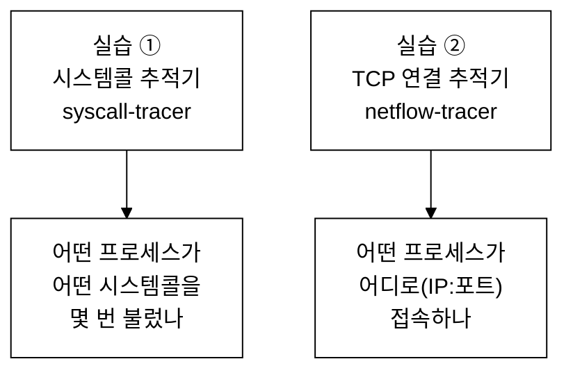
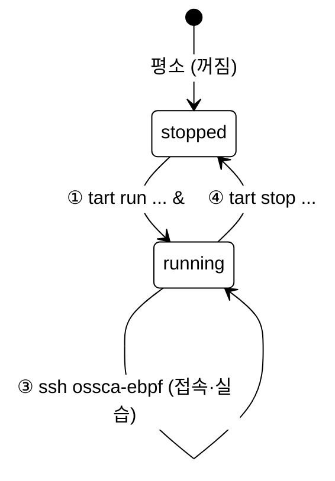
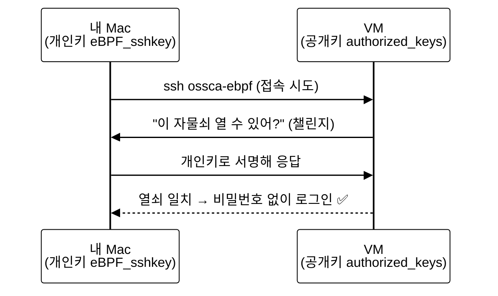
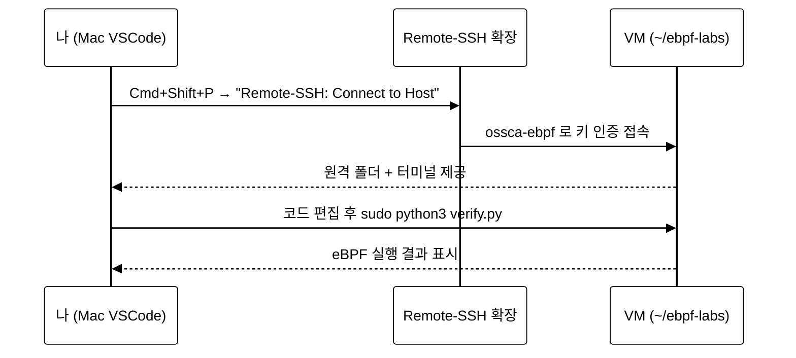
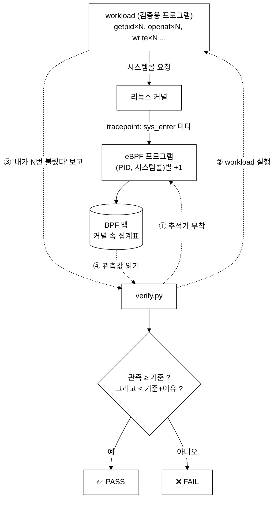
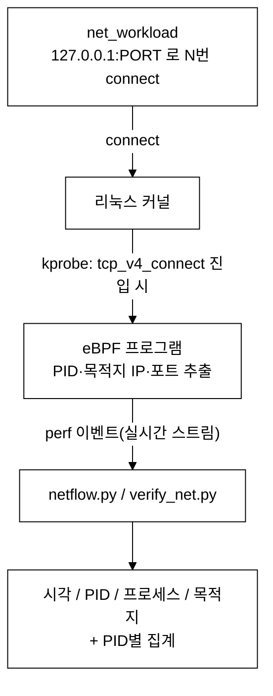

# eBPF 실습 랩 — 처음부터 끝까지 (강의자료식 안내서)

> 이 README 하나만 따라오면 **VM 켜는 법부터 → SSH 접속 → VSCode 연결 → eBPF 추적기 실행·검증**까지
> 전부 직접 할 수 있습니다. eBPF·리눅스·VM 을 처음 접한다는 가정으로, 개념 그림과 함께 천천히 설명합니다.
>
> 📌 **한 줄 핵심**: eBPF 는 *리눅스 커널 안에서 도는 작은 프로그램*인데 macOS 엔 없으므로,
> `tart` 로 띄운 **리눅스 VM 안에서** 실습합니다.

last_updated: 2026-06-11

---

## 📑 목차

- [강의 0. 전체 그림 — 우리는 무엇을 하나](#강의-0-전체-그림--우리는-무엇을-하나)
- [강의 1. VM 사용법 (tart) — 켜고·확인하고·끄기](#강의-1-vm-사용법-tart--켜고확인하고끄기)
- [강의 2. SSH 로 VM 에 접속하기](#강의-2-ssh-로-vm-에-접속하기)
- [강의 3. VSCode 로 VM 에 붙기 (원격 개발)](#강의-3-vscode-로-vm-에-붙기-원격-개발)
- [강의 4. 코드 동기화 (Mac ↔ VM)](#강의-4-코드-동기화-mac--vm)
- [강의 5. 실습 ① 시스템콜 추적기](#강의-5-실습--시스템콜-추적기)
- [강의 6. 실습 ② TCP 연결 추적기](#강의-6-실습--tcp-연결-추적기)
- [강의 7. ⭐ 처음부터 한 번에 따라하기 (복붙용)](#강의-7--처음부터-한-번에-따라하기-복붙용)
- [강의 8. 전체 명령어 치트시트](#강의-8-전체-명령어-치트시트)
- [강의 9. 막혔을 때 (문제 해결)](#강의-9-막혔을-때-문제-해결)
- [부록 A. 디렉터리 구조 / 실행 환경](#부록-a-디렉터리-구조--실행-환경)

> 더 깊은 내용: [환경설정 상세 가이드](docs/00_환경설정_가이드.md) · [개발 결과 보고서(증명)](docs/10_결과보고서.md)
>
> 📚 **이론부터 제대로 배우고 싶다면 → [eBPF 학부 강의자료 (한 학기 15주 과정)](docs/lecture/README.md)**
> — eBPF 가 무엇이고 어떻게 동작하는지, 커널 기초부터 네트워킹·보안·관측성 응용까지 그림과 함께 정리한 강의노트.
>
> 🧪 **짧고 다양한 예제로 빠르게 맛보고 싶다면 → [eBPF 예제 모음 15선](examples/README.md)**
> — 시스템콜·네트워크 소켓·파일·메모리·CPU 까지 bpftrace 한두 줄로 체험 (전부 실제 구동 검증됨).

---

## 강의 0. 전체 그림 — 우리는 무엇을 하나

우리 실습엔 **세 개의 층**이 있습니다. 내 Mac, 그 안에서 도는 리눅스 VM, 그리고 그 리눅스의 커널입니다.

```mermaid
%%{init: {"theme":"base","themeVariables":{"background":"#ffffff","primaryColor":"#ffffff","primaryBorderColor":"#000000","primaryTextColor":"#000000","secondaryColor":"#ffffff","secondaryBorderColor":"#000000","secondaryTextColor":"#000000","tertiaryColor":"#ffffff","tertiaryBorderColor":"#000000","tertiaryTextColor":"#000000","lineColor":"#000000","textColor":"#000000","mainBkg":"#ffffff","secondBkg":"#ffffff","clusterBkg":"#ffffff","clusterBorder":"#000000","edgeLabelBackground":"#ffffff","nodeBorder":"#000000","defaultLinkColor":"#000000","titleColor":"#000000","actorBkg":"#ffffff","actorBorder":"#000000","actorTextColor":"#000000","actorLineColor":"#000000","signalColor":"#000000","signalTextColor":"#000000","labelBoxBkgColor":"#ffffff","labelBoxBorderColor":"#000000","labelTextColor":"#000000","loopTextColor":"#000000","noteBkgColor":"#ffffff","noteBorderColor":"#000000","noteTextColor":"#000000","activationBkgColor":"#ffffff","activationBorderColor":"#000000","sequenceNumberColor":"#000000","cScale0":"#ffffff","cScale1":"#ffffff","cScale2":"#ffffff","cScale3":"#ffffff","cScale4":"#ffffff","cScale5":"#ffffff","cScale6":"#ffffff","cScale7":"#ffffff","cScale8":"#ffffff","cScale9":"#ffffff","cScale10":"#ffffff","cScale11":"#ffffff","cScaleLabel0":"#000000","cScaleLabel1":"#000000","cScaleLabel2":"#000000","cScaleLabel3":"#000000","cScaleLabel4":"#000000","cScaleLabel5":"#000000","cScaleLabel6":"#000000","cScaleLabel7":"#000000","cScaleLabel8":"#000000","cScaleLabel9":"#000000","cScaleLabel10":"#000000","cScaleLabel11":"#000000","pie1":"#ffffff","pie2":"#eeeeee","pie3":"#dddddd","pie4":"#cccccc","fontFamily":"Georgia, serif"}}}%%
flowchart LR
    subgraph MAC["💻 내 Mac (macOS)"]
        direction TB
        VSC["VSCode + 터미널\n(코드 편집·명령 입력)"]
    end
    subgraph VM["🐧 tart VM: ossca-ebpf-work (Ubuntu 24.04)"]
        direction TB
        TOOL["BCC / bpftrace\n(eBPF 작성·로드 도구)"]
        KERN["리눅스 커널\n(추적 대상)"]
        TOOL -->|eBPF 프로그램 심기| KERN
    end
    VSC -->|"① SSH (키 인증)"| TOOL
    VSC -.->|"② VSCode 원격 접속"| VM
```



| 층 | 역할 | 비유 |
|:---|:---|:---|
| **Mac** | 내가 타이핑하고 명령 내리는 곳 | 운전석 |
| **VM** | 실제 eBPF 가 실행되는 리눅스 | 엔진 |
| **커널** | eBPF 가 붙어서 들여다보는 대상 | 엔진 내부 센서 |

**왜 VM 이 필요한가?** eBPF 는 리눅스 커널 전용 기술입니다. macOS 커널엔 없습니다.
그래서 Apple Silicon Mac 에서 가볍게 리눅스를 띄우는 [`tart`](https://tart.run) 로
**리눅스 VM 을 만들어 그 안에서** 실습합니다. (VM = "컴퓨터 안의 가상 컴퓨터")

**무엇을 만들었나?** PID(프로세스)별로 추적하는 eBPF 도구 2개:



두 도구 모두 **"내가 일부러 N번 실행 → 추적기가 N번 잡았나"** 를 스스로 비교하는
**자기검증(self-test)** 코드를 갖고 있어, *정확히 동작함을 코드로 증명*합니다(강의 5·6).

---

## 강의 1. VM 사용법 (tart) — 켜고·확인하고·끄기

> tart 는 Mac 터미널에서 명령 한 줄로 리눅스 VM 을 켜고 끄는 도구입니다.
> 아래 명령은 전부 **Mac 터미널**(VM 안이 아님)에서 칩니다. 각 단계마다 *"이런 화면이 나오면 정상"* 을 함께 적어 둡니다.
>
> 🔰 **터미널·brew·SSH 가 완전히 처음이라면** → 한 단계씩 떠먹여 주는 입문 가이드부터 보세요:
> [docs/lecture/00a 준비 — 터미널과 VM 환경](docs/lecture/00a_준비_터미널과_VM환경.md)
> (화면이 멈춘 듯 보여도 정상인 경우, 비밀번호가 안 보이는 이유 등 초보가 겁먹는 지점을 모두 설명합니다.)

### 1-1. 준비물 — tart 가 깔려 있나 확인

가장 먼저, 내 Mac 에 tart 가 설치돼 있는지 봅니다.

```bash
which tart        # 경로가 나오면 설치됨
tart --version    # 버전 확인
```

**이렇게 나오면 정상:**

```text
/opt/homebrew/bin/tart
2.31.0
```

> 만약 `tart not found` 라면 설치합니다(Apple Silicon Mac 필요):
> ```bash
> brew install cirruslabs/cli/tart
> ```

### 1-2. VM 의 한살이 (lifecycle) — 전체 그림

VM 은 아래 상태를 오갑니다. 우리는 **꺼짐(stopped) → 켜기(run) → 사용 → 끄기(stop)** 순서로 씁니다.



### 1-3. 단계별 따라하기 (실제 출력과 함께)

#### ① VM 목록 확인 — 어떤 VM 이 있나

```bash
tart list
```

**이렇게 나옵니다** (우리가 쓸 것은 `ossca-ebpf-work` 한 줄):

```text
Source Name              Disk Size Accessed   State
local  ossca-ebpf-base   50   4    1시간 전    stopped
local  ossca-ebpf-work   50   4    24분 전     stopped   ← 이 VM 을 씁니다
local  ...               ...                  stopped
```

- 맨 오른쪽 `State` 가 `stopped` 면 꺼진 것 → 다음 단계에서 켭니다.
- `ossca-ebpf-work` 가 보이면 준비 끝. (안 보이면 → [1-4](#1-4-vm-이-아예-없을-때-새로-준비하기))

#### ② VM 켜기

```bash
tart run ossca-ebpf-work --no-graphics &
```

- `--no-graphics` : 화면 창 없이(headless) 백그라운드로 실행.
- 맨 끝의 `&` : 터미널을 계속 쓸 수 있게 백그라운드로 보냄.
- 실행하면 `[1] 27460` 처럼 **작업 번호 + 프로세스 번호**가 찍힙니다(정상). 부팅에 **10~20초** 걸립니다.

#### ③ 부팅이 끝났는지 확인

방법 A — IP 가 나오면 부팅 완료:

```bash
tart ip ossca-ebpf-work        # 예: 192.168.66.35
```

- 주소(예: `192.168.66.35`)가 나오면 준비 완료 ✅
- 빈 줄이나 오류면 아직 부팅 중 → 몇 초 뒤 다시.

방법 B (권장) — **접속될 때까지 자동으로 기다리기** (다음 강의의 `ssh` 사용):

```bash
until ssh ossca-ebpf 'true' 2>/dev/null; do echo "VM 부팅 대기..."; sleep 2; done
echo "VM 준비 완료 ✅"
```

> 이 한 줄을 켠 직후에 실행하면, 부팅이 끝나는 순간 `VM 준비 완료 ✅` 가 떠서 *언제 접속 가능한지 직접 알 필요가 없습니다.*

#### ④ 다 쓴 뒤 끄기

```bash
tart stop ossca-ebpf-work
```

VM 은 켜둔 동안 Mac 자원(메모리·CPU)을 쓰므로, 실습이 끝나면 꼭 꺼 줍니다.

#### 상태 빠른 참조

| 보이는 것 | 뜻 | 할 일 |
|:---|:---|:---|
| `tart list` 의 `State = running` | 켜져 있음 | 바로 접속 가능 → [강의 2](#강의-2-ssh-로-vm-에-접속하기) |
| `tart list` 의 `State = stopped` | 꺼져 있음 | `tart run ...` 으로 켜기 |
| `tart ip` 가 빈 줄/오류 | 부팅 중 | 몇 초 더 대기 |
| `ssh` 가 멈춤/거부 | 부팅 전이거나 키 미설정 | 부팅 대기 루프 / [강의 9](#강의-9-막혔을-때-문제-해결) |

> 💡 **IP 는 켤 때마다 바뀔 수 있습니다.** 그래서 우리는 IP 를 외우지 않고, 다음 강의의 SSH 설정(`ossca-ebpf`)이
> *IP 를 매번 자동으로 찾아 줍니다.* → 항상 `ssh ossca-ebpf` 한 줄이면 끝.

### 1-4. VM 이 아예 없을 때 (새로 준비하기)

`tart list` 에 `ossca-ebpf-work` 가 안 보이는 *새 컴퓨터*라면, 베이스 이미지로 VM 을 한 번 만들어 두면 됩니다.
(이미 있는 사람은 이 단계를 건너뜁니다.)

```bash
# (1) 우분투 베이스에서 실습용 VM 복제 (이름은 자유)
tart clone ghcr.io/cirruslabs/ubuntu:latest ossca-ebpf-work
# 또는 기존 베이스가 있으면:  tart clone ossca-ebpf-base ossca-ebpf-work

# (2) 켜고 부팅 대기
tart run ossca-ebpf-work --no-graphics &
sleep 20
ip=$(tart ip ossca-ebpf-work); echo "VM IP = $ip"
```

그다음 **SSH 키 심기 + eBPF 도구 설치**가 필요합니다(처음 한 번만). 구체적 절차는
[docs/00 환경설정 가이드 §2.4](docs/00_환경설정_가이드.md#24-참고-새-vm-에서-키를-처음-심는-방법) 와 [§3](docs/00_환경설정_가이드.md#3-ebpf-도구-이미-설치됨) 에 정리돼 있습니다(요약):

```bash
# (3) ebpf 사용자 + 내 공개키 심기 (cirruslabs 우분투 기본 계정 admin/admin)
ip=$(tart ip ossca-ebpf-work); PUB=$(cat ~/.ssh/eBPF_sshkey.pub)
sshpass -p admin ssh -o StrictHostKeyChecking=no admin@$ip "echo admin | sudo -S bash -c '
  useradd -m -s /bin/bash ebpf; usermod -aG sudo ebpf
  mkdir -p /home/ebpf/.ssh; echo \"$PUB\" > /home/ebpf/.ssh/authorized_keys
  chmod 700 /home/ebpf/.ssh; chmod 600 /home/ebpf/.ssh/authorized_keys; chown -R ebpf:ebpf /home/ebpf/.ssh
  echo \"ebpf ALL=(ALL) NOPASSWD:ALL\" > /etc/sudoers.d/ebpf; chmod 440 /etc/sudoers.d/ebpf'"

# (4) eBPF 도구 설치 (VM 안)
ssh ossca-ebpf 'sudo apt-get update && sudo apt-get install -y \
  bpfcc-tools python3-bpfcc bpftrace linux-headers-$(uname -r) auditd gcc rsync'

# (5) 실습 코드 올리기 (내 Mac 저장소 루트에서)
scripts/sync-to-vm.sh
```

> 위 (3)~(5)는 **VM 을 처음 만들 때 딱 한 번**만 합니다. 그 뒤로는 [1-3](#1-3-단계별-따라하기-실제-출력과-함께)의 켜기/끄기만 반복하면 됩니다.
> (이 컴퓨터의 `ossca-ebpf-work` 는 이미 (3)~(5)가 끝나 있습니다.)

---

## 강의 2. SSH 로 VM 에 접속하기

> SSH = 원격 컴퓨터(VM)에 안전하게 들어가 명령을 내리는 표준 방법.

### 2-1. "키 인증" 개념 그림

비밀번호 대신 **열쇠 한 쌍(공개키·개인키)** 으로 들어갑니다. 공개키(자물쇠)를 VM 에 붙여두면,
짝이 되는 개인키(열쇠)를 가진 내 Mac 만 비밀번호 없이 열 수 있습니다.



### 2-2. 이 컴퓨터엔 이미 설정돼 있습니다

원작자 Mac 에는 아래가 준비되어 있어, **그냥 `ssh ossca-ebpf` 한 줄이면 접속**됩니다.

| 준비물 | 위치 | 비고 |
|:---|:---|:---|
| 개인키 | `~/.ssh/eBPF_sshkey` | 내 Mac 에만 있는 비밀 |
| SSH 설정 | `~/.ssh/config` 의 `Host ossca-ebpf` 항목 | IP 자동 추적 |
| VM 사용자 | `ebpf` (비밀번호 없이 sudo 가능) | 공개키가 심어져 있음 |

`~/.ssh/config` 의 핵심 항목(참고):

```sshconfig
Host ossca-ebpf
    HostName dummy-ip
    User ebpf
    IdentityFile ~/.ssh/eBPF_sshkey
    ProxyCommand nc $(tart ip ossca-ebpf-work) %p   # ← IP 를 매번 자동으로 알아냄
    StrictHostKeyChecking no
    UserKnownHostsFile /dev/null
```

> ⚠️ **다른 Mac 으로 옮길 땐?** 위 `~/.ssh/config` 항목과 개인키 `~/.ssh/eBPF_sshkey` 는
> *그 컴퓨터에만 있는 사전 준비물* 입니다. 새 Mac 에선 이 두 가지를 먼저 갖춰야 `ssh ossca-ebpf` 가 됩니다.
> (새 VM 에 키를 처음 심는 방법은 [docs/00 §2.4](docs/00_환경설정_가이드.md#24-참고-새-vm-에서-키를-처음-심는-방법) 참고)

### 2-3. 접속해 보기

```bash
# VM 이 켜져 있어야 합니다(강의 1). 막 켰다면 부팅이 끝날 때까지 기다리세요:
until ssh ossca-ebpf 'true' 2>/dev/null; do echo "부팅 대기..."; sleep 2; done

# 접속해서 누구인지·커널 버전 확인
ssh ossca-ebpf 'whoami && uname -r'
# → ebpf / 6.17.0-...   이렇게 나오면 성공!
```

> `Permission denied` 가 나오면 키 미설치 상태입니다 → [강의 9](#강의-9-막혔을-때-문제-해결) 참고.

---

## 강의 3. VSCode 로 VM 에 붙기 (원격 개발)

> 터미널만으로도 실습 가능하지만, VSCode 로 붙으면 VM 안의 코드를 **내 Mac 화면에서 그대로 편집**하고
> 통합 터미널에서 바로 실행할 수 있어 훨씬 편합니다.



**따라하기**

1. VSCode 확장 **"Remote - SSH"**(Microsoft, `ms-vscode-remote.remote-ssh`) 설치.
2. `Cmd+Shift+P` → **Remote-SSH: Connect to Host...** → 목록에서 **`ossca-ebpf`** 선택.
3. 좌측 하단에 `SSH: ossca-ebpf` 가 보이면 접속 성공.
4. **File → Open Folder** → `/home/ebpf/ebpf-labs` 열기.
5. VSCode 통합 터미널(`Ctrl+\``)에서 실습 명령(아래 강의 5·6)을 그대로 실행.

> ⚠️ eBPF 로드는 관리자 권한이 필요하므로 명령 앞에 **`sudo`** 를 붙입니다
> (`ebpf` 사용자는 비밀번호 없이 sudo 됩니다).

---

## 강의 4. 코드 동기화 (Mac ↔ VM)

이 저장소의 코드는 **VM 의 `~/ebpf-labs/`** 안에 있어야 실행됩니다. (제공된 VM 엔 이미 들어 있습니다.)

```mermaid
%%{init: {"theme":"base","themeVariables":{"background":"#ffffff","primaryColor":"#ffffff","primaryBorderColor":"#000000","primaryTextColor":"#000000","secondaryColor":"#ffffff","secondaryBorderColor":"#000000","secondaryTextColor":"#000000","tertiaryColor":"#ffffff","tertiaryBorderColor":"#000000","tertiaryTextColor":"#000000","lineColor":"#000000","textColor":"#000000","mainBkg":"#ffffff","secondBkg":"#ffffff","clusterBkg":"#ffffff","clusterBorder":"#000000","edgeLabelBackground":"#ffffff","nodeBorder":"#000000","defaultLinkColor":"#000000","titleColor":"#000000","actorBkg":"#ffffff","actorBorder":"#000000","actorTextColor":"#000000","actorLineColor":"#000000","signalColor":"#000000","signalTextColor":"#000000","labelBoxBkgColor":"#ffffff","labelBoxBorderColor":"#000000","labelTextColor":"#000000","loopTextColor":"#000000","noteBkgColor":"#ffffff","noteBorderColor":"#000000","noteTextColor":"#000000","activationBkgColor":"#ffffff","activationBorderColor":"#000000","sequenceNumberColor":"#000000","cScale0":"#ffffff","cScale1":"#ffffff","cScale2":"#ffffff","cScale3":"#ffffff","cScale4":"#ffffff","cScale5":"#ffffff","cScale6":"#ffffff","cScale7":"#ffffff","cScale8":"#ffffff","cScale9":"#ffffff","cScale10":"#ffffff","cScale11":"#ffffff","cScaleLabel0":"#000000","cScaleLabel1":"#000000","cScaleLabel2":"#000000","cScaleLabel3":"#000000","cScaleLabel4":"#000000","cScaleLabel5":"#000000","cScaleLabel6":"#000000","cScaleLabel7":"#000000","cScaleLabel8":"#000000","cScaleLabel9":"#000000","cScaleLabel10":"#000000","cScaleLabel11":"#000000","pie1":"#ffffff","pie2":"#eeeeee","pie3":"#dddddd","pie4":"#cccccc","fontFamily":"Georgia, serif"}}}%%
flowchart LR
    L["Mac 저장소\n/Users/.../ebpf/projects"] -->|"scripts/sync-to-vm.sh (rsync)"| R["VM\n~/ebpf-labs/projects"]
```



```bash
# 내 Mac 의 저장소 루트에서 실행 → VM 으로 코드 복사
scripts/sync-to-vm.sh
```

> - VSCode Remote-SSH 로 **VM 위에서 직접 편집**한다면 이 동기화는 필요 없습니다.
> - 혹시 VM 의 `~/ebpf-labs` 가 비어 있으면, 위 스크립트를 **한 번 먼저** 실행하세요.

---

## 강의 5. 실습 ① 시스템콜 추적기

> **시스템콜**이란? 프로그램이 파일 열기·읽기·네트워크 같은 일을 하려고 **커널에 보내는 요청**입니다.
> 프로그램의 모든 "행동"은 결국 시스템콜로 드러나므로, 이를 추적하면 프로세스가 *무슨 짓을 하는지* 알 수 있습니다.

### 5-1. 동작 원리 그림



### 5-2. 실행 명령 (VM 안에서)

```bash
cd ~/ebpf-labs/projects/syscall-tracer

# (A) 자기검증 — 추적이 정확한지 코드로 증명 (기본 3000회)
sudo python3 verify.py
sudo python3 verify.py 10000      # 호출 횟수 키우기

# (B) 실시간 추적 — 지금 시스템에서 어떤 프로세스가 무슨 시스템콜을 쓰나
sudo python3 tracer.py --duration 5            # 5초간 전체
sudo python3 tracer.py --pid 1234              # 특정 PID 만
sudo python3 tracer.py --comm sshd --top 10    # 이름이 sshd 인 것, 상위 10개
```

### 5-3. 이렇게 나오면 성공 (실제 출력)

```text
================================================================
  시스템콜 추적 검증 결과  (대상 PID = 3062, 호출 3,000회 기준)
================================================================
  시스템콜      기준값      관측값      차이    판정
  close        3,001      3,006       +5    ✅ PASS
  getpid       3,000      3,001       +1    ✅ PASS
  getppid      3,000      3,000       +0    ✅ PASS
  openat       3,001      3,003       +2    ✅ PASS
  read         3,000      3,001       +1    ✅ PASS
  write        3,000      3,001       +1    ✅ PASS
  >>> 검증 통과: 추적기가 모든 대상 시스템콜을 정확히 포착했습니다. <<<
```

> **읽는 법**: *기준값* = 내가 코드로 일부러 부른 횟수(거짓말 불가). *관측값* = eBPF 가 센 횟수.
> *차이*가 `+0~+5` 로 아주 작고, **호출을 3천→1만→5만으로 늘려도 차이가 그대로**면
> = 추적기가 단 하나도 놓치지 않았다는 강력한 증거입니다. (자세한 증명: [보고서 §3](docs/10_결과보고서.md))

---

## 강의 6. 실습 ② TCP 연결 추적기

> "어떤 프로세스가 **어디로 접속**하는가"를 잡습니다. 보안·관측의 기본기로,
> CNCF 의 **Cilium·Falco** 같은 도구가 쓰는 바로 그 기법(kprobe)을 축소판으로 체험합니다.

### 6-1. 동작 원리 그림



> 실습 ①(시스템콜)과의 차이: ①은 *tracepoint* 로 횟수를 **맵에 모았고**, ②는 *kprobe* 로
> 개별 연결을 **실시간 이벤트**로 받습니다. eBPF 의 서로 다른 두 부착 방식을 모두 체험하는 셈입니다.

### 6-2. 실행 명령 (VM 안에서)

```bash
cd ~/ebpf-labs/projects/netflow-tracer

# (A) 자기검증 — 127.0.0.1 로 N번 연결 → 추적기가 다 잡는지
sudo python3 verify_net.py
sudo python3 verify_net.py 200

# (B) 실시간 추적 — 켜둔 채로 다른 창에서 curl 등을 해보면 잡힙니다
sudo python3 netflow.py --duration 10
#   다른 SSH 창에서:  curl --max-time 2 http://127.0.0.1:22
```

### 6-3. 이렇게 나오면 성공 (실제 출력)

```text
시각          PID  프로세스          목적지
------------------------------------------------------------
01:55:48     3827  net_workload     127.0.0.1:22
01:55:48     3829  net_workload     127.0.0.1:65000
01:55:48     3833  curl             127.0.0.1:22

=== PID별 TCP 연결 시도 횟수 ===
  PID    3827 :      4 회
  PID    3829 :      3 회
  PID    3833 :      1 회
```

> 같은 도구로 만든 연결뿐 아니라 **별도의 `curl` 프로세스**가 보낸 연결까지,
> 프로세스 이름·목적지·PID 로 구분해 잡은 게 보입니다.
> (범위: 학습용 단순화를 위해 IPv4 연결만 추적합니다.)

---

## 강의 7. ⭐ 처음부터 한 번에 따라하기 (복붙용)

> VM 이 꺼진 상태에서 **검증 성공까지** 한 번에. 아래 블록을 **Mac 터미널**에 그대로 붙여넣으세요.

```bash
# ── ① VM 켜고 부팅 끝날 때까지 대기 ─────────────────────────────
tart run ossca-ebpf-work --no-graphics &
until ssh ossca-ebpf 'true' 2>/dev/null; do echo "VM 부팅 대기..."; sleep 2; done
echo "VM 준비 완료 ✅"

# ── ② (필요 시) 코드가 VM 에 없으면 한 번 동기화 ────────────────
ssh ossca-ebpf 'test -d ~/ebpf-labs/projects' || scripts/sync-to-vm.sh

# ── ③ 실습 ① 시스템콜 추적기 자기검증 ──────────────────────────
ssh ossca-ebpf 'cd ~/ebpf-labs/projects/syscall-tracer && sudo python3 verify.py'

# ── ④ 실습 ② TCP 연결 추적기 자기검증 ──────────────────────────
ssh ossca-ebpf 'cd ~/ebpf-labs/projects/netflow-tracer && sudo python3 verify_net.py'

# ── ⑤ 다 했으면 VM 끄기 ────────────────────────────────────────
# tart stop ossca-ebpf-work
```

> 위 ③·④ 에서 마지막에 **"검증 통과"** 가 보이면 모든 게 정상 동작하는 것입니다. 🎉

---

## 강의 8. 전체 명령어 치트시트

> 이 표만 보면 됩니다. **위치** 열이 어디서 치는 명령인지 알려줍니다.

| 목적 | 위치 | 명령어 |
|:---|:---|:---|
| VM 목록 보기 | Mac | `tart list` |
| VM 켜기 | Mac | `tart run ossca-ebpf-work --no-graphics &` |
| 부팅 대기 | Mac | `until ssh ossca-ebpf 'true' 2>/dev/null; do sleep 2; done` |
| VM IP 확인 | Mac | `tart ip ossca-ebpf-work` |
| VM 끄기 | Mac | `tart stop ossca-ebpf-work` |
| SSH 접속 | Mac | `ssh ossca-ebpf` |
| 접속 확인 | Mac | `ssh ossca-ebpf 'whoami && uname -r'` |
| 코드 동기화 | Mac (저장소 루트) | `scripts/sync-to-vm.sh` |
| **① 시스템콜 검증** | VM | `cd ~/ebpf-labs/projects/syscall-tracer && sudo python3 verify.py` |
| ① 검증(횟수 지정) | VM | `sudo python3 verify.py 10000` |
| ① 실시간 추적 | VM | `sudo python3 tracer.py --duration 5` |
| ① 특정 PID 만 | VM | `sudo python3 tracer.py --pid <PID>` |
| **② TCP 검증** | VM | `cd ~/ebpf-labs/projects/netflow-tracer && sudo python3 verify_net.py` |
| ② 검증(횟수 지정) | VM | `sudo python3 verify_net.py 200` |
| ② 실시간 추적 | VM | `sudo python3 netflow.py --duration 10` |
| (탐색용) bpftrace 한 줄 | VM | `sudo bpftrace -e 'tracepoint:raw_syscalls:sys_enter { @[comm]=count(); }'` |
| Make 단축 명령 | VM | `make verify` (각 프로젝트 폴더에서) |

---

## 강의 9. 막혔을 때 (문제 해결)

| 증상 | 원인 / 해결 |
|:---|:---|
| `ssh ossca-ebpf` 가 멈춤/실패 | VM 이 꺼졌거나 부팅 중 → `tart run ossca-ebpf-work --no-graphics &` 후 부팅 대기 루프 사용 |
| `Permission denied (publickey)` | VM 이 새로 만들어져 키 미설치 → [docs/00 §2.4](docs/00_환경설정_가이드.md#24-참고-새-vm-에서-키를-처음-심는-방법) |
| `~/ebpf-labs ... No such file` | 코드 미동기화 → 저장소 루트에서 `scripts/sync-to-vm.sh` |
| `Operation not permitted` | `sudo` 빠뜨림 — eBPF 로드는 관리자 권한 필요 |
| `ausyscall: command not found` | VM 에서 `sudo apt-get install -y auditd` |
| `No such file: cc` | VM 에서 `sudo apt-get install -y gcc` |
| BPF 컴파일 헤더 오류 | VM 에서 `sudo apt-get install -y linux-headers-$(uname -r)` |
| VSCode 목록에 `ossca-ebpf` 없음 | `~/.ssh/config` 에 해당 Host 항목 필요([강의 2-2](#2-2-이-컴퓨터엔-이미-설정돼-있습니다)) |

---

## 부록 A. 디렉터리 구조 / 실행 환경

```
ebpf/
├── README.md                       ← 본 안내서 (지금 읽는 문서)
├── projects/
│   ├── syscall-tracer/             ← 실습 ①: 시스템콜 추적
│   │   ├── bpf/syscall_count.c     ← eBPF 프로그램 (커널에서 실행)
│   │   ├── tracer.py               ← 실시간 추적 CLI
│   │   ├── workload.c              ← 검증용: 정해진 횟수만큼 시스템콜 호출
│   │   ├── verify.py               ← 검증 하네스 (관측 vs 기준 비교)
│   │   └── README.md
│   └── netflow-tracer/             ← 실습 ②: TCP 연결 추적
│       ├── bpf/tcpconnect.c        ← eBPF 프로그램
│       ├── netflow.py              ← 실시간 추적 CLI
│       ├── net_workload.c          ← 검증용: 정해진 횟수만큼 TCP 연결
│       ├── verify_net.py           ← 검증 하네스
│       └── README.md
├── scripts/
│   └── sync-to-vm.sh               ← 로컬 코드 → VM 동기화
└── docs/
    ├── 00_환경설정_가이드.md         ← 환경·SSH·VSCode 상세
    ├── 10_결과보고서.md              ← "정확히 동작함"의 증명 (실행 캡처)
    └── captures/                   ← 실제 실행 출력 기록 (원본)
```

**검증된 실행 환경**

| 항목 | 값 |
|:---|:---|
| 호스트 | Apple Silicon Mac (macOS) + tart |
| 게스트 VM | Ubuntu 24.04.4 LTS / **커널 6.17** (aarch64) |
| eBPF 도구 | bpftrace 0.20.2, BCC(python3-bpfcc) 0.29.1, libbpf 1.3, clang 18 |
| BTF | `/sys/kernel/btf/vmlinux` 지원 (최신 eBPF 기능 가능) |

---

> 🎓 **다음 걸음**: 동작 증명과 설계 설명은 [개발 결과 보고서](docs/10_결과보고서.md) 에,
> 환경 구성의 세부는 [환경설정 가이드](docs/00_환경설정_가이드.md) 에 정리되어 있습니다.
