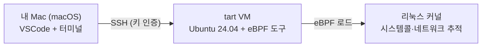
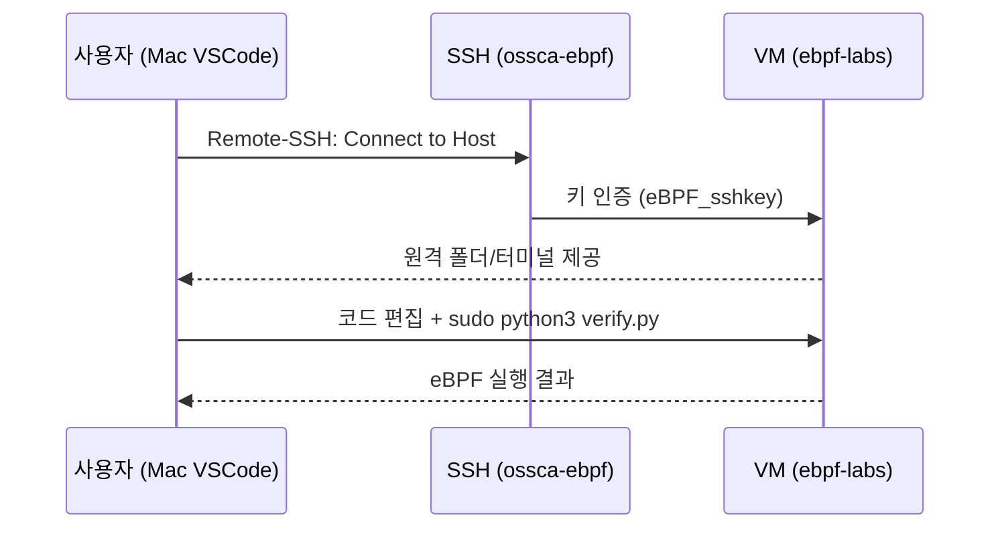

# 환경설정 가이드 — tart VM + SSH 키 교환 + VSCode 원격 접속

last_updated: 2026-06-11

> 이 문서는 **eBPF 를 처음 접하는 사람**도 따라 할 수 있도록 쓰였다.
> 핵심 개념 한 줄: **eBPF 는 리눅스 커널 안에서 안전하게 돌아가는 미니 프로그램**이고,
> macOS 에는 없으므로 tart 로 띄운 **리눅스 VM 안에서** 실습한다.

---

## 0. 큰 그림



- **Mac**: 코드를 편집(VSCode)하고 명령을 내리는 곳.
- **VM**: 실제로 eBPF 프로그램이 실행되는 리눅스. tart 로 만든 `ossca-ebpf-work`.
- **커널**: eBPF 가 붙어서 시스템콜·네트워크 이벤트를 관측하는 대상.

---

## 1. tart VM 켜고 끄기

이미 만들어 둔 VM 목록 확인:

```bash
tart list
```

`ossca-ebpf-work` 를 그래픽 창 없이(headless) 백그라운드로 실행:

```bash
tart run ossca-ebpf-work --no-graphics &
```

VM 의 IP 확인 (부팅에 10~20초):

```bash
tart ip ossca-ebpf-work      # 예: 192.168.66.35
```

끌 때:

```bash
tart stop ossca-ebpf-work
```

> 💡 IP 는 부팅할 때마다 바뀔 수 있다. 아래 SSH 설정은 **IP 가 바뀌어도 자동으로 따라가도록** 되어 있다.

---

## 2. SSH 키 교환 (이미 설정 완료 — 원리 설명)

### 2.1 키와 사용자

| 항목 | 값 |
|:---|:---|
| 개인키 (Mac) | `~/.ssh/eBPF_sshkey` |
| 공개키 (Mac) | `~/.ssh/eBPF_sshkey.pub` |
| VM 사용자 | `ebpf` (passwordless sudo 권한) |
| 공개키 설치 위치 | VM 의 `/home/ebpf/.ssh/authorized_keys` |

키 인증이란: **공개키를 VM 에 심어두면, 그 짝인 개인키를 가진 Mac 만 비밀번호 없이 접속**할 수 있다.

### 2.2 `~/.ssh/config` 항목 (핵심)

```sshconfig
Host ossca-ebpf
    HostName dummy-ip
    User ebpf
    IdentityFile ~/.ssh/eBPF_sshkey
    ProxyCommand nc $(tart ip ossca-ebpf-work) %p
    StrictHostKeyChecking no
    UserKnownHostsFile /dev/null
    LogLevel ERROR
```

- `ProxyCommand nc $(tart ip ossca-ebpf-work) %p` 가 **매 접속 시 tart 에게 현재 IP 를 물어** 자동 연결한다.
  → IP 가 바뀌어도 `ssh ossca-ebpf` 한 줄이면 끝.
- `StrictHostKeyChecking no` + `UserKnownHostsFile /dev/null` 은 IP 가 바뀌는 실습용 VM 에서
  호스트키 경고가 안 뜨도록 한 설정.

### 2.3 접속 테스트

```bash
ssh ossca-ebpf 'whoami && uname -r'
# → ebpf / 6.17.0-...
```

### 2.4 (참고) 새 VM 에서 키를 처음 심는 방법

tart 의 cirruslabs Ubuntu 이미지는 기본 계정이 `admin`/`admin` 이다.
새로 만든 VM 에 `ebpf` 사용자와 공개키를 심으려면:

```bash
ip=$(tart ip <vm-name>)
PUB=$(cat ~/.ssh/eBPF_sshkey.pub)
sshpass -p admin ssh -o StrictHostKeyChecking=no admin@$ip "
  echo admin | sudo -S bash -c '
    useradd -m -s /bin/bash ebpf
    usermod -aG sudo ebpf
    mkdir -p /home/ebpf/.ssh
    echo \"$PUB\" > /home/ebpf/.ssh/authorized_keys
    chmod 700 /home/ebpf/.ssh && chmod 600 /home/ebpf/.ssh/authorized_keys
    chown -R ebpf:ebpf /home/ebpf/.ssh
    echo \"ebpf ALL=(ALL) NOPASSWD:ALL\" > /etc/sudoers.d/ebpf
  '
"
```

---

## 3. eBPF 도구 (이미 설치됨)

`ossca-ebpf-work` VM 에는 다음이 설치되어 있다:

| 도구 | 버전 | 용도 |
|:---|:---|:---|
| BCC (`python3-bpfcc`) | 0.29.1 | Python 으로 eBPF 작성·로드 (본 프로젝트가 사용) |
| bpftrace | 0.20.2 | 한 줄 eBPF 스크립트 (빠른 탐색용) |
| libbpf | 1.3 | C 기반 eBPF 라이브러리 |
| clang | 18 | eBPF 바이트코드 컴파일러 |
| auditd(`ausyscall`) | — | 시스템콜 번호 ↔ 이름 변환 (BCC 가 사용) |
| gcc | — | 검증용 워크로드(C) 컴파일 |

> 혹시 새 VM 이라 도구가 없다면:
> ```bash
> sudo apt-get update
> sudo apt-get install -y bpfcc-tools python3-bpfcc bpftrace linux-headers-$(uname -r) auditd gcc
> ```

**동작 확인 (eBPF 가 실제로 도는지 1줄 테스트):**

```bash
sudo bpftrace -e 'tracepoint:raw_syscalls:sys_enter { @[comm] = count(); }'
# 2~3초 후 Ctrl-C → 프로세스별 시스템콜 횟수가 나오면 정상
```

---

## 4. VSCode 로 VM 에 원격 접속하기

### 4.1 확장 설치

VSCode 에서 **Remote - SSH** 확장 설치 (Microsoft, 확장 ID: `ms-vscode-remote.remote-ssh`).

### 4.2 접속

1. `Cmd+Shift+P` → **Remote-SSH: Connect to Host...**
2. 목록에서 **`ossca-ebpf`** 선택 (위 `~/.ssh/config` 항목을 자동 인식).
3. 새 창이 열리고 좌측 하단에 `SSH: ossca-ebpf` 표시되면 접속 성공.
4. **File → Open Folder** → `/home/ebpf/ebpf-labs` 열기.

이제 VM 안의 코드를 Mac VSCode 에서 그대로 편집하고, VSCode 통합 터미널에서
`sudo python3 verify.py` 를 바로 실행할 수 있다.



> ⚠️ eBPF 로드는 root 권한이 필요하다. VSCode 터미널에서도 `sudo` 를 붙여 실행한다
> (`ebpf` 사용자는 비밀번호 없이 sudo 가능하도록 설정됨).

---

## 5. 코드 동기화 (Mac ↔ VM)

Mac 의 이 저장소에서 코드를 수정한 뒤 VM 으로 보내려면:

```bash
# 저장소 루트에서
scripts/sync-to-vm.sh
```

내부적으로 `rsync` 로 `projects/` 를 `ossca-ebpf:~/ebpf-labs/` 에 복사한다.
(VSCode Remote-SSH 로 VM 위에서 직접 편집한다면 동기화는 불필요하다.)

---

## 6. 자주 막히는 곳 (Troubleshooting)

| 증상 | 원인 / 해결 |
|:---|:---|
| `ssh ossca-ebpf` 가 멈춤/실패 | VM 이 꺼져 있음 → `tart run ossca-ebpf-work --no-graphics &` 후 20초 대기 |
| `Permission denied (publickey)` | VM 이 새로 만들어져 키 미설치 → [§2.4](#24-참고-새-vm-에서-키를-처음-심는-방법) 수행 |
| `ausyscall: command not found` | `sudo apt-get install -y auditd` |
| `No such file: cc` | `sudo apt-get install -y gcc` |
| BPF 컴파일 에러(헤더 관련) | `sudo apt-get install -y linux-headers-$(uname -r)` |
| `Operation not permitted` | `sudo` 를 빼먹음 — eBPF 로드는 root 필요 |
