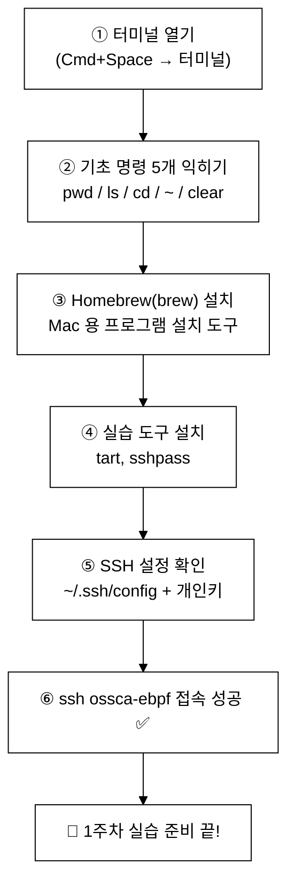
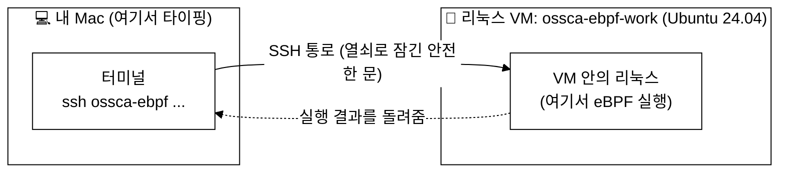
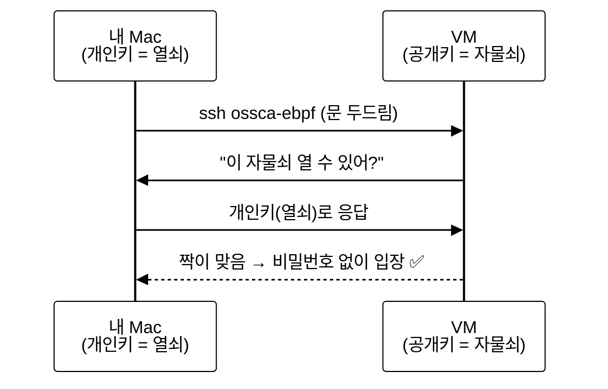

# 0주차(준비) — 처음이라면: 터미널과 VM 환경
> 터미널을 처음 열어보는 사람도, eBPF 실습 VM 에 접속하기까지 한 단계도 건너뛰지 않고 떠먹여 주는 "0주차" 준비 자료
last_updated: 2026-06-11

## 이 문서를 읽는 사람에게

안녕하세요. 이 문서는 **"컴퓨터 터미널이라는 걸 처음 열어본다"** 는 1학년을 위해 썼습니다.
리눅스도, 터미널도, 명령어도 한 번도 안 써봤다고 가정하고, **정말 하나도 안 건너뛰고** 설명합니다.

그러니 이런 걱정은 접어두세요.

- "나만 모르는 거 아닐까?" → 아닙니다. 누구나 처음엔 똑같습니다.
- "명령어를 잘못 치면 컴퓨터가 망가지지 않을까?" → 이 문서에 나오는 명령으로는 망가지지 않습니다.
- "화면이 멈춘 것 같은데 고장 난 거 아닐까?" → 대부분 **정상**입니다. (이건 따로 한 챕터를 통째로 써서 설명합니다 → [4번 챕터](#4-멈춘-것처럼-보여도-정상인-경우들-제일-중요))

> 📌 **이 문서의 목표 한 줄**: 터미널을 처음 켜서 → 필요한 도구를 깔고 → 실습용 리눅스 VM 에 `ssh ossca-ebpf` 한 줄로
> 접속하는 데 성공하는 것. 여기까지만 되면 정규 1주차 수업을 따라갈 준비가 끝납니다.

---

## 우리가 가려는 길 (전체 흐름)

먼저 큰 그림부터 봅시다. 아래가 이 문서에서 차례로 할 일입니다.



겁먹지 마세요. 한 칸씩 천천히 가면 됩니다. 지금부터 ①번 "터미널 열기"부터 시작합니다.

---

## 1. 터미널이 뭔가요? 어떻게 여나요?

### 터미널이라는 게 대체 뭐죠?

우리가 평소 컴퓨터를 쓰는 방식은 **마우스로 아이콘을 클릭**하는 것입니다. 폴더를 더블클릭해서 열고,
휴지통으로 파일을 끌어다 버리죠. 이걸 "그래픽 방식(GUI)"이라고 합니다.

**터미널**은 그 대신 **글자(명령어)로 컴퓨터에게 시키는 창**입니다.

> 비유: 식당에서 메뉴판 사진을 손가락으로 가리키는 게 마우스라면(GUI),
> "김치찌개 2인분 주세요" 라고 **말로 주문**하는 게 터미널입니다. 익숙해지면 말로 하는 게 훨씬 빠르고 정확합니다.

eBPF 실습은 리눅스 컴퓨터(VM)에게 명령을 내려야 하는데, 그 컴퓨터는 화면이 없습니다.
그래서 **글자로 명령하는 터미널**이 꼭 필요합니다.

### macOS 에서 터미널 여는 법 (한 단계씩)

1. 키보드에서 **`Cmd`(커맨드) 키와 `Space`(스페이스바) 를 동시에** 누릅니다.
   - `Cmd` 키는 스페이스바 양옆에 있는, ⌘ 모양이 그려진 키입니다.
   - 그러면 화면 가운데(또는 위쪽)에 작은 검색창이 뜹니다. 이게 **Spotlight(스포트라이트)** 입니다.
2. 그 검색창에 **`터미널`** 이라고 칩니다. (또는 영어로 `Terminal`)
3. 검색 결과 맨 위에 "터미널" 앱이 보이면 **`Enter`(엔터)** 키를 누릅니다.
4. 까만색(또는 흰색) 창이 하나 뜨면 성공입니다. 이게 터미널입니다.

**이렇게 생긴 창이 뜨면 정상입니다:**

```text
Last login: Wed Jun 11 10:00:00 on ttys000
yoonwoo@MacBook ~ %
```

마지막 줄의 `%` (또는 `$`) 뒤에서 커서가 깜빡이고 있을 겁니다. 여기에 명령을 칩니다.
(이 깜빡이는 곳을 "프롬프트"라고 부르는데, 자세한 건 [3번 챕터](#3-명령을-읽는-법-프롬프트-옵션-인자-복붙)에서 설명합니다.)

> 💡 터미널 창은 닫지 말고 켜둔 채로 이 문서를 계속 따라오세요.

---

## 2. 아주 기초 명령 5개

터미널에 익숙해지는 가장 좋은 방법은 **해롭지 않은 명령 몇 개를 직접 쳐보는 것**입니다.
아래 5개는 "보기만 하는" 명령이라 아무것도 망가뜨리지 않습니다. 마음 놓고 따라 쳐보세요.

각 명령은 **한 줄 치고 → `Enter` 를 누르면** 실행됩니다.

### ① `pwd` — "나 지금 어느 폴더에 있지?"

`pwd` 는 "지금 내가 있는 폴더(위치)가 어디인지" 알려줍니다. (Print Working Directory 의 약자)

```bash
pwd
```

**이렇게 나오면 정상:**

```text
/Users/yoonwoo
```

→ 지금 내 "홈 폴더"에 있다는 뜻입니다. (`yoonwoo` 자리는 여러분 계정 이름)

### ② `ls` — "여기 뭐가 들어 있지?"

`ls` 는 지금 폴더 안에 있는 파일·폴더 목록을 보여줍니다. (LiSt 의 약자)

```bash
ls
```

**이렇게 나오면 정상:**

```text
Desktop		Documents	Downloads	Music		Pictures
```

→ 바탕화면(Desktop), 문서(Documents) 같은 폴더들이 보입니다. 평소 Finder 에서 보던 것과 같습니다.

### ③ `cd` — "다른 폴더로 이동"

`cd` 는 폴더를 옮겨 다닙니다. (Change Directory 의 약자) `cd` 뒤에 한 칸 띄우고 갈 폴더 이름을 씁니다.

```bash
cd Downloads
```

이건 화면에 아무것도 안 나오는 게 **정상**입니다(조용히 이동만 함). 진짜 옮겨졌는지는 `pwd` 로 확인할 수 있습니다.

```bash
pwd
```

```text
/Users/yoonwoo/Downloads
```

→ 끝에 `/Downloads` 가 붙었으니 이동 성공입니다.

> 💡 한 단계 위(상위 폴더)로 가려면 `cd ..` 이라고 칩니다. 점 두 개(`..`)가 "한 칸 위로"를 뜻합니다.

### ④ `~` — "내 홈 폴더"

`~` (물결표, 키보드에서 `Shift` + 숫자 1 왼쪽 키)는 **"내 홈 폴더"** 를 가리키는 짧은 별명입니다.
어디에 있든 `cd ~` 만 치면 홈으로 한 번에 돌아옵니다.

```bash
cd ~
pwd
```

```text
/Users/yoonwoo
```

→ 어디서든 홈(`/Users/yoonwoo`)으로 돌아왔습니다. (그냥 `cd` 만 쳐도 홈으로 갑니다.)

> 나중에 나오는 `~/.ssh/config` 같은 표기도 "내 홈 폴더 안의 `.ssh` 폴더 안 `config` 파일" 이라는 뜻입니다.

### ⑤ `clear` — "화면 깨끗이 지우기"

명령을 여러 개 치다 보면 화면이 지저분해집니다. `clear` 를 치면 화면이 깔끔하게 비워집니다.
(아무것도 지워지지 않습니다. 그냥 화면만 정리되는 것입니다.)

```bash
clear
```

→ 화면 윗부분이 싹 비워지고 프롬프트가 맨 위로 올라오면 정상입니다.

### 5개 정리표

| 명령 | 뜻 | 한 줄 설명 |
|:---|:---|:---|
| `pwd` | 나 지금 어디? | 현재 폴더의 전체 경로를 보여줌 |
| `ls` | 여기 뭐 있나? | 현재 폴더의 파일·폴더 목록 |
| `cd 폴더` | 폴더 이동 | 그 폴더 안으로 들어감 (`cd ..` 는 위로, `cd` 는 홈으로) |
| `~` | 내 홈 폴더 | 홈 폴더를 가리키는 별명 |
| `clear` | 화면 청소 | 화면만 깨끗이 비움 (지워지는 건 없음) |

---

## 3. 명령을 읽는 법 (프롬프트·옵션·인자·복붙)

### 프롬프트(`$` 또는 `%`)가 뭔가요?

터미널에서 명령을 칠 수 있는 그 깜빡이는 줄을 **프롬프트**라고 합니다.
줄 끝에 `$` 나 `%` 같은 기호가 있는데, 이건 **"자, 명령을 입력하세요"** 라는 신호일 뿐입니다.

> ⚠️ **아주 중요한 약속**: 이 문서나 강의자료의 코드블록에 `$` 가 맨 앞에 적혀 있어도, **그 `$` 는 따라 치지 마세요.**
> 그건 "여기는 터미널이에요" 라고 표시하는 기호일 뿐, 명령의 일부가 아닙니다.
> 예를 들어 아래처럼 적혀 있으면,
>
> ```text
> $ ls
> ```
>
> 여러분이 실제로 치는 건 `$` 를 뺀 **`ls`** 입니다. (이 문서에서는 헷갈리지 않게 코드블록에 `$` 를 거의 안 붙였습니다.)

### 명령의 구조: "명령 + 옵션 + 인자"

명령어는 대개 세 부분으로 나뉩니다. 사람 말로 치면 **"동사 + 방식 + 대상"** 입니다.

```text
ls   -l   Downloads
│    │     │
│    │     └── 인자(argument): "무엇을" 대상 (여기서는 Downloads 폴더)
│    └──────── 옵션(option):  "어떻게"  방식 (여기서는 -l = 자세히 보기)
└───────────── 명령(command): "무엇을 해라" 동사 (여기서는 ls = 목록 보기)
```

- **옵션**은 보통 `-` (붙임표) 로 시작합니다. 예: `-l`, `--version`. "이렇게 해줘" 라는 세부 주문입니다.
- **인자**는 명령이 다룰 대상입니다. 파일 이름, 폴더 이름, 숫자 등.
- 각 부분 사이는 **반드시 한 칸(스페이스) 띄웁니다.**

> 모든 명령을 외울 필요는 전혀 없습니다. 이 문서는 칠 명령을 전부 그대로 적어줄 테니, **복사 → 붙여넣기 → Enter** 만 하면 됩니다.

### 복사·붙여넣기(복붙) 하는 법

코드블록의 명령을 직접 손으로 치다 보면 오타가 납니다. 그러니 **복붙**하세요.

1. 코드블록의 명령을 마우스로 드래그해서 선택합니다. (코드블록 오른쪽 위에 복사 버튼이 있으면 그걸 눌러도 됩니다.)
2. `Cmd` + `C` 로 복사합니다.
3. 터미널 창을 한 번 클릭한 뒤, `Cmd` + `V` 로 붙여넣습니다.
4. **`Enter` 를 눌러야 비로소 실행됩니다.** (붙여넣기만 하면 아직 실행 안 됨)

> 💡 여러 줄을 한꺼번에 붙여넣으면, 줄마다 알아서 차례로 실행됩니다. 당황하지 마세요. 정상입니다.

---

## 4. "멈춘 것처럼 보여도 정상"인 경우들 (제일 중요!)

처음 터미널을 쓰는 사람이 **가장 무서워하는 순간**은 "화면이 안 움직일 때" 입니다.
"내가 뭘 잘못했나? 컴퓨터가 멈췄나? 강제로 꺼야 하나?" 싶어지죠.

**결론부터: 아래 4가지는 전부 정상입니다. 절대 창을 닫거나 컴퓨터를 끄지 마세요.**

### ① 비밀번호를 칠 때 글자가 하나도 안 보임 → 정상

비밀번호를 입력하라고 나왔을 때, 키보드를 눌러도 화면에 `****` 조차 안 뜹니다.
**일부러 안 보이게 한 것**입니다(어깨 너머로 비밀번호 길이조차 못 보게). 그냥 비밀번호를 끝까지 치고 `Enter` 를 누르면 됩니다.

```text
Password:
```

→ 여기서 타이핑해도 화면이 안 변하는 게 정상입니다. 보이지 않아도 입력은 들어가고 있습니다.

### ② `&` 로 백그라운드 실행하면 `[1] 27460` 같은 숫자가 뜸 → 정상

명령 끝에 `&` (앰퍼샌드)를 붙이면 그 명령을 **백그라운드(뒤에서 조용히)로** 돌립니다.
실습에서 VM 을 켤 때 이렇게 합니다(`tart run ... &`). 그러면 이런 게 뜹니다.

```text
[1] 27460
```

- `[1]` = "1번 백그라운드 작업"
- `27460` = 그 작업의 프로세스 번호(매번 다름)

이건 **"잘 돌기 시작했어요" 라는 정상 신호**입니다. 절대 이 창을 끄지 마세요. 끄면 VM 도 같이 꺼집니다.

### ③ `until ... done` 부팅 대기 루프가 멈춘 듯 보임 → 기다리는 중

VM(리눅스 컴퓨터)을 켜면 부팅(켜지는 데)에 10~20초가 걸립니다. 그동안 "준비될 때까지 기다리는" 명령을 씁니다.

```bash
until ssh ossca-ebpf 'true' 2>/dev/null; do echo "VM 부팅 대기..."; sleep 2; done
echo "VM 준비 완료 ✅"
```

이걸 실행하면 `VM 부팅 대기...` 가 몇 번 찍히다가, 어느 순간 조용해 보일 수 있습니다.
**고장이 아니라, VM 이 깨어날 때까지 2초마다 똑똑 두드리며 기다리는 중**입니다.
준비가 끝나면 `VM 준비 완료 ✅` 가 뜹니다. 그때까지 그냥 두세요.

### ④ 추적기(`bpftrace` 등)가 출력이 하나도 없음 → 도는 중

eBPF 추적기를 켜면, 잡을 이벤트가 아직 없을 때는 **화면에 아무것도 안 나옵니다.**
이건 "안 잡힌 게 아니라 **지금 감시하며 기다리는 중**" 입니다. 멈춘 게 아닙니다.

추적기를 **멈추고 싶을 때**는 키보드에서 **`Ctrl`(컨트롤) 키와 `C` 키를 동시에** 누릅니다. 이걸 흔히 **"컨트롤 씨"** 라고 부릅니다.

```text
^C
```

→ 화면에 `^C` 가 찍히면서 추적기가 멈추면 정상입니다. (`^` 는 `Ctrl` 을 뜻하는 기호)

> 🆘 **`Ctrl` + `C` 는 만능 정지 버튼입니다.** 무언가가 끝나지 않고 계속 돌아 답답할 때, `Ctrl` + `C` 를 누르면
> 대부분 안전하게 멈추고 프롬프트로 돌아옵니다. 기억해두면 든든합니다.

### 정리: "멈춤 = 고장" 이 아닙니다

| 상황 | 보이는 모습 | 진짜 상태 | 할 일 |
|:---|:---|:---|:---|
| 비밀번호 입력 | 글자가 안 보임 | 정상 (일부러 숨김) | 끝까지 치고 `Enter` |
| `&` 백그라운드 | `[1] 27460` | 정상 (잘 시작됨) | 창 끄지 말 것 |
| 부팅 대기 루프 | 조용해 보임 | 기다리는 중 | `✅` 뜰 때까지 대기 |
| 추적기 실행 | 출력이 없음 | 감시 중 | 멈추려면 `Ctrl` + `C` |

---

## 5. Homebrew(brew) 설치

### brew 가 뭔가요?

실습을 하려면 Mac 에 프로그램 몇 개를 깔아야 합니다. 그런데 매번 웹사이트를 찾아 들어가 다운로드하고
설치 마법사를 클릭하는 건 번거롭습니다.

**Homebrew**(줄여서 **brew**)는 **Mac 용 "프로그램 자동 설치기"** 입니다.
터미널에서 `brew install 이름` 한 줄이면 필요한 프로그램을 알아서 받아 깔아줍니다.

> 비유: 스마트폰의 "앱 스토어"를 터미널에서 글자로 쓰는 것이라고 생각하면 됩니다.

### 이미 깔려 있는지 먼저 확인

설치하기 전에, **이미 깔려 있을 수도 있으니** 먼저 확인합니다.

```bash
brew --version
```

**이렇게 (버전 숫자가) 나오면 이미 설치된 것 → [6번 챕터](#6-실습에-필요한-도구-설치-tart-sshpass)로 넘어가세요:**

```text
Homebrew 4.3.0
```

만약 아래처럼 **"command not found"** 가 나오면 아직 안 깔린 것입니다. 다음 단계로 설치합니다.

```text
zsh: command not found: brew
```

### brew 설치하기

공식 사이트 **https://brew.sh** 에 적힌 설치 명령을 그대로 복붙해서 실행합니다.
(2026년 기준 아래 한 줄입니다. 혹시 다르면 https://brew.sh 에 적힌 최신 명령을 쓰세요.)

```bash
/bin/bash -c "$(curl -fsSL https://raw.githubusercontent.com/Homebrew/install/HEAD/install.sh)"
```

- 설치 중간에 **비밀번호를 물어볼 수 있습니다.** Mac 로그인 비밀번호를 칩니다.
  ([4번 챕터 ①](#4-멈춘-것처럼-보여도-정상인-경우들-제일-중요)처럼 **글자는 안 보입니다. 정상입니다.**) 치고 `Enter`.
- `Press RETURN to continue` 같은 안내가 나오면 `Enter` 를 누릅니다.
- 몇 분 걸릴 수 있습니다. 설치 메시지가 주르륵 올라가는 건 정상입니다.

설치가 끝나면 **터미널을 완전히 껐다가 다시 열고**(또는 안내에 나온 줄을 복붙) 다시 확인합니다.

```bash
brew --version
```

```text
Homebrew 4.3.0
```

→ 버전이 나오면 성공입니다.

---

## 6. 실습에 필요한 도구 설치 (tart, sshpass)

이제 brew 로 실습에 꼭 필요한 도구 두 개를 깝니다.

- **tart**: Mac(Apple Silicon)에서 **리눅스 VM(가상 컴퓨터)을 켜고 끄는** 도구. eBPF 가 리눅스 전용이라 꼭 필요합니다.
- **sshpass**: SSH 접속 시 비밀번호를 자동으로 넣어주는 보조 도구. (VM 을 처음 준비할 때 씁니다.)

> ⚠️ **참고**: tart 는 **Apple Silicon Mac**(M1·M2·M3 등)에서만 동작합니다. 인텔 Mac 에서는 동작하지 않습니다.
> 내 Mac 이 Apple Silicon 인지는 화면 왼쪽 위 사과 메뉴() → "이 Mac에 관하여" 에서 "칩: Apple M..." 이라고 적혀 있으면 맞습니다.

### tart 설치

```bash
brew install cirruslabs/cli/tart
```

설치가 끝나면 확인합니다.

```bash
tart --version
```

**이렇게 (버전 숫자가) 나오면 정상:**

```text
2.31.0
```

### sshpass 설치

```bash
brew install sshpass
```

설치가 끝나면 확인합니다.

```bash
sshpass -V
```

**이렇게 (버전 정보가) 나오면 정상:**

```text
sshpass 1.10
(C) 2006-2011 Lev Lamberov, ...
```

> 💡 `command not found` 가 나오면 설치가 안 된 것입니다. 위 `brew install ...` 을 다시 실행해 보고,
> 그래도 안 되면 brew 설치(5번 챕터)가 제대로 끝났는지 다시 확인하세요.

---

## 7. sudo / root 가 뭔가요?

실습 명령 중에는 앞에 **`sudo`** 가 붙은 것이 많습니다. 예: `sudo python3 verify.py`

### root 와 sudo

리눅스에는 **`root`(루트)** 라는 **"모든 권한을 가진 최고 관리자"** 계정이 있습니다.
시스템 깊숙한 곳을 건드릴 수 있는 막강한 권한이죠.

평소엔 위험하니 일반 사용자로 일하다가, **잠깐만 관리자 권한이 필요할 때** 명령 앞에 **`sudo`** 를 붙입니다.
`sudo` 는 "**S**uper**U**ser **DO** = 이 명령만 관리자 권한으로 실행해줘" 라는 뜻입니다.

> 비유: 평소엔 일반 출입증으로 다니다가, 잠긴 기계실에 들어갈 때만 "마스터 키"를 잠깐 꺼내 쓰는 것과 같습니다.

### eBPF 는 왜 sudo 가 필요한가?

eBPF 는 **리눅스 커널(운영체제의 심장부) 안에 작은 프로그램을 심는** 기술입니다.
커널을 건드리는 일은 아주 강한 권한이 필요하므로, eBPF 도구를 실행할 땐 거의 항상 `sudo` 가 필요합니다.

> 만약 `sudo` 를 빼먹으면 `Operation not permitted`(작업이 허용되지 않음) 같은 오류가 납니다.
> 그럴 땐 명령 맨 앞에 `sudo ` 를 붙여 다시 실행하면 됩니다.

### sudo 도 비밀번호가 안 보입니다

`sudo` 를 쓰면 처음 한 번 비밀번호를 물어볼 수 있습니다. 이때도 **글자가 안 보이는 게 정상**입니다([4번 챕터 ①](#4-멈춘-것처럼-보여도-정상인-경우들-제일-중요)).

```text
Password:
```

→ 그냥 비밀번호 치고 `Enter`.

> 💡 우리 실습 VM 의 `ebpf` 사용자는 **비밀번호 없이 sudo 가 되도록** 미리 설정돼 있어서, VM 안에서는 보통 비밀번호조차 안 물어봅니다. 편합니다.

---

## 8. SSH 가 뭔가요? + `~/.ssh/config`

### SSH = 다른 컴퓨터에 안전하게 들어가는 문

우리가 실습할 리눅스 VM 은 **화면도 키보드도 없는** 컴퓨터입니다. 그럼 어떻게 명령을 내릴까요?
바로 **SSH** 를 통해서입니다.

**SSH**(Secure SHell)는 **"내 Mac 에서 다른 컴퓨터(VM) 안으로 안전하게 들어가 명령을 내리는 문(통로)"** 입니다.
내가 내 터미널에 친 명령이 SSH 통로를 타고 VM 으로 전달돼, VM 안에서 실행됩니다.



### 공개키/개인키 — 자물쇠와 열쇠 비유

SSH 는 비밀번호 대신 **열쇠 한 쌍**으로 문을 엽니다.

- **공개키(public key)** = **자물쇠**. VM 의 문에 미리 걸어둡니다. (남이 봐도 괜찮음)
- **개인키(private key)** = **열쇠**. 내 Mac 에만 있는 비밀. 이 열쇠를 가진 사람만 그 자물쇠를 열 수 있습니다.

내 Mac 의 개인키(`~/.ssh/eBPF_sshkey`)와 VM 에 걸린 자물쇠(공개키)가 짝이 맞으면,
**비밀번호 없이** 문이 열립니다.



### `~/.ssh/config` 파일이 왜 필요한가?

VM 의 주소(IP)는 켤 때마다 바뀌고, 사용자 이름·열쇠 위치까지 매번 길게 적으려면 명령이 엄청 길어집니다.
그래서 이런 설정을 **`~/.ssh/config` 라는 파일에 미리 적어두면**, 그 다음부터는 짧게 **`ssh ossca-ebpf`** 한 줄이면 끝납니다.

> 즉, `~/.ssh/config` 안에 `ossca-ebpf` 라는 별명과 그 접속 정보가 적혀 있어야 `ssh ossca-ebpf` 가 동작합니다.
> 이 파일이 없거나 그 항목이 없으면 `ssh ossca-ebpf` 는 **"그런 호스트 없음"** 이라며 접속에 실패합니다.

### ⚠️ 먼저, 이미 설정돼 있는지 확인하세요 (안전 순서)

**이 컴퓨터에는 이미 SSH 설정과 개인키가 갖춰져 있을 수 있습니다.** 그러니 무턱대고 새로 만들지 말고,
**먼저 되는지부터 확인**합니다. (VM 이 켜져 있어야 하므로, VM 부터 켜고 확인합니다.)

```bash
tart run ossca-ebpf-work --no-graphics &
until ssh ossca-ebpf 'true' 2>/dev/null; do echo "VM 부팅 대기..."; sleep 2; done
ssh ossca-ebpf 'whoami'
```

**이렇게 나오면 이미 다 설정된 것 → 9번 체크리스트로 가서 마무리만 하면 됩니다:**

```text
ebpf
```

→ `ebpf` 라고 나왔다면 접속 성공입니다! `~/.ssh/config` 도 개인키도 이미 준비돼 있다는 뜻이니
아래 "직접 만드는 법"은 **건너뛰어도 됩니다.**

만약 `Could not resolve hostname` / `Permission denied` / `command not found` 등이 나오면 아직 설정이 없는 것입니다.
그때만 아래를 따라 하세요.

### `~/.ssh/config` 를 직접 만드는/여는 법 (안 돼 있을 때만)

1. 아래 명령으로 설정 파일을 엽니다. (없으면 빈 파일이 열립니다.)

   ```bash
   open -e ~/.ssh/config
   ```

   > 만약 `.ssh` 폴더가 없어서 열리지 않으면, 먼저 폴더를 만든 뒤 다시 엽니다:
   > ```bash
   > mkdir -p ~/.ssh && chmod 700 ~/.ssh && touch ~/.ssh/config && open -e ~/.ssh/config
   > ```
   > (`open -e` 는 기본 텍스트 편집기로 엽니다. VSCode 가 있다면 `code ~/.ssh/config` 도 됩니다.)

2. 열린 파일 **맨 아래에** 아래 내용을 그대로 붙여넣고 저장(`Cmd` + `S`)합니다.
   (README 강의 2-2 와 동일한 내용입니다.)

   ```sshconfig
   Host ossca-ebpf
       HostName dummy-ip
       User ebpf
       IdentityFile ~/.ssh/eBPF_sshkey
       ProxyCommand nc $(tart ip ossca-ebpf-work) %p
       StrictHostKeyChecking no
       UserKnownHostsFile /dev/null
       LogLevel ERROR
   ```

   - `Host ossca-ebpf` → 우리가 부를 **별명**. 이 덕분에 `ssh ossca-ebpf` 가 동작합니다.
   - `User ebpf` → VM 안에서 로그인할 **사용자 이름**.
   - `IdentityFile ~/.ssh/eBPF_sshkey` → 사용할 **개인키(열쇠)** 위치.
   - `ProxyCommand nc $(tart ip ossca-ebpf-work) %p` → **VM 의 현재 IP 를 매번 자동으로 찾아줌**(IP 가 바뀌어도 OK).

3. 위 설정은 **개인키 파일 `~/.ssh/eBPF_sshkey` 가 실제로 있어야** 동작합니다.
   확인:

   ```bash
   ls -l ~/.ssh/eBPF_sshkey
   ```

   - 파일 정보가 나오면 OK.
   - `No such file`(파일 없음)이 나오면 개인키가 없는 것입니다. 개인키 만들기와 **새 VM 에 키를 심는 절차**는
     [README 강의 1-4](../../README.md) 와 [환경설정 가이드 §2.4](../00_환경설정_가이드.md#24-참고-새-vm-에서-키를-처음-심는-방법) 에
     자세히 나와 있으니 그 부분을 따라 하세요. (이 단계는 보통 강사/조교가 미리 준비해 둡니다.)

4. 설정 후 다시 접속을 시도합니다.

   ```bash
   ssh ossca-ebpf 'whoami'
   ```

   → `ebpf` 가 나오면 성공입니다. 🎉

---

## 9. 전체 체크리스트 (순서대로 따라가기)

완전 처음인 사람이 **위에서 아래로 한 줄씩** 따라가면 되는 표입니다.
각 줄의 "확인 명령"을 치고, "성공 모습"처럼 나오면 다음 줄로 넘어가세요.

| # | 할 일 | 확인 명령 | 성공 모습 | 안 되면 |
|:--|:---|:---|:---|:---|
| 1 | 터미널 열기 | (Cmd+Space → `터미널` → Enter) | 까만/흰 창에 `%` 프롬프트 | [1번 챕터](#1-터미널이-뭔가요-어떻게-여나요) |
| 2 | brew 설치 확인 | `brew --version` | `Homebrew 4.x.x` | [5번 챕터](#5-homebrewbrew-설치) |
| 3 | tart 설치 확인 | `tart --version` | `2.31.0` 같은 버전 | [6번 챕터](#6-실습에-필요한-도구-설치-tart-sshpass) |
| 4 | sshpass 설치 확인 | `sshpass -V` | `sshpass 1.10` 같은 버전 | [6번 챕터](#6-실습에-필요한-도구-설치-tart-sshpass) |
| 5 | VM 목록 확인 | `tart list` | 목록에 `ossca-ebpf-work` | [README 강의 1](../../README.md) |
| 6 | VM 켜기 | `tart run ossca-ebpf-work --no-graphics &` | `[1] 27460` 같은 숫자 | [4번 챕터 ②](#4-멈춘-것처럼-보여도-정상인-경우들-제일-중요) |
| 7 | 부팅 대기 | `until ssh ossca-ebpf 'true' 2>/dev/null; do echo 대기; sleep 2; done` | 잠시 뒤 프롬프트로 복귀 | [4번 챕터 ③](#4-멈춘-것처럼-보여도-정상인-경우들-제일-중요) |
| 8 | SSH 설정/키 확인 | `ssh ossca-ebpf 'whoami'` | `ebpf` | [8번 챕터](#8-ssh-가-뭔가요--sshconfig) |
| 9 | 접속 성공 | `ssh ossca-ebpf 'uname -r'` | `6.17.0-...` (리눅스 커널 버전) | [8번 챕터](#8-ssh-가-뭔가요--sshconfig) |
| 10 | 다 쓰면 VM 끄기 | `tart stop ossca-ebpf-work` | (조용히 끝나면 정상) | [README 강의 1](../../README.md) |

> 8·9번까지 성공했다면 — **축하합니다! 실습 환경 준비가 끝났습니다.** 이제 정규 1주차로 넘어가도 됩니다.
> 실습 명령(시스템콜 추적기·TCP 추적기 실행)은 [README 강의 5·6](../../README.md) 에 그대로 나와 있습니다.

---

## ✅ 준비 완료 체크리스트

아래를 전부 ✅ 할 수 있으면 0주차 준비 끝입니다.

- [ ] 터미널을 직접 열 수 있다 (Cmd+Space → 터미널)
- [ ] `pwd` `ls` `cd` `~` `clear` 5개 명령이 뭘 하는지 안다
- [ ] 코드블록의 `$` 는 안 따라 친다는 걸 안다 / 복붙 후 `Enter` 를 누른다
- [ ] "비밀번호 안 보임 / `&` 숫자 / 부팅 대기 / 출력 없는 추적기" 는 **고장이 아니라 정상**임을 안다
- [ ] 무언가 멈추면 `Ctrl` + `C` 로 멈출 수 있다는 걸 안다
- [ ] `brew --version` 이 버전을 보여준다 (Homebrew 설치 완료)
- [ ] `tart --version` 과 `sshpass -V` 가 버전을 보여준다 (도구 설치 완료)
- [ ] `sudo` 가 "관리자 권한", eBPF 가 `sudo` 를 쓰는 이유를 한 줄로 말할 수 있다
- [ ] SSH 가 "다른 컴퓨터에 안전하게 들어가는 문"이고, 공개키=자물쇠 / 개인키=열쇠 라는 걸 안다
- [ ] **`ssh ossca-ebpf 'whoami'` 가 `ebpf` 를 출력한다** ← 가장 중요한 최종 관문!

---

## 📚 다음으로

준비가 끝났다면 이제 본 수업으로 갑니다.

- 🔤 [0주차(준비) — C 언어 미니부록](00b_준비_C언어_미니부록.md) — 실습 코드에 나오는 C 를 처음 보는 사람을 위한 최소한의 부록
- 📖 [용어집·약어 사전](00c_용어집_약어사전.md) — 모르는 단어가 나오면 여기서 찾아보세요
- 🛠️ [README 실습 가이드](../../README.md) — VM 켜기부터 추적기 실행·검증까지 실제 실습 따라하기
- 🎓 [1주차 — 과목 개요와 "왜 eBPF 인가"](01주차_과목개요와_왜_eBPF인가.md) — 정규 강의 시작

> 막히면 언제든 [README 강의 9 "막혔을 때"](../../README.md) 와 [환경설정 가이드 §6](../00_환경설정_가이드.md) 의 문제 해결표를 보세요.
> 그리고 다시 한 번 — **화면이 멈춘 것처럼 보여도 대부분 정상입니다.** 너무 걱정 마세요. 🙂
