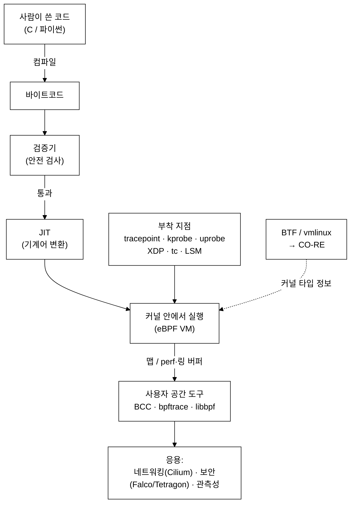

# 0주차(준비) — 용어·약어 사전
> 모르는 단어가 나오면 여기서 찾으면 된다. 강의 전체에서 이 문서를 링크로 참조한다.

last_updated: 2026-06-11

이 문서는 두 부분이다.
- **A. 핵심 용어 사전** — 카테고리별로 묶고, 각 용어를 1~3줄 + 짧은 비유로 설명한다.
- **B. 약어 풀이 표** — 알파벳 약어의 원말과 한 줄 뜻을 모았다.

> 비유는 "감을 잡기 위한 것"이다. 정확한 정의는 본문 설명을 기준으로 삼는다.

---

# A. 핵심 용어 사전

## 🖥️ 운영체제 기초

- **커널(kernel)** — 컴퓨터의 핵심 프로그램. CPU·메모리·디스크·네트워크 같은 하드웨어를 직접 관리하고, 모든 프로그램의 요청을 대신 처리한다.
  - 비유: 건물 전체를 관리하는 **관리실**. 전기·수도·출입을 다 통제한다.
- **사용자 공간(user space)** — 우리가 실행하는 보통 프로그램들(브라우저, 게임, 파이썬)이 도는 영역. 하드웨어에 직접 손대지 못하고, 커널에 부탁해야 한다.
  - 비유: 관리실 바깥의 **입주민 공간**. 필요한 건 관리실(커널)에 신청한다.
- **프로세스(process)** — 실행 중인 하나의 프로그램. 자기만의 메모리 공간을 가진다.
  - 비유: 한 채의 **집**. 집 안 살림(메모리)은 그 집 것이다.
- **스레드(thread)** — 프로세스 안에서 실제로 일하는 "일꾼". 한 프로세스가 여러 스레드를 가질 수 있고, 같은 프로세스의 스레드들은 메모리를 공유한다.
  - 비유: 한 집(프로세스) 안에 사는 **가족 구성원들**. 같은 집 살림을 나눠 쓴다.
- **PID(Process ID)** — 리눅스 커널이 매기는 식별 번호. 사실 커널 내부에서는 **스레드 하나하나**의 번호다.
  - 비유: 가족 구성원 각자의 **개인 번호표**.
- **TGID(Thread Group ID)** — 한 프로세스(스레드 묶음)의 대표 번호. **우리가 일상적으로 "PID"라 부르고 `ps`가 보여주는 값이 바로 TGID**다. 멀티스레드 프로세스의 모든 스레드는 같은 TGID를 공유한다.
  - 정확히: `bpf_get_current_pid_tgid()`의 결과에서 **상위 32비트 = TGID(사람들이 말하는 PID), 하위 32비트 = PID(커널 관점의 스레드 id)**. → [9주차 실습](09주차_실습1_시스템콜_추적기.md)에서 직접 쓴다.
  - 비유: **집 전체의 호수(號數)**. 그 집의 가족(스레드)이 몇 명이든 호수는 하나다.
- **시스템콜(system call, syscall)** — 사용자 공간 프로그램이 커널에게 "이 일 좀 해주세요"라고 부탁하는 공식 창구(파일 열기, 네트워크 연결 등).
  - 비유: 입주민이 관리실에 내는 **민원 신청서**. 정해진 양식으로만 받는다.
- **컨텍스트 전환(context switch)** — CPU가 한 작업(프로세스/스레드)을 멈추고 다른 작업으로 갈아탈 때, 진행 상태를 저장하고 새 상태를 불러오는 과정. 자주 일어나면 성능 비용이 된다.
  - 비유: 책상에서 하던 일을 **잠시 치우고 다른 일거리를 펴는** 것. 치우고 펴는 데 시간이 든다.
- **권한/모드(ring 0 / ring 3)** — CPU가 코드를 실행하는 권한 등급. **ring 0 = 커널 모드(모든 권한)**, **ring 3 = 사용자 모드(제한된 권한)**. 보통 프로그램은 ring 3에서 돈다.
  - 비유: **관리자 출입증(ring 0)** vs **일반 방문증(ring 3)**. 출입증 등급에 따라 들어갈 수 있는 방이 다르다.
- **root / sudo** — `root`는 리눅스의 최고 관리자 계정. `sudo`는 잠깐 관리자 권한으로 명령을 실행하게 해주는 도구(`sudo 명령어`). eBPF는 보통 관리자 권한이 필요하다.
  - 비유: `root`는 **마스터키를 가진 사람**, `sudo`는 그 마스터키를 **잠깐 빌려 문 하나를 여는** 것.
- **파일 디스크립터(fd, file descriptor)** — 커널이 열어 둔 자원(파일·소켓 등)을 가리키는 작은 정수 번호. 0=표준입력, 1=표준출력, 2=표준에러가 약속돼 있다.
  - 비유: 식당에서 받는 **번호표**. "3번 손님" 하면 누군지 안다.
- **스케줄러(scheduler)** — 여러 프로세스/스레드 중 다음에 CPU를 누구에게 줄지 정하는 커널의 결정 담당.
  - 비유: 놀이기구 줄에서 **다음 차례를 정해 주는 직원**.

## 🧩 컴퓨터 구조

- **레지스터(register)** — CPU 안에 있는 아주 빠르고 아주 작은 저장 칸. 계산 중인 값이 여기 잠깐 들어간다.
  - 비유: 손에 **딱 들고 있는 물건**. 가장 빠르게 쓰지만 몇 개 못 든다.
- **스택(stack)** — 함수가 잠깐 쓰는 임시 메모리 영역. "마지막에 넣은 걸 먼저 꺼낸다(LIFO)".
  - 비유: **접시를 쌓아 둔 더미**. 맨 위 것부터 집는다.
- **메모리/주소(memory/address)** — 데이터를 담는 큰 공간(RAM)과, 그 안의 위치를 가리키는 번호(주소).
  - 비유: 거대한 **사물함 벽**. 각 칸마다 번호(주소)가 붙어 있다.
- **포인터(pointer)** — 값 자체가 아니라 값이 들어 있는 **주소를 담은 변수**.
  - 비유: 물건이 아니라 **"몇 번 사물함에 있어"라고 적힌 쪽지**.
- **비트/바이트(bit/byte)** — 비트는 0 또는 1 한 자리. **8비트 = 1바이트**가 정보의 기본 단위.
  - 비유: 비트는 **전구 하나의 켜짐/꺼짐**, 바이트는 **전구 8개 한 묶음**.
- **16진수(hex)** — 0~9와 A~F로 수를 적는 표기법(`0x` 접두사). 한 자리가 4비트라 바이트를 깔끔하게 표현한다(예: `0xFF` = 255).
  - 비유: 8개짜리 전구 묶음을 **두 글자로 짧게 받아 적는 속기법**.
- **바이트 오더(byte order, endianness)** — 여러 바이트로 된 수를 메모리에 늘어놓는 순서.
  - **리틀엔디언(little-endian)**: **낮은 자리 바이트가 먼저(낮은 주소)**. x86/ARM 같은 일반 PC가 이렇게 저장한다.
  - **빅엔디언(big-endian)**: **높은 자리 바이트가 먼저**. 사람이 수를 쓰는 순서와 같다.
  - **네트워크 오더(network order)**: 네트워크로 주고받을 때 약속한 순서로, **빅엔디언**이다. 그래서 IP·포트는 변환이 필요하다(→ [10주차 실습](10주차_실습2_네트워크_연결_추적기.md)에서 `127.0.0.1`이 거꾸로 `1.0.0.127`로 나오는 함정).
  - 비유: 날짜를 **`일-월-년`(리틀)** 로 쓰느냐 **`년-월-일`(빅)** 로 쓰느냐의 차이. 우편(네트워크)에는 `년-월-일`(빅)로 쓰기로 약속한 것.

## 🌐 네트워크 기초

- **IP 주소(IP address)** — 네트워크에서 컴퓨터를 찾는 주소(예: `192.168.0.5`). IPv4는 4바이트(32비트).
  - 비유: 컴퓨터의 **집 주소**.
- **포트(port)** — 한 컴퓨터 안에서 어떤 프로그램(서비스)인지 구분하는 번호(예: 웹 80/443, SSH 22).
  - 비유: 같은 건물 안의 **방 호수**. 주소(IP)로 건물을 찾고 포트로 방을 찾는다.
- **127.0.0.1 (localhost)** — "나 자신"을 가리키는 특별한 IP. 네트워크를 안 거치고 같은 컴퓨터 안에서 통신한다.
  - 비유: **나에게 쓰는 메모**. 우체국(외부망)을 거치지 않는다.
- **TCP(Transmission Control Protocol)** — 데이터를 순서대로, 빠짐없이 전달하도록 보장하는 통신 규약. 연결을 먼저 맺고 주고받는다.
  - 비유: **등기우편**. 받았는지 확인하고 순서까지 챙긴다.
- **소켓(socket)** — 프로그램이 네트워크 통신을 하기 위해 여는 양 끝의 "통신 구멍". 커널이 만들어 주고 fd로 다룬다.
  - 비유: 두 집을 잇는 **전화기 한 대**. 이걸 들어야 통화가 시작된다.
- **연결(connect)** — 클라이언트가 서버의 IP·포트로 TCP 연결을 맺는 동작(`connect()` 시스템콜).
  - 비유: 상대 방 호수로 **전화를 거는 행위**.

## ⚙️ eBPF 핵심

- **eBPF(extended BPF)** — 커널을 다시 컴파일하거나 끄지 않고, **작은 프로그램을 커널 안에서 안전하게 실행**하게 해주는 기술. 추적·네트워킹·보안에 쓴다.
  - 비유: 커널이라는 비행기에, 비행 중에 **안전 검사를 통과한 작은 부가 장치만 끼워 넣는** 것.
- **BPF(Berkeley Packet Filter)** — eBPF의 옛 조상. 원래는 네트워크 패킷을 거르는 단순한 필터였다(→ [3주차](03주차_BPF에서_eBPF로_역사와_등장배경.md)).
  - 비유: 요즘 스마트폰(eBPF)의 **옛날 삐삐**.
- **바이트코드(bytecode)** — CPU가 직접 쓰는 기계어는 아니지만, 가상머신이 이해하는 중간 형태의 명령어. eBPF 프로그램은 이 형태로 커널에 전달된다.
  - 비유: 어느 식당에서나 통하는 **표준 주문서 양식**.
- **가상머신(VM, virtual machine, 여기선 eBPF VM)** — eBPF 바이트코드를 실행하기 위해 커널 안에 정의된 가상의 작은 CPU(레지스터·스택·명령어 집합). ※ "실습 환경의 VM"과는 다른 의미다(아래 참고).
  - 비유: 커널 안에 들어 있는 **작은 모형 컴퓨터**.
- **검증기(verifier)** — eBPF 프로그램을 커널에 넣기 전에, 무한 루프·잘못된 메모리 접근이 없는지 **한 줄 한 줄 검사**하는 안전 장치. 통과 못 하면 거부된다(→ [4주차](04주차_eBPF_아키텍처_검증기_JIT_맵_헬퍼.md)).
  - 비유: 비행기 탑승 전 **보안 검색대**. 위험하면 못 들어간다.
- **JIT(Just-In-Time 컴파일)** — 검증을 통과한 바이트코드를, 실행 직전에 그 CPU의 진짜 기계어로 번역해 더 빠르게 돌리는 것.
  - 비유: 외국어 대본을 미리 다 번역하지 않고, **말하기 직전에 즉석 통역**해 자연스럽게 만드는 것.
- **맵(map)** — eBPF 프로그램과 사용자 공간이 데이터를 주고받고, 값을 누적·저장하는 커널 안의 자료구조(키-값 표, 배열 등).
  - 비유: 커널과 사용자 공간이 함께 보는 **공용 게시판/엑셀 표**.
- **헬퍼 함수(helper function)** — eBPF 프로그램이 호출할 수 있도록 커널이 미리 마련해 둔 안전한 함수들(현재 PID 얻기, 맵 갱신, 데이터 복사 등).
  - 비유: 커널이 제공하는 **승인된 도구 상자**. 이 안의 도구만 쓸 수 있다.
- **부착 지점(attach point / hook)** — eBPF 프로그램을 "여기서 실행해라" 하고 거는 커널 안의 지점(→ [5주차](05주차_프로그램_타입과_부착지점.md)).
  - 비유: 낚싯대를 **드리우는 자리**. 그 자리를 지나가는 일이 생기면 걸린다.
- **tracepoint** — 커널 곳곳에 **개발자가 미리 박아 둔 안정적인 관측 지점**. 버전이 바뀌어도 잘 안 변해 신뢰도가 높다.
  - 비유: 공장 라인에 정식 설치된 **고정 CCTV**.
- **kprobe / kretprobe** — 커널 함수의 **시작 지점(kprobe)** 또는 **반환 지점(kretprobe)** 에 동적으로 거는 추적 지점. tracepoint보다 자유롭지만 커널 버전에 더 민감하다.
  - 비유: 아무 데나 임시로 붙이는 **휴대용 감시 카메라**. kprobe=들어갈 때, kretprobe=나올 때 찍는다.
- **uprobe** — 커널이 아니라 **사용자 프로그램(라이브러리·앱)의 함수**에 거는 추적 지점.
  - 비유: 관리실이 아니라 **입주민 집 안 활동**을 들여다보는 카메라.
- **USDT(User Statically-Defined Tracing)** — 애플리케이션 개발자가 프로그램 안에 **미리 심어 둔 사용자 공간 추적 지점**. uprobe의 "정식 버전"이라 안정적이다.
  - 비유: 앱 제작자가 일부러 달아 둔 **공식 점검구**.
- **perf 버퍼 / perf 이벤트(perf buffer / perf event)** — eBPF가 커널에서 모은 데이터를 사용자 공간으로 보낼 때 쓰는 통로(채널). 리눅스의 `perf` 하위 시스템 위에서 동작한다(→ [8주차](08주차_BCC_입문_맵과_perf이벤트.md)).
  - 비유: 커널이 사용자 공간으로 소포를 내보내는 **택배 컨베이어 벨트**.
- **링 버퍼(ring buffer)** — perf 버퍼를 개선한 최신 데이터 전송 통로. 메모리를 더 효율적으로 쓰고 순서를 잘 지킨다.
  - 비유: 끝이 다시 처음으로 이어지는 **원형 컨베이어 벨트**. 빈 칸에 계속 실어 보낸다.
- **BTF(BPF Type Format)** — 커널의 자료구조(구조체·필드 위치 등) 정보를 담은 "지도". 이게 있어야 eBPF가 커널 메모리를 정확히 읽는다(→ [6주차](06주차_개발환경_VM_BTF_CO-RE개념.md)).
  - 비유: 커널 내부의 **상세 평면도/설계도**.
- **CO-RE(Compile Once – Run Everywhere)** — BTF를 이용해, **한 번 컴파일한 eBPF 프로그램을 커널 버전이 달라도 그대로 실행**하게 하는 기법.
  - 비유: 한 번 만들어 두면 **어느 콘센트에나 꽂히는 멀티 어댑터**.
- **vmlinux** — 컴파일된 리눅스 커널 본체 파일. 여기서 뽑아낸 `vmlinux.h`(또는 내장 BTF)가 CO-RE의 타입 정보 출처가 된다.
  - 비유: 모든 평면도(BTF)가 들어 있는 **건물 원본 도면 뭉치**.

## 🧰 도구·생태계

- **BCC(BPF Compiler Collection)** — 파이썬 등으로 eBPF를 쉽게 짜게 해주는 입문용 도구 모음. 실행할 때 컴파일한다(→ [8주차](08주차_BCC_입문_맵과_perf이벤트.md)).
  - 비유: 초보자용 **요리 키트**. 재료와 설명이 함께 있어 시작이 쉽다.
- **bpftrace** — 한 줄짜리 짧은 스크립트로 빠르게 추적하는 도구(awk를 닮은 문법)(→ [7주차](07주차_bpftrace_입문.md)).
  - 비유: 무거운 장비 없이 쓰는 **휴대용 청진기**.
- **libbpf** — C로 작성한 eBPF를 CO-RE 방식으로 빌드·로드하는 표준 라이브러리. 프로덕션(실서비스)용으로 많이 쓴다(→ [11주차](11주차_libbpf와_CO-RE_프로덕션eBPF.md)).
  - 비유: 전문가용 **공식 빌드 도구 세트**.
- **bpftool** — 현재 커널에 올라온 eBPF 프로그램·맵을 살펴보고 관리하는 명령행 도구.
  - 비유: eBPF용 **작업 관리자(task manager)**.
- **Cilium** — eBPF로 쿠버네티스의 네트워크·보안을 처리하는 대표 프로젝트(→ [12주차](12주차_eBPF_네트워킹_XDP_tc_Cilium.md)).
  - 비유: 컨테이너 세계의 **교통·보안 시스템**.
- **Falco** — eBPF 등으로 시스템의 위험 행동(수상한 syscall 등)을 실시간 탐지하는 보안 도구(→ [13주차](13주차_eBPF_보안_LSM_Falco_Tetragon.md)).
  - 비유: 침입을 감지해 **경보를 울리는 보안 카메라**.
- **Tetragon** — eBPF 기반의 보안 관측·실행 제어 도구(Cilium 진영). 탐지에 더해 **차단**까지 할 수 있다.
  - 비유: 경보(Falco)에서 한 발 더 나아가 **문까지 잠그는** 경비원.
- **XDP(eXpress Data Path)** — 네트워크 카드에서 패킷이 들어오자마자 **가장 빠른 단계에서** 처리하는 eBPF 지점. 초고속 필터링·DDoS 방어에 쓴다.
  - 비유: 건물 **정문에서 곧장** 출입을 거르는 검문소.
- **tc(traffic control)** — 리눅스의 트래픽 제어 계층. XDP보다 뒤(소켓에 더 가까운 쪽)에서 패킷을 다루며 더 많은 정보를 본다.
  - 비유: 정문(XDP)을 지나 **내부 복도에서** 흐름을 정리하는 안내원.
- **LSM(Linux Security Module)** — 커널의 보안 결정 지점을 모아 둔 틀. **BPF LSM**으로 이 지점에 eBPF를 걸어 "허용/차단"을 정할 수 있다(→ [13주차](13주차_eBPF_보안_LSM_Falco_Tetragon.md)).
  - 비유: 건물 곳곳의 **보안 검문 초소** 표준 규격.
- **seccomp(secure computing)** — 한 프로세스가 쓸 수 있는 시스템콜을 미리 제한하는 커널 기능. 공격 표면을 줄인다.
  - 비유: 입주민에게 **낼 수 있는 민원 종류를 제한**해 두는 것.
- **컨테이너(container)** — 한 호스트 안에서 프로그램을 격리해 실행하는 가벼운 단위. 자기만의 파일·네트워크처럼 보이게 만든다(같은 커널은 공유).
  - 비유: 한 배 안의 **칸막이 된 화물 컨테이너**.
- **쿠버네티스(Kubernetes, k8s)** — 수많은 컨테이너를 자동으로 배치·확장·관리하는 시스템.
  - 비유: 컨테이너들을 싣고 내리는 **항만 관제 시스템**.
- **파드(Pod)** — 쿠버네티스에서 함께 배포되는 **컨테이너 묶음의 최소 단위**(보통 컨테이너 1개 이상 + 공유 자원).
  - 비유: 함께 움직이는 **한 세트의 화물**.
- **CNI(Container Network Interface)** — 컨테이너에 네트워크를 붙여 주는 표준 규격(플러그인 형태). Cilium도 CNI다.
  - 비유: 컨테이너에 **랜선을 꽂아 주는 표준 잭** 규격.

## 🧪 실습 환경

- **VM(가상머신, virtual machine)** — 진짜 컴퓨터 안에서 소프트웨어로 흉내 낸 또 하나의 독립 컴퓨터. 이 강의에선 리눅스 실습 환경으로 쓴다. ※ 위 "eBPF VM"과는 다른 개념이다.
  - 비유: 컴퓨터 안에 띄운 **컴퓨터 속 컴퓨터**.
- **tart** — macOS(특히 Apple Silicon)에서 리눅스 VM을 빠르게 만들고 관리하는 도구. 이 강의 실습 VM을 띄울 때 쓴다(→ [6주차](06주차_개발환경_VM_BTF_CO-RE개념.md)).
  - 비유: VM을 찍어 내는 **붕어빵 틀**.
- **SSH(Secure Shell)** — 멀리 있는(또는 VM 안의) 컴퓨터에 **암호화된 통로로 접속**해 명령을 내리는 방법.
  - 비유: 다른 방의 컴퓨터를 **안전한 비밀 통로로 원격 조종**하는 것.
- **공개키/개인키(public/private key)** — SSH 등에서 비밀번호 없이 안전하게 인증하는 한 쌍의 열쇠. **공개키는 상대에게 주고, 개인키는 절대 안 준다**.
  - 비유: **자물쇠(공개키)는 나눠 주고, 그걸 여는 열쇠(개인키)는 나만** 갖는다.
- **터미널(terminal)** — 글자로 명령을 입력해 컴퓨터를 다루는 창.
  - 비유: 컴퓨터와 **문자로 대화하는 채팅창**.
- **컴파일(compile)** — 사람이 쓴 소스 코드(C 등)를 기계/가상머신이 실행할 형태로 번역하는 과정.
  - 비유: 한국어 대본을 **공연용 대본으로 번역·제작**하는 일.
- **sudo** — (위 "root/sudo" 참고) 명령을 잠깐 관리자 권한으로 실행. eBPF 실습에서 자주 앞에 붙인다.
  - 비유: **마스터키를 잠깐 빌리는** 명령.

---

## 🗺️ 개념 지도 (한눈에)

---

# B. 약어 풀이 표

| 약어 | 영어 원말 | 한 줄 뜻 |
| :--- | :--- | :--- |
| BPF | Berkeley Packet Filter | eBPF의 옛 조상. 원래는 네트워크 패킷 필터. |
| eBPF | extended BPF | 커널 안에서 작은 프로그램을 안전하게 실행하는 확장된 기술. |
| BTF | BPF Type Format | 커널 자료구조 정보를 담은 타입 "지도". |
| CO-RE | Compile Once – Run Everywhere | 한 번 컴파일해 여러 커널 버전에서 그대로 실행. |
| JIT | Just-In-Time (compilation) | 실행 직전에 바이트코드를 진짜 기계어로 번역. |
| VM | Virtual Machine | 가상의 컴퓨터(여기선 eBPF 실행용 VM 또는 실습용 리눅스 VM). |
| PID | Process ID | 커널이 매기는 식별 번호(내부적으로는 스레드 단위). |
| TGID | Thread Group ID | 프로세스 대표 번호. 사람들이 흔히 "PID"라 부르는 값. |
| ABI | Application Binary Interface | 프로그램과 커널/라이브러리가 바이너리 수준에서 약속한 호출 규칙. |
| CNI | Container Network Interface | 컨테이너에 네트워크를 붙이는 표준 규격. |
| LSM | Linux Security Module | 커널 보안 결정 지점의 틀(BPF LSM으로 eBPF 부착 가능). |
| USDT | User Statically-Defined Tracing | 앱에 미리 심어 둔 사용자 공간 추적 지점. |
| PMU | Performance Monitoring Unit | CPU에 내장된 성능 측정 하드웨어 카운터. |
| XDP | eXpress Data Path | 네트워크 카드 진입 직후의 초고속 패킷 처리 지점. |
| tc | traffic control | 리눅스 트래픽 제어 계층(패킷 처리 부착 지점). |
| SSH | Secure Shell | 암호화된 원격 접속 방법. |
| TCP | Transmission Control Protocol | 순서·신뢰성을 보장하는 연결형 통신 규약. |
| IP | Internet Protocol | 네트워크에서 컴퓨터를 찾는 주소 체계. |
| fd | file descriptor | 열린 파일·소켓을 가리키는 작은 정수 번호. |
| CNCF | Cloud Native Computing Foundation | 쿠버네티스·Cilium 등 클라우드 네이티브 프로젝트를 품는 재단. |
| C2 | Command and Control | (보안) 공격자가 감염된 시스템을 원격 조종하는 통제 서버/채널. |
| SIEM | Security Information and Event Management | 보안 로그·이벤트를 모아 분석·경보하는 시스템. |
| NIC | Network Interface Card | 네트워크 카드(랜카드). |
| RX/TX | Receive / Transmit | 수신(RX)과 송신(TX). 네트워크에서 받기/보내기. |

---

## 📚 더 깊이

- [2주차 — 리눅스 커널과 사용자공간·시스템콜](02주차_리눅스_커널과_사용자공간_시스템콜.md)
- [4주차 — eBPF 아키텍처: 검증기·JIT·맵·헬퍼](04주차_eBPF_아키텍처_검증기_JIT_맵_헬퍼.md)
- [C 미니부록 — C언어 준비](00b_준비_C언어_미니부록.md)

> 사전에 없는 단어가 보이면, 해당 주차 본문의 첫 등장 부분에 보통 풀이가 있다. 그래도 막히면 조교에게 알려 주면 된다 — 이 사전에 추가하겠다.
