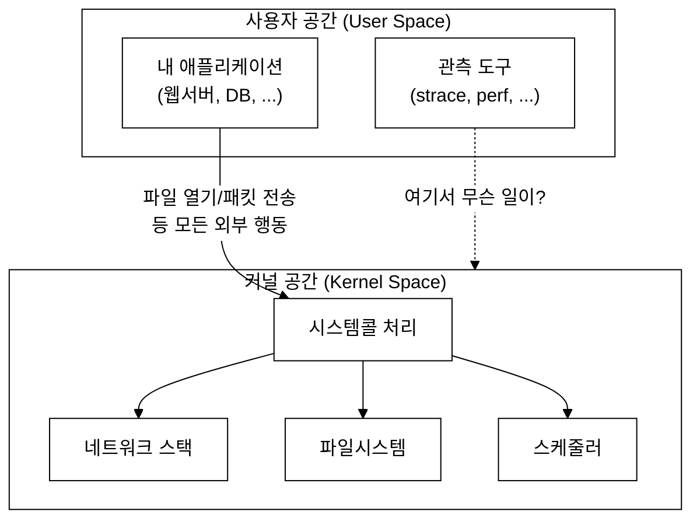
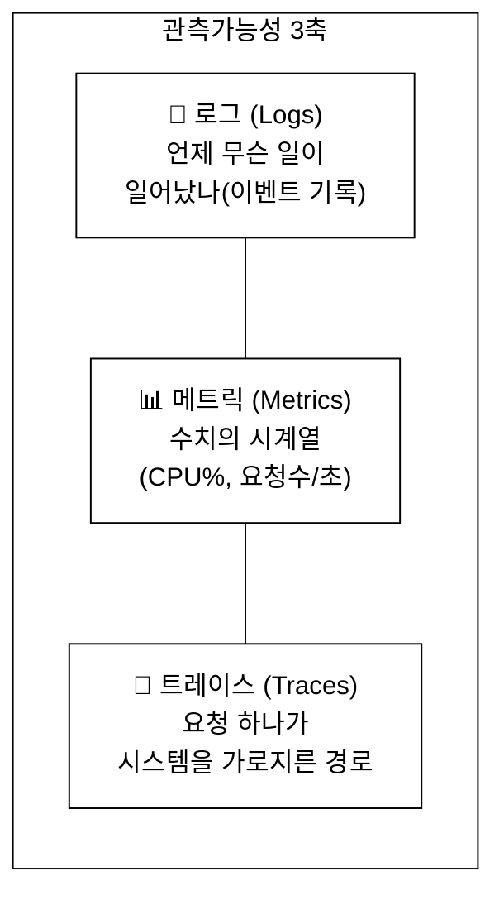
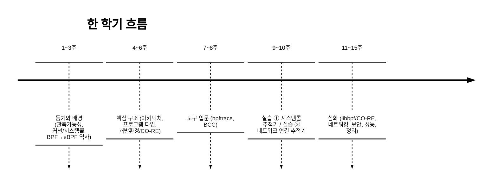
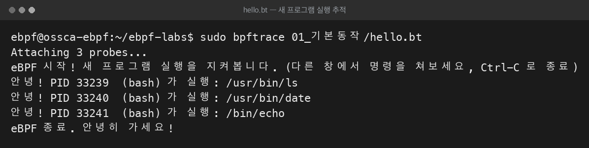

# 1주차 — 과목 개요와 "왜 eBPF 인가"
> 한 학기 동안 무엇을 배우는지, 그리고 왜 하필 eBPF인지 큰 그림을 잡는 시간
last_updated: 2026-06-11

## 이번 주 학습 목표
- 관측가능성(observability)이 무엇인지, 로그·메트릭·트레이스 3축으로 설명할 수 있다.
- 왜 "커널 내부"를 들여다보고 싶어지는지, 그리고 기존 방법(커널 모듈, strace)의 한계를 설명할 수 있다.
- eBPF가 어떤 문제를 "안전하게·재부팅 없이·낮은 오버헤드로" 푸는지 직관적으로 이해한다.
- 대규모 인프라(Netflix, Meta, Google, Cloudflare 등)에서 eBPF가 어떻게 쓰이는지 사례 수준으로 안다.
- 이 과목에서 학기말에 직접 만들 두 가지 실습이 무엇인지 안다.

---

## 1. 들어가며: "지금 이 컴퓨터, 뭐 하고 있어?"

여러분이 만든 서버가 갑자기 느려졌다고 해 보자. CPU 사용률은 정상인데 응답이 느리다. 디스크는 한가한데 어떤 프로세스가 자꾸 디스크를 두드린다. 네트워크 연결이 가끔 실패하는데 왜인지 모르겠다.

이런 상황에서 우리가 진짜로 알고 싶은 것은 **"시스템이 지금 내부에서 무슨 일을 하고 있는가"** 다. 그런데 이 정보의 상당 부분은 우리가 짠 애플리케이션 코드가 아니라, 그 아래에 있는 **운영체제 커널** 안에서 벌어진다. 파일을 열고, 패킷을 보내고, 프로세스를 스케줄링하는 일은 전부 커널의 몫이기 때문이다.

이 과목은 바로 그 커널 내부를 **안전하게, 실시간으로, 큰 부담 없이** 들여다보고 더 나아가 동작을 확장하는 기술인 **eBPF**를 배운다.



핵심 메시지: **"흥미로운 일은 대부분 커널 안에서 벌어진다."** 그래서 우리는 커널을 관측하고 싶다.

---

## 2. 관측가능성(Observability)이란 무엇인가

**관측가능성**은 제어이론에서 온 말로, "시스템의 외부 출력만 보고 내부 상태를 얼마나 잘 추론할 수 있는가"를 뜻한다. 소프트웨어에서는 보통 이렇게 풀어 쓴다.

> **시스템이 만들어 내는 신호(텔레메트리)만으로, 처음 보는 문제까지 진단해 낼 수 있는 성질.**

"모니터링(monitoring)"과 헷갈리기 쉬운데 둘은 결이 다르다.

| 구분 | 모니터링(Monitoring) | 관측가능성(Observability) |
|:---|:---|:---|
| 질문의 성격 | "내가 미리 정해 둔 지표가 정상인가?" | "내가 예상 못 한 문제가 왜 생겼지?" |
| 대상 | 알려진 실패(known-unknowns) | 모르던 실패(unknown-unknowns) |
| 비유 | 자동차 계기판 경고등 | 정비소에서 차를 직접 뜯어보기 |

### 2.1 관측가능성의 세 기둥 (Three Pillars)

관측가능성은 보통 세 종류의 데이터로 이야기한다.



- **로그(Logs):** "언제 무슨 일이 일어났다"는 개별 이벤트의 기록. 사람이 읽기 좋지만 양이 많아지면 무겁고 비싸다.
  - 예: `2026-06-11 10:31:02 ERROR connection refused to 10.0.0.5:5432`
- **메트릭(Metrics):** 시간에 따른 **숫자**의 흐름(시계열). 가볍고 집계·알람에 좋지만, "왜"는 못 알려준다.
  - 예: `초당 요청 수 = 1200`, `평균 응답시간 = 38ms`
- **트레이스(Traces):** 요청 하나가 여러 서비스를 거치는 **경로**를 이어 붙인 것. 분산 시스템에서 병목을 찾을 때 강력하다.
  - 예: `요청 A → 게이트웨이(2ms) → 인증(5ms) → DB(120ms ← 여기 느림!)`

세 가지는 경쟁 관계가 아니라 **상호 보완**이다. 메트릭으로 "이상하다"를 감지하고, 트레이스로 "어느 구간인지" 좁히고, 로그로 "정확히 뭐가"를 확인한다.

> 💬 **그런데 eBPF는 어디에?** eBPF는 이 3축 데이터를 **커널 수준에서, 애플리케이션 코드를 한 줄도 안 고치고** 만들어 낼 수 있게 해 준다. 예를 들어 "어떤 프로세스가 어떤 시스템콜을 몇 번 호출했는가"라는 메트릭, "누가 어디로 TCP 연결을 맺었는가"라는 트레이스를 코드 수정 없이 뽑아낸다.

---

## 3. 왜 굳이 커널을 들여다봐야 하나

애플리케이션 레벨에서 충분히 로그를 남기면 되지 않을까? 그것만으로 부족한 이유가 있다.

1. **모든 외부 행동은 결국 커널을 거친다.** 파일 입출력, 네트워크 송수신, 새 프로세스 생성, 메모리 매핑은 전부 **시스템콜**을 통해 커널로 내려간다. 즉, 커널은 모든 프로그램의 행동이 모이는 **공통 길목**이다. (이 부분은 2주차에서 자세히 다룬다.)
2. **언어·프레임워크에 무관하다.** 애플리케이션이 Go든 Python이든 Rust든, 커널에서 보면 똑같이 `read()`, `write()`, `connect()`다. 커널 한 곳만 보면 **모든 프로세스**를 한 번에 관측할 수 있다.
3. **코드를 못 고치는 경우가 많다.** 서드파티 바이너리, 운영 중인 레거시, 소스 없는 프로그램은 계측 코드를 넣을 수 없다. 커널에서 관측하면 대상 프로그램을 건드리지 않는다.

문제는 **"커널을 안전하게 관측·확장하기가 매우 어렵다"**는 점이다. 여기서 기존 방식의 한계가 드러난다.

---

## 4. 기존 방식의 한계

### 4.1 커널 모듈(kernel module) 직접 개발

가장 강력한 방법은 커널 코드를 직접 짜서 모듈로 올리는 것이다. 하지만 위험이 크다.

- **안전망이 없다.** 커널 모듈의 버그 하나로 **커널 패닉(시스템 전체 다운)** 이 날 수 있다. 사용자 프로그램이 죽는 것과 차원이 다르다.
- **재부팅·재컴파일 부담.** 모듈을 고칠 때마다 빌드하고, 종종 시스템을 재시작해야 한다. 운영 서버에서 이는 큰 비용이다.
- **이식성·유지보수.** 커널 내부 자료구조는 버전마다 바뀌어, 커널이 올라갈 때마다 모듈을 다시 손봐야 할 수 있다.
- **보안 위험.** 커널 모듈은 사실상 무제한 권한을 가진다. 검증 절차가 사람의 코드 리뷰뿐이다.

### 4.2 strace 같은 도구

`strace`는 시스템콜을 엿보는 고전적 도구다(2주차에서 직접 써 본다). 편리하지만 한계가 분명하다.

- **오버헤드가 크다.** 전통적인 `strace`는 `ptrace` 메커니즘을 사용하는데, 시스템콜마다 추적 프로세스로 **컨텍스트 전환**이 두 번씩 일어난다. 그래서 대상 프로그램이 **수 배~수십 배 느려질 수 있다.** 운영 환경에서 상시 켜 두기 어렵다.
- **집계가 약하다.** 기본적으로 "한 줄씩" 찍어 주는 도구라, "초당 호출 수", "프로세스별 통계" 같은 가공은 별도 처리가 필요하다.
- **관측 범위가 좁다.** 보통 특정 프로세스의 시스템콜에 초점이 맞춰져 있어, 시스템 전체를 가볍게 훑기에는 적합하지 않다.

> 정리하면, 우리는 **(A) 커널 모듈처럼 강력하지만**, **(B) strace처럼 가볍고**, **(C) 둘 다와 달리 안전한** 무언가가 필요하다. 그게 eBPF다.

---

## 5. eBPF가 푸는 문제

**eBPF(extended Berkeley Packet Filter)**는 한 줄로 말하면 이렇다.

> **리눅스 커널 안에서, 검증을 통과한 작은 프로그램을 안전하게 실행시켜 주는 기술.**

운영체제를 다시 빌드하거나 모듈을 적재하지 않고도, 커널의 동작을 관측하고 확장할 수 있다. 흔히 **"커널을 위한 자바스크립트"** 또는 **"리눅스 커널의 프로그래머블 플랫폼"** 이라고 비유한다(브라우저를 안 고치고도 JS로 웹페이지 동작을 바꾸는 것처럼).

eBPF가 앞의 한계를 어떻게 푸는지 비교해 보자.

```mermaid
%%{init: {"theme":"base","themeVariables":{"background":"#ffffff","primaryColor":"#ffffff","primaryBorderColor":"#000000","primaryTextColor":"#000000","secondaryColor":"#ffffff","secondaryBorderColor":"#000000","secondaryTextColor":"#000000","tertiaryColor":"#ffffff","tertiaryBorderColor":"#000000","tertiaryTextColor":"#000000","lineColor":"#000000","textColor":"#000000","mainBkg":"#ffffff","secondBkg":"#ffffff","clusterBkg":"#ffffff","clusterBorder":"#000000","edgeLabelBackground":"#ffffff","nodeBorder":"#000000","defaultLinkColor":"#000000","titleColor":"#000000","actorBkg":"#ffffff","actorBorder":"#000000","actorTextColor":"#000000","actorLineColor":"#000000","signalColor":"#000000","signalTextColor":"#000000","labelBoxBkgColor":"#ffffff","labelBoxBorderColor":"#000000","labelTextColor":"#000000","loopTextColor":"#000000","noteBkgColor":"#ffffff","noteBorderColor":"#000000","noteTextColor":"#000000","activationBkgColor":"#ffffff","activationBorderColor":"#000000","sequenceNumberColor":"#000000","cScale0":"#ffffff","cScale1":"#ffffff","cScale2":"#ffffff","cScale3":"#ffffff","cScale4":"#ffffff","cScale5":"#ffffff","cScale6":"#ffffff","cScale7":"#ffffff","cScale8":"#ffffff","cScale9":"#ffffff","cScale10":"#ffffff","cScale11":"#ffffff","cScaleLabel0":"#000000","cScaleLabel1":"#000000","cScaleLabel2":"#000000","cScaleLabel3":"#000000","cScaleLabel4":"#000000","cScaleLabel5":"#000000","cScaleLabel6":"#000000","cScaleLabel7":"#000000","cScaleLabel8":"#000000","cScaleLabel9":"#000000","cScaleLabel10":"#000000","cScaleLabel11":"#000000","pie1":"#ffffff","pie2":"#eeeeee","pie3":"#dddddd","pie4":"#cccccc","fontFamily":"Georgia, serif"}}}%%
flowchart TB
    subgraph Before["❌ eBPF 없을 때"]
        B1["커널 모듈 작성"] --> B2["빌드 + 적재"]
        B2 --> B3["버그 → 커널 패닉 위험"]
        B3 --> B4["재부팅/재컴파일"]
    end
    subgraph After["✅ eBPF 있을 때"]
        A1["eBPF 프로그램 작성"] --> A2["검증기(verifier)\n로드 전 안전성 검사"]
        A2 -->|"통과"| A3["JIT 컴파일 후\n커널에서 실행"]
        A2 -->|"실패"| A4["로드 거부\n(시스템은 안전)"]
        A3 --> A5["재부팅 없이\n실시간 부착/해제"]
    end
    style Before fill:#ffffff
    style After fill:#ffffff
```



eBPF의 세 가지 핵심 약속:

1. **안전(Safe).** 프로그램을 커널에 올리기 전에 **검증기(verifier)** 가 정적으로 검사한다. 무한 루프가 없는지, 잘못된 메모리에 접근하지 않는지 등을 확인하고, 통과하지 못하면 **아예 로드를 거부**한다. 그래서 커널을 비교적 안전하게 지킬 수 있다.
2. **재부팅 불필요(No reboot).** eBPF 프로그램은 실행 중인 커널에 **동적으로 부착·해제**된다. 모듈처럼 시스템을 재시작할 필요가 없다.
3. **낮은 오버헤드(Low overhead).** 검증을 통과한 프로그램은 **JIT(Just-In-Time)** 컴파일을 거쳐 네이티브 기계어로 빠르게 돌고, 커널 안에서 직접 실행되므로 `ptrace`식의 잦은 컨텍스트 전환이 없다. 그래서 strace보다 훨씬 가볍게 상시 관측이 가능하다.

여기에 더해 eBPF는 두 가지 도구를 제공한다(4주차에서 깊이 다룬다).

- **맵(maps):** 커널의 eBPF 프로그램과 사용자 공간이 데이터를 주고받고, 통계를 누적하는 **공유 자료구조**(해시맵, 배열 등).
- **헬퍼(helpers):** eBPF 프로그램이 호출할 수 있는, 커널이 미리 제공하는 안전한 함수들(시간 읽기, 맵 접근, 데이터 복사 등).

> ⚠️ **균형 잡힌 시각:** eBPF가 만능은 아니다. 검증기를 만족시키려면 프로그램에 제약이 많고(루프 제한, 스택 크기 제한 등), 커널/아키텍처 의존성도 신경 써야 한다. 이런 **한계와 트레이드오프**는 15주차에서 정직하게 다룬다.

---

## 6. 실제로 누가 쓰나 (대규모 인프라 사례)

eBPF는 학술적 호기심이 아니라 **이미 세계 최대 규모 인프라의 기반 기술**이다. 널리 알려진 사례를 살펴보자.

| 기업 | 대표적 활용(일반적으로 알려진 사실) |
|:---|:---|
| **Netflix** | 성능 분석·프로파일링 문화로 유명. 엔지니어 Brendan Gregg가 eBPF 기반 성능 도구와 플레임그래프(flame graph) 활용을 널리 알림 |
| **Meta(Facebook)** | 대규모 L4 로드밸런서 **Katran**을 eBPF/XDP로 구현. eBPF는 Meta 인프라 전반에서 광범위하게 사용 |
| **Google** | 컨테이너/쿠버네티스 환경의 네트워킹·보안에 eBPF 기반 기술 활용. **Cilium**을 GKE의 네트워킹 옵션으로 채택 |
| **Cloudflare** | XDP를 활용한 고성능 패킷 처리·DDoS 완화에 eBPF를 적극 사용한 사례로 잘 알려짐 |

그리고 이들을 잇는 대표 오픈소스 프로젝트가 있다.

- **Cilium** — eBPF 기반 쿠버네티스 네트워킹·보안·관측 플랫폼 (12주차)
- **Falco / Tetragon** — eBPF 기반 런타임 보안·위협 탐지 (13주차)
- **bcc / bpftrace** — eBPF로 성능·관측 도구를 쉽게 만드는 도구 모음 (7~8주차)

> 즉, 이번 학기에 배우는 내용은 **실무에서 그대로 쓰이는 기술의 토대**다.

---

## 7. 이 과목에서 무엇을 만드나 (학기 로드맵)

이론으로 끝내지 않는다. 학기 동안 두 개의 실습을 직접 만든다. 자세한 사용법은 저장소 루트의 [README](../../README.md)와 각 실습 폴더를 참고한다.



- **실습 ① 시스템콜 추적기 (`projects/syscall-tracer`, 9주차)**
  - tracepoint `raw_syscalls:sys_enter`에 붙어서 **(PID, 시스템콜)별 호출 횟수**를 센다.
  - 시스템콜을 정해진 횟수만큼 호출하는 `workload.c`와, 결과가 맞는지 스스로 확인하는 `verify.py`로 **자기검증**까지 해 본다.
- **실습 ② 네트워크 연결 추적기 (`projects/netflow-tracer`, 10주차)**
  - kprobe로 `tcp_v4_connect`에 붙어서 **프로세스별 TCP 연결**을 추적한다.
  - **perf 이벤트**로 커널에서 사용자 공간으로 이벤트를 실시간 전달하는 방식을 익힌다.

실습은 제공되는 가상머신에서 진행한다.

```bash
# 실습용 VM 접속 (Ubuntu 24.04 / 커널 6.17 / aarch64)
# BCC 0.29, bpftrace 0.20, libbpf 1.3 이 미리 설치되어 있다.
ssh ossca-ebpf
```

---

### 📸 미리 보는 실제 실행 출력 (터미널 이미지로 렌더링)

> 한 학기 동안 우리가 직접 만들 추적기의 **실제 출력**입니다(이 강의 VM, 커널 6.17에서 실행해 얻은 출력을 터미널 이미지로 렌더링).
> 지금은 "이런 걸 만드는구나" 정도로만 보고, 자세한 원리는 7·9주차에서 다룹니다.



---

## 💡 핵심 요약
- **관측가능성**은 외부 신호(로그·메트릭·트레이스 3축)만으로 처음 보는 문제까지 진단하는 능력이다.
- 흥미로운 일은 대부분 **커널 안**에서 벌어지므로 커널을 관측하고 싶지만, **커널 모듈은 위험·재부팅**, **strace는 오버헤드·범위** 한계가 있다.
- **eBPF**는 검증기로 **안전**하게, **재부팅 없이**, **JIT로 낮은 오버헤드**로 커널을 관측·확장하게 해 준다("커널의 프로그래머블 플랫폼").
- Netflix·Meta·Google·Cloudflare 등 대규모 인프라가 Cilium, Katran, Falco/Tetragon 같은 형태로 실제로 사용한다.
- 이 과목에서는 **시스템콜 추적기**와 **네트워크 연결 추적기** 두 실습을 직접 만든다.

---

## ✍️ 연습문제
1. 모니터링과 관측가능성의 차이를 "known-unknowns / unknown-unknowns" 개념으로 설명하라.
2. 로그·메트릭·트레이스 각각이 잘하는 일과 못하는 일을 한 가지씩 들고, 셋이 왜 상호 보완적인지 서술하라.
3. "애플리케이션 로그만으로는 부족하고 커널을 관측해야 하는 이유"를 세 가지 들어 설명하라.
4. 커널 모듈로 관측 기능을 만들 때의 위험 세 가지를 쓰고, 각각을 eBPF가 어떻게 완화하는지 짝지어라.
5. 전통적 `strace`가 운영 환경에서 상시 사용하기 어려운 핵심 이유를 컨텍스트 전환 관점에서 설명하라.
6. eBPF의 세 가지 약속(안전·재부팅 불필요·낮은 오버헤드)을 각각 "어떤 메커니즘 덕분인지"와 연결하라(예: 안전 ↔ 검증기).
7. eBPF를 "커널을 위한 자바스크립트"에 비유할 때, 이 비유가 잘 들어맞는 점과 한계(부정확한 점)를 각각 하나씩 말하라.
8. 이 과목의 두 실습이 각각 관측가능성 3축 중 무엇(들)에 해당하는지 근거와 함께 분류하라.

---

## ✅ 자가점검 퀴즈
**Q1.** 관측가능성의 "세 기둥"은 무엇인가?
<details><summary>정답</summary>
로그(Logs), 메트릭(Metrics), 트레이스(Traces). 각각 개별 이벤트 기록, 수치의 시계열, 요청의 경로를 담당하며 상호 보완적이다.
</details>

**Q2.** eBPF 프로그램이 커널에 로드되기 직전에, 안전성을 보장하기 위해 통과해야 하는 단계의 이름은?
<details><summary>정답</summary>
검증기(verifier). 무한 루프·잘못된 메모리 접근 등을 정적으로 검사하고, 통과하지 못하면 로드를 거부한다.
</details>

**Q3.** 전통적 `strace`의 큰 오버헤드는 주로 무엇 때문인가?
<details><summary>정답</summary>
`ptrace` 기반으로 시스템콜마다 추적 프로세스로의 컨텍스트 전환이 반복적으로 일어나기 때문이다. 그래서 대상 프로그램이 수 배~수십 배 느려질 수 있다.
</details>

**Q4.** "eBPF는 BPF의 약자다"는 설명은 정확한가?
<details><summary>정답</summary>
정확하지 않다. 역사적으로는 extended Berkeley Packet Filter에서 출발했지만, 오늘날 "eBPF"는 더 이상 특정 약자로 풀어 쓰지 않는 **고유명사**로 취급한다(3주차 참고).
</details>

**Q5.** Meta가 eBPF/XDP로 구현한 것으로 잘 알려진 대규모 L4 로드밸런서의 이름은?
<details><summary>정답</summary>
Katran.
</details>

---

## 📚 더 읽을거리
- ebpf.io — eBPF 공식 소개 사이트 ("What is eBPF?" 문서)
- Brendan Gregg, *Systems Performance* 및 그의 블로그(eBPF 기반 성능 분석·플레임그래프)
- Cilium 공식 문서 — eBPF 기반 클라우드 네이티브 네트워킹/보안 개요
- Liz Rice, *Learning eBPF* (O'Reilly) — 입문 친화적 개관

---

## ⏭ 다음 주 예고
"커널을 관측한다"는 말의 실체를 파고든다. 사용자 모드와 커널 모드는 왜 나뉘어 있는지(ring 0/3), 시스템콜이 정확히 어떻게 일어나는지, 그리고 왜 시스템콜이 **모든 프로그램 행동이 모이는 최고의 관측 지점**인지를 배운다. 이것이 실습 ①의 직접적인 근거가 된다. → [2주차](02주차_리눅스_커널과_사용자공간_시스템콜.md)
