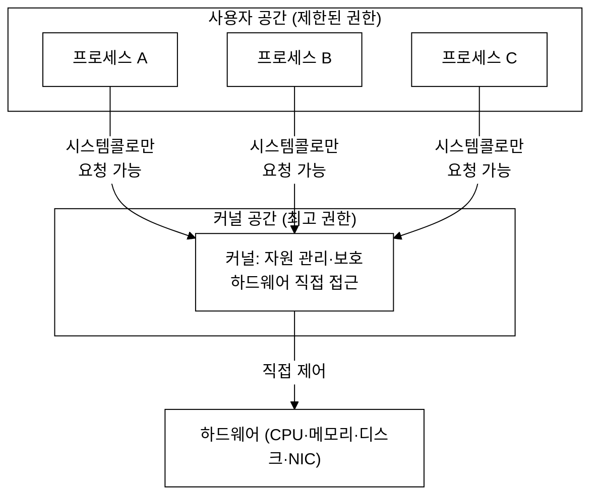
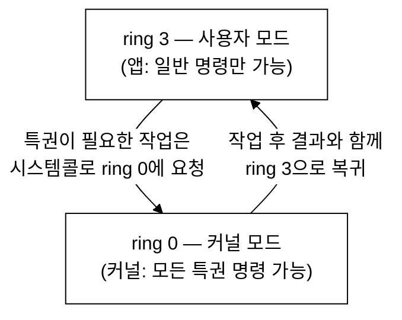
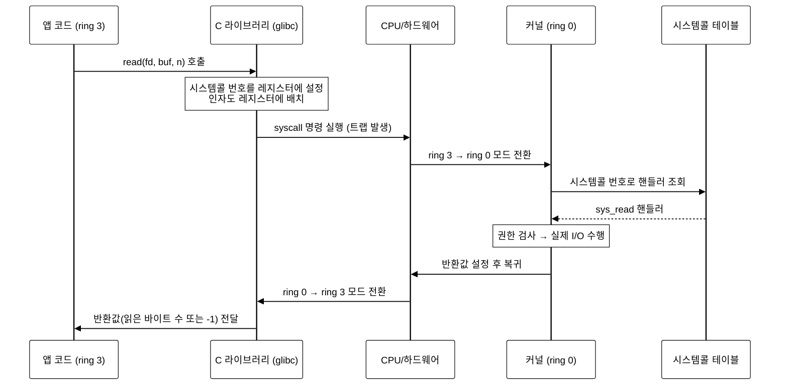
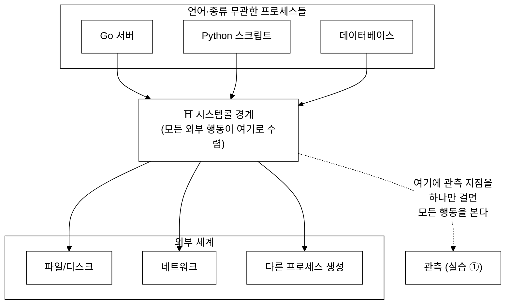
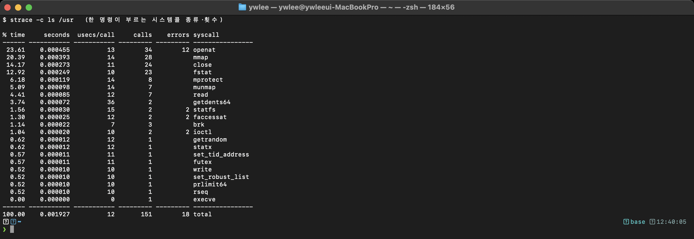
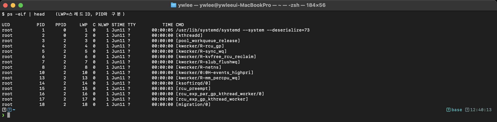

# 2주차 — 리눅스 커널·사용자 공간·시스템콜
> "커널을 관측한다"의 실체: 권한 분리, 시스템콜, 그리고 왜 그곳이 최고의 관측 지점인가
last_updated: 2026-06-11

> 🧭 **이번 주 동선**  ·  📘 과목1 2주차 🟢  ·  📕 과목2 해당 없음
> - 🔬 **실습(VM `ssh ossca-ebpf`)**: `strace -c ls` · `sudo bpftrace examples/02_시스템콜/syscall_top.bt`
> - 🧵 **OS 트랙 함께 보기**: [OS V2 제한적 직접 실행과 시스템콜](os/V2_제한적직접실행과_시스템콜.md)
> - ↔️ **이동**: ⬅️ [1주차 왜 eBPF](01주차_과목개요와_왜_eBPF인가.md) · 🏠 [강의 인덱스](README.md) · ➡️ [3주차 BPF→eBPF 역사](03주차_BPF에서_eBPF로_역사와_등장배경.md)

> 🔰 **1학년·입문자 진입로**: 이번 주는 커널·프로세스·시스템콜 같은 운영체제 용어가 많이 나옵니다.
> 모르는 단어가 보이면 [용어·약어 사전](00c_용어집_약어사전.md)에서 바로 찾는다. 한 번에 다 외우려 하지 말고,
> "프로그램이 무언가 하려면 결국 커널에 요청(=시스템콜)한다"는 **큰 메시지 하나**만 잡고 가면 충분하다.

## 이번 주 학습 목표
- 사용자 모드와 커널 모드(ring 3/ring 0)가 왜 분리되어 있는지, 권한 분리의 의미를 설명할 수 있다.
- 시스템콜이 무엇이고, 라이브러리 호출부터 커널 진입·복귀까지 어떻게 일어나는지 단계별로 설명할 수 있다.
- 컨텍스트 전환(context switch)과 모드 전환의 비용 개념을 이해한다.
- 대표 시스템콜(openat/read/write/connect)의 역할을 안다.
- `strace`로 시스템콜을 직접 관찰할 수 있고, "왜 시스템콜이 최고의 관측 지점인가"를 실습 ①과 연결해 설명할 수 있다.

---

## 1. 컴퓨터는 두 세계로 나뉘어 있다

운영체제 위에서 돌아가는 모든 일은 크게 두 영역으로 나뉜다.

- **사용자 공간(user space):** 우리가 만든 애플리케이션, 셸, 웹서버 같은 보통의 프로그램이 도는 곳.
- **커널 공간(kernel space):** 운영체제의 심장. 하드웨어(CPU·메모리·디스크·네트워크 카드)를 직접 다루고, 모든 프로세스를 관리한다.

왜 이렇게 나눌까? 한마디로 **"신뢰할 수 없는 코드로부터 시스템 전체를 지키기 위해"** 다. 만약 모든 프로그램이 하드웨어와 다른 프로세스의 메모리에 마음대로 접근할 수 있다면, 버그 하나로 시스템 전체가 무너지거나, 악성 프로그램이 남의 데이터를 훔칠 수 있다.



핵심: 사용자 프로그램은 하드웨어를 **직접** 만질 수 없다. 항상 커널에게 **부탁(=시스템콜)** 해야 한다.

---

## 2. 보호 링: ring 0 과 ring 3

CPU 자체가 이 권한 분리를 하드웨어 수준에서 지원한다. x86 CPU에는 **보호 링(protection ring)** 이라는 특권 수준이 있다(ring 0부터 ring 3까지). 리눅스는 보통 두 개만 쓴다.

- **ring 0 (커널 모드):** 모든 권한. 특권 명령(하드웨어 제어, 메모리 매핑 변경 등) 실행 가능.
- **ring 3 (사용자 모드):** 제한된 권한. 특권 명령을 실행하려 하면 CPU가 막고 커널에 넘긴다.



> 🔑 **권한 분리의 이점**
> - **안정성:** 사용자 프로그램이 죽어도 커널과 다른 프로세스는 멀쩡하다.
> - **보안:** 프로세스끼리 서로의 메모리를 침범하지 못한다(메모리 격리).
> - **공정성:** 커널이 CPU·메모리·I/O를 중재해, 한 프로그램이 자원을 독점하지 못하게 한다.

여담: ARM(aarch64, 실습 VM의 아키텍처)에는 "ring"이라는 용어 대신 **예외 수준(Exception Level, EL0~EL3)** 이 있다. 사용자 모드가 EL0, 커널이 EL1에 대응한다고 보면 된다. 이름만 다를 뿐 **특권 분리**라는 본질은 같다.

---

## 3. 시스템콜이란 무엇인가

사용자 프로그램이 "파일 읽기, 네트워크 전송, 프로세스 생성"처럼 **커널의 도움이 필요한 일**을 하려면, 정해진 **창구**를 통해 커널에 요청해야 한다. 이 창구가 **시스템콜(system call, syscall)** 이다.

비유하자면, 사용자 공간은 은행 로비이고 커널은 금고실이다. 손님(앱)은 금고에 직접 못 들어가고, **창구 직원(시스템콜)** 에게 정해진 양식으로 요청해야 한다. 직원은 신원과 권한을 확인하고 대신 처리해 준다.

시스템콜은 **운영체제가 사용자에게 제공하는 가장 기본적인 API** 다. 리눅스에는 수백 개의 시스템콜이 있다.

### 3.1 시스템콜 ABI: 번호와 인자는 정확히 어디로 들어가나

"래퍼가 번호와 인자를 약속된 레지스터에 넣는다"고 했는데, 그 "약속"이 바로 **ABI(Application Binary Interface)** 다. ABI는 아키텍처마다 다르므로, 같은 `read()`도 x86-64와 arm64에서 쓰는 레지스터가 다르다.

| 아키텍처 | 시스템콜 번호 | 인자 1~6 | 진입 명령 | 반환값 |
|:---|:---|:---|:---|:---|
| arm64 (실습 VM) | `x8` | `x0, x1, x2, x3, x4, x5` | `svc #0` | `x0` |
| x86-64 | `rax` | `rdi, rsi, rdx, r10, r8, r9` | `syscall` | `rax` |

> 📌 **왜 ABI를 약속으로 못박나?** 커널은 자기를 부르는 사용자 프로그램이 어떤 언어·컴파일러로 짜였는지 모른다. "번호는 x8, 첫 인자는 x0"처럼 **레지스터 위치를 미리 고정**해 두어야, 커널 엔트리 코드가 정해진 자리만 읽어 처리할 수 있다. 이 약속이 깨지면(예: 컴파일러가 다른 레지스터를 쓰면) 커널은 엉뚱한 번호·인자를 받게 된다.

**워크드 예시 (arm64에서 `write(1, buf, 6)`):** glibc 래퍼는 ① `x8`에 write의 번호(arm64에서 64)를, ② `x0`에 fd `1`, `x1`에 `buf` 주소, `x2`에 `6`을 넣고, ③ `svc #0`을 실행한다. 커널은 `x8`=64로 테이블을 찾아 `sys_write`를 호출하고, 결과(쓴 바이트 수 6)를 `x0`에 담아 돌아온다.

### 3.2 모든 호출이 정말 커널까지 내려갈까? — vDSO

흥미롭게도, **시스템콜처럼 보이지만 실제로는 커널에 안 들어가는** 호출들이 있다. 대표가 `gettimeofday()`나 `clock_gettime()` 같은 "현재 시각 읽기"다. 시각 읽기는 매우 자주 일어나는데, 그때마다 모드 전환(아래 4.1) 비용을 내면 아깝다. 그래서 커널은 **vDSO(virtual Dynamic Shared Object)** 라는 작은 코드·데이터 영역을 각 프로세스 주소공간에 매핑해 둔다. 커널이 시각 정보를 이 공유 페이지에 계속 갱신해 두면, 사용자 프로그램은 **모드 전환 없이 사용자 공간에서** 그 값을 바로 읽어 답을 만든다.

> ⚠️ **흔한 오해:** "라이브러리 함수를 부르면 항상 시스템콜이 일어나고, 항상 커널로 내려간다"는 생각은 부정확하다. vDSO로 처리되는 호출은 **커널 진입이 없어** `strace`에도 시스템콜로 잡히지 않는다(그래서 어떤 함수는 strace 출력에서 보이지 않는다). 이것은 "시스템콜은 비싸니, 자주 쓰는 것 일부는 사용자 공간에서 끝내자"는 최적화의 결과다.

---

## 4. 시스템콜은 어떻게 일어나는가 (한 사이클 따라가기)

우리가 C로 `read(fd, buf, n)`을 호출하면 내부적으로 어떤 일이 벌어질까? 단계별로 따라가 보자.



단계 풀이:

1. **라이브러리 래퍼:** 보통 우리는 시스템콜을 직접 부르지 않고, C 라이브러리(glibc 등)가 제공하는 **얇은 래퍼 함수**(`read`, `write` 등)를 부른다. 이 래퍼가 규약에 맞게 준비한다.
2. **번호와 인자 세팅:** 각 시스템콜에는 고유 **번호**가 있다. 래퍼는 그 번호와 인자들을 약속된 **레지스터**에 넣는다(호출 규약은 아키텍처마다 다르다).
3. **`syscall` 명령(트랩):** 특별한 명령(`syscall`/`svc` 등)을 실행하면 CPU가 **트랩**을 일으켜 제어를 커널로 넘긴다. 이때 **ring 3 → ring 0 모드 전환**이 일어난다.
4. **시스템콜 테이블 조회:** 커널은 전달된 번호로 **시스템콜 테이블(sys_call_table)** 에서 해당 핸들러(`sys_read` 등)를 찾는다.
5. **실제 처리:** 핸들러가 권한·인자 유효성을 검사하고 실제 작업(디스크 읽기 등)을 수행한다.
6. **복귀:** 반환값을 정해진 레지스터에 담고 **ring 0 → ring 3** 으로 돌아온다. 래퍼는 이 값을 우리 프로그램에 돌려준다(보통 음수면 오류, `errno` 설정).

### 4.1 모드 전환과 컨텍스트 전환

- **모드 전환(mode switch):** 같은 프로세스가 사용자 모드 ↔ 커널 모드를 오가는 것. 위 시스템콜 사이클에서 일어난다. 상대적으로 가볍지만 **공짜는 아니다.**
- **컨텍스트 전환(context switch):** CPU가 **다른 프로세스**로 갈아타는 것(레지스터·메모리 매핑 등 상태 교체). 모드 전환보다 비용이 크다.

**모드 전환은 왜 공짜가 아닌가 — 비용의 정체.** "그냥 권한 비트 하나 바꾸는 것 아닌가?" 싶지만, 한 번의 진입·복귀에는 다음이 따라온다.

1. **레지스터 저장/복원.** 사용자 모드에서 쓰던 레지스터 상태를 망가뜨리지 않으려면 커널 진입 시 저장하고 복귀 시 되돌려야 한다.
2. **권한·인자 검사.** 커널은 넘어온 포인터가 정말 그 프로세스 소유의 사용자 메모리를 가리키는지, fd가 유효한지 등을 매번 확인한다(안 그러면 사용자 프로그램이 커널 메모리를 읽게 할 수 있다).
3. **모드 경계의 보호 장치 + 캐시·파이프라인 영향.** 사용자/커널 경계를 넘으면 CPU 파이프라인이 흐트러지고, 커널 코드·데이터로 캐시·TLB가 일부 밀려나 **복귀 후 사용자 코드가 잠시 더 느려지는** 간접 비용이 생긴다(현대 CPU의 보안 완화책이 이를 더 키우기도 한다).

이 때문에 모드 전환 한 번은 보통 수십~수백 나노초대로, "함수 호출 하나"보다 **훨씬** 비싸다. 그래서 성능에 민감한 코드는 "버퍼를 키워 `read`/`write` 횟수를 줄이는" 식으로 **시스템콜 횟수 자체를 줄이려** 한다.

**"훨씬"이 대체 몇 배인가 — 차수로 보기.** 추상적인 "비싸다"는 와닿지 않으니 대략적인 **차수(order of magnitude)** 로 비교해 보자. 아래 수치는 *현대 x86-64 서버 기준 근삿값*이며, CPU·커널 버전·보안 완화책(Meltdown/Spectre 패치)에 따라 몇 배씩 달라진다 — **정확한 값이 아니라 "자릿수 차이"를 느끼는 용도**다.

| 동작 | 대략적 비용 | 함수 호출 대비 | 무엇이 비용인가 |
|:---|:---|:---|:---|
| 같은 모드 **함수 호출** | ~1 ns (몇 CPU 사이클) | ×1 (기준) | 스택에 인자 push, 점프 |
| **vDSO** `clock_gettime` | ~수 ns | ×수 | 모드 전환 없이 공유 페이지 읽기(§3.2) |
| 가벼운 **시스템콜** `getpid` | ~수백 ns | ×100~수백 | 모드 전환(레지스터 저장/복원·파이프라인·캐시) |
| **컨텍스트 전환**(다른 프로세스로) | ~1–5 µs (수천 ns) | ×1,000~5,000 | 레지스터+주소공간(페이지테이블·TLB) 교체 |
| `strace` 로 본 시스템콜 1회 | 위의 수~수십 배 | — | 진입·복귀마다 추적 프로세스로 **컨텍스트 전환** 왕복 |

> 📊 **핵심 메시지 한 줄**: 함수 호출 → 시스템콜은 **약 100배**, 시스템콜 → 컨텍스트 전환은 **다시 약 10배**. 자릿수가 한 칸씩 올라간다. "시스템콜을 줄여라"가 성능 격언인 이유이고, **추적할 때마다 컨텍스트 전환을 유발하는 `strace`가 왜 그렇게 느린지**(1주차 실측), 그리고 **커널 안에서 끝내는 eBPF가 왜 싼지**가 이 표 하나에 들어 있다.

> 💡 1주차에서 본 `strace`의 큰 오버헤드는, 시스템콜마다 추적 프로세스로 **컨텍스트 전환**까지 유발하기 때문이었다(진입·복귀에서 추적 프로세스를 깨우느라 더 비싼 컨텍스트 전환이 왕복으로 두 번 더 붙는다). 반면 eBPF는 커널 안에서 바로 처리해 이 추가 비용을 피한다.

### 4.2 동기 vs 비동기, 그리고 errno

- **동기(synchronous) 시스템콜:** 대부분의 시스템콜은 동기다. 호출하면 결과가 날 때까지 그 프로세스가 (블로킹이면) 기다린다. 예: `read`가 디스크에서 읽어 올 때까지 대기.
- **비동기(asynchronous) 패턴:** "요청만 걸어 두고 나중에 결과를 수거"하는 방식도 있다. 고전적으로 `epoll`/`select`로 여러 fd를 한꺼번에 감시하거나, 최신 리눅스의 `io_uring`처럼 제출/완료 큐로 I/O를 비동기 처리한다. 핵심 동기는 같다 — **모드 전환 횟수를 줄여** 많은 I/O를 효율적으로 다루기.
- **errno — 실패를 알리는 방식.** 시스템콜이 실패하면 보통 음수를 반환한다. glibc 래퍼는 이 음수를 보고 `-1`을 반환하면서 전역 변수 `errno`에 구체적 원인 코드를 채운다. 예: 없는 파일을 열면 `openat`가 실패하고 `errno = ENOENT`(No such file or directory)가 된다. `strace`에서 `= -1 ENOENT (No such file or directory)`처럼 보이는 줄이 바로 이 경우다.

---

## 5. 대표 시스템콜 둘러보기

자주 만나는 시스템콜 몇 가지의 역할이다(실습에서 다시 만난다).

| 시스템콜 | 하는 일 | 비고 |
|:---|:---|:---|
| `openat` | 파일을 열고 **파일 디스크립터(fd)** 를 돌려준다 | 요즘 리눅스에서 파일 열기는 보통 `open`이 아닌 `openat`로 내려간다 |
| `read` | fd에서 데이터를 읽어 버퍼에 담는다 | 읽은 바이트 수 반환(0이면 EOF) |
| `write` | 버퍼의 데이터를 fd에 쓴다 | 화면 출력도 결국 표준출력 fd에 `write` |
| `connect` | 소켓을 원격 주소로 **연결**한다 | TCP 연결의 출발점 → 실습 ②와 직접 연관 |

> 📌 **파일 디스크립터(fd):** 열린 파일·소켓 등을 가리키는 작은 정수. 0/1/2는 관례상 표준입력/표준출력/표준에러다.

이름이 직관과 조금 다른 경우가 있다(`open` 대신 `openat` 등). 그래서 관측할 때는 "내가 부른 함수 이름"이 아니라 "실제로 내려간 시스템콜 이름"을 보는 것이 중요하다. 이를 직접 확인하는 도구가 바로 `strace`다.

---

## 6. strace로 직접 들여다보기

`strace`는 한 프로그램이 어떤 시스템콜을 어떤 인자로 호출하는지 한 줄씩 보여 준다. 실습 VM에서 해 보자.

```bash
ssh ossca-ebpf
# 간단한 명령의 시스템콜을 추적
strace -f echo hello
```

출력의 일부는 대략 이런 모양이다(환경마다 다름).

```text
execve("/usr/bin/echo", ["echo", "hello"], 0x... /* 60 vars */) = 0
openat(AT_FDCWD, "/lib/aarch64-linux-gnu/libc.so.6", O_RDONLY|O_CLOEXEC) = 3
read(3, "\177ELF...", 832)              = 832
...
write(1, "hello\n", 6)                  = 6
exit_group(0)                           = ?
```

읽는 법: 각 줄은 `시스템콜이름(인자들) = 반환값` 형식이다. `openat`로 라이브러리를 열고, `read`로 읽고, 마지막에 `write(1, "hello\n", 6)`으로 표준출력(fd 1)에 6바이트를 쓴 뒤 `= 6`(성공)이 보인다.

유용한 옵션:

```bash
# 시스템콜별 호출 횟수/시간 요약 (집계!)
strace -c ls

# 특정 시스템콜만 보기
strace -e trace=openat,read,write ls

# 이미 실행 중인 프로세스에 붙기 (PID 지정)
strace -p <PID>
```

`strace -c`의 출력은 "어떤 시스템콜이 몇 번 불렸나"를 표로 요약해 준다 — 이것이 바로 **실습 ①이 eBPF로 더 가볍게 만들려는 것**이다.

> ⚠️ 다시 강조: `strace`는 배우기엔 좋지만 오버헤드가 커서 운영 환경 상시 사용엔 부적합하다. 같은 정보를 eBPF로 가볍게 얻는 법을 학기 후반에 만든다.

---

## 7. 왜 시스템콜이 "최고의 관측 지점"인가

이제 핵심 통찰이다. 다시 그림으로 정리하자.



시스템콜이 좋은 관측 지점인 이유:

1. **모든 외부 행동이 수렴한다.** 파일 I/O, 네트워크, 프로세스 생성 등 프로그램이 바깥세상과 하는 **모든** 상호작용은 결국 시스템콜로 내려온다. 여기를 보면 프로그램의 "행동"을 빠짐없이 본다.
2. **언어·구현에 무관하다.** Go든 Python이든 커널에서 보면 똑같은 `read`/`write`/`connect`다. 한 곳에서 **모든 프로세스**를 균일하게 관측한다.
3. **안정적인 경계다.** 시스템콜 인터페이스는 호환성을 강하게 지키는 편이라, 커널 내부 구현보다 관측 지점으로 삼기 안정적이다.
4. **의미가 명확하다.** "이 프로세스가 `connect`를 호출했다"는 곧 "네트워크 연결을 시도했다"는 뜻이라 해석이 쉽다.

바로 이 때문에 **실습 ① 시스템콜 추적기**는 tracepoint `raw_syscalls:sys_enter`(모든 시스템콜 진입 지점)에 eBPF 프로그램을 붙여서 **(PID, 시스템콜)별 호출 횟수**를 센다. 위 그림의 "⛩️ 경계"에 관측기를 하나 거는 것과 같다. 자세한 부착 메커니즘은 5주차에서, 구현은 9주차에서 다룬다. 실습 폴더는 `projects/syscall-tracer`이며 사용법은 [README](../../README.md)에 있다.

---

## ⚙️ 리눅스 커널은 (이 주제를 커널은 이렇게 구현한다)

시스템콜 진입은 **CPU가 사용자 모드에서 커널 모드로 전환되는 사건**이다. 사용자 프로그램이 `svc`(arm64) 또는 `syscall`(x86) 명령을 실행하면 CPU가 **트랩(예외)** 을 일으켜 제어를 커널의 정해진 엔트리 코드로 넘긴다. 실습 VM(aarch64)에서는 `el0_svc` 엔트리가 이 진입을 받는다(x86은 `entry_SYSCALL_64`). 엔트리 코드는 레지스터에 담긴 **시스템콜 번호**로 **시스템콜 테이블**을 인덱싱해 해당 핸들러(`sys_read` 등)를 찾아 호출하고, 처리가 끝나면 반환값을 담아 다시 사용자 모드로 복귀한다. 즉 "번호 → 테이블 → 핸들러 → 복귀"가 한 사이클이다.

```mermaid
%%{init: {"theme":"base","themeVariables":{"background":"#ffffff","primaryColor":"#ffffff","primaryBorderColor":"#000000","primaryTextColor":"#000000","secondaryColor":"#ffffff","secondaryBorderColor":"#000000","secondaryTextColor":"#000000","tertiaryColor":"#ffffff","tertiaryBorderColor":"#000000","tertiaryTextColor":"#000000","lineColor":"#000000","textColor":"#000000","mainBkg":"#ffffff","secondBkg":"#ffffff","clusterBkg":"#ffffff","clusterBorder":"#000000","edgeLabelBackground":"#ffffff","nodeBorder":"#000000","defaultLinkColor":"#000000","titleColor":"#000000","actorBkg":"#ffffff","actorBorder":"#000000","actorTextColor":"#000000","actorLineColor":"#000000","signalColor":"#000000","signalTextColor":"#000000","labelBoxBkgColor":"#ffffff","labelBoxBorderColor":"#000000","labelTextColor":"#000000","loopTextColor":"#000000","noteBkgColor":"#ffffff","noteBorderColor":"#000000","noteTextColor":"#000000","activationBkgColor":"#ffffff","activationBorderColor":"#000000","sequenceNumberColor":"#000000","cScale0":"#ffffff","cScale1":"#ffffff","cScale2":"#ffffff","cScale3":"#ffffff","cScale4":"#ffffff","cScale5":"#ffffff","cScale6":"#ffffff","cScale7":"#ffffff","cScale8":"#ffffff","cScale9":"#ffffff","cScale10":"#ffffff","cScale11":"#ffffff","cScaleLabel0":"#000000","cScaleLabel1":"#000000","cScaleLabel2":"#000000","cScaleLabel3":"#000000","cScaleLabel4":"#000000","cScaleLabel5":"#000000","cScaleLabel6":"#000000","cScaleLabel7":"#000000","cScaleLabel8":"#000000","cScaleLabel9":"#000000","cScaleLabel10":"#000000","cScaleLabel11":"#000000","pie1":"#ffffff","pie2":"#eeeeee","pie3":"#dddddd","pie4":"#cccccc","fontFamily":"Georgia, serif"}}}%%
flowchart LR
    U["사용자 코드 (EL0)\nsvc 명령 실행"] -->|"트랩(예외)"| E["커널 엔트리\nel0_svc"]
    E --> T["시스템콜 테이블\n(번호로 조회)"]
    T --> H["핸들러\nsys_read 등"]
    H -->|"반환값 설정"| R["사용자 모드 복귀 (EL0)"]
```



커널 소스에서 aarch64 진입부는 `arch/arm64/kernel/entry-common.c`의 `el0_svc` 경로가, 시스템콜 테이블은 `sys_call_table`이 담당한다.

## 📸 실제 실행 화면 (실제 터미널 캡처)

아래는 이 강의 VM(`ssh ossca-ebpf`, 커널 6.17, aarch64)에서 실제로 실행한 화면을 그대로 캡처한 것이다.



*실제 터미널 캡처: `strace -c ls` — 한 명령(`ls`)이 실행되는 동안 호출한 시스템콜의 종류와 횟수를 집계해 보여 준다.* 표의 calls 열을 보면 `openat`·`read`·`mmap` 등 어떤 시스템콜이 몇 번 불렸는지 한눈에 드러난다 — 이것이 실습 ①이 eBPF로 더 가볍게 재현하려는 정보다.



*실제 터미널 캡처: `ps -eLf` — 스레드 단위로 프로세스를 나열한다.* LWP 열이 개별 스레드 ID, PID 열이 프로세스 ID로, 한 프로세스가 여러 스레드(LWP)를 가질 수 있음을 확인할 수 있다. 시스템콜을 (PID, 스레드)별로 구분해 볼 때 이 둘의 차이가 중요하다.

---

## 💡 핵심 요약
- 컴퓨터는 **사용자 공간(ring 3, 제한 권한)** 과 **커널 공간(ring 0, 전권)** 으로 나뉘며, 이는 **안정성·보안·공정성**을 위한 것이다.
- 사용자 프로그램은 하드웨어를 직접 못 만지고, **시스템콜**이라는 창구로 커널에 요청한다.
- 시스템콜은 **라이브러리 래퍼 → 번호/인자 세팅 → `syscall` 트랩(모드 전환) → 시스템콜 테이블 조회 → 처리 → 복귀** 순으로 일어난다.
- 대표 시스템콜로 `openat/read/write/connect`가 있고, `strace`로 직접 관찰·집계할 수 있다(단, 오버헤드 큼).
- **모든 외부 행동이 수렴하고 언어에 무관**하므로 시스템콜은 최고의 관측 지점이며, 이것이 **실습 ①의 근거**다.

---

## ✍️ 연습문제
1. 사용자 모드와 커널 모드를 나누는 이유 세 가지(안정성·보안·공정성)를 각각 구체적 시나리오와 함께 설명하라.
2. 사용자 프로그램이 하드웨어에 직접 접근하지 못하도록 막는 주체는 누구이며, 막힌 요청은 어디로 넘어가는가?
3. `read()` 호출이 일어날 때의 단계를 "라이브러리 래퍼 → 복귀"까지 순서대로 서술하라. 각 단계에서 일어나는 모드 전환을 표시하라.
4. 모드 전환과 컨텍스트 전환의 차이를 설명하고, 둘 중 일반적으로 어느 쪽 비용이 큰지와 그 이유를 쓰라.
5. 파일을 여는데 `strace`에서 `open`이 아니라 `openat`가 보일 수 있는 이유를 설명하라.
6. `strace -c`가 `strace`(기본)와 무엇이 다른지, 그리고 이 출력이 실습 ①과 어떻게 연결되는지 서술하라.
7. "시스템콜이 최고의 관측 지점"인 이유 네 가지 중 두 가지를 골라, 반례 가능성까지 함께 비판적으로 논하라.
8. 실습 ②(네트워크 연결 추적기)와 가장 관련 깊은 시스템콜은 무엇이며 그 이유는?

---

## 🛠 실습 과제

> `ssh ossca-ebpf` 로 접속 후 진행한다. eBPF 도구(bpftrace, BCC)는 `sudo` 가 필요하다.
> 이번 주 목표는 "시스템콜이 모든 행동의 길목"임을 **세 가지 도구로 직접 확인**하는 것이다.

### 과제 1 — strace -c로 한 명령의 시스템콜 분포 보기

- **목표:** 평범한 명령 하나(`ls`)가 실제로 어떤 시스템콜을, 몇 번 부르는지 집계로 확인한다. 본문 6절의 `strace -c`를 직접 돌려 본다.
- **명령(복붙 가능):**
  ```bash
  ssh ossca-ebpf
  strace -c ls            # ls 한 번 실행 동안의 시스템콜을 표로 요약
  strace -c -f ls -l /etc # 자식 프로세스까지(-f), 더 많은 파일 접근
  ```
- **관찰 포인트:**
  - `calls` 열에서 가장 많이 불린 시스템콜은 무엇인가? (보통 `openat`/`read`/`mmap`/`close` 등)
  - `errors` 열에 숫자가 있는 줄을 찾아보자 — 실패한 시스템콜(예: 없는 라이브러리를 찾다 `ENOENT`)이 보이는가? (본문 4.2 errno)
  - 화면 출력(`hello`나 파일 목록)은 어떤 시스템콜로 나갔을까? (`write`)
- **생각해볼 질문:**
  - `ls` 단순한 명령인데 시스템콜이 수십~수백 번 불린다. 이 횟수 하나하나가 모드 전환(본문 4.1)이라면, 왜 "버퍼를 키워 호출 횟수를 줄이는" 최적화가 중요할까?
  - `strace`가 이렇게 자세히 보여 주는데도 운영 환경에서 상시 쓰기 어려운 이유는? (1주차·본문 6절)

### 과제 2 — syscall_top.bt로 프로세스별 시스템콜 집계 (eBPF 버전)

- **목표:** 같은 "시스템콜 집계"를 strace가 아닌 **eBPF로, 시스템 전체에 대해** 해 본다. 실습 ①(syscall-tracer)의 핵심 아이디어인 "맵에 (프로세스)별 카운트 누적"을 한 줄짜리로 맛본다.
- **명령(복붙 가능):**
  ```bash
  ssh ossca-ebpf
  sudo bpftrace ~/ebpf-labs/examples/02_시스템콜/syscall_top.bt
  # 몇 초 두었다가 Ctrl-C → 프로세스별 시스템콜 횟수가 정렬되어 나온다
  ```
  부착 지점이 `raw_syscalls:sys_enter`(모든 시스템콜 공통 입구)임을 파일에서 확인해 보자.
  ```bash
  grep raw_syscalls ~/ebpf-labs/examples/02_시스템콜/syscall_top.bt
  ```
- **관찰 포인트:**
  - 결과의 `@by_process[...]`에 **내가 실행하지도 않은** 프로세스 이름들이 보이는가? (시스템 전체를 한 번에 관측 — 본문 7절)
  - strace는 한 프로세스만 봤는데, 이 도구는 왜 모든 프로세스를 한 번에 셀 수 있을까?
- **생각해볼 질문:**
  - 이 집계는 커널 안에서 카운트를 누적하고 **마지막에 요약만** 사용자 공간으로 올린다. strace가 시스템콜마다 줄을 찍는 것과 비교해 오버헤드가 왜 더 작을까?
  - 같은 일을 `raw_syscalls:sys_enter` 대신 시스템콜별 tracepoint 수백 개에 일일이 붙이면 어떤 단점이 있을까?

### 과제 3 — proc_audit.py로 exec 감사 (누가·무엇을 실행했나)

- **목표:** "이 서버에서 방금 무엇이, 누구 권한(UID)으로 실행됐나"를 실시간 감사한다. execve 시스템콜이 보안 관측의 출발점임을 본다(13주차로 연결).
- **명령(복붙 가능):**
  ```bash
  ssh ossca-ebpf
  # [터미널 A]
  sudo python3 ~/ebpf-labs/labs/01_프로세스/proc_audit.py
  ```
  ```bash
  # [터미널 B] 같은 VM에 접속해 아무 명령이나 실행
  ssh ossca-ebpf
  date
  whoami
  ls -l
  ```
- **관찰 포인트:**
  - 터미널 A에 (시각, PID, UID, 부모 프로세스, 실행파일) 한 줄씩 찍히는가?
  - `UID` 열을 보자 — 일반 사용자(보통 1000)와 `sudo`로 실행한 것(0=root)이 구분되는가?
  - 어떤 부모 프로세스(`comm`)가 명령을 띄웠는가? (셸이라면 `bash`/`zsh`)
- **생각해볼 질문:**
  - 이 도구는 모든 execve를 잡는다. 침입자가 `wget`/`curl`로 악성 바이너리를 받아 실행하면 어떻게 보일까?
  - 과제 1·2·3은 모두 결국 **시스템콜**을 본다. "시스템콜이 최고의 관측 지점"이라는 본문 7절의 주장을 세 도구가 각각 어떻게 뒷받침하는가?

---

## ✅ 자가점검 퀴즈
**Q1.** 리눅스에서 사용자 모드와 커널 모드는 각각 몇 번 ring에 대응하는가?
<details><summary>정답</summary>
사용자 모드는 ring 3, 커널 모드는 ring 0. (ARM에서는 각각 EL0, EL1에 대응한다.)
</details>

**Q2.** 시스템콜 시 커널이 "어떤 처리 함수를 부를지" 결정할 때 참조하는 것은?
<details><summary>정답</summary>
시스템콜 번호로 인덱싱하는 시스템콜 테이블(sys_call_table). 번호에 매핑된 핸들러(`sys_read` 등)를 찾아 호출한다.
</details>

**Q3.** `write(1, "hi\n", 3) = 3`에서 첫 번째 인자 `1`과 반환값 `3`은 각각 무엇을 의미하는가?
<details><summary>정답</summary>
`1`은 파일 디스크립터(표준출력 stdout), 반환값 `3`은 실제로 쓰인 바이트 수다.
</details>

**Q4.** 시스템콜은 프로그래머에게 어떤 역할을 하는가, 한 문장으로?
<details><summary>정답</summary>
운영체제가 사용자 공간에 제공하는 가장 기본적인 API(커널 기능 요청 창구)다.
</details>

**Q5.** 실습 ① 시스템콜 추적기가 부착하는 tracepoint 이름은?
<details><summary>정답</summary>
`raw_syscalls:sys_enter` (모든 시스템콜의 진입 지점). 여기서 (PID, 시스템콜)별 호출 횟수를 센다.
</details>

---

## 📚 더 읽을거리
- `man 2 syscall`, `man 2 read`, `man 2 connect` — 리눅스 시스템콜 매뉴얼
- `man 1 strace` 및 strace 프로젝트 문서
- Robert Love, *Linux Kernel Development* — 시스템콜과 커널 진입 개요
- 리눅스 커널 문서: System Calls / syscall table 관련 자료

---

## ⏭ 다음 주 예고
이제 "왜 관측하나"와 "무엇을 관측하나"를 알았으니, "그 도구가 어디서 왔나"를 본다. 1992년 패킷 필터로 출발한 고전 BPF가 어떻게 2014년 확장 BPF(eBPF)로 진화해 커널 전체를 프로그래밍하는 플랫폼이 되었는지, 그 역사와 등장 배경을 따라간다. → [3주차](03주차_BPF에서_eBPF로_역사와_등장배경.md)
