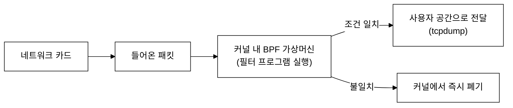
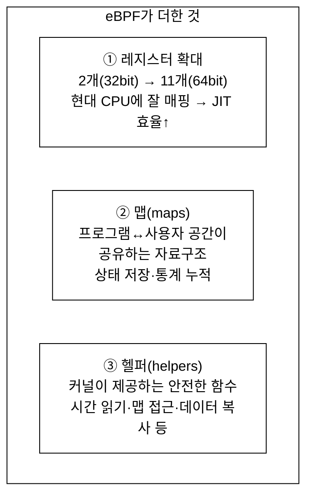
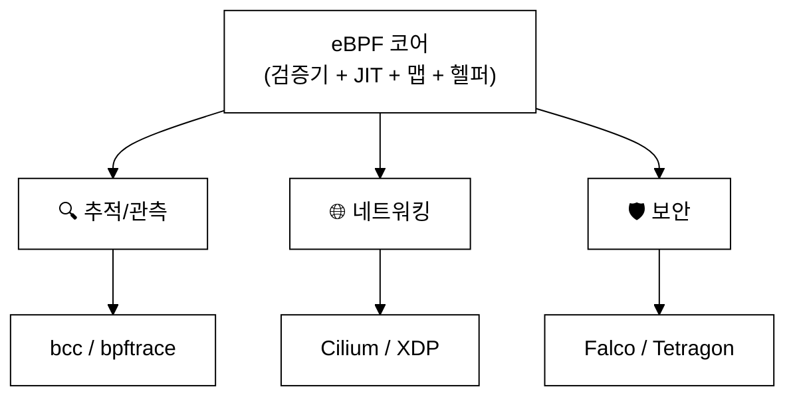
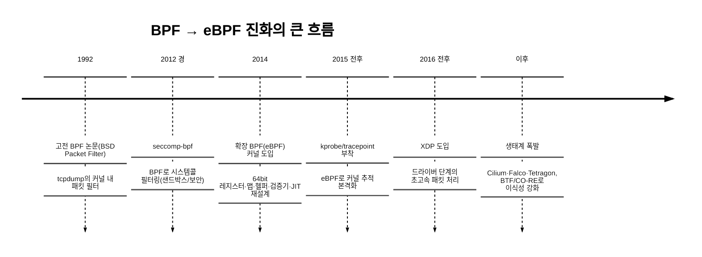
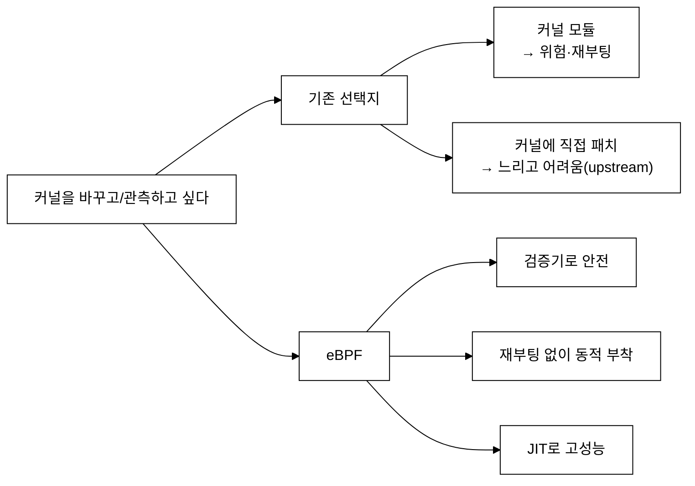
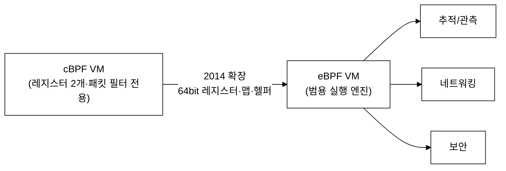
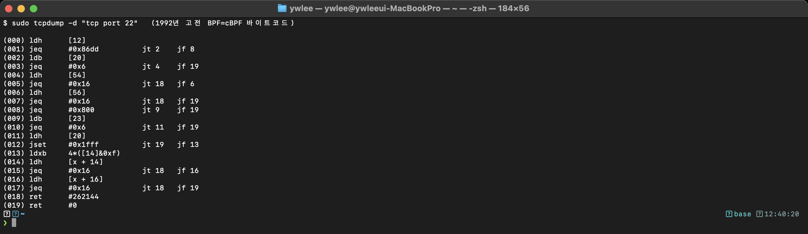

# 3주차 — BPF에서 eBPF로: 역사와 등장 배경
> 패킷 필터로 태어난 작은 가상머신이 어떻게 커널 전체의 프로그래머블 플랫폼이 되었나
last_updated: 2026-06-11

> 🧭 **이번 주 동선**  ·  📘 과목1 해당 없음(README 1부 보충 읽기)  ·  📕 과목2 1주차 도입(검증기 전사 cBPF)
> - 🔬 **실습(VM `ssh ossca-ebpf`)**: 읽기 자료 · `sudo tcpdump -d 'tcp port 22'`(고전 cBPF 바이트코드 구경)
> - 🧵 **OS 트랙 함께 보기**: —
> - ↔️ **이동**: ⬅️ [2주차 시스템콜](02주차_리눅스_커널과_사용자공간_시스템콜.md) · 🏠 [강의 인덱스](README.md) · ➡️ [4주차 아키텍처](04주차_eBPF_아키텍처_검증기_JIT_맵_헬퍼.md)

## 이번 주 학습 목표
- 1992년 고전 BPF(Berkeley Packet Filter)가 어떤 문제를 풀기 위해 등장했는지 설명할 수 있다.
- seccomp-bpf처럼 BPF가 패킷 필터 밖으로 확장된 사례를 안다.
- 2014년 확장 BPF(eBPF)가 도입한 핵심 변화(레지스터 확대·맵·헬퍼)와 그 의의를 설명할 수 있다.
- 커널 버전별 주요 이정표를 대략적인 흐름으로 이해한다.
- 오늘날 "eBPF"가 약자가 아니라 고유명사가 된 맥락과, eBPF가 커진 근본 이유를 설명할 수 있다.

---

## 1. 문제의 출발: 패킷을 빠르게 거르고 싶다 (1992)

1990년대 초, 네트워크 분석가들은 골치 아픈 문제에 부딪혔다. `tcpdump` 같은 도구로 네트워크 패킷을 잡아 분석하고 싶은데, 패킷은 **커널의 네트워크 스택**에 도착한다. 사용자 프로그램이 관심 있는 패킷(예: "포트 80 TCP만")만 보려면 어떻게 해야 할까?

순진한 방법은 **모든 패킷을 사용자 공간으로 복사**한 뒤 거기서 거르는 것이다. 하지만 이는 끔찍하게 비효율적이다. 트래픽의 99%가 관심 밖인데도 전부 복사하고, 매 패킷마다 커널↔사용자 경계를 넘나들어야 한다(2주차의 모드 전환 비용을 떠올리자).

**1992년**, Steven McCanne과 Van Jacobson(버클리)이 이 문제에 우아한 답을 냈다. 논문 *"The BSD Packet Filter"* 에서 제안한 **BPF(Berkeley Packet Filter)** 다.

> 아이디어: **"거르는 코드를 커널 안으로 내려보내자."** 사용자가 작은 필터 프로그램을 작성하면, 커널이 그것을 **커널 내부의 작은 가상머신(VM)** 에서 실행한다. 그러면 관심 없는 패킷은 커널에서 곧바로 버려지고, 통과한 패킷만 사용자 공간으로 올라온다.



고전 BPF의 특징:
- **작은 가상머신:** 2개의 32비트 레지스터(A=누산기, X=인덱스)와 작은 스크래치 메모리를 가진 단순한 명령어 집합.
- **패킷 매칭 전용:** 패킷의 특정 바이트를 읽어 비교/분기하는 일에 최적화.
- **안전·고속:** 커널 안에서 돌지만 명령어가 단순해 위험이 적고 빨랐다.

### 1.1 cBPF는 어떻게 생겼나 — 누산기 기반의 작은 명령어 집합

고전 BPF(cBPF)의 핵심 레지스터는 단 둘이다. **A(accumulator, 누산기)** 와 **X(index, 인덱스)**. 거의 모든 연산이 "패킷의 어떤 바이트를 **A로 불러와(load)**, 어떤 값과 **비교(compare)** 하고, 결과에 따라 **분기(branch)** 한다"는 패턴이다. 명령어 종류도 몇 가지뿐이다.

| 명령 | 의미 | 패킷 필터에서의 역할 |
|:---|:---|:---|
| `ld`/`ldh`/`ldb` | A에 4/2/1바이트를 적재 | 패킷의 특정 오프셋 값을 읽기 |
| `jeq`/`jset` 등 | A를 상수와 비교해 분기 | "이 필드가 이 값인가?" 판정 |
| `ret #k` | 통과 길이 `k` 반환(0이면 폐기) | 패킷을 받을지/버릴지 결론 |
| `ldx`/`tax` 등 | X 다루기·가변 오프셋 계산 | IP 헤더 길이만큼 건너뛰기 등 |

**워크드 예시 — "TCP 포트 22만"이 cBPF로 어떻게 표현되나.** `tcp port 22` 필터는 대략 이렇게 동작한다(IPv4 기준 흐름만 추리면):

1. 이더넷 프레임의 오프셋 **12**(EtherType)를 `ldh`로 읽어, `0x0800`(IPv4)인지 `jeq`로 비교 → 아니면 폐기 쪽으로 분기.
2. IP 헤더의 프로토콜 필드(오프셋 23)를 `ldb`로 읽어 `0x06`(TCP)인지 비교.
3. IP 헤더 길이는 가변이므로 `ldxb 4*([14]&0xf)`로 **헤더 길이를 X에 계산**해 넣고, `[x + 14]` 같은 **가변 오프셋**으로 TCP 포트 필드를 읽어 `0x16`(=22)인지 비교.
4. 맞으면 `ret #262144`(패킷을 통과시킴), 아니면 `ret #0`(폐기).

즉 cBPF 프로그램은 **"오프셋 적재 → 상수 비교 → 분기"의 사슬**이고, 분기들이 모여 "이 패킷이 내 조건에 맞는가?"라는 하나의 판정을 내린다. 이 바이트코드는 본 강의 실습에서 `tcpdump -d`로 직접 눈으로 볼 수 있다(아래 실습 과제).

### 1.2 tcpdump는 사람의 필터식을 cBPF로 컴파일한다

우리가 `tcpdump 'tcp port 22'`라고 칠 때, 그 사람이 읽는 표현식이 곧바로 커널에 들어가는 건 아니다. 중간에 **컴파일** 단계가 있다.

```mermaid
%%{init: {"theme":"base","themeVariables":{"background":"#ffffff","primaryColor":"#ffffff","primaryBorderColor":"#000000","primaryTextColor":"#000000","secondaryColor":"#ffffff","secondaryBorderColor":"#000000","secondaryTextColor":"#000000","tertiaryColor":"#ffffff","tertiaryBorderColor":"#000000","tertiaryTextColor":"#000000","lineColor":"#000000","textColor":"#000000","mainBkg":"#ffffff","secondBkg":"#ffffff","clusterBkg":"#ffffff","clusterBorder":"#000000","edgeLabelBackground":"#ffffff","nodeBorder":"#000000","defaultLinkColor":"#000000","titleColor":"#000000","actorBkg":"#ffffff","actorBorder":"#000000","actorTextColor":"#000000","actorLineColor":"#000000","signalColor":"#000000","signalTextColor":"#000000","labelBoxBkgColor":"#ffffff","labelBoxBorderColor":"#000000","labelTextColor":"#000000","loopTextColor":"#000000","noteBkgColor":"#ffffff","noteBorderColor":"#000000","noteTextColor":"#000000","activationBkgColor":"#ffffff","activationBorderColor":"#000000","sequenceNumberColor":"#000000","cScale0":"#ffffff","cScale1":"#ffffff","cScale2":"#ffffff","cScale3":"#ffffff","cScale4":"#ffffff","cScale5":"#ffffff","cScale6":"#ffffff","cScale7":"#ffffff","cScale8":"#ffffff","cScale9":"#ffffff","cScale10":"#ffffff","cScale11":"#ffffff","cScaleLabel0":"#000000","cScaleLabel1":"#000000","cScaleLabel2":"#000000","cScaleLabel3":"#000000","cScaleLabel4":"#000000","cScaleLabel5":"#000000","cScaleLabel6":"#000000","cScaleLabel7":"#000000","cScaleLabel8":"#000000","cScaleLabel9":"#000000","cScaleLabel10":"#000000","cScaleLabel11":"#000000","pie1":"#ffffff","pie2":"#eeeeee","pie3":"#dddddd","pie4":"#cccccc","fontFamily":"Georgia, serif"}}}%%
flowchart LR
    Expr["사람이 쓴 필터식\n'tcp port 22'"] -->|"libpcap이 파싱·컴파일"| Code["cBPF 바이트코드\n(ldh/jeq/ret ...)"]
    Code -->|"커널에 주입"| VM["커널 내 cBPF VM\n패킷마다 실행"]
    VM -->|"통과한 패킷만"| Up["tcpdump(사용자 공간)"]
```



`libpcap`이 `tcp port 22` 같은 표현식을 파싱해 위의 `ldh`/`jeq`/`ret` 사슬로 **컴파일**하고, 그 바이트코드를 커널에 주입한다. 그러면 커널은 도착하는 패킷마다 이 작은 프로그램을 돌려, 조건에 맞는 패킷만 사용자 공간으로 올려 보낸다. `tcpdump -d`는 바로 이 "컴파일 결과 바이트코드"를 사람이 읽도록 풀어 보여 주는 옵션이다.

이 설계가 너무 잘 만들어져서, `tcpdump`/libpcap의 핵심 메커니즘으로 오래도록 쓰였다. "필터 로직을 커널 안에서 안전하게 실행한다"는 개념이 여기서 확립된다.

---

## 2. 패킷 필터를 넘어서: seccomp-bpf

BPF의 "사용자가 정의한 작은 프로그램을 커널이 안전하게 실행한다"는 아이디어는 패킷 외에도 쓸모가 있었다. 대표 사례가 **seccomp-bpf** 다.

- **seccomp(secure computing mode)** 는 프로세스가 호출할 수 있는 시스템콜을 제한하는 보안 기능이다.
- **seccomp-bpf**(2012년경 도입)는 BPF 프로그램으로 **"이 프로세스가 어떤 시스템콜을 허용/차단할지"** 를 표현한다. 즉, 패킷 대신 **시스템콜**을 "필터링"한다.

**유추가 통한 이유 — 패킷과 시스템콜은 구조가 닮았다.** cBPF는 본래 "고정된 구조의 데이터(패킷)에서 특정 필드(오프셋)를 읽어 비교·분기한다"는 일을 했다. 그런데 시스템콜 진입 순간의 정보(시스템콜 번호, 인자들)도 커널이 `seccomp_data`라는 **고정된 구조체**로 정리해 준다. 그러면 cBPF는 패킷의 "오프셋 12를 읽어 비교"하듯, 이 구조체의 "시스템콜 번호 필드를 읽어 비교"하고 **허용(`ALLOW`)/차단(`KILL`/`ERRNO`)** 같은 결론을 `ret`로 돌려줄 수 있다. 즉 "데이터에서 필드 읽기 → 비교 → 결론"이라는 cBPF의 골격이 그대로 재사용된 것이다.

**워크드 예시.** "이 프로세스는 `read`/`write`/`exit`만 허용하고 나머지는 죽인다"는 정책은, cBPF로 "시스템콜 번호 필드를 적재 → 허용 목록의 번호들과 차례로 `jeq` 비교 → 맞으면 `ret ALLOW`, 다 아니면 `ret KILL_PROCESS`"라는 짧은 분기 사슬로 표현된다. 패킷 필터의 구조와 한 글자 한 글자 닮았다.

이는 컨테이너·브라우저 샌드박스 등에서 공격 표면을 줄이는 데 널리 쓰인다(예: 신뢰할 수 없는 코드가 위험한 시스템콜을 못 부르게 막기 — Chrome 렌더러, Docker 기본 프로파일 등). 핵심은 **"BPF가 네트워크 밖으로 나와 일반적인 정책 엔진으로 쓰이기 시작했다"** 는 점이다.

---

## 3. 대전환: 확장 BPF(eBPF)의 등장 (2014)

고전 BPF는 똑똑했지만, 패킷 필터링 수준의 **작고 제한적인 도구**였다. 레지스터 2개에 메모리도 작고, 상태를 오래 유지하거나 커널의 풍부한 정보에 접근하기 어려웠다.

**2014년**, **Alexei Starovoitov**(그리고 Daniel Borkmann 등)가 BPF를 근본적으로 확장해 리눅스 커널에 들였다. 이것이 **확장 BPF(extended BPF, eBPF)** 다. 단순한 성능 개선이 아니라 **BPF를 범용 커널 내 실행 엔진으로 재설계**한 사건이다.

### 3.1 무엇이 바뀌었나 — 세 가지 핵심



1. **레지스터 확대:** 32비트 레지스터 2개 → **64비트 레지스터 11개**. 현대 CPU 구조에 자연스럽게 대응해 **JIT 컴파일**(네이티브 기계어로 변환)이 효율적이 되었다. 더 복잡한 로직을 빠르게 실행할 수 있게 됐다.
2. **맵(maps):** eBPF의 게임 체인저. 프로그램이 호출 사이에 **상태를 유지**하고, **커널의 eBPF 프로그램과 사용자 공간 프로그램이 데이터를 공유**하게 해 주는 자료구조(해시맵·배열 등). "패킷 통과/차단"이라는 단발 판단을 넘어, **통계 누적·이벤트 집계**가 가능해졌다. (실습 ①에서 (PID, 시스템콜)별 카운트를 맵에 쌓는다.)
3. **헬퍼 함수(helpers):** eBPF 프로그램은 임의의 커널 함수를 호출할 수 없다(안전 때문). 대신 커널이 **허용된 안전한 함수 집합(헬퍼)** 을 제공한다 — 현재 시간 읽기, 맵 읽기/쓰기, 프로세스 정보 얻기, 데이터 복사 등.

### 3.1.1 다섯 조각을 하나씩 — 각각이 왜 필요했나

위 세 가지에 **검증기**와 **JIT**까지 더하면, 2014년 확장의 핵심은 **다섯 조각**으로 정리된다. 중요한 건 이들이 "있으면 좋은 기능"이 아니라, **고전 BPF로는 못 하던 일을 가능케 하려고 서로 맞물려 들어간 퍼즐 조각**이라는 점이다.

| 조각 | cBPF의 한계 | 이 조각이 푸는 것 |
|:---|:---|:---|
| ① 64비트 레지스터 11개 | 32비트 2개로는 표현력·성능이 약함 | 현대 64비트 CPU 레지스터에 1:1로 매핑 → JIT가 거의 그대로 기계어로 번역, 복잡한 로직도 빠름 |
| ② 맵(maps) | 호출 간 상태가 없어 단발 판정만 | 호출을 가로질러 **상태·통계 누적**, 커널↔사용자 공유 |
| ③ 헬퍼(helpers) | 커널 정보에 거의 접근 불가 | 시간·PID·맵·데이터 복사 등 **안전하게 허용된 커널 기능**에 접근 |
| ④ 검증기(verifier) | 프로그램이 단순해야만 안전 | **임의로 복잡한 프로그램도 로드 전에 안전성 증명**(무한 루프·잘못된 메모리 접근 차단) → 강력함과 안전을 양립 |
| ⑤ JIT 컴파일 | 인터프리트 위주라 느릴 수 있음 | 검증 통과한 바이트코드를 **네이티브 기계어로 번역**해 커널 모듈급 속도 |

각 조각을 풀어 보면:

1. **레지스터 11개(64비트) — 왜?** 현대 CPU는 64비트 레지스터를 여럿 가진다. eBPF 레지스터를 거기에 거의 1:1로 대응시키면, JIT가 eBPF 명령을 **대응하는 기계어 명령으로 손쉽게 번역**할 수 있다. cBPF의 2개·32비트로는 이런 효율적 매핑도, 복잡한 계산도 어려웠다.
2. **맵 — 왜?** cBPF는 패킷 하나에 대해 "통과/폐기"만 답하고 **잊어버린다**. 하지만 "지난 1초간 시스템콜이 몇 번 불렸나"처럼 **시간을 가로지르는 질문**에 답하려면 어딘가에 수를 누적해야 한다. 맵이 그 "기억 장치"다. 동시에 커널 측 프로그램이 쌓은 값을 사용자 공간이 읽어 가는 **공유 통로**이기도 하다.
3. **헬퍼 — 왜?** "안전하려면 아무 커널 함수나 못 부르게" 해야 하지만, 그렇다고 아무것도 못 하면 쓸모가 없다. 그래서 커널은 **검증된 안전한 함수만 골라** 헬퍼로 노출한다. eBPF 프로그램은 이 허용 목록 안에서만 커널 기능을 빌려 쓴다(권한과 능력의 절충).
4. **검증기 — 왜?** cBPF가 안전했던 비결은 "프로그램이 너무 단순해서"였다(루프도 사실상 없음). eBPF는 훨씬 복잡한 프로그램을 허용하려 하니, **단순함에 기대는 안전**을 버리고 대신 **로드 전에 기계가 안전성을 증명**하는 검증기를 둔다. 무한 루프가 없는지, 메모리 접근이 경계를 벗어나지 않는지 등을 통과 못 하면 **아예 로드를 거부**한다. 이것이 "강력하면서 안전"을 가능케 한 핵심이다(상세는 4주차).
5. **JIT — 왜?** 검증을 통과한 바이트코드를 인터프리터로 한 명령씩 해석하면 느리다. JIT는 이를 **네이티브 기계어로 한 번 번역**해 두어, 이후로는 커널 모듈에 가까운 속도로 돌게 한다. "안전(검증) + 속도(JIT)"가 한 쌍으로 묶여 eBPF의 실용성을 만든다.

> 💡 **묶어서 보기:** ②맵·③헬퍼가 "더 많은 일을 하게" 했다면, ④검증기·⑤JIT는 그 늘어난 능력을 "안전하고 빠르게" 받쳐 준다. 다섯 조각이 함께 있어야 비로소 "커널 안에서 돌리는 작은 프로그래밍 플랫폼"이 성립한다 — 하나라도 빠지면 cBPF 수준에 머문다.

### 3.2 적용 범위의 폭발: 추적·네트워킹·보안

이 변화 덕분에 eBPF는 패킷 필터를 훨씬 넘어 세 큰 영역으로 퍼졌다.

| 영역 | 무엇을 하나 | 이 과목 연결 |
|:---|:---|:---|
| **추적/관측(tracing)** | kprobe·tracepoint 등으로 커널/사용자 함수와 시스템콜을 관측 | 실습 ①·②, 7·8·14주차 |
| **네트워킹(networking)** | XDP·tc로 고속 패킷 처리·로드밸런싱·필터링 | 12주차 (Cilium) |
| **보안(security)** | LSM 훅·시스템콜 감시로 런타임 위협 탐지·정책 적용 | 13주차 (Falco/Tetragon) |



---

## 4. 커널 버전별 주요 이정표 (대략적 흐름)

정확한 연도·버전 세부는 자료마다 조금씩 다르므로, **대략적인 흐름**으로 이해하자. 핵심은 "한꺼번에 완성된 게 아니라, 여러 해에 걸쳐 단계적으로 커졌다"는 점이다.



- **고전 BPF(1992):** 패킷 필터.
- **seccomp-bpf(2012경):** 시스템콜 필터로 확장.
- **eBPF 도입(리눅스 3.x 중반, 2014):** 64비트 레지스터·맵·헬퍼·검증기·JIT 재설계 → 범용화의 시작. (확장 BPF 코어가 리눅스 3.15 무렵 머지되고, 사용자 공간이 프로그램을 올리는 `bpf()` 시스템콜이 3.18에서 들어왔다.)
- **추적 부착(리눅스 4.x 초반, 2015 전후):** kprobe/tracepoint에 eBPF를 붙일 수 있게 되어 커널 동작 관측이 본격화.
- **XDP(리눅스 4.8, 2016 전후):** 네트워크 카드 드라이버 수준에서 패킷을 초고속 처리하는 길이 열림.
- **그 이후(리눅스 4.x 후반~5.x):** **BTF/CO-RE**(6주차)로 한 번 빌드한 프로그램을 여러 커널에서 돌리는 이식성이 강화되고, BPF LSM·`bpftrace` 같은 도구와 Cilium·Falco·Tetragon 같은 대형 프로젝트가 등장하며 생태계가 폭발했다.

> ⚠️ **주의(단정 금지):** 위 커널 버전은 "대략 이 시기"라는 흐름을 잡기 위한 것이다. 자료마다 버전이 한두 단계 다르게 적히기도 하므로, 정확한 패치 버전이 필요하면 커널 변경 이력을 직접 확인하자. 시험·이해의 핵심은 **버전 숫자가 아니라 순서와 인과**다.

> ⚠️ 시험 대비 팁: 정확한 버전 번호 암기보다 **"패킷 필터(1992) → 시스템콜 필터(seccomp) → 범용 확장(2014, 맵/헬퍼) → 추적·네트워킹·보안으로 확산"** 이라는 **순서와 인과**를 이해하는 게 중요하다.

---

## 5. 고전 BPF vs eBPF 한눈에 비교

| 항목 | 고전 BPF (cBPF, 1992) | 확장 BPF (eBPF, 2014~) |
|:---|:---|:---|
| 주 용도 | 패킷 필터링(tcpdump) | 추적·네트워킹·보안 등 범용 |
| 레지스터 | 32비트 2개(A, X) | 64비트 11개 |
| 상태 유지 | 사실상 없음(단발 판단) | **맵**으로 상태·통계 유지 |
| 커널 기능 접근 | 거의 없음 | **헬퍼 함수**로 안전하게 접근 |
| 실행 방식 | 단순 인터프리트/제한적 | **검증기 + JIT** 로 안전·고속 |
| 사용자와의 통신 | 필터 결과(통과/폐기) 정도 | 맵·perf 이벤트로 풍부하게 |

핵심 한 줄: **고전 BPF가 "패킷을 거르는 작은 계산기"였다면, eBPF는 "커널 안에서 안전하게 돌릴 수 있는 작은 프로그래밍 플랫폼"이다.**

---

## 6. 왜 "eBPF"는 약자가 아니라 고유명사가 됐나

처음엔 extended Berkeley Packet Filter였지만, 이제 eBPF는 **패킷(Packet)과도, 버클리(Berkeley)와도 거의 상관없는** 일들을 한다. 시스템콜을 세고, 함수 실행 시간을 재고, 보안 정책을 강제한다. 그래서 커뮤니티와 공식 문서는 **"eBPF는 더 이상 약자가 아니다(고유명사다)"** 라고 본다. 마치 한때 약자였다가 그냥 이름이 된 다른 기술 용어들처럼.

> 💬 **흔한 오해:** "eBPF는 BPF의 약자(extended BPF)이고, BPF는 Berkeley Packet Filter다"라고 외우면 시험에서 틀린 진술과 헷갈리기 쉽다. 더 정확한 표현은 **"역사적으로 extended Berkeley Packet Filter에서 출발했지만, 오늘날 eBPF는 패킷 필터를 한참 넘어선 일을 하는 고유명사"** 다. 이름의 'Packet'은 출신지를 가리키는 화석에 가깝다.

### 6.1 왜 이렇게 커졌나 — 근본 이유

eBPF가 폭발적으로 성장한 본질은, 그것이 **"운영체제를 멈추거나 다시 빌드하지 않고도 안전하게 확장·관측할 수 있게 해 준" 최초의 실용적 길**이었기 때문이다.



1주차에서 본 "안전·재부팅 불필요·낮은 오버헤드"가 바로 이 성장의 동력이다. 클라우드·컨테이너 시대에 **수만 대의 머신을 재부팅 없이 안전하게 관측·제어**해야 하는 수요와 정확히 맞아떨어졌다. 그래서 Netflix·Meta·Google·Cloudflare 같은 대규모 인프라가 앞다투어 채택했고, 그 결과 eBPF는 리눅스를 넘어 **클라우드 네이티브 인프라의 핵심 기반 기술**이 되었다.

---

## ⚙️ 리눅스 커널은 (이 주제를 커널은 이렇게 구현한다)

고전 BPF(cBPF)는 커널 안에 들어 있는 **작은 가상머신(인터프리터)** 이었다. 사용자가 작성한 짧은 바이트코드 필터를 커널이 한 명령씩 해석·실행해, 패킷이 조건에 맞는지 판단했다. 레지스터 2개와 작은 메모리만으로 패킷 매칭에 특화된 구조였다. 2014년 확장에서 **64비트 레지스터·맵·헬퍼**가 더해지면서 이 작은 패킷 필터 VM이 추적·네트워킹·보안까지 다루는 범용 eBPF VM으로 바뀌었다. 즉, 커널 입장에서 보면 "패킷을 거르는 작은 인터프리터"가 "커널 안에서 안전하게 돌리는 작은 실행 엔진"으로 진화한 것이다.



커널 소스에서 cBPF→eBPF 변환과 두 가상머신 관련 코드는 `kernel/bpf/` 및 `net/core/filter.c` 계열에 자리한다.

## 📸 실제 실행 화면 (실제 터미널 캡처)

아래는 이 강의 VM(`ssh ossca-ebpf`, 커널 6.17, aarch64)에서 실제로 실행한 화면을 그대로 캡처한 것이다.



*실제 터미널 캡처: `sudo tcpdump -d 'tcp port 22'` — 1992년에 설계된 고전 BPF(cBPF) 바이트코드의 실물이다.* `tcpdump`는 사람이 쓴 필터 표현식(`tcp port 22`)을 cBPF 명령어로 컴파일하는데, `-d` 옵션이 그 결과 바이트코드를 사람이 읽을 수 있게 풀어 보여 준다. `ldh`·`jeq`·`ret` 같은 명령이 곧 커널 안 BPF 가상머신이 실행할 패킷 필터 프로그램이다.

---

## 💡 핵심 요약
- **고전 BPF(1992)** 는 패킷 필터링을 위해 "거르는 코드를 커널 안 작은 VM에서 실행"하는 아이디어로 출발했다.
- **seccomp-bpf** 처럼 BPF는 일찍이 패킷을 넘어 **시스템콜 필터(보안)** 로도 확장됐다.
- **2014년 eBPF** 는 **64비트 레지스터 11개·맵·헬퍼·검증기·JIT**로 재설계되어, BPF를 범용 커널 내 실행 플랫폼으로 바꿨다.
- 그 결과 eBPF는 **추적·네트워킹·보안** 세 영역으로 폭발했고(bcc/bpftrace, Cilium, Falco/Tetragon), BTF/CO-RE로 이식성까지 갖췄다.
- 오늘날 "eBPF"는 **약자가 아닌 고유명사**이며, 성장의 근본 이유는 **"커널을 재부팅 없이 안전하게 확장·관측"** 하는 실용적 길을 처음 제시했기 때문이다.

---

## ✍️ 연습문제
1. 고전 BPF가 등장하기 전, 패킷을 사용자 공간에서 거르는 방식이 비효율적이었던 이유를 모드 전환·복사 비용 관점에서 설명하라.
2. "필터 로직을 커널 안에서 실행한다"는 고전 BPF의 핵심 아이디어가 왜 효율적인지 그림 없이 말로 설명하라.
3. seccomp-bpf가 "BPF의 일반화"를 보여 주는 사례인 이유를, 패킷과 시스템콜의 유사성으로 설명하라.
4. eBPF가 고전 BPF에 더한 세 가지(레지스터 확대·맵·헬퍼) 각각이 어떤 새로운 능력을 가능케 했는지 한 줄씩 서술하라.
5. "맵이 없던 고전 BPF로는 실습 ①(시스템콜 카운트)을 만들기 어렵다"는 주장을 근거와 함께 옹호하라.
6. eBPF가 "추적·네트워킹·보안"으로 확산된 흐름을, 각 영역의 대표 프로젝트 하나씩과 연결해 설명하라.
7. "eBPF는 BPF의 약자다"라는 진술의 문제점을 지적하고, 더 정확한 설명으로 고쳐 쓰라.
8. eBPF가 커널 모듈이나 커널 직접 패치 대비 가지는 장점을 "안전·운영 비용·성능" 세 축으로 비교하라.

---

## 🛠 실습 과제

> `ssh ossca-ebpf` 로 접속해 진행한다. `tcpdump -d` 는 패킷을 잡지 않고 **필터를 cBPF 바이트코드로 컴파일한 결과만** 출력하므로 위험하지 않지만, tcpdump 자체가 권한을 요구하므로 `sudo` 로 실행한다.
> 이번 주 목표는 1992년에 설계된 **고전 BPF(cBPF)의 실물 바이트코드**를 눈으로 보고, eBPF가 무엇을 더했는지 역사적으로 이해하는 것이다.

### 과제 1 — 필터 복잡도에 따라 cBPF 바이트코드가 어떻게 달라지나

- **목표:** 같은 도구(tcpdump)가 필터식을 cBPF로 컴파일한다는 본문 1.2절을, 단순/복잡 두 필터의 바이트코드 길이 차이로 확인한다.
- **명령(복붙 가능):**
  ```bash
  ssh ossca-ebpf
  sudo tcpdump -d 'ip'            # 가장 단순한 필터
  echo '--------'
  sudo tcpdump -d 'tcp port 22'  # 더 구체적인 필터
  ```
- **관찰 포인트:**
  - `'ip'`는 명령이 4줄 안팎으로 짧다: 오프셋 `[12]`(EtherType)를 `ldh`로 읽어 `0x800`(IPv4)인지 `jeq`로 보고, 맞으면 `ret #262144`(통과), 아니면 `ret #0`(폐기). 본문 1.1절의 "적재→비교→분기→ret" 골격 그대로다.
  - `'tcp port 22'`는 훨씬 길다. `ldxb 4*([14]&0xf)`로 **IP 헤더 길이를 X에 계산**하고 `[x + 14]` 같은 **가변 오프셋**으로 포트(`0x16`=22)를 읽는 줄을 찾아보자 — 본문 워크드 예시에 나온 그 명령이다.
- **생각해볼 질문:**
  - 두 출력 모두 마지막이 `ret #262144`(통과) 또는 `ret #0`(폐기)으로 끝난다. cBPF의 결론이 왜 "통과/폐기" 같은 **단발 판정**뿐인지, 그리고 eBPF의 **맵**이 왜 이 한계를 깼는지 연결해 보자.

### 과제 2 — `or`로 분기가 갈라지는 모습 관찰하기

- **목표:** 필터에 `or`가 들어가면 cBPF가 **여러 갈래로 분기**하는 모습을 바이트코드의 `jt`(jump-if-true)/`jf`(jump-if-false)로 읽는다.
- **명령(복붙 가능):**
  ```bash
  ssh ossca-ebpf
  sudo tcpdump -d 'tcp port 80 or udp'
  ```
- **관찰 포인트:**
  - 각 줄 끝의 `jt N  jf M`은 "비교가 참이면 N번 줄로, 거짓이면 M번 줄로 점프"라는 뜻이다. `tcp port 80`(포트 `0x50`=80)을 보는 갈래와, `udp`(프로토콜 `0x11`=17)를 보는 갈래가 **어디서 갈라지고 어디서 다시 합쳐지는지**(둘 다 결국 통과 `ret`로 모이는지) 따라가 보자.
  - 여러 조건이 모두 **하나의 통과 `ret`/하나의 폐기 `ret`** 으로 수렴하는가?
- **생각해볼 질문:**
  - cBPF에는 일반적인 반복문(loop)이 없고 분기(점프)만 있다. 왜 패킷 필터에는 무한 루프를 허용하지 않는 게 안전상 유리할까? (eBPF 검증기가 무한 루프를 막는 이유와 연결 — 본문 3.1.1 ④)

### 과제 3 — (생각 과제) cBPF로 못 하던 것 중 eBPF가 가능케 한 것 3가지

- **목표:** 앞의 두 실습에서 본 cBPF의 구조적 한계를 토대로, eBPF가 새로 열어 준 능력을 스스로 정리한다(코드 없이 글로).
- **명령(참고용):**
  ```bash
  ssh ossca-ebpf
  # 비교를 위해, 같은 '시스템콜 집계'를 eBPF(맵)로 하는 예제를 떠올려 보자(2주차 실습에서 실행해 봄)
  grep -n raw_syscalls ~/ebpf-labs/examples/02_시스템콜/syscall_top.bt
  ```
- **관찰 포인트 / 정리 틀:** 아래 표를 직접 채워 보자(예시 답은 가려져 있다).
  | cBPF의 한계 | eBPF가 가능케 한 것 |
  |:---|:---|
  | 호출 간 상태가 없다(단발 판정) | ? |
  | 커널 정보 접근이 거의 없다 | ? |
  | 패킷 매칭에 국한 | ? |
  <details><summary>예시 답</summary>

  1. **상태·통계 누적** — 맵 덕분에 "지난 N초간 (PID, 시스템콜)별 호출 횟수" 같은 시간을 가로지르는 집계가 가능(실습 ①).
  2. **풍부한 커널 정보 접근** — 헬퍼로 현재 PID·시각·프로세스 이름을 읽어 이벤트에 붙임.
  3. **패킷 밖 영역으로 확장** — kprobe/tracepoint/LSM 훅에 붙어 시스템콜 추적·함수 지연 측정·보안 정책 강제까지(추적/네트워킹/보안 3축).
  </details>
- **생각해볼 질문:**
  - 위 3가지를 각각 "어떤 조각(맵/헬퍼/검증기·JIT) 덕분인지"와 짝지어 보자(본문 3.1.1).

---

## ✅ 자가점검 퀴즈
**Q1.** 고전 BPF(1992)는 본래 무엇을 위해 만들어졌는가?
<details><summary>정답</summary>
네트워크 패킷 필터링. tcpdump/libpcap이 관심 있는 패킷만 효율적으로 걸러 받기 위해, 필터를 커널 내 작은 가상머신에서 실행했다.
</details>

**Q2.** 확장 BPF(eBPF)에서 "프로그램이 상태를 유지하고 사용자 공간과 데이터를 공유"하게 해 주는 자료구조의 이름은?
<details><summary>정답</summary>
맵(maps). 해시맵·배열 등으로 통계 누적·이벤트 집계·커널↔사용자 공유가 가능해졌다.
</details>

**Q3.** eBPF 프로그램이 커널 기능에 접근할 때, 임의의 커널 함수 대신 호출하도록 제공되는 안전한 함수 집합은?
<details><summary>정답</summary>
헬퍼 함수(helpers). 시간 읽기, 맵 접근, 데이터 복사, 프로세스 정보 조회 등 커널이 허용한 함수들이다.
</details>

**Q4.** 2014년 eBPF를 커널에 도입한 핵심 인물로 가장 잘 알려진 사람은?
<details><summary>정답</summary>
Alexei Starovoitov (Daniel Borkmann 등과 함께 발전시켰다).
</details>

**Q5.** "eBPF"라는 이름에 대해 오늘날 통용되는 관점은?
<details><summary>정답</summary>
더 이상 특정 약자로 풀어 쓰지 않는 고유명사로 본다. 역사적으로 extended Berkeley Packet Filter에서 왔지만, 이제는 패킷 필터를 훨씬 넘어선 일을 한다.
</details>

---

## 📚 더 읽을거리
- McCanne & Jacobson, *"The BSD Packet Filter: A New Architecture for User-level Packet Capture"* (1993, USENIX) — 고전 BPF 원전
- ebpf.io — "What is eBPF?" 및 eBPF 역사/아키텍처 개요
- Brendan Gregg, *BPF Performance Tools* — eBPF 추적 도구의 역사와 활용
- 리눅스 커널 문서: `Documentation/bpf/` (BPF/eBPF, seccomp 관련 자료)

---

## ⏭ 다음 주 예고
역사를 봤으니 이제 내부를 연다. eBPF가 어떻게 안전을 보장하는지(**검증기**), 어떻게 빠른지(**JIT**), 데이터를 어떻게 다루는지(**맵**), 커널 기능에 어떻게 닿는지(**헬퍼**) — 4주차에서 eBPF의 아키텍처를 한 조각씩 뜯어본다. → [4주차](04주차_eBPF_아키텍처_검증기_JIT_맵_헬퍼.md)
