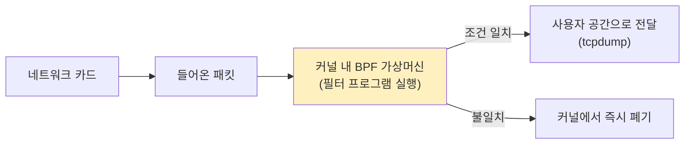
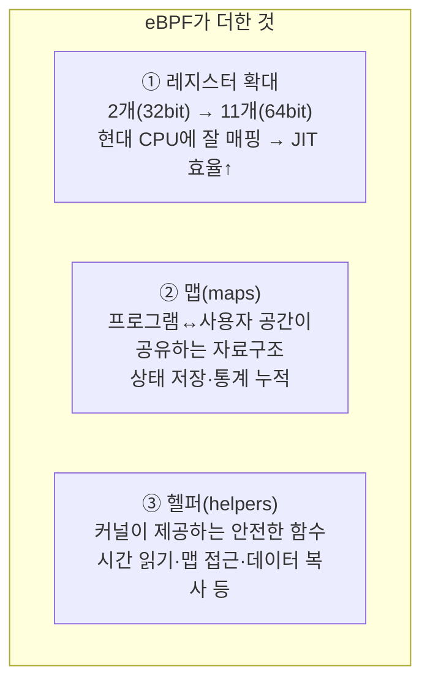
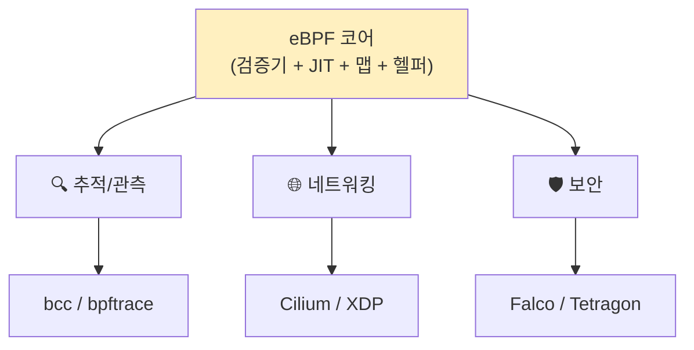
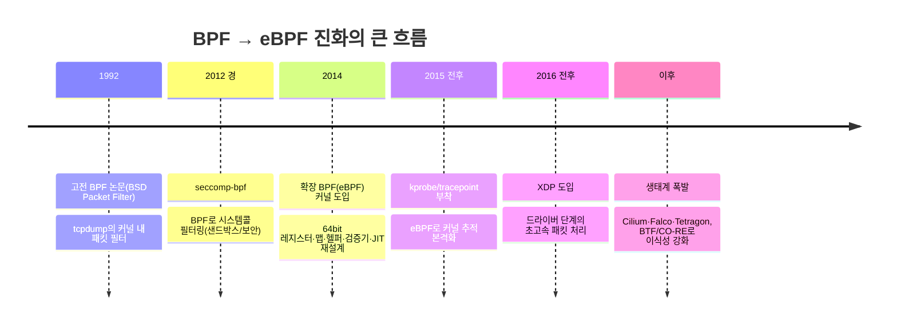
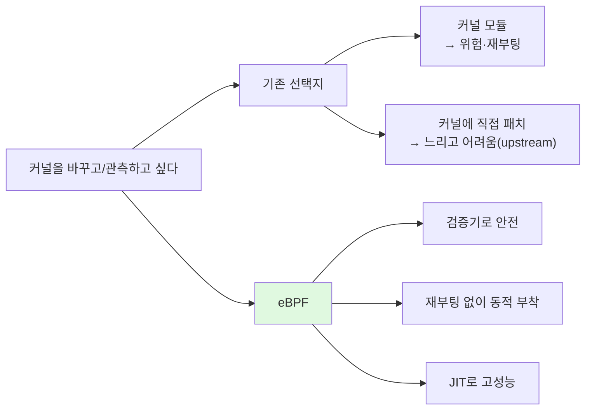

# 3주차 — BPF에서 eBPF로: 역사와 등장 배경
> 패킷 필터로 태어난 작은 가상머신이 어떻게 커널 전체의 프로그래머블 플랫폼이 되었나
last_updated: 2026-06-11

## 이번 주 학습 목표
- 1992년 고전 BPF(Berkeley Packet Filter)가 어떤 문제를 풀기 위해 등장했는지 설명할 수 있다.
- seccomp-bpf처럼 BPF가 패킷 필터 밖으로 확장된 사례를 안다.
- 2014년 확장 BPF(eBPF)가 도입한 핵심 변화(레지스터 확대·맵·헬퍼)와 그 의의를 설명할 수 있다.
- 커널 버전별 주요 이정표를 대략적인 흐름으로 이해한다.
- 오늘날 "eBPF"가 약자가 아니라 고유명사가 된 맥락과, eBPF가 커진 근본 이유를 설명할 수 있다.

---

## 1. 문제의 출발: 패킷을 빠르게 거르고 싶다 (1992)

1990년대 초, 네트워크 분석가들은 골치 아픈 문제에 부딪혔다. `tcpdump` 같은 도구로 네트워크 패킷을 잡아 분석하고 싶은데, 패킷은 **커널의 네트워크 스택**에 도착한다. 사용자 프로그램이 관심 있는 패킷(예: "포트 80 TCP만")만 보려면 어떻게 해야 할까?

순진한 방법은 **모든 패킷을 사용자 공간으로 복사**한 뒤 거기서 거르는 것이다. 하지만 이는 끔찍하게 비효율적이다. 트래픽의 99%가 관심 밖인데도 전부 복사하고, 매 패킷마다 커널↔사용자 경계를 넘나들어야 한다(2주차의 모드 전환 비용을 떠올리자).

**1992년**, Steven McCanne과 Van Jacobson(버클리)이 이 문제에 우아한 답을 냈다. 논문 *"The BSD Packet Filter"* 에서 제안한 **BPF(Berkeley Packet Filter)** 다.

> 아이디어: **"거르는 코드를 커널 안으로 내려보내자."** 사용자가 작은 필터 프로그램을 작성하면, 커널이 그것을 **커널 내부의 작은 가상머신(VM)** 에서 실행한다. 그러면 관심 없는 패킷은 커널에서 곧바로 버려지고, 통과한 패킷만 사용자 공간으로 올라온다.

고전 BPF의 특징:
- **작은 가상머신:** 2개의 32비트 레지스터(A, X)와 작은 스크래치 메모리를 가진 단순한 명령어 집합.
- **패킷 매칭 전용:** 패킷의 특정 바이트를 읽어 비교/분기하는 일에 최적화.
- **안전·고속:** 커널 안에서 돌지만 명령어가 단순해 위험이 적고 빨랐다.

이 설계가 너무 잘 만들어져서, `tcpdump`/libpcap의 핵심 메커니즘으로 오래도록 쓰였다. "필터 로직을 커널 안에서 안전하게 실행한다"는 개념이 여기서 확립된다.

---

## 2. 패킷 필터를 넘어서: seccomp-bpf

BPF의 "사용자가 정의한 작은 프로그램을 커널이 안전하게 실행한다"는 아이디어는 패킷 외에도 쓸모가 있었다. 대표 사례가 **seccomp-bpf** 다.

- **seccomp(secure computing mode)** 는 프로세스가 호출할 수 있는 시스템콜을 제한하는 보안 기능이다.
- **seccomp-bpf**(2012년경 도입)는 BPF 프로그램으로 **"이 프로세스가 어떤 시스템콜을 허용/차단할지"** 를 표현한다. 즉, 패킷 대신 **시스템콜**을 "필터링"한다.

이는 컨테이너·브라우저 샌드박스 등에서 공격 표면을 줄이는 데 널리 쓰인다(예: 신뢰할 수 없는 코드가 위험한 시스템콜을 못 부르게 막기). 핵심은 **"BPF가 네트워크 밖으로 나와 일반적인 정책 엔진으로 쓰이기 시작했다"** 는 점이다.

---

## 3. 대전환: 확장 BPF(eBPF)의 등장 (2014)

고전 BPF는 똑똑했지만, 패킷 필터링 수준의 **작고 제한적인 도구**였다. 레지스터 2개에 메모리도 작고, 상태를 오래 유지하거나 커널의 풍부한 정보에 접근하기 어려웠다.

**2014년**, **Alexei Starovoitov**(그리고 Daniel Borkmann 등)가 BPF를 근본적으로 확장해 리눅스 커널에 들였다. 이것이 **확장 BPF(extended BPF, eBPF)** 다. 단순한 성능 개선이 아니라 **BPF를 범용 커널 내 실행 엔진으로 재설계**한 사건이다.

### 3.1 무엇이 바뀌었나 — 세 가지 핵심

1. **레지스터 확대:** 32비트 레지스터 2개 → **64비트 레지스터 11개**. 현대 CPU 구조에 자연스럽게 대응해 **JIT 컴파일**(네이티브 기계어로 변환)이 효율적이 되었다. 더 복잡한 로직을 빠르게 실행할 수 있게 됐다.
2. **맵(maps):** eBPF의 게임 체인저. 프로그램이 호출 사이에 **상태를 유지**하고, **커널의 eBPF 프로그램과 사용자 공간 프로그램이 데이터를 공유**하게 해 주는 자료구조(해시맵·배열 등). "패킷 통과/차단"이라는 단발 판단을 넘어, **통계 누적·이벤트 집계**가 가능해졌다. (실습 ①에서 (PID, 시스템콜)별 카운트를 맵에 쌓는다.)
3. **헬퍼 함수(helpers):** eBPF 프로그램은 임의의 커널 함수를 호출할 수 없다(안전 때문). 대신 커널이 **허용된 안전한 함수 집합(헬퍼)** 을 제공한다 — 현재 시간 읽기, 맵 읽기/쓰기, 프로세스 정보 얻기, 데이터 복사 등.

### 3.2 적용 범위의 폭발: 추적·네트워킹·보안

이 변화 덕분에 eBPF는 패킷 필터를 훨씬 넘어 세 큰 영역으로 퍼졌다.

| 영역 | 무엇을 하나 | 이 과목 연결 |
|:---|:---|:---|
| **추적/관측(tracing)** | kprobe·tracepoint 등으로 커널/사용자 함수와 시스템콜을 관측 | 실습 ①·②, 7·8·14주차 |
| **네트워킹(networking)** | XDP·tc로 고속 패킷 처리·로드밸런싱·필터링 | 12주차 (Cilium) |
| **보안(security)** | LSM 훅·시스템콜 감시로 런타임 위협 탐지·정책 적용 | 13주차 (Falco/Tetragon) |

---

## 4. 커널 버전별 주요 이정표 (대략적 흐름)

정확한 연도·버전 세부는 자료마다 조금씩 다르므로, **대략적인 흐름**으로 이해하자. 핵심은 "한꺼번에 완성된 게 아니라, 여러 해에 걸쳐 단계적으로 커졌다"는 점이다.

- **고전 BPF(1992):** 패킷 필터.
- **seccomp-bpf(2012경):** 시스템콜 필터로 확장.
- **eBPF 도입(2014):** 레지스터·맵·헬퍼·검증기·JIT 재설계 → 범용화의 시작.
- **추적 부착(2015 전후):** kprobe/tracepoint에 eBPF를 붙여 커널 동작 관측이 본격화.
- **XDP(2016 전후):** 네트워크 카드 드라이버 수준에서 패킷을 초고속 처리하는 길이 열림.
- **그 이후:** **BTF/CO-RE**(6주차)로 한 번 빌드한 프로그램을 여러 커널에서 돌리는 이식성이 강화되고, Cilium·Falco·Tetragon 같은 대형 프로젝트가 등장하며 생태계가 폭발했다.

> ⚠️ 시험 대비 팁: 정확한 버전 번호 암기보다 **"패킷 필터(1992) → 시스템콜 필터(seccomp) → 범용 확장(2014, 맵/헬퍼) → 추적·네트워킹·보안으로 확산"** 이라는 **순서와 인과**를 이해하는 게 중요하다.

---

## 5. 고전 BPF vs eBPF 한눈에 비교

| 항목 | 고전 BPF (cBPF, 1992) | 확장 BPF (eBPF, 2014~) |
|:---|:---|:---|
| 주 용도 | 패킷 필터링(tcpdump) | 추적·네트워킹·보안 등 범용 |
| 레지스터 | 32비트 2개(A, X) | 64비트 11개 |
| 상태 유지 | 사실상 없음(단발 판단) | **맵**으로 상태·통계 유지 |
| 커널 기능 접근 | 거의 없음 | **헬퍼 함수**로 안전하게 접근 |
| 실행 방식 | 단순 인터프리트/제한적 | **검증기 + JIT** 로 안전·고속 |
| 사용자와의 통신 | 필터 결과(통과/폐기) 정도 | 맵·perf 이벤트로 풍부하게 |

핵심 한 줄: **고전 BPF가 "패킷을 거르는 작은 계산기"였다면, eBPF는 "커널 안에서 안전하게 돌릴 수 있는 작은 프로그래밍 플랫폼"이다.**

---

## 6. 왜 "eBPF"는 약자가 아니라 고유명사가 됐나

처음엔 extended Berkeley Packet Filter였지만, 이제 eBPF는 **패킷(Packet)과도, 버클리(Berkeley)와도 거의 상관없는** 일들을 한다. 시스템콜을 세고, 함수 실행 시간을 재고, 보안 정책을 강제한다. 그래서 커뮤니티와 공식 문서는 **"eBPF는 더 이상 약자가 아니다(고유명사다)"** 라고 본다. 마치 한때 약자였다가 그냥 이름이 된 다른 기술 용어들처럼.

### 6.1 왜 이렇게 커졌나 — 근본 이유

eBPF가 폭발적으로 성장한 본질은, 그것이 **"운영체제를 멈추거나 다시 빌드하지 않고도 안전하게 확장·관측할 수 있게 해 준" 최초의 실용적 길**이었기 때문이다.

1주차에서 본 "안전·재부팅 불필요·낮은 오버헤드"가 바로 이 성장의 동력이다. 클라우드·컨테이너 시대에 **수만 대의 머신을 재부팅 없이 안전하게 관측·제어**해야 하는 수요와 정확히 맞아떨어졌다. 그래서 Netflix·Meta·Google·Cloudflare 같은 대규모 인프라가 앞다투어 채택했고, 그 결과 eBPF는 리눅스를 넘어 **클라우드 네이티브 인프라의 핵심 기반 기술**이 되었다.

---

## 💡 핵심 요약
- **고전 BPF(1992)** 는 패킷 필터링을 위해 "거르는 코드를 커널 안 작은 VM에서 실행"하는 아이디어로 출발했다.
- **seccomp-bpf** 처럼 BPF는 일찍이 패킷을 넘어 **시스템콜 필터(보안)** 로도 확장됐다.
- **2014년 eBPF** 는 **64비트 레지스터 11개·맵·헬퍼·검증기·JIT**로 재설계되어, BPF를 범용 커널 내 실행 플랫폼으로 바꿨다.
- 그 결과 eBPF는 **추적·네트워킹·보안** 세 영역으로 폭발했고(bcc/bpftrace, Cilium, Falco/Tetragon), BTF/CO-RE로 이식성까지 갖췄다.
- 오늘날 "eBPF"는 **약자가 아닌 고유명사**이며, 성장의 근본 이유는 **"커널을 재부팅 없이 안전하게 확장·관측"** 하는 실용적 길을 처음 제시했기 때문이다.

---

## ✍️ 연습문제
1. 고전 BPF가 등장하기 전, 패킷을 사용자 공간에서 거르는 방식이 비효율적이었던 이유를 모드 전환·복사 비용 관점에서 설명하라.
2. "필터 로직을 커널 안에서 실행한다"는 고전 BPF의 핵심 아이디어가 왜 효율적인지 그림 없이 말로 설명하라.
3. seccomp-bpf가 "BPF의 일반화"를 보여 주는 사례인 이유를, 패킷과 시스템콜의 유사성으로 설명하라.
4. eBPF가 고전 BPF에 더한 세 가지(레지스터 확대·맵·헬퍼) 각각이 어떤 새로운 능력을 가능케 했는지 한 줄씩 서술하라.
5. "맵이 없던 고전 BPF로는 실습 ①(시스템콜 카운트)을 만들기 어렵다"는 주장을 근거와 함께 옹호하라.
6. eBPF가 "추적·네트워킹·보안"으로 확산된 흐름을, 각 영역의 대표 프로젝트 하나씩과 연결해 설명하라.
7. "eBPF는 BPF의 약자다"라는 진술의 문제점을 지적하고, 더 정확한 설명으로 고쳐 쓰라.
8. eBPF가 커널 모듈이나 커널 직접 패치 대비 가지는 장점을 "안전·운영 비용·성능" 세 축으로 비교하라.

---

## ✅ 자가점검 퀴즈
**Q1.** 고전 BPF(1992)는 본래 무엇을 위해 만들어졌는가?

정답

네트워크 패킷 필터링. tcpdump/libpcap이 관심 있는 패킷만 효율적으로 걸러 받기 위해, 필터를 커널 내 작은 가상머신에서 실행했다.

**Q2.** 확장 BPF(eBPF)에서 "프로그램이 상태를 유지하고 사용자 공간과 데이터를 공유"하게 해 주는 자료구조의 이름은?

정답

맵(maps). 해시맵·배열 등으로 통계 누적·이벤트 집계·커널↔사용자 공유가 가능해졌다.

**Q3.** eBPF 프로그램이 커널 기능에 접근할 때, 임의의 커널 함수 대신 호출하도록 제공되는 안전한 함수 집합은?

정답

헬퍼 함수(helpers). 시간 읽기, 맵 접근, 데이터 복사, 프로세스 정보 조회 등 커널이 허용한 함수들이다.

**Q4.** 2014년 eBPF를 커널에 도입한 핵심 인물로 가장 잘 알려진 사람은?

정답

Alexei Starovoitov (Daniel Borkmann 등과 함께 발전시켰다).

**Q5.** "eBPF"라는 이름에 대해 오늘날 통용되는 관점은?

정답

더 이상 특정 약자로 풀어 쓰지 않는 고유명사로 본다. 역사적으로 extended Berkeley Packet Filter에서 왔지만, 이제는 패킷 필터를 훨씬 넘어선 일을 한다.

---

## 📚 더 읽을거리
- McCanne & Jacobson, *"The BSD Packet Filter: A New Architecture for User-level Packet Capture"* (1993, USENIX) — 고전 BPF 원전
- ebpf.io — "What is eBPF?" 및 eBPF 역사/아키텍처 개요
- Brendan Gregg, *BPF Performance Tools* — eBPF 추적 도구의 역사와 활용
- 리눅스 커널 문서: `Documentation/bpf/` (BPF/eBPF, seccomp 관련 자료)

---

## ⏭ 다음 주 예고
역사를 봤으니 이제 내부를 연다. eBPF가 어떻게 안전을 보장하는지(**검증기**), 어떻게 빠른지(**JIT**), 데이터를 어떻게 다루는지(**맵**), 커널 기능에 어떻게 닿는지(**헬퍼**) — 4주차에서 eBPF의 아키텍처를 한 조각씩 뜯어본다. → [4주차](04주차_eBPF_아키텍처_검증기_JIT_맵_헬퍼.md)
