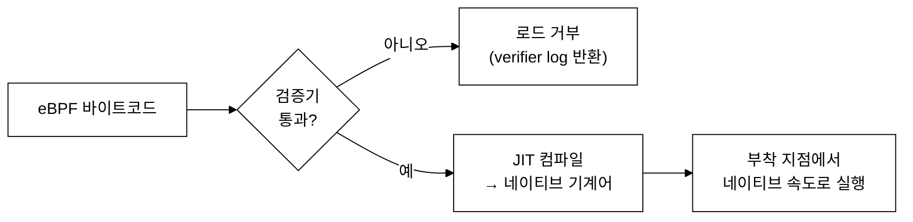
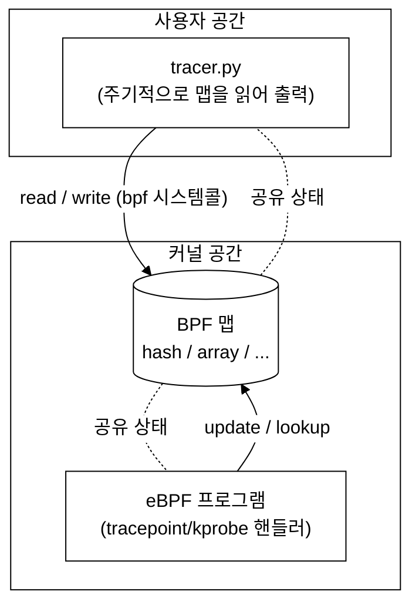
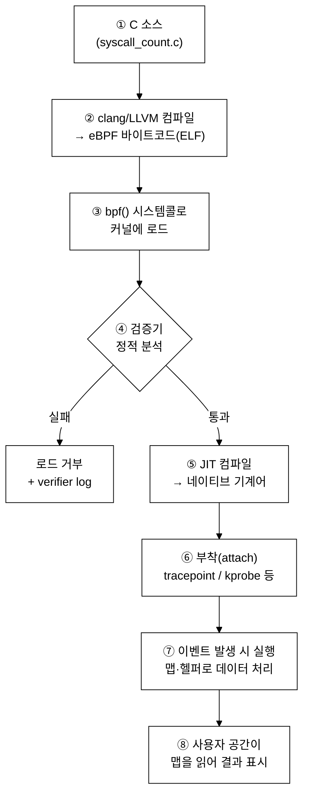

# 4주차 — eBPF 아키텍처: 검증기·JIT·맵·헬퍼
> "안전하게 커널에서 돈다"는 말의 실체를 뜯어봅니다. eBPF를 떠받치는 네 개의 기둥 — 가상머신, 검증기, JIT, 맵/헬퍼 — 을 한 번에 정리합니다.

last_updated: 2026-06-11

> 🔰 **1학년·입문자 진입로**: 이번 주는 이론의 핵심이라 C 코드로 설명하는 부분이 많습니다.
> C 가 낯설면 [C 언어 미니부록](00b_준비_C언어_미니부록.md)을 먼저 보고, 용어는 [용어 사전](00c_용어집_약어사전.md)에서 찾으세요.
> **코드를 한 줄씩 못 읽어도 괜찮습니다** — 각 절의 굵은 글씨 핵심 메시지(예: "검증기가 위험한 코드를 로드 전에 막는다")만 따라가도 이번 주 목표는 달성됩니다.

## 이번 주 학습 목표

- eBPF 가상머신(VM)의 구조(레지스터, 스택, 명령어)를 설명하고, 왜 굳이 VM 형태인지 말할 수 있다.
- **검증기(verifier)** 가 로드 전에 정적 분석으로 무엇을 "보장"하는지, 어떤 코드가 거부되는지 구체적으로 안다.
- **JIT 컴파일**이 검증을 통과한 바이트코드를 어떻게 빠른 네이티브 코드로 바꾸는지 안다.
- **맵(map)** 이 커널과 사용자 공간을 잇는 공유 저장소임을 이해하고, 주요 타입과 용도를 구분할 수 있다.
- **헬퍼 함수(helper)** 가 왜 "임의 커널 함수 호출"을 대체하는지, 대표 헬퍼들을 안다.
- C 소스가 실행되기까지의 **로드 파이프라인** 전체를 그릴 수 있다.

지난 [3주차](03주차_BPF에서_eBPF로_역사와_등장배경.md)에서 cBPF가 어떻게 eBPF로 확장되었는지 역사를 봤습니다. 이번 주는 그 eBPF가 "내부적으로 어떻게 생겼는가"를 봅니다. 이론적으로 가장 핵심이 되는 주차이니 천천히 따라오세요.

---

## 1. eBPF 가상머신과 바이트코드 🧩

### 1.1 왜 가상머신인가

커널 안에서 사용자가 작성한 코드를 돌린다는 것은 매우 위험한 일입니다. 잘못 짠 코드 한 줄이 커널 패닉(시스템 전체 정지)으로 이어질 수 있으니까요. 그래서 eBPF는 사용자 코드를 **기계어로 직접** 넣지 않습니다. 대신 잘 정의된 **가상머신(VM)의 명령어 집합**으로 먼저 표현합니다.

VM 형태가 주는 이점은 세 가지입니다.

1. **분석 가능성** — 명령어 집합이 단순하고 닫혀 있어서, 로드 전에 프로그램 전체를 자동으로 검사(검증)하기 쉽습니다.
2. **아키텍처 독립성** — 같은 바이트코드를 x86-64든 aarch64든 어디서나 받아서, 그 CPU에 맞는 기계어로 변환할 수 있습니다. (우리 실습 VM은 aarch64입니다.)
3. **격리** — VM의 명령어로 할 수 있는 일을 제한하면, 그 위에서 도는 코드가 할 수 있는 일도 자연히 제한됩니다.

> 📌 비유: 자바의 바이트코드(JVM)와 구조가 비슷합니다. "한 번 컴파일, 어디서나 실행"에 더해, eBPF는 "실행 전에 안전성까지 증명"을 추가한 셈입니다.

### 1.2 레지스터와 스택

eBPF VM은 **64비트 레지스터 11개**를 가집니다(`r0` ~ `r10`). 각 레지스터의 역할은 호출 규약(calling convention)으로 정해져 있습니다.

| 레지스터 | 역할 |
|:---|:---|
| `r0` | 함수(헬퍼)의 **반환값**, 그리고 eBPF 프로그램 자체의 종료 코드 |
| `r1` ~ `r5` | 헬퍼 호출 시 **인자**를 전달 (최대 5개) |
| `r6` ~ `r9` | 호출 사이에 값이 보존되는 **콜리-세이브(callee-saved)** 레지스터 |
| `r10` | **프레임 포인터** — 스택을 가리키며, **읽기 전용** |

스택은 프로그램당 **512바이트**로 고정되어 있습니다. 작죠? 이것은 제약이자 보호 장치입니다. 커널 스택은 매우 작고 귀하기 때문에, eBPF가 큰 데이터를 다뤄야 한다면 스택이 아니라 **맵**(3절)에 두라는 설계입니다.

명령어 집합은 RISC 스타일로, 산술/논리 연산, 메모리 로드·스토어, 점프(분기), 그리고 **헬퍼 호출(`call`)** 정도로 구성됩니다. 임의의 주소로 점프하거나 임의 커널 함수를 부르는 명령은 **없습니다**. 이 "없음"이 곧 안전성의 출발점입니다.

```text
[ eBPF 가상머신 한눈에 ]
 레지스터: r0 ~ r10 (64비트 × 11)
 스택    : 512 바이트 (r10이 가리킴, 읽기전용 FP)
 명령어  : 산술/논리, load/store, jump, call(helper)
 금지    : 임의 주소 점프 ✗, 임의 커널 함수 호출 ✗
```

---

## 2. 검증기(verifier) — eBPF 안전성의 심장 🔍

> "eBPF는 커널에서 안전하게 돈다"는 문장에서 **'안전하게'를 책임지는 주체가 바로 검증기**입니다.

프로그램을 커널에 로드하면, 실행되기 **전에** 검증기가 프로그램 전체를 정적으로 분석합니다. 검증을 통과하지 못하면 `bpf()` 시스템콜이 실패하고, 프로그램은 아예 커널에 올라가지 못합니다. 즉 "잘못된 eBPF는 실행되는 게 아니라, 로드 자체가 거부"됩니다.

검증기가 보장하려는 것들을 하나씩 봅시다.

### 2.1 프로그램은 반드시 종료한다 (종료성)

커널 안에서 무한 루프가 돌면 그 CPU는 영영 돌아오지 못합니다. 그래서 검증기는 **프로그램이 유한한 단계 안에 끝남**을 증명할 수 있어야 합니다.

- 초창기에는 백워드 점프(뒤로 가는 점프), 즉 사실상 모든 루프가 금지였습니다. 루프는 컴파일러가 펼치거나(unroll) 손으로 풀어야 했죠.
- 이후 커널 5.3부터 **바운디드 루프(bounded loop)** 가 허용되었습니다. 검증기가 "이 루프는 많아야 N번 돈다"를 증명할 수 있으면 통과합니다.
- 또한 검증기는 분석할 명령어 수에 상한이 있어, 지나치게 거대한 프로그램(분기 폭발)은 거부됩니다.

### 2.2 메모리 안전성 (범위 밖 접근 금지)

검증기는 모든 레지스터에 대해 "이 값이 가질 수 있는 범위"를 추적합니다. 포인터를 역참조하기 전에 그 포인터가 **유효한 영역을 가리키며 경계를 넘지 않음**이 증명되어야 합니다.

대표적인 예가 **맵에서 꺼낸 포인터**입니다.

```c
u32 *want = target.lookup(&zero);
if (!want || *want == 0) {     // ← 이 NULL 검사가 없으면 검증기가 거부한다
    return 0;
}
```

위는 실습①(`syscall-tracer/bpf/syscall_count.c`)의 실제 코드입니다. `lookup`은 키가 없으면 `NULL`을 돌려줄 수 있습니다. 검증기는 "이 포인터는 NULL일 수도 있다"는 사실을 알기 때문에, **NULL 검사 없이 `*want`로 역참조하면 즉시 로드를 거부**합니다. 우리가 흔히 무심코 빠뜨리는 NULL 체크를, 여기서는 안 하면 코드 자체가 안 올라갑니다.

### 2.3 커널 포인터 유출 금지

eBPF 프로그램은 커널 내부 주소(포인터 값)를 맵이나 사용자 공간으로 **그대로 흘려보낼 수 없습니다**. 만약 가능하다면 KASLR(주소 무작위화) 같은 보호가 무력화되어, 공격자가 커널 메모리 레이아웃을 알아낼 수 있기 때문입니다. 검증기는 포인터 타입 값이 외부로 새는 경로를 차단합니다.

### 2.4 초기화되지 않은 값 사용 금지 / 권한 검사

- 읽기 전에 쓰지 않은(초기화 안 된) 스택 메모리를 읽으려 하면 거부됩니다. 그래서 우리 코드에 `struct key_t key = {};` 처럼 **0으로 초기화**하는 습관이 보이는 것입니다.
- 또한 프로그램 타입과 호출하는 헬퍼는 **권한(capability)** 과 맞아야 합니다. 예를 들어 추적 프로그램을 올리려면 적절한 권한(전통적으로 `CAP_BPF`/`CAP_PERFMON` 또는 루트)이 필요합니다.

### 2.5 거부되는 코드 — 직접 보기

검증기가 어떤 코드를 싫어하는지 감을 잡아 봅시다.

```c
// ❌ 예시 1: 무한 루프 — 종료성을 증명할 수 없음
int i = 0;
while (i >= 0) {       // 상한이 없는 루프 → 거부
    do_something();
}

// ❌ 예시 2: NULL 검사 없는 맵 포인터 역참조
u64 *v = counts.lookup(&key);
(*v)++;                // v가 NULL일 수 있음 → 거부

// ❌ 예시 3: 범위를 보장하지 않은 인덱싱
char buf[16];
int idx = ctx->some_field;   // 값의 범위를 모름
buf[idx] = 0;                // idx가 0..15 임을 증명 못 함 → 거부
```

실제로 검증에 실패하면 커널이 **상세한 검증 로그**를 돌려줍니다(거부된 명령어 번호, 레지스터 상태 등). eBPF 개발에서 "verifier log 읽는 법"은 사실상 필수 디버깅 기술입니다. 이 로그는 11주차 libbpf 실습에서 다시 만나게 됩니다.

> 💬 핵심 한 줄: 검증기는 "이 프로그램은 절대 사고를 안 친다"를 **수학적으로 보수적으로** 증명합니다. 그래서 가끔 "안전한데도 거부"되는 일이 생깁니다. 안전성을 위해 표현력을 일부 희생한 트레이드오프입니다.

---

## 3. JIT 컴파일 — 느린 인터프리트에서 네이티브 속도로 ⚡

검증을 통과한 바이트코드는 어떻게 실행될까요? 두 가지 방법이 있습니다.

1. **인터프리터** — 커널이 바이트코드를 한 명령씩 해석하며 실행. 이식성은 좋지만 느립니다.
2. **JIT(Just-In-Time) 컴파일** — 검증을 통과한 바이트코드를 **그 CPU의 네이티브 기계어로 한 번에 번역**해 두고, 이후로는 네이티브 코드를 직접 실행. 빠릅니다.

요즘 주요 아키텍처(x86-64, aarch64 등)에서는 JIT가 기본 동작입니다. 그래서 eBPF 프로그램은 패킷 하나하나, 시스템콜 하나하나처럼 **고빈도 경로**에 붙어도 오버헤드가 매우 작습니다.

순서를 헷갈리지 마세요. **검증이 먼저, JIT가 나중**입니다.



검증이 JIT보다 앞에 오는 것은 당연합니다. "안전함이 증명된 코드"만 빠른 기계어로 바꿀 가치가 있으니까요. 안전성(검증) → 성능(JIT)의 순서가 eBPF 철학을 그대로 보여줍니다.

---

## 4. 맵(map) — 커널과 사용자 공간의 공유 저장소 🗄️

eBPF 프로그램은 스택이 512바이트뿐이고, 실행이 끝나면 지역 변수는 사라집니다. 그렇다면 "PID별 카운트"처럼 **호출 사이에 누적되는 상태**나, **사용자 공간이 읽어가야 할 결과**는 어디에 둘까요? 바로 **맵**입니다.

맵은 커널 안에 사는 **키-값 저장소**이고, eBPF 프로그램(커널 측)과 사용자 공간 프로그램(파이썬/libbpf 측)이 **동시에 접근**할 수 있습니다.



### 4.1 주요 맵 타입

| 타입 | 키→값 형태 | 대표 용도 |
|:---|:---|:---|
| **Hash** | 임의 키 → 값 | 동적인 키 집계(예: PID별 카운트) |
| **Array** | 정수 인덱스 → 값 | 고정 크기 테이블, 설정/필터 값 |
| **Per-CPU Hash/Array** | CPU마다 별도 사본 | 락 없는 고속 카운터(나중에 합산) |
| **Perf Event Array** | (이벤트 스트림) | 커널 → 사용자로 이벤트를 흘려보냄 |
| **Ring Buffer** | (이벤트 스트림) | perf array의 후속, 더 효율적/순서보장(커널 5.8+) |
| **LRU Hash** | 임의 키 → 값 | 용량 초과 시 오래된 항목 자동 퇴출 |

> 📎 Per-CPU 맵은 왜 빠를까요? 여러 CPU가 같은 카운터를 동시에 늘리면 락 경합이 생깁니다. CPU마다 사본을 두면 경합이 사라지고, 사용자 공간에서 마지막에 모두 더해 합계를 냅니다.

### 4.2 실습①의 맵 두 개 읽기

실습① `syscall_count.c`에는 서로 다른 목적의 맵이 나옵니다.

```c
// (tgid, syscall_id) -> 호출 횟수 : 동적인 키들을 누적 → Hash가 적합
BPF_HASH(counts, struct key_t, u64);

// tgid -> 프로세스 이름
BPF_HASH(comms, u32, struct comm_t);

// 사용자 공간이 주입하는 "필터 값" 한 칸 : 고정 인덱스 → Array가 적합
BPF_ARRAY(target, u32, 1);
```

- `counts`(**Hash**): 어떤 PID가 어떤 시스템콜을 몇 번 불렀는지 **커널 안에서** 누적합니다. 만약 이걸 매번 사용자 공간으로 보냈다면 이벤트 폭주로 부하가 엄청났을 겁니다. **집계는 커널에서, 결과만 사용자 공간으로** — 이것이 eBPF 관측의 핵심 패턴입니다.
- `target`(**Array**): 사용자 공간이 "이 PID만 추적해"라고 **써넣는** 한 칸짜리 배열입니다. 커널 측은 매 이벤트마다 이 값을 `lookup`해서 필터로 씁니다. 방향이 반대인(사용자→커널) 통신이라는 점에 주목하세요.

맵은 이렇게 **양방향**입니다. 결과를 올려보내기도(`counts`), 설정을 내려보내기도(`target`) 합니다.

### 4.3 실습②의 이벤트 스트림 맵

집계가 아니라 "연결 시도 하나하나"를 실시간으로 보고 싶을 땐 Hash로는 부족합니다. 실습②(`netflow-tracer/bpf/tcpconnect.c`)는 이벤트 채널을 씁니다.

```c
BPF_PERF_OUTPUT(events);     // perf event array 기반 이벤트 채널
// ...
events.perf_submit(ctx, &e, sizeof(e));   // 이벤트 한 건을 사용자 공간으로 push
```

`counts`(누적)와 `events`(스트림)의 차이를 분명히 해두세요. 누적은 "얼마나 많이?"에, 스트림은 "언제 무엇이?"에 답합니다. 최신 커널이라면 perf event array 대신 **Ring Buffer**가 더 효율적인 선택입니다(8주차에서 다룹니다).

---

## 5. 헬퍼 함수(helper) — eBPF가 허락받은 커널 API 🧰

### 5.1 왜 임의 커널 함수를 못 부르나

2절에서 봤듯, eBPF VM에는 "임의 주소로 점프/호출"하는 명령이 없습니다. 만약 eBPF가 아무 커널 함수나 부를 수 있다면, 검증기는 그 호출이 안전한지 증명할 길이 없습니다(함수 내부에서 무슨 짓을 할지 모르니까요). 그래서 eBPF는 **커널이 미리 안전성을 보증한 함수 목록** = **헬퍼**만 호출할 수 있습니다.

헬퍼는 `r1`~`r5`로 인자를 받고 `r0`로 결과를 돌려주는 약속을 지키며, 검증기는 각 헬퍼의 인자 타입·범위를 알고 검사합니다.

### 5.2 자주 쓰는 헬퍼

| 헬퍼 | 하는 일 |
|:---|:---|
| `bpf_get_current_pid_tgid()` | 현재 태스크의 (TGID<<32 \| PID)를 64비트로 반환 |
| `bpf_get_current_comm(buf, size)` | 현재 프로세스 이름(comm)을 버퍼에 복사 |
| `bpf_probe_read_kernel(dst, size, src)` | 커널 메모리를 **안전하게** 읽기(폴트 시 실패 처리) |
| `bpf_perf_event_output(...)` | perf event array로 이벤트 전송(BCC: `perf_submit`) |
| `bpf_ktime_get_ns()` | 부팅 후 경과 시간(나노초) — 지연시간 측정에 사용 |
| `bpf_map_lookup_elem / update_elem` | 맵 조회/갱신(BCC: `map.lookup` / `map.update`) |

### 5.3 실습 코드에서 헬퍼 찾기

실습①:

```c
u64 id = bpf_get_current_pid_tgid();   // PID/TGID 한 번에
u32 tgid = id >> 32;                    // 상위 32비트 = TGID
// ...
bpf_get_current_comm(&c.name, sizeof(c.name));  // 프로세스 이름
```

실습②:

```c
// 커널 안의 sockaddr 구조체를 직접 역참조하지 않고 헬퍼로 '안전하게' 읽는다
bpf_probe_read_kernel(&family, sizeof(family), &sin->sin_family);
bpf_probe_read_kernel(&e.daddr, sizeof(e.daddr), &sin->sin_addr.s_addr);
bpf_get_current_comm(&e.comm, sizeof(e.comm));
events.perf_submit(ctx, &e, sizeof(e));          // = bpf_perf_event_output
```

`bpf_probe_read_kernel`이 중요합니다. eBPF는 커널 포인터(`sin`)를 `*sin`처럼 곧바로 역참조하면 안 됩니다. 그 주소가 진짜 매핑되어 있는지 모르기 때문이죠(잘못 읽으면 폴트). 헬퍼는 읽다가 실패해도 커널을 죽이지 않고 **안전하게 오류만 반환**합니다. "직접 역참조 대신 헬퍼로 읽기"가 eBPF 메모리 접근의 원칙입니다.

---

## 6. 로드 파이프라인 전체 흐름 🛠️

지금까지의 조각들을 하나의 흐름으로 꿰어 봅시다. C로 짠 한 줄이 커널에서 돌기까지 거치는 길입니다.



각 단계를 우리 도구에 대응시키면:

- **①~②** : BCC가 런타임에 clang으로 컴파일하거나(7~10주차), libbpf가 미리 빌드합니다(11주차).
- **③~⑤** : 커널이 담당합니다. 우리가 직접 손댈 수 없는, 신뢰의 핵심 구간입니다.
- **⑥** : tracepoint(실습①) 또는 kprobe(실습②) 같은 **부착 지점**을 고릅니다. 이 선택지는 [5주차](05주차_프로그램_타입과_부착지점.md)에서 본격적으로 다룹니다.
- **⑦~⑧** : 맵(4절)과 헬퍼(5절)가 데이터를 나릅니다.

> 🔁 다시 강조: 이 파이프라인에서 **검증기 → JIT** 순서, 그리고 **맵·헬퍼만으로 커널과 대화**한다는 두 가지가 eBPF 안전 모델의 뼈대입니다.

---

## 💡 핵심 요약

- eBPF는 사용자 코드를 **VM 바이트코드**로 표현한다(레지스터 11개, 스택 512B, 제한된 명령어). VM이라서 분석·이식·격리가 쉽다.
- **검증기**는 로드 전에 종료성, 메모리 안전성, 포인터 유출 금지, 초기화·권한을 정적으로 보증한다. 통과 못 하면 **실행이 아니라 로드가 거부**된다.
- **JIT**는 검증을 통과한 바이트코드를 네이티브 기계어로 바꿔 고속 실행한다. (검증 → JIT 순서)
- **맵**은 커널↔사용자 공유 키-값 저장소다. Hash(집계), Array(설정/필터), Perf/Ring Buffer(이벤트 스트림) 등 용도별로 고른다. 실습①은 `counts`(Hash)·`target`(Array), 실습②는 `events`(perf output)을 쓴다.
- **헬퍼**는 eBPF가 부를 수 있는 안전 보증된 커널 API다. 임의 커널 함수 호출은 불가. 커널 메모리는 `bpf_probe_read_kernel`로 안전하게 읽는다.

---

## ✍️ 연습문제

1. eBPF VM의 스택이 512바이트로 작게 제한된 이유를 설명하고, 큰 데이터를 다뤄야 할 때의 대안을 쓰시오.
2. 다음 코드가 검증기에 의해 거부되는 이유를 한 문장으로 쓰고, 통과하도록 고치시오.
   ```c
   u64 *v = counts.lookup(&key);
   (*v)++;
   ```
3. 검증과 JIT의 순서가 "검증 먼저, JIT 나중"인 이유를 eBPF 설계 철학(안전성/성능)과 연결해 설명하시오.
4. 실습①의 `counts`(Hash)와 `target`(Array)는 데이터가 흐르는 방향이 서로 반대다. 각각 누가 쓰고 누가 읽는지, 왜 Hash와 Array를 골랐는지 쓰시오.
5. eBPF가 `*sin`처럼 커널 포인터를 직접 역참조하지 않고 `bpf_probe_read_kernel`을 쓰는 이유를 메모리 안전성 관점에서 설명하시오.

---

## ✅ 자가점검 퀴즈

1. eBPF 프로그램의 종료 코드와 헬퍼 반환값이 담기는 레지스터는?
   <details><summary>정답</summary>`r0`. 헬퍼 호출의 결과와 프로그램 자체의 종료 코드 모두 `r0`에 담깁니다.</details>

2. 검증기가 "이 프로그램은 반드시 끝난다"를 보장하는 것을 무엇이라 하며, 커널 5.3 이후 어떤 완화가 생겼나?
   <details><summary>정답</summary>종료성(termination) 보장입니다. 초창기에는 사실상 모든 루프(백워드 점프)가 금지였지만, 5.3부터 검증기가 반복 횟수 상한을 증명할 수 있는 **바운디드 루프**가 허용되었습니다.</details>

3. "잘못 짠 eBPF는 실행 중에 죽는다"는 설명은 맞는가?
   <details><summary>정답</summary>대체로 틀립니다. 검증을 통과하지 못하면 **로드 자체가 거부**되어 애초에 실행되지 않습니다. 검증기가 잡지 못하는 논리 오류는 있을 수 있지만, 메모리 안전성/종료성 같은 안전성 위반은 로드 단계에서 막힙니다.</details>

4. PID별 시스템콜 횟수처럼 호출 사이에 누적되는 상태는 어디에 저장해야 하나? 그리고 왜 스택은 안 되나?
   <details><summary>정답</summary>맵(예: Hash)에 저장합니다. eBPF 스택은 512바이트로 작고, 프로그램 실행이 끝나면 지역 변수가 사라지므로 누적 상태를 담을 수 없습니다.</details>

5. eBPF가 임의의 커널 함수를 직접 호출하지 못하고 헬퍼만 부를 수 있는 근본 이유는?
   <details><summary>정답</summary>검증기가 안전성을 증명할 수 있어야 하기 때문입니다. 임의 커널 함수는 내부 동작을 검증기가 알 수 없어 안전을 보장할 수 없으므로, 커널이 안전성을 보증한 **헬퍼 목록**으로 호출을 제한합니다.</details>

6. perf event array(또는 ring buffer)와 hash 맵은 각각 어떤 질문에 답하기 좋은가?
   <details><summary>정답</summary>hash는 "얼마나 많이?"(집계), perf/ring buffer는 "언제 무엇이?"(개별 이벤트 스트림)에 적합합니다. 실습①은 hash로 집계하고, 실습②는 perf output으로 연결 시도를 스트리밍합니다.</details>

---

## 📚 더 읽을거리

- Linux 커널 문서: BPF 검증기(`Documentation/bpf/verifier.rst`)와 BPF 일반 문서(`Documentation/bpf/`).
- ebpf.io — "What is eBPF?" 의 아키텍처 절(검증기·JIT·맵·헬퍼 개관).
- man 페이지: `bpf(2)`(시스템콜), `bpf-helpers(7)`(헬퍼 함수 전체 목록).
- 실습 소스 직접 읽기: `projects/syscall-tracer/bpf/syscall_count.c`, `projects/netflow-tracer/bpf/tcpconnect.c`.

---

## ⏭ 다음 주 예고

이번 주에 "eBPF가 어떻게 안전하게 도는가"를 봤다면, [5주차](05주차_프로그램_타입과_부착지점.md)에서는 "**eBPF를 어디에 붙이는가**"를 봅니다. kprobe·tracepoint·uprobe·XDP·tc·LSM 등 프로그램 타입과 부착 지점을 시스템 스택 위에 배치해 보고, 실습①이 왜 tracepoint를, 실습②가 왜 kprobe를 골랐는지 그 이유를 분명히 합니다.
