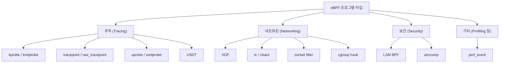
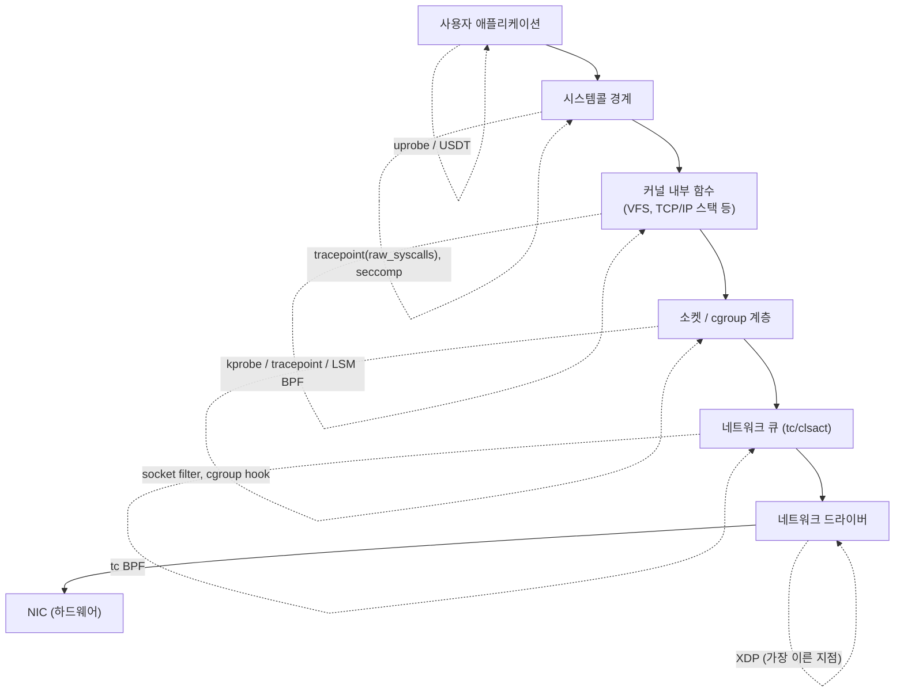

# 5주차 — 프로그램 타입과 부착 지점
> eBPF 프로그램의 정체는 "무엇을 하느냐"보다 "어디에 붙느냐"로 갈립니다. 추적·네트워킹·보안의 부착 지점들을 시스템 스택 위에 펼쳐 봅니다.

last_updated: 2026-06-11

## 이번 주 학습 목표

- eBPF 프로그램이 **부착 지점(attach point)** 에 따라 종류가 나뉜다는 큰 그림을 이해한다.
- 추적계 부착 지점(kprobe/kretprobe, tracepoint/raw_tracepoint, uprobe/uretprobe, USDT)의 **안정성 vs 자유도** 트레이드오프를 설명할 수 있다.
- 네트워킹계(XDP, tc/clsact, 소켓 필터, cgroup 훅)와 보안계(LSM BPF, seccomp), 기타(perf_event)의 용도를 한 줄로 구분할 수 있다.
- "프로그램 타입 → 부착 지점 → 대표 용도 → 등장 시점" 표를 읽고 활용할 수 있다.
- 실습①이 **tracepoint**, 실습②가 **kprobe** 를 고른 이유를 설명할 수 있다.

[4주차](04주차_eBPF_아키텍처_검증기_JIT_맵_헬퍼.md)에서 eBPF가 "안전하게 도는" 내부 구조를 봤습니다. 그런데 그 프로그램은 가만히 있다가 **무언가 일어날 때** 실행됩니다. "무언가"가 시스템콜일 수도, 패킷 도착일 수도, 함수 호출일 수도 있죠. 그 트리거가 곧 부착 지점이고, 이번 주의 주제입니다.

---

## 1. 부착 지점이 곧 프로그램 타입이다 🌳

eBPF 프로그램은 그 자체로 "혼자" 도는 게 아니라, 커널의 **특정 이벤트(훅, hook)** 에 매달려 있다가 그 이벤트가 발생하면 깨어나 실행됩니다. 이때

- **어디에 붙을 수 있는가**,
- **그 자리에서 어떤 컨텍스트(인자)** 를 받는가,
- **무엇을 할 수 있고/없는가**(검증기 규칙)

가 모두 **프로그램 타입(program type)** 으로 정해집니다. 즉 eBPF에서 "타입"은 데이터 타입이 아니라 **"어디에 붙는 프로그램인가"** 를 뜻합니다.

크게 네 갈래로 나눠 봅시다.



이번 과목에서 직접 코드를 짜는 것은 추적계(kprobe, tracepoint)지만, 나머지 갈래도 어떤 자리에 있는지 알아두면 12~14주차가 훨씬 수월해집니다.

---

## 2. 추적계(Tracing) — 시스템 내부를 들여다보기 🔬

추적계는 "지금 시스템 안에서 무슨 일이 벌어지는가"를 관찰하기 위한 부착 지점들입니다. 공통된 긴장 관계가 하나 있습니다: **자유도(아무 데나 붙일 수 있는가) vs 안정성(커널이 바뀌어도 안 깨지는가)**.

### 2.1 kprobe / kretprobe — 임의 커널 함수에 붙기

- **kprobe**: 거의 **모든 커널 함수의 진입점**에 동적으로 붙습니다. `tcp_v4_connect`처럼 이름만 알면 그 함수가 불릴 때 내 eBPF가 실행됩니다.
- **kretprobe**: 같은 함수의 **반환 시점**에 붙습니다. 반환값이나 "함수가 얼마나 걸렸는지(지연시간)"를 잴 때 씁니다.

장점은 압도적인 **자유도** — 커널 내부 어디든 거의 다 들여다볼 수 있습니다. 단점은 **불안정성** — 함수 이름·시그니처는 커널 버전마다 바뀔 수 있어서, 어떤 커널에선 잘 되던 게 다른 커널에선 함수가 없어 부착에 실패할 수 있습니다.

실습②가 바로 kprobe입니다.

```c
// netflow-tracer/bpf/tcpconnect.c
int kprobe__tcp_v4_connect(struct pt_regs *ctx, void *sk,
                           struct sockaddr *uaddr, int addr_len) {
    // tcp_v4_connect 의 인자(목적지 주소)를 직접 받아 읽는다
    ...
}
```

### 2.2 tracepoint / raw_tracepoint — 커널이 보장하는 안정적 지점

- **tracepoint**: 커널 개발자들이 "여기는 관찰해도 좋다"고 **미리 심어둔 표준 관측 지점**입니다. 각 tracepoint는 **안정적인 인자 형식(format)** 을 제공합니다.
- **raw_tracepoint**: 같은 지점이지만 가공 전 원시 인자를 받아 오버헤드가 더 작은 변형입니다.

장점은 **안정성** — 커널 ABI의 일부로 취급되어 버전이 바뀌어도 잘 유지됩니다. 단점은 **자유도 제한** — 커널이 미리 심어둔 자리에만 붙을 수 있습니다.

실습①이 tracepoint입니다.

```c
// syscall-tracer/bpf/syscall_count.c
TRACEPOINT_PROBE(raw_syscalls, sys_enter) {
    // 모든 시스템콜 진입을 한 자리에서 잡는 안정적 지점
    key.syscall_id = args->id;   // tracepoint가 제공하는 안정적 인자
    ...
}
```

> 📌 `raw_syscalls:sys_enter`는 "모든 시스템콜의 진입"을 한 자리에서 잡아 주는 특별히 유용한 tracepoint입니다. 시스템콜별로 일일이 kprobe를 거는 대신, 이 한 곳에서 `args->id`로 어떤 시스템콜인지 구분합니다.

### 2.3 uprobe / uretprobe — 사용자 공간 함수에 붙기

kprobe가 커널 함수였다면, **uprobe/uretprobe**는 **사용자 공간 프로그램·라이브러리의 함수**에 붙습니다. 예를 들어 `libssl`의 함수에 붙여 암호화 전 평문을 관찰하거나, 특정 애플리케이션 함수 호출을 추적할 수 있습니다. 자유도는 크지만, 사용자 코드도 버전·심볼에 따라 깨질 수 있고 호출 빈도가 높으면 오버헤드가 큽니다.

### 2.4 USDT — 애플리케이션이 심어둔 정적 추적점

**USDT(User Statically-Defined Tracing)** 는 애플리케이션 개발자가 소스에 미리 박아둔 정적 추적 지점입니다(예: 일부 언어 런타임, 데이터베이스). uprobe보다 안정적이고 의미가 분명하다는 장점이 있지만, **그 추적점을 미리 심어둔 프로그램**에서만 쓸 수 있습니다.

### 2.5 추적계 한눈 비교

| 부착 지점 | 대상 | 자유도 | 안정성 | 비고 |
|:---|:---|:---:|:---:|:---|
| kprobe/kretprobe | 임의 커널 함수 | 높음 | 낮음 | 버전 의존, 실습② 사용 |
| tracepoint/raw_tracepoint | 커널 표준 관측점 | 낮음 | 높음 | ABI 안정, 실습① 사용 |
| uprobe/uretprobe | 사용자 함수/라이브러리 | 높음 | 낮음 | 고빈도 시 오버헤드 |
| USDT | 앱이 심은 정적 추적점 | 중간 | 중간 | 추적점이 있어야 사용 가능 |

> 💬 한 줄 정리: **"안정성이 중요하면 tracepoint/USDT, 자유도가 필요하면 kprobe/uprobe."** 가능하면 안정적인 쪽을 먼저 고려하는 것이 프로덕션의 정석입니다.

---

## 3. 시스템 스택 위에서 보기 🗺️

추적계만 보면 "함수에 붙는 것들"이라 위치가 비슷해 보입니다. 네트워킹·보안까지 합치면 부착 지점은 사실 **시스템 스택의 서로 다른 층**에 흩어져 있습니다. 패킷 하나가 들어오고 앱이 처리되기까지의 경로 위에 올려놓으면 직관이 생깁니다.



이 그림에서 읽어야 할 핵심 직관:

- **XDP**는 패킷이 커널 네트워크 스택에 들어오기도 전, **드라이버 최전선**에서 동작합니다. 그래서 가장 빠르지만 그만큼 컨텍스트가 적습니다.
- **tc/clsact**는 조금 더 위, 패킷이 스택을 지나는 길목에 있어 더 풍부한 정보를 다룹니다.
- **시스템콜 경계**에는 추적용 tracepoint와 보안용 seccomp이 있습니다(같은 층, 다른 목적).
- **커널 내부 함수**에는 kprobe(자유)와 tracepoint(안정), 그리고 보안 결정을 위한 LSM 훅이 자리합니다.
- **앱 가까이**에는 uprobe/USDT가 있습니다.

같은 "관찰"이라도 **어느 층에서 잡느냐**에 따라 보이는 것과 비용이 달라진다 — 이게 부착 지점 설계의 본질입니다.

---

## 4. 네트워킹계(Networking) 🌐

직접 코드를 짜는 것은 12주차지만, 자리만 먼저 익혀 둡시다.

- **XDP (eXpress Data Path)**: 드라이버 최전선에서 패킷을 받아 **초고속**으로 처리합니다. 패킷을 통과/드롭/리다이렉트할 수 있어 DDoS 방어, 로드밸런싱에 쓰입니다. 가장 이른 지점이라 가장 빠릅니다.
- **tc / clsact**: 트래픽 제어(traffic control) 계층의 훅으로, 인그레스·이그레스 양방향에서 패킷을 분류·수정·정책 적용합니다. XDP보다 풍부한 메타데이터를 다룹니다.
- **socket filter**: 특정 소켓에 붙어 그 소켓이 받는 패킷을 필터링합니다(고전 cBPF의 후예격).
- **cgroup hook**: cgroup 단위로 연결/소켓 동작에 정책을 겁니다. 컨테이너별 네트워크 정책에 유용합니다.

이 부착 지점들은 12주차의 **Cilium**(쿠버네티스 네트워킹/보안)에서 한꺼번에 만나게 됩니다.

---

## 5. 보안계(Security)와 기타 🛡️

### 5.1 LSM BPF

**LSM(Linux Security Module)** 은 커널이 보안 결정을 내리는 지점들(파일 열기, 프로세스 실행 등)에 마련된 훅 모음입니다. 전통적으로 SELinux/AppArmor가 쓰던 자리에, **eBPF로 보안 정책을 동적으로** 넣을 수 있게 한 것이 **LSM BPF**입니다. 단순 관찰을 넘어 "이 동작을 **허용/거부**"하는 결정까지 내릴 수 있다는 점이 추적계와 다릅니다. 13주차의 **Falco/Tetragon** 같은 런타임 보안 도구가 이 영역입니다.

### 5.2 seccomp

**seccomp**(secure computing)은 프로세스가 호출할 수 있는 **시스템콜을 제한**하는 메커니즘입니다. 클래식 BPF로 시스템콜 필터를 표현하며, 컨테이너 샌드박싱의 기본기입니다. (eBPF의 직계는 아니지만 BPF 계보의 보안 활용으로 함께 봅니다.)

### 5.3 perf_event

**perf_event** 프로그램은 성능 이벤트나 타이머에 붙어 **주기적으로 샘플링**합니다. 일정 주기로 현재 스택을 채집하면 어디서 CPU를 많이 쓰는지 알 수 있어, **프로파일링/플레임그래프**의 토대가 됩니다. 14주차 관측성·성능분석에서 다룹니다.

---

## 6. 전체 정리 표와 실습 연계 🔗

### 6.1 프로그램 타입 → 부착 지점 → 용도 → 등장 시점

| 분류 | 부착 지점 | 대표 용도 | 본 과목 등장 |
|:---|:---|:---|:---:|
| 추적 | kprobe/kretprobe | 임의 커널 함수 진입/반환 관찰 | 실습②(10주차) |
| 추적 | tracepoint/raw_tracepoint | 커널 표준 지점 안정적 관찰 | 실습①(9주차) |
| 추적 | uprobe/uretprobe | 사용자 함수 추적 | 7~8주차 소개 |
| 추적 | USDT | 앱 정적 추적점 | 7~8주차 소개 |
| 네트워킹 | XDP | 초고속 패킷 처리(드롭/리다이렉트) | 12주차 |
| 네트워킹 | tc/clsact | 트래픽 분류·정책 | 12주차 |
| 네트워킹 | socket filter | 소켓 단위 필터링 | 12주차 |
| 네트워킹 | cgroup hook | cgroup 단위 네트워크 정책 | 12주차 |
| 보안 | LSM BPF | 보안 동작 허용/거부 | 13주차 |
| 보안 | seccomp | 시스템콜 제한(샌드박싱) | 13주차 |
| 기타 | perf_event | 샘플링·프로파일링 | 14주차 |

### 6.2 왜 실습①은 tracepoint, 실습②는 kprobe인가

이 선택은 우연이 아니라 **각 작업의 성격에 맞춘 결정**입니다.

**실습① 시스템콜 추적기 → tracepoint(`raw_syscalls:sys_enter`)**

- 목표는 "**모든** 시스템콜의 진입을 빠짐없이, 안정적으로" 잡는 것입니다.
- `raw_syscalls:sys_enter`는 모든 시스템콜 진입을 **한 자리에서** 제공하고, `args->id`로 어떤 시스템콜인지 구분하게 해줍니다. 시스템콜마다 kprobe를 거는 것보다 훨씬 깔끔합니다.
- tracepoint는 ABI가 안정적이라 커널 버전이 바뀌어도 잘 동작합니다. 시스템콜 추적처럼 "표준적이고 오래 쓸" 관측엔 안정성이 우선입니다.

```c
TRACEPOINT_PROBE(raw_syscalls, sys_enter) {
    ...
    key.syscall_id = args->id;   // 안정적 인자로 시스템콜 번호 획득
}
```

**실습② 네트워크 연결 추적기 → kprobe(`tcp_v4_connect`)**

- 목표는 "어떤 프로세스가 **어디로** TCP 연결을 시도했는가"입니다. 이 정보(목적지 주소)는 `tcp_v4_connect(sk, uaddr, addr_len)`의 **인자**에 들어 있습니다.
- 이 특정 커널 함수의 인자를 직접 받아 읽으려면 **그 함수에 붙어야** 하고, 그 일을 하는 도구가 kprobe입니다. 마침 적당한 안정 tracepoint가 없거나 부족할 때, kprobe의 자유도가 빛을 발합니다.
- 대신 대가도 있습니다. `tcp_v4_connect`는 커널 내부 함수라 버전에 따라 시그니처가 달라질 수 있고, 실제로 실습 코드의 주석에도 헤더 충돌을 피하려 첫 인자를 `void *sk`로 받는 **회피책**이 적혀 있습니다. 이것이 "kprobe = 자유롭지만 깨지기 쉬움"의 생생한 사례입니다.

```c
int kprobe__tcp_v4_connect(struct pt_regs *ctx, void *sk,
                           struct sockaddr *uaddr, int addr_len) {
    // uaddr(목적지)는 이 함수의 인자에만 있으므로 이 함수에 붙어야 한다
}
```

> 🎯 정리: **"안정적·표준적 관찰 → tracepoint(실습①)", "특정 함수의 인자를 콕 집어 보기 → kprobe(실습②)."** 같은 추적계라도 목표에 따라 도구가 갈립니다.

---

## 💡 핵심 요약

- eBPF의 **프로그램 타입은 "어디에 붙느냐(부착 지점)"** 로 정해진다. 붙는 자리가 받을 수 있는 컨텍스트와 검증 규칙까지 결정한다.
- 추적계의 핵심 긴장은 **자유도 vs 안정성**: kprobe/uprobe는 자유롭지만 깨지기 쉽고, tracepoint/USDT는 안정적이지만 미리 정해진 자리에만 붙는다.
- 네트워킹계는 스택의 층마다 다르다: **XDP**(드라이버 최전선, 최고속) → **tc/clsact**(더 풍부) → socket/cgroup 훅.
- 보안계는 **관찰을 넘어 허용/거부**까지: **LSM BPF**, **seccomp**. 기타로 **perf_event**(샘플링·프로파일링)가 있다.
- 실습①은 안정적으로 모든 시스템콜을 잡으려 **tracepoint**를, 실습②는 특정 함수 인자를 읽으려 **kprobe**를 골랐다.

---

## ✍️ 연습문제

1. "eBPF 프로그램 타입은 데이터 타입이 아니다"라는 말의 의미를 설명하시오.
2. kprobe와 tracepoint의 자유도·안정성 트레이드오프를 비교하고, 새 추적 도구를 만들 때 어느 쪽을 먼저 고려해야 하는지 근거와 함께 쓰시오.
3. XDP와 tc/clsact를 시스템 스택 위 위치로 구분하고, 각각의 장단점(속도 vs 컨텍스트 풍부함)을 쓰시오.
4. LSM BPF가 추적계 프로그램과 근본적으로 다른 점(관찰 vs 결정)을 예를 들어 설명하시오.
5. 실습②가 tracepoint가 아니라 kprobe를 쓸 수밖에 없었던 이유를, `tcp_v4_connect`의 인자 구조와 연결해 설명하시오.

---

## ✅ 자가점검 퀴즈

1. eBPF에서 "프로그램 타입"이 결정하는 것 세 가지는?
   <details><summary>정답</summary>① 붙을 수 있는 부착 지점, ② 거기서 받는 컨텍스트(인자), ③ 검증기가 허용/금지하는 동작입니다.</details>

2. 모든 시스템콜의 진입을 한 자리에서 안정적으로 잡기에 적합한 부착 지점은? 실습 어디에 쓰였나?
   <details><summary>정답</summary>`raw_syscalls:sys_enter` tracepoint입니다. 실습①(syscall-tracer)에서 사용했고, `args->id`로 시스템콜 번호를 구분합니다.</details>

3. kprobe의 가장 큰 장점과 가장 큰 단점은?
   <details><summary>정답</summary>장점은 거의 모든 커널 함수에 붙을 수 있는 높은 자유도, 단점은 함수 이름·시그니처가 커널 버전에 따라 바뀌어 깨지기 쉬운 낮은 안정성입니다.</details>

4. 네트워킹 부착 지점 중 가장 이른(드라이버 최전선) 지점은 무엇이며 왜 빠른가?
   <details><summary>정답</summary>XDP입니다. 패킷이 커널 네트워크 스택에 들어오기 전 드라이버 단계에서 처리하므로 오버헤드가 가장 작습니다. 대신 사용할 수 있는 컨텍스트는 적습니다.</details>

5. 단순 관찰을 넘어 "이 동작을 허용/거부"하는 결정을 내릴 수 있는 부착 지점 분류는?
   <details><summary>정답</summary>보안계, 특히 LSM BPF입니다(시스템콜 제한은 seccomp). 추적계는 기본적으로 관찰에 초점을 둡니다.</details>

6. uprobe와 USDT의 차이를 한 문장으로?
   <details><summary>정답</summary>uprobe는 사용자 함수의 임의 지점에 동적으로 붙어 자유도가 높지만 깨지기 쉽고, USDT는 애플리케이션이 미리 심어둔 정적 추적점이라 더 안정적이지만 그 추적점이 있는 프로그램에서만 쓸 수 있습니다.</details>

---

## 📚 더 읽을거리

- ebpf.io — "What is eBPF?" 의 프로그램 타입/훅 개관, 그리고 부착 지점별 설명.
- Linux 커널 문서: `Documentation/trace/` (kprobe, tracepoint, uprobe 관련 문서).
- Brendan Gregg, *BPF Performance Tools* — 추적 부착 지점(kprobe/tracepoint/USDT)의 실전 비교.
- 실습 소스: `projects/syscall-tracer/bpf/syscall_count.c`(tracepoint), `projects/netflow-tracer/bpf/tcpconnect.c`(kprobe) — 두 부착 방식의 차이를 코드로 대조해 보기.

---

## ⏭ 다음 주 예고

부착 지점의 지도를 손에 넣었으니, 이제 실제로 eBPF를 돌릴 환경이 필요합니다. [6주차](06주차_개발환경_VM_BTF_CO-RE개념.md)에서는 실습 VM(`ssh ossca-ebpf`, Ubuntu 24.04 · 커널 6.17 · aarch64)을 준비하고, **BTF**와 **CO-RE** 개념을 통해 "한 번 빌드한 eBPF가 여러 커널에서 깨지지 않게 하는" 마법의 기초를 다집니다. 5주차에서 본 kprobe의 "깨지기 쉬움" 문제가 어떻게 완화되는지도 여기서 이어집니다.
