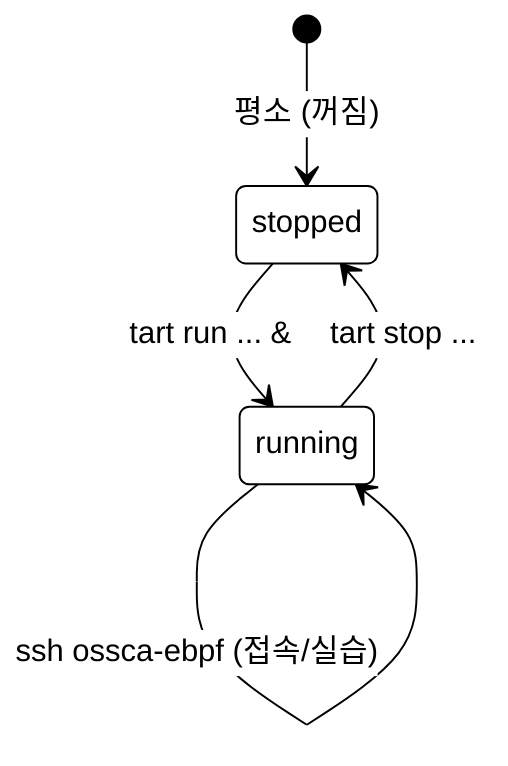
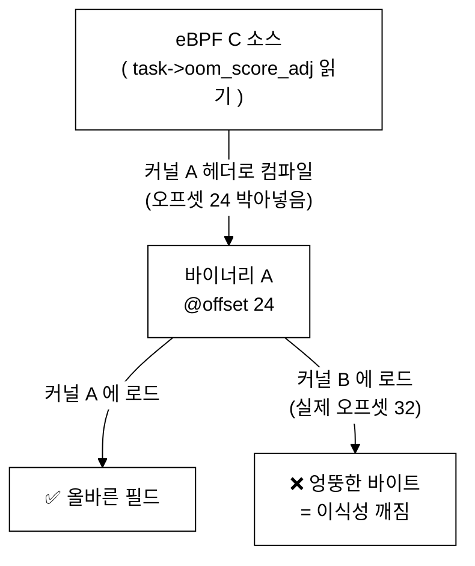
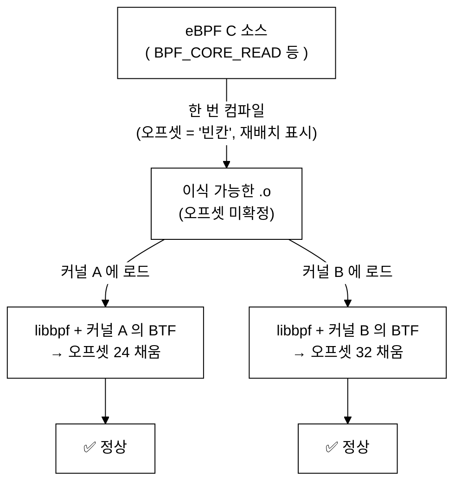
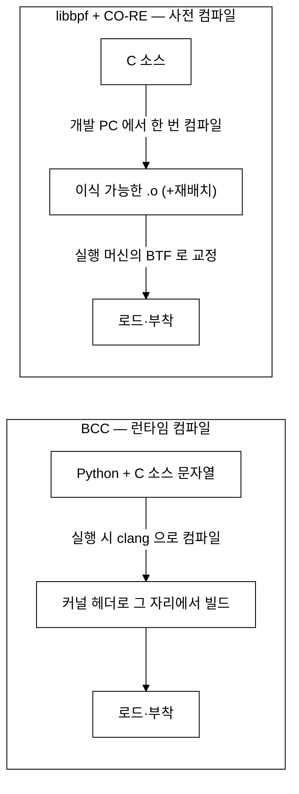
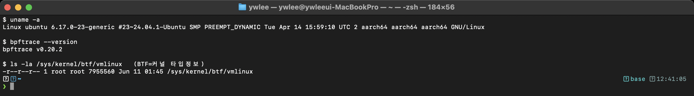
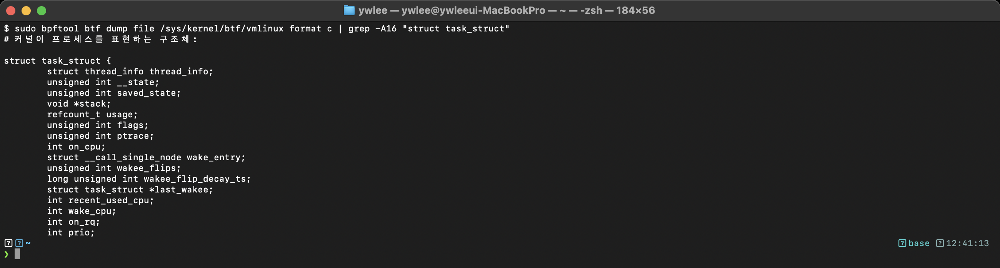

# 6주차 — 개발 환경: VM·BTF·CO-RE 개념

> macOS 에서는 eBPF 를 돌릴 수 없습니다. 왜 리눅스 VM 이 필요한지, 그리고 "한 번 컴파일해서 어디서나 돈다(CO-RE)"는 마법이 어떻게 가능한지 그 밑바탕(BTF)을 이해합니다.

last_updated: 2026-06-11

---

## 이번 주 학습 목표

- eBPF 를 실행하려면 커널이 갖춰야 할 요건(버전·CONFIG·BTF)을 설명할 수 있다.
- **왜 macOS 에서 직접 못 하고 리눅스 VM 이 필요한지** 근본 이유를 말할 수 있다.
- `tart` 로 리눅스 VM 을 띄우고 SSH 로 접속하는 본 랩의 흐름을 따라 할 수 있다.
- **커널 헤더 방식의 이식성 문제**(커널마다 구조체 레이아웃이 다르다)를 그림으로 설명할 수 있다.
- **BTF(BPF Type Format)** 가 무엇이며 `/sys/kernel/btf/vmlinux` 가 어떤 역할을 하는지 안다.
- **CO-RE(Compile Once, Run Everywhere)** 의 아이디어(재배치로 이식성 확보)를 설명할 수 있다.
- **BCC(런타임 컴파일)** 와 **libbpf+CO-RE(사전 컴파일)** 의 차이를 비교할 수 있다.

> 이번 주는 7·8주차(bpftrace·BCC 입문)와 9·10주차(실습①·②)로 가기 전에 **"우리가 어디서, 무엇 위에서 실습하는가"** 를 단단히 다지는 주차입니다. 앞선 [4주차](04주차_eBPF_아키텍처_검증기_JIT_맵_헬퍼.md)에서 배운 검증기·맵·헬퍼, [5주차](05주차_프로그램_타입과_부착지점.md)에서 배운 프로그램 타입·부착지점이 *실제로 어느 커널 위에서 동작하는지* 손으로 확인해 봅니다.

---

## 1. 왜 리눅스 VM 인가 — macOS 에는 eBPF 가 없다

eBPF 는 **리눅스 커널 안에서 도는 작은 프로그램**입니다. 즉 eBPF 라는 기능 자체가 리눅스 커널의 일부입니다. macOS 커널(XNU)에는 이 기능이 없습니다. 그래서 Mac 에서 `bpftrace` 같은 명령을 그냥 칠 수는 없고, **리눅스를 하나 띄워서 그 안에서** 실습해야 합니다.

본 랩은 Apple Silicon Mac 에서 가볍게 리눅스를 띄우는 [`tart`](https://tart.run) 를 써서 Ubuntu 24.04 VM 을 운영합니다. 전체 그림은 다음과 같습니다.

```mermaid
%%{init: {"theme":"base","themeVariables":{"background":"#ffffff","primaryColor":"#ffffff","primaryBorderColor":"#000000","primaryTextColor":"#000000","secondaryColor":"#ffffff","secondaryBorderColor":"#000000","secondaryTextColor":"#000000","tertiaryColor":"#ffffff","tertiaryBorderColor":"#000000","tertiaryTextColor":"#000000","lineColor":"#000000","textColor":"#000000","mainBkg":"#ffffff","secondBkg":"#ffffff","clusterBkg":"#ffffff","clusterBorder":"#000000","edgeLabelBackground":"#ffffff","nodeBorder":"#000000","defaultLinkColor":"#000000","titleColor":"#000000","actorBkg":"#ffffff","actorBorder":"#000000","actorTextColor":"#000000","actorLineColor":"#000000","signalColor":"#000000","signalTextColor":"#000000","labelBoxBkgColor":"#ffffff","labelBoxBorderColor":"#000000","labelTextColor":"#000000","loopTextColor":"#000000","noteBkgColor":"#ffffff","noteBorderColor":"#000000","noteTextColor":"#000000","activationBkgColor":"#ffffff","activationBorderColor":"#000000","sequenceNumberColor":"#000000","cScale0":"#ffffff","cScale1":"#ffffff","cScale2":"#ffffff","cScale3":"#ffffff","cScale4":"#ffffff","cScale5":"#ffffff","cScale6":"#ffffff","cScale7":"#ffffff","cScale8":"#ffffff","cScale9":"#ffffff","cScale10":"#ffffff","cScale11":"#ffffff","cScaleLabel0":"#000000","cScaleLabel1":"#000000","cScaleLabel2":"#000000","cScaleLabel3":"#000000","cScaleLabel4":"#000000","cScaleLabel5":"#000000","cScaleLabel6":"#000000","cScaleLabel7":"#000000","cScaleLabel8":"#000000","cScaleLabel9":"#000000","cScaleLabel10":"#000000","cScaleLabel11":"#000000","pie1":"#ffffff","pie2":"#eeeeee","pie3":"#dddddd","pie4":"#cccccc","fontFamily":"Georgia, serif"}}}%%
flowchart LR
    subgraph MAC["💻 내 Mac (macOS) — eBPF 없음"]
        VSC["VSCode / 터미널\n(코드 편집·명령 입력)"]
    end
    subgraph VM["🐧 tart VM (Ubuntu 24.04, 커널 6.17)"]
        TOOL["bpftrace / BCC / libbpf\n(eBPF 작성·로드 도구)"]
        KERN["리눅스 커널\n(eBPF 가 실제로 도는 곳)"]
        TOOL -->|"eBPF 프로그램 심기"| KERN
    end
    VSC -->|"ssh ossca-ebpf (키 인증)"| TOOL
```



| 층 | 역할 | 비유 |
|:---|:---|:---|
| Mac | 타이핑하고 명령 내리는 곳 | 운전석 |
| VM | eBPF 가 실제로 실행되는 리눅스 | 엔진 |
| 커널 | eBPF 가 붙어서 들여다보는 대상 | 엔진 내부 센서 |

> 정리: **eBPF = 리눅스 커널 기술 → macOS 불가 → 리눅스 VM 필수.** 이게 이번 랩이 VM 으로 진행되는 이유 전부입니다.

---

## 2. eBPF 를 돌리려면 커널이 갖춰야 할 것

아무 리눅스나 다 되는 것은 아닙니다. 실습에 필요한 조건을 정리하면 다음과 같습니다.

| 요건 | 설명 | 우리 VM 의 값 |
|:---|:---|:---|
| 커널 버전 | 트레이스포인트/kprobe/CO-RE 등 최신 기능은 새 커널일수록 안정적 | **6.17** (매우 최신) |
| `CONFIG_BPF` / `CONFIG_BPF_SYSCALL` | eBPF 서브시스템과 `bpf()` 시스템콜 활성화 | 활성 |
| `CONFIG_DEBUG_INFO_BTF` | **커널 BTF** 를 빌드에 포함 → `/sys/kernel/btf/vmlinux` 생성 | 활성 |
| 트레이스포인트/kprobe | `tracefs`·`kprobe` 지원 (관측용 부착지점) | 활성 |
| 권한 | eBPF 로드는 관리자 권한 필요 → 명령 앞에 **`sudo`** | `ebpf` 사용자는 무암호 sudo |

VM 에 접속해 직접 확인하는 명령은 다음과 같습니다(이번 주 실습 과제에서 다시 다룹니다).

```bash
# VM 안에서 실행
uname -r                              # → 6.17.0-...  (커널 버전)
ls -l /sys/kernel/btf/vmlinux         # → 파일이 있으면 커널 BTF 지원 ✅
bpftrace --version                    # → bpftrace v0.20.x
zcat /proc/config.gz 2>/dev/null | grep -E 'CONFIG_BPF|CONFIG_DEBUG_INFO_BTF'
#   (config.gz 가 없으면 /boot/config-$(uname -r) 를 grep)
```

> 💡 `/sys/kernel/btf/vmlinux` 파일 하나의 존재 여부가 "이 커널이 CO-RE 를 지원하느냐"의 핵심 신호입니다. 왜 그런지는 4·5절에서 설명합니다.

---

## 3. tart 로 VM 띄우기 (본 랩 런북 연계)

자세한 사용법은 저장소 루트의 [README](../../README.md) 에 단계별로 정리돼 있습니다. 여기서는 핵심 흐름만 짚습니다. 아래 `tart`/`ssh` 명령은 모두 **Mac 터미널**에서 칩니다.



```bash
# (Mac 터미널) ── VM 켜고 부팅 끝날 때까지 대기 → 접속 확인
tart run ossca-ebpf-work --no-graphics &
until ssh ossca-ebpf 'true' 2>/dev/null; do echo "VM 부팅 대기..."; sleep 2; done
ssh ossca-ebpf 'whoami && uname -r'      # → ebpf / 6.17.0-...  이면 성공
```

접속한 뒤 VM 안에서 도구가 제대로 깔려 있는지 확인합니다.

```bash
# (VM 안에서)
bpftrace --version        # bpftrace
python3 -c "import bcc; print('BCC OK')"   # BCC(python3-bpfcc)
clang --version           # clang 18
```

본 VM 에 검증된 환경:

| 항목 | 값 |
|:---|:---|
| 게스트 OS | Ubuntu 24.04 LTS (aarch64) |
| 커널 | 6.17 |
| bpftrace | 0.20 |
| BCC (python3-bpfcc) | 0.29 |
| libbpf | 1.3 |
| clang | 18 |
| 커널 BTF | `/sys/kernel/btf/vmlinux` 지원 |

> ⚠️ macOS 에서는 위 도구가 동작하지 않습니다. 반드시 `ssh ossca-ebpf` 로 **VM 안에 들어간 뒤** 실행하세요.

---

## 4. 커널 헤더 방식의 문제 — 왜 이식성이 깨지나

eBPF 프로그램은 흔히 커널 내부 구조체(예: `struct task_struct`, `struct sock`)의 **특정 필드**를 읽습니다. 그런데 이 구조체들의 **메모리 레이아웃(어떤 필드가 몇 바이트째에 있는가)** 은 커널 버전·빌드 설정에 따라 달라집니다.

예를 들어 어떤 필드 `oom_score_adj` 의 위치(오프셋)가 커널 A 에서는 구조체 시작부터 24바이트째, 커널 B 에서는 32바이트째라고 합시다. 전통적인 방식은 컴파일할 때 **그 커널의 헤더에서 오프셋을 박아 넣습니다(하드코딩)**. 그러면 커널 A 용으로 컴파일한 eBPF 를 커널 B 에서 로드하면 엉뚱한 바이트를 읽게 됩니다.

> 🔬 **왜 오프셋이 커널마다 달라지나 — 구체적으로**: `struct task_struct` 같은 큰 구조체는 수백 개의 필드로 이뤄집니다. 그 레이아웃은 다음 이유로 빌드마다 달라집니다.
>
> - **앞쪽 필드가 추가/삭제됨**: 새 커널이 `oom_score_adj` *앞에* 새 필드를 하나 끼워 넣으면, 그 뒤의 모든 필드 오프셋이 밀려납니다.
> - **`CONFIG_*` 빌드 옵션**: 어떤 필드는 특정 설정(`#ifdef CONFIG_...`)일 때만 구조체에 들어갑니다. 같은 커널 버전이라도 배포판이 켠 옵션이 다르면 레이아웃이 달라집니다.
> - **타입 크기·정렬**: 컴파일러 정렬 규칙이나 필드 타입 변경으로 중간에 패딩이 달라질 수 있습니다.
>
> 즉 "커널 버전"만 같다고 레이아웃이 같다는 보장이 없습니다. **그 빌드의 실제 레이아웃**을 알아야만 올바른 오프셋을 쓸 수 있고, 그 정보를 담은 것이 바로 다음 절의 BTF 입니다.



이 문제 때문에 과거에는 **"실행할 그 머신에서, 그 커널의 헤더로, 매번 다시 컴파일"** 하는 방식을 썼습니다. BCC 가 바로 이 방식입니다(런타임 컴파일). 정확하지만, 실행 머신마다 컴파일러(clang/LLVM)와 커널 헤더가 깔려 있어야 하고 로드할 때마다 컴파일 비용이 듭니다.

> 한 줄 요약: **구조체 레이아웃은 커널마다 다르다 → 한 번 컴파일한 바이너리가 다른 커널에서 깨진다.** 이것이 eBPF 이식성의 근본 난제입니다.

---

## 5. BTF — 커널이 "내 타입 정보"를 스스로 알려준다

**BTF(BPF Type Format)** 는 커널이 자기 안의 **타입 정보(구조체·필드·오프셋·크기 등)** 를 압축해 담아 둔 메타데이터 형식입니다. `CONFIG_DEBUG_INFO_BTF=y` 로 빌드된 커널은 부팅 시 이 정보를 다음 파일로 노출합니다.

```bash
# (VM 안에서) 커널 BTF 가 존재하는가
ls -l /sys/kernel/btf/vmlinux

# 사람이 읽을 수 있게 덤프 (bpftool 이 있으면)
sudo bpftool btf dump file /sys/kernel/btf/vmlinux format c 2>/dev/null | head -n 40
```

`/sys/kernel/btf/vmlinux` 안에는 **"이 커널에서 `struct sock` 은 어떻게 생겼고, 어떤 필드가 몇 바이트째에 있는지"** 가 들어 있습니다. 즉, **지금 돌고 있는 바로 그 커널의 구조체 지도**입니다. 헤더 파일을 찾아 헤맬 필요 없이, 커널이 직접 알려주는 셈입니다.


이 BTF 가 있기에 다음 절의 CO-RE 가 가능해집니다. **"실행 시점에 이 커널의 실제 오프셋을 물어볼 수 있는 안내데스크"** 가 생긴 것입니다.

---

## 6. CO-RE — 한 번 컴파일해서 어디서나 (Compile Once, Run Everywhere)

CO-RE 의 아이디어는 이렇습니다.

1. eBPF 소스를 컴파일할 때 오프셋을 **하드코딩하지 않고**, "여기서 `task->oom_score_adj` 의 오프셋이 필요하다"는 **재배치(relocation) 표시**만 바이너리에 남긴다.
2. 그 바이너리를 어떤 커널에 로드할 때, 로더(libbpf)가 **그 커널의 BTF(`/sys/kernel/btf/vmlinux`)** 를 읽어 실제 오프셋을 알아내고, 코드의 빈칸을 **그 자리에서 채워 넣는다(재배치).**
3. 결과적으로 **하나의 바이너리가 여러 커널에서 올바르게** 동작한다.



4절의 그림과 비교해 보세요. 4절에서는 오프셋을 컴파일 시점에 박아 넣어 다른 커널에서 깨졌습니다. CO-RE 는 오프셋 결정을 **로드 시점으로 미루고**, BTF 라는 안내데스크에 물어봐서 교정합니다. 그래서 "Compile **Once**, Run **Everywhere**" 입니다.

> 비유: 이사 갈 때 "TV 는 거실 벽에서 24cm" 라고 못 박아 적어두면(헤더 방식) 새 집에서 틀어집니다. 대신 "TV 는 *거실 콘센트 옆*" 처럼 **상대 위치만 적어두고**, 새 집에 도착해서 *그 집의 콘센트 위치(BTF)* 를 보고 맞추면(CO-RE) 어느 집이든 들어맞습니다.

### 6.1 CO-RE 재배치의 종류 — 오프셋만이 아니다

CO-RE 가 로드 시점에 교정하는 것은 "필드 오프셋" 하나가 아닙니다. 커널 차이를 흡수하기 위한 **여러 종류의 재배치(relocation)** 가 있습니다.

| 재배치 종류 | 무엇을 해결하나 | 예 |
|:---|:---|:---|
| **필드 오프셋(field offset)** | 같은 필드가 커널마다 몇 바이트째인지 다름 | `task->oom_score_adj` 위치가 24 ↔ 32 |
| **필드 존재 여부(field existence)** | 어떤 커널엔 그 필드가 아예 없음 | "이 필드가 있으면 읽고, 없으면 건너뛰기" 분기 |
| **필드 크기(field size)** | 같은 필드의 타입·폭이 커널마다 다름 | `u32` ↔ `u64` 로 바뀐 필드 |
| **타입 존재/ID** | 구조체·enum 자체가 있는지, enum 값이 바뀜 | 새 커널에만 있는 구조체 참조 |

핵심은 **필드 존재 여부** 재배치입니다. 이게 있어서, 신·구 커널을 모두 지원하는 프로그램을 "이 필드가 있는 커널에서는 이렇게, 없는 커널에서는 저렇게" 식으로 **하나의 바이너리 안에서 분기**할 수 있습니다. 단순 오프셋 교정을 넘어, *구조 자체의 차이*까지 흡수하는 것이 CO-RE 의 힘입니다.

### 6.2 `vmlinux.h` — 커널 전체 타입을 하나의 헤더로

libbpf+CO-RE 로 코드를 짤 때는 커널 헤더 수십 개를 `#include` 하는 대신, **커널 BTF 에서 뽑아낸 단 하나의 헤더 `vmlinux.h`** 를 포함합니다. 생성 방법은 간단합니다.

```bash
# (VM 안에서) 현재 커널의 BTF → 모든 커널 타입을 담은 헤더 한 장으로
sudo bpftool btf dump file /sys/kernel/btf/vmlinux format c > vmlinux.h
```

이 한 줄이 의미하는 바가 큽니다. **커널 소스 헤더를 따로 설치할 필요가 없습니다** — 지금 돌고 있는 커널이 BTF 로 자기 타입을 다 알려주니, 그걸 그대로 헤더로 받아 적는 것이죠. 그리고 `vmlinux.h` 에 적힌 오프셋은 컴파일 결과에 *박히지 않습니다*. 컴파일러(clang)가 CO-RE 재배치 표시만 남기고, 실제 오프셋은 6절에서 본 대로 로드 시점에 채워지기 때문입니다. 그래서 "개발 PC 의 `vmlinux.h` 로 빌드한 바이너리"가 "오프셋이 다른 운영 서버 커널"에서도 동작합니다.

---

## 7. BCC vs libbpf+CO-RE — 두 가지 길 맛보기

본 랩의 실습①·②(9·10주차)는 **BCC** 로 작성돼 있고, 11주차에서 **libbpf+CO-RE** 를 다룹니다. 두 방식을 비교해 둡니다.



| 비교 항목 | BCC (런타임 컴파일) | libbpf + CO-RE (사전 컴파일) |
|:---|:---|:---|
| 컴파일 시점 | 실행할 때마다 그 머신에서 | 개발 PC 에서 한 번 |
| 실행 머신 요구사항 | clang/LLVM + 커널 헤더 필요 | BTF 만 있으면 됨(헤더·컴파일러 불필요) |
| 시작 속도 | 매 실행마다 컴파일 → 느림 | 즉시 로드 → 빠름 |
| 이식성 | 그 머신에서 다시 빌드해 확보 | 하나의 바이너리가 여러 커널에서 동작 |
| 배포 크기 | LLVM 통째로(큼) | 작은 단일 바이너리 |
| 배우기 | 쉬움(파이썬, 빠른 프로토타이핑) | 약간 더 어려움(C, 빌드 단계) |
| 본 랩에서 | 실습①·② ([9](09주차_실습1_시스템콜_추적기.md)·[10주차](10주차_실습2_네트워크_연결_추적기.md)) | [11주차](11주차_libbpf와_CO-RE_프로덕션eBPF.md) |

선택 기준을 한 줄로: **빠르게 배우고 탐색할 땐 BCC, 운영 환경에 작고 빠르게 배포할 땐 libbpf+CO-RE.** 둘 다 같은 BTF 인프라 위에서 돌지만, *언제 컴파일하느냐* 가 핵심 차이입니다.

> 🔬 **왜 BCC 는 "무겁다"고 하나**: BCC 는 실행 시점에 C 소스를 컴파일해야 하므로, 배포물 안에 **LLVM/clang 한 벌을 통째로** 끌고 다닙니다(수백 MB 규모). 게다가 컴파일 순간에 그 머신의 **커널 헤더가 있어야** 구조체를 풀 수 있습니다 — 헤더가 없거나 버전이 어긋나면 그 자리에서 컴파일이 실패합니다. 매 실행마다 컴파일하니 시작도 느립니다. 반대로 **libbpf+CO-RE** 는 개발 PC 에서 **딱 한 번 미리 컴파일**해 작은 단일 바이너리를 만들고, 실행 머신엔 **BTF 만 있으면** 됩니다(헤더·컴파일러 불필요). 그래서 운영 서버 수천 대처럼 "커널 버전이 제각각이고 빌드 도구를 깔기 싫은" 환경에 적합합니다.
>
> 정리하면, BTF 라는 같은 토대 위에서 ① BCC 는 *그 머신의 헤더로 매번 새로 컴파일해* 정확성을 얻고, ② libbpf+CO-RE 는 *재배치 표시를 남긴 뒤 로드 시점에 BTF 로 교정해* 이식성을 얻습니다. "정확성을 그 자리에서 다시 빌드해 확보 vs 이식성을 재배치로 확보"가 두 길의 본질입니다.

---

## ⚙️ 리눅스 커널은 자기 타입 정보를 BTF 로 품고 있다

eBPF 의 이식성은 커널 한복판에 들어 있는 작은 메타데이터 덩어리 하나에서 출발합니다. 커널을 빌드할 때(`CONFIG_DEBUG_INFO_BTF=y`) **BTF(BPF Type Format)** 가 함께 생성되어 부팅 후 `/sys/kernel/btf/vmlinux` 로 노출됩니다. BTF 는 그 커널이 가진 **모든 구조체의 레이아웃 정보**(어떤 필드가 몇 바이트째에 있는가)를 담습니다. 예를 들어 프로세스를 표현하는 `struct task_struct` 의 각 필드 위치가 여기에 적혀 있습니다. CO-RE 는 컴파일 시 오프셋을 박지 않고 재배치 표시만 남긴 뒤, 로드 시점에 이 BTF 를 읽어 **그 커널의 실제 오프셋으로 맞춰** 이식성을 얻습니다.

```mermaid
%%{init: {"theme":"base","themeVariables":{"background":"#ffffff","primaryColor":"#ffffff","primaryBorderColor":"#000000","primaryTextColor":"#000000","secondaryColor":"#ffffff","secondaryBorderColor":"#000000","secondaryTextColor":"#000000","tertiaryColor":"#ffffff","tertiaryBorderColor":"#000000","tertiaryTextColor":"#000000","lineColor":"#000000","textColor":"#000000","mainBkg":"#ffffff","secondBkg":"#ffffff","clusterBkg":"#ffffff","clusterBorder":"#000000","edgeLabelBackground":"#ffffff","nodeBorder":"#000000","defaultLinkColor":"#000000","titleColor":"#000000","actorBkg":"#ffffff","actorBorder":"#000000","actorTextColor":"#000000","actorLineColor":"#000000","signalColor":"#000000","signalTextColor":"#000000","labelBoxBkgColor":"#ffffff","labelBoxBorderColor":"#000000","labelTextColor":"#000000","loopTextColor":"#000000","noteBkgColor":"#ffffff","noteBorderColor":"#000000","noteTextColor":"#000000","activationBkgColor":"#ffffff","activationBorderColor":"#000000","sequenceNumberColor":"#000000","cScale0":"#ffffff","cScale1":"#ffffff","cScale2":"#ffffff","cScale3":"#ffffff","cScale4":"#ffffff","cScale5":"#ffffff","cScale6":"#ffffff","cScale7":"#ffffff","cScale8":"#ffffff","cScale9":"#ffffff","cScale10":"#ffffff","cScale11":"#ffffff","cScaleLabel0":"#000000","cScaleLabel1":"#000000","cScaleLabel2":"#000000","cScaleLabel3":"#000000","cScaleLabel4":"#000000","cScaleLabel5":"#000000","cScaleLabel6":"#000000","cScaleLabel7":"#000000","cScaleLabel8":"#000000","cScaleLabel9":"#000000","cScaleLabel10":"#000000","cScaleLabel11":"#000000","pie1":"#ffffff","pie2":"#eeeeee","pie3":"#dddddd","pie4":"#cccccc","fontFamily":"Georgia, serif"}}}%%
flowchart LR
    BUILD["커널 빌드\n(CONFIG_DEBUG_INFO_BTF=y)"] -->|"타입 정보 생성"| BTF["/sys/kernel/btf/vmlinux\n(구조체 레이아웃·오프셋)"]
    BTF -->|"로드 시 참고"| CORE["CO-RE 재배치\n(오프셋 교정)"]
    CORE --> PROG["여러 커널에서 도는 eBPF"]
```



소스/구조 측면에서, 이 파일은 커널 이미지(`vmlinux`)에 포함되어 빌드되며, 우리 VM(커널 6.17 aarch64)은 BTF 가 기본 활성화되어 `/sys/kernel/btf/vmlinux` 가 존재합니다.

---

## 📸 실제 실행 화면 (실제 터미널 캡처)

아래는 VM(커널 6.17 aarch64)에 접속해 환경과 커널 구조체를 직접 확인한 모습입니다.



위는 `uname` / `bpftrace --version` / `/sys/kernel/btf/vmlinux` 존재를 한 화면에서 확인한 실제 터미널 캡처입니다. 커널 6.17 과 BTF 파일이 함께 보이면 CO-RE 실습 준비가 끝난 것입니다.



위는 `bpftool btf dump` 로 커널 BTF 에서 `struct task_struct` 필드를 뽑아 본 실제 터미널 캡처입니다. 커널이 프로세스를 표현하는 실제 구조체와 그 필드들이 BTF 안에 그대로 들어 있음을 눈으로 확인할 수 있습니다.

---

## 💡 핵심 요약

- eBPF 는 리눅스 커널 기술이라 macOS 에서 직접 못 돌린다 → **tart 로 리눅스 VM** 을 띄워 실습한다.
- 실행 요건: 충분히 새 커널 + `CONFIG_BPF*` + **`CONFIG_DEBUG_INFO_BTF`(BTF)** + 관리자 권한(`sudo`).
- **이식성 문제**: 구조체 레이아웃이 커널마다 달라, 헤더로 오프셋을 박아 컴파일하면 다른 커널에서 깨진다.
- **BTF**: 커널이 자기 타입·오프셋 정보를 `/sys/kernel/btf/vmlinux` 로 노출한다. CO-RE 의 안내데스크.
- **CO-RE**: 오프셋 결정을 로드 시점으로 미루고 BTF 로 재배치 → "한 번 컴파일, 어디서나 실행".
- **BCC**(런타임 컴파일)는 배우기 쉽고, **libbpf+CO-RE**(사전 컴파일)는 작고 빠르게 배포된다.

---

## ✍️ 연습문제

1. eBPF 프로그램을 macOS 에서 직접 실행할 수 없는 근본 이유를 한 문장으로 설명하라.
2. 같은 eBPF 바이너리가 커널 A 에서는 정상이고 커널 B 에서는 엉뚱한 값을 읽었다. CO-RE 없이 헤더 방식으로 컴파일했다고 할 때 그 이유를 "오프셋" 이라는 단어를 써서 설명하라.
3. `/sys/kernel/btf/vmlinux` 가 존재하지 않는 커널에서 CO-RE 기반 도구가 동작하기 어려운 이유는 무엇인가?
4. BCC 와 libbpf+CO-RE 의 가장 큰 차이를 "컴파일 시점" 관점에서 한 문장으로 비교하라.
5. (서술) 운영 서버 1,000대에 추적 도구를 배포해야 한다. 서버마다 커널 버전이 조금씩 다르다. BCC 와 libbpf+CO-RE 중 무엇을 택하겠는가? 두 가지 근거를 들어라.

---

## 🛠 실습 과제 (VM 에서 직접 — `ssh ossca-ebpf` 기반)

> 모든 명령은 VM 안에서 실행합니다. 먼저 Mac 터미널에서 `tart run ossca-ebpf-work --no-graphics &` 로 VM 을 켜고 `ssh ossca-ebpf` 로 접속하세요.

**과제 1. 커널 요건 점검표 만들기.** 아래 명령을 차례로 실행하고 각 결과의 의미를 한 줄씩 적어라.

```bash
# (VM 안에서)
uname -r
ls -l /sys/kernel/btf/vmlinux
bpftrace --version
clang --version | head -n 1
python3 -c "import bcc; print('BCC import OK')"
```

기대: 커널 6.17, `/sys/kernel/btf/vmlinux` 존재, bpftrace 0.20.x, clang 18, BCC import 성공.

**과제 2. 커널 BTF 에서 `struct task_struct` 필드 탐색하기.** 커널 타입 정보가 실제로 들어 있음을 눈으로 확인하라.

- **목표**: BTF 가 "구조체·필드·오프셋"을 담는다(5절)를 가장 큰 구조체 `task_struct` 로 직접 본다.
- **명령**:
  ```bash
  # (VM 안에서) bpftool 이 없으면 먼저: sudo apt-get install -y bpftool
  uname -r                               # 지금 커널 버전 (이 BTF 가 어느 커널 것인지)
  sudo bpftool btf dump file /sys/kernel/btf/vmlinux format c | grep -A20 'struct task_struct'
  ```
- **관찰**: 맨 처음엔 `struct task_struct;` (전방 선언)만 보일 수 있습니다. 필드가 가득한 **본 정의**는 덤프 뒤쪽에 나오므로, 정의 본문을 보려면 페이저로 넘겨 보세요: `sudo bpftool btf dump file /sys/kernel/btf/vmlinux format c | sed -n '/^struct task_struct {/,/^};/p' | head -60`. 거기서 `pid`, `comm`, `oom_score_adj` 같은 필드가 줄줄이 나옵니다. 이 필드 순서·구성이 곧 "이 커널 빌드의 실제 레이아웃"이며, 4절에서 본 대로 **다른 커널이면 이 순서가 달라질 수 있습니다**. 같은 방식으로 `struct sock` 도 찾아보세요.

`struct task_struct` 정의가 보이면, 이 커널이 자기 구조체 레이아웃을 BTF 로 노출하고 있다는 증거다.

**과제 2-b. BTF 파일 자체 확인하기.** CO-RE 지원의 핵심 신호인 파일이 실제로 있는지 본다.

```bash
# (VM 안에서)
uname -r
ls -la /sys/kernel/btf/vmlinux
```

기대: 커널 6.17, `/sys/kernel/btf/vmlinux` 파일이 존재(크기가 수 MB). 이 파일이 있다는 것 자체가 "이 커널은 CO-RE 를 지원한다"의 신호다(2절·5절).

**과제 3. 본 랩 from-zero 런북 한 번 돌리기.** 저장소 루트 [README](../../README.md) 의 "강의 7. 처음부터 한 번에 따라하기" 블록을 Mac 터미널에서 그대로 실행해, 실습①·②의 자기검증이 "검증 통과" 로 끝나는지 확인하라.

```bash
# (Mac 터미널) — README 강의 7 발췌
tart run ossca-ebpf-work --no-graphics &
until ssh ossca-ebpf 'true' 2>/dev/null; do echo "VM 부팅 대기..."; sleep 2; done
ssh ossca-ebpf 'cd ~/ebpf-labs/projects/syscall-tracer && sudo python3 verify.py'
ssh ossca-ebpf 'cd ~/ebpf-labs/projects/netflow-tracer && sudo python3 verify_net.py'
```

**과제 4. (생각해 보기) — clang 이 없다면?** 과제 3 의 실습은 BCC 기반이다(런타임 컴파일). 만약 VM 에서 clang 을 지워버리면 어떤 일이 생길지 예상해 보고, libbpf+CO-RE 였다면 그 영향이 어떻게 달라질지 한 문단으로 적어라. *(주의: 실제로 clang 을 지우지는 말 것 — 실습 환경이 망가집니다.)*

**과제 5. (생각해 보기) — BTF 가 없다면 무엇이 불가능한가?** 과제 2-b 에서 본 `/sys/kernel/btf/vmlinux` 가 *없는* 커널(`CONFIG_DEBUG_INFO_BTF` 가 꺼진 커널)을 가정하라.

- **질문 1**: libbpf+CO-RE 도구가 그 커널에서 동작하기 어려운 이유는? (로더가 오프셋을 "어디에 물어보는지"를 5·6절과 연결)
- **질문 2**: 과제 2 처럼 `bpftool btf dump` 로 구조체를 들여다보는 일, 6.2절의 `vmlinux.h` 생성은 그 커널에서 가능할까?
- **질문 3**: 그렇다면 BTF 없는 커널에서도 BCC(런타임 컴파일·커널 헤더 사용)는 왜 상대적으로 덜 막히는가? 한 문단으로 정리하라.

---

## ✅ 자가점검 퀴즈

1. macOS 에서 `sudo bpftrace -e '...'` 를 실행하면 왜 안 되는가?

<details><summary>정답</summary>
eBPF 는 리눅스 커널의 기능이고 macOS 커널에는 없기 때문이다. 그래서 리눅스 VM 안에서 실행해야 한다.
</details>

2. `/sys/kernel/btf/vmlinux` 파일은 무엇을 담고 있는가?

<details><summary>정답</summary>
현재 실행 중인 그 커널의 타입 정보(구조체·필드·오프셋·크기 등)를 담은 BTF 메타데이터다. CO-RE 가 로드 시점에 오프셋을 교정할 때 참고하는 "안내데스크" 역할을 한다.
</details>

3. CO-RE 에서 "Compile Once" 가 가능한 이유를 한 문장으로 말하라.

<details><summary>정답</summary>
오프셋을 컴파일 시점에 박지 않고 재배치 표시만 남긴 뒤, 로드 시점에 그 커널의 BTF 를 읽어 실제 오프셋으로 채우기 때문이다.
</details>

4. BCC 가 실행 머신에 clang/LLVM 과 커널 헤더를 요구하는 이유는?

<details><summary>정답</summary>
BCC 는 C 소스를 실행 시점(런타임)에 그 머신에서 컴파일하기 때문이다. 그래서 컴파일러와 헤더가 그 자리에 있어야 한다.
</details>

5. `CONFIG_DEBUG_INFO_BTF=y` 가 꺼진 커널에서 CO-RE 도구가 어려운 이유는?

<details><summary>정답</summary>
이 옵션이 꺼지면 커널 BTF(`/sys/kernel/btf/vmlinux`)가 생성되지 않아, 로더가 그 커널의 실제 오프셋을 물어볼 곳이 없어 재배치를 못 한다.
</details>

---

## 📚 더 읽을거리

- 본 랩 README — [저장소 루트 README](../../README.md) (tart·SSH·실습 런북)
- BTF 공식 문서: 리눅스 커널 `Documentation/bpf/btf.rst`
- Andrii Nakryiko, "BPF CO-RE" 블로그 시리즈 (libbpf 메인테이너) — CO-RE/재배치 동작 원리
- libbpf 저장소: https://github.com/libbpf/libbpf
- BCC 저장소·튜토리얼: https://github.com/iovisor/bcc

---

## ⏭ 다음 주 예고

[7주차](07주차_bpftrace_입문.md)에서는 드디어 **bpftrace** 로 한 줄짜리 추적기를 직접 돌려봅니다. `tracepoint:raw_syscalls:sys_enter` 한 줄로 "어떤 프로세스가 시스템콜을 몇 번 부르나" 를 세어보는 등, awk 같은 고수준 언어로 커널을 들여다보는 첫 경험을 합니다. 이번 주에 준비한 VM 과 BTF 가 그 무대입니다.
