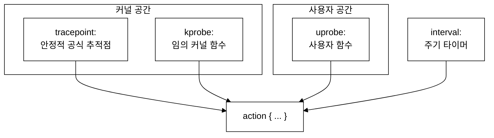
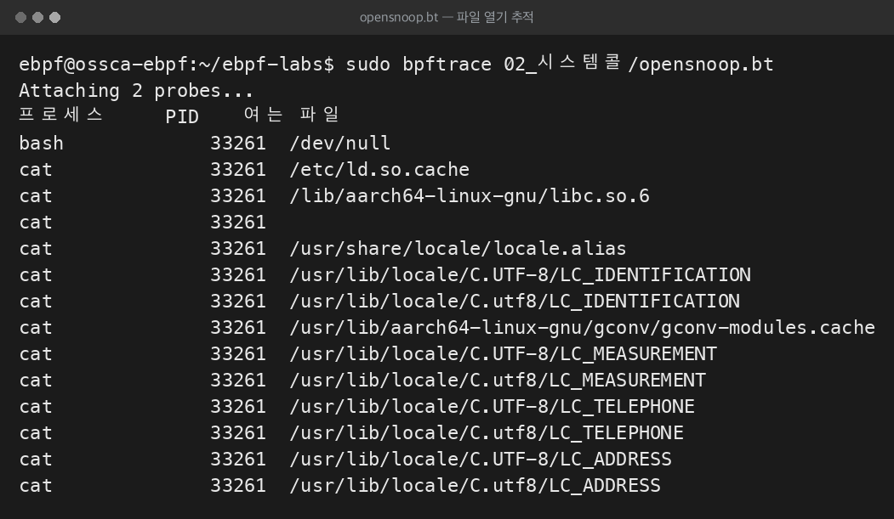
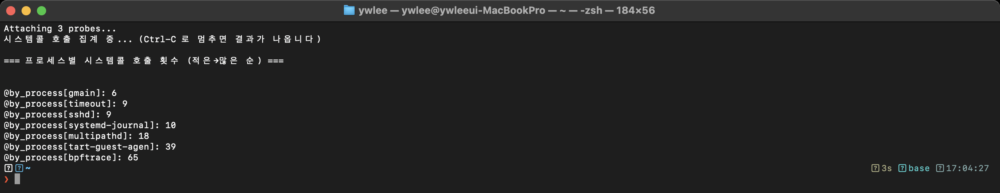

# 7주차 — bpftrace 입문: 한 줄 추적

> bpftrace 는 "커널을 위한 awk" 입니다. 컴파일·로더 코드 없이 한 줄로 시스템콜·함수·지연을 추적합니다. 이번 주는 손가락이 기억할 만큼 원라이너를 많이 쳐봅니다.

last_updated: 2026-06-11

---

## 이번 주 학습 목표

- bpftrace 가 무엇이고 BCC·libbpf 와 어떤 위치인지 설명할 수 있다.
- bpftrace 프로그램의 3요소 **probe / filter(`/.../`) / action(`{...}`)** 를 해부할 수 있다.
- 프로브 종류(`tracepoint:`, `kprobe:`, `uprobe:`, `interval:`, `software:` 등)를 구분한다.
- 빌트인 변수(`comm`, `pid`, `tid`, `args`, `nsecs`, `retval`)를 쓸 수 있다.
- 맵 `@` 와 집계 함수(`count`, `sum`, `avg`, `hist`, `lhist`)로 데이터를 모은다.
- 대표 원라이너 5개 이상을 직접 실행하고 출력을 해석할 수 있다.

> [6주차](06주차_개발환경_VM_BTF_CO-RE개념.md)에서 준비한 VM 위에서 진행합니다. bpftrace 는 내부적으로 BTF·검증기·JIT([4주차](04주차_eBPF_아키텍처_검증기_JIT_맵_헬퍼.md))를 모두 쓰지만, 우리는 그 위에서 **한 줄 언어**만 다룹니다.

---

## 1. bpftrace 란 무엇인가 — 커널을 위한 awk

bpftrace 는 **고수준 추적 언어**입니다. C 로 eBPF 를 짜고 파이썬으로 로더를 쓰는 대신, **awk 처럼 짧은 스크립트 한 줄**로 추적기를 표현하면, bpftrace 가 그것을 eBPF 프로그램으로 컴파일해 커널에 부착하고, 결과를 모아 터미널에 찍어 줍니다.

```mermaid
%%{init: {"theme":"base","themeVariables":{"background":"#ffffff","primaryColor":"#ffffff","primaryBorderColor":"#000000","primaryTextColor":"#000000","secondaryColor":"#ffffff","secondaryBorderColor":"#000000","secondaryTextColor":"#000000","tertiaryColor":"#ffffff","tertiaryBorderColor":"#000000","tertiaryTextColor":"#000000","lineColor":"#000000","textColor":"#000000","mainBkg":"#ffffff","secondBkg":"#ffffff","clusterBkg":"#ffffff","clusterBorder":"#000000","edgeLabelBackground":"#ffffff","nodeBorder":"#000000","defaultLinkColor":"#000000","titleColor":"#000000","actorBkg":"#ffffff","actorBorder":"#000000","actorTextColor":"#000000","actorLineColor":"#000000","signalColor":"#000000","signalTextColor":"#000000","labelBoxBkgColor":"#ffffff","labelBoxBorderColor":"#000000","labelTextColor":"#000000","loopTextColor":"#000000","noteBkgColor":"#ffffff","noteBorderColor":"#000000","noteTextColor":"#000000","activationBkgColor":"#ffffff","activationBorderColor":"#000000","sequenceNumberColor":"#000000","cScale0":"#ffffff","cScale1":"#ffffff","cScale2":"#ffffff","cScale3":"#ffffff","cScale4":"#ffffff","cScale5":"#ffffff","cScale6":"#ffffff","cScale7":"#ffffff","cScale8":"#ffffff","cScale9":"#ffffff","cScale10":"#ffffff","cScale11":"#ffffff","cScaleLabel0":"#000000","cScaleLabel1":"#000000","cScaleLabel2":"#000000","cScaleLabel3":"#000000","cScaleLabel4":"#000000","cScaleLabel5":"#000000","cScaleLabel6":"#000000","cScaleLabel7":"#000000","cScaleLabel8":"#000000","cScaleLabel9":"#000000","cScaleLabel10":"#000000","cScaleLabel11":"#000000","pie1":"#ffffff","pie2":"#eeeeee","pie3":"#dddddd","pie4":"#cccccc","fontFamily":"Georgia, serif"}}}%%
flowchart LR
    SRC["내가 쓴 한 줄\n'probe /filter/ { action }'"] -->|"bpftrace 가 컴파일"| BPF["eBPF 프로그램"]
    BPF -->|"부착"| K["리눅스 커널\n(tracepoint/kprobe...)"]
    K -->|"이벤트마다 실행 → 맵에 집계"| M[("BPF 맵 @")]
    M -->|"종료 시 자동 출력"| T["터미널"]
```



| 도구 | 추상화 수준 | 쓰기 방식 | 적합한 상황 |
|:---|:---|:---|:---|
| bpftrace | 가장 높음 | 한 줄 스크립트 | 즉석 탐색·임시 측정 |
| BCC | 중간 | Python + C 문자열 | 좀 더 복잡한 도구 만들기 ([8주차](08주차_BCC_입문_맵과_perf이벤트.md)) |
| libbpf+CO-RE | 낮음(C) | C + 빌드 | 운영 배포 ([11주차](11주차_libbpf와_CO-RE_프로덕션eBPF.md)) |

> 비유: bpftrace 의 `@[comm] = count()` 는 awk 의 `arr[$1]++` 와 거의 같은 감각입니다. "어떤 키별로 세어 모은다" 는 발상이 똑같습니다.

먼저 VM 에서 버전을 확인하고, 어떤 프로브가 있는지 목록을 살펴봅니다.

```bash
# (VM 안에서)
bpftrace --version
sudo bpftrace -l 'tracepoint:syscalls:*' | head      # 시스템콜 트레이스포인트 목록
sudo bpftrace -l 'kprobe:tcp_*' | head                # tcp_ 로 시작하는 kprobe 목록
```

---

## 2. 프로그램 해부 — probe / filter / action

bpftrace 한 줄은 세 부분으로 이뤄집니다.

```mermaid
%%{init: {"theme":"base","themeVariables":{"background":"#ffffff","primaryColor":"#ffffff","primaryBorderColor":"#000000","primaryTextColor":"#000000","secondaryColor":"#ffffff","secondaryBorderColor":"#000000","secondaryTextColor":"#000000","tertiaryColor":"#ffffff","tertiaryBorderColor":"#000000","tertiaryTextColor":"#000000","lineColor":"#000000","textColor":"#000000","mainBkg":"#ffffff","secondBkg":"#ffffff","clusterBkg":"#ffffff","clusterBorder":"#000000","edgeLabelBackground":"#ffffff","nodeBorder":"#000000","defaultLinkColor":"#000000","titleColor":"#000000","actorBkg":"#ffffff","actorBorder":"#000000","actorTextColor":"#000000","actorLineColor":"#000000","signalColor":"#000000","signalTextColor":"#000000","labelBoxBkgColor":"#ffffff","labelBoxBorderColor":"#000000","labelTextColor":"#000000","loopTextColor":"#000000","noteBkgColor":"#ffffff","noteBorderColor":"#000000","noteTextColor":"#000000","activationBkgColor":"#ffffff","activationBorderColor":"#000000","sequenceNumberColor":"#000000","cScale0":"#ffffff","cScale1":"#ffffff","cScale2":"#ffffff","cScale3":"#ffffff","cScale4":"#ffffff","cScale5":"#ffffff","cScale6":"#ffffff","cScale7":"#ffffff","cScale8":"#ffffff","cScale9":"#ffffff","cScale10":"#ffffff","cScale11":"#ffffff","cScaleLabel0":"#000000","cScaleLabel1":"#000000","cScaleLabel2":"#000000","cScaleLabel3":"#000000","cScaleLabel4":"#000000","cScaleLabel5":"#000000","cScaleLabel6":"#000000","cScaleLabel7":"#000000","cScaleLabel8":"#000000","cScaleLabel9":"#000000","cScaleLabel10":"#000000","cScaleLabel11":"#000000","pie1":"#ffffff","pie2":"#eeeeee","pie3":"#dddddd","pie4":"#cccccc","fontFamily":"Georgia, serif"}}}%%
flowchart LR
    P["probe\ntracepoint:raw_syscalls:sys_enter\n(언제 실행되나)"]
    F["/filter/\n/comm == \"sshd\"/\n(이 조건일 때만)"]
    A["{ action }\n{ @[comm] = count(); }\n(무엇을 하나)"]
    P --> F --> A
```

| 부분 | 문법 | 역할 |
|:---|:---|:---|
| probe | `tracepoint:...`, `kprobe:...` | **언제** 이 코드를 실행할지(부착지점) |
| filter | `/조건/` (생략 가능) | **이 조건일 때만** action 실행 |
| action | `{ ... }` | **무엇을** 할지(집계·출력 등) |

가장 단순한 예 — 누군가 `execve`(프로그램 실행)를 호출할 때마다 한 줄 찍기:

```bash
sudo bpftrace -e 'tracepoint:syscalls:sys_enter_execve { printf("%s (pid %d) 실행\n", comm, pid); }'
```

`comm` 은 현재 프로세스 이름, `pid` 는 PID 입니다. 필터를 붙여 특정 프로세스만 보려면:

```bash
# bash 가 부른 execve 만
sudo bpftrace -e 'tracepoint:syscalls:sys_enter_execve /comm == "bash"/ { printf("%s\n", str(args.filename)); }'
```

> `str(args.filename)` 처럼 `args.<필드>` 로 트레이스포인트 인자를 읽습니다. 어떤 인자가 있는지는 `sudo bpftrace -lv tracepoint:syscalls:sys_enter_execve` 로 확인합니다.

---

## 3. 프로브 종류

| 프로브 | 의미 | 예시 |
|:---|:---|:---|
| `tracepoint:cat:event` | 커널이 공식 제공하는 안정적 추적점 | `tracepoint:raw_syscalls:sys_enter` |
| `kprobe:func` / `kretprobe:func` | 임의 커널 함수 진입/반환 | `kprobe:tcp_v4_connect` |
| `uprobe:/bin/bash:func` | 사용자 공간 함수 진입 | `uprobe:/bin/bash:readline` |
| `interval:s:N` / `interval:ms:N` | N초/ms 마다 주기적으로 | `interval:s:1` |
| `software:` / `hardware:` | 성능 이벤트(페이지폴트·캐시미스 등) | `software:faults:1` |
| `BEGIN` / `END` | 시작/종료 시 1회 (awk 와 동일) | 헤더 출력·결과 정리 |



> 안정성 차이: `tracepoint:` 는 커널이 유지를 약속한 인터페이스라 버전이 바뀌어도 잘 깨지지 않습니다. `kprobe:` 는 임의 함수에 붙는 만큼 강력하지만, 함수 이름·시그니처가 커널 버전에 따라 바뀔 수 있어 더 깨지기 쉽습니다. 실습①([9주차](09주차_실습1_시스템콜_추적기.md))은 `tracepoint`, 실습②([10주차](10주차_실습2_네트워크_연결_추적기.md))는 `kprobe` 를 씁니다.

---

## 4. 빌트인 변수

bpftrace 는 자주 쓰는 값을 미리 변수로 줍니다.

| 변수 | 의미 |
|:---|:---|
| `comm` | 현재 프로세스 이름 (예: `sshd`) |
| `pid` | 프로세스 ID (사용자 관점 PID = TGID) |
| `tid` | 스레드 ID |
| `uid` | 사용자 ID |
| `nsecs` | 부팅 후 경과 나노초 (지연 계산용 타임스탬프) |
| `args` | 프로브 인자 구조체 (`args.filename` 등) |
| `retval` | (kretprobe/return) 함수 반환값 |
| `cpu` | 현재 CPU 번호 |

지연(latency) 측정의 기본 패턴 — `nsecs` 로 진입·반환 시각을 빼면 함수가 얼마나 걸렸는지 알 수 있습니다.

```bash
# vfs_read 함수가 호출되고 반환되기까지 걸린 시간을 히스토그램으로
sudo bpftrace -e '
kprobe:vfs_read { @start[tid] = nsecs; }
kretprobe:vfs_read /@start[tid]/ {
    @ns = hist(nsecs - @start[tid]);
    delete(@start[tid]);
}'
```

> `@start[tid]` 에 진입 시각을 저장했다가, 반환 시 빼서 소요 시간을 구합니다. `tid` 를 키로 쓰는 이유: 같은 함수가 여러 스레드에서 동시에 돌 수 있어 스레드별로 시각을 따로 보관해야 하기 때문입니다.

---

## 5. 맵 `@` 와 집계 함수

`@` 로 시작하는 이름이 **맵**입니다(커널 속 집계표). `@name` 은 스칼라, `@name[key]` 는 키별 맵입니다. bpftrace 는 프로그램이 끝날 때(`END` 또는 Ctrl-C) **남은 맵을 자동으로 출력**합니다.

| 집계 함수 | 하는 일 | 출력 형태 |
|:---|:---|:---|
| `count()` | 발생 횟수 세기 | 정수 |
| `sum(x)` | 합계 | 정수 |
| `avg(x)` | 평균 | 정수 |
| `min(x)` / `max(x)` | 최소/최대 | 정수 |
| `hist(x)` | 2의 거듭제곱 구간 히스토그램 | 막대 그래프 |
| `lhist(x, min, max, step)` | 선형 구간 히스토그램 | 막대 그래프 |


데이터가 **커널의 맵에 모였다가, 종료 시점에 한 번에 사용자 공간으로** 넘어옵니다. 이벤트 하나하나를 실시간으로 보내지 않으므로(집계형), 초당 수만 건이 발생해도 가볍습니다. *개별 이벤트를 실시간 스트림으로 받고 싶을 때* 는 다른 방식(perf 이벤트)을 쓰는데, 이는 [8주차](08주차_BCC_입문_맵과_perf이벤트.md)에서 다룹니다.

---

## 6. 대표 원라이너 (실행 가능)

아래는 VM 에서 바로 칠 수 있는 예제들입니다. 각 예제에 **기대 출력**을 함께 설명합니다. (모두 `sudo` 필요)

### 6-1. 시스템콜 카운트 — "지금 누가 가장 바쁜가"

```bash
sudo bpftrace -e 'tracepoint:raw_syscalls:sys_enter { @[comm] = count(); }'
```

몇 초 두었다가 `Ctrl-C` 를 누르면, 프로세스 이름별 시스템콜 총 호출 수가 많은 순으로 정렬돼 나옵니다.

```text
@[bpftrace]: 142
@[sshd]: 389
@[systemd]: 911
```

> 이 한 줄이 바로 실습①([9주차](09주차_실습1_시스템콜_추적기.md))의 축소판입니다. 실습① BCC 코드도 같은 `raw_syscalls:sys_enter` 트레이스포인트에서 `(PID, 시스템콜)` 별로 셉니다.

### 6-2. 시스템콜 번호별 카운트 — "무슨 시스템콜이 많은가"

```bash
sudo bpftrace -e 'tracepoint:raw_syscalls:sys_enter { @[args.id] = count(); }'
```

`args.id` 는 시스템콜 **번호**입니다(예: 읽기/쓰기/열기 등). 번호별 호출량이 나옵니다. 이름으로 보고 싶으면 6-1 처럼 `comm`, 또는 개별 시스템콜 트레이스포인트(`sys_enter_openat` 등)를 직접 겁니다.

### 6-3. 파일 열기 추적 (opensnoop 류)

```bash
sudo bpftrace -e '
tracepoint:syscalls:sys_enter_openat {
    printf("%-16s pid=%-7d %s\n", comm, pid, str(args.filename));
}'
```

다른 창에서 `cat /etc/hostname` 같은 명령을 실행하면, 어떤 프로세스가 어떤 파일을 여는지 실시간으로 한 줄씩 찍힙니다.

```text
cat              pid=4821    /etc/hostname
sshd             pid=1290    /proc/4821/stat
```

### 6-4. 프로세스 실행 추적 (execsnoop 류)

```bash
sudo bpftrace -e '
tracepoint:syscalls:sys_enter_execve {
    printf("%-16s pid=%-7d %s\n", comm, pid, str(args.filename));
}'
```

새 프로그램이 실행될 때마다(셸에서 명령을 칠 때마다) 한 줄씩 나옵니다. "지금 이 시스템에서 무엇이 실행되고 있나" 를 보는 보안 관측의 기초입니다.

### 6-5. 시스템콜 지연 히스토그램

```bash
sudo bpftrace -e '
tracepoint:raw_syscalls:sys_enter { @start[tid] = nsecs; }
tracepoint:raw_syscalls:sys_exit /@start[tid]/ {
    @ns = hist(nsecs - @start[tid]);
    delete(@start[tid]);
}'
```

`Ctrl-C` 시 시스템콜 1건 처리에 걸린 시간 분포가 막대 히스토그램으로 나옵니다. 대부분 짧고 일부가 길다는 식의 **꼬리 분포** 를 한눈에 봅니다.

```text
@ns:
[256, 512)        1043 |@@@@@@@@@@@@@@@@@@@@@@@@@@@@@@@@@@@@@@@@@@|
[512, 1K)          512 |@@@@@@@@@@@@@@@@@@@@                     |
[1K, 2K)            88 |@@@                                     |
```

> 읽는 법: 왼쪽 `[256, 512)` 는 256~512 나노초 구간, 가운데 숫자는 그 구간에 든 건수, 막대는 상대 비율입니다.

### 6-6. (보너스) 1초마다 TCP 연결 시도 카운트

```bash
sudo bpftrace -e '
kprobe:tcp_v4_connect { @conn[comm] = count(); }
interval:s:1 { print(@conn); clear(@conn); }'
```

`kprobe:tcp_v4_connect` 는 실습②([10주차](10주차_실습2_네트워크_연결_추적기.md))가 거는 바로 그 함수입니다. 다른 창에서 `curl --max-time 2 http://127.0.0.1:22` 를 해보면 1초마다 프로세스별 연결 시도 수가 찍힙니다.

---

### 📸 실제 실행 출력 (터미널 이미지로 렌더링)

> 아래는 이 강의 환경(Ubuntu 24.04 / 커널 6.17 / aarch64)에서 **실제로 bpftrace 를 돌려 얻은 출력**을, 보기 좋게 터미널 이미지로 렌더링한 것입니다. (화면 스크린샷이 아니라 실제 출력 텍스트의 시각화 — 원본: `_sample_output/`)






---

## 💡 핵심 요약

- bpftrace = **커널을 위한 awk**. 한 줄로 추적기를 표현하면 컴파일·부착·출력까지 자동.
- 프로그램 = **probe / `/filter/` / `{action}`**. probe 는 "언제", filter 는 "이 조건일 때만", action 은 "무엇을".
- 프로브 종류: `tracepoint:`(안정적), `kprobe:`(임의 함수, 강력하지만 깨지기 쉬움), `uprobe:`, `interval:` 등.
- 빌트인 변수: `comm`, `pid`, `tid`, `args`, `nsecs`(지연 계산), `retval`.
- 맵 `@` + 집계 함수(`count`/`sum`/`avg`/`hist`/`lhist`)로 모으고, 종료 시 자동 출력된다.
- `@[comm]=count()` 는 실습①의, `kprobe:tcp_v4_connect` 는 실습②의 디딤돌이다.

---

## ✍️ 연습문제

1. `tracepoint:syscalls:sys_enter_openat /comm == "cat"/ { printf("%s\n", str(args.filename)); }` 에서 probe/filter/action 을 각각 가려내어라.
2. `count()` 와 `hist()` 의 출력이 어떻게 다른지, 각각 어떤 질문에 답하기 좋은지 한 문장씩 써라.
3. 지연 측정에서 `@start[tid]` 처럼 키를 `tid` 로 잡는 이유를 설명하라. `pid` 로 잡으면 어떤 문제가 생길 수 있는가?
4. `tracepoint:` 와 `kprobe:` 중 커널 버전 업그레이드에 더 강한 쪽은? 그 이유는?
5. `interval:s:1 { print(@x); clear(@x); }` 에서 `clear()` 를 빼면 출력이 어떻게 달라지는가?

---

## 🛠 실습 과제 (VM 에서 직접 — `ssh ossca-ebpf` 기반)

> Mac 에서 VM 을 켜고(`tart run ossca-ebpf-work --no-graphics &`) `ssh ossca-ebpf` 로 접속한 뒤, 아래 원라이너 5개를 실행·해석하세요. 모두 `sudo` 필요.

**과제 1. 시스템콜 카운트.** 6-1 을 5초간 돌리고 상위 3개 프로세스 이름을 적어라.

```bash
sudo timeout 5 bpftrace -e 'tracepoint:raw_syscalls:sys_enter { @[comm] = count(); }'
```

**과제 2. 파일 열기 추적.** 6-3 을 켜둔 채, 다른 SSH 창에서 `cat /etc/os-release` 를 실행하고 그 줄이 잡히는지 확인하라.

**과제 3. 프로세스 실행 추적.** 6-4 를 켜둔 채, 다른 창에서 `ls`, `whoami` 등을 실행해 새 프로세스가 잡히는지 보라.

**과제 4. 지연 히스토그램.** 6-5 를 5~10초 돌려, 가장 건수가 많은 나노초 구간이 어디인지 적어라.

```bash
sudo timeout 8 bpftrace -e '
tracepoint:raw_syscalls:sys_enter { @start[tid] = nsecs; }
tracepoint:raw_syscalls:sys_exit /@start[tid]/ {
    @ns = hist(nsecs - @start[tid]); delete(@start[tid]); }'
```

**과제 5. TCP 연결 카운트.** 6-6 을 켜둔 채 다른 창에서 `curl --max-time 2 http://127.0.0.1:22` 를 몇 번 실행하고, `curl` 프로세스의 연결 시도 수가 올라가는지 확인하라. *(이 과제는 실습②의 예고편입니다.)*

---

## ✅ 자가점검 퀴즈

1. bpftrace 한 줄에서 `/comm == "sshd"/` 부분의 역할은?

<details><summary>정답</summary>
필터(filter)다. 현재 프로세스 이름이 sshd 일 때만 뒤의 action 을 실행한다.
</details>

2. `@[comm] = count()` 는 무엇을 하는가?

<details><summary>정답</summary>
프로세스 이름(comm)을 키로 하는 맵에, 이벤트가 발생할 때마다 1씩 더해 횟수를 센다. 종료 시 키별 횟수가 자동 출력된다.
</details>

3. `tracepoint` 가 `kprobe` 보다 커널 버전 변화에 강한 이유는?

<details><summary>정답</summary>
tracepoint 는 커널이 유지를 약속하는 안정적 인터페이스라 시그니처가 잘 안 바뀌지만, kprobe 는 임의 내부 함수에 붙어 함수 이름·인자가 버전에 따라 바뀔 수 있다.
</details>

4. `hist()` 출력에서 `[512, 1K)` 옆의 숫자는 무엇을 뜻하는가?

<details><summary>정답</summary>
측정값이 512~1024(1K) 구간에 들어온 이벤트의 건수다. 막대 길이는 전체 대비 상대 비율을 나타낸다.
</details>

5. 지연 측정에서 진입 시각을 저장한 키를 반환 시 `delete()` 하지 않으면?

<details><summary>정답</summary>
맵 항목이 계속 쌓여 메모리를 낭비하고, 같은 tid 가 재사용될 때 과거 값과 섞일 수 있다. 그래서 짝을 맞춰 지운다.
</details>

---

## 📚 더 읽을거리

- bpftrace 공식 매뉴얼/레퍼런스: https://github.com/bpftrace/bpftrace (`man bpftrace`)
- Brendan Gregg, *BPF Performance Tools* — bpftrace 원라이너 모음의 결정판
- bpftrace one-liner 튜토리얼 (저장소 `docs/tutorial_one_liners.md`)
- 본 랩 README "강의 8 치트시트" 의 bpftrace 한 줄 예 — [README](../../README.md)

---

## ⏭ 다음 주 예고

[8주차](08주차_BCC_입문_맵과_perf이벤트.md)에서는 한 줄을 넘어 **BCC** 로 넘어갑니다. Python 으로 로더를 쓰고 C 로 커널 코드를 짜며, **맵(집계)** 과 **perf 이벤트(스트리밍)** 의 차이를 배웁니다. bpftrace 에서 본 `@[comm]=count()` 가 BCC 의 `BPF_HASH` 로, 6-6 의 실시간 출력이 `BPF_PERF_OUTPUT` 으로 어떻게 이어지는지 확인하고, 실습①·②의 실제 코드를 읽기 시작합니다.
