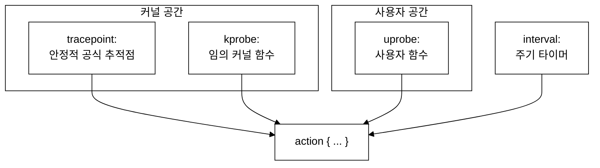

# 7주차 — bpftrace 입문: 한 줄 추적

> bpftrace 는 "커널을 위한 awk" 입니다. 컴파일·로더 코드 없이 한 줄로 시스템콜·함수·지연을 추적합니다. 이번 주는 손가락이 기억할 만큼 원라이너를 많이 쳐봅니다.

last_updated: 2026-06-11

---

## 이번 주 학습 목표

- bpftrace 가 무엇이고 BCC·libbpf 와 어떤 위치인지 설명할 수 있다.
- bpftrace 프로그램의 3요소 **probe / filter(`/.../`) / action(`{...}`)** 를 해부할 수 있다.
- 프로브 종류(`tracepoint:`, `kprobe:`, `uprobe:`, `interval:`, `software:` 등)를 구분한다.
- 빌트인 변수(`comm`, `pid`, `tid`, `args`, `nsecs`, `retval`)를 쓸 수 있다.
- 맵 `@` 와 집계 함수(`count`, `sum`, `avg`, `hist`, `lhist`)로 데이터를 모은다.
- 대표 원라이너 5개 이상을 직접 실행하고 출력을 해석할 수 있다.

> [6주차](06주차_개발환경_VM_BTF_CO-RE개념.md)에서 준비한 VM 위에서 진행합니다. bpftrace 는 내부적으로 BTF·검증기·JIT([4주차](04주차_eBPF_아키텍처_검증기_JIT_맵_헬퍼.md))를 모두 쓰지만, 우리는 그 위에서 **한 줄 언어**만 다룹니다.

---

## 1. bpftrace 란 무엇인가 — 커널을 위한 awk

bpftrace 는 **고수준 추적 언어**입니다. C 로 eBPF 를 짜고 파이썬으로 로더를 쓰는 대신, **awk 처럼 짧은 스크립트 한 줄**로 추적기를 표현하면, bpftrace 가 그것을 eBPF 프로그램으로 컴파일해 커널에 부착하고, 결과를 모아 터미널에 찍어 줍니다.

```mermaid
%%{init: {"theme":"base","themeVariables":{"background":"#ffffff","primaryColor":"#ffffff","primaryBorderColor":"#000000","primaryTextColor":"#000000","secondaryColor":"#ffffff","secondaryBorderColor":"#000000","secondaryTextColor":"#000000","tertiaryColor":"#ffffff","tertiaryBorderColor":"#000000","tertiaryTextColor":"#000000","lineColor":"#000000","textColor":"#000000","mainBkg":"#ffffff","secondBkg":"#ffffff","clusterBkg":"#ffffff","clusterBorder":"#000000","edgeLabelBackground":"#ffffff","nodeBorder":"#000000","defaultLinkColor":"#000000","titleColor":"#000000","actorBkg":"#ffffff","actorBorder":"#000000","actorTextColor":"#000000","actorLineColor":"#000000","signalColor":"#000000","signalTextColor":"#000000","labelBoxBkgColor":"#ffffff","labelBoxBorderColor":"#000000","labelTextColor":"#000000","loopTextColor":"#000000","noteBkgColor":"#ffffff","noteBorderColor":"#000000","noteTextColor":"#000000","activationBkgColor":"#ffffff","activationBorderColor":"#000000","sequenceNumberColor":"#000000","cScale0":"#ffffff","cScale1":"#ffffff","cScale2":"#ffffff","cScale3":"#ffffff","cScale4":"#ffffff","cScale5":"#ffffff","cScale6":"#ffffff","cScale7":"#ffffff","cScale8":"#ffffff","cScale9":"#ffffff","cScale10":"#ffffff","cScale11":"#ffffff","cScaleLabel0":"#000000","cScaleLabel1":"#000000","cScaleLabel2":"#000000","cScaleLabel3":"#000000","cScaleLabel4":"#000000","cScaleLabel5":"#000000","cScaleLabel6":"#000000","cScaleLabel7":"#000000","cScaleLabel8":"#000000","cScaleLabel9":"#000000","cScaleLabel10":"#000000","cScaleLabel11":"#000000","pie1":"#ffffff","pie2":"#eeeeee","pie3":"#dddddd","pie4":"#cccccc","fontFamily":"Georgia, serif"}}}%%
flowchart LR
    SRC["내가 쓴 한 줄\n'probe /filter/ { action }'"] -->|"bpftrace 가 컴파일"| BPF["eBPF 프로그램"]
    BPF -->|"부착"| K["리눅스 커널\n(tracepoint/kprobe...)"]
    K -->|"이벤트마다 실행 → 맵에 집계"| M[("BPF 맵 @")]
    M -->|"종료 시 자동 출력"| T["터미널"]
```



| 도구 | 추상화 수준 | 쓰기 방식 | 적합한 상황 |
|:---|:---|:---|:---|
| bpftrace | 가장 높음 | 한 줄 스크립트 | 즉석 탐색·임시 측정 |
| BCC | 중간 | Python + C 문자열 | 좀 더 복잡한 도구 만들기 ([8주차](08주차_BCC_입문_맵과_perf이벤트.md)) |
| libbpf+CO-RE | 낮음(C) | C + 빌드 | 운영 배포 ([11주차](11주차_libbpf와_CO-RE_프로덕션eBPF.md)) |

> 비유: bpftrace 의 `@[comm] = count()` 는 awk 의 `arr[$1]++` 와 거의 같은 감각입니다. "어떤 키별로 세어 모은다" 는 발상이 똑같습니다.

**한 줄이 커널까지 가는 길 — bpftrace 내부 동작.** bpftrace 가 "마법"처럼 보이지만, 우리가 [4주차](04주차_eBPF_아키텍처_검증기_JIT_맵_헬퍼.md)에서 배운 파이프라인을 자동화한 것뿐입니다. 우리가 친 한 줄은 다음 단계를 거칩니다.

```mermaid
%%{init: {"theme":"base","themeVariables":{"background":"#ffffff","primaryColor":"#ffffff","primaryBorderColor":"#000000","primaryTextColor":"#000000","secondaryColor":"#ffffff","secondaryBorderColor":"#000000","secondaryTextColor":"#000000","tertiaryColor":"#ffffff","tertiaryBorderColor":"#000000","tertiaryTextColor":"#000000","lineColor":"#000000","textColor":"#000000","mainBkg":"#ffffff","secondBkg":"#ffffff","clusterBkg":"#ffffff","clusterBorder":"#000000","edgeLabelBackground":"#ffffff","nodeBorder":"#000000","defaultLinkColor":"#000000","titleColor":"#000000","actorBkg":"#ffffff","actorBorder":"#000000","actorTextColor":"#000000","actorLineColor":"#000000","signalColor":"#000000","signalTextColor":"#000000","labelBoxBkgColor":"#ffffff","labelBoxBorderColor":"#000000","labelTextColor":"#000000","loopTextColor":"#000000","noteBkgColor":"#ffffff","noteBorderColor":"#000000","noteTextColor":"#000000","activationBkgColor":"#ffffff","activationBorderColor":"#000000","sequenceNumberColor":"#000000","cScale0":"#ffffff","cScale1":"#ffffff","cScale2":"#ffffff","cScale3":"#ffffff","cScale4":"#ffffff","cScale5":"#ffffff","cScale6":"#ffffff","cScale7":"#ffffff","cScale8":"#ffffff","cScale9":"#ffffff","cScale10":"#ffffff","cScale11":"#ffffff","cScaleLabel0":"#000000","cScaleLabel1":"#000000","cScaleLabel2":"#000000","cScaleLabel3":"#000000","cScaleLabel4":"#000000","cScaleLabel5":"#000000","cScaleLabel6":"#000000","cScaleLabel7":"#000000","cScaleLabel8":"#000000","cScaleLabel9":"#000000","cScaleLabel10":"#000000","cScaleLabel11":"#000000","pie1":"#ffffff","pie2":"#eeeeee","pie3":"#dddddd","pie4":"#cccccc","fontFamily":"Georgia, serif"}}}%%
flowchart LR
    A["한 줄 스크립트\n(텍스트)"] -->|"파싱·의미분석"| B["AST"]
    B -->|"코드 생성"| C["LLVM IR"]
    C -->|"LLVM BPF 백엔드"| D["eBPF 바이트코드"]
    D -->|"bpf() 시스템콜\n로드·부착"| E["검증기 → JIT → 훅"]
    E -->|"맵 / 출력"| F["bpftrace 사용자 공간"]
```



1. bpftrace 가 스크립트를 **파싱**해 추상 구문 트리(AST)를 만들고,
2. 이를 **LLVM IR** 로 코드 생성한 뒤,
3. **LLVM BPF 백엔드**로 eBPF 바이트코드를 뽑고,
4. `bpf()` 시스템콜로 커널에 **로드**하면 검증기·JIT 를 거쳐 프로브에 **부착**되며,
5. 실행 중 모인 맵을 bpftrace 가 읽어 **출력**합니다.

> 즉 bpftrace 도 BCC 처럼 내부에서 **LLVM 으로 eBPF 를 생성**합니다. 차이는 "C 를 직접 쓰느냐(BCC)" vs "고수준 한 줄 언어를 bpftrace 가 대신 IR 로 바꿔주느냐"입니다. 컴파일은 `bpftrace` 실행 시점에 일어나므로, 첫 실행이 잠깐 느린 것도 이 때문입니다.

먼저 VM 에서 버전을 확인하고, 어떤 프로브가 있는지 목록을 살펴봅니다.

```bash
# (VM 안에서)
bpftrace --version
sudo bpftrace -l 'tracepoint:syscalls:*' | head      # 시스템콜 트레이스포인트 목록
sudo bpftrace -l 'kprobe:tcp_*' | head                # tcp_ 로 시작하는 kprobe 목록
```

---

## 2. 프로그램 해부 — probe / filter / action

bpftrace 한 줄은 세 부분으로 이뤄집니다.

```mermaid
%%{init: {"theme":"base","themeVariables":{"background":"#ffffff","primaryColor":"#ffffff","primaryBorderColor":"#000000","primaryTextColor":"#000000","secondaryColor":"#ffffff","secondaryBorderColor":"#000000","secondaryTextColor":"#000000","tertiaryColor":"#ffffff","tertiaryBorderColor":"#000000","tertiaryTextColor":"#000000","lineColor":"#000000","textColor":"#000000","mainBkg":"#ffffff","secondBkg":"#ffffff","clusterBkg":"#ffffff","clusterBorder":"#000000","edgeLabelBackground":"#ffffff","nodeBorder":"#000000","defaultLinkColor":"#000000","titleColor":"#000000","actorBkg":"#ffffff","actorBorder":"#000000","actorTextColor":"#000000","actorLineColor":"#000000","signalColor":"#000000","signalTextColor":"#000000","labelBoxBkgColor":"#ffffff","labelBoxBorderColor":"#000000","labelTextColor":"#000000","loopTextColor":"#000000","noteBkgColor":"#ffffff","noteBorderColor":"#000000","noteTextColor":"#000000","activationBkgColor":"#ffffff","activationBorderColor":"#000000","sequenceNumberColor":"#000000","cScale0":"#ffffff","cScale1":"#ffffff","cScale2":"#ffffff","cScale3":"#ffffff","cScale4":"#ffffff","cScale5":"#ffffff","cScale6":"#ffffff","cScale7":"#ffffff","cScale8":"#ffffff","cScale9":"#ffffff","cScale10":"#ffffff","cScale11":"#ffffff","cScaleLabel0":"#000000","cScaleLabel1":"#000000","cScaleLabel2":"#000000","cScaleLabel3":"#000000","cScaleLabel4":"#000000","cScaleLabel5":"#000000","cScaleLabel6":"#000000","cScaleLabel7":"#000000","cScaleLabel8":"#000000","cScaleLabel9":"#000000","cScaleLabel10":"#000000","cScaleLabel11":"#000000","pie1":"#ffffff","pie2":"#eeeeee","pie3":"#dddddd","pie4":"#cccccc","fontFamily":"Georgia, serif"}}}%%
flowchart LR
    P["probe\ntracepoint:raw_syscalls:sys_enter\n(언제 실행되나)"]
    F["/filter/\n/comm == \"sshd\"/\n(이 조건일 때만)"]
    A["{ action }\n{ @[comm] = count(); }\n(무엇을 하나)"]
    P --> F --> A
```

| 부분 | 문법 | 역할 |
|:---|:---|:---|
| probe | `tracepoint:...`, `kprobe:...` | **언제** 이 코드를 실행할지(부착지점) |
| filter | `/조건/` (생략 가능) | **이 조건일 때만** action 실행 |
| action | `{ ... }` | **무엇을** 할지(집계·출력 등) |

가장 단순한 예 — 누군가 `execve`(프로그램 실행)를 호출할 때마다 한 줄 찍기:

```bash
sudo bpftrace -e 'tracepoint:syscalls:sys_enter_execve { printf("%s (pid %d) 실행\n", comm, pid); }'
```

`comm` 은 현재 프로세스 이름, `pid` 는 PID 입니다. 필터를 붙여 특정 프로세스만 보려면:

```bash
# bash 가 부른 execve 만
sudo bpftrace -e 'tracepoint:syscalls:sys_enter_execve /comm == "bash"/ { printf("%s\n", str(args.filename)); }'
```

> `str(args.filename)` 처럼 `args.<필드>` 로 트레이스포인트 인자를 읽습니다. 어떤 인자가 있는지는 `sudo bpftrace -lv tracepoint:syscalls:sys_enter_execve` 로 확인합니다.

---

## 3. 프로브 종류

| 프로브 | 의미 | 예시 |
|:---|:---|:---|
| `tracepoint:cat:event` | 커널이 공식 제공하는 안정적 추적점 | `tracepoint:raw_syscalls:sys_enter` |
| `kprobe:func` / `kretprobe:func` | 임의 커널 함수 진입/반환 | `kprobe:tcp_v4_connect` |
| `uprobe:/bin/bash:func` | 사용자 공간 함수 진입 | `uprobe:/bin/bash:readline` |
| `interval:s:N` / `interval:ms:N` | N초/ms 마다 주기적으로 | `interval:s:1` |
| `software:` / `hardware:` | 성능 이벤트(페이지폴트·캐시미스 등) | `software:faults:1` |
| `BEGIN` / `END` | 시작/종료 시 1회 (awk 와 동일) | 헤더 출력·결과 정리 |



> 안정성 차이: `tracepoint:` 는 커널이 유지를 약속한 인터페이스라 버전이 바뀌어도 잘 깨지지 않습니다. `kprobe:` 는 임의 함수에 붙는 만큼 강력하지만, 함수 이름·시그니처가 커널 버전에 따라 바뀔 수 있어 더 깨지기 쉽습니다. 실습①([9주차](09주차_실습1_시스템콜_추적기.md))은 `tracepoint`, 실습②([10주차](10주차_실습2_네트워크_연결_추적기.md))는 `kprobe` 를 씁니다.

---

## 4. 빌트인 변수

bpftrace 는 자주 쓰는 값을 미리 변수로 줍니다.

| 변수 | 의미 |
|:---|:---|
| `comm` | 현재 프로세스 이름 (예: `sshd`) |
| `pid` | 프로세스 ID (사용자 관점 PID = TGID) |
| `tid` | 스레드 ID |
| `uid` | 사용자 ID |
| `nsecs` | 부팅 후 경과 나노초 (지연 계산용 타임스탬프) |
| `args` | 프로브 인자 구조체 (`args.filename` 등) |
| `retval` | (kretprobe/return) 함수 반환값 |
| `cpu` | 현재 CPU 번호 |

위 표 외에도 자주 쓰는 빌트인 변수가 더 있습니다. 한 번에 정리해 둡니다.

| 변수 | 의미 | 비고 |
|:---|:---|:---|
| `uid` | 사용자 ID | `uid == 0` 으로 root 만 거르기 |
| `elapsed` | bpftrace 시작 후 경과 나노초 | `nsecs`(부팅 기준)와 달리 **실행 시작 기준** |
| `cpu` | 현재 CPU 번호 | per-CPU 분포·NUMA 관찰 |
| `arg0`, `arg1`, ... | kprobe/uprobe 의 **원시 인자**(레지스터) | 타입이 없으므로 캐스팅 필요 |
| `args` | tracepoint/일부 probe 의 **타입 있는 인자 구조체** | `args.filename` 처럼 필드 접근 |
| `retval` | (kretprobe/uretprobe) 함수 반환값 | 음수면 보통 `-errno` |
| `func` | 현재 프로브가 붙은 함수 이름 | 와일드카드 프로브에서 유용 |
| `probe` | 현재 프로브 전체 이름 문자열 | 어떤 프로브가 찍혔는지 식별 |

> `arg0` vs `args` 구분이 중요합니다. `kprobe:` 에는 타입 정보가 없어 `arg0`(첫 인자 레지스터 값)을 직접 받아 `(struct file *)arg0` 처럼 **캐스팅**해 씁니다. 반면 `tracepoint:` 는 커널이 인자 포맷을 공개하므로 `args.<필드>` 로 **타입 안전하게** 읽습니다(예: `args.id`, `args.filename`). 그래서 안정성뿐 아니라 사용 편의에서도 tracepoint 가 유리합니다.

**필터·삼항·문자열·구조체 접근.** action 안에서 awk 처럼 조건 분기를 쓸 수 있습니다.

```bash
# 삼항 연산자: 읽기 성공/실패를 한 줄로 분류
sudo bpftrace -e '
tracepoint:syscalls:sys_exit_read {
    @[args.ret >= 0 ? "ok" : "err"] = count();
}'
```

```bash
# 커널 구조체 접근: kprobe 인자를 캐스팅해 필드를 따라간다
sudo bpftrace -e '
kprobe:vfs_open {
    $path = (struct path *)arg0;
    printf("open dentry=%s\n", str($path->dentry->d_name.name));
}'
```

> `str()` 은 커널/사용자 메모리의 **널 종료 문자열**을 안전하게 읽어 옵니다. `$path` 처럼 `$` 로 시작하는 것은 **스크래치 지역 변수**(맵 `@` 와 달리 출력되지 않고 이벤트 처리 동안만 삽니다). `->` 로 구조체 필드를 따라가면 bpftrace 가 내부적으로 `bpf_probe_read_kernel` 헬퍼 호출로 바꿔 줍니다.

집계 함수도 표보다 더 있습니다. `stats(x)` 는 count·avg·total 을 한 번에 주고, `min`/`max` 와 함께 분포의 양 끝을 잡습니다.

| 추가 집계 | 하는 일 |
|:---|:---|
| `stats(x)` | count·평균·합계를 한 번에 요약 |
| `delete(@m[key])` | 맵 항목 제거(지연 측정의 짝 맞춤) |
| `clear(@m)` | 맵 전체 비우기(주기 출력 후 리셋) |
| `print(@m)` / `print(@m, n)` | 맵(상위 n개) 즉시 출력 |

**확률적 샘플링 — `profile:hz`.** 모든 이벤트를 잡는 대신 **고정 주파수로 표본만** 뜨면, 부하를 크게 낮추면서 "어디서 시간을 쓰나"를 통계적으로 알 수 있습니다.

```bash
# 모든 CPU 에서 초당 99회 스택을 표집 → 어떤 함수가 자주 잡히나(=CPU 점유)
sudo bpftrace -e 'profile:hz:99 { @[comm] = count(); }'
```

> 99Hz 처럼 100의 약수를 피한 **소수에 가까운 주파수**를 쓰는 관행이 있습니다. 100Hz 같은 값은 100Hz 로 도는 커널 타이머와 박자가 겹쳐(lockstep) 특정 작업만 반복 표집되는 **에일리어싱**을 일으킬 수 있어서입니다. 표집은 전수 측정이 아니므로 결과는 "비율의 추정치"로 읽습니다.

지연(latency) 측정의 기본 패턴 — `nsecs` 로 진입·반환 시각을 빼면 함수가 얼마나 걸렸는지 알 수 있습니다.

```bash
# vfs_read 함수가 호출되고 반환되기까지 걸린 시간을 히스토그램으로
sudo bpftrace -e '
kprobe:vfs_read { @start[tid] = nsecs; }
kretprobe:vfs_read /@start[tid]/ {
    @ns = hist(nsecs - @start[tid]);
    delete(@start[tid]);
}'
```

> `@start[tid]` 에 진입 시각을 저장했다가, 반환 시 빼서 소요 시간을 구합니다. `tid` 를 키로 쓰는 이유: 같은 함수가 여러 스레드에서 동시에 돌 수 있어 스레드별로 시각을 따로 보관해야 하기 때문입니다.

---

## 5. 맵 `@` 와 집계 함수

`@` 로 시작하는 이름이 **맵**입니다(커널 속 집계표). `@name` 은 스칼라, `@name[key]` 는 키별 맵입니다. bpftrace 는 프로그램이 끝날 때(`END` 또는 Ctrl-C) **남은 맵을 자동으로 출력**합니다.

| 집계 함수 | 하는 일 | 출력 형태 |
|:---|:---|:---|
| `count()` | 발생 횟수 세기 | 정수 |
| `sum(x)` | 합계 | 정수 |
| `avg(x)` | 평균 | 정수 |
| `min(x)` / `max(x)` | 최소/최대 | 정수 |
| `hist(x)` | 2의 거듭제곱 구간 히스토그램 | 막대 그래프 |
| `lhist(x, min, max, step)` | 선형 구간 히스토그램 | 막대 그래프 |


데이터가 **커널의 맵에 모였다가, 종료 시점에 한 번에 사용자 공간으로** 넘어옵니다. 이벤트 하나하나를 실시간으로 보내지 않으므로(집계형), 초당 수만 건이 발생해도 가볍습니다. *개별 이벤트를 실시간 스트림으로 받고 싶을 때* 는 다른 방식(perf 이벤트)을 쓰는데, 이는 [8주차](08주차_BCC_입문_맵과_perf이벤트.md)에서 다룹니다.

---

## 6. 대표 원라이너 (실행 가능)

아래는 VM 에서 바로 칠 수 있는 예제들입니다. 각 예제에 **기대 출력**을 함께 설명합니다. (모두 `sudo` 필요)

### 6-1. 시스템콜 카운트 — "지금 누가 가장 바쁜가"

```bash
sudo bpftrace -e 'tracepoint:raw_syscalls:sys_enter { @[comm] = count(); }'
```

몇 초 두었다가 `Ctrl-C` 를 누르면, 프로세스 이름별 시스템콜 총 호출 수가 많은 순으로 정렬돼 나옵니다.

```text
@[bpftrace]: 142
@[sshd]: 389
@[systemd]: 911
```

> 이 한 줄이 바로 실습①([9주차](09주차_실습1_시스템콜_추적기.md))의 축소판입니다. 실습① BCC 코드도 같은 `raw_syscalls:sys_enter` 트레이스포인트에서 `(PID, 시스템콜)` 별로 셉니다.

### 6-2. 시스템콜 번호별 카운트 — "무슨 시스템콜이 많은가"

```bash
sudo bpftrace -e 'tracepoint:raw_syscalls:sys_enter { @[args.id] = count(); }'
```

`args.id` 는 시스템콜 **번호**입니다(예: 읽기/쓰기/열기 등). 번호별 호출량이 나옵니다. 이름으로 보고 싶으면 6-1 처럼 `comm`, 또는 개별 시스템콜 트레이스포인트(`sys_enter_openat` 등)를 직접 겁니다.

### 6-3. 파일 열기 추적 (opensnoop 류)

```bash
sudo bpftrace -e '
tracepoint:syscalls:sys_enter_openat {
    printf("%-16s pid=%-7d %s\n", comm, pid, str(args.filename));
}'
```

다른 창에서 `cat /etc/hostname` 같은 명령을 실행하면, 어떤 프로세스가 어떤 파일을 여는지 실시간으로 한 줄씩 찍힙니다.

```text
cat              pid=4821    /etc/hostname
sshd             pid=1290    /proc/4821/stat
```

### 6-4. 프로세스 실행 추적 (execsnoop 류)

```bash
sudo bpftrace -e '
tracepoint:syscalls:sys_enter_execve {
    printf("%-16s pid=%-7d %s\n", comm, pid, str(args.filename));
}'
```

새 프로그램이 실행될 때마다(셸에서 명령을 칠 때마다) 한 줄씩 나옵니다. "지금 이 시스템에서 무엇이 실행되고 있나" 를 보는 보안 관측의 기초입니다.

### 6-5. 시스템콜 지연 히스토그램

```bash
sudo bpftrace -e '
tracepoint:raw_syscalls:sys_enter { @start[tid] = nsecs; }
tracepoint:raw_syscalls:sys_exit /@start[tid]/ {
    @ns = hist(nsecs - @start[tid]);
    delete(@start[tid]);
}'
```

`Ctrl-C` 시 시스템콜 1건 처리에 걸린 시간 분포가 막대 히스토그램으로 나옵니다. 대부분 짧고 일부가 길다는 식의 **꼬리 분포** 를 한눈에 봅니다.

```text
@ns:
[256, 512)        1043 |@@@@@@@@@@@@@@@@@@@@@@@@@@@@@@@@@@@@@@@@@@|
[512, 1K)          512 |@@@@@@@@@@@@@@@@@@@@                     |
[1K, 2K)            88 |@@@                                     |
```

> 읽는 법: 왼쪽 `[256, 512)` 는 256~512 나노초 구간, 가운데 숫자는 그 구간에 든 건수, 막대는 상대 비율입니다.

### 6-6. (보너스) 1초마다 TCP 연결 시도 카운트

```bash
sudo bpftrace -e '
kprobe:tcp_v4_connect { @conn[comm] = count(); }
interval:s:1 { print(@conn); clear(@conn); }'
```

`kprobe:tcp_v4_connect` 는 실습②([10주차](10주차_실습2_네트워크_연결_추적기.md))가 거는 바로 그 함수입니다. 다른 창에서 `curl --max-time 2 http://127.0.0.1:22` 를 해보면 1초마다 프로세스별 연결 시도 수가 찍힙니다.

---

### 📸 실제 실행 화면 (터미널 스크린샷)

> 아래는 이 강의 환경(Ubuntu 24.04 / 커널 6.17 / aarch64)에서 **실제 터미널을 열어 bpftrace 를 실행한 화면을 그대로 캡처(screencapture)** 한 것입니다.


---

## 💻 코드로 보기 — bpftrace 예제 전문

지금까지 본 원라이너들은 사실 `examples/` 폴더에 **완성된 `.bt` 스크립트**로 들어 있습니다. 아래 네 예제는 전부 `examples/` 에 있고, `sudo bpftrace <파일>.bt` 로 바로 실행할 수 있습니다. 각 코드에서 **probe(언제) / filter(조건) / action(무엇을)** 가 어디인지 짚어 보겠습니다.

### hello.bt — 가장 단순한 반응 (execve 마다 인사)

```awk
#!/usr/bin/env bpftrace
/*
 * hello.bt — 가장 단순한 eBPF 프로그램 (bpftrace 버전)
 *
 * [무엇을 하나]
 *   새 프로그램이 실행될 때마다(= execve 시스템콜) 한 줄 인사를 출력한다.
 *   "eBPF 가 커널 이벤트에 반응해 코드를 실행한다"는 가장 기본 동작을 눈으로 본다.
 *
 * [어떻게 도나]
 *   - tracepoint:syscalls:sys_enter_execve : "누군가 새 프로그램을 실행하려는 순간"이라는 커널 이벤트
 *   - 그 순간마다 { } 안의 코드(여기선 printf)가 커널 문맥에서 실행된다.
 *
 * [실행]
 *   sudo bpftrace hello.bt        (멈춘 듯 보여도 정상 — 이벤트가 오면 출력됨. Ctrl-C 로 종료)
 *   띄워둔 채 다른 터미널에서  ls  나  date  를 쳐보면 줄이 찍힌다.
 */

BEGIN {
    printf("eBPF 시작! 새 프로그램 실행을 지켜봅니다. (다른 창에서 명령을 쳐보세요, Ctrl-C 로 종료)\n");
}

tracepoint:syscalls:sys_enter_execve {
    printf("안녕! PID %-6d (%s) 가 실행: %s\n", pid, comm, str(args.filename));
}

END {
    printf("eBPF 종료. 안녕히 가세요!\n");
}
```

- **probe** = `tracepoint:syscalls:sys_enter_execve` (누군가 새 프로그램을 실행하려는 순간). `BEGIN`/`END` 는 시작·종료 시 1회 도는 특수 probe입니다.
- **filter** 는 없습니다(모든 execve 를 잡음). 조건 없이 항상 action 을 실행합니다.
- **action** = `{ printf(...) }`. `pid`·`comm` 빌트인과 `str(args.filename)`(열린 인자 문자열)을 찍습니다.

### opensnoop.bt — 어떤 프로세스가 어떤 파일을 여나 (스트리밍)

```awk
#!/usr/bin/env bpftrace
/*
 * opensnoop.bt — 어떤 프로세스가 어떤 파일을 여는지 실시간으로 잡기
 *
 * [무엇을 하나]
 *   파일 열기(openat) 시스템콜을 가로채, (프로세스, 여는 파일 경로)를 한 줄씩 보여준다.
 *   "이 프로그램이 무슨 파일을 건드리나?"를 들여다보는 고전 예제.
 *
 * [어떻게 도나]
 *   - tracepoint:syscalls:sys_enter_openat : 파일 열기 시스템콜 진입점 (arm64 는 open 대신 openat 사용)
 *   - args.filename : 열려는 파일 경로
 *
 * [실행]
 *   sudo bpftrace opensnoop.bt        (다른 창에서 cat /etc/hostname 등을 실행 → 잡힘. Ctrl-C 종료)
 *   출력이 너무 많으면 특정 프로세스만:  sudo bpftrace -e 'tracepoint:syscalls:sys_enter_openat /comm=="cat"/ { printf("%s\n", str(args.filename)); }'
 */

BEGIN {
    printf("%-16s %-6s %s\n", "프로세스", "PID", "여는 파일");
}

tracepoint:syscalls:sys_enter_openat {
    printf("%-16s %-6d %s\n", comm, pid, str(args.filename));
}
```

- **probe** = `tracepoint:syscalls:sys_enter_openat` (파일 열기 진입점). arm64 는 `open` 대신 `openat` 을 씁니다.
- **filter** 는 없지만, 주석의 한 줄 예처럼 `/comm=="cat"/` 를 붙이면 특정 프로세스만 거를 수 있습니다.
- **action** 은 `comm`·`pid`·`str(args.filename)` 을 한 줄씩 즉시 출력 — 집계 없이 **이벤트마다 스트리밍**하는 형태입니다.

### syscall_top.bt — 프로세스별 시스템콜 집계 (맵)

```awk
#!/usr/bin/env bpftrace
/*
 * syscall_top.bt — 어떤 프로세스가 시스템콜을 많이 부르나 (Top 집계)
 *
 * [무엇을 하나]
 *   추적하는 동안 (프로세스 이름, 시스템콜)별 호출 횟수를 세서, 종료 시 정리해 보여준다.
 *   9주차 실습(syscall-tracer)의 '맵 집계' 아이디어를 한 줄짜리로 맛본다.
 *
 * [어떻게 도나]
 *   - tracepoint:raw_syscalls:sys_enter : "어떤 시스템콜이든 들어오는 순간" (모든 시스템콜 공통 입구)
 *   - @[comm] = count() : comm(프로세스 이름)별로 1씩 누적하는 맵
 *
 * [실행]
 *   sudo bpftrace syscall_top.bt        (몇 초 두었다가 Ctrl-C → 결과가 정렬되어 나옴)
 */

BEGIN {
    printf("시스템콜 호출 집계 중... (Ctrl-C 로 멈추면 결과가 나옵니다)\n");
}

// 프로세스별 총 시스템콜 횟수
tracepoint:raw_syscalls:sys_enter {
    @by_process[comm] = count();   // by_process = 프로세스별 횟수
}

END {
    printf("\n=== 프로세스별 시스템콜 호출 횟수 (적은→많은 순) ===\n");
    // bpftrace 는 END 에서 맵을 자동으로 정렬·출력한다.
}
```

- **probe** = `tracepoint:raw_syscalls:sys_enter` (모든 시스템콜의 공통 입구).
- **filter** 는 없습니다.
- **action** = `@by_process[comm] = count()` — `comm` 을 키로 하는 **맵 `@`** 에 1씩 누적합니다. opensnoop 과 달리 줄을 찍지 않고 커널에 모았다가, `END`(또는 Ctrl-C)에서 bpftrace 가 자동 정렬·출력합니다. 이것이 5절에서 본 **집계형**입니다.

### openat_latency.bt — openat 지연 히스토그램 (진입·반환 짝짓기)

```awk
#!/usr/bin/env bpftrace
/*
 * openat_latency.bt — 파일 열기(openat)가 얼마나 걸리나 (지연 히스토그램)
 *
 * [무엇을 하나]
 *   openat 시스템콜의 '진입~반환' 시간을 재서, 소요시간 분포를 히스토그램으로 그린다.
 *   "느린 꼬리(tail latency)"를 눈으로 보는 성능 분석의 핵심 패턴.
 *
 * [어떻게 도나]
 *   - sys_enter_openat 에서 시작 시각 저장(@start[tid] = nsecs)
 *   - sys_exit_openat 에서 (현재시각 - 시작시각)을 계산해 hist() 에 누적
 *   - hist() : 2의 거듭제곱 구간으로 자동 분류해 막대그래프(로그 스케일)로 보여줌
 *
 * [실행]
 *   sudo bpftrace openat_latency.bt        (몇 초 두었다가 Ctrl-C → 히스토그램 출력)
 *
 * [관련] 14주차(성능 분석·지연 히스토그램).
 */

BEGIN {
    printf("openat 지연 측정 중... (Ctrl-C 로 멈추면 히스토그램이 나옵니다)\n");
}

tracepoint:syscalls:sys_enter_openat {
    @start[tid] = nsecs;       // 이 스레드의 openat 시작 시각 기록
}

tracepoint:syscalls:sys_exit_openat /@start[tid]/ {
    @latency_ns = hist(nsecs - @start[tid]);   // latency_ns = 걸린 시간(나노초) 분포
    delete(@start[tid]);
}

END {
    clear(@start);             // 임시 맵 정리 (출력에서 제외)
}
```

- **probe** 가 둘입니다 — `sys_enter_openat`(진입)에서 `@start[tid] = nsecs` 로 시작 시각을 저장하고, `sys_exit_openat`(반환)에서 경과 시간을 계산합니다.
- **filter** = `/@start[tid]/` — 진입 시각이 기록된 스레드일 때만 반환을 처리합니다(짝이 맞을 때만). `tid` 를 키로 써서 스레드별로 시각을 따로 보관합니다.
- **action** = `@latency_ns = hist(nsecs - @start[tid])` 로 (반환−진입) 소요 시간을 히스토그램에 누적하고, `delete(@start[tid])` 로 짝을 지웁니다. 이 **진입·반환 짝짓기** 패턴이 8주차 BCC 의 `BPF_HASH` 짝맞춤으로 그대로 이어집니다.

---

## 💡 핵심 요약

- bpftrace = **커널을 위한 awk**. 한 줄로 추적기를 표현하면 컴파일·부착·출력까지 자동.
- 프로그램 = **probe / `/filter/` / `{action}`**. probe 는 "언제", filter 는 "이 조건일 때만", action 은 "무엇을".
- 프로브 종류: `tracepoint:`(안정적), `kprobe:`(임의 함수, 강력하지만 깨지기 쉬움), `uprobe:`, `interval:` 등.
- 빌트인 변수: `comm`, `pid`, `tid`, `args`, `nsecs`(지연 계산), `retval`.
- 맵 `@` + 집계 함수(`count`/`sum`/`avg`/`hist`/`lhist`)로 모으고, 종료 시 자동 출력된다.
- `@[comm]=count()` 는 실습①의, `kprobe:tcp_v4_connect` 는 실습②의 디딤돌이다.

---

## ✍️ 연습문제

1. `tracepoint:syscalls:sys_enter_openat /comm == "cat"/ { printf("%s\n", str(args.filename)); }` 에서 probe/filter/action 을 각각 가려내어라.
2. `count()` 와 `hist()` 의 출력이 어떻게 다른지, 각각 어떤 질문에 답하기 좋은지 한 문장씩 써라.
3. 지연 측정에서 `@start[tid]` 처럼 키를 `tid` 로 잡는 이유를 설명하라. `pid` 로 잡으면 어떤 문제가 생길 수 있는가?
4. `tracepoint:` 와 `kprobe:` 중 커널 버전 업그레이드에 더 강한 쪽은? 그 이유는?
5. `interval:s:1 { print(@x); clear(@x); }` 에서 `clear()` 를 빼면 출력이 어떻게 달라지는가?

---

## 🛠 실습 과제 (VM 에서 직접 — `ssh ossca-ebpf` 기반)

> Mac 에서 VM 을 켜고(`tart run ossca-ebpf-work --no-graphics &`) `ssh ossca-ebpf` 로 접속한 뒤, 아래 원라이너 5개를 실행·해석하세요. 모두 `sudo` 필요.

**과제 1. 시스템콜 카운트.** 6-1 을 5초간 돌리고 상위 3개 프로세스 이름을 적어라.

```bash
sudo timeout 5 bpftrace -e 'tracepoint:raw_syscalls:sys_enter { @[comm] = count(); }'
```

**과제 2. 파일 열기 추적.** 6-3 을 켜둔 채, 다른 SSH 창에서 `cat /etc/os-release` 를 실행하고 그 줄이 잡히는지 확인하라.

**과제 3. 프로세스 실행 추적.** 6-4 를 켜둔 채, 다른 창에서 `ls`, `whoami` 등을 실행해 새 프로세스가 잡히는지 보라.

**과제 4. 지연 히스토그램.** 6-5 를 5~10초 돌려, 가장 건수가 많은 나노초 구간이 어디인지 적어라.

```bash
sudo timeout 8 bpftrace -e '
tracepoint:raw_syscalls:sys_enter { @start[tid] = nsecs; }
tracepoint:raw_syscalls:sys_exit /@start[tid]/ {
    @ns = hist(nsecs - @start[tid]); delete(@start[tid]); }'
```

**과제 5. TCP 연결 카운트.** 6-6 을 켜둔 채 다른 창에서 `curl --max-time 2 http://127.0.0.1:22` 를 몇 번 실행하고, `curl` 프로세스의 연결 시도 수가 올라가는지 확인하라. *(이 과제는 실습②의 예고편입니다.)*

### 심화 과제 (목표 / 명령 / 관찰 / 질문)

> 아래는 `~/ebpf-labs/examples` 의 `.bt` 스크립트와 직접 작성을 결합한 심화 세트입니다. `ssh ossca-ebpf` 로 접속해 진행하세요.

**심화 1. examples 의 `.bt` 5개 실행·해석.**

- 목표: 미리 준비된 bpftrace 스크립트를 읽고 돌려, probe/filter/action 구조를 실제 코드에서 식별한다.
- 명령:
  ```bash
  ls ~/ebpf-labs/examples/*.bt
  # 임의의 5개를 골라 차례로
  sudo bpftrace ~/ebpf-labs/examples/<파일>.bt
  ```
- 관찰: 각 스크립트가 어떤 probe 에 붙고, 출력이 **집계형**(종료 시 한 번에)인지 **스트리밍형**(줄 단위 실시간)인지 분류한다.
- 질문: 5개 중 `tracepoint:` 를 쓴 것과 `kprobe:` 를 쓴 것을 가려내고, 둘 중 커널 업그레이드에 더 강한 쪽과 그 이유를 한 줄로 적어라.

**심화 2. 원라이너 직접 작성 — 특정 프로세스의 `openat` 만 세기.**

- 목표: 빌트인 변수(`comm`)와 필터(`/.../`), 맵 `count()` 를 결합해 **내가 원하는 질문**을 한 줄로 표현한다.
- 명령(예시는 `bash` 대상, 자기 셸 이름에 맞게 바꿔라):
  ```bash
  sudo bpftrace -e '
  tracepoint:syscalls:sys_enter_openat /comm == "bash"/ { @[comm] = count(); }'
  ```
- 관찰: 다른 창에서 그 셸로 파일을 여는 명령(`cat`, `ls` 등)을 실행하며 카운트가 오르는지 본다.
- 질문: 필터를 `comm` 이 아니라 `pid == <특정PID>` 로 바꾸면 어떤 점이 더 정확해지는가? (힌트: 같은 이름의 프로세스가 여럿일 때)

**심화 3. `hist()` 로 직접 지연 히스토그램 작성.**

- 목표: 6-5 를 참고하되, **특정 시스템콜 하나**(예: `read`)의 지연만 히스토그램으로 만든다.
- 명령:
  ```bash
  sudo timeout 10 bpftrace -e '
  tracepoint:syscalls:sys_enter_read  { @start[tid] = nsecs; }
  tracepoint:syscalls:sys_exit_read /@start[tid]/ {
      @read_ns = hist(nsecs - @start[tid]); delete(@start[tid]); }'
  ```
- 관찰: 막대가 가장 긴 나노초 구간(최빈 구간)과, 오른쪽으로 길게 늘어진 꼬리(느린 read)가 있는지 본다.
- 질문: 같은 데이터를 `hist()` 대신 `avg()` 로만 보면 무엇을 놓치게 되는가? (분포 vs 단일 평균)

---

## ✅ 자가점검 퀴즈

1. bpftrace 한 줄에서 `/comm == "sshd"/` 부분의 역할은?

<details><summary>정답</summary>
필터(filter)다. 현재 프로세스 이름이 sshd 일 때만 뒤의 action 을 실행한다.
</details>

2. `@[comm] = count()` 는 무엇을 하는가?

<details><summary>정답</summary>
프로세스 이름(comm)을 키로 하는 맵에, 이벤트가 발생할 때마다 1씩 더해 횟수를 센다. 종료 시 키별 횟수가 자동 출력된다.
</details>

3. `tracepoint` 가 `kprobe` 보다 커널 버전 변화에 강한 이유는?

<details><summary>정답</summary>
tracepoint 는 커널이 유지를 약속하는 안정적 인터페이스라 시그니처가 잘 안 바뀌지만, kprobe 는 임의 내부 함수에 붙어 함수 이름·인자가 버전에 따라 바뀔 수 있다.
</details>

4. `hist()` 출력에서 `[512, 1K)` 옆의 숫자는 무엇을 뜻하는가?

<details><summary>정답</summary>
측정값이 512~1024(1K) 구간에 들어온 이벤트의 건수다. 막대 길이는 전체 대비 상대 비율을 나타낸다.
</details>

5. 지연 측정에서 진입 시각을 저장한 키를 반환 시 `delete()` 하지 않으면?

<details><summary>정답</summary>
맵 항목이 계속 쌓여 메모리를 낭비하고, 같은 tid 가 재사용될 때 과거 값과 섞일 수 있다. 그래서 짝을 맞춰 지운다.
</details>

---

## 📚 더 읽을거리

- bpftrace 공식 매뉴얼/레퍼런스: https://github.com/bpftrace/bpftrace (`man bpftrace`)
- Brendan Gregg, *BPF Performance Tools* — bpftrace 원라이너 모음의 결정판
- bpftrace one-liner 튜토리얼 (저장소 `docs/tutorial_one_liners.md`)
- 본 랩 README "강의 8 치트시트" 의 bpftrace 한 줄 예 — [README](../../README.md)

---

## ⏭ 다음 주 예고

[8주차](08주차_BCC_입문_맵과_perf이벤트.md)에서는 한 줄을 넘어 **BCC** 로 넘어갑니다. Python 으로 로더를 쓰고 C 로 커널 코드를 짜며, **맵(집계)** 과 **perf 이벤트(스트리밍)** 의 차이를 배웁니다. bpftrace 에서 본 `@[comm]=count()` 가 BCC 의 `BPF_HASH` 로, 6-6 의 실시간 출력이 `BPF_PERF_OUTPUT` 으로 어떻게 이어지는지 확인하고, 실습①·②의 실제 코드를 읽기 시작합니다.
