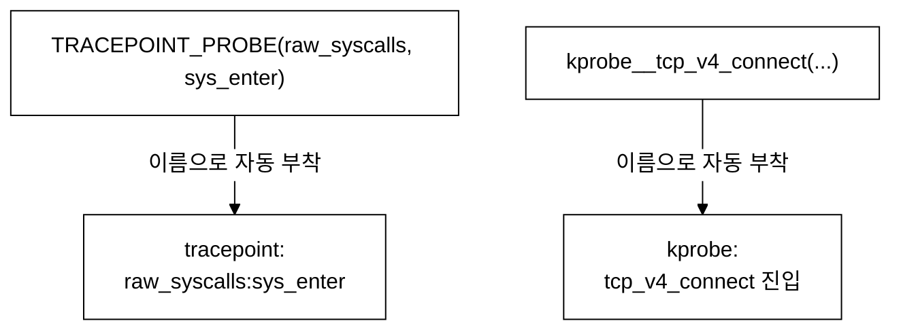
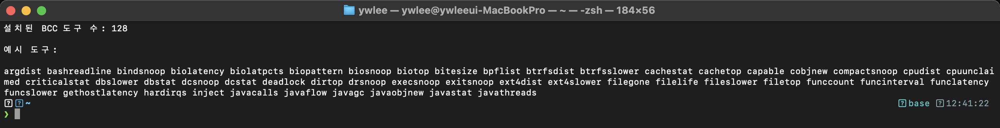
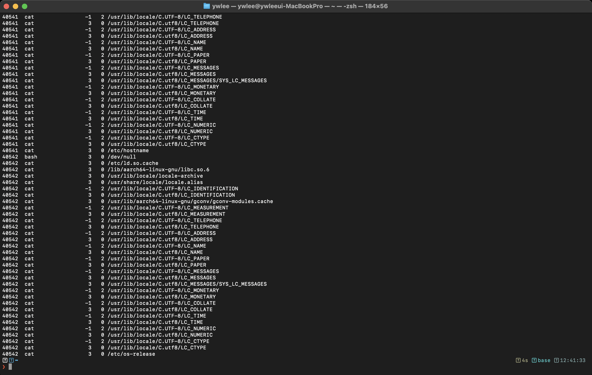

# 8주차 — BCC 입문: 맵과 perf 이벤트

> bpftrace 한 줄로 부족할 때, Python 으로 로더를 쓰고 C 로 커널 코드를 짜는 BCC 로 넘어갑니다. 이번 주의 핵심은 **맵(집계)과 perf 이벤트(스트리밍)의 차이**입니다 — 실습①·②가 정확히 이 두 갈래입니다.

last_updated: 2026-06-11

---

## 이번 주 학습 목표

- BCC 의 구조(Python 프런트엔드 + C 커널 코드 문자열 + 런타임 clang 컴파일)를 설명할 수 있다.
- `BPF(text=...)` / `BPF(src_file=...)` 로 eBPF 를 로드할 수 있다.
- BCC 매크로 `BPF_HASH` / `BPF_ARRAY` / `BPF_PERF_OUTPUT` 의 용도를 안다.
- 프로브 부착 명명규칙 `kprobe__함수명`, `TRACEPOINT_PROBE(category, event)` 를 안다.
- Python 에서 맵을 읽고(`b["counts"].items()`), perf 버퍼를 폴링(`open_perf_buffer`/`perf_buffer_poll`)할 수 있다.
- **맵(집계) vs perf 이벤트(스트리밍)** 의 차이와 선택 기준을 말할 수 있다.
- 아주 작은 BCC 스크립트를 처음부터 작성해 실행할 수 있다.

> [7주차](07주차_bpftrace_입문.md)의 `@[comm]=count()` 가 이번 주 `BPF_HASH` 로, 7-6 의 실시간 출력이 `BPF_PERF_OUTPUT` 으로 이어집니다. 이번 주 코드는 [9주차](09주차_실습1_시스템콜_추적기.md)·[10주차](10주차_실습2_네트워크_연결_추적기.md) 실습의 실제 골격입니다.

---

## 1. BCC 구조 — Python 이 운전하고, C 가 커널에서 돈다

BCC(BPF Compiler Collection)는 두 부분으로 이뤄집니다.

- **C 커널 코드**: 실제로 커널에서 도는 eBPF 프로그램. C 로 작성하지만, 파이썬 안에 **문자열로** 담거나 `.c` 파일로 둡니다.
- **Python 프런트엔드(로더)**: 그 C 코드를 **실행 시점에 clang 으로 컴파일**해 커널에 로드·부착하고, 맵을 읽거나 perf 이벤트를 받아 화면에 찍습니다.

```mermaid
%%{init: {"theme":"base","themeVariables":{"background":"#ffffff","primaryColor":"#ffffff","primaryBorderColor":"#000000","primaryTextColor":"#000000","secondaryColor":"#ffffff","secondaryBorderColor":"#000000","secondaryTextColor":"#000000","tertiaryColor":"#ffffff","tertiaryBorderColor":"#000000","tertiaryTextColor":"#000000","lineColor":"#000000","textColor":"#000000","mainBkg":"#ffffff","secondBkg":"#ffffff","clusterBkg":"#ffffff","clusterBorder":"#000000","edgeLabelBackground":"#ffffff","nodeBorder":"#000000","defaultLinkColor":"#000000","titleColor":"#000000","actorBkg":"#ffffff","actorBorder":"#000000","actorTextColor":"#000000","actorLineColor":"#000000","signalColor":"#000000","signalTextColor":"#000000","labelBoxBkgColor":"#ffffff","labelBoxBorderColor":"#000000","labelTextColor":"#000000","loopTextColor":"#000000","noteBkgColor":"#ffffff","noteBorderColor":"#000000","noteTextColor":"#000000","activationBkgColor":"#ffffff","activationBorderColor":"#000000","sequenceNumberColor":"#000000","cScale0":"#ffffff","cScale1":"#ffffff","cScale2":"#ffffff","cScale3":"#ffffff","cScale4":"#ffffff","cScale5":"#ffffff","cScale6":"#ffffff","cScale7":"#ffffff","cScale8":"#ffffff","cScale9":"#ffffff","cScale10":"#ffffff","cScale11":"#ffffff","cScaleLabel0":"#000000","cScaleLabel1":"#000000","cScaleLabel2":"#000000","cScaleLabel3":"#000000","cScaleLabel4":"#000000","cScaleLabel5":"#000000","cScaleLabel6":"#000000","cScaleLabel7":"#000000","cScaleLabel8":"#000000","cScaleLabel9":"#000000","cScaleLabel10":"#000000","cScaleLabel11":"#000000","pie1":"#ffffff","pie2":"#eeeeee","pie3":"#dddddd","pie4":"#cccccc","fontFamily":"Georgia, serif"}}}%%
flowchart LR
    subgraph PY["Python 프런트엔드 (사용자 공간)"]
        SRC["C 소스 문자열/파일"]
        LOAD["BPF(text=...) / BPF(src_file=...)"]
        READ["맵 읽기 / perf 폴링 / 출력"]
        SRC --> LOAD
    end
    LOAD -->|"런타임 clang 컴파일"| OBJ["eBPF 바이트코드"]
    OBJ -->|"검증기 → JIT → 부착"| K["리눅스 커널"]
    K -->|"맵 / perf 이벤트"| READ
```



> [6주차](06주차_개발환경_VM_BTF_CO-RE개념.md)에서 본 대로 BCC 는 **런타임 컴파일** 방식입니다. 그래서 VM 에 clang 18 과 커널 헤더가 설치돼 있어야 합니다(우리 VM 은 준비됨). 첫 실행이 약간 느린 이유도 매번 컴파일하기 때문입니다.

가장 작은 BCC 프로그램 — execve(프로그램 실행)를 세는 5줄짜리:

```python
#!/usr/bin/env python3
from bcc import BPF

# C 커널 코드를 문자열로. TRACEPOINT_PROBE 로 트레이스포인트에 붙는다.
prog = r"""
BPF_HASH(counts, u32, u64);                       // tgid -> 실행 횟수
TRACEPOINT_PROBE(syscalls, sys_enter_execve) {
    u32 tgid = bpf_get_current_pid_tgid() >> 32;
    u64 init = 0, *v = counts.lookup_or_try_init(&tgid, &init);
    if (v) (*v)++;
    return 0;
}
"""
b = BPF(text=prog)                                # ← 여기서 컴파일·로드·부착
print("execve 추적 중... Ctrl-C 로 종료")
try:
    while True:
        pass
except KeyboardInterrupt:
    for k, v in b["counts"].items():              # ← 맵 읽기
        print(f"  PID {k.value:>7} : {v.value} 회 execve")
```

```bash
# (VM 안에서) eBPF 로드는 관리자 권한 필요
sudo python3 execve_count.py
```

---

## 2. 로드하는 두 가지 방법: `text=` vs `src_file=`

| 방법 | 형태 | 언제 |
|:---|:---|:---|
| `BPF(text=prog)` | C 소스를 **문자열**로 넘김 | 짧은 코드·한 파일에 다 담을 때 |
| `BPF(src_file="bpf/x.c")` | C 소스를 **별도 `.c` 파일**로 | 코드가 길고 분리하고 싶을 때 |

본 랩의 실습①·②는 C 코드를 별도 파일로 분리하고 `src_file=` 로 로드합니다. 예를 들어 실습①의 `tracer.py` 는 다음과 같습니다.

```python
# projects/syscall-tracer/tracer.py 발췌
BPF_SOURCE = "bpf/syscall_count.c"
...
bpf = BPF(src_file=BPF_SOURCE)     # bpf/syscall_count.c 를 런타임 컴파일·로드
```

> 두 방법은 컴파일·로드 동작이 같습니다. 코드량과 가독성에 따라 고르면 됩니다.

---

## 3. BCC 매크로 — 맵을 선언하는 약식 문법

순수 libbpf 라면 맵을 장황하게 선언해야 하지만, BCC 는 매크로로 짧게 씁니다.

| 매크로 | 의미 | 데이터 흐름 |
|:---|:---|:---|
| `BPF_HASH(name, KeyType, ValType)` | 해시 맵(키→값) | **집계** (커널에 모았다가 나중에 읽음) |
| `BPF_ARRAY(name, Type, N)` | 고정 크기 배열 맵 | 인덱스로 접근(설정값·작은 상태) |
| `BPF_PERF_OUTPUT(name)` | perf 이벤트 출력 채널 | **스트리밍** (이벤트를 즉시 사용자 공간으로) |

실습①의 C 코드는 이 세 가지를 모두 씁니다.

```c
// projects/syscall-tracer/bpf/syscall_count.c 발췌
struct key_t { u32 tgid; u32 syscall_id; };
BPF_HASH(counts, struct key_t, u64);   // (tgid, syscall) -> 횟수  (집계)
BPF_HASH(comms,  u32, struct comm_t);  // tgid -> 프로세스 이름
BPF_ARRAY(target, u32, 1);             // 사용자 공간이 주입하는 필터값 (1칸 배열)
```

`BPF_ARRAY(target, u32, 1)` 은 "사용자 공간 → 커널" 로 **설정값을 전달하는 통로**로 쓰입니다. 파이썬에서 추적 대상 PID 를 이 배열의 0번 칸에 써 넣으면, 커널 코드가 그 값을 읽어 필터링합니다(아래 4·6절).

---

## 4. 프로브 부착 명명규칙 — 함수 이름만으로 자동 연결

BCC 는 **C 함수 이름의 접두사**를 보고 어디에 붙일지 스스로 결정합니다. 따로 부착 코드를 쓰지 않아도 됩니다.

| C 코드 작성법 | 부착 대상 | 본 랩 사용처 |
|:---|:---|:---|
| `int kprobe__함수명(struct pt_regs *ctx, ...)` | 그 커널 함수의 **진입(kprobe)** | 실습② `tcp_v4_connect` |
| `int kretprobe__함수명(...)` | 그 함수의 **반환(kretprobe)** | — |
| `TRACEPOINT_PROBE(category, event) { ... }` | `category:event` **트레이스포인트** | 실습① `raw_syscalls:sys_enter` |



실습① C 코드(트레이스포인트):

```c
// projects/syscall-tracer/bpf/syscall_count.c 발췌
TRACEPOINT_PROBE(raw_syscalls, sys_enter) {
    u64 id = bpf_get_current_pid_tgid();
    u32 tgid = id >> 32;                 // 상위 32비트 = TGID(사용자 PID)
    ...
    key.syscall_id = args->id;           // 트레이스포인트 인자 = 시스템콜 번호
    counts.lookup_or_try_init(&key, &init);  // 맵에 +1
}
```

실습② C 코드(kprobe):

```c
// projects/netflow-tracer/bpf/tcpconnect.c 발췌
BPF_PERF_OUTPUT(events);
int kprobe__tcp_v4_connect(struct pt_regs *ctx, void *sk,
                           struct sockaddr *uaddr, int addr_len) {
    struct sockaddr_in *sin = (struct sockaddr_in *)uaddr;
    ...
    struct event_t e = {};
    e.pid = bpf_get_current_pid_tgid() >> 32;
    bpf_probe_read_kernel(&e.daddr, sizeof(e.daddr), &sin->sin_addr.s_addr);
    ...
    events.perf_submit(ctx, &e, sizeof(e));   // perf 이벤트로 즉시 전송
}
```

> 두 코드의 마지막 줄을 비교하세요. 실습①은 `counts...`(맵에 집계), 실습②는 `events.perf_submit`(이벤트 스트리밍)으로 끝납니다. 이 차이가 이번 주의 핵심입니다(5절).

---

## 5. 맵(집계) vs perf 이벤트(스트리밍) — 핵심 비교

eBPF 가 모은 데이터를 사용자 공간으로 가져오는 두 갈래입니다.

```mermaid
%%{init: {"theme":"base","themeVariables":{"background":"#ffffff","primaryColor":"#ffffff","primaryBorderColor":"#000000","primaryTextColor":"#000000","secondaryColor":"#ffffff","secondaryBorderColor":"#000000","secondaryTextColor":"#000000","tertiaryColor":"#ffffff","tertiaryBorderColor":"#000000","tertiaryTextColor":"#000000","lineColor":"#000000","textColor":"#000000","mainBkg":"#ffffff","secondBkg":"#ffffff","clusterBkg":"#ffffff","clusterBorder":"#000000","edgeLabelBackground":"#ffffff","nodeBorder":"#000000","defaultLinkColor":"#000000","titleColor":"#000000","actorBkg":"#ffffff","actorBorder":"#000000","actorTextColor":"#000000","actorLineColor":"#000000","signalColor":"#000000","signalTextColor":"#000000","labelBoxBkgColor":"#ffffff","labelBoxBorderColor":"#000000","labelTextColor":"#000000","loopTextColor":"#000000","noteBkgColor":"#ffffff","noteBorderColor":"#000000","noteTextColor":"#000000","activationBkgColor":"#ffffff","activationBorderColor":"#000000","sequenceNumberColor":"#000000","cScale0":"#ffffff","cScale1":"#ffffff","cScale2":"#ffffff","cScale3":"#ffffff","cScale4":"#ffffff","cScale5":"#ffffff","cScale6":"#ffffff","cScale7":"#ffffff","cScale8":"#ffffff","cScale9":"#ffffff","cScale10":"#ffffff","cScale11":"#ffffff","cScaleLabel0":"#000000","cScaleLabel1":"#000000","cScaleLabel2":"#000000","cScaleLabel3":"#000000","cScaleLabel4":"#000000","cScaleLabel5":"#000000","cScaleLabel6":"#000000","cScaleLabel7":"#000000","cScaleLabel8":"#000000","cScaleLabel9":"#000000","cScaleLabel10":"#000000","cScaleLabel11":"#000000","pie1":"#ffffff","pie2":"#eeeeee","pie3":"#dddddd","pie4":"#cccccc","fontFamily":"Georgia, serif"}}}%%
flowchart TB
    subgraph MAPWAY["① 맵(집계): BPF_HASH/BPF_ARRAY"]
        EV1["이벤트 N건"] -->|"커널에서 +1 누적"| M[("맵 (요약만 보관)")]
        M -->|"끝나고 한 번에 읽기\nb['counts'].items()"| U1["사용자 공간"]
    end
    subgraph PERFWAY["② perf 이벤트(스트리밍): BPF_PERF_OUTPUT"]
        EV2["이벤트 1건"] -->|"perf_submit"| BUF[("perf 링버퍼")]
        BUF -->|"polling 으로 즉시 수신\nperf_buffer_poll"| U2["사용자 공간 콜백"]
    end
```



| 비교 | 맵 (집계) | perf 이벤트 (스트리밍) |
|:---|:---|:---|
| 보내는 단위 | 요약값(횟수·합계 등) | 개별 이벤트 하나하나 |
| 사용자 공간 수신 | 끝나고/주기적으로 **읽음**(pull) | 콜백으로 **밀려옴**(push) |
| 데이터량 | 작음(키 수만큼) | 많을 수 있음(이벤트 수만큼) |
| 개별 정보 보존 | 없음(합쳐짐) | 있음(시각·목적지 등 그대로) |
| 과부하 위험 | 거의 없음 | 버퍼 넘치면 **이벤트 유실** |
| 본 랩 | 실습① ([9주차](09주차_실습1_시스템콜_추적기.md)) | 실습② ([10주차](10주차_실습2_네트워크_연결_추적기.md)) |

**선택 기준 한 줄**: "몇 번 일어났나"(횟수·통계)면 **맵**, "각각 언제·어디로 일어났나"(개별 기록)면 **perf 이벤트**.

---

## 6. Python 쪽 — 맵 읽기 vs perf 폴링

### 6-1. 맵 읽기 (집계형, 실습①)

```python
# projects/syscall-tracer/tracer.py 발췌
counts = bpf["counts"]
for k, v in counts.items():          # 키 객체 k, 값 객체 v
    name = syscall_name(k.syscall_id).decode()   # 시스템콜 번호 → 이름
    per_pid[k.tgid][name] = v.value  # ctypes: .value 로 실제 정수 꺼냄
```

사용자 공간이 커널로 **설정값을 주입**할 때도 같은 맵 인터페이스를 씁니다. 실습①은 추적 대상 PID 를 `BPF_ARRAY` 에 써 넣습니다.

```python
# projects/syscall-tracer/tracer.py 발췌 — 필터값 주입
import ctypes
want = 0xFFFFFFFF if target_pid == 0 else target_pid   # 0 → 전체, 그 외 → 그 PID
bpf["target"][ctypes.c_int(0)] = ctypes.c_uint(want)    # 0번 칸에 기록
```

> ctypes 주의: BCC 맵의 키·값은 C 타입이라 파이썬에서 `k.value`, `v.value` 처럼 **`.value`** 로 꺼냅니다. 주입할 땐 `ctypes.c_int(0)`, `ctypes.c_uint(...)` 로 **C 타입을 명시**합니다.

### 6-2. perf 버퍼 폴링 (스트리밍형, 실습②)

```python
# projects/netflow-tracer/netflow.py 발췌
def handle(_cpu, data, _size):
    e = bpf["events"].event(data)            # 원시 바이트 → event_t 구조체
    comm = e.comm.decode("utf-8", "replace")
    dport = socket.ntohs(e.dport)            # 네트워크 → 호스트 바이트 오더
    print(f"{e.pid:>7}  {comm:<16} {ip_str(e.daddr)}:{dport}")

def on_lost(n):                              # 버퍼 넘쳐 유실된 건수 알림
    lost["count"] += n

bpf["events"].open_perf_buffer(handle, lost_cb=on_lost)   # 콜백 등록
while True:
    bpf.perf_buffer_poll(timeout=200)        # 이벤트를 받아 handle 호출
```

> `lost_cb` 가 중요합니다. perf 이벤트는 너무 빨리 쏟아지면 버퍼가 넘쳐 조용히 유실될 수 있어, 유실 건수를 따로 세어 사용자에게 알립니다(맵 방식엔 없는 고민).

---

## 7. 미니 예제 — 처음부터 작성하는 BCC 스크립트

1절의 `execve_count.py` 를 조금 키워, **프로세스 이름까지** 보여주도록 만들어 봅니다. 맵 키에 이름을 함께 담는 패턴입니다.

```python
#!/usr/bin/env python3
"""execve(프로그램 실행)를 프로세스 이름별로 세는 미니 BCC 스크립트."""
from bcc import BPF

prog = r"""
struct key_t { char comm[16]; };
BPF_HASH(counts, struct key_t, u64);     // 프로세스 이름 -> 실행 횟수 (집계)

TRACEPOINT_PROBE(syscalls, sys_enter_execve) {
    struct key_t key = {};
    bpf_get_current_comm(&key.comm, sizeof(key.comm));   // 헬퍼로 이름 채움
    u64 init = 0, *v = counts.lookup_or_try_init(&key, &init);
    if (v) (*v)++;
    return 0;
}
"""

b = BPF(text=prog)
print("execve 추적 중... Ctrl-C 로 종료 후 집계 출력")
try:
    while True:
        pass
except KeyboardInterrupt:
    print("\n=== 프로세스별 execve 횟수 ===")
    for k, v in sorted(b["counts"].items(), key=lambda kv: -kv[1].value):
        name = k.comm.decode("utf-8", "replace").rstrip("\x00")
        print(f"  {name:<16} {v.value:>6} 회")
```

```bash
# (VM 안에서)
sudo python3 execve_by_comm.py
#   다른 창에서 ls, whoami, cat 등 몇 번 실행 후 Ctrl-C
```

기대 출력:

```text
=== 프로세스별 execve 횟수 ===
  bash                12 회
  sshd                 3 회
  ls                   2 회
```

> 이 한 파일에 **`BPF_HASH`(맵) + `TRACEPOINT_PROBE`(부착) + `bpf_get_current_comm`(헬퍼) + 파이썬 맵 읽기** 가 모두 들어 있습니다. 실습①을 읽을 준비가 끝난 셈입니다.

---

## ⚙️ 리눅스 커널은 BCC 가 보낸 바이트코드를 받아 perf 로 회신한다

BCC 가 편리해 보여도, 그 아래에서는 커널과의 정해진 절차가 돌고 있습니다. BCC 는 **런타임에 clang 으로 C 소스를 eBPF 바이트코드로 컴파일**한 뒤, `bpf()` 시스템콜로 그 바이트코드를 커널에 **로드·부착**합니다. 커널은 검증기·JIT 를 거쳐 프로그램을 훅에 붙이고, 실행 중 모은 데이터를 **perf ring buffer(맵)** 에 담아 사용자 공간으로 **회신**합니다. 즉 사용자 공간(Python)과 커널이 맵을 사이에 두고 주고받는 구조입니다.

```mermaid
%%{init: {"theme":"base","themeVariables":{"background":"#ffffff","primaryColor":"#ffffff","primaryBorderColor":"#000000","primaryTextColor":"#000000","secondaryColor":"#ffffff","secondaryBorderColor":"#000000","secondaryTextColor":"#000000","tertiaryColor":"#ffffff","tertiaryBorderColor":"#000000","tertiaryTextColor":"#000000","lineColor":"#000000","textColor":"#000000","mainBkg":"#ffffff","secondBkg":"#ffffff","clusterBkg":"#ffffff","clusterBorder":"#000000","edgeLabelBackground":"#ffffff","nodeBorder":"#000000","defaultLinkColor":"#000000","titleColor":"#000000","actorBkg":"#ffffff","actorBorder":"#000000","actorTextColor":"#000000","actorLineColor":"#000000","signalColor":"#000000","signalTextColor":"#000000","labelBoxBkgColor":"#ffffff","labelBoxBorderColor":"#000000","labelTextColor":"#000000","loopTextColor":"#000000","noteBkgColor":"#ffffff","noteBorderColor":"#000000","noteTextColor":"#000000","activationBkgColor":"#ffffff","activationBorderColor":"#000000","sequenceNumberColor":"#000000","cScale0":"#ffffff","cScale1":"#ffffff","cScale2":"#ffffff","cScale3":"#ffffff","cScale4":"#ffffff","cScale5":"#ffffff","cScale6":"#ffffff","cScale7":"#ffffff","cScale8":"#ffffff","cScale9":"#ffffff","cScale10":"#ffffff","cScale11":"#ffffff","cScaleLabel0":"#000000","cScaleLabel1":"#000000","cScaleLabel2":"#000000","cScaleLabel3":"#000000","cScaleLabel4":"#000000","cScaleLabel5":"#000000","cScaleLabel6":"#000000","cScaleLabel7":"#000000","cScaleLabel8":"#000000","cScaleLabel9":"#000000","cScaleLabel10":"#000000","cScaleLabel11":"#000000","pie1":"#ffffff","pie2":"#eeeeee","pie3":"#dddddd","pie4":"#cccccc","fontFamily":"Georgia, serif"}}}%%
flowchart LR
    SRC["C 소스 문자열"] -->|"런타임 clang"| BC["eBPF 바이트코드"]
    BC -->|"bpf() 로드·부착"| K["리눅스 커널\n(검증기·JIT·훅)"]
    K -->|"perf ring buffer 로 회신"| PY["Python 프런트엔드"]
```



소스/구조 측면에서, 컴파일·로드를 담당하는 것은 `libbcc`(내부적으로 clang/LLVM 사용)이고, Python `bcc` 모듈이 그 위의 얇은 래퍼입니다. 우리 VM(커널 6.17 aarch64)에는 clang 18 과 커널 헤더가 갖춰져 이 파이프라인이 돕니다.

---

## 📸 실제 실행 화면 (실제 터미널 캡처)

아래는 VM(커널 6.17 aarch64)에서 BCC 도구를 점검하고 직접 실행한 모습입니다.



위는 VM 에 설치된 BCC 도구의 개수와 예시를 확인한 실제 터미널 캡처입니다. 약 128종에 이르는 완성형 도구가 함께 깔려 있어, 직접 짜기 전에 기성 도구로 관측을 시작할 수 있습니다.



위는 `opensnoop-bpfcc` 로 시스템의 파일 열기(`open`)를 실시간으로 잡는 실제 터미널 캡처입니다. 어떤 프로세스가 어떤 파일을 여는지가 한 줄씩 스트리밍되는 것이 perf 이벤트 방식의 전형입니다.

---

## 💡 핵심 요약

- BCC = **Python 로더 + C 커널 코드 + 런타임 clang 컴파일**. `BPF(text=...)`/`BPF(src_file=...)` 로 로드.
- 매크로: `BPF_HASH`/`BPF_ARRAY`(맵, 집계·설정값), `BPF_PERF_OUTPUT`(perf 이벤트, 스트리밍).
- 부착은 함수 이름으로 자동: `kprobe__함수명`, `TRACEPOINT_PROBE(category, event)`.
- 맵 읽기는 `b["맵"].items()` + ctypes `.value`; perf 는 `open_perf_buffer`/`perf_buffer_poll`.
- **맵 = "몇 번"(요약·pull)**, **perf 이벤트 = "각각"(개별·push, 유실 주의)**. 실습①은 맵, 실습②는 perf.

---

## ✍️ 연습문제

1. `BPF(text=...)` 와 `BPF(src_file=...)` 의 차이는 무엇이며, 동작상 같은 점은 무엇인가?
2. `BPF_HASH` 와 `BPF_PERF_OUTPUT` 중, "10초 동안 어떤 프로세스가 connect 를 *총 몇 번* 했나" 에 적합한 것은? 이유는?
3. 위와 달리 "각 connect 가 *언제·어느 IP* 로 갔는지" 를 한 건도 빠짐없이 기록하려면 무엇을 쓰는가?
4. perf 이벤트 방식에서 `lost_cb` 가 필요한 이유를 한 문장으로 써라.
5. 실습①에서 `BPF_ARRAY(target, u32, 1)` 은 무슨 목적으로 쓰이는가? 데이터가 어느 방향으로 흐르는가?

---

## 🛠 실습 과제 (VM 에서 직접 — `ssh ossca-ebpf` 기반)

> Mac 에서 VM 을 켜고(`tart run ossca-ebpf-work --no-graphics &`) `ssh ossca-ebpf` 로 접속한 뒤 진행하세요. 모두 `sudo` 필요.

**과제 1. 미니 BCC 작성·실행.** 7절의 `execve_by_comm.py` 를 직접 작성해 실행하고, 다른 창에서 `ls`·`whoami`·`cat /etc/hostname` 을 몇 번 실행한 뒤 `Ctrl-C` 로 집계를 확인하라.

```bash
# 파일 작성 후
sudo python3 execve_by_comm.py
```

**과제 2. 실습① 코드 읽고 돌려보기.** 실습①을 실행하고, C 코드(`bpf/syscall_count.c`)에서 `BPF_HASH`·`TRACEPOINT_PROBE`·`BPF_ARRAY` 가 각각 어디에 쓰였는지 한 줄씩 적어라.

```bash
cd ~/ebpf-labs/projects/syscall-tracer
sudo python3 tracer.py --duration 5
sudo python3 verify.py            # 자기검증 ("검증 통과" 확인)
```

**과제 3. 실습② 코드 읽고 돌려보기.** 실습②를 켜둔 채 다른 창에서 `curl --max-time 2 http://127.0.0.1:22` 를 실행하고, perf 이벤트로 실시간 출력이 찍히는지 확인하라. `events.perf_submit` 과 `open_perf_buffer` 가 짝을 이루는 지점을 코드에서 찾아라.

```bash
cd ~/ebpf-labs/projects/netflow-tracer
sudo python3 netflow.py --duration 10
```

**과제 4. (비교 정리)** 실습①과 ②의 마지막 "데이터 내보내기" 한 줄을 나란히 적고, 왜 ①은 맵을, ②는 perf 이벤트를 골랐는지 2~3문장으로 설명하라.

---

## ✅ 자가점검 퀴즈

1. BCC 가 실행 머신에 clang 과 커널 헤더를 요구하는 이유는?

<details><summary>정답</summary>
C 커널 코드를 실행 시점(런타임)에 그 머신에서 컴파일하기 때문이다(런타임 컴파일).
</details>

2. C 함수 `int kprobe__tcp_v4_connect(...)` 는 어디에 붙는가?

<details><summary>정답</summary>
커널 함수 tcp_v4_connect 의 진입 지점(kprobe)에 자동으로 부착된다. 함수 이름 접두사 kprobe__ 로 BCC 가 판단한다.
</details>

3. 파이썬에서 BCC 맵의 값을 꺼낼 때 `v.value` 를 쓰는 이유는?

<details><summary>정답</summary>
맵의 키·값이 C(ctypes) 타입이라, .value 로 감싸진 실제 정수를 꺼내야 하기 때문이다.
</details>

4. 초당 수만 건의 연결을 모두 *개별 기록* 으로 받고 싶다. 맵과 perf 중 무엇을 쓰며, 어떤 위험에 대비해야 하는가?

<details><summary>정답</summary>
perf 이벤트(BPF_PERF_OUTPUT)를 쓴다. 다만 버퍼가 넘치면 이벤트가 유실될 수 있으므로 lost_cb 로 유실 건수를 감시해야 한다.
</details>

5. "프로세스별 시스템콜 총 호출 수" 에는 맵과 perf 중 무엇이 더 가벼운가? 이유는?

<details><summary>정답</summary>
맵이다. 커널에서 횟수만 누적했다가 끝나고 한 번에 읽으므로, 이벤트 하나하나를 사용자 공간으로 보내지 않아 부하가 작다.
</details>

---

## 📚 더 읽을거리

- BCC 레퍼런스 가이드: https://github.com/iovisor/bcc/blob/master/docs/reference_guide.md
- BCC Python 튜토리얼: `bcc/docs/tutorial_bcc_python_developer.md`
- 실습① 소스 — `projects/syscall-tracer/bpf/syscall_count.c`, `tracer.py`
- 실습② 소스 — `projects/netflow-tracer/bpf/tcpconnect.c`, `netflow.py`
- 본 랩 README — [README](../../README.md) (실행 명령·기대 출력)

---

## ⏭ 다음 주 예고

[9주차](09주차_실습1_시스템콜_추적기.md)에서는 이번 주에 골격을 본 **실습① 시스템콜 추적기**를 처음부터 끝까지 해부합니다. `raw_syscalls:sys_enter` 트레이스포인트, `BPF_HASH` 집계, `BPF_ARRAY` 필터 주입, 그리고 "내가 N번 부른 걸 추적기가 N번 잡았나" 를 코드로 증명하는 **자기검증(verify.py)** 까지 직접 돌려봅니다. 이어 [10주차](10주차_실습2_네트워크_연결_추적기.md)에서 perf 이벤트 기반 실습②로 넘어갑니다.
