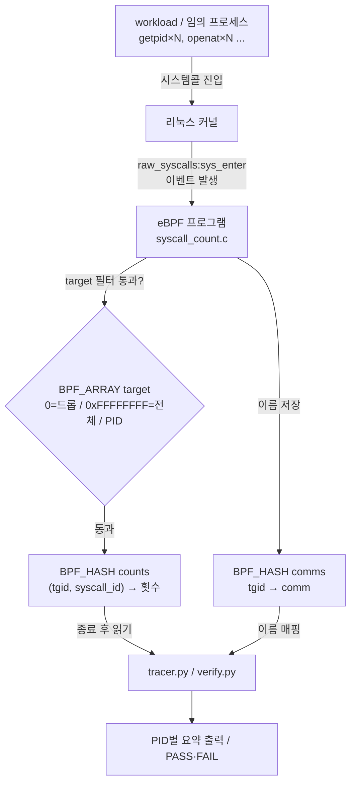
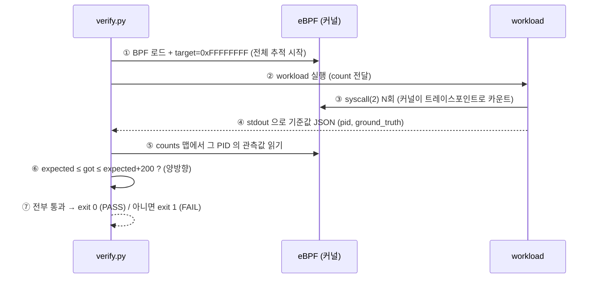

# 9주차 — 실습 ① 시스템콜 추적기
> 본 저장소의 `syscall-tracer` 프로젝트를 코드 한 줄씩 뜯어보며, "추적기가 정확하다"를 코드로 증명하는 법까지 배운다.
last_updated: 2026-06-11

> 🔰 **1학년·입문자: 두 갈래 길로 읽으세요.**
> - **🟢 돌려보기 트랙(누구나)**: [§5 직접 실행해 보기](#5-직접-실행해-보기)의 명령을 복붙해 추적기를 실제로 돌리고, PASS/숫자만 읽어도 이번 주 성취는 충분합니다. C 몰라도 됩니다.
> - **🔵 이해 트랙(C 아는 사람·심화)**: §2~4의 코드 한 줄씩 분석. C 가 낯설면 [C 미니부록](00b_준비_C언어_미니부록.md)을 먼저, 용어는 [용어 사전](00c_용어집_약어사전.md)에서.

지난 [8주차](08주차_BCC_입문_맵과_perf이벤트.md)에서 우리는 BCC 의 두 핵심 도구 — **BPF 맵**과 **perf 이벤트** — 를 배웠다. 이번 주는 그중 **맵(BPF_HASH/BPF_ARRAY)** 만으로 완결되는 첫 실전 프로젝트, **시스템콜 추적기**를 만든다. 핵심은 두 가지다.

1. `tracepoint:raw_syscalls:sys_enter` 에 eBPF 를 붙여 **(어떤 프로세스, 어떤 시스템콜) → 몇 번** 을 커널 공간에서 집계한다.
2. 그 추적이 **정말 빠짐없이 정확한지**를, 스스로 증명하는 **자기검증(self-test) 하네스**를 만든다.

두 번째가 이 주차의 진짜 주제다. "동작하는 것 같다"가 아니라 "동작함을 증명했다"로 가는 길을 배운다.

---

## 이번 주 학습 목표

- `raw_syscalls:sys_enter` 트레이스포인트가 무엇이고, 왜 시스템콜 추적의 표준 진입점인지 설명할 수 있다.
- `bpf_get_current_pid_tgid() >> 32` 가 왜 "사용자 관점의 PID"인지 안다.
- `BPF_HASH` 로 복합 키(struct)를 쓰고 `lookup_or_try_init` 으로 원자적 카운팅을 하는 패턴을 읽을 수 있다.
- `BPF_ARRAY` 를 **부착 직후 race 를 막는 필터 게이트**로 쓰는 설계 의도를 이해한다.
- 사용자 공간 Python 이 맵을 읽어 `syscall_name()` 으로 번호를 이름으로 바꾸고 PID별로 출력하는 흐름을 따라갈 수 있다.
- **검증 하네스가 왜 신뢰할 만한가** — 기준값의 비조작성, 커널/사용자 독립 교차검증, 스케일 불변성, 양방향(누락·과다) 검사 — 를 근거와 함께 설명할 수 있다.

---

## 1. 설계 개요

### 1.1 무엇을 만드는가

목표 한 줄: **"어떤 프로세스(PID)가 어떤 시스템콜을 몇 번 호출했는가"** 를 커널에서 집계해 PID별로 보여준다.

프로젝트는 네 개의 파일로 구성된다.

| 파일 | 공간 | 역할 |
|:-----|:----:|:-----|
| `bpf/syscall_count.c` | 커널 | 트레이스포인트에서 `(PID, 시스템콜) → 횟수` 해시맵 갱신 |
| `tracer.py` | 사용자 | 맵을 읽어 PID/이름 필터링, PID별 요약 출력 (실시간 CLI) |
| `workload.c` | 사용자 | **검증용**. 정해진 횟수만큼 `syscall(2)` 로 시스템콜 직접 호출, 기준값 JSON 출력 |
| `verify.py` | 사용자 | **검증 하네스**. 추적기 부착 → workload 실행 → 관측값과 기준값 비교 → PASS/FAIL |

### 1.2 왜 tracepoint + 맵인가

시스템콜 진입은 **초당 수만~수십만 번** 일어나는 고빈도 이벤트다. 이런 이벤트를 하나하나 사용자 공간으로 보내면(=perf 이벤트 스트리밍) 오버헤드가 폭발한다. 그래서 여기서는 **커널 안에서 카운터만 증가시키고(집계)**, 사용자 공간은 **끝나고 한 번에 맵을 읽어간다**. 이것이 "맵 집계" 패턴이고, 고빈도 이벤트에 적합하다.

> 대비: 다음 [10주차](10주차_실습2_네트워크_연결_추적기.md)의 TCP 연결 추적기는 **저빈도** 이벤트(연결 시도)라서 정반대로 **perf 이벤트 스트리밍**을 쓴다. 빈도가 부착 방식과 출력 방식을 결정한다.

`raw_syscalls:sys_enter` 는 **모든 시스템콜의 공통 진입점**을 잡는 단일 트레이스포인트다. 시스템콜마다 따로 붙일 필요 없이, 인자 `args->id` 로 어떤 시스템콜인지 구분한다. 커널이 공식 제공하는 안정적 ABI 이므로 커널 버전이 바뀌어도 잘 깨지지 않는다.

### 1.3 데이터 흐름



핵심은 **모든 집계가 커널 안에서 끝난다**는 점이다. 사용자 공간은 마지막에 맵 두 개(`counts`, `comms`)를 스냅샷으로 읽을 뿐이다.

---

## 2. eBPF 프로그램(`bpf/syscall_count.c`) 한 줄씩

전체 파일은 60여 줄로 짧다. 위에서부터 의미 단위로 끊어 본다.

### 2.1 헤더와 키 구조체

```c
#include <uapi/linux/ptrace.h>

// 집계 키: 어떤 프로세스(tgid)가 어떤 시스템콜(syscall_id)을 호출했는가
struct key_t {
    u32 tgid;
    u32 syscall_id;
};
```

- `key_t` 가 해시맵의 **복합 키**다. "PID별·시스템콜별"로 나눠 세려면 둘 다 키에 들어가야 한다. C 구조체를 그대로 맵 키로 쓸 수 있다는 점이 BCC 의 편리함이다.
- `u32` 두 개라 키 크기는 8바이트. 패딩 걱정이 없도록 같은 너비로 맞췄다.

```c
// comm(프로세스 이름)을 담는 고정 길이 래퍼 (TASK_COMM_LEN = 16)
struct comm_t {
    char name[16];
};
```

- 리눅스에서 프로세스 이름(comm)은 최대 16바이트다(`TASK_COMM_LEN`). 이를 별도 맵에 저장하는 이유는 **프로세스가 종료된 뒤에도 이름을 보여주기 위해서**다. 종료된 PID 는 `/proc/<pid>/comm` 으로 더 이상 조회할 수 없으니, 살아있을 때 커널에서 미리 받아 둔다.

### 2.2 맵 세 개 선언

```c
// (tgid, syscall_id) -> 호출 횟수
BPF_HASH(counts, struct key_t, u64);

// tgid -> 프로세스 이름.
BPF_HASH(comms, u32, struct comm_t);
```

- `BPF_HASH(이름, 키타입, 값타입)` 매크로가 커널 해시맵을 만든다. `counts` 는 카운터, `comms` 는 PID→이름 사전이다.

```c
// 사용자 공간에서 주입하는 필터.
//   target[0] == 0          : 아직 준비 안 됨 → 모두 드롭 (부착 직후 기본값)
//   target[0] == 0xFFFFFFFF  : 전체 추적
//   그 외                    : 해당 tgid 만 추적
BPF_ARRAY(target, u32, 1);
```

- 이 한 줄이 이 프로그램의 **가장 영리한 설계**다. 원소 1개짜리 배열을 **필터 게이트**로 쓴다.
- `BPF_ARRAY` 의 원소는 항상 **0으로 초기화**된다. 그리고 이 프로그램은 `target[0] == 0` 이면 **모두 드롭**한다.
- 왜 0을 드롭으로? BCC 는 `BPF(src_file=...)` 객체를 만드는 **그 순간 트레이스포인트를 곧바로 부착**한다. 사용자 공간이 "이 PID 만 보고 싶어"라는 필터 값을 쓰기 **직전의 아주 짧은 순간**에, 엉뚱한 프로세스의 시스템콜이 이미 들어와 섞일 수 있다. 기본값 0(드롭)으로 두면 그 race 윈도에서 들어온 이벤트가 자동으로 버려진다. 사용자 공간이 필터 값을 채워 넣어야 비로소 집계가 시작된다.

### 2.3 트레이스포인트 핸들러

```c
TRACEPOINT_PROBE(raw_syscalls, sys_enter) {
    u64 id = bpf_get_current_pid_tgid();
    u32 tgid = id >> 32;  // 상위 32비트가 TGID(= 사용자 관점의 PID)
```

- `TRACEPOINT_PROBE(범주, 이름)` 는 BCC 매크로로 트레이스포인트 핸들러를 정의한다. 이 함수는 **모든 시스템콜이 진입할 때마다** 커널 안에서 실행된다.
- `bpf_get_current_pid_tgid()` 는 64비트 값을 돌려준다. **상위 32비트 = TGID, 하위 32비트 = PID(커널 관점의 스레드 id)**. 우리가 일상적으로 "PID"라 부르는 것(예: `ps` 가 보여주는 값)은 사실 **TGID**다. 그래서 `>> 32` 로 상위 비트를 뽑는다. 멀티스레드 프로세스의 모든 스레드가 같은 TGID 를 공유하므로, "프로세스 단위" 집계가 된다.

```c
    int zero = 0;
    u32 *want = target.lookup(&zero);
    if (!want || *want == 0) {
        return 0;  // 준비 전(0) 이거나 맵 조회 실패 → 드롭
    }
    if (*want != 0xFFFFFFFF && *want != tgid) {
        return 0;  // 특정 PID 필터에 걸리지 않은 프로세스는 무시
    }
```

- `target.lookup(&zero)` 로 0번 인덱스의 필터 값을 읽는다. eBPF 검증기는 **맵 조회 결과가 NULL 일 수 있음**을 알기 때문에, `if (!want ...)` 로 NULL 검사를 **반드시** 해야 한다. 빼먹으면 프로그램 로드가 거부된다.
- `*want == 0` → 아직 사용자 공간이 필터를 안 채움 → 드롭(앞서 말한 race 방어).
- `*want != 0xFFFFFFFF && *want != tgid` → "전체(0xFFFFFFFF)도 아니고 내가 원한 PID 도 아니면" 버린다. 즉 특정 PID 추적 모드면 그 PID 외의 모든 이벤트가 여기서 걸러진다.

```c
    struct key_t key = {};
    key.tgid = tgid;
    key.syscall_id = args->id;  // raw_syscalls:sys_enter 의 시스템콜 번호
```

- `args->id` 가 **이번에 호출된 시스템콜의 번호**다. `args` 는 트레이스포인트가 제공하는 인자 구조체이고, `sys_enter` 의 필드 `id` 가 시스템콜 번호다. (예: arm64 에서 `getpid` 는 172번 식.)
- `struct key_t key = {};` 의 `= {}` 는 **0으로 완전 초기화**한다. 스택 쓰레기 값이 키에 섞이면 같은 (tgid, syscall) 이 다른 키로 갈라져 카운트가 어긋나므로 중요하다.

```c
    u64 init = 0;
    u64 *val = counts.lookup_or_try_init(&key, &init);
    if (val) {
        (*val)++;
    }
```

- `lookup_or_try_init(&key, &init)` 는 "키가 있으면 그 값의 포인터를, 없으면 `init`(=0)으로 새로 만들고 그 포인터를" 돌려주는 BCC 헬퍼다. 그래서 `(*val)++` 한 줄로 "처음이면 1, 이후엔 +1" 이 된다.
- 여기서도 `if (val)` NULL 검사는 필수다(맵이 가득 차 삽입 실패할 수 있음).
- 참고: 이 증가는 per-CPU 가 아니라 일반 해시맵이라 이론상 동시성 경합이 있을 수 있으나, 실측(아래 §4)에서 누락·과다가 고정 오차 안에 머물러 실용 정확도를 만족한다.

```c
    struct comm_t c = {};
    bpf_get_current_comm(&c.name, sizeof(c.name));
    comms.update(&tgid, &c);

    return 0;
}
```

- `bpf_get_current_comm(&c.name, sizeof(...))` 는 현재 실행 중인 태스크의 이름(comm)을 안전하게 복사하는 헬퍼다. 길이를 함께 넘겨 버퍼 오버런을 막는다.
- `comms.update(&tgid, &c)` 로 PID→이름 매핑을 갱신한다. 매번 덮어써도 비용이 작고, 살아있는 동안 이름을 확보하는 게 목적이다.
- `return 0;` — 트레이스포인트 핸들러는 항상 0을 반환한다.

> **요약**: 이 프로그램은 (1) 필터 게이트를 통과한 (2) 프로세스·시스템콜 키로 (3) 카운터를 원자적으로 올리고 (4) 이름을 곁들여 저장한다. 단 한 번의 사용자/커널 경계 전환도 없이 커널 안에서 끝난다.

---

## 3. 사용자 공간(`tracer.py`) 한 줄씩

`tracer.py` 는 실시간 추적 CLI 다. 검증이 아니라 **사람이 보기 위한** 출력을 만든다.

### 3.1 임포트와 필터 주입

```python
from bcc import BPF
from bcc.syscall import syscall_name

BPF_SOURCE = "bpf/syscall_count.c"
```

- `BPF` 가 C 소스를 컴파일·로드하는 진입점. `syscall_name` 은 **시스템콜 번호 → 이름** 변환 함수(예: `172 → b"getpid"`)로, BCC 가 아키텍처별 테이블을 들고 있다.

```python
def load_bpf(target_pid: int) -> BPF:
    bpf = BPF(src_file=BPF_SOURCE)
    # 부착 직후 기본값은 0(=드롭). 여기서 즉시 실제 필터 값으로 덮어쓴다.
    want = 0xFFFFFFFF if target_pid == 0 else target_pid
    bpf["target"][ctypes.c_int(0)] = ctypes.c_uint(want)
    return bpf
```

- `BPF(src_file=...)` 호출 즉시 트레이스포인트가 붙고, 이때 `target[0]` 은 0(드롭) 상태다.
- 바로 다음 줄에서 `target[0]` 을 채운다. `--pid` 미지정이면 `0xFFFFFFFF`(전체), 지정이면 그 PID. `ctypes.c_int(0)` 은 배열 인덱스, `ctypes.c_uint(want)` 은 값이다. C 와 정확히 같은 타입을 써야 맵에 올바르게 기록된다.
- 이 두 줄의 순서가 §2.2 에서 본 race 방어 설계와 짝을 이룬다.

### 3.2 맵 읽어 PID별로 정리

```python
def render(bpf, comm_filter, top):
    counts = bpf["counts"]
    comms  = bpf["comms"]

    name_of = {}
    for k, v in comms.items():
        name_of[k.value] = v.name.decode("utf-8", "replace").rstrip("\x00")
```

- `bpf["counts"]`, `bpf["comms"]` 로 커널 맵에 파이썬에서 접근한다. `.items()` 가 현재 스냅샷을 순회한다.
- `comms` 를 먼저 돌며 `tgid → 이름` 사전을 만든다. `rstrip("\x00")` 으로 16바이트 고정 버퍼 뒤의 널 패딩을 제거한다.

```python
    per_pid = defaultdict(dict)
    for k, v in counts.items():
        name = syscall_name(k.syscall_id).decode("utf-8", "replace")
        per_pid[k.tgid][name] = v.value
```

- `counts` 를 돌며 `k.syscall_id`(번호)를 `syscall_name()` 으로 이름으로 바꾼다. 결과를 `per_pid[tgid][이름] = 횟수` 로 쌓는다. 커널은 번호로만 다뤘고, 사람이 읽는 이름 변환은 사용자 공간 몫이다.

```python
    for tgid in sorted(per_pid, key=lambda p: -sum(per_pid[p].values())):
        comm = name_of.get(tgid, "?")
        if comm_filter and comm_filter not in comm:
            continue
        total = sum(per_pid[tgid].values())
        print(f"\n=== PID {tgid}  ({comm})  총 {total:,} 회 ===")
        ...
        rows = sorted(per_pid[tgid].items(), key=lambda kv: -kv[1])
        for name, cnt in rows[:top]:
            print(f"  {name:<20} {cnt:>12,}")
```

- PID 들을 **총 호출 수 내림차순**으로 정렬해, 시끄러운 프로세스가 먼저 보이게 한다.
- `--comm` 필터가 있으면 이름에 매칭 안 되는 PID 를 건너뛴다(여기서의 필터는 **출력 단계** 필터다 — 커널 단계 필터인 `target` 과 구분).
- 각 PID 안에서 시스템콜을 횟수 내림차순으로 `--top` 개만 보여준다.

### 3.3 메인 루프

```python
    start = time.time()
    while not stop["flag"]:
        time.sleep(0.2)
        if args.duration and (time.time() - start) >= args.duration:
            break
    ...
    render(bpf, args.comm, args.top)
```

- 추적은 **커널이 알아서** 한다. 사용자 공간은 그냥 `--duration` 동안 잠자며 기다리다가, 끝나면 `render()` 로 **한 번에** 맵을 읽는다. 이것이 §1.2 의 "집계 후 일괄 읽기" 패턴의 실제 모습이다.
- `SIGINT`(Ctrl-C) 핸들러가 `stop["flag"]` 를 세워 깔끔히 빠져나오게 한다.

---

## 4. 검증(self-test)의 원리

이제 이 주차의 진짜 핵심. **"추적기가 정확하다"를 어떻게 증명하나?** 답은 `workload.c` + `verify.py` 의 조합이다.

### 4.1 거짓말할 수 없는 기준값 — `workload.c`

```c
// 일반 libc 래퍼(open(3) 등)는 내부적으로 추가 시스템콜을 부를 수 있으므로,
// 검증의 기준값(ground truth)을 명확히 하기 위해 syscall(2) 로 커널을 직접 호출한다.
```

- 핵심 결정: `open(3)` 같은 **libc 래퍼를 쓰지 않고** `syscall(2)` 로 **커널을 직접** 호출한다. libc 래퍼는 내부적으로 부가 시스템콜을 부를 수 있어 "정확히 N번"이라는 기준값이 흐려진다. `syscall(SYS_getpid)` 는 딱 그 한 번의 시스템콜만 일으킨다.

```c
    for (long i = 0; i < n; i++) {
        syscall(SYS_getpid);
    }
    ...
    for (long i = 0; i < n; i++) {
        long fd = syscall(SYS_openat, AT_FDCWD, "/dev/zero", O_RDONLY);
        if (fd >= 0) {
            syscall(SYS_read, fd, buf, (size_t)1);
            syscall(SYS_close, fd);
        }
    }
```

- `getpid`/`getuid`/`getppid` 를 각 N회 — **인자 없는 단순 시스템콜**이라 노이즈가 거의 없어 관측값이 기준값과 거의 정확히 일치한다.
- 이어서 `openat → read → close` 워크플로를 N회 반복. 주석대로 **arm64 에는 `open(2)` 이 없고 `openat(2)` 만** 있어서 `openat` 을 직접 부른다(아키텍처 차이를 정확히 반영).

```c
    printf("{\"pid\": %ld, \"ground_truth\": {"
           "\"getpid\": %ld, \"getuid\": %ld, \"getppid\": %ld, "
           "\"openat\": %ld, \"read\": %ld, \"close\": %ld, \"write\": %ld}}\n",
           pid, n, n, n, n + 1, n, n + 1, n);
```

- 마지막에 **자기 PID 와 정확한 호출 횟수**를 JSON 한 줄로 출력한다. 여기서 `openat` 과 `close` 만 `n + 1` 인데, 이는 `/dev/null` 을 여닫는 한 번이 추가되기 때문이다(코드를 정확히 세어 박은 값). 이 숫자들은 **코드에 박힌 루프 횟수**이므로 조작 불가능한 정답(ground truth)이다.

### 4.2 양방향 비교 — `verify.py`

```python
    bpf = BPF(src_file=BPF_SOURCE)
    bpf["target"][ctypes.c_int(0)] = ctypes.c_uint(0xFFFFFFFF)  # 전체 추적

    # 추적기가 부착된 뒤에 workload 실행 → 시작 직후 시스템콜까지 모두 포착
    proc = subprocess.run([str(WORKLOAD_BIN), str(count)], capture_output=True, text=True, check=True)
    payload = json.loads(proc.stdout.strip())
    target_pid = payload["pid"]
    ground_truth = payload["ground_truth"]
```

- 순서가 중요하다. **먼저** 추적기를 부착(`target` 채움)하고 **그다음** workload 를 실행한다. 그래야 workload 가 시작 직후 부르는 시스템콜까지 한 건도 놓치지 않는다. (만약 workload 가 먼저 떴다면 부착 전 시스템콜은 영영 못 본다.)
- workload 의 stdout(JSON)을 파싱해 `target_pid` 와 기준값을 얻는다.

```python
    observed = defaultdict(int)
    for k, v in bpf["counts"].items():
        if k.tgid == target_pid:
            name = syscall_name(k.syscall_id).decode("utf-8", "replace")
            observed[name] = v.value
```

- 커널 맵에서 **그 PID 의** 카운트만 골라 관측값을 모은다. 시스템의 다른 프로세스에 휩쓸리지 않는 **음성 통제(negative control)** 의 첫 단계다.

```python
    slack = 200
    for name in sorted(ground_truth):
        expected = ground_truth[name]
        got = observed.get(name, 0)
        delta = got - expected
        ok = expected <= got <= expected + slack
```

- 판정식 `expected <= got <= expected + slack` 이 **양방향 검사**의 핵심이다.
  - **하한** `expected <= got`: 프로세스는 자신이 명시적으로 부른 것보다 **적게** 부를 수 없다. 관측이 기준보다 작으면 = **누락**(추적기가 놓침) → FAIL.
  - **상한** `got <= expected + slack`: 차이가 작은 **고정 상수(200)** 안이어야 한다. 관측이 과하게 크면 = **과다집계** → FAIL.
- `slack=200` 은 호출 횟수 N 과 **무관한 상수**다. 프로세스 시작 시 동적 링커/libc 가 부르는 소량의 부가 시스템콜(고정 비용)을 흡수하기 위한 여유다.

### 4.3 왜 이 검증이 신뢰할 만한가 (4가지 근거)

1. **기준값은 거짓말 불가.** workload 의 "3,000번"은 libc 래퍼의 추정치가 아니라 `syscall(2)` 루프에 박힌 횟수다. 정답이 코드에 명시되어 있다.

2. **독립된 두 경로의 교차검증.** 한쪽(workload)은 사용자 공간에서 "내가 N번 불렀다"고 세고, 다른 쪽(eBPF)은 커널 안에서 완전히 독립적으로 센다. 두 독립 측정이 일치한다는 건 양쪽 다 옳다는 강력한 증거다.

3. **스케일 불변성 — 코드로 강제.** 실제 캡처(`docs/10_결과보고서.md` §3.3–3.4)를 보자.

   3,000회 기준:
   ```text
   시스템콜      기준값      관측값      차이    판정
   close        3,001      3,006       +5    ✅ PASS
   openat       3,001      3,003       +2    ✅ PASS
   getppid      3,000      3,000       +0    ✅ PASS
   ```
   10,000회 기준:
   ```text
   close       10,001     10,006       +5    ✅ PASS
   openat      10,001     10,003       +2    ✅ PASS
   getppid     10,000     10,000       +0    ✅ PASS
   ```
   호출량을 3배 이상 늘렸는데 **"차이" 칼럼이 완전히 동일**(`close +5`, `openat +2`, `getppid +0`)하다. 만약 추적기가 일부를 놓친다면 차이는 호출 횟수에 **비례해 커져야** 한다. 차이가 고정이라는 것은 = 그 차이가 추적기 오류가 아니라 **libc/링커의 고정 시작 비용**이며, 추적기는 **단 한 건도 놓치지 않았음**을 뜻한다. 게다가 `verify.py` 의 상한 검사(`got <= expected + 200`)가 이를 **기계적으로** 강제한다 — 비례 오차가 생기면 N 을 키울 때 200을 반드시 넘어 자동 FAIL 된다. "눈대중"이 아니라 코드가 보증한다.

4. **양방향성.** 하한(누락 없음)과 상한(과다집계 없음)을 동시에 본다. 한쪽만 보면 "전부 0으로 세도 누락 0" 같은 허점이 생기는데, 양방향이라 그런 자명한 부정행위가 불가능하다.

### 4.4 검증 시퀀스



`verify.py` 는 마지막에 `sys.exit(run())` 으로 **PASS=0 / FAIL=1** 의 종료 코드를 돌려준다. CI 나 `make` 에서 자동 판정에 쓸 수 있다.

---

## 5. 직접 실행해 보기

VM 에 접속해 실행한다(eBPF 는 `sudo` 필요).

```bash
ssh ossca-ebpf
cd ~/ebpf-labs/projects/syscall-tracer

# (1) 자기검증 — 시스템콜당 3,000회
sudo python3 verify.py
```

기대 출력(요약):

```text
================================================================
  시스템콜 추적 검증 결과  (대상 PID = 3062, 호출 3,000회 기준)
================================================================
  시스템콜      기준값      관측값      차이    판정
  close        3,001      3,006       +5    ✅ PASS
  getpid       3,000      3,001       +1    ✅ PASS
  getppid      3,000      3,000       +0    ✅ PASS
  ...
  >>> 검증 통과: 추적기가 모든 대상 시스템콜을 정확히 포착했습니다. <<<
```

```bash
# (2) 횟수를 키워 스케일 불변성 확인
sudo python3 verify.py 10000

# (3) 실시간 추적 — 5초간 전체, 상위 6개
sudo python3 tracer.py --duration 5 --top 6
```

실시간 추적 기대 출력(`docs/10_결과보고서.md` §3.5 라이브 캡처):

```text
=== PID 3112  (python3)  총 57 회 ===
  시스템콜                  횟수
  bpf                       36
  clock_nanosleep           15
  write                      4

=== PID 691  (tart-guest-agen)  총 41 회 ===
  futex                     25
  nanosleep                 10
```

```bash
# (4) 특정 PID 만, 또는 이름 필터
sudo python3 tracer.py --pid 1234
sudo python3 tracer.py --comm nginx --top 10
```

종료 코드 확인:

```bash
sudo python3 verify.py; echo "exit code = $?"   # PASS 면 0
```

---

## 💡 핵심 요약

- `raw_syscalls:sys_enter` 단일 트레이스포인트로 **모든 시스템콜**을 잡고, `args->id` 로 종류를 구분한다.
- `bpf_get_current_pid_tgid() >> 32` = **TGID**(우리가 PID 라 부르는 값). 멀티스레드도 프로세스 단위로 묶인다.
- `BPF_HASH` + `lookup_or_try_init` 로 커널 안에서 **원자적 카운팅**. 고빈도 이벤트는 커널에서 집계하고 끝나서 일괄 읽는다.
- `BPF_ARRAY target` 의 **0=드롭** 기본값은 부착 직후의 **race 윈도를 막는** 의도된 설계다.
- 검증의 신뢰성은 네 기둥 위에 선다: **거짓말 불가한 기준값 · 커널/사용자 독립 교차검증 · 스케일 불변성 · 양방향(누락+과다) 검사**.

---

## ✍️ 연습문제

1. `bpf_get_current_pid_tgid()` 의 하위 32비트(`& 0xFFFFFFFF`)는 무엇인가? `>> 32` 와 무엇이 다른지, 멀티스레드 프로세스를 예로 설명하라.
2. `target[0]` 의 기본값이 0이고 그것이 "드롭"으로 처리되지 않았다고 가정하자. 어떤 잘못된 관측이 생길 수 있는지 구체적 시나리오로 써라.
3. `verify.py` 의 판정이 하한(`expected <= got`)만 검사하고 상한을 뺀다면, 어떤 종류의 추적기 버그를 놓치게 되는가?
4. `workload.c` 가 `open(3)` 대신 `syscall(SYS_openat, ...)` 을 쓰는 이유를 "기준값의 명확성" 관점에서 설명하라.
5. `slack` 을 200이 아니라 호출 횟수 N 에 비례(`0.01 * N`)하게 두면 무엇이 무너지는가?

---

## 🛠 실습 과제 (확장 과제 포함)

**기본**

1. `tracer.py` 를 실행해 자기 셸(`bash`)의 PID 를 찾아 `--pid` 로 추적하고, 어떤 시스템콜이 많은지 관찰하라.
2. `verify.py 50000` 을 돌려 "차이" 칼럼이 3,000회·10,000회와 같은지 확인하고, 그 의미를 한 문단으로 써라.

**확장**

3. **특정 시스템콜만 집계**: `syscall_count.c` 에 `BPF_ARRAY(want_syscall, u32, 1)` 를 추가하고, `args->id` 가 그 값일 때만 카운트하도록 필터를 더하라. `tracer.py` 에 `--syscall openat` 옵션을 붙여라.
4. **반환값/지연 측정**: `raw_syscalls:sys_exit` 트레이스포인트도 함께 붙여, `sys_enter` 시각을 `BPF_HASH(start, key, u64)` 에 `bpf_ktime_get_ns()` 로 저장하고 `sys_exit` 에서 빼서 **시스템콜 지연(ns)** 을 측정하라. `args->ret` 로 반환값도 같이 보고하라.
5. **검증 강화**: `verify.py` 에 "추적 안 했어야 할 시스템콜이 0이어야 한다"는 음성 통제 항목을 추가하라(예: workload 가 부르지 않은 `socket` 이 그 PID 에서 0인지).

---

## ✅ 자가점검 퀴즈

1. `raw_syscalls:sys_enter` 핸들러에서 호출된 시스템콜의 **번호**를 담은 필드는 무엇인가?
<details><summary>정답</summary>`args->id`. 트레이스포인트가 제공하는 인자 구조체 `args` 의 `id` 필드가 시스템콜 번호다. 사용자 공간에서 `syscall_name()` 으로 이름으로 바꾼다.</details>

2. `target[0] == 0` 일 때 핸들러가 `return 0` 으로 이벤트를 버리는 이유는?
<details><summary>정답</summary>BCC 는 BPF 객체 생성 시점에 트레이스포인트를 즉시 부착한다. 사용자 공간이 필터 값을 쓰기 직전의 짧은 race 윈도에 들어온 엉뚱한 이벤트를 버리기 위해, 기본값 0을 "아직 준비 안 됨 → 드롭"으로 둔다.</details>

3. `lookup_or_try_init(&key, &init)` 가 하는 일을 한 줄로.
<details><summary>정답</summary>키가 이미 있으면 그 값의 포인터를, 없으면 `init`(=0)으로 새 엔트리를 만들고 그 포인터를 돌려준다. 덕분에 `(*val)++` 한 줄로 "처음=1, 이후=+1" 카운팅이 된다.</details>

4. 검증에서 호출 횟수 N 을 3배로 늘렸는데 "차이" 칼럼이 그대로였다. 이것이 증명하는 바는?
<details><summary>정답</summary>차이가 N 에 비례하지 않고 고정 → 그 차이는 추적기의 누락이 아니라 프로세스 시작 시 libc/링커의 고정 부가 비용이며, 추적기는 한 건도 놓치지 않았음을 뜻한다.</details>

5. `verify.py` 가 추적기 부착 **후에** workload 를 실행하는 이유는?
<details><summary>정답</summary>workload 가 시작 직후 부르는 시스템콜까지 빠짐없이 포착하기 위해서다. 부착 전에 workload 가 떴다면 초기 시스템콜은 영영 관측되지 않는다.</details>

6. 판정식 `expected <= got <= expected + slack` 에서 상한이 검사하는 오류 유형은?
<details><summary>정답</summary>과다집계(같은 이벤트를 두 번 세거나 다른 프로세스 이벤트가 섞임). 하한은 누락을, 상한은 과다를 잡아 양방향으로 정확성을 보증한다.</details>

---

## 📚 더 읽을거리

- `bcc/syscall.py` — `syscall_name()` 의 아키텍처별 번호 테이블 구현.
- 리눅스 커널 `tracepoint` 문서: `Documentation/trace/tracepoints.rst`.
- `man 2 syscall` — `syscall(2)` 직접 호출과 libc 래퍼의 차이.
- 프로젝트 README: `projects/syscall-tracer/README.md`, 실측 보고서: `docs/10_결과보고서.md` §3·§5.

---

## ⏭ 다음 주 예고

[10주차](10주차_실습2_네트워크_연결_추적기.md)에서는 정반대 성격의 프로젝트, **TCP 연결 추적기**를 만든다. 이번 주가 *고빈도 이벤트를 tracepoint + 맵으로 집계*했다면, 다음 주는 *저빈도 이벤트(연결 시도)를 kprobe + perf 이벤트로 스트리밍*한다. 커널 함수 인자에서 목적지 IP·포트를 읽고, 바이트 오더를 다루고, "누가 어디로 접속하는가"를 실시간으로 본다. CNCF 의 Cilium·Falco 가 쓰는 바로 그 기법이다.
