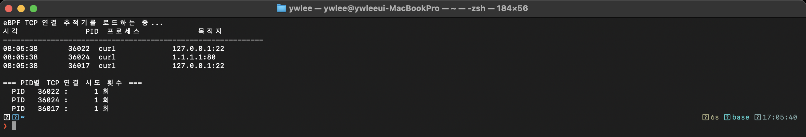
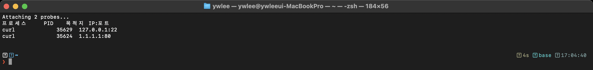

# 10주차 — 실습 ② 네트워크 연결 추적기
> 본 저장소의 `netflow-tracer` 프로젝트를 코드 한 줄씩 뜯어보며, kprobe + perf 이벤트로 "누가 어디로 접속하는가"를 실시간 스트리밍하고 음성 통제로 검증한다.
last_updated: 2026-06-11

> 🔰 **1학년·입문자: 두 갈래 길로 읽으세요.**
> - **🟢 돌려보기 트랙(누구나)**: [§5 직접 실행해 보기](#5-직접-실행해-보기)를 복붙해 "누가 어디로 접속하는지"가 실시간으로 찍히는 걸 직접 보세요. TCP·소켓·IP/포트 용어는 [용어 사전](00c_용어집_약어사전.md) 참고.
> - **🔵 이해 트랙(심화)**: §2~3 코드 분석. 특히 **바이트 오더(IP 가 왜 거꾸로 보이나)** 가 이번 주 최대 난관이니 [C 미니부록](00b_준비_C언어_미니부록.md)과 본문 §3.1 설명을 천천히 보세요. C 가 낯설면 미니부록 먼저.

지난 [9주차](09주차_실습1_시스템콜_추적기.md)에서는 **tracepoint + 맵 집계** 로 고빈도 시스템콜을 커널 안에서 세고 끝나서 일괄로 읽었다. 이번 주는 **정반대** 성격의 문제를 푼다. TCP 연결 시도는 시스템콜에 비하면 **저빈도**다(초당 수십~수백 건). 대신 각 이벤트가 **개별적으로 의미** 있다 — "PID 3827 이 127.0.0.1:22 로 접속했다" 같은 한 줄 한 줄이 정보다. 그래서 집계가 아니라 **이벤트 스트리밍**, 즉 **kprobe + perf 이벤트**를 쓴다.

이 기법은 그냥 학습용이 아니다. CNCF 의 **Cilium**(쿠버네티스 네트워킹)·**Falco**(보안 탐지)가 "어떤 프로세스가 어디로 접속하는가"를 잡는 바로 그 방식이다.

---

## 이번 주 학습 목표

- **kprobe** 가 tracepoint 와 어떻게 다른지, 임의 커널 함수에 동적으로 붙는다는 의미를 설명할 수 있다.
- `tcp_v4_connect(sk, uaddr, addr_len)` 의 인자에서 목적지 IP·포트를 `bpf_probe_read_kernel` 로 안전하게 읽는 패턴을 읽을 수 있다.
- 커널 6.17 헤더 충돌을 피하려고 첫 인자를 `void*` 로 받는 실전적 이유를 안다.
- **네트워크 바이트 오더 → 호스트 바이트 오더** 변환(`inet_ntoa(pack("<I"))`, `ntohs`)을 정확히 다룰 수 있다.
- `BPF_PERF_OUTPUT` + `open_perf_buffer` + `lost_cb` 로 이벤트를 스트리밍하고 누락을 보고하는 흐름을 이해한다.
- 검증의 **음성 통제(negative control)** — PID·목적지 동시 필터로 "그 프로세스가 그 목적지로" 보낸 것만 세는 설계 — 의 의미를 설명할 수 있다.

---

## 1. 설계 개요

### 1.1 무엇을 만드는가

목표: **"어떤 프로세스가 어느 목적지(IP:포트)로 TCP 연결을 시도하는가"** 를 실시간으로 잡는다.

| 파일 | 공간 | 역할 |
|:-----|:----:|:-----|
| `bpf/tcpconnect.c` | 커널 | `tcp_v4_connect` kprobe 에서 목적지 추출 → perf 이벤트 전송 |
| `netflow.py` | 사용자 | perf 버퍼 poll, 실시간 출력 + PID별 집계, 누락 보고 |
| `net_workload.c` | 사용자 | **검증용**. 127.0.0.1:port 로 N회 connect, 기준값 JSON |
| `verify_net.py` | 사용자 | **검증 하네스**. 로컬 리스너 + 추적기 + workload, PID·목적지 동시 필터 |

### 1.2 왜 kprobe + perf 이벤트인가 (9주차와의 대비)

| 항목 | 9주차 시스템콜 추적기 | 10주차 TCP 연결 추적기 |
|:-----|:----------------------|:-----------------------|
| 부착 방식 | **tracepoint** (안정 ABI) | **kprobe** (임의 커널 함수) |
| 이벤트 빈도 | 매우 높음 (초당 수만+) | 낮음 (초당 수십~수백) |
| 출력 방식 | **맵 집계** 후 일괄 읽기 | **perf 이벤트** 실시간 스트리밍 |
| 사용자 공간 | 끝나고 한 번 읽음 | 계속 poll 하며 한 건씩 받음 |
| 개별 이벤트 가치 | 낮음 (합계가 중요) | 높음 (누가 어디로, 가 정보) |

- **kprobe**: 커널 내부 함수(`tcp_v4_connect`)에 **동적으로** 후킹한다. tracepoint 는 커널이 미리 박아둔 안정 지점만 잡지만, kprobe 는 사실상 아무 함수나 잡을 수 있어 훨씬 강력하다. 대신 함수 시그니처가 커널 버전에 따라 바뀔 수 있어 깨지기 쉽다(그래서 §2 의 `void*` 트릭이 등장).
- **perf 이벤트**: 저빈도이고 각 이벤트가 개별로 중요하니, 커널이 발생 즉시 사용자 공간으로 **스트리밍**한다. 9주차처럼 카운터만 올리면 "누가 어디로"라는 정보가 사라진다.

### 1.3 데이터 흐름

```mermaid
%%{init: {"theme":"base","themeVariables":{"background":"#ffffff","primaryColor":"#ffffff","primaryBorderColor":"#000000","primaryTextColor":"#000000","secondaryColor":"#ffffff","secondaryBorderColor":"#000000","secondaryTextColor":"#000000","tertiaryColor":"#ffffff","tertiaryBorderColor":"#000000","tertiaryTextColor":"#000000","lineColor":"#000000","textColor":"#000000","mainBkg":"#ffffff","secondBkg":"#ffffff","clusterBkg":"#ffffff","clusterBorder":"#000000","edgeLabelBackground":"#ffffff","nodeBorder":"#000000","defaultLinkColor":"#000000","titleColor":"#000000","actorBkg":"#ffffff","actorBorder":"#000000","actorTextColor":"#000000","actorLineColor":"#000000","signalColor":"#000000","signalTextColor":"#000000","labelBoxBkgColor":"#ffffff","labelBoxBorderColor":"#000000","labelTextColor":"#000000","loopTextColor":"#000000","noteBkgColor":"#ffffff","noteBorderColor":"#000000","noteTextColor":"#000000","activationBkgColor":"#ffffff","activationBorderColor":"#000000","sequenceNumberColor":"#000000","cScale0":"#ffffff","cScale1":"#ffffff","cScale2":"#ffffff","cScale3":"#ffffff","cScale4":"#ffffff","cScale5":"#ffffff","cScale6":"#ffffff","cScale7":"#ffffff","cScale8":"#ffffff","cScale9":"#ffffff","cScale10":"#ffffff","cScale11":"#ffffff","cScaleLabel0":"#000000","cScaleLabel1":"#000000","cScaleLabel2":"#000000","cScaleLabel3":"#000000","cScaleLabel4":"#000000","cScaleLabel5":"#000000","cScaleLabel6":"#000000","cScaleLabel7":"#000000","cScaleLabel8":"#000000","cScaleLabel9":"#000000","cScaleLabel10":"#000000","cScaleLabel11":"#000000","pie1":"#ffffff","pie2":"#eeeeee","pie3":"#dddddd","pie4":"#cccccc","fontFamily":"Georgia, serif"}}}%%
flowchart LR
    P["프로세스<br/>net_workload / curl ..."] -->|connect(2)| K["커널: tcp_v4_connect()"]
    K -->|kprobe 진입| E["eBPF: tcpconnect.c"]
    E -->|sin_family 읽기| FAM{"AF_INET 인가?"}
    FAM -->|아니오| DROP["return 0 (무시)"]
    FAM -->|예| RD["bpf_probe_read_kernel<br/>daddr / dport / comm"]
    RD -->|perf_submit| PB["perf ring buffer"]
    PB -->|poll| U["netflow.py / verify_net.py"]
    U --> OUT["실시간 출력 + PID별 집계"]
    PB -.버퍼 가득.-> LOST["lost_cb → 누락 보고"]
```

---

## 2. eBPF 프로그램(`bpf/tcpconnect.c`) 한 줄씩

48줄짜리 짧은 프로그램이지만, **커널 메모리 안전 읽기**와 **바이트 오더**라는 두 함정이 모두 들어 있다.

### 2.1 헤더와 이벤트 구조체

```c
#include <uapi/linux/ptrace.h>
#include <linux/in.h>

#ifndef AF_INET
#define AF_INET 2
#endif

struct event_t {
    u32 pid;
    u32 daddr;   // 목적지 IPv4 (네트워크 바이트 오더)
    u16 dport;   // 목적지 포트 (네트워크 바이트 오더)
    char comm[16];
};

BPF_PERF_OUTPUT(events);
```

- `event_t` 가 **사용자 공간으로 보낼 한 건의 이벤트** 형식이다. PID, 목적지 IP, 목적지 포트, 프로세스 이름. 주석이 명시하듯 `daddr`/`dport` 는 **네트워크 바이트 오더**(빅엔디언)로 담긴다 — 나중에 사용자 공간에서 변환해야 한다.
- `BPF_PERF_OUTPUT(events)` 가 **perf 이벤트 채널**을 만든다. 9주차의 `BPF_HASH` 와 달리, 이건 "쌓는" 맵이 아니라 "흘려보내는" 통로다.

### 2.2 kprobe 시그니처와 void* 트릭

```c
// 참고: <net/sock.h> 는 최신 커널(6.17) 헤더와 BCC clang 사이에서 컴파일 충돌을
// 일으키고, 여기서는 struct sock 을 역참조하지 않으므로 첫 인자를 void* 로 받는다.

int kprobe__tcp_v4_connect(struct pt_regs *ctx, void *sk,
                           struct sockaddr *uaddr, int addr_len) {
```

- `kprobe__tcp_v4_connect` — BCC 네이밍 규칙. `kprobe__` 접두사 + 커널 함수명을 붙이면 BCC 가 자동으로 그 함수 **진입점**에 kprobe 를 건다.
- 함수 시그니처는 커널의 `tcp_v4_connect(struct sock *sk, struct sockaddr *uaddr, int addr_len)` 와 일치시킨다. eBPF 인자가 커널 함수 인자에 그대로 매핑된다.
- **핵심 트릭**: 첫 인자 `sk` 를 `struct sock*` 가 아니라 **`void*`** 로 받는다. 이유는 주석에 정확히 적혀 있다 — `<net/sock.h>` 를 포함하면 커널 6.17 헤더와 BCC 의 clang 이 충돌한다. **이 프로그램은 `sk` 를 역참조하지 않으므로** 타입을 알 필요가 없고, `void*` 로 받아 문제를 회피한다. 실전 eBPF 에서 흔한 헤더 호환성 우회법이다.
- 우리가 정작 필요한 건 두 번째 인자 `uaddr`(목적지 주소)뿐이다.

### 2.3 목적지 주소를 안전하게 읽기

```c
    struct sockaddr_in *sin = (struct sockaddr_in *)uaddr;

    u16 family = 0;
    bpf_probe_read_kernel(&family, sizeof(family), &sin->sin_family);
    if (family != AF_INET) {
        return 0;
    }
```

- `uaddr` 를 IPv4 주소 구조체 `sockaddr_in*` 으로 캐스팅한다. (`sockaddr` 은 범용, `sockaddr_in` 은 IPv4 전용.)
- **왜 `*sin` 을 직접 못 읽나?** eBPF 검증기는 커널 포인터를 프로그램이 직접 역참조하는 것을 **금지**한다(잘못된 주소면 커널이 죽으니까). 반드시 헬퍼 `bpf_probe_read_kernel(dst, size, src)` 로 **안전하게 복사**해야 한다. 페이지 폴트가 나도 헬퍼가 실패를 돌려줄 뿐 커널은 멀쩡하다.
- 먼저 `sin_family` 를 읽어 `AF_INET`(=2)인지 확인한다. 아니면 `return 0` 으로 버린다. `tcp_v4_connect` 라도 방어적으로 family 를 확인하는 게 안전하다.

```c
    struct event_t e = {};
    e.pid = bpf_get_current_pid_tgid() >> 32;
    bpf_probe_read_kernel(&e.daddr, sizeof(e.daddr), &sin->sin_addr.s_addr);
    bpf_probe_read_kernel(&e.dport, sizeof(e.dport), &sin->sin_port);
    bpf_get_current_comm(&e.comm, sizeof(e.comm));
```

- `>> 32` 로 TGID(=사용자 관점 PID)를 얻는다 — 9주차와 동일.
- 목적지 IP(`sin_addr.s_addr`)와 포트(`sin_port`)를 각각 `bpf_probe_read_kernel` 로 복사한다. 둘 다 **네트워크 바이트 오더 그대로** 담긴다 — 변환은 사용자 공간 몫(§3.1).
- `bpf_get_current_comm` 으로 프로세스 이름을 채운다.

```c
    events.perf_submit(ctx, &e, sizeof(e));
    return 0;
}
```

- `events.perf_submit(ctx, &e, sizeof(e))` 가 채워진 이벤트를 **perf 버퍼로 밀어 넣는다**. 이 순간 사용자 공간의 poll 루프가 깨어나 한 건을 받는다. 9주차의 "맵에 +1" 과 대비되는, 이번 주의 핵심 한 줄이다.

> **IPv4-only 범위**: 주석대로 이 예제는 `tcp_v4_connect` 만 잡는다. IPv6 아웃바운드(`tcp_v6_connect`, 예: `::1`)는 의도적으로 다루지 않는다 — 학습용 단순화다. 확장 과제에서 다룬다.

---

## 3. 사용자 공간(`netflow.py`) 한 줄씩

### 3.1 바이트 오더 변환 — 가장 헷갈리는 부분

```python
def ip_str(daddr: int) -> str:
    # daddr 는 네트워크 바이트 오더 값이 호스트(리틀엔디언) 정수로 담겨 있다.
    return socket.inet_ntoa(struct.pack("<I", daddr))
```

이 한 줄을 천천히 풀어 보자.

- 커널이 보낸 `daddr` 는 **네트워크 바이트 오더(빅엔디언)의 32비트 IP** 다. 그런데 파이썬은 그것을 그냥 정수(`int`)로 받았고, x86/arm 호스트는 리틀엔디언이다.
- `struct.pack("<I", daddr)` — `<I` 는 **리틀엔디언 unsigned int** 로 패킹하라는 뜻. 이렇게 하면 메모리 바이트 배열이 **원래 커널이 갖고 있던 네트워크 오더 바이트 순서 그대로** 복원된다. (정수의 비트는 그대로인데 바이트 나열 순서를 호스트 기준으로 되돌리는 것.)
- `socket.inet_ntoa(...)` 는 그 4바이트(네트워크 오더 가정)를 `"127.0.0.1"` 같은 문자열로 만든다.
- 결과적으로 `pack("<I")` + `inet_ntoa` 조합이 "호스트 정수로 담긴 네트워크 오더 IP"를 올바른 점-십진 문자열로 변환한다.

```python
    dport = socket.ntohs(e.dport)
```

- 포트는 `ntohs`(network-to-host short)로 변환한다. 네트워크 오더 16비트를 호스트 오더로 뒤집어 사람이 읽는 포트 번호(예: 22, 41785)를 얻는다.

> **함정 정리**: 커널은 IP·포트를 네트워크 오더로 준다. IP 는 `inet_ntoa(struct.pack("<I", daddr))`, 포트는 `ntohs(dport)`. 이걸 빠뜨리면 IP 가 거꾸로(`1.0.0.127`) 나오거나 포트가 엉뚱하게(22 대신 5632) 찍힌다.

### 3.2 perf 버퍼 콜백 등록

```python
    bpf = BPF(src_file=BPF_SOURCE)
    ...
    per_pid = defaultdict(int)
    lost = {"count": 0}

    def handle(_cpu, data, _size):
        e = bpf["events"].event(data)
        comm = e.comm.decode("utf-8", "replace")
        dport = socket.ntohs(e.dport)
        dst = f"{ip_str(e.daddr)}:{dport}"
        per_pid[e.pid] += 1
        ts = time.strftime("%H:%M:%S")
        print(f"{ts:<12} {e.pid:>7}  {comm:<16} {dst}")
```

- `handle` 이 **이벤트 한 건마다** 호출되는 콜백이다. `bpf["events"].event(data)` 가 raw 바이트를 `event_t` 구조체로 파싱한다.
- 위에서 본 변환을 적용해 `dst`(목적지 문자열)를 만들고, PID별 카운트를 올리며, 시각·PID·이름·목적지를 한 줄로 찍는다. **실시간** 출력이다.

```python
    def on_lost(n):
        # perf 버퍼가 가득 차 커널이 이벤트를 버린 경우 — 조용히 누락되지 않도록 알린다.
        lost["count"] += n

    bpf["events"].open_perf_buffer(handle, lost_cb=on_lost)
```

- `open_perf_buffer(handle, lost_cb=on_lost)` 로 콜백을 등록한다. `lost_cb` 가 중요하다 — perf 버퍼는 유한 링버퍼라, 사용자 공간이 poll 을 못 따라가면 커널이 이벤트를 **버린다**. 그 버려진 개수가 `on_lost(n)` 로 통보된다. 이를 보고하지 않으면 누락이 **조용히** 일어나 검증을 오염시킨다. 정직한 추적기는 누락을 숨기지 않는다.

### 3.3 poll 루프

```python
    start = time.time()
    while True:
        bpf.perf_buffer_poll(timeout=200)
        if args.duration and (time.time() - start) >= args.duration:
            break
```

- `perf_buffer_poll(timeout=200)` 이 버퍼를 200ms 동안 살펴 새 이벤트가 있으면 `handle` 을 호출한다. 9주차가 그냥 `sleep` 했던 것과 달리, 여기선 **계속 능동적으로 poll** 해야 이벤트를 받는다(스트리밍의 본질).

```python
    print("\n=== PID별 TCP 연결 시도 횟수 ===")
    for pid in sorted(per_pid, key=lambda p: -per_pid[p]):
        print(f"  PID {pid:>7} : {per_pid[pid]:>6} 회")
    if lost["count"]:
        print(f"\n  ⚠️ perf 버퍼 과부하로 누락된 이벤트: {lost['count']}개")
```

- 끝나면 PID별 합계를 내림차순으로 보여주고, 누락이 있었으면 경고를 찍는다.

---

## 4. 검증(self-test)의 원리 — 음성 통제

`verify_net.py` 의 검증 설계는 9주차보다 한 단계 더 정교하다. **음성 통제(negative control)** 를 PID·목적지 **동시** 필터로 구현한다.

### 4.1 거짓말 불가한 기준값 — `net_workload.c`

```c
    struct sockaddr_in addr;
    memset(&addr, 0, sizeof(addr));
    addr.sin_family = AF_INET;
    addr.sin_port = htons((uint16_t)port);
    inet_pton(AF_INET, "127.0.0.1", &addr.sin_addr);

    long ok = 0;
    for (long i = 0; i < n; i++) {
        int fd = socket(AF_INET, SOCK_STREAM, 0);
        if (fd < 0) continue;
        if (connect(fd, (struct sockaddr *)&addr, sizeof(addr)) == 0) ok++;
        close(fd);
    }
```

- **127.0.0.1 의 지정 포트**로 정확히 N회 `connect(2)` 한다. 목적지가 고정·명시적이라 기준값이 흐려질 여지가 없다.
- `htons(port)`, `inet_pton(...)` 으로 커널이 기대하는 네트워크 오더로 채운다.

```c
    printf("{\"pid\": %ld, \"dest\": \"127.0.0.1\", \"port\": %d, "
           "\"attempts\": %ld, \"connected\": %ld}\n",
           (long)getpid(), port, n, ok);
```

- 자기 PID, 목적지, **시도 횟수(attempts=N)** 와 성공 횟수를 JSON 으로 출력. `attempts` 는 코드에 박힌 루프 횟수라 조작 불가능한 정답이다. 연결 성공/실패와 무관하게 **시도는 항상 N번** 일어난다(추적기가 "시도" 시점을 잡기 때문).

### 4.2 음성 통제 — PID·목적지 동시 필터

```python
    srv, port, stop = start_listener()          # 127.0.0.1:임의포트 리스너
    bpf = BPF(src_file=BPF_SOURCE)              # 추적기 부착
    ...
    proc = subprocess.Popen([str(WORKLOAD_BIN), str(port), str(count)], ...)
    while proc.poll() is None:
        bpf.perf_buffer_poll(timeout=100)
    for _ in range(10):                          # 남은 이벤트 배수(drain)
        bpf.perf_buffer_poll(timeout=100)
```

- 순서: 리스너 가동 → 추적기 부착 → **그다음** workload 실행. 9주차와 같은 "부착 후 실행" 원칙.
- workload 종료 후에도 10회 더 poll 해서 **버퍼에 남은 이벤트를 모두 배수(drain)** 한다. 마지막 이벤트가 콜백 전에 잘리는 것을 막는다.

```python
    observed = 0
    other_dests = defaultdict(int)
    for pid, daddr, dport in events:
        if pid != target_pid:
            continue                              # ← PID 필터
        dst = f"{ip_str(daddr)}:{dport}"
        if dst == f"127.0.0.1:{port}":
            observed += 1                         # ← 목적지 필터
        else:
            other_dests[dst] += 1
```

- 이중 필터가 **음성 통제**의 핵심이다.
  - `if pid != target_pid: continue` — **그 workload PID 의** 연결만 본다. 시스템의 다른 프로세스(curl, ssh 등)가 동시에 접속해도 휩쓸리지 않는다.
  - `if dst == f"127.0.0.1:{port}"` — **그 목적지로의** 연결만 센다. 같은 PID 가 다른 곳에 접속했다면 `observed` 에 안 들어가고 `other_dests` 로 분리된다.
- 즉 "그 프로세스가 그 목적지로" 보낸 것만 정확히 분리해서 센다. 이것이 거짓 양성(false positive)을 차단하는 음성 통제다.

```python
    ok = observed >= attempts
    if ok:
        print("  ✅ 검증 통과: 추적기가 대상 목적지로의 모든 연결을 포착했습니다.")
        return 0
    print("  ❌ 검증 실패: 일부 연결이 누락되었습니다.")
    return 1
```

- 판정: **관측 ≥ 시도**. 추적기가 시도한 모든 연결을 빠짐없이 잡았는지 본다. `sys.exit(run())` 으로 PASS=0/FAIL=1.

### 4.3 음성 통제 도해

```mermaid
%%{init: {"theme":"base","themeVariables":{"background":"#ffffff","primaryColor":"#ffffff","primaryBorderColor":"#000000","primaryTextColor":"#000000","secondaryColor":"#ffffff","secondaryBorderColor":"#000000","secondaryTextColor":"#000000","tertiaryColor":"#ffffff","tertiaryBorderColor":"#000000","tertiaryTextColor":"#000000","lineColor":"#000000","textColor":"#000000","mainBkg":"#ffffff","secondBkg":"#ffffff","clusterBkg":"#ffffff","clusterBorder":"#000000","edgeLabelBackground":"#ffffff","nodeBorder":"#000000","defaultLinkColor":"#000000","titleColor":"#000000","actorBkg":"#ffffff","actorBorder":"#000000","actorTextColor":"#000000","actorLineColor":"#000000","signalColor":"#000000","signalTextColor":"#000000","labelBoxBkgColor":"#ffffff","labelBoxBorderColor":"#000000","labelTextColor":"#000000","loopTextColor":"#000000","noteBkgColor":"#ffffff","noteBorderColor":"#000000","noteTextColor":"#000000","activationBkgColor":"#ffffff","activationBorderColor":"#000000","sequenceNumberColor":"#000000","cScale0":"#ffffff","cScale1":"#ffffff","cScale2":"#ffffff","cScale3":"#ffffff","cScale4":"#ffffff","cScale5":"#ffffff","cScale6":"#ffffff","cScale7":"#ffffff","cScale8":"#ffffff","cScale9":"#ffffff","cScale10":"#ffffff","cScale11":"#ffffff","cScaleLabel0":"#000000","cScaleLabel1":"#000000","cScaleLabel2":"#000000","cScaleLabel3":"#000000","cScaleLabel4":"#000000","cScaleLabel5":"#000000","cScaleLabel6":"#000000","cScaleLabel7":"#000000","cScaleLabel8":"#000000","cScaleLabel9":"#000000","cScaleLabel10":"#000000","cScaleLabel11":"#000000","pie1":"#ffffff","pie2":"#eeeeee","pie3":"#dddddd","pie4":"#cccccc","fontFamily":"Georgia, serif"}}}%%
flowchart TD
    A["추적기가 본 전체 이벤트들<br/>(여러 PID, 여러 목적지)"] --> F1{"PID == target_pid ?"}
    F1 -->|아니오| X1["버림 (다른 프로세스의 연결)"]
    F1 -->|예| F2{"목적지 == 127.0.0.1:port ?"}
    F2 -->|아니오| X2["other_dests 로 분리<br/>(같은 PID, 다른 목적지)"]
    F2 -->|예| C["observed += 1"]
    C --> J{"observed ≥ attempts ?"}
    J -->|예| PASS["✅ PASS (exit 0)"]
    J -->|아니오| FAIL["❌ FAIL (exit 1)"]
```

### 4.4 왜 이 검증이 신뢰할 만한가

`docs/10_결과보고서.md` §4.2 의 실제 캡처(200회):

```text
============================================================
  TCP 연결 추적 검증 결과
============================================================
  대상 PID          : 3769
  목적지            : 127.0.0.1:41785
  workload 연결 시도: 200 회   (성공 200 회)
  추적기 관측       : 200 회
  추적기가 본 전체 이벤트 수: 200 개
============================================================
  ✅ 검증 통과: 추적기가 대상 목적지로의 모든 연결을 포착했습니다.
```

- **시도 200 = 관측 200**, 목적지(IP:포트)까지 정확히 일치 → PASS. 누락 0.
- **음성 통제의 힘**: "추적기가 본 전체 이벤트 수: 200 개"가 관측 200과 같다는 건, 그 시점에 다른 잡음 연결이 섞이지 않았음을 보여준다. 만약 다른 PID 연결이 섞였다면 전체 수가 200을 넘었을 것이고, 그래도 PID·목적지 필터가 그걸 걸러 `observed` 는 여전히 정확했을 것이다.
- **거짓말 불가 + 독립 교차검증**: 9주차와 같은 원리 — workload 는 코드에 박힌 횟수를 사용자 공간에서, eBPF 는 커널에서 독립적으로 센다.

---

## 5. 직접 실행해 보기

```bash
ssh ossca-ebpf
cd ~/ebpf-labs/projects/netflow-tracer

# (1) 자기검증 — 기본 50회 (또는 200회)
sudo python3 verify_net.py
sudo python3 verify_net.py 200
```

기대 출력은 §4.4 의 캡처와 같은 형식(시도 = 관측, PASS).

```bash
# (2) 실시간 추적 — 10초. 다른 창에서 접속을 발생시켜 본다.
sudo python3 netflow.py --duration 10
```

다른 터미널에서:

```bash
curl -s http://127.0.0.1:22 || true     # 닫힌/열린 포트로 접속 시도
```

실시간 추적 기대 출력(`docs/10_결과보고서.md` §4.3 라이브 캡처):

```text
시각          PID  프로세스          목적지
------------------------------------------------------------
01:55:48     3827  net_workload     127.0.0.1:22
01:55:48     3829  net_workload     127.0.0.1:65000
01:55:48     3833  curl             127.0.0.1:22

=== PID별 TCP 연결 시도 횟수 ===
  PID    3827 :      4 회
  PID    3829 :      3 회
  PID    3833 :      1 회
```

- `net_workload` 뿐 아니라 **별도의 `curl` 프로세스**가 보낸 연결까지 프로세스명·목적지·PID 로 구분해 잡는다.
- 닫힌 포트(65000)로의 *시도*도 성공/실패와 무관하게 포착된다 — kprobe 가 연결 **시도** 시점을 잡기 때문이다. (보안 관점에서 중요: 실패한 스캔 시도도 보인다.)

종료 코드:

```bash
sudo python3 verify_net.py; echo "exit code = $?"   # PASS 면 0
```

---

### 📸 실제 실행 화면 (터미널 스크린샷)

> 아래는 이 추적기를 **실제 터미널에서 실행한 화면을 그대로 캡처**한 것입니다. `curl` 등 서로 다른 프로세스의 연결이 PID·목적지별로 잡힙니다.





---

## 💡 핵심 요약

- **kprobe** = 임의 커널 함수에 동적 후킹. `kprobe__tcp_v4_connect` 로 연결 시도 시점을 잡는다.
- 커널 포인터는 직접 역참조 금지 → 반드시 **`bpf_probe_read_kernel`** 로 안전 복사. 첫 인자를 `void*` 로 받아 헤더 충돌을 우회한다.
- 커널이 주는 IP·포트는 **네트워크 바이트 오더** → IP 는 `inet_ntoa(struct.pack("<I", daddr))`, 포트는 `ntohs`.
- 저빈도·개별 의미 이벤트라 **perf 이벤트 스트리밍**(`BPF_PERF_OUTPUT` + `open_perf_buffer` + poll). `lost_cb` 로 누락을 정직하게 보고한다.
- 검증은 **음성 통제**: PID·목적지 동시 필터로 "그 프로세스가 그 목적지로" 보낸 것만 세어 거짓 양성을 차단하고, 관측 ≥ 시도로 누락 없음을 증명한다.

---

## ✍️ 연습문제

1. `tcp_v4_connect` 의 첫 인자를 `struct sock*` 대신 `void*` 로 받아도 되는 이유를 "이 프로그램이 `sk` 로 무엇을 하는가" 관점에서 설명하라.
2. `bpf_probe_read_kernel` 없이 `sin->sin_addr.s_addr` 를 직접 읽으면 어떤 일이 일어나는가? (검증기 단계와 런타임 단계로 나눠 서술)
3. `ip_str` 에서 `struct.pack("<I", daddr)` 의 `<I` 를 `>I`(빅엔디언)로 바꾸면 출력 IP 가 어떻게 달라지는가? 127.0.0.1 을 예로 들어라.
4. perf 버퍼가 가득 차 이벤트가 버려졌는데 `lost_cb` 를 등록하지 않았다면, 검증 결과가 어떻게 오염될 수 있는가?
5. 음성 통제에서 PID 필터만 쓰고 목적지 필터를 빼면, 어떤 거짓 양성이 검증을 통과시킬 수 있는가?

---

## 🛠 실습 과제 (확장 과제 포함)

**기본**

1. `netflow.py --duration 15` 를 켠 채 다른 창에서 `curl`·`ssh`·`ping`(TCP 아님 주의) 등을 시도해, 무엇이 잡히고 무엇이 안 잡히는지 표로 정리하라.
2. `verify_net.py 500` 을 돌려 시도 = 관측이 유지되는지, `lost` 가 0인지 확인하라.

**확장**

3. **IPv6 지원**: `kprobe__tcp_v6_connect` 핸들러를 추가하라. `sockaddr_in6` 에서 16바이트 `sin6_addr` 를 읽고 `event_t` 를 IPv6 도 담도록 확장(또는 family 필드 추가). `netflow.py` 에서 `socket.inet_ntop(AF_INET6, ...)` 로 출력하라.
4. **연결 수립 지연 측정**: `kretprobe__tcp_v4_connect`(반환 시점)도 붙여, 진입 시각을 `BPF_HASH(start, u32 pid, u64 ts)` 에 `bpf_ktime_get_ns()` 로 저장하고 반환 시 빼서 **connect 호출 지연(ns)** 을 이벤트에 실어라.
5. **목적지별 집계**: 사용자 공간에서 PID별이 아니라 `(목적지 IP:포트)별` 연결 수를 집계해, "가장 많이 접속된 목적지 Top N"을 출력하라.
6. **검증 강화**: workload 가 **두 목적지**(127.0.0.1:portA, 127.0.0.1:portB)로 각각 다른 횟수만큼 접속하게 하고, `verify_net.py` 가 둘을 분리해 각각 관측 = 시도인지 검사하도록 음성 통제를 확장하라.

---

## ✅ 자가점검 퀴즈

1. tracepoint 와 kprobe 의 가장 큰 차이는?
<details><summary>정답</summary>tracepoint 는 커널이 미리 박아둔 안정 ABI 지점만 잡는다. kprobe 는 임의의 커널 내부 함수에 동적으로 후킹할 수 있어 더 강력하지만, 함수 시그니처가 커널 버전에 따라 바뀔 수 있어 깨지기 쉽다.</details>

2. eBPF 에서 커널 포인터 `sin->sin_family` 를 읽을 때 `bpf_probe_read_kernel` 을 꼭 써야 하는 이유는?
<details><summary>정답</summary>검증기가 커널 포인터의 직접 역참조를 금지하기 때문이다. 잘못된 주소를 직접 읽으면 커널이 죽을 수 있으니, 페이지 폴트가 나도 안전하게 실패를 돌려주는 헬퍼로만 복사해야 한다.</details>

3. 커널이 보낸 `daddr`(네트워크 오더 정수)를 점-십진 문자열로 바꾸는 두 단계는?
<details><summary>정답</summary>`struct.pack("<I", daddr)` 로 호스트 정수를 원래 네트워크 오더 바이트 배열로 복원한 뒤, `socket.inet_ntoa(...)` 로 점-십진 문자열로 변환한다. 포트는 별도로 `socket.ntohs()`.</details>

4. 추적기가 "연결 성공"이 아니라 "연결 시도"를 잡는다는 점이 보안 관점에서 왜 유용한가?
<details><summary>정답</summary>`tcp_v4_connect` 진입 시점을 잡으므로 성공·실패와 무관하게 의도한 목적지를 알 수 있다. 닫힌 포트로의 실패한 스캔 시도까지 포착되어, 정찰·악성 행위를 탐지할 수 있다.</details>

5. 검증의 "음성 통제"가 구체적으로 무엇을 거르는가?
<details><summary>정답</summary>PID 필터로 대상 workload 외의 프로세스 연결을, 목적지 필터로 같은 PID 의 다른 목적지 연결을 거른다. 그래서 "그 프로세스가 그 목적지로" 보낸 것만 정확히 세어 거짓 양성을 차단한다.</details>

6. `verify_net.py` 가 workload 종료 후에도 perf 버퍼를 10회 더 poll 하는 이유는?
<details><summary>정답</summary>버퍼에 남은 마지막 이벤트들을 모두 배수(drain)하기 위해서다. 그러지 않으면 마지막 연결 이벤트가 콜백에 전달되기 전에 집계가 끝나 관측값이 시도값보다 작게 나올 수 있다.</details>

---

## 📚 더 읽을거리

- 리눅스 커널 `net/ipv4/tcp_ipv4.c` — `tcp_v4_connect` 의 실제 시그니처.
- `man 7 ip`, `man 3 inet_ntoa`, `man 3 byteorder` — 바이트 오더와 주소 변환.
- BCC 레퍼런스: `BPF_PERF_OUTPUT`, `perf_submit`, `open_perf_buffer`, `lost_cb`.
- Cilium·Falco 가 연결 추적에 kprobe/perf 를 쓰는 방식(공식 문서). 실측 보고서: `docs/10_결과보고서.md` §4·§5.

---

## ⏭ 다음 주 예고

지금까지(9~10주차)는 **BCC** 로 런타임에 C 를 컴파일해 eBPF 를 띄웠다. 편하지만, 실행 시 clang·커널 헤더가 필요해 프로덕션 배포가 무겁다. [11주차](11주차_libbpf와_CO-RE_프로덕션eBPF.md)에서는 **libbpf 와 CO-RE(Compile Once – Run Everywhere)** 로 넘어간다. 한 번 컴파일한 바이너리가 BTF 를 이용해 여러 커널에서 그대로 돈다 — 이번 주에 우리가 `void*` 트릭으로 회피했던 **헤더/커널 버전 호환성 문제를 근본적으로 푸는** 프로덕션 eBPF 의 표준이다.
