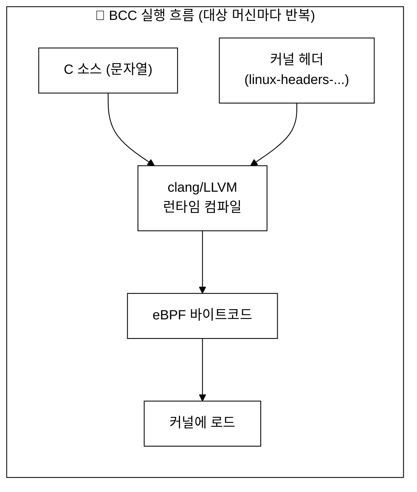
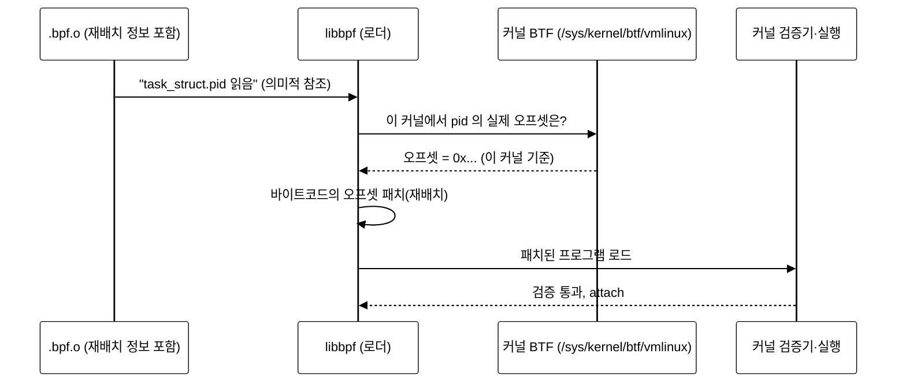
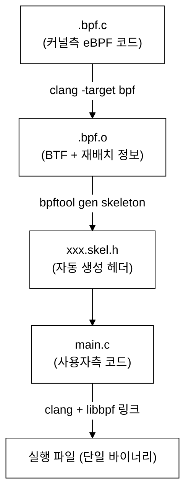
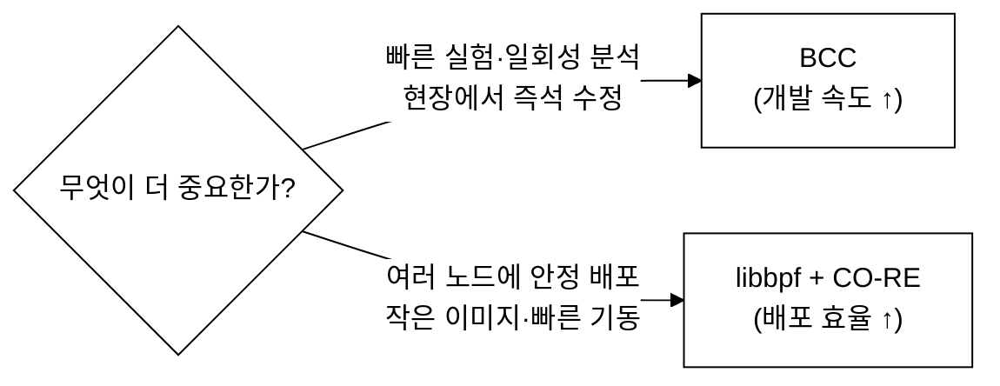

# 11주차 — libbpf 와 CO-RE: 프로덕션 eBPF
> BCC 로 배운 eBPF 를, 실제 서비스에 배포할 수 있는 "한 번 컴파일, 어디서나 실행" 형태로 끌어올리는 시간
last_updated: 2026-06-11

## 이번 주 학습 목표
- BCC 방식이 학습·프로토타이핑엔 좋지만 **프로덕션 배포**엔 왜 불리한지 설명할 수 있다.
- **libbpf** 가 무엇이고, BCC 와 어떤 점에서 다른지 이해한다.
- **CO-RE(Compile Once – Run Everywhere)** 가 BTF 재배치로 이식성을 어떻게 확보하는지 설명할 수 있다.
- **BPF 스켈레톤(skeleton)** 기반 libbpf 프로젝트의 빌드·로드 흐름(`.bpf.c` → 오브젝트 → 스켈레톤 → 실행파일)을 그릴 수 있다.
- `vmlinux.h`, **ring buffer** vs perf buffer 의 차이, `bpftool` 의 쓰임을 안다.
- VM 에서 `bpftool` 로 현재 커널에 로드된 eBPF 프로그램·맵을 직접 들여다본다.

---

## 1. 다시 보는 BCC: 좋았던 점과 한계

지난 주들까지 우리는 **BCC(BPF Compiler Collection)** 로 추적기를 만들었다. 파이썬 안에 C 문자열로 eBPF 코드를 넣고, 실행하면 바로 동작하는 그 편한 방식 말이다. 학습용으론 훌륭하다. 그런데 이걸 그대로 회사 서버 1,000대에 배포한다고 생각하면 문제가 보이기 시작한다.



BCC 의 구조적 한계를 정리하면 이렇다.

| 항목 | BCC 의 동작 | 왜 프로덕션에서 문제인가 |
|:---|:---|:---|
| **컴파일 시점** | 대상 머신에서 **실행할 때마다** 컴파일 | 배포한 서버 수만큼 컴파일 비용 발생 |
| **의존성** | 각 머신에 **clang/LLVM** 필요 | LLVM 은 무겁다(수백 MB). 컨테이너 이미지가 뚱뚱해진다 |
| **커널 헤더** | 대상 커널의 **헤더 패키지** 필요 | 헤더가 없거나 커널 버전과 안 맞으면 빌드 실패 |
| **메모리** | 런타임 컴파일에 상당한 RAM 사용 | 메모리가 빠듯한 노드에서 부담 |
| **시작 지연** | 컴파일 끝나야 추적 시작 | 부팅·기동이 느려짐 |

> 한 줄 요약: **BCC 는 "코드를 들고 가서 현장에서 굽는다."** 현장(=대상 머신)마다 오븐(clang)과 재료(헤더)가 필요하다.

그래서 등장한 것이 **"한 번 구워서, 구운 빵만 들고 다니자"** 는 접근, 바로 **libbpf + CO-RE** 다.

---

## 2. libbpf 란 무엇인가

**libbpf** 는 커널 소스 트리에서 함께 관리되는 **C 라이브러리**다. eBPF 오브젝트 파일을 커널에 **로드(load)**, **검증 통과**, **맵 생성**, **프로그램 attach** 하는 일을 담당한다. 핵심 차이는 다음과 같다.

- eBPF 코드를 **개발 머신에서 미리(ahead-of-time) 컴파일**해 둔 `.o`(ELF 오브젝트) 형태로 배포한다.
- 대상 머신에는 **clang 도, 커널 헤더도 필요 없다.** libbpf 와 미리 컴파일된 오브젝트만 있으면 된다.
- 사용자 공간 프로그램도 **C 로 작성**(러스트·Go 바인딩도 있음)되어, 의존성 작은 단일 실행 파일로 만들 수 있다.

```mermaid
%%{init: {"theme":"base","themeVariables":{"background":"#ffffff","primaryColor":"#ffffff","primaryBorderColor":"#000000","primaryTextColor":"#000000","secondaryColor":"#ffffff","secondaryBorderColor":"#000000","secondaryTextColor":"#000000","tertiaryColor":"#ffffff","tertiaryBorderColor":"#000000","tertiaryTextColor":"#000000","lineColor":"#000000","textColor":"#000000","mainBkg":"#ffffff","secondBkg":"#ffffff","clusterBkg":"#ffffff","clusterBorder":"#000000","edgeLabelBackground":"#ffffff","nodeBorder":"#000000","defaultLinkColor":"#000000","titleColor":"#000000","actorBkg":"#ffffff","actorBorder":"#000000","actorTextColor":"#000000","actorLineColor":"#000000","signalColor":"#000000","signalTextColor":"#000000","labelBoxBkgColor":"#ffffff","labelBoxBorderColor":"#000000","labelTextColor":"#000000","loopTextColor":"#000000","noteBkgColor":"#ffffff","noteBorderColor":"#000000","noteTextColor":"#000000","activationBkgColor":"#ffffff","activationBorderColor":"#000000","sequenceNumberColor":"#000000","cScale0":"#ffffff","cScale1":"#ffffff","cScale2":"#ffffff","cScale3":"#ffffff","cScale4":"#ffffff","cScale5":"#ffffff","cScale6":"#ffffff","cScale7":"#ffffff","cScale8":"#ffffff","cScale9":"#ffffff","cScale10":"#ffffff","cScale11":"#ffffff","cScaleLabel0":"#000000","cScaleLabel1":"#000000","cScaleLabel2":"#000000","cScaleLabel3":"#000000","cScaleLabel4":"#000000","cScaleLabel5":"#000000","cScaleLabel6":"#000000","cScaleLabel7":"#000000","cScaleLabel8":"#000000","cScaleLabel9":"#000000","cScaleLabel10":"#000000","cScaleLabel11":"#000000","pie1":"#ffffff","pie2":"#eeeeee","pie3":"#dddddd","pie4":"#cccccc","fontFamily":"Georgia, serif"}}}%%
flowchart LR
    subgraph DEV["🛠 개발 머신 (한 번만)"]
        direction TB
        BSRC[".bpf.c"] --> CC["clang -target bpf"]
        CC --> BOBJ[".bpf.o\n(BTF 포함)"]
    end
    subgraph PROD["🚀 프로덕션 노드 (어디서나)"]
        direction TB
        APP["실행 파일\n(libbpf 링크)"] --> KLOAD["커널에 로드\n+ BTF 재배치"]
    end
    BOBJ --> APP
    style DEV fill:#ffffff
    style PROD fill:#ffffff
```



"한 번 컴파일하면 그 오브젝트가 **여러 커널 버전에서 그대로 돈다**"는 게 핵심인데, 이걸 가능하게 하는 마법이 바로 CO-RE 다.

---

## 3. CO-RE 복습: 왜 한 번 컴파일이 가능한가

eBPF 프로그램은 커널 내부 구조체(예: `struct task_struct`)의 필드를 자주 읽는다. 그런데 **커널 버전마다 구조체 안의 필드 위치(오프셋)가 달라진다.** BCC 는 대상 머신에서 컴파일하니 그 머신의 헤더를 보고 정확한 오프셋을 박아 넣을 수 있었다. 하지만 미리 컴파일하면 "어느 커널에서 돌지" 모르므로 오프셋을 고정할 수 없다.

**CO-RE(Compile Once – Run Everywhere)** 는 이 문제를 이렇게 푼다.

1. 컴파일 시: "여기서 `task->pid` 를 읽는다" 같은 **재배치 정보(relocation)** 를 오브젝트에 같이 기록한다. 절대 오프셋이 아니라 "이 구조체의 이 필드"라는 **의미** 로 남긴다.
2. 로드 시: 대상 커널이 자기 자신의 타입 정보인 **BTF(BPF Type Format)** 를 제공한다(`/sys/kernel/btf/vmlinux`).
3. libbpf 가 둘을 대조해 **현재 커널에 맞는 실제 오프셋으로 다시 계산(재배치)** 한 뒤 로드한다.



> 핵심: **BTF 는 "이 커널의 구조체 도면"** 이다. CO-RE 는 그 도면을 로드 시점에 참고해 "한 번 구운 빵"을 현장 오븐 규격에 맞춰 미세 조정한다. 우리 VM(커널 6.17)은 **BTF 가 기본 활성화**되어 있어 `/sys/kernel/btf/vmlinux` 가 존재한다.

---

## 4. vmlinux.h — 커널 타입을 한 파일로

libbpf/CO-RE 프로젝트에서는 커널 헤더 수십 개를 `#include` 하는 대신, **`vmlinux.h`** 라는 단일 헤더를 쓴다. 이 파일은 커널 BTF 로부터 자동 생성되며, 커널이 아는 거의 모든 구조체 정의를 담고 있다.

```bash
# 현재 커널의 BTF 로부터 vmlinux.h 생성
sudo bpftool btf dump file /sys/kernel/btf/vmlinux format c > vmlinux.h
```

그러면 `.bpf.c` 에서는 이렇게만 쓰면 된다.

```c
#include "vmlinux.h"          // 커널 타입 전체 (BTF 기반)
#include <bpf/bpf_helpers.h>  // bpf_printk, SEC 매크로 등
#include <bpf/bpf_core_read.h> // CO-RE 안전 읽기 매크로
```

이 덕분에 "대상 머신에 커널 헤더 패키지가 있어야 한다"는 BCC 의 제약이 사라진다.

---

## 5. BPF 스켈레톤(skeleton): libbpf 의 핵심 편의장치

libbpf 를 처음 손으로 쓰면 맵 열기·프로그램 찾기·attach 를 일일이 호출해야 해서 번거롭다. 그래서 **`bpftool gen skeleton`** 이 `.bpf.o` 를 분석해 **C 헤더(스켈레톤)** 를 자동 생성한다. 사용자 프로그램은 이 헤더가 주는 깔끔한 함수들로 eBPF 를 다룬다.



스켈레톤이 만들어 주는 전형적인 사용 패턴은 **open → load → attach → 폴링 → destroy** 4단계다.

```c
#include "minimal.skel.h"   // bpftool 이 생성한 스켈레톤

int main(void) {
    struct minimal_bpf *skel;

    skel = minimal_bpf__open();          // ① 오브젝트 열기(아직 커널에 안 올림)
    minimal_bpf__load(skel);             // ② 커널에 로드(검증 + CO-RE 재배치)
    minimal_bpf__attach(skel);           // ③ 정의된 훅에 attach

    // ④ 여기서 ring buffer 등을 폴링하며 이벤트 수신 ...

    minimal_bpf__destroy(skel);          // ⑤ 정리(detach + 자원 해제)
    return 0;
}
```

> `open` 과 `load` 가 분리된 이유: 그 사이에 **맵 크기 조정, 전역 변수(설정값) 주입** 같은 커스터마이징을 끼워 넣을 수 있기 때문이다. 예를 들어 "추적할 PID" 를 전역 변수로 두고, load 전에 값을 박아 넣는 식이다.

---

## 6. ring buffer vs perf buffer: 이벤트를 사용자 공간으로

eBPF 프로그램이 커널에서 잡은 이벤트(예: "PID 1234 가 8.8.8.8 에 연결")를 사용자 공간으로 올려 보내려면 전용 맵이 필요하다. 전통적으로 **perf buffer** 를 썼지만, 커널 5.8 부터 **ring buffer(`BPF_MAP_TYPE_RINGBUF`)** 가 추가되어 요즘 프로덕션 표준이 됐다.

| 구분 | perf buffer (`BPF_MAP_TYPE_PERF_EVENT_ARRAY`) | ring buffer (`BPF_MAP_TYPE_RINGBUF`) |
|:---|:---|:---|
| 버퍼 구조 | **CPU 마다 별도** 버퍼 | **모든 CPU 가 공유**하는 단일 버퍼 |
| 이벤트 순서 | CPU 간 전역 순서 보장 어려움 | 전역 시간 순서 보존에 유리 |
| 메모리 효율 | CPU 수만큼 메모리 곱해짐 | 하나의 버퍼라 더 효율적 |
| 데이터 복사 | 예약 없이 복사 위주 | **reserve/commit** 로 복사 한 번 절약 가능 |
| 최소 커널 | 오래전부터 지원 | 5.8+ |

ring buffer 사용은 커널측에서 보통 이렇게 생겼다.

```c
struct {
    __uint(type, BPF_MAP_TYPE_RINGBUF);
    __uint(max_entries, 256 * 1024);   // 256 KB
} events SEC(".maps");

SEC("kprobe/tcp_v4_connect")
int trace_connect(struct pt_regs *ctx) {
    struct event *e;
    e = bpf_ringbuf_reserve(&events, sizeof(*e), 0);  // 공간 예약
    if (!e) return 0;
    e->pid = bpf_get_current_pid_tgid() >> 32;
    bpf_ringbuf_submit(e, 0);                           // 제출
    return 0;
}
```

> 우리 10주차 실습②(netflow-tracer)는 BCC 위에서 perf buffer 류로 이벤트를 올렸다. libbpf 로 다시 쓴다면 같은 추적기를 ring buffer 로 만들어 **clang 없는 단일 바이너리**로 배포할 수 있다 — 이것이 "프로덕션화"의 실제 모습이다.

---

## 7. bpftool: eBPF 의 만능 점검 도구

**`bpftool`** 은 커널에 로드된 eBPF 프로그램·맵·링크를 들여다보고 조작하는 공식 CLI 다. 디버깅·운영에서 매일 쓰는 도구라 익혀 두면 좋다.

| 명령 | 하는 일 |
|:---|:---|
| `bpftool prog show` | 로드된 모든 eBPF **프로그램** 목록(ID, 타입, 이름) |
| `bpftool map show` | 모든 eBPF **맵** 목록(ID, 타입, 키/값 크기) |
| `bpftool prog dump xlated id N` | 프로그램 N 의 (검증기 통과 후) 바이트코드 보기 |
| `bpftool map dump id N` | 맵 N 의 내용 덤프 |
| `bpftool gen skeleton xxx.bpf.o` | 스켈레톤 헤더 생성 |
| `bpftool btf dump file ... format c` | BTF 로부터 `vmlinux.h` 생성 |
| `bpftool prog show --json | jq` | JSON 출력(스크립트·자동화에 유용) |

---

## 8. BCC vs libbpf: 언제 무엇을 쓰나

둘은 우열이 아니라 **상황에 맞는 도구**다.



| 비교 항목 | BCC | libbpf + CO-RE |
|:---|:---|:---|
| 컴파일 시점 | 대상 머신 런타임 | 개발 머신에서 한 번 |
| 대상 머신 의존성 | clang/LLVM + 커널 헤더 | (사실상) 없음 |
| 배포물 크기 | 큼(LLVM 포함) | 작음(단일 바이너리) |
| 기동 속도 | 느림(컴파일 대기) | 빠름 |
| 커널 이식성 | 머신마다 재컴파일로 해결 | BTF 재배치로 한 오브젝트 |
| 개발 편의성 | 매우 높음(파이썬) | 진입장벽 있음(C/스켈레톤) |
| 대표 사용처 | 학습, 애드혹 디버깅 | Cilium, Tetragon 등 프로덕션 |

> 실무에서는 **BCC 로 프로토타이핑 → libbpf 로 프로덕션화** 하는 흐름이 흔하다.

---

## 9. 전형적인 libbpf 프로젝트 구조

```text
myprobe/
├── src/
│   ├── myprobe.bpf.c     # 커널측 eBPF 코드 (vmlinux.h 사용)
│   ├── myprobe.h         # 커널·사용자 공유 구조체(event 정의 등)
│   └── myprobe.c         # 사용자측 코드 (스켈레톤 사용)
├── vmlinux.h             # BTF 로부터 생성 (또는 빌드 시 생성)
├── Makefile              # clang → .o → skeleton → 실행파일
└── (libbpf 서브모듈/패키지)
```

빌드 단계는 앞 그림 그대로다: `myprobe.bpf.c` → `myprobe.bpf.o` → `myprobe.skel.h` → `myprobe.c` 와 함께 링크 → 실행 파일.

---

## 🛠 실습 과제 — bpftool 로 커널 속 eBPF 들여다보기 (libbpf 맛보기)

> VM 접속: `ssh ossca-ebpf` (Ubuntu 24.04, 커널 6.17, libbpf/bpftool/BTF 준비됨)

### 과제 A. 현재 로드된 프로그램·맵 관찰 (필수)

먼저 bpftrace 같은 도구로 추적기를 하나 띄워 두면 관찰거리가 생긴다. 별도 터미널에서:

```bash
# 터미널 1: 간단한 추적기를 띄워 둔다 (관찰 대상 생성)
sudo bpftrace -e 'kprobe:tcp_v4_connect { printf("%s\n", comm); }'
```

```bash
# 터미널 2: 커널에 어떤 eBPF 가 올라가 있는지 본다
sudo bpftool prog show          # 로드된 프로그램 목록 (ID/타입/이름)
sudo bpftool map show           # 맵 목록 (타입/키·값 크기/엔트리)

# 관심 가는 프로그램 ID 를 골라 자세히
sudo bpftool prog show id <ID>
sudo bpftool prog dump xlated id <ID> | head -30   # 검증 통과 바이트코드

# JSON 으로도 출력해 보기
sudo bpftool prog show --json | head -40
```

**관찰 질문:** ① `prog show` 에 보이는 프로그램의 `type` 은 무엇인가(kprobe?)? ② `map show` 에서 ring buffer/perf 류 맵이 보이는가? ③ 프로그램 하나가 어떤 맵을 참조하는지 추적해 보자(`prog show id <ID>` 의 `map_ids`).

### 과제 B. BTF 와 vmlinux.h 확인 (필수)

```bash
ls -l /sys/kernel/btf/vmlinux          # BTF 존재 확인
sudo bpftool btf dump file /sys/kernel/btf/vmlinux format c > /tmp/vmlinux.h
wc -l /tmp/vmlinux.h                    # 생성된 헤더 줄 수(수만 줄일 것)
grep -m1 "struct task_struct {" /tmp/vmlinux.h && echo "task_struct 정의 발견!"
```

> 이 한 파일이 "커널 헤더 패키지 없이도 모든 커널 타입을 쓸 수 있게" 해 준다는 점을 직접 확인하라.

### 과제 C. (도전) libbpf 예제 빌드 맛보기 (선택)

여건이 되면 `libbpf-bootstrap` 같은 공개 템플릿을 받아 `minimal` 또는 `bootstrap` 예제를 빌드해, 위 빌드 파이프라인(.bpf.c → .o → skel.h → 실행파일)을 눈으로 확인한다.

```bash
git clone --recurse-submodules https://github.com/libbpf/libbpf-bootstrap
cd libbpf-bootstrap/examples/c
make minimal          # 빌드 후 sudo ./minimal 로 실행
# 빌드 산출물에서 .bpf.o 와 *.skel.h 가 생기는 것을 확인
ls *.skel.h *.bpf.o 2>/dev/null
```

> 빌드가 막혀도 괜찮다. 핵심은 **"개발 머신에서 한 번 컴파일된 오브젝트 + 스켈레톤"** 이라는 구조를 체감하는 것이다.

---

## 💡 핵심 요약
- **BCC** 는 대상 머신에서 매번 컴파일 → clang/헤더/메모리 의존, 배포에 불리.
- **libbpf** 는 미리 컴파일한 `.bpf.o` 를 배포하고, 대상 머신엔 clang/헤더가 필요 없다.
- **CO-RE** 는 컴파일 시 남긴 재배치 정보 + 로드 시 커널 **BTF** 를 대조해 오프셋을 맞춰 "한 번 컴파일, 어디서나 실행"을 실현한다.
- **vmlinux.h** 는 BTF 로 생성한 단일 커널 타입 헤더.
- **스켈레톤** 은 `bpftool gen skeleton` 으로 만들어 `open→load→attach→destroy` 패턴을 쉽게 한다.
- **ring buffer(RINGBUF)** 는 공유 버퍼·전역 순서·메모리 효율로 perf buffer 를 대체하는 현대적 선택.
- **bpftool** 로 로드된 프로그램·맵을 점검한다.

---

## ✍️ 연습문제
1. 동료가 "BCC 로 잘 도는데 왜 libbpf 로 바꾸냐"고 묻는다. 1,000대 노드 배포 관점에서 세 가지 이유를 들어 설득해 보라.
2. CO-RE 가 없다면, 미리 컴파일된 eBPF 오브젝트가 다른 커널 버전에서 어떻게 깨질 수 있는지 `struct task_struct` 의 필드 오프셋을 예로 설명하라.
3. 어떤 추적기는 "CPU 간 정확한 이벤트 순서"가 중요하고, 다른 추적기는 "메모리 절약"이 중요하다. perf buffer 와 ring buffer 중 각각 무엇을 고르겠는가? 근거를 들어라.
4. libbpf 에서 `open` 과 `load` 를 분리해 둔 설계 덕에 가능한 커스터마이징을 두 가지 적어라.
5. 10주차 netflow-tracer 를 libbpf 로 포팅한다고 할 때, 바뀌어야 할 파일 구성과 빌드 단계를 스케치하라.

---

## ✅ 자가점검 퀴즈
1. CO-RE 가 로드 시점에 참고하는, 대상 커널의 타입 정보를 담은 형식의 이름은?
<details><summary>정답</summary>BTF(BPF Type Format). 보통 <code>/sys/kernel/btf/vmlinux</code> 에서 제공된다.</details>

2. libbpf 방식이 대상 머신에서 더 이상 요구하지 않는 두 가지 의존성은?
<details><summary>정답</summary>clang/LLVM 컴파일러와 커널 헤더 패키지. 미리 컴파일된 오브젝트를 배포하기 때문이다.</details>

3. `.bpf.o` 로부터 사용자 프로그램이 쓸 C 헤더를 생성하는 명령은?
<details><summary>정답</summary><code>bpftool gen skeleton xxx.bpf.o > xxx.skel.h</code></details>

4. ring buffer 가 perf buffer 와 다른 가장 큰 구조적 차이는?
<details><summary>정답</summary>perf buffer 는 CPU 마다 별도 버퍼를 두지만, ring buffer 는 모든 CPU 가 공유하는 단일 버퍼를 쓴다(전역 순서·메모리 효율 우위).</details>

5. 스켈레톤 사용 패턴의 네 단계를 순서대로 말하라.
<details><summary>정답</summary>open → load → attach → (폴링) → destroy.</details>

6. `vmlinux.h` 는 무엇으로부터 어떻게 만들어지는가?
<details><summary>정답</summary>커널 BTF 로부터 <code>bpftool btf dump file /sys/kernel/btf/vmlinux format c</code> 로 생성한다. 커널 타입 전체를 담은 단일 헤더다.</details>

---

## 📚 더 읽을거리
- libbpf 공식 리포지토리와 문서 (커널 소스 트리 `tools/lib/bpf`).
- `libbpf-bootstrap` — libbpf 프로젝트 시작 템플릿 모음.
- bpftool 매뉴얼(`man bpftool`, `man bpftool-prog`, `man bpftool-map`).
- Brendan Gregg, *BPF Performance Tools* — BCC/bpftrace 와 libbpf 의 위치.
- 커널 문서: BPF CO-RE, BTF 관련 문서.

---

## ⏭ 다음 주 예고
다음 [12주차](12주차_eBPF_네트워킹_XDP_tc_Cilium.md)에서는 eBPF 를 **네트워킹**에 쓴다. 패킷이 NIC 에서 앱까지 오는 경로 위 어디에 eBPF 훅(XDP·tc)이 있는지, 그리고 쿠버네티스의 **Cilium** 이 어떻게 iptables 를 대체하는지 본다. 우리 실습②(프로세스별 TCP 연결 추적)가 사실은 이 거대한 세계의 "축소판 맛보기"였다는 점도 연결한다.
