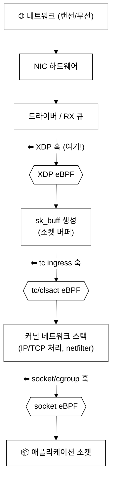
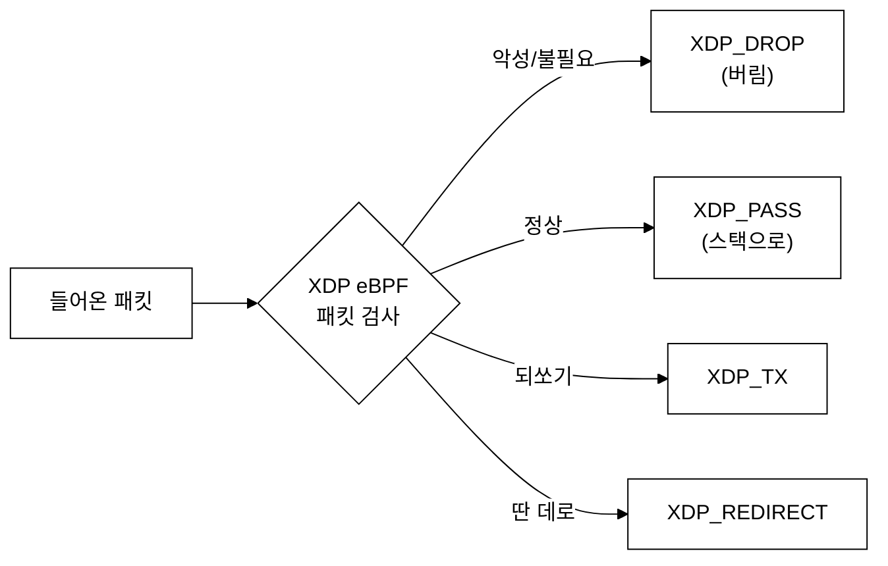
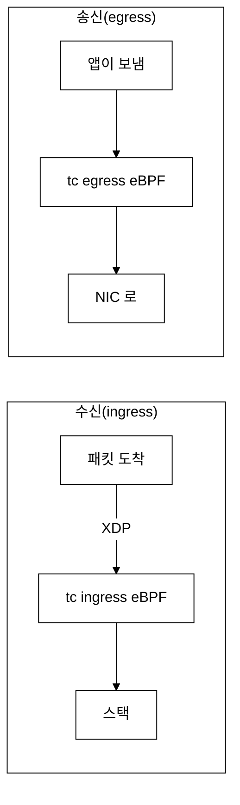
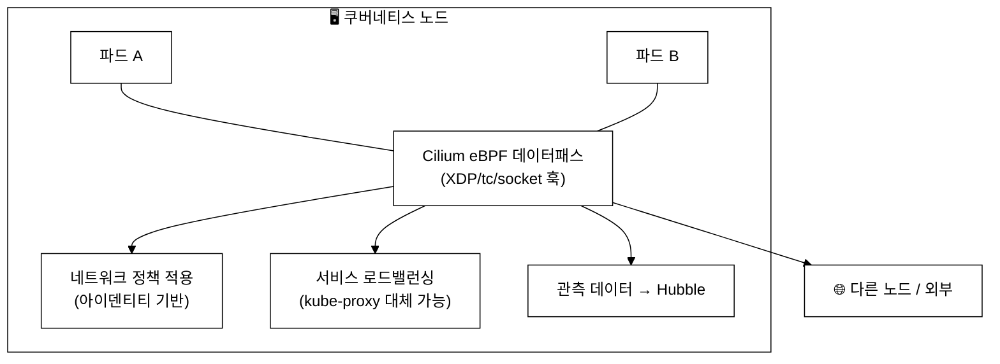
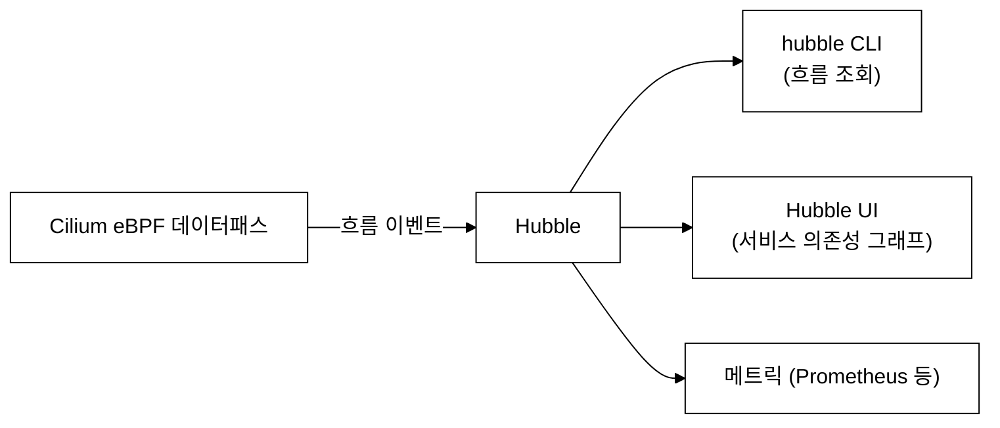
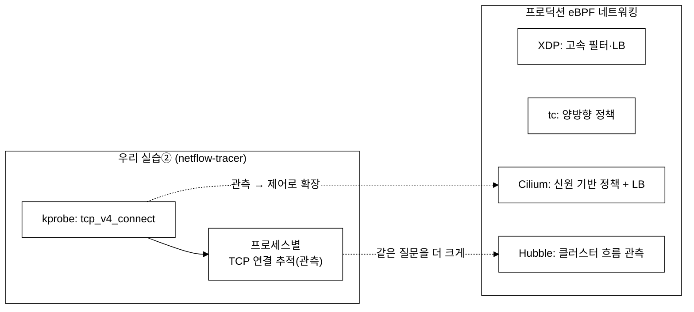
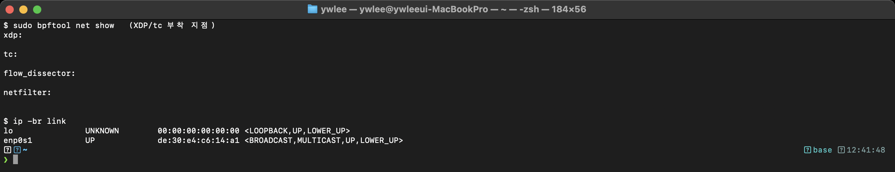
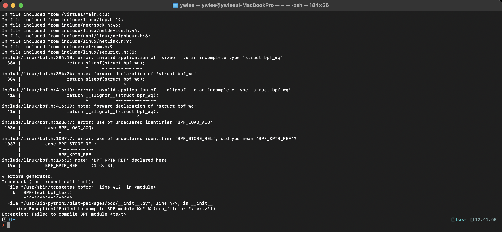

# 12주차 — eBPF 네트워킹: XDP·tc·Cilium
> 패킷이 NIC 에서 앱까지 오는 길목마다 eBPF 가 어떻게 끼어들어 거르고·바꾸고·돌려보내는지, 그리고 그 위에 선 Cilium 생태계
last_updated: 2026-06-11

## 이번 주 학습 목표
- 패킷이 **NIC → 커널 네트워크 스택 → 애플리케이션** 으로 오는 경로와, 그 위의 eBPF 훅 위치를 설명할 수 있다.
- **XDP**(드라이버 최전선)가 왜 빠른지, 그리고 `DROP/PASS/TX/REDIRECT` 동작과 대표 용도(DDoS 방어·로드밸런싱)를 이해한다.
- **tc/clsact eBPF** 가 ingress/egress 에서 무엇을 할 수 있는지, XDP 와의 차이를 안다.
- **소켓·cgroup 훅**의 쓰임을 개념적으로 안다.
- **Cilium** 이 쿠버네티스 CNI 로서 하는 일(iptables 대체, 아이덴티티 기반 정책, 서비스 로드밸런싱)과 **Hubble** 관측을 일반적으로 알려진 수준에서 설명한다.
- 우리 실습②가 이 네트워킹 세계의 "축소판"이었음을 연결해 이해한다.

---

## 1. 패킷의 여정: NIC 에서 앱까지

웹 요청 하나가 도착하면, 그 패킷은 여러 단계를 거쳐 애플리케이션에 닿는다. 핵심은 **"위로 올라갈수록 정보는 풍부해지지만, 처리 비용도 커진다"** 는 점이다.



- **XDP 훅**: 패킷이 막 들어와 아직 `sk_buff`(커널의 무거운 패킷 표현)가 만들어지기 **전**, 드라이버 레벨에서 동작한다. 가장 빠르지만, 다룰 수 있는 정보는 원시 패킷(raw frame)뿐이다.
- **tc 훅**: `sk_buff` 가 만들어진 **후**라 메타데이터가 풍부하고 ingress/egress 양쪽에 붙는다. XDP 보다 약간 뒤·약간 무겁지만 더 많은 일을 한다.
- **socket/cgroup 훅**: 스택 거의 끝, 소켓·프로세스 단위 제어에 쓴다.

> 비유: XDP 는 **건물 정문 경비**(빠르게 들여보낼지 말지만 판단), tc 는 **로비 안내데스크**(이미 입장한 사람의 서류를 보고 세밀히 처리).

---

## 2. XDP: 드라이버 최전선의 초고속 훅

**XDP(eXpress Data Path)** 는 패킷이 들어오자마자, 커널이 무거운 작업을 하기 전에 eBPF 프로그램을 실행한다. 그래서 **초당 수백만~수천만 패킷**급 처리에 쓰인다. XDP 프로그램은 판단 결과로 다음 중 하나의 **액션 코드**를 반환한다.

| 반환값 | 의미 | 대표 용도 |
|:---|:---|:---|
| `XDP_DROP` | 패킷을 즉시 버림 | **DDoS 방어**(악성 트래픽을 스택 진입 전에 폐기) |
| `XDP_PASS` | 정상 경로로 통과 | 일반 트래픽 |
| `XDP_TX` | 받은 인터페이스로 **되쏨** | 빠른 응답·바운스 |
| `XDP_REDIRECT` | 다른 인터페이스/CPU/소켓으로 전달 | **로드밸런싱**, 고속 포워딩, AF_XDP |
| `XDP_ABORTED` | 오류(추적용) | 디버깅 |



XDP 가 빠른 이유는 명확하다. **악성 트래픽을 `sk_buff` 생성 같은 비싼 작업 이전에 버리기** 때문이다. 같은 패킷을 iptables 로 막으면 이미 스택 깊숙이 들어온 뒤라 비용이 훨씬 크다. 그래서 대규모 인프라의 **DDoS 방어·L4 로드밸런서**가 XDP 로 구현되곤 한다.

> XDP 에는 드라이버가 지원하는 **네이티브 모드**, 일반 경로의 **제네릭(SKB) 모드**, NIC 가 직접 도는 **오프로드 모드** 등이 있다. 성능은 네이티브 > 제네릭 순이며, 모드 지원은 NIC/드라이버에 따라 다르다.

간단한 XDP DROP 예시(개념용):

```c
#include "vmlinux.h"
#include <bpf/bpf_helpers.h>

SEC("xdp")
int xdp_drop_udp(struct xdp_md *ctx) {
    // (실제로는 ctx->data ~ ctx->data_end 범위 검사 후 헤더 파싱)
    // 특정 조건(예: 특정 UDP 포트 플러드)이면 버린다
    return XDP_DROP;   // 또는 XDP_PASS
}
char _license[] SEC("license") = "GPL";
```

---

## 3. tc / clsact eBPF: 양방향 트래픽 제어

XDP 가 "들어오는 패킷의 최전선"이라면, **tc(traffic control) eBPF** 는 `sk_buff` 가 만들어진 뒤 **ingress(수신)와 egress(송신) 양쪽**에 붙어 트래픽을 제어한다. `clsact` 라는 큐 디시플린(qdisc)에 eBPF 분류기를 달아 쓴다.

| 구분 | XDP | tc / clsact eBPF |
|:---|:---|:---|
| 동작 위치 | 드라이버, `sk_buff` 생성 **전** | 스택 진입부, `sk_buff` 생성 **후** |
| 방향 | 주로 ingress(수신) | **ingress + egress 양방향** |
| 다룰 정보 | 원시 패킷 | 풍부한 메타데이터(`sk_buff`) |
| 속도 | 가장 빠름 | XDP 보다 약간 느림, 여전히 빠름 |
| 대표 용도 | DDoS 방어, 고속 LB | 정책 적용, 리다이렉트, 가공, 모니터링 |



> 실무에서 XDP 와 tc 는 **함께** 쓰인다: XDP 로 명백한 쓰레기 트래픽을 1차로 빠르게 거르고, tc 로 더 정교한 정책·가공을 한다.

---

## 4. 소켓·cgroup 훅: 더 위쪽의 제어점

eBPF 훅은 스택 위쪽에도 있다. 이들은 패킷 단위라기보다 **연결·소켓·프로세스 그룹 단위** 제어에 쓰인다.

- **소켓 훅(sockops, sk_msg 등)**: TCP 연결 수립 시점에 끼어들거나, 소켓 간 데이터를 빠른 경로로 전달(예: 같은 노드 내 두 파드 간 통신을 스택 우회로 가속).
- **cgroup 훅**: 특정 cgroup(=컨테이너/파드 묶음)에 속한 프로세스의 연결을 제어. 예를 들어 "이 cgroup 은 특정 목적지로만 connect 허용"처럼 **연결 시점 정책**을 걸 수 있다.

> 우리 실습②(netflow-tracer)는 `tcp_v4_connect` 에 kprobe 를 걸어 "어떤 프로세스가 어디로 연결하나"를 **관측**했다. cgroup connect 훅은 같은 지점을 **제어(허용/차단)** 까지 할 수 있다는 점이 다르다. 관측 → 제어로 한 발 나아간 셈이다. (이 "관측 vs 강제" 구분은 13주차 보안에서 본격적으로 다룬다.)

---

## 5. Cilium: eBPF 로 만든 쿠버네티스 네트워킹

지금까지의 훅(XDP·tc·소켓·cgroup)을 한데 엮어 **쿠버네티스 네트워킹**을 통째로 구현한 대표 프로젝트가 **Cilium** 이다. Cilium 은 CNCF 의 졸업(Graduated) 프로젝트로, 쿠버네티스의 **CNI(Container Network Interface) 플러그인**으로 널리 쓰인다.



Cilium 이 노드에서 하는 일을, **일반적으로 알려진 수준**에서 정리하면 다음과 같다.

| 기능 | 전통 방식 | Cilium(eBPF) 방식 |
|:---|:---|:---|
| 패킷 필터링·정책 | iptables 룰 체인(규칙 많아지면 선형 탐색으로 느려지는 경향) | eBPF 맵 기반으로 처리 |
| 정책 기준 | 주로 IP/포트 | **아이덴티티(identity)** 기반 — 파드의 라벨로 부여된 보안 신원 |
| 서비스 LB | kube-proxy(iptables/ipvs) | eBPF 기반 LB 로 **kube-proxy 대체** 가능 |
| 관측 | 별도 도구 | **Hubble** 로 흐름 가시화 |

### 5.1 왜 "아이덴티티 기반"인가

쿠버네티스에서 파드의 IP 는 자주 바뀐다(파드가 죽고 다시 뜨면 IP 가 달라짐). IP 로 정책을 쓰면 관리가 어렵다. Cilium 은 파드의 **라벨**(예: `app=frontend`)로부터 **보안 아이덴티티**를 만들고, "frontend 는 backend 에 연결 가능" 같은 식으로 **신원 단위 정책**을 적용한다. 그래서 IP 가 바뀌어도 정책은 그대로 유효하다.

> 단, 세부 동작·성능 수치는 버전·환경에 따라 다르므로, 시험이나 실무에서 단정적으로 외우기보다 "이런 방향의 접근"으로 이해하는 것이 안전하다.

---

## 6. Hubble: Cilium 위의 네트워크 관측

**Hubble** 은 Cilium 의 데이터패스가 보는 흐름(flow)을 활용한 **관측(observability) 계층**이다. "어떤 파드가 어떤 파드로, 어떤 포트로, 정책상 허용/거부되었는지"를 흐름 단위로 보여 준다.



Hubble 이 답하는 전형적 질문: "지금 정책에 막혀 거부(deny)된 연결이 있나?", "frontend → backend 트래픽이 실제로 흐르나?", "어떤 서비스가 외부로 나가나?"

> 이것은 우리 실습②가 한 일(누가 어디로 연결하나)의 **클러스터 규모 확장판**이다. 우리는 한 노드에서 프로세스별 연결을 추적했고, Hubble 은 클러스터 전체에서 파드 간 흐름을 본다.

---

## 7. 큰 그림: 우리 실습②와 어떻게 이어지나



- 우리가 한 일: 한 머신에서 **"누가 어디로 연결하나"** 를 kprobe 로 **관측**.
- Cilium/Hubble 이 하는 일: 클러스터 전체에서 **같은 질문**을, 게다가 **정책으로 제어**하고 **고속으로 처리**.

즉 실습②는 거창한 네트워킹 생태계의 **가장 작은 씨앗**을 직접 심어 본 경험이었다. 사용한 기술(eBPF, 커널 훅, 맵)은 동일하고, 규모와 목적이 커졌을 뿐이다.

---

## ⚙️ 리눅스 커널은 패킷을 단계마다 끌어올리며 eBPF 훅을 노출한다

네트워킹 eBPF 를 이해하려면 패킷이 커널 안에서 어떻게 올라오는지를 먼저 그려야 합니다. 패킷은 **NIC → 드라이버 → 커널 네트워크 스택 → 소켓** 순으로 올라오며, 위로 갈수록 정보는 풍부해지지만 처리 비용도 커집니다. 스택에 진입하면 커널은 패킷을 무거운 표현인 `sk_buff` 로 감쌉니다. eBPF 훅은 이 경로의 두 길목에 걸립니다. **XDP** 는 `sk_buff` 가 만들어지기 전, 드라이버 최전선에 붙어 가장 빠르고, **tc(clsact)** 는 `sk_buff` 가 만들어진 뒤 큐잉 계층의 ingress/egress 양쪽에 붙어 풍부한 메타데이터를 다룹니다.

```mermaid
%%{init: {"theme":"base","themeVariables":{"background":"#ffffff","primaryColor":"#ffffff","primaryBorderColor":"#000000","primaryTextColor":"#000000","secondaryColor":"#ffffff","secondaryBorderColor":"#000000","secondaryTextColor":"#000000","tertiaryColor":"#ffffff","tertiaryBorderColor":"#000000","tertiaryTextColor":"#000000","lineColor":"#000000","textColor":"#000000","mainBkg":"#ffffff","secondBkg":"#ffffff","clusterBkg":"#ffffff","clusterBorder":"#000000","edgeLabelBackground":"#ffffff","nodeBorder":"#000000","defaultLinkColor":"#000000","titleColor":"#000000","actorBkg":"#ffffff","actorBorder":"#000000","actorTextColor":"#000000","actorLineColor":"#000000","signalColor":"#000000","signalTextColor":"#000000","labelBoxBkgColor":"#ffffff","labelBoxBorderColor":"#000000","labelTextColor":"#000000","loopTextColor":"#000000","noteBkgColor":"#ffffff","noteBorderColor":"#000000","noteTextColor":"#000000","activationBkgColor":"#ffffff","activationBorderColor":"#000000","sequenceNumberColor":"#000000","cScale0":"#ffffff","cScale1":"#ffffff","cScale2":"#ffffff","cScale3":"#ffffff","cScale4":"#ffffff","cScale5":"#ffffff","cScale6":"#ffffff","cScale7":"#ffffff","cScale8":"#ffffff","cScale9":"#ffffff","cScale10":"#ffffff","cScale11":"#ffffff","cScaleLabel0":"#000000","cScaleLabel1":"#000000","cScaleLabel2":"#000000","cScaleLabel3":"#000000","cScaleLabel4":"#000000","cScaleLabel5":"#000000","cScaleLabel6":"#000000","cScaleLabel7":"#000000","cScaleLabel8":"#000000","cScaleLabel9":"#000000","cScaleLabel10":"#000000","cScaleLabel11":"#000000","pie1":"#ffffff","pie2":"#eeeeee","pie3":"#dddddd","pie4":"#cccccc","fontFamily":"Georgia, serif"}}}%%
flowchart LR
    NIC["NIC"] --> DRV["드라이버"]
    DRV -->|"XDP 훅 (sk_buff 전)"| STACK["네트워크 스택\n(sk_buff)"]
    STACK -->|"tc 훅 (sk_buff 후)"| SOCK["소켓 / 앱"]
```



소스/구조 측면에서, XDP 프로그램은 `struct xdp_md` 를, tc 프로그램은 `struct __sk_buff` 를 컨텍스트로 받습니다. 우리 VM(커널 6.17 aarch64)에서 `bpftool net` 으로 부착 지점을 확인할 수 있습니다.

---

## 📸 실제 실행 화면 (실제 터미널 캡처)

아래는 VM(커널 6.17 aarch64)에서 네트워크 훅 지점과 TCP 상태 전이를 직접 들여다본 모습입니다.



위는 `sudo bpftool net show` 로 XDP/tc 부착 지점을, `ip link` 로 인터페이스를 함께 확인한 실제 터미널 캡처입니다. 어떤 인터페이스의 어느 훅에 eBPF 가 붙어 있는지를 직접 볼 수 있습니다.



위는 `tcpstates-bpfcc` 로 TCP 연결의 상태기계 전이(예: SYN_SENT → ESTABLISHED → CLOSE)를 추적한 실제 터미널 캡처입니다. 패킷이 스택을 오르내리며 소켓 상태가 어떻게 바뀌는지가 한 줄씩 기록됩니다.

---

## 💡 핵심 요약
- 패킷 경로 위 eBPF 훅: **XDP**(드라이버, `sk_buff` 전, 가장 빠름) → **tc/clsact**(스택 진입부, 양방향) → **socket/cgroup**(연결·프로세스 단위).
- **XDP** 액션: `DROP/PASS/TX/REDIRECT`. 악성 트래픽을 비싼 작업 전에 버려 **DDoS 방어·로드밸런싱**에 강하다.
- **tc** 는 `sk_buff` 의 풍부한 메타데이터로 ingress/egress 정책·가공을 한다. XDP 와 함께 쓴다.
- **Cilium** 은 이 훅들을 엮은 쿠버네티스 CNI 로, iptables 대신 eBPF 로 **아이덴티티 기반 정책·서비스 LB(kube-proxy 대체 가능)** 를 한다.
- **Hubble** 은 그 위의 네트워크 흐름 관측 계층.
- 실습②(프로세스별 연결 추적)는 이 세계의 축소판 — 같은 기술, 더 큰 규모.

---

## ✍️ 연습문제
1. 같은 "특정 IP 차단"을 iptables 로 할 때와 XDP_DROP 으로 할 때, 비용 차이가 나는 이유를 패킷 경로상의 위치로 설명하라.
2. XDP 와 tc 중 다음 작업에 더 알맞은 것을 고르고 이유를 적어라: (a) 초당 천만 패킷 DDoS 폐기, (b) egress 트래픽에 정책 라벨 부착.
3. 쿠버네티스에서 IP 기반 정책 대신 **아이덴티티 기반** 정책이 유리한 이유를, 파드 IP 의 특성과 연결해 설명하라.
4. 우리 실습②의 kprobe 관측과 cgroup connect 훅의 "제어"는 무엇이 다른가? "관측 vs 강제" 관점에서 답하라.
5. Hubble 이 답할 수 있는 질문 세 가지를 만들어 보라(우리 실습② 출력과 비교하면서).

---

## ✅ 자가점검 퀴즈
1. 패킷 경로에서 XDP 훅은 `sk_buff` 생성 전인가 후인가?
<details><summary>정답</summary>전(前)이다. 드라이버 레벨에서 원시 패킷에 대해 동작하므로 가장 빠르다.</details>

2. XDP 가 DDoS 방어에 강한 핵심 이유는?
<details><summary>정답</summary>악성 트래픽을 <code>sk_buff</code> 생성 등 비싼 커널 작업 이전에 <code>XDP_DROP</code> 으로 버리기 때문이다.</details>

3. tc/clsact eBPF 가 XDP 와 달리 자연스럽게 다루는 방향은?
<details><summary>정답</summary>ingress 와 egress 양방향. 또한 <code>sk_buff</code> 의 풍부한 메타데이터를 쓸 수 있다.</details>

4. Cilium 이 정책의 기준으로 IP 대신 사용하는 개념은?
<details><summary>정답</summary>아이덴티티(identity). 파드의 라벨로부터 부여된 보안 신원으로, 파드 IP 가 바뀌어도 정책이 유지된다.</details>

5. Cilium 의 흐름 관측을 담당하는 컴포넌트 이름은?
<details><summary>정답</summary>Hubble.</details>

6. Cilium 의 eBPF 기반 서비스 로드밸런싱은 쿠버네티스의 어떤 컴포넌트를 대체할 수 있는가?
<details><summary>정답</summary>kube-proxy(iptables/ipvs 기반).</details>

---

## 📚 더 읽을거리
- Cilium 공식 문서와 Hubble 문서(cilium.io). 세부 수치·기능은 버전 의존이니 문서 기준으로 확인할 것.
- 커널 문서: XDP, tc-bpf(clsact) 관련 문서.
- ebpf.io — eBPF 의 네트워킹 활용 개요.
- "XDP" 관련 논문/발표(고속 패킷 처리 모델 소개).

---

## ⏭ 다음 주 예고
다음 [13주차](13주차_eBPF_보안_LSM_Falco_Tetragon.md)에서는 같은 커널 가시성을 **보안**에 쓴다. seccomp-bpf 와 LSM BPF 로 시스템콜·보안 결정을 거는 법, 그리고 **Falco(탐지)** 와 **Tetragon(탐지+강제)** 의 차이를 본다. 우리 실습②의 "연결 추적"이 "비정상 목적지 연결 탐지"라는 보안 패턴으로 어떻게 자라는지도 이어서 다룬다.
