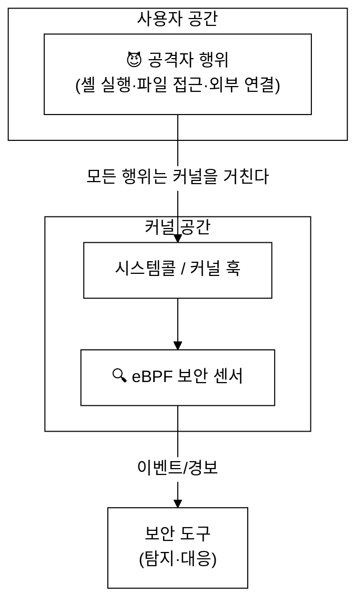
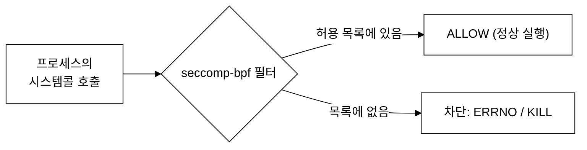
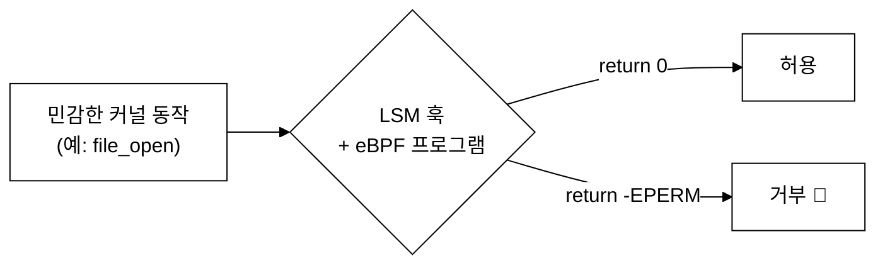
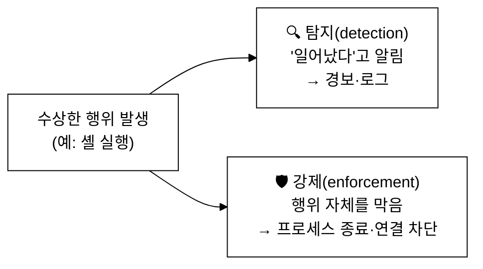
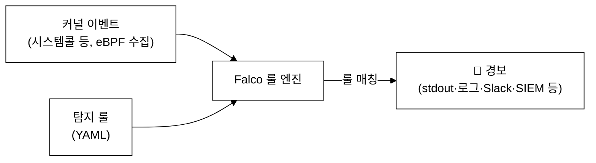
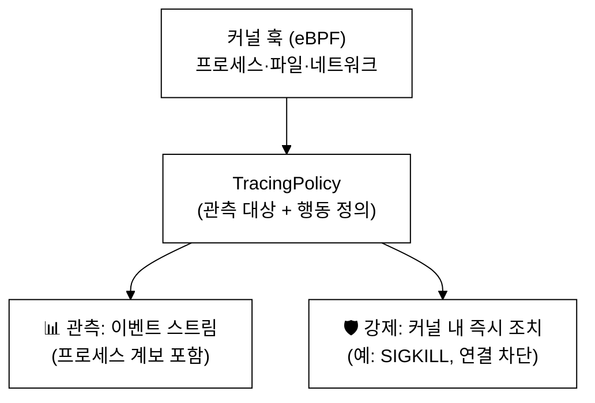
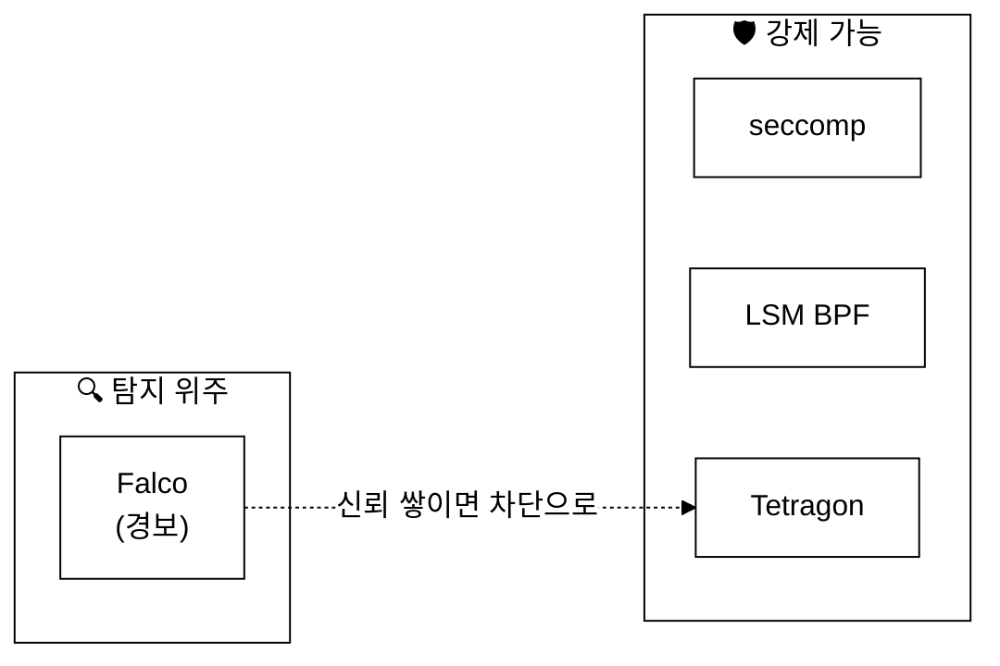
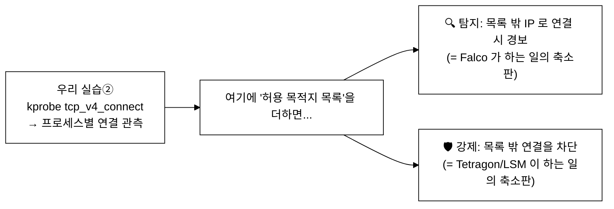

# 13주차 — eBPF 보안: LSM·Falco·Tetragon
> 같은 커널 가시성을 이번엔 "방어"에 쓴다. 시스템콜을 거르는 seccomp 부터, 보안 결정을 내리는 LSM, 그리고 탐지(Falco)와 강제(Tetragon)까지
last_updated: 2026-06-11

## 이번 주 학습 목표
- 왜 eBPF 가 **런타임 보안**에 잘 맞는지(커널 전역 가시성 + 낮은 오버헤드)를 설명할 수 있다.
- **seccomp-bpf**(정적 시스템콜 허용/차단)의 동작과 한계를 안다.
- **LSM BPF**(리눅스 보안 모듈 훅에 eBPF 를 달아 보안 결정)를 seccomp 와 구분해 이해한다.
- **Falco**(시스템콜 기반 위협 **탐지**)와 **Tetragon**(eBPF 기반 관측 + 실시간 **강제**)의 역할과 차이를 안다.
- **탐지(detection) vs 강제(enforcement)** 의 구분을 명확히 한다.
- 우리 실습②(연결 추적)가 "비정상 목적지 연결 탐지" 같은 보안 패턴으로 어떻게 확장되는지 연결한다.

---

## 1. 왜 eBPF 가 런타임 보안에 좋은가

런타임 보안의 핵심 질문은 **"지금 이 시스템에서 수상한 일이 벌어지고 있는가?"** 다. 공격은 대부분 커널을 거치는 행위로 드러난다 — 셸 실행, 민감 파일 열기, 예상치 못한 외부 연결, 권한 상승 시도 등. 이 모든 것이 시스템콜·커널 함수 수준에서 보인다.



eBPF 가 보안 센서로 적합한 이유:

| 강점 | 설명 |
|:---|:---|
| **전역 가시성** | 커널을 거치는 거의 모든 행위(시스템콜·네트워크·파일)를 한자리에서 본다 |
| **낮은 오버헤드** | 커널 안에서 필터링·집계하므로, 모든 이벤트를 사용자 공간으로 퍼 올리는 방식보다 가볍다 |
| **컨텍스트 풍부** | 프로세스·컨테이너·파드 정보를 함께 붙여 "누가" 했는지 식별 |
| **재부팅 불요** | 정책·센서를 동적으로 로드/교체 |

> 핵심: 보안은 "행위를 본다"에서 시작한다. 그리고 행위가 가장 잘 보이는 곳이 커널이며, 그곳을 안전하게 들여다보는 도구가 eBPF 다.

---

## 2. seccomp-bpf: 시스템콜의 정적 게이트

**seccomp(secure computing)** 는 프로세스가 호출할 수 있는 시스템콜을 제한하는 오래된 리눅스 기능이다. **seccomp-bpf** 는 여기에 (고전) BPF 필터를 붙여, **"이 프로세스는 이 시스템콜만 허용"** 같은 규칙을 건다. 컨테이너 런타임이 컨테이너의 공격 표면을 줄일 때 흔히 쓴다.



seccomp-bpf 의 성격:

- **정적(static)**: 프로세스 시작 시 필터를 박아 두고, 이후 그 규칙으로 단순 매칭한다.
- **단순 판단**: 주로 "시스템콜 번호 + 인자(레지스터 값)" 수준에서 결정. 포인터가 가리키는 메모리 내용 같은 깊은 컨텍스트는 보기 어렵다.
- **장점**: 가볍고 검증된 방어. **단점**: 표현력이 제한적이고, 복잡한 정책엔 부족하다.

> seccomp-bpf 는 "이 방에선 이 문들만 쓸 수 있어"라고 **미리 못 박는** 방식이다. 유연하진 않지만 단단하다.

---

## 3. LSM BPF: 보안 결정을 내리는 훅

리눅스에는 **LSM(Linux Security Module)** 이라는 보안 훅 프레임워크가 있다. SELinux·AppArmor 가 이 위에서 동작한다. 커널은 민감한 동작(파일 열기, 소켓 연결, 프로세스 실행 등) 직전에 **LSM 훅**을 호출해 "이 동작을 허용할까?"를 묻는다.

**LSM BPF(BPF LSM)** 는 이 LSM 훅에 **eBPF 프로그램**을 달 수 있게 한 기능(커널 5.7+)이다. eBPF 가 보안 결정을 내려 **0(허용) 또는 음수 에러(거부)** 를 반환한다.



seccomp 와 LSM BPF 의 결정적 차이:

| 구분 | seccomp-bpf | LSM BPF |
|:---|:---|:---|
| 거는 위치 | 시스템콜 진입부 | 커널 내부 **보안 의사결정 지점**(LSM 훅) |
| 컨텍스트 | 시스템콜 번호 + 레지스터 인자 | 커널 객체(파일·소켓·자격증명 등) 풍부한 정보 |
| 표현력 | 제한적(정적 매칭) | 높음(eBPF 로 복잡한 정책) |
| 결정 | 허용/차단/KILL 등 | 허용(0) / 거부(음수) |
| 최소 커널 | 오래전부터 | 5.7+ (CONFIG_BPF_LSM, 보통 부팅 옵션 필요) |

> seccomp 가 "문 목록을 미리 못 박기"라면, LSM BPF 는 "문 앞에서 그때그때 신분과 상황을 보고 판단하기"에 가깝다. 더 똑똑하지만 그만큼 신중히 써야 한다.

---

## 4. 탐지 vs 강제: 보안의 두 갈래

여기서 이번 주의 가장 중요한 개념을 못 박자.



| 구분 | 탐지(Detection) | 강제(Enforcement) |
|:---|:---|:---|
| 하는 일 | 의심 행위를 **관측하고 경보** | 의심 행위를 **실제로 차단** |
| 시점 | 보통 일어난 **직후**(사후 인지) | 일어나기 **전/중** 막음 |
| 위험 | 막진 못함(공격은 진행됨) | 잘못 막으면 정상 동작도 깨짐(오탐 비용 큼) |
| 비유 | CCTV·경보기 | 자동 잠금장치·차단봉 |
| 대표 도구 | **Falco** | **Tetragon**, LSM BPF |

> 둘은 대립이 아니라 단계다. 보통 **탐지로 시작**해 신뢰가 쌓이면 **강제로** 넘어간다. 강제는 강력한 만큼 오탐 한 번이 서비스 장애가 될 수 있어 신중함이 필요하다.

---

## 5. Falco: 시스템콜 기반 런타임 위협 탐지

**Falco** 는 CNCF 의 졸업(Graduated) 프로젝트로, 런타임 위협 **탐지**에 널리 쓰이는 오픈소스다. 시스템콜·커널 이벤트를 수집해 **룰 엔진**으로 평가하고, 룰에 걸리면 **경보(alert)** 를 낸다. 성격상 "관측·탐지" 중심이다.



전형적인 Falco 룰의 형태(개념용):

```yaml
- rule: Terminal shell in container
  desc: 컨테이너 안에서 대화형 셸이 실행됨 (수상함)
  condition: spawned_process and container and shell_procs
  output: "컨테이너에서 셸 실행 (user=%user.name command=%proc.cmdline)"
  priority: WARNING
```

Falco 가 잡아내는 전형적 위협 패턴:

- **예상치 못한 셸 실행**: 운영 중인 컨테이너 안에서 `bash`/`sh` 가 뜸 → 침입 의심.
- **민감 파일 접근**: `/etc/shadow`, 클라우드 자격증명 파일 등을 읽음.
- **예상치 못한 네트워크 연결**: 평소 안 하던 외부 IP 로 connect → **데이터 유출·C2 의심**.
- **권한 상승 시도**: setuid 호출, 컨테이너 탈출 정황.

> Falco 의 위치를 정확히: 기본적으로 **"탐지·경보"** 도구다. (대응은 보통 외부 연동 — 경보를 받아 다른 시스템이 조치.) 메모리 효율이 좋고 CNCF 생태계에서 오래 자리 잡은 폭넓은 탐지 도구로 알려져 있다.

---

## 6. Tetragon: 관측 + 실시간 강제

**Tetragon** 은 **Cilium 의 하위 프로젝트**(CNCF)로, eBPF 기반 **보안 관측(observability)** 에 더해 **실시간 강제(enforcement)** 까지 할 수 있는 것이 특징이다. 즉 의심 행위를 관측만 하는 게 아니라, 커널 안에서 **프로세스를 종료하거나 연결을 차단**하는 식의 조치를 취할 수 있다.



Tetragon 의 성격:

- **쿠버네티스 인지(aware)**: 이벤트에 파드·컨테이너·라벨 컨텍스트를 붙인다.
- **프로세스 계보**: "누가 누구를 실행했나"의 실행 트리를 추적해, 의심 행위의 출처를 안다.
- **인커널 강제**: 정책 위반 행위를 사용자 공간까지 올리지 않고 **커널 안에서 즉시** 막을 수 있어 빠르고 우회가 어렵다.
- 효율 면에서 CPU 사용이 낮은 편으로 알려져 있다(세부 수치는 환경·버전 의존이니 단정은 금물).

---

## 7. 한눈에 비교: seccomp vs LSM BPF vs Falco vs Tetragon

| 도구 | 계층 | 주된 성격 | 동작 | 비고 |
|:---|:---|:---|:---|:---|
| **seccomp-bpf** | 시스템콜 진입 | 강제(정적) | 허용 목록 외 시스템콜 차단 | 가볍고 단단, 표현력 제한 |
| **LSM BPF** | LSM 보안 훅 | 강제(동적) | eBPF 가 허용/거부 결정 | 풍부한 컨텍스트, 커널 5.7+ |
| **Falco** | 시스템콜/커널 이벤트 | **탐지 중심** | 룰 엔진으로 경보 | CNCF Graduated, 폭넓은 탐지 |
| **Tetragon** | 커널 훅(eBPF) | **관측 + 강제** | 이벤트 + 인커널 조치 | Cilium 하위(CNCF), 강제 가능 |



> 주의: 도구들의 세부 기능·성능은 버전과 환경에 따라 다르다. 시험·실무에서는 "Falco = 탐지 중심, Tetragon = 관측+강제, LSM BPF = 커널 보안 결정, seccomp = 정적 시스템콜 게이트"라는 **역할 구분**을 정확히 잡는 것이 핵심이다.

---

## 8. 실습②와의 연결: "비정상 목적지 연결 탐지"

우리 10주차 실습②(netflow-tracer)는 `tcp_v4_connect` 에 kprobe 를 걸어 **"어떤 프로세스가 어디로 TCP 연결을 하나"** 를 관측했다. 이건 사실 보안 탐지의 **기본 빌딩블록**이다.



- **탐지로 키우기**: 실습②의 출력에 "예상 목적지 화이트리스트"를 더하면, 목록 밖 IP 로의 연결을 **경보**할 수 있다. 이것이 Falco 류 "예상치 못한 네트워크 연결" 탐지의 본질이다.
- **강제로 키우기**: 같은 판단을 cgroup connect 훅이나 Tetragon 정책으로 옮기면, 비정상 연결을 **차단**할 수 있다.

즉 우리가 짠 작은 추적기는, 한 발만 더 나아가면 **런타임 보안 센서**가 된다. 같은 eBPF·같은 훅·같은 맵, 거기에 "정책"과 "조치"가 붙었을 뿐이다. 이것이 실습②가 12주(네트워킹)·13주(보안)의 "축소판 맛보기"였다는 말의 의미다.

---

## 💡 핵심 요약
- eBPF 는 **커널 전역 가시성 + 낮은 오버헤드 + 풍부한 컨텍스트**로 런타임 보안 센서에 적합하다.
- **seccomp-bpf**: 시스템콜의 **정적** 허용/차단. 가볍지만 표현력 제한.
- **LSM BPF**: LSM 보안 훅에 eBPF 를 달아 **동적 보안 결정**(허용 0 / 거부 음수). 커널 5.7+.
- **탐지 vs 강제**: 탐지는 알리기, 강제는 막기. 보통 탐지 → 강제 순으로 성숙.
- **Falco**: 시스템콜 기반 위협 **탐지·경보**(CNCF Graduated).
- **Tetragon**: Cilium 하위(CNCF), eBPF 관측 + **인커널 실시간 강제** 가능.
- 실습②(연결 관측)는 정책·조치를 더하면 "비정상 연결 탐지/차단" 보안 센서로 자란다.

---

## ✍️ 연습문제
1. seccomp-bpf 와 LSM BPF 가 "거는 위치"와 "다룰 수 있는 컨텍스트" 면에서 어떻게 다른지 설명하라.
2. "탐지로 충분한 상황"과 "강제가 필요한 상황"의 예를 각각 하나씩 들고, 강제를 택할 때의 위험을 적어라.
3. Falco 룰로 "컨테이너 안에서 `/etc/shadow` 를 읽으면 경보"를 만들 때, 어떤 시스템콜/이벤트를 봐야 할지 추론해 보라.
4. 우리 실습②를 "비정상 목적지 연결 탐지기"로 바꾸려면 어떤 자료구조(맵)와 로직을 추가해야 하는가?
5. 같은 탐지를 "차단"으로 바꾸려면 kprobe 관측만으로는 부족한 이유는? 어떤 훅이 필요한가?(힌트: 12주 cgroup connect, LSM)

---

## ✅ 자가점검 퀴즈
1. seccomp-bpf 는 정적인가 동적인가, 그리고 주로 무엇을 본다고 했나?
<details><summary>정답</summary>정적이다. 주로 시스템콜 번호와 레지스터 인자를 본다(깊은 메모리 컨텍스트는 보기 어렵다).</details>

2. LSM BPF 에서 eBPF 프로그램이 "거부"를 표현하는 반환값은?
<details><summary>정답</summary>음수 에러 코드(예: -EPERM). 허용은 0.</details>

3. Falco 의 주된 성격은 탐지인가 강제인가?
<details><summary>정답</summary>탐지(detection) 중심이다. 룰 엔진으로 경보를 낸다(대응은 보통 외부 연동).</details>

4. Tetragon 이 Falco 와 구별되는 핵심 능력은?
<details><summary>정답</summary>관측에 더해 인커널 실시간 강제(enforcement) — 프로세스 종료·연결 차단 등 — 가 가능하다는 점.</details>

5. Tetragon 은 어떤 프로젝트의 하위 프로젝트이며 어느 재단 소속인가?
<details><summary>정답</summary>Cilium 의 하위 프로젝트이며 CNCF 프로젝트다.</details>

6. 우리 실습②(연결 관측)를 보안 탐지기로 만들려면 무엇을 더해야 하나?
<details><summary>정답</summary>"허용 목적지 목록(화이트리스트)"과, 목록 밖 연결을 경보(탐지) 또는 차단(강제)하는 로직.</details>

---

## 📚 더 읽을거리
- Falco 공식 문서(falco.org), CNCF 프로젝트 페이지.
- Tetragon 공식 사이트(tetragon.io)와 Cilium 문서 — 세부 기능·성능은 버전 의존이니 문서 기준 확인.
- 커널 문서: seccomp, BPF LSM(CONFIG_BPF_LSM) 관련.
- eBPF 런타임 보안 도구 비교 자료(Falco·Tetragon·Tracee 등). 수치는 환경 의존임에 유의.

출처: [Tetragon 공식](https://tetragon.io/) · [eBPF Runtime Security Tools 비교](https://www.decryptiondigest.com/blog/ebpf-runtime-security-tools-falco-tetragon)

---

## ⏭ 다음 주 예고
다음 [14주차](14주차_관측성과_성능분석_프로파일링.md)에서는 보안에서 잠시 벗어나 **관측성과 성능 분석·프로파일링**으로 간다. eBPF 로 CPU/지연을 프로파일링하고 플레임그래프를 뽑는 법, off-CPU 분석, 그리고 우리가 배운 추적 기술이 성능 문제 해결로 이어지는 길을 본다.
