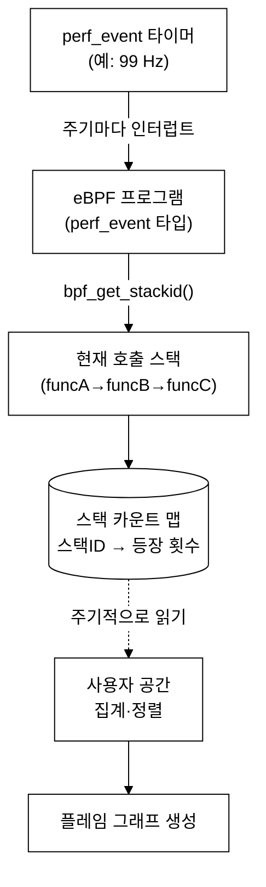
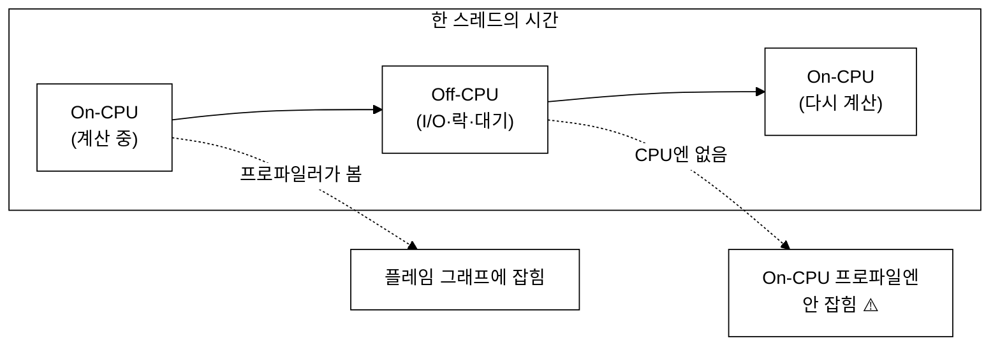
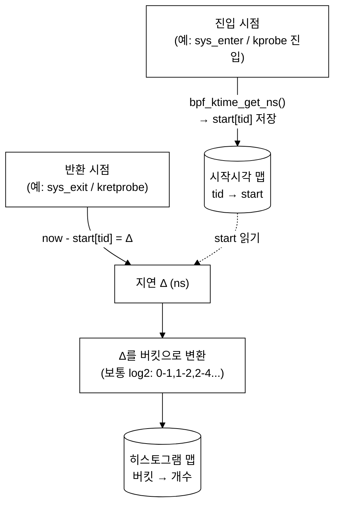
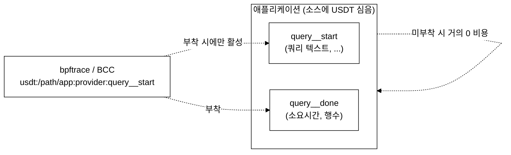
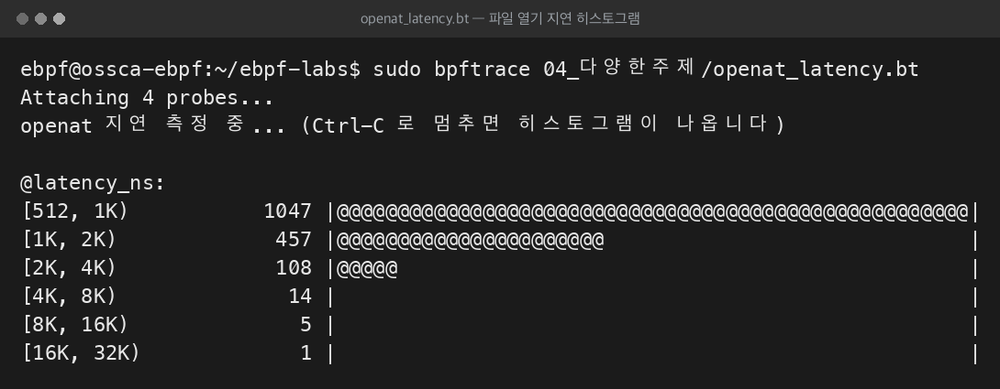
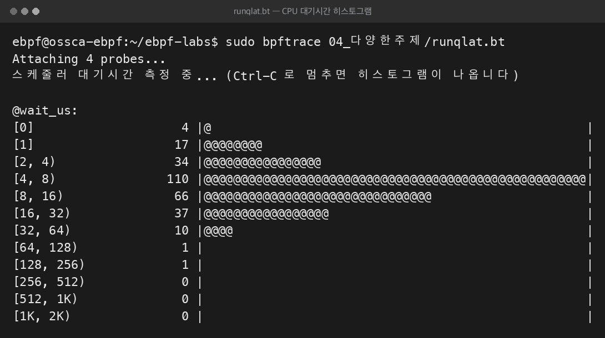
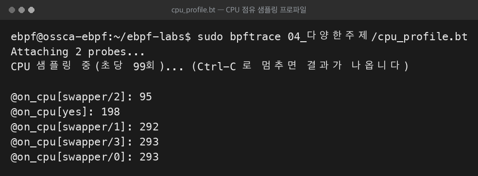
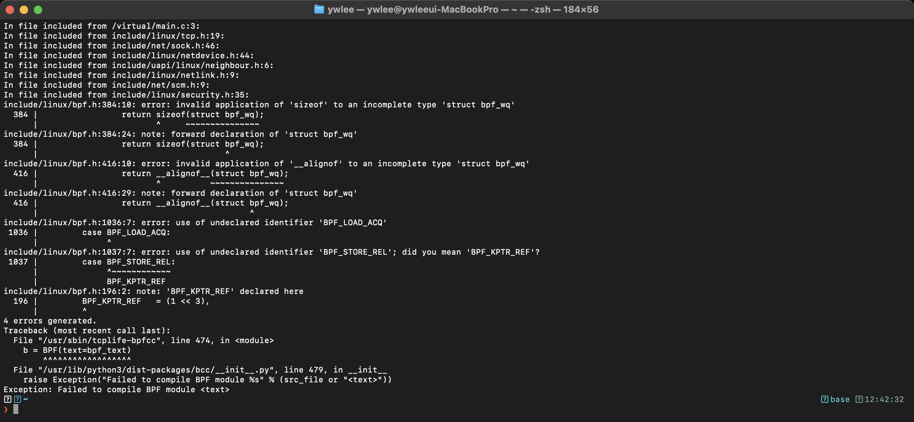

# 14주차 — 관측성과 성능 분석: 프로파일링
> "느리다"는 막연한 느낌을 커널 단의 숫자와 그림으로 바꾸는, eBPF 성능 분석의 핵심 시간
last_updated: 2026-06-11

> 🧭 **이번 주 동선**  ·  📘 과목1 해당 없음  ·  📕 과목2 12주차 🔵
> - 🔬 **실습(VM `ssh ossca-ebpf`)**: `labs/02_스케줄러/runq_latency.py` · `sudo profile-bpfcc` · `sudo offcputime-bpfcc`
> - 🧵 **OS 트랙 함께 보기**: —
> - ↔️ **이동**: ⬅️ [13주차 보안 LSM](13주차_eBPF_보안_LSM_Falco_Tetragon.md) · 🏠 [강의 인덱스](README.md) · ➡️ [15주차 안전성·한계·미래](15주차_안전성_한계_미래와_정리.md)

## 이번 주 학습 목표
- eBPF가 성능 분석을 어떻게 바꿨는지(상시·저오버헤드·전 시스템 가시성) 설명할 수 있다.
- **On-CPU 프로파일링**(주기적 스택 샘플링 → 플레임 그래프)의 원리를 그림으로 설명할 수 있다.
- **Off-CPU 분석**(대기·블록 시간 추적)이 왜 필요한지, On-CPU와 어떻게 상호 보완하는지 안다.
- **지연(latency) 히스토그램**이 `bpf_ktime_get_ns`와 BPF 맵으로 어떻게 만들어지는지 단계별로 설명한다.
- **USDT**(애플리케이션 정적 추적점)가 무엇이고 언제 쓰는지 안다.
- BCC tools(`execsnoop`·`opensnoop`·`biolatency`·`runqlat`·`tcplife` 등)와 지속적 프로파일링 프로젝트(Parca·Pyroscope·Pixie)를 큰 그림에서 위치 지을 수 있다.
- VM에서 BCC 도구 또는 bpftrace로 직접 추적을 실행하고 결과를 해석할 수 있다.

---

## 1. eBPF가 성능 분석을 어떻게 바꿨나

서버가 느려졌을 때 우리가 진짜 알고 싶은 것은 **"누가, 어디서, 왜 시간을 잡아먹는가"** 다. 전통적으로 이 질문에 답하는 일은 까다로웠다. `strace`는 너무 무거워 운영 중에 켜기 어렵고(1주차 회고), 애플리케이션 로그는 커널에서 벌어지는 일을 못 본다. 프로파일러를 따로 설치하면 그것대로 오버헤드가 컸다.

eBPF는 이 그림을 세 가지 측면에서 바꿨다.

```mermaid
%%{init: {"theme":"base","themeVariables":{"background":"#ffffff","primaryColor":"#ffffff","primaryBorderColor":"#000000","primaryTextColor":"#000000","secondaryColor":"#ffffff","secondaryBorderColor":"#000000","secondaryTextColor":"#000000","tertiaryColor":"#ffffff","tertiaryBorderColor":"#000000","tertiaryTextColor":"#000000","lineColor":"#000000","textColor":"#000000","mainBkg":"#ffffff","secondBkg":"#ffffff","clusterBkg":"#ffffff","clusterBorder":"#000000","edgeLabelBackground":"#ffffff","nodeBorder":"#000000","defaultLinkColor":"#000000","titleColor":"#000000","actorBkg":"#ffffff","actorBorder":"#000000","actorTextColor":"#000000","actorLineColor":"#000000","signalColor":"#000000","signalTextColor":"#000000","labelBoxBkgColor":"#ffffff","labelBoxBorderColor":"#000000","labelTextColor":"#000000","loopTextColor":"#000000","noteBkgColor":"#ffffff","noteBorderColor":"#000000","noteTextColor":"#000000","activationBkgColor":"#ffffff","activationBorderColor":"#000000","sequenceNumberColor":"#000000","cScale0":"#ffffff","cScale1":"#ffffff","cScale2":"#ffffff","cScale3":"#ffffff","cScale4":"#ffffff","cScale5":"#ffffff","cScale6":"#ffffff","cScale7":"#ffffff","cScale8":"#ffffff","cScale9":"#ffffff","cScale10":"#ffffff","cScale11":"#ffffff","cScaleLabel0":"#000000","cScaleLabel1":"#000000","cScaleLabel2":"#000000","cScaleLabel3":"#000000","cScaleLabel4":"#000000","cScaleLabel5":"#000000","cScaleLabel6":"#000000","cScaleLabel7":"#000000","cScaleLabel8":"#000000","cScaleLabel9":"#000000","cScaleLabel10":"#000000","cScaleLabel11":"#000000","pie1":"#ffffff","pie2":"#eeeeee","pie3":"#dddddd","pie4":"#cccccc","fontFamily":"Georgia, serif"}}}%%
flowchart LR
    subgraph Old["❌ 예전 방식"]
        O1["문제 생기면\n그때 도구 설치"]
        O2["무거운 추적\n(ptrace 등)"]
        O3["특정 프로세스만\n좁게 관측"]
    end
    subgraph New["✅ eBPF 방식"]
        N1["상시 켜둠\n(always-on)"]
        N2["저오버헤드\n(커널 내 JIT 실행)"]
        N3["전 시스템\n(모든 프로세스·커널)"]
    end
    Old --> New
    style Old fill:#ffffff
    style New fill:#ffffff
```



- **상시(always-on) 가능.** 오버헤드가 충분히 낮아, 문제가 터진 뒤 도구를 부랴부랴 설치하는 게 아니라 **평소에 켜두고** 데이터를 쌓을 수 있다. 이것이 뒤에서 볼 "지속적 프로파일링(continuous profiling)"의 토대다.
- **저오버헤드.** 검증을 통과한 eBPF 프로그램은 JIT로 네이티브 코드가 되어 커널 안에서 직접 돈다(4주차). 데이터도 사용자 공간으로 한 건씩 퍼 나르는 대신 **커널 안 BPF 맵에 집계**한 뒤 가끔만 읽어 가므로, 전송 비용이 작다.
- **전 시스템(system-wide).** 커널이라는 공통 길목에서 보기 때문에 언어·런타임을 가리지 않고(2주차) 모든 프로세스를 한 번에 관측한다.

> 💬 **집계를 어디서 하느냐가 핵심이다.** 이벤트 하나하나를 사용자 공간으로 보내면(=실습 ②의 perf 이벤트 방식) 데이터가 많을 때 비싸진다. 반대로 **커널 안 맵에 미리 합산**하면(=실습 ①의 맵 방식, 그리고 이번 주 히스토그램) 전송량이 확 줄어 상시 관측에 유리하다. 같은 eBPF라도 "어디서 줄이느냐"의 설계 선택이다.

이번 주의 네 가지 기법 — On-CPU 프로파일링, Off-CPU 분석, 지연 히스토그램, USDT — 은 모두 이 세 가지 장점 위에 서 있다.

---

## 2. On-CPU 프로파일링 — "지금 CPU를 누가 먹나"

### 2.1 샘플링이라는 발상

CPU가 바쁜데 왜 바쁜지 모를 때, 모든 함수 호출을 일일이 기록하면(추적, tracing) 정확하지만 너무 무겁다. 대신 **샘플링(sampling)** 을 쓴다.

> **일정 주기(예: 초당 99회)마다 "지금 CPU에서 무슨 코드가 돌고 있나"를 사진처럼 찍는다.**

많이 찍힌 함수일수록 CPU를 오래 점유한 것이다. 통계적 표본 추출과 같은 원리라, 표본이 충분히 쌓이면 "CPU 시간의 분포"를 꽤 정확히 복원한다. 핵심은 **모든 일을 기록하지 않고도** 어디가 뜨거운지(hot) 알아낸다는 점이다.

eBPF에서는 `perf_event` 타입 프로그램을 **타이머/PMU 이벤트**에 붙여 이 주기적 샘플링을 구현한다. 샘플이 발생할 때마다 eBPF 프로그램이 깨어나, 헬퍼 `bpf_get_stackid`(또는 `bpf_get_stack`)로 **현재 호출 스택**을 떠서 맵에 누적한다.



> 💡 **왜 99 Hz 같은 어정쩡한 숫자?** 100 Hz처럼 딱 떨어지는 주파수는 시스템의 다른 주기적 작업(타이머 등)과 박자가 맞아 **특정 코드만 반복해서 찍히는 편향(lockstep)** 이 생길 수 있다. 살짝 어긋난 99 Hz를 쓰면 이런 동기화 편향을 피한다. Brendan Gregg가 널리 퍼뜨린 관행이다.

#### 심화: 샘플링(sampling) vs 추적(tracing) — 비용이 갈리는 지점

이번 주를 관통하는 가장 중요한 구분이 **샘플링과 추적**의 차이다. 둘 다 eBPF로 하지만 **무엇을, 얼마나 자주** 보느냐가 근본적으로 다르다.

| 구분 | 샘플링(sampling) | 추적(tracing) |
|:---|:---|:---|
| 무엇을 보나 | **주기마다 한 번씩** "지금 상태"를 사진 찍음 | **모든 이벤트**를 빠짐없이 기록 |
| 일하는 빈도 | 고정 주파수(예: 99 Hz) — 이벤트량과 무관 | 이벤트가 일어나는 만큼 — 폭증 가능 |
| 정확도 | 통계적 근사(표본 충분해야 신뢰) | 정확(놓치는 이벤트 없음) |
| 비용 | 빈도가 상한이라 **예측 가능·저비용** | 이벤트가 잦으면 **비싸짐** |
| 대표 예 | `profile`(On-CPU 스택) | `execsnoop`·지연 히스토그램(진입/반환마다) |

> 💬 **샘플링이 추적보다 가벼운 핵심 이유:** 샘플링의 작업량은 **이벤트 수가 아니라 샘플 주파수에 묶여 있다.** 초당 100만 번 호출되는 함수든 10번 호출되는 함수든, 99 Hz 샘플러는 1초에 99번만 일한다. 반면 추적은 그 100만 번을 **모두** 따라가야 하므로, 핫패스에서 오버헤드가 선형으로 커진다. 그래서 "어디가 뜨거운가"(분포)는 샘플링이, "정확히 무슨 일이 언제 일어났나"(개별 사건)는 추적이 맡는다. On-CPU 프로파일이 상시(always-on)로 돌 수 있는 이유가 바로 이 비용 구조다.

### 2.2 플레임 그래프(Flame Graph)

샘플로 모은 스택들을 사람이 한눈에 보도록 만든 그림이 **플레임 그래프**다. 만들어지는 과정을 단계로 보자.

```mermaid
%%{init: {"theme":"base","themeVariables":{"background":"#ffffff","primaryColor":"#ffffff","primaryBorderColor":"#000000","primaryTextColor":"#000000","secondaryColor":"#ffffff","secondaryBorderColor":"#000000","secondaryTextColor":"#000000","tertiaryColor":"#ffffff","tertiaryBorderColor":"#000000","tertiaryTextColor":"#000000","lineColor":"#000000","textColor":"#000000","mainBkg":"#ffffff","secondBkg":"#ffffff","clusterBkg":"#ffffff","clusterBorder":"#000000","edgeLabelBackground":"#ffffff","nodeBorder":"#000000","defaultLinkColor":"#000000","titleColor":"#000000","actorBkg":"#ffffff","actorBorder":"#000000","actorTextColor":"#000000","actorLineColor":"#000000","signalColor":"#000000","signalTextColor":"#000000","labelBoxBkgColor":"#ffffff","labelBoxBorderColor":"#000000","labelTextColor":"#000000","loopTextColor":"#000000","noteBkgColor":"#ffffff","noteBorderColor":"#000000","noteTextColor":"#000000","activationBkgColor":"#ffffff","activationBorderColor":"#000000","sequenceNumberColor":"#000000","cScale0":"#ffffff","cScale1":"#ffffff","cScale2":"#ffffff","cScale3":"#ffffff","cScale4":"#ffffff","cScale5":"#ffffff","cScale6":"#ffffff","cScale7":"#ffffff","cScale8":"#ffffff","cScale9":"#ffffff","cScale10":"#ffffff","cScale11":"#ffffff","cScaleLabel0":"#000000","cScaleLabel1":"#000000","cScaleLabel2":"#000000","cScaleLabel3":"#000000","cScaleLabel4":"#000000","cScaleLabel5":"#000000","cScaleLabel6":"#000000","cScaleLabel7":"#000000","cScaleLabel8":"#000000","cScaleLabel9":"#000000","cScaleLabel10":"#000000","cScaleLabel11":"#000000","pie1":"#ffffff","pie2":"#eeeeee","pie3":"#dddddd","pie4":"#cccccc","fontFamily":"Georgia, serif"}}}%%
flowchart LR
    A["① 샘플마다\n스택 채취\n(main→f→g)"] --> B["② 같은 스택끼리\n묶어 횟수 집계"]
    B --> C["③ 스택을 가로로 눕혀\n공통 조상끼리 합침"]
    C --> D["④ 너비 = 표본 수\n= CPU 점유 비율"]
```



플레임 그래프 읽는 법(핵심 규칙만):

| 축/요소 | 의미 |
|:---|:---|
| 가로 너비 | 그 함수가 **CPU에 잡힌 표본 수의 비율**(넓을수록 CPU를 오래 먹음) |
| 세로(위로 쌓임) | **호출 깊이**(아래가 호출자, 위가 피호출자) |
| 가로 순서 | 알파벳/임의 정렬일 뿐 **시간 순서가 아님** |
| 색깔 | 대개 의미 없음(가독성·구분용). 일부 변형에서만 의미 부여 |

즉 **"넓고 평평한 꼭대기(plateau)"** 를 찾으면 된다. 그 자리가 CPU를 직접 태우고 있는 함수다. 아래로 내려가며 "누가 이 함수를 불렀나(호출 경로)"를 따라가면 책임 소재가 드러난다.

> ⚠️ **표본 수가 적으면 못 믿는다.** 샘플링은 통계라, 잠깐만 켜서 표본이 적으면 우연히 안 잡힌 뜨거운 함수가 있을 수 있다. 충분히 오래(또는 충분한 빈도로) 모아야 분포가 안정된다.

### 2.3 커널 스택 + 사용자 스택, 그리고 심볼

eBPF 프로파일러의 강점은 **커널 스택과 사용자 스택을 함께** 뜰 수 있다는 점이다. "내 함수 → 라이브러리 → 시스템콜 → 커널 함수"까지 한 그림으로 이어 본다. 다만 주소를 함수 이름으로 바꾸는 **심볼 해석(symbolization)** 이 필요한데, 사용자 바이너리가 스트립되었거나(`strip`) JIT 언어(자바·Node 등)면 추가 설정이 필요할 수 있다. 이 부분은 도구·언어마다 다루는 방식이 달라, 실무에서 가장 손이 많이 가는 지점이다.

---

## 3. Off-CPU 분석 — "기다리느라 못 도는 시간"

On-CPU 프로파일링은 **CPU에서 실제로 돌고 있는** 코드만 본다. 그런데 느림의 상당수는 정반대 상황, 즉 **CPU에서 내려와 무언가를 기다리는** 동안 생긴다.

- 디스크 I/O 완료를 기다림(블록)
- 락(lock)을 기다림
- 네트워크 응답을 기다림
- 스케줄러가 다시 깨워 주기를 기다림(런큐 대기)

이런 시간은 CPU 표본에 **전혀 잡히지 않는다**(스레드가 CPU에 없으니까). 그래서 "CPU 사용률은 낮은데 응답은 느린" 미스터리가 생긴다.



### Off-CPU를 어떻게 재나

핵심은 **스케줄러 이벤트**를 잡는 것이다. 스레드가 CPU에서 내려갈 때(`sched:sched_switch`)와 다시 올라올 때를 추적해 그 시간차를 잰다. 개념은 다음과 같다.

```c
// 의사코드: Off-CPU 시간 측정의 뼈대 (개념 설명용)
// 스레드가 CPU에서 내려갈 때: 내려간 시각과 그때의 (대기) 스택을 기록
on sched_switch(prev, next):
    start[prev.pid] = bpf_ktime_get_ns();
    stack[prev.pid] = bpf_get_stackid();   // "어디서 멈춰 기다리는가"

// 같은 스레드가 다시 CPU에 올라올 때: 기다린 시간 = 지금 - 내려간 시각
on sched_switch(prev, next):
    t0 = start[next.pid];
    if (t0) {
        delta = bpf_ktime_get_ns() - t0;
        offcpu_time[ stack[next.pid] ] += delta;   // 대기 스택별로 누적
    }
```

이렇게 모은 데이터로 **Off-CPU 플레임 그래프**를 그리면, 너비가 "CPU 점유"가 아니라 **"기다린 시간"** 을 뜻한다. On-CPU 그래프와 나란히 보면 "계산이 느린가, 기다림이 느린가"를 가른다.

> 📌 **On-CPU vs Off-CPU 요약**
>
> | 구분 | 무엇을 보나 | 어떻게 | 잡는 신호 |
> |:---|:---|:---|:---|
> | On-CPU | CPU를 태우는 코드 | 주기적 샘플링 | perf_event 타이머/PMU |
> | Off-CPU | 기다리느라 멈춘 코드 | 스케줄 전환 추적 | `sched_switch` 등 |
>
> 둘은 경쟁이 아니라 **한 쌍**이다. 합쳐 보면 스레드의 모든 시간이 설명된다.

> ⚠️ Off-CPU 추적은 컨텍스트 스위치가 잦은 시스템에서 이벤트가 폭증할 수 있어, On-CPU 샘플링보다 오버헤드가 커질 수 있다. 대상 PID로 좁히거나 임계값(아주 짧은 대기는 무시)을 두는 식으로 다룬다.

---

## 4. 지연 히스토그램 — 분포로 보는 성능

"평균 응답 38ms"는 위험한 숫자다. 99%는 1ms인데 1%가 2초라면 평균은 그럴듯해도 사용자 일부는 끔찍한 경험을 한다. 그래서 성능은 **평균이 아니라 분포(distribution)** 로 봐야 하고, 그 도구가 **히스토그램**이다.

### 4.1 진입/반환 시간차로 지연을 재는 원리

지연은 결국 **"어떤 일이 시작된 시각과 끝난 시각의 차"** 다. eBPF에서는 헬퍼 `bpf_ktime_get_ns()`(부팅 후 경과 나노초를 반환)로 양 끝의 시각을 찍어 뺀다. 시스템콜을 예로 들면, 진입 추적점에서 시작 시각을 기록하고 반환 추적점에서 차이를 계산한다.



핵심 단계는 네 가지다.

1. **진입에서 시작 시각 저장.** 스레드 식별자(tid)를 키로 `start[tid] = bpf_ktime_get_ns()`.
2. **반환에서 시간차 계산.** `delta = bpf_ktime_get_ns() - start[tid]`. (시작 기록이 없으면 추적 시작 전에 진입한 경우이므로 건너뜀.)
3. **버킷 산출.** 보통 **log2 버킷**(2의 거듭제곱 구간: `1–2µs`, `2–4µs`, `4–8µs` …)을 쓴다. 지연은 자릿수(orders of magnitude)로 퍼지므로 로그 스케일이 자연스럽다.
4. **버킷 카운트 증가.** 히스토그램 맵에서 해당 버킷의 개수를 +1. **모든 집계가 커널 안에서** 끝나므로 사용자 공간으로는 작은 버킷 배열만 가끔 읽어 가면 된다(저오버헤드).

### 4.2 BPF 히스토그램 맵과 출력 모양

BCC는 `BPF_HISTOGRAM`이라는 편의 맵과 `.print_log2_hist()`를 제공해, 위 과정을 손쉽게 구현하고 아래처럼 ASCII 막대로 보여 준다. bpftrace에서는 `@ = hist(delta)` 한 줄이면 같은 일을 한다.

```text
     usecs               : count     distribution
         0 -> 1          : 0        |                                        |
         2 -> 3          : 124      |@@@@@                                   |
         4 -> 7          : 938      |@@@@@@@@@@@@@@@@@@@@@@@@@@@@@@@@@@@@@@@@@@|
         8 -> 15         : 412      |@@@@@@@@@@@@@@@@@                        |
        16 -> 31         : 33       |@                                       |
       ...
      8192 -> 16383      : 2        |                                        |   ← 꼬리(tail) latency!
```

이 그림에서 우리는 평균이 결코 못 보여 주는 **두 가지**를 본다. (1) 대부분은 `4–7µs`에 몰려 있고(주봉), (2) 아주 드물게 `8–16ms`로 튀는 **꼬리 지연(tail latency)** 이 있다. 후자가 바로 사용자 불만의 정체일 때가 많다.

> 💬 **실습 ②와의 연결 — "연결 추적"을 "지연 측정"으로 확장하기.** 10주차 netflow-tracer는 `tcp_v4_connect` **진입**에서 연결을 잡았다. 여기에 **반환(또는 연결 완료) 시점**을 한 번 더 잡아 `bpf_ktime_get_ns` 차이를 내면, "누가 어디로 접속했나"를 넘어 **"그 연결을 맺는 데 얼마나 걸렸나"** 의 히스토그램으로 확장된다. BCC tools의 `tcplife`(연결의 수명·바이트 수 요약)가 바로 이 방향의 도구다. 기말 프로젝트의 "시스템콜 지연 히스토그램"(README §3) 주제와도 직결된다.

---

## 5. USDT — 애플리케이션 정적 추적점

지금까지는 커널 이벤트(추적점·kprobe)와 CPU 샘플을 봤다. 그런데 때로는 **애플리케이션 내부의 의미 있는 사건**(예: "쿼리 시작", "GC 발생", "요청 처리 완료")을 그 애플리케이션의 언어로 보고 싶다.

**USDT(User Statically-Defined Tracing)** 는 개발자가 애플리케이션 소스에 **미리 심어 둔 정적 추적점**이다. 평소에는 사실상 비용이 0(no-op)에 가깝다가, 추적기(bpftrace/BCC)가 붙으면 그 지점에서 인자와 함께 이벤트가 발생한다.



- **kprobe/uprobe와의 차이.** uprobe는 함수 **주소**에 붙으므로 함수 이름이 바뀌거나 인라인되면 깨지기 쉽다. USDT는 개발자가 **의도적으로 이름 붙인 안정적 지점**이라, 애플리케이션 버전이 올라가도 비교적 잘 유지된다(일종의 "추적 API").
- **대표 사례(널리 알려진 사실).** PostgreSQL, MySQL, 그리고 일부 언어 런타임(예: CPython, Node.js, OpenJDK 등)이 빌드 옵션에 따라 USDT 프로브를 제공한다. 제공 여부·이름은 배포판·빌드 설정에 따라 다르므로 실제 환경에서 확인이 필요하다.
- **확인·사용.** 바이너리에 어떤 USDT가 있는지는 `bpftrace -l 'usdt:/path/to/binary:*'`로 나열해 볼 수 있다(해당 바이너리에 프로브가 컴파일되어 있어야 보인다).

> 정리: **kprobe/추적점 = 커널이 무엇을 하나**, **uprobe/USDT = 애플리케이션이 무엇을 하나**. eBPF는 이 둘을 한 도구에서 엮어 "내 코드 → 라이브러리 → 커널"의 한 그림을 만든다.

---

## 6. 대표 도구들 — 무엇을 언제 쓰나

### 6.1 BCC tools — 즉시 쓰는 성능 도구 모음

VM에 설치된 `bpfcc-tools` 패키지에는 Brendan Gregg 등이 만든 수십 개의 완성 도구가 들어 있다(보통 `-bpfcc` 접미사로 설치된다). 대표적인 몇 개만 정리한다.

| 도구 | 무엇을 보나 | 이번 주 어느 개념 |
|:---|:---|:---|
| `execsnoop` | 새로 **실행되는 프로세스**(execve)와 인자(argv) | 이벤트 추적 |
| `opensnoop` | 어떤 프로세스가 **어떤 파일을 여는가**(openat) | 이벤트 추적 |
| `biolatency` | **블록 I/O 지연**의 히스토그램 | 지연 히스토그램(§4) |
| `runqlat` | **런큐 대기 시간**(스케줄러가 깨워 줄 때까지) 히스토그램 | Off-CPU(§3)·지연 |
| `tcplife` | TCP **연결의 수명·송수신 바이트** 요약 | 실습 ② 확장(§4) |
| `profile` | On-CPU **스택 샘플링**(플레임 그래프 입력) | On-CPU(§2) |
| `offcputime` | **Off-CPU 시간**을 스택별로 집계 | Off-CPU(§3) |

> 💡 이 도구들은 사실상 우리가 9~10주에 손으로 만든 추적기의 "완성품 형제들"이다. 실습 ①·②를 직접 만들어 봤기에, 이 도구들이 내부에서 무엇을 하는지(맵 집계 vs perf 이벤트, 추적점 vs kprobe) 이제 읽어낼 수 있다.

### 6.2 지속적 프로파일링 프로젝트 — Parca·Pyroscope·Pixie

개별 도구를 손으로 켜는 것을 넘어, **항상 켜두고 시간에 따라 프로파일을 쌓아 두는** 흐름이 "지속적 프로파일링(continuous profiling)"이다. eBPF의 저오버헤드 덕분에 운영 환경에서 상시 돌릴 수 있게 된 비교적 최근의 접근이다. 널리 알려진 일반적 사실 위주로만 정리한다.

| 프로젝트 | 대략적 성격(일반적으로 알려진 수준) |
|:---|:---|
| **Parca** | eBPF 기반 지속적 프로파일링. 시간에 따른 프로파일을 저장·비교(플레임 그래프 형태) |
| **Pyroscope** | 지속적 프로파일링 플랫폼(이후 Grafana 진영에 합류한 것으로 알려짐). eBPF 포함 다양한 방식 지원 |
| **Pixie** | 쿠버네티스 환경 관측 도구. eBPF로 자동 계측해 트래픽·성능 가시성 제공(CNCF 프로젝트) |

> ⚠️ 위 프로젝트들은 변화가 빠른 영역이다. 정확한 기능·소속·라이선스는 단정하지 말고, 필요할 때 **공식 문서로 확인**하라. 여기서 기억할 것은 도구 이름보다 **"eBPF가 상시·저오버헤드 프로파일링을 가능케 해 지속적 프로파일링이라는 범주를 열었다"** 는 큰 그림이다.

---

## 🛠 실습 과제 — VM에서 프로파일링 도구 실행하기

> VM 켜는 법·접속은 [실습 랩 README](../../README.md) 강의 1~2를 따른다. 모든 명령은 **VM 안에서, eBPF 로드 권한 때문에 `sudo`** 로 실행한다.

```bash
# VM 켜고 접속 (Mac 터미널)
tart run ossca-ebpf-work --no-graphics &
until ssh ossca-ebpf 'true' 2>/dev/null; do echo "부팅 대기..."; sleep 2; done
ssh ossca-ebpf
```

### 과제 A — 이벤트 추적(execsnoop / opensnoop)

```bash
# (1) 새 프로세스가 뜰 때마다 실행 — 켜둔 채 다른 SSH 창에서 ls, date, curl 등을 실행해 보라
sudo execsnoop-bpfcc
#   ※ 배포판에 따라 도구 이름이 execsnoop-bpfcc / execsnoop 로 다를 수 있다.
#     없으면:  ls /usr/sbin/*snoop* /sbin/*snoop* 2>/dev/null  로 확인

# (2) 파일 열기 추적 — 다른 창에서 cat /etc/hostname 등을 해보면 잡힌다
sudo opensnoop-bpfcc
```

**해석 포인트:** 출력에 보이는 PID·COMM(프로세스 이름)·인자가, 다른 창에서 *내가 일부러 실행한 명령*과 일치하는가? 이것이 9주차에서 강조한 **자기검증**의 정신("내가 한 행동 ↔ 추적기가 잡은 것")이다.

### 과제 B — 지연 히스토그램(bpftrace 원라이너 또는 biolatency)

```bash
# (1) bpftrace 한 줄: read() 시스템콜의 지연 분포 (sys_enter에서 시작시각, sys_exit에서 차이)
sudo bpftrace -e '
tracepoint:syscalls:sys_enter_read { @start[tid] = nsecs; }
tracepoint:syscalls:sys_exit_read  /@start[tid]/ {
    @ns = hist(nsecs - @start[tid]);
    delete(@start[tid]);
}'
#   몇 초 두었다가 Ctrl-C → @ns 히스토그램 출력. 다른 창에서 파일을 읽으면 표본이 늘어난다.

# (2) 블록 I/O 지연 히스토그램(완성 도구). 다른 창에서 dd 등으로 디스크를 두드려 보라
sudo biolatency-bpfcc 5 1     # 5초 간격, 1회
```

**해석 포인트:** 분포의 **주봉(가장 큰 막대)** 은 어디인가? 그리고 멀리 떨어진 **꼬리(tail)** 막대가 있는가? 꼬리가 있다면 그게 "가끔 느림"의 정체다. §4의 그림과 비교해 보라.

### 과제 C(선택) — On-CPU 샘플 떠보기

```bash
# 5초간 On-CPU 스택을 99 Hz로 샘플링하고, 접힌(folded) 형식으로 본다
sudo profile-bpfcc -F 99 -f 5 | head -20
#   출력은 "스택;스택;... 횟수" 형태 — 이것을 flamegraph.pl 류에 넣으면 플레임 그래프가 된다.
```

> 도구 이름이 환경에 따라 다를 수 있으니, 막히면 `compgen -c | grep -i bpfcc` 또는 `ls /usr/sbin | grep -i snoop` 로 설치된 도구를 먼저 확인하라. 일부 도구는 커널/아키텍처에 따라 동작이 제한될 수 있다.

### 과제 D — Off-CPU vs On-CPU 직접 가르기 (랩 추적기)

- **목표:** §3에서 본 "런큐 대기(Off-CPU)"와 "CPU 점유(On-CPU)"를 같은 부하 위에서 동시에 재어, 둘이 보는 시간이 어떻게 다른지 눈으로 확인한다.
- **명령:**

```bash
# 창 1: 런큐 대기 시간(스케줄러가 깨워 줄 때까지) 히스토그램
sudo python3 ~/ebpf-labs/labs/02_스케줄러/runq_latency.py

# 창 2: On-CPU 점유 시간 측정
sudo python3 ~/ebpf-labs/labs/02_스케줄러/oncpu_time.py

# 창 3: CPU 부하 발생 — 코어 수보다 많은 yes 로 런큐 경쟁을 일으킨다
for i in $(seq 1 "$(nproc)"); do yes > /dev/null & done
#   끝나면:  kill %1 %2 ... 또는  pkill yes
```

- **관찰:** `yes` 를 코어보다 많이 띄우면 런큐 대기(runq_latency)의 막대가 오른쪽(더 긴 지연)으로 이동하는가? oncpu_time 은 `yes` 가 CPU를 거의 다 먹는 것을 보여 주는가? 둘이 보는 "시간"이 어떻게 다른지 §3의 한 쌍(On/Off-CPU) 그림과 대조하라.
- **질문:** CPU 사용률이 100%인데도 런큐 대기가 늘어난다면, 이는 "계산이 느린" 문제인가 "기다림이 느린" 문제인가?

### 과제 E — bpftrace 히스토그램 + 디스크 지연 (openat_latency / biolatency)

- **목표:** §4의 "진입/반환 시간차 → log2 버킷" 원리를 bpftrace 한 스크립트로 보고, 완성 도구 `biolatency` 로 블록 I/O 지연 분포까지 확인한다.
- **명령:**

```bash
# 창 1: openat 시스템콜의 지연 분포 (진입에서 시작시각, 반환에서 차이 → hist)
sudo bpftrace ~/ebpf-labs/examples/04_다양한주제/openat_latency.bt

# 창 2: 블록 I/O 지연 히스토그램 (완성 도구)
sudo biolatency-bpfcc 5 1        # 5초 간격, 1회

# 창 3: 디스크를 두드려 표본을 만든다
dd if=/dev/zero of=/tmp/ebpf_test.bin bs=1M count=200 oflag=direct 2>&1 | tail -1
sync; rm -f /tmp/ebpf_test.bin
```

- **관찰:** 두 히스토그램 모두 **주봉(가장 큰 막대)** 과, 드물게 멀리 떨어진 **꼬리(tail)** 막대를 보이는가? `dd` 를 돌리는 동안 biolatency 의 분포가 오른쪽으로 번지는가? §4.2의 ASCII 히스토그램 예시와 모양을 비교하라.
- **질문:** openat_latency 는 "추적"(모든 openat에서 시각 기록)이고 §2의 profile 은 "샘플링"이다. 같은 부하에서 어느 쪽이 더 무거울 가능성이 큰가, 그리고 그 이유는?

> 💬 **생각해 볼 질문(공통):** "샘플링이 추적보다 가벼운 이유"를 §2.1 심화 표를 근거로 자기 말로 2~3문장 설명해 보라. 힌트 — 작업량이 무엇에 묶여 있는가(이벤트 수 vs 샘플 주파수)?

> 도구·스크립트 경로가 환경에 따라 다를 수 있으니, 막히면 `ls ~/ebpf-labs/labs/02_스케줄러/ ~/ebpf-labs/examples/04_다양한주제/` 로 실제 파일명을 먼저 확인하라.

**제출물(권장):** 과제 A·B·D·E 각각의 출력 캡처 + "무엇이 보였고 왜 그런가" 3~5줄 해석.

---

### 📸 실제 실행 화면 (터미널 스크린샷)

> 성능 분석의 핵심인 **히스토그램**과 **샘플링 프로파일**을 **실제 터미널에서 실행한 화면을 그대로 캡처**한 것입니다.









각 TCP 연결이 얼마나 오래 살았고 얼마나 주고받았는지가 한 줄씩 요약된다. §4에서 본 "연결 추적 → 지연·수명 측정" 확장의 실제 도구로, 네트워크 성능 관측에 쓴다.

---

## 💡 핵심 요약
- eBPF는 **상시·저오버헤드·전 시스템** 가시성으로 성능 분석을 바꿨고, 비결은 **커널 안 맵에서 미리 집계**해 전송량을 줄이는 데 있다.
- **On-CPU 프로파일링**은 주기적 **스택 샘플링**(perf_event, 보통 99 Hz)으로 CPU를 태우는 코드를 찾고, **플레임 그래프**(너비=CPU 비율, 세로=호출 깊이)로 본다.
- **Off-CPU 분석**은 `sched_switch`로 **기다린 시간**을 재어, On-CPU가 못 보는 "낮은 CPU·느린 응답" 미스터리를 푼다. 둘은 한 쌍이다.
- **지연 히스토그램**은 진입/반환에서 `bpf_ktime_get_ns` 차이를 내 **log2 버킷**으로 BPF 히스토그램 맵에 누적한다. 평균이 못 보는 **꼬리 지연**을 드러낸다.
- **USDT**는 애플리케이션이 소스에 심어 둔 안정적 정적 추적점으로, 커널 가시성에 애플리케이션 가시성을 더한다.
- 도구는 **BCC tools**(execsnoop·opensnoop·biolatency·runqlat·tcplife·profile·offcputime)와 **지속적 프로파일링 프로젝트**(Parca·Pyroscope·Pixie)로 큰 그림이 그려진다.

---

## ✍️ 연습문제
1. On-CPU 프로파일러가 **100 Hz** 대신 **99 Hz**를 선호하는 이유를 "동기화 편향(lockstep)" 개념으로 설명하라.
2. 플레임 그래프에서 (a) 가로 너비, (b) 세로 높이, (c) 가로 순서가 각각 무엇을 뜻하는지/안 뜻하는지 쓰라.
3. "CPU 사용률은 30%인데 응답은 느리다." 이 상황에서 On-CPU 프로파일만으로는 왜 원인을 못 찾을 수 있는지, Off-CPU 분석이 어떻게 보완하는지 설명하라.
4. 시스템콜 지연 히스토그램을 만드는 4단계(진입 기록 → 반환 차이 → 버킷 → 카운트)를 `bpf_ktime_get_ns`와 BPF 맵을 언급하며 서술하라.
5. 지연 분포에 **log2 버킷**을 쓰는 이유를, 선형 버킷과 비교해 설명하라.
6. 실습 ②(netflow-tracer)를 "연결 지연 히스토그램"으로 확장하려면 eBPF 프로그램의 **부착 지점과 측정 로직**을 어떻게 바꿔야 하는지 구체적으로 적어라.
7. uprobe로 함수에 붙는 것과 **USDT** 추적점에 붙는 것의 장단점을 안정성 관점에서 비교하라.
8. BCC tools의 `biolatency`와 `runqlat`이 각각 §3·§4 중 어느 개념을 구현한 것인지 짝짓고, 둘이 측정하는 "지연"이 어떻게 다른지 설명하라.

---

## ✅ 자가점검 퀴즈
**Q1.** On-CPU 프로파일링이 "모든 함수 호출을 기록"하지 않고도 뜨거운 코드를 찾아내는 원리는?
<details><summary>정답</summary>
주기적 **샘플링**. 일정 주기(예: 99 Hz)마다 현재 호출 스택을 채취해 누적하면, 많이 찍힌 스택이 곧 CPU를 오래 점유한 코드다. 통계적 표본 추출과 같은 원리라 표본이 충분하면 분포를 정확히 복원한다.
</details>

**Q2.** 플레임 그래프에서 "넓고 평평한 꼭대기(plateau)"가 의미하는 것은?
<details><summary>정답</summary>
그 함수가 표본에 많이 잡혔다는 뜻, 즉 **CPU를 직접 오래 태우는 함수**다. 아래로 내려가며 호출 경로(누가 불렀나)를 추적해 책임 소재를 찾는다.
</details>

**Q3.** Off-CPU 시간을 측정할 때 주로 잡는 커널 이벤트는?
<details><summary>정답</summary>
스케줄러의 컨텍스트 전환(`sched:sched_switch` 등). 스레드가 CPU에서 내려간 시각과 다시 올라온 시각의 차이로 "기다린 시간"을 잰다.
</details>

**Q4.** 지연을 잴 때 진입·반환 두 시점의 시각을 얻기 위해 쓰는 BPF 헬퍼는?
<details><summary>정답</summary>
`bpf_ktime_get_ns()`. 부팅 후 경과 나노초를 반환하며, 진입에서 저장한 값과 반환에서의 값을 빼 지연(Δ)을 구한다.
</details>

**Q5.** "평균 응답시간"이 위험한 지표인 이유와, 히스토그램이 보여 주는 추가 정보는?
<details><summary>정답</summary>
평균은 소수의 매우 느린 요청(**꼬리 지연**)을 가려, 대다수가 빨라도 일부 사용자의 끔찍한 경험을 못 드러낸다. 히스토그램은 분포 전체(주봉과 꼬리)를 보여 줘 이 꼬리를 노출한다.
</details>

**Q6.** USDT 추적점이 uprobe보다 애플리케이션 버전 변화에 견고한 이유는?
<details><summary>정답</summary>
USDT는 개발자가 의도적으로 이름 붙여 소스에 심은 **안정적 추적점**(일종의 추적 API)이라, 함수 주소·이름이 바뀌거나 인라인되어도 비교적 유지된다. 반면 uprobe는 함수 주소에 의존해 깨지기 쉽다.
</details>

---

## 📚 더 읽을거리
- Brendan Gregg, *BPF Performance Tools* (2019) — On/Off-CPU·지연 히스토그램·USDT의 사실상 표준 교재
- Brendan Gregg, "Flame Graphs" — 플레임 그래프의 원전 설명과 도구
- BCC tools 저장소의 각 도구 man 페이지(`execsnoop`·`biolatency`·`runqlat`·`offcputime`·`profile`)
- bpftrace 레퍼런스 가이드 — `hist()`·`nsecs`·USDT 프로브 문법
- Parca / Pyroscope / Pixie 공식 문서 — 지속적 프로파일링 개념과 eBPF 활용(최신 사실은 공식 문서로 확인)

---

## ⏭ 다음 주 예고
이제 한 학기의 마지막이다. 15주차에서는 eBPF의 **안전성 보장을 복습**하고, 솔직하게 **한계**(검증기 제약, 무거운 연산 부적합, 커널 파편화, 디버깅 난이도)를 짚는다. 또 eBPF 자체의 **보안 고려**와 **미래 동향**(sched_ext·struct_ops, eBPF for Windows, 서명·표준화)을 살피고, 1~14주와 우리가 만든 두 추적기를 **하나의 큰 지도**로 정리하며 기말 프로젝트로 가는 길을 안내한다. → [15주차](15주차_안전성_한계_미래와_정리.md)
