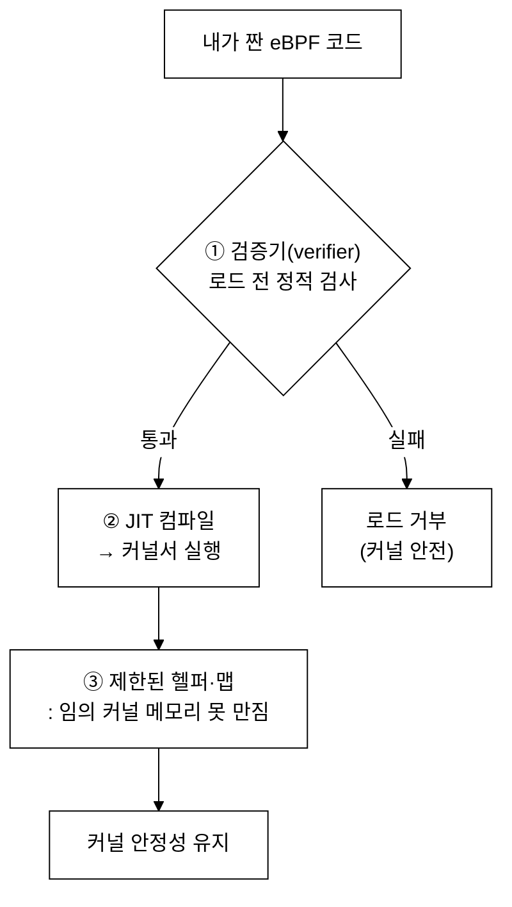
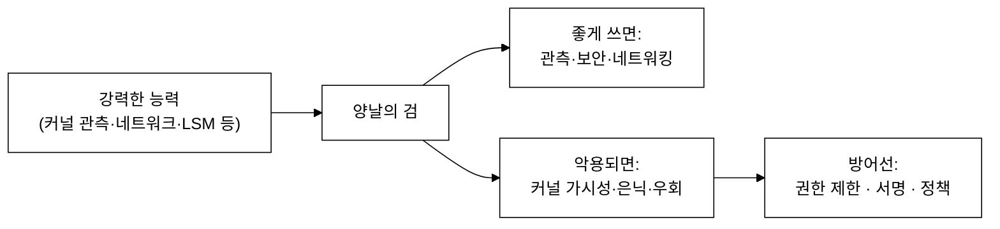
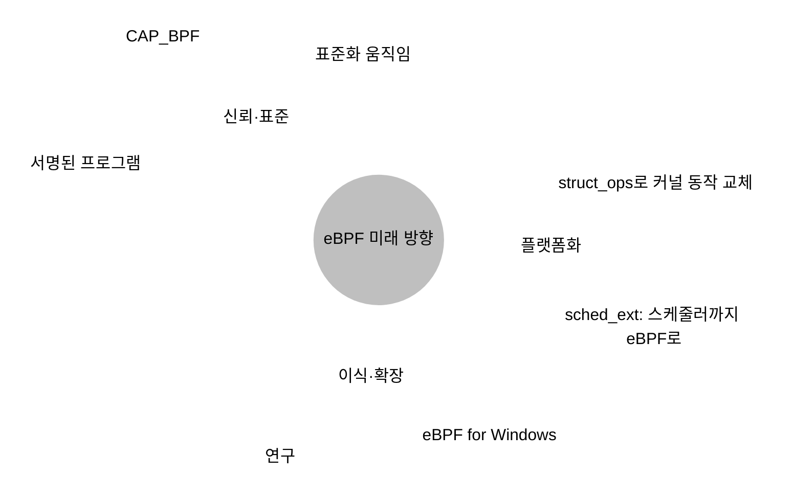
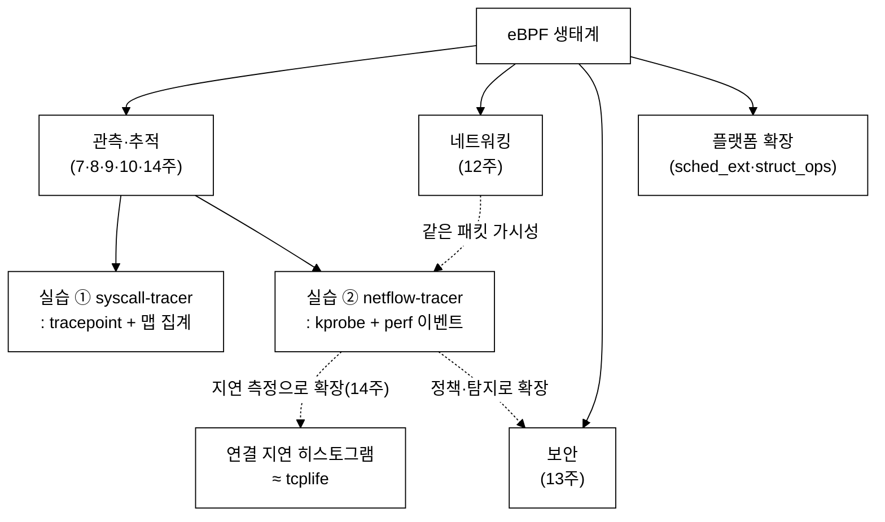
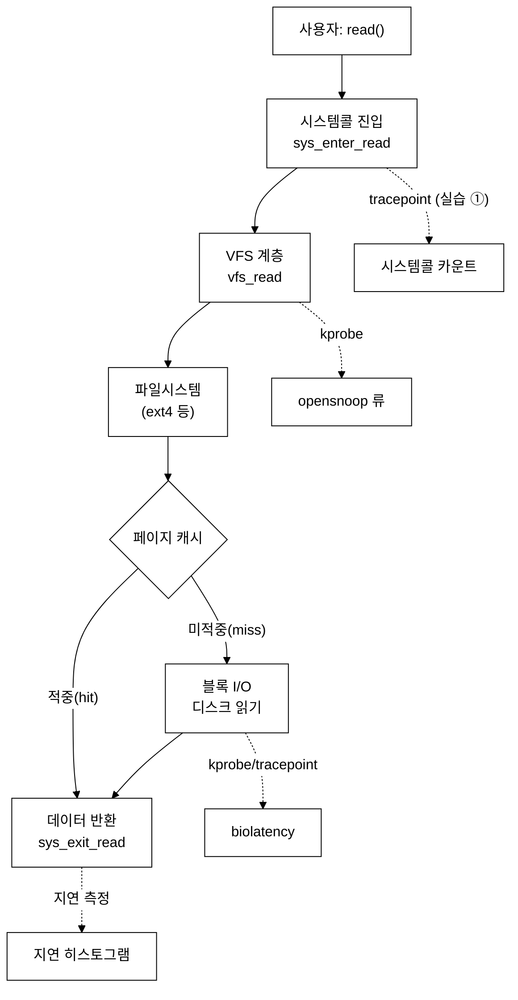
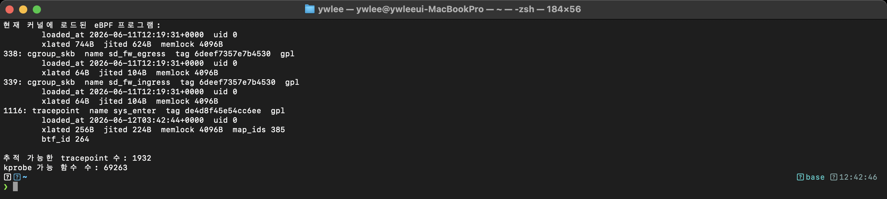

# 15주차 — 안전성·한계·미래와 정리
> eBPF가 "안전하다"는 말의 진짜 의미와 그 경계선을 정직하게 짚고, 한 학기를 하나의 지도로 묶는 마무리
last_updated: 2026-06-11

> 🧭 **이번 주 동선**  ·  📘 과목1 14주차 🟢 (요약·미니 프로젝트)  ·  📕 과목2 14주차 🔵 (안전성·sched_ext)
> - 🔬 **실습(VM `ssh ossca-ebpf`)**: `sudo bpftool feature probe` · 직접 만든 추적기 1개
> - 🧵 **OS 트랙 함께 보기**: —
> - ↔️ **이동**: ⬅️ [14주차 관측성·프로파일링](14주차_관측성과_성능분석_프로파일링.md) · 🏠 [강의 인덱스](README.md) · ➡️ 🎓 과정 끝 → [기말 프로젝트(과목2)](과목2_2학기_심화.md)

## 이번 주 학습 목표
- eBPF의 **안전성 보장**(검증기·제한된 헬퍼·맵)이 어떻게 커널을 지키는지 4주차 내용을 회고·정리한다.
- eBPF의 **한계**(검증기 복잡도, 무거운 연산, 커널 파편화, 가시성·디버깅의 어려움)를 비판적으로 평가한다.
- eBPF가 **강력한 만큼 공격면**이 될 수 있음을, 권한·서명 관점에서 이해한다.
- eBPF의 **미래 동향**(sched_ext·struct_ops, eBPF for Windows, 서명·표준화)을 일반적으로 알려진 수준에서 설명한다.
- 1~14주를 **한 장의 표**로 요약하고, 우리가 만든 두 추적기가 큰 그림 어디에 속하는지 위치 짓는다.
- **기말 프로젝트**로 가는 길을 잡고, 계속 공부할 자료·커뮤니티를 안다.

---

## 1. 안전성 보장 복습 — "안전하다"는 말의 실체 (4주차 회고)

1주차에서 eBPF의 세 약속을 **안전·재부팅 불필요·낮은 오버헤드**라 했다. 이 중 가장 신기한 것은 **안전**이다. "임의로 짠 코드를 커널 안에서 돌리는데 어떻게 안전한가?" 답은 세 겹의 방어선이다.



세 겹을 다시 정리하면 이렇다.

| 방어선 | 무엇을 막나 | 어떻게 |
|:---|:---|:---|
| **검증기(verifier)** | 무한 루프·미정의 동작·잘못된 메모리 접근 | 로드 전, 가능한 모든 실행 경로를 정적으로 따라가며 안전 증명 |
| **제한된 헬퍼(helpers)** | 임의의 커널 함수 호출 | eBPF는 커널이 **허락한 헬퍼 함수**만 호출 가능(맵 접근·시간 읽기·데이터 복사 등) |
| **맵(maps)** | 임의 메모리 읽기/쓰기·데이터 유출 | 커널·사용자 간 데이터 교환은 검증된 인터페이스인 **맵**으로만 |

핵심 직관: **eBPF 프로그램은 "무엇이든 할 수 있는" 코드가 아니라, "검증기가 안전을 증명할 수 있는 범위 안에서만" 도는 코드다.** 검증기는 비관적이라, 안전을 **증명하지 못하면** 그냥 거부한다. 그래서 "안전한데 거부당하는" 프로그램도 흔하다 — 이것이 곧 다음 절의 한계로 이어진다.

> 💬 우리 실습에서 이를 직접 겪었다. tracepoint(실습 ①)·kprobe(실습 ②)에 붙는 코드도 결국 검증기를 통과해야 로드됐다. "이 정도면 안전하지 않나?" 싶은 코드가 거부될 때, 그것은 커널이 위험해서가 아니라 **검증기가 그 안전을 증명하지 못해서**인 경우가 많다.

---

## 2. 한계 — 정직하게 짚기

eBPF는 강력하지만 만능이 아니다. 한계를 아는 것이 도구를 제대로 쓰는 길이다.

### 2.1 검증기 복잡도 한계 (크기·복잡도·루프)

검증기는 모든 실행 경로를 따라가며 안전을 증명한다. 그래서 프로그램이 커지거나 분기·루프가 복잡해지면 **검증해야 할 경로가 폭발**한다. 이를 막으려고 커널은 한도를 둔다.

- **명령어/복잡도 한도.** 검증기가 탐색하는 명령 수에 상한이 있다(커널 버전에 따라 값이 달라져 왔다). 너무 크고 복잡한 프로그램은 "too complex"로 거부될 수 있다.
- **루프 제약.** 초기 eBPF는 사실상 루프를 금지(언롤만 허용)했다. 이후 **유한성이 증명되는 bounded loop**가 허용되고, `bpf_loop` 같은 헬퍼로 루프를 표현하는 길도 생겼다. 그래도 **임의의 무한정 루프는 여전히 불가**다.
- **스택 크기 제한.** eBPF 프로그램의 스택은 작다(예: 512바이트 수준). 큰 버퍼는 스택이 아니라 맵에 둬야 한다.

> ⚠️ **"안전하지만 거부됨"의 흔한 원인.** 맵에서 읽은 포인터를 쓰기 전에 NULL 검사를 안 했거나, 인덱스가 배열 범위 안임을 검증기가 못 따라가는 경우다. 해결은 보통 "검증기가 이해할 수 있게" 명시적 경계 검사를 코드에 넣는 것이다.

#### 심화: 왜 "복잡도 상한"이 본질적 한계인가

검증기 한도가 단순히 "임의로 정한 숫자"가 아니라는 점을 짚어 두자. 검증기는 프로그램이 **어떤 입력에도 안전함**을 로드 **전에** 증명해야 한다. 그런데 분기가 하나 늘 때마다 따라가야 할 경로는 대략 **곱으로 늘어난다**(분기 n개면 최악 2ⁿ 갈래). 즉 안전 증명 비용은 프로그램 크기에 대해 지수적으로 폭발할 수 있다.

- 이를 막으려 커널은 탐색하는 명령 수에 **상한**을 두고, 그 안에 증명이 끝나지 않으면 `too complex` 로 거부한다(상태 가지치기·prune 같은 최적화가 있지만 상한 자체는 남는다).
- **그래서 이것은 버그가 아니라 설계상의 맞교환이다.** "임의 코드를 커널에서 안전하게 돌린다"는 약속을 지키려면, 증명 불가능할 만큼 복잡한 코드는 받지 않는 수밖에 없다. eBPF의 안전성과 "큰 프로그램 거부"는 **동전의 양면**이다.
- 실무적 함의: 큰 로직은 **여러 작은 프로그램으로 쪼개고**(필요하면 tail call/`bpf_loop` 활용), 무거운 가공은 사용자 공간으로 넘긴다(§2.2). "검증기를 이기려" 하기보다 "검증기가 이해하도록" 구조를 단순하게 짜는 것이 정석이다.

> 💡 한 줄로: **검증기의 복잡도 상한은 "eBPF가 무엇을 못 하는가"가 아니라 "왜 안전한가"의 다른 표현이다.** 무엇이든 받아 주는 검증기는 안전을 보장할 수 없다.

### 2.2 무거운 연산엔 부적합

eBPF는 **이벤트에 빠르게 반응**하도록 설계됐지, 무거운 계산을 돌리는 곳이 아니다.

- 복잡한 암호 연산, 대용량 데이터 가공, 긴 알고리즘은 검증기 한도·성능·실행 컨텍스트 제약에 부딪힌다.
- 일부 컨텍스트(예: 네트워크 핫패스, 인터럽트 문맥)에서는 **잠들거나 블로킹하는 동작이 금지**된다. 무거운 일은 eBPF에서 *간추려* 맵/링버퍼로 넘기고, **본격 처리는 사용자 공간**에서 한다. (실습 ②가 정확히 이 패턴 — 커널은 이벤트만 잡고 가공은 Python이 했다.)

### 2.3 커널 버전 파편화

eBPF의 기능·헬퍼·프로그램 타입은 **커널 버전마다 다르다**. 어떤 헬퍼는 5.x에서, 어떤 기능은 6.x에서 들어왔다. 그래서 "내 노트북에선 되는데 서버에선 안 되는" 일이 생긴다.

- 이 문제를 정면으로 푸는 것이 6·11주차의 **CO-RE(Compile Once – Run Everywhere)** 와 **BTF**다. 커널 자료구조 레이아웃을 BTF로 읽어, 로드 시점에 오프셋을 **재배치(relocation)** 해 한 바이너리가 여러 커널에서 돌게 한다.
- 그래도 **기능 자체가 없는 옛 커널**에서는 한계가 분명하다. CO-RE는 "구조체 레이아웃 차이"를 흡수할 뿐, "그 헬퍼가 아예 없는 커널"을 만들어 주진 못한다.

### 2.4 "모든 커널 함수를 안전하게 볼 수 있는 건 아니다"

kprobe로 거의 모든 커널 함수에 붙을 수 있지만, 거기엔 안정성·정확성의 함정이 있다.

- **내부 함수는 비공식 API다.** kprobe가 붙는 커널 내부 함수는 버전마다 이름·시그니처·존재 여부가 바뀐다(인라인되어 사라지기도). 그 위에 쌓은 추적기는 깨지기 쉽다. 그래서 가능하면 더 안정적인 **추적점(tracepoint)** 이나 안정 인터페이스를 선호한다.
- **인라인·최적화로 안 보이는 함수**가 있고, 일부 함수는 추적 부착이 막혀 있다(noinstr 등). "어디든 붙는다"는 과장이며, 현실엔 회색지대가 있다.

### 2.5 디버깅 난이도

eBPF 디버깅은 일반 프로그램보다 까다롭다.

- 검증기 거부 메시지는 길고 난해할 때가 많아, 어느 줄이 왜 막혔는지 읽어내는 데 숙련이 필요하다.
- 커널 문맥에서 도니 평범한 디버거를 붙이기 어렵고, `bpf_printk`(추적 로그)·맵 덤프 같은 간접 수단에 의존한다.
- 같은 코드가 커널 버전에 따라 검증 결과가 달라지기도 한다.

> 📌 **한계 한눈 정리**
>
> | 한계 | 한 줄 요약 | 완화책 |
> |:---|:---|:---|
> | 검증기 복잡도 | 크고 복잡하면 거부 | 작게 나누기, 명시적 경계 검사, `bpf_loop` |
> | 무거운 연산 | 핫패스 계산엔 부적합 | 커널은 추리고 사용자 공간서 처리 |
> | 커널 파편화 | 버전마다 기능 차이 | CO-RE·BTF(단, 없는 기능은 불가) |
> | 함수 가시성 | 내부 함수는 불안정·일부 불가 | 추적점·안정 인터페이스 선호 |
> | 디버깅 | 검증기 메시지·커널 문맥이 까다로움 | `bpf_printk`·맵 덤프·경험 |

---

## 3. eBPF 자체의 보안 고려

eBPF는 "커널을 안전하게 들여다본다"지만, **그 강력함 자체가 공격면**이 될 수 있다는 점은 균형 있게 봐야 한다.



- **권한.** eBPF 프로그램 로드는 보통 높은 권한이 필요하다(역사적으로 루트/`CAP_SYS_ADMIN`, 이후 `CAP_BPF` 등으로 세분화 시도). 권한 없는 사용자에게 eBPF를 여는 것은 신중해야 하며, 많은 배포판은 비특권 eBPF를 기본 비활성화하는 방향이다.
- **공격 도구로서의 eBPF.** 강력한 커널 가시성·후킹 능력은, 악의적으로 쓰이면 정보 탈취·은닉(루트킷)·우회에 동원될 수 있다는 우려가 연구·실무에서 제기돼 왔다. "관측 도구"이자 "잠재적 무기"인 셈이다.
- **그래서 서명·정책.** 무엇을 로드할 수 있는지 통제하려는 흐름이 있다. **서명된 eBPF 프로그램**(신뢰된 출처만 로드), 로드 정책(LSM·정책 엔진으로 eBPF 로드 자체를 감시), 능력 세분화 등이 그 방향이다. (세부 메커니즘은 커널 버전·배포판마다 다르므로 단정하지 말고 공식 문서로 확인하라.)

> 💬 13주차의 교훈과 연결된다. eBPF로 **위협을 탐지**(Falco·Tetragon)할 수 있다는 것은, 같은 능력이 **위협이 될 수도** 있다는 뜻이다. 그래서 "누가 eBPF를 로드할 수 있는가"를 통제하는 것이 보안의 출발점이다.

---

## 4. 미래 동향 — "관측 도구"에서 "커널 프로그래밍 플랫폼"으로

> ⚠️ 아래는 **일반적으로 알려진 방향**이다. 빠르게 변하는 영역이라 구체적 상태·일정은 단정하지 말고 공식 문서로 확인하라.

eBPF의 큰 흐름은 **"커널을 관측하는 도구"를 넘어 "커널 동작을 안전하게 프로그래밍하는 플랫폼"** 으로의 확장이다.



- **struct_ops — 커널 동작을 끼워 넣기.** 단순히 이벤트를 *보는* 것을 넘어, 커널이 정의한 연산 묶음(예: 혼잡 제어 알고리즘 등)을 **eBPF로 구현해 끼워 넣는** 메커니즘. eBPF가 "콜백 제공자"로서 커널 정책을 바꾸는 단계로 나아간다.
- **sched_ext — 스케줄러까지.** CPU **스케줄러**를 eBPF로 작성·실험할 수 있게 하는 흐름. 재부팅·커널 패치 없이 스케줄링 정책을 바꿔 보는, 한때 상상하기 어려웠던 영역이다. eBPF의 "안전한 커널 확장"이라는 약속이 가장 멀리 간 사례 중 하나로 자주 언급된다.
- **eBPF for Windows.** eBPF를 리눅스 밖으로 가져가려는 프로젝트. 같은 eBPF 프로그램 모델을 다른 OS에서도 쓰자는 시도로, eBPF가 특정 커널에 매인 기술을 넘어서려는 방향을 보여 준다.
- **신뢰·표준화.** §3의 연장선에서 **서명·권한 세분화**가 강화되는 흐름, 그리고 eBPF 명령어 집합·런타임을 **표준화**하려는 움직임(업계 단체 차원)이 있다. eBPF가 한 회사의 기능이 아니라 **공통 기반**으로 자리 잡아가는 신호다.

> 큰 그림: eBPF는 점점 **"안전하게 커널을 확장하는 표준 방법"** 이 되어 가고 있다. 우리가 배운 관측(추적·프로파일링)은 그 출발점이고, 네트워킹(12주)·보안(13주)·스케줄링(sched_ext)으로 영역이 넓어지는 중이다.

---

## 5. 과목 정리 — 1~14주를 한 장으로

### 5.1 한 학기 한 장 요약 표

| 주차 | 핵심 개념 | 한 줄 |
|:---:|:---|:---|
| [1](01주차_과목개요와_왜_eBPF인가.md) | 왜 eBPF인가 | 흥미로운 일은 커널 안에서 — 안전·무재부팅·저오버헤드로 관측 |
| [2](02주차_리눅스_커널과_사용자공간_시스템콜.md) | 커널·시스템콜 | 모든 외부 행동은 시스템콜로 커널을 거친다(공통 길목) |
| [3](03주차_BPF에서_eBPF로_역사와_등장배경.md) | BPF→eBPF 역사 | 패킷 필터가 범용 커널 실행 엔진으로 진화 |
| [4](04주차_eBPF_아키텍처_검증기_JIT_맵_헬퍼.md) | 아키텍처 | 검증기·JIT·맵·헬퍼 — "안전하게 돈다"의 실체 |
| [5](05주차_프로그램_타입과_부착지점.md) | 타입·부착 지점 | kprobe·tracepoint·XDP·LSM… 어디에 붙이나 |
| [6](06주차_개발환경_VM_BTF_CO-RE개념.md) | 개발환경·CO-RE | BTF로 커널 파편화를 넘어 한 번 짜 여러 곳서 |
| [7](07주차_bpftrace_입문.md) | bpftrace | 가장 빠르게 커널을 들여다보는 한 줄 추적 |
| [8](08주차_BCC_입문_맵과_perf이벤트.md) | BCC | 맵·perf 이벤트로 Python+C 추적기 작성 |
| [9](09주차_실습1_시스템콜_추적기.md) | **실습 ①** | tracepoint + **맵 집계**로 PID별 시스템콜 카운트·자기검증 |
| [10](10주차_실습2_네트워크_연결_추적기.md) | **실습 ②** | kprobe + **perf 이벤트**로 TCP 연결 실시간 추적 |
| [11](11주차_libbpf와_CO-RE_프로덕션eBPF.md) | libbpf·CO-RE | 실제 제품이 eBPF를 배포하는 법 |
| [12](12주차_eBPF_네트워킹_XDP_tc_Cilium.md) | 네트워킹 | XDP·tc로 패킷 최전선 처리, Cilium |
| [13](13주차_eBPF_보안_LSM_Falco_Tetragon.md) | 보안 | LSM·Falco·Tetragon으로 런타임 위협 탐지 |
| [14](14주차_관측성과_성능분석_프로파일링.md) | 관측·성능 | On/Off-CPU·지연 히스토그램·USDT로 느림의 원인 추적 |

### 5.2 우리가 만든 두 추적기는 큰 그림에서 어디에?



두 추적기는 작지만 **eBPF의 두 가지 데이터 전달 패턴**을 모두 담은 축소판이었다.

- **실습 ① (syscall-tracer)** — *추적점 + 맵 집계*. 커널 안에서 합산해 가끔만 읽어 가는 **저오버헤드 통계** 방식. 14주의 히스토그램·지속적 프로파일링이 이 패턴의 확장이다.
- **실습 ② (netflow-tracer)** — *kprobe + perf 이벤트*. 개별 사건을 실시간 스트림으로 받는 방식. 12주(네트워킹)·13주(보안 탐지)로 자연스럽게 이어지고, 14주에서 본 대로 **연결 지연 측정**으로도 확장된다(`tcplife` 방향).

> 즉, 우리는 "장난감"을 만든 게 아니라 **Cilium·Falco·BCC tools가 쓰는 바로 그 기법들**의 핵심을 손으로 구현하고, 더 중요하게는 **자기검증 하네스로 정확성을 스스로 증명**했다.

### 5.3 기말 프로젝트로 가는 길

[강의 인덱스 README §3](README.md#3-평가-상세)의 기말 프로젝트 예시를, 이번 학기 개념과 짝지어 본다.

| 기말 프로젝트 예시 | 토대가 된 주차 | 확장 포인트 |
|:---|:---|:---|
| 파일 접근 감사기(openat + 화이트리스트) | 9·13주 | 실습 ① 패턴에 정책 위반 경보 추가 |
| 프로세스 실행 감시기(execsnoop 류) | 9·14주 | execve 추적점 + argv 수집(§14 execsnoop) |
| DNS/HTTP 요청 추적기(uprobe/소켓 필터) | 10·12·14주 | 애플리케이션 레벨 가시성(USDT/uprobe) |
| 시스템콜 지연 히스토그램 | 14주 | `bpf_ktime` + log2 히스토그램(§14.4 그대로) |
| 컨테이너 인지 추적기(cgroup ID) | 10·12·13주 | 실습 ②에 cgroup 식별 더하기 |

> **모든 기말 프로젝트의 공통 요구**: 두 실습처럼 **자기검증 하네스(의도한 동작 ↔ 관측 결과 비교)** 를 포함할 것. "동작하는 것 같다"가 아니라 **"정확히 동작함을 코드로 증명"** 하는 것이 이 과목의 핵심 가치다.

### 5.4 계속 공부할 자료·커뮤니티

- 교재: Brendan Gregg, *BPF Performance Tools* / Liz Rice, *Learning eBPF*
- 공식: [ebpf.io](https://ebpf.io), Cilium BPF Reference Guide, 커널 `Documentation/bpf/`
- 도구 저장소: [BCC](https://github.com/iovisor/bcc), [bpftrace](https://github.com/bpftrace/bpftrace), [libbpf](https://github.com/libbpf/libbpf)
- 커뮤니티: eBPF Summit·관련 컨퍼런스 발표(영상), 각 프로젝트 Slack/메일링리스트, eBPF Foundation 자료
- 손으로 더: [실습 랩 README](../../README.md)의 두 프로젝트를 변형·확장하며 검증 하네스를 직접 늘려 보기

---

## ⚙️ 리눅스 커널은 read() 한 번을 어떻게 처리하나 — 한 학기의 회고

한 학기 동안 본 것을 커널 관점에서 되짚어 보자. 사용자가 `read()` 를 한 번 부르면, 그 한 번의 호출은 **시스템콜 진입 → VFS(가상 파일시스템) → 구체 파일시스템 → 블록 I/O → 페이지 캐시**라는 긴 커널 경로를 지난다. 우리는 이 경로의 **거의 모든 길목에 eBPF 를 붙여** 관찰하는 법을 배웠다. tracepoint 로 시스템콜 양 끝을, kprobe 로 내부 함수를, 그리고 맵·perf 이벤트로 그 결과를 모았다. 즉 "커널은 닫힌 블랙박스"가 아니라, 길목마다 우리가 센서를 꽂을 수 있는 투명한 경로였다.



소스/구조: 이 경로는 커널 `fs/read_write.c`(VFS), 각 파일시스템 `fs/`, 블록 계층 `block/` 에 걸쳐 있고, 각 지점의 추적점·함수에 eBPF 를 붙인다.

---

## 📸 실제 실행 화면 (실제 터미널 캡처)

> 아래는 VM(커널 6.17 aarch64)에서 **실제 터미널에서 실행해 그대로 캡처**한 화면이다.



지금 커널에 올라가 있는 eBPF 프로그램들과, 붙일 수 있는 추적점·kprobe 의 방대한 수가 보인다. "커널 전체가 관측 가능하다"는 이 과목의 결론을 한 장으로 보여 준다.

---

## 💡 핵심 요약
- eBPF의 안전성은 **검증기(로드 전 정적 증명) + 제한된 헬퍼 + 맵**의 세 겹이다. 핵심은 "안전을 **증명하지 못하면 거부**"하는 비관적 설계다.
- 한계는 정직해야 한다: **검증기 복잡도/루프/스택 제약**, **무거운 연산 부적합**, **커널 파편화(CO-RE로 완화하나 없는 기능은 불가)**, **내부 함수 가시성의 불안정**, **까다로운 디버깅**.
- eBPF의 강력함은 **양날의 검**이라, **권한 제한·서명·정책**으로 "누가 로드하는가"를 통제하는 것이 보안의 출발점이다.
- 미래는 **관측 도구 → 커널 프로그래밍 플랫폼**: struct_ops·**sched_ext**(스케줄러), **eBPF for Windows**, 서명·표준화로 확장 중(단정 금지, 공식 문서 확인).
- 우리가 만든 두 추적기는 eBPF의 **두 데이터 패턴(맵 집계 / perf 이벤트)** 축소판이며, 실무 도구들과 같은 기법 위에 **자기검증**을 더한 것이다.
- 기말 프로젝트는 학기 개념의 종합이며, **자기검증 하네스로 정확성을 증명**하는 것이 필수다.

---

## ✍️ 연습문제
1. eBPF의 안전성 세 겹(검증기·제한된 헬퍼·맵)이 각각 어떤 종류의 위험을 막는지 짝지어 설명하라.
2. "검증기는 안전한 프로그램도 거부할 수 있다"는 명제가 왜 모순이 아닌지, 검증기의 비관적 설계로 설명하라.
3. eBPF의 루프 제약이 초기와 지금 어떻게 달라졌는지(언롤 → bounded loop/`bpf_loop`) 정리하고, 여전히 불가능한 것은 무엇인지 쓰라.
4. CO-RE/BTF가 "커널 파편화"를 어디까지 해결하고 어디서부터 못 하는지 구체적으로 구분하라.
5. kprobe로 커널 내부 함수에 붙는 추적기가 깨지기 쉬운 이유 두 가지를 들고, 더 안정적인 대안을 제시하라.
6. "eBPF는 관측 도구이자 잠재적 무기다"라는 말의 의미를, 권한·서명 관점의 방어책과 함께 서술하라.
7. sched_ext와 struct_ops가 보여 주는 "관측 → 플랫폼" 전환이 왜 의미 있는지, 1주차의 "안전한 커널 확장"과 연결해 논하라.
8. 자신이 만들 기말 프로젝트 주제를 하나 고르고, (a) 토대가 된 주차, (b) 부착 지점, (c) 자기검증 방법을 설계하라.

---

## 🛠 실습 과제 — 종합: "커널 전체가 관측 가능하다"를 손으로 확인하고, 내 추적기를 설계한다

> 한 학기의 마무리 실습이다. 새 개념을 익히기보다 **지금까지 배운 것을 한 자리에 모아** 확인하고, 기말 프로젝트의 출발선을 긋는다. eBPF 로드 권한 때문에 **VM 안에서 `sudo`** 로 실행한다.

```bash
# VM 켜고 접속 (Mac 터미널)
tart run ossca-ebpf-work --no-graphics &
until ssh ossca-ebpf 'true' 2>/dev/null; do echo "부팅 대기..."; sleep 2; done
ssh ossca-ebpf
```

### 과제 A — "관측 가능한 커널"을 수치로 보기

- **목표:** 지금 커널에 올라간 eBPF 프로그램과, 붙일 수 있는 추적점·kprobe 의 **방대한 수**를 직접 세어, 이 과목의 결론("커널 전체가 관측 가능하다")을 한 화면으로 확인한다.
- **명령:**

```bash
# (1) 현재 로드된 eBPF 프로그램 목록 (타입·이름·부착 정보)
sudo bpftool prog show

# (2) 붙일 수 있는 '안정 추적점(tracepoint)' 의 수
sudo cat /sys/kernel/debug/tracing/available_events | wc -l

# (3) kprobe 로 붙일 수 있는 커널 함수의 대략적 수
sudo cat /sys/kernel/debug/tracing/available_filter_functions | wc -l
#   ※ 경로가 막히면 /sys/kernel/tracing/ 아래도 확인. bpftool 이 없으면 apt 로 bpftool 설치.
```

- **관찰:** 추적점이 수백~수천 개, kprobe 가능 함수가 수만 개 수준으로 나오는가? §1에서 본 "검증기 위에서 안전하게 도는" 프로그램들이 `bpftool prog show` 에 실제로 떠 있는가? (실습 ①·② 를 돌려 둔 채 다른 창에서 (1)을 실행하면 내 프로그램이 목록에 보인다.)
- **질문:** "거의 모든 커널 함수에 붙을 수 있다"는 이 방대함과, §2.4에서 짚은 "내부 함수는 비공식 API라 깨지기 쉽다"는 경고는 어떻게 양립하는가?

### 과제 B — 기말 미니프로젝트 설계 (직접 추적기 1개)

- **목표:** §5.3 표의 예시 중 하나(또는 자기 주제)를 골라, **부착 지점 + 데이터 패턴 + 자기검증 하네스**까지 한 장으로 설계한다. 구현 전 "설계도"를 먼저 쓰는 것이 이 과제의 핵심이다.
- **절차:**

```text
1) 주제 선택 (예시 — §5.3 참고)
   · 파일 접근 감사기(openat + 화이트리스트)        → 토대 9·13주
   · 프로세스 실행 감시기(execsnoop 류, argv 수집)   → 토대 9·14주
   · 시스템콜 지연 히스토그램(bpf_ktime + log2)      → 토대 14주
   · 비정상 목적지 연결 탐지기(tcp connect + 목록)   → 토대 10·13주

2) 설계 4요소를 표로 적는다
   · 부착 지점:   어떤 tracepoint / kprobe / LSM 훅인가? (왜 그것인가)
   · 데이터 패턴: 맵 집계(저오버헤드 통계) vs perf/ring 이벤트(실시간 스트림) — 왜?
   · 컨텍스트:    무엇으로 "누가/어디서"를 식별하나(PID·comm·cgroup)?
   · 출력:        카운트표 / 히스토그램 / 이벤트 로그 중 무엇?

3) 자기검증 하네스 설계 (필수)
   · "내가 의도적으로 일으킨 동작" ↔ "추적기가 잡은 것" 을 비교하는 스크립트
   · 예: 파일 N번 열기 → 추적기 카운트가 N인지 assert
```

- **시작점:** `~/ebpf-labs/labs/` 와 `~/ebpf-labs/examples/` 의 가까운 예제를 골라 복제한 뒤 변형하고, `~/ebpf-labs/projects/` 아래에 작업 폴더를 만들어 둔다.

```bash
ls ~/ebpf-labs/labs/ ~/ebpf-labs/examples/ ~/ebpf-labs/projects/
```

- **관찰/질문:** 내 주제는 **맵 집계**(실습 ① 결)인가 **perf 이벤트**(실습 ② 결)인가? 자기검증 하네스에서 "통과"의 기준을 숫자로 못 박을 수 있는가? (못 박을 수 없다면 주제·측정을 더 좁혀라.)

> **제출물(권장):** 과제 A의 세 수치 캡처 + 과제 B의 설계 4요소 표와 자기검증 계획(반쪽 분량). 구현까지 했다면 "의도한 동작 ↔ 관측 결과"가 일치함을 보이는 검증 출력.

### 과제 C(회고) — 가장 유용했던 도구

- **목표:** 한 학기 동안 만난 도구(bpftrace 원라이너 · BCC tools 128종 · 손으로 만든 두 추적기 · `bpftool` 등) 중 **자신에게 가장 유용했던 하나**를 고르고, **왜** 그런지 한 문단으로 적는다.
- **생각의 갈래(예시):** 가장 빠르게 답을 준 도구는? 가장 깊이 이해하게 해 준 도구는? 실무에서 가장 먼저 켤 도구는? — 셋의 답이 다를 수 있다. 그 차이 자체가 회고의 핵심이다.

---

## ✅ 자가점검 퀴즈
**Q1.** eBPF의 안전성을 떠받치는 세 겹의 방어선은?
<details><summary>정답</summary>
① 검증기(로드 전 정적 안전 증명), ② 제한된 헬퍼(허락된 함수만 호출), ③ 맵(검증된 인터페이스로만 데이터 교환). 이 셋이 임의 커널 메모리 접근·무한 루프·임의 함수 호출을 막는다.
</details>

**Q2.** 검증기가 어떤 프로그램을 "too complex"로 거부하는 근본 이유는?
<details><summary>정답</summary>
검증기는 모든 실행 경로를 따라가며 안전을 증명하는데, 프로그램이 크거나 분기·루프가 복잡하면 탐색할 경로가 폭발해 명령어/복잡도 한도를 넘기기 때문이다. 안전을 **증명하지 못하면** 거부한다.
</details>

**Q3.** "무거운 연산은 eBPF에 부적합하다"가 실무에서 권장하는 패턴은?
<details><summary>정답</summary>
커널의 eBPF에서는 **이벤트를 간추려** 맵/링버퍼로 넘기고, **본격적인 가공·계산은 사용자 공간**에서 한다. 실습 ②가 이 패턴(커널은 이벤트만, Python이 가공)이다.
</details>

**Q4.** CO-RE/BTF가 해결하지 *못하는* 파편화는 무엇인가?
<details><summary>정답</summary>
구조체 레이아웃 차이는 재배치로 흡수하지만, **그 기능·헬퍼·프로그램 타입 자체가 없는 옛 커널**은 해결하지 못한다. CO-RE는 레이아웃을 맞춰 줄 뿐 없는 기능을 만들어 주진 않는다.
</details>

**Q5.** eBPF 로드를 통제하려는 보안 방향 두 가지를 들라.
<details><summary>정답</summary>
서명된 eBPF 프로그램(신뢰된 출처만 로드 허용)과 권한 세분화(`CAP_SYS_ADMIN`→`CAP_BPF` 등), 그리고 로드 자체를 감시하는 정책(LSM/정책 엔진). 비특권 eBPF 기본 비활성화도 같은 맥락이다.
</details>

**Q6.** 우리가 만든 두 추적기가 각각 보여 준 "eBPF의 데이터 전달 패턴"은?
<details><summary>정답</summary>
실습 ①(syscall-tracer)은 **맵 집계**(커널서 합산 후 가끔 읽기, 저오버헤드 통계), 실습 ②(netflow-tracer)는 **perf 이벤트**(개별 사건 실시간 스트림). 14주의 히스토그램은 ①의, 보안·네트워킹 확장은 ②의 연장선이다.
</details>

---

## 📚 더 읽을거리
- 커널 문서 `Documentation/bpf/` — 검증기·헬퍼·프로그램 타입의 1차 자료
- eBPF Foundation / [ebpf.io](https://ebpf.io) — 표준화·로드맵·보안 관련 글
- sched_ext, struct_ops 관련 커널·프로젝트 문서(최신 상태는 공식 문서로 확인)
- eBPF for Windows 프로젝트 문서 — 비-리눅스 확장 시도
- Brendan Gregg, *BPF Performance Tools* / Liz Rice, *Learning eBPF* — 종합 복습용

---

## 🎓 과목을 마치며

한 학기 동안 우리는 "지금 이 컴퓨터, 뭐 하고 있어?"라는 1주차의 질문에서 출발했다. 그 답을 찾기 위해 커널과 시스템콜의 토대(1~5주)를 다지고, bpftrace·BCC·libbpf라는 도구(6~8·11주)를 익혔으며, **두 개의 추적기를 직접 만들고 그 정확성을 코드로 증명**(9~10주)했다. 그리고 네트워킹·보안·관측성(12~14주)으로 시야를 넓힌 뒤, 오늘 eBPF의 **안전성과 한계, 그리고 미래**를 정직하게 마주했다.

여러분이 가져가야 할 단 하나를 꼽자면 이것이다. **eBPF는 "마법"이 아니라 "검증 가능한 안전성 위에 선 공학"** 이라는 점. 검증기가 안전을 증명할 수 있는 만큼만 강력하고, 그 경계를 아는 사람이 그것을 잘 쓴다. 그리고 우리 실습이 일관되게 강조한 **"동작하는 것 같다"가 아니라 "정확히 동작함을 증명한다"** 는 태도는, eBPF를 넘어 모든 시스템 소프트웨어를 다루는 자세다.

이제 기말 프로젝트로 여러분의 추적기를 만들 차례다. 작게 시작하되, **자기검증을 잊지 말라.** 커널은 더 이상 들여다볼 수 없는 블랙박스가 아니다 — 여러분에겐 그 안을 안전하게 비추는 도구와, 그것을 만들 줄 아는 손이 생겼다.

수고 많았습니다. 🎓
