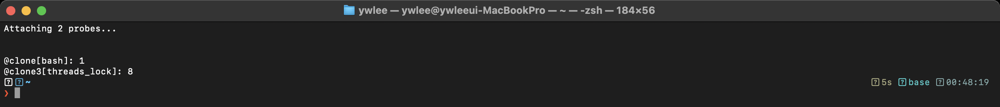

# [2부 병행성] C1 · 스레드와 API (OSTEP 26–27장)

> OSTEP는 "스레드란 한 프로세스 안의 여러 실행 흐름"이라고 가르칩니다. 그런데 리눅스에서 그 스레드는 **실제로 무엇으로 만들어질까요?** eBPF로 `clone()` 시스템콜을 잡아 직접 확인합니다.

last_updated: 2026-06-12

> 🔰 입문자: [용어집](../00c_용어집_약어사전.md) · [C 미니부록](../00b_준비_C언어_미니부록.md)

---

## 이 모듈에서 배우는 것 (OSTEP ↔ eBPF)

| OSTEP 개념 | OSTEP에서 배우는 법 | eBPF로 관찰 |
|:---|:---|:---|
| 스레드 = 같은 주소공간을 공유하는 여러 실행 흐름 | 26장 본문 + `threads-intro` 시뮬레이터(`x86.py`) | 스레드 생성 = `clone()`/`clone3()` 시스템콜임을 실측 (`c1_clone.png`) |
| `pthread_create` / `pthread_join` API | 27장 본문 + `threads-api`의 실제 C 코드 | `pthread_create` 호출이 커널 `clone` 호출로 내려감을 카운트로 확인 |
| 스택은 스레드마다 따로, 힙·전역은 공유 | 27장 그림(주소공간 배치) | 같은 PID(=TGID) 아래 여러 TID가 한 주소공간을 공유 |

---

## 1. 스레드란 무엇인가 — "또 하나의 실행 흐름"

### 📖 OSTEP에서는 (OSTEP 26장)

OSTEP 26장은 **스레드**를 이렇게 소개합니다. 하나의 프로세스 안에 PC(프로그램 카운터)와 레지스터, 그리고 **자기만의 스택**을 가진 실행 흐름이 여러 개 있는 것. 프로세스가 여러 개일 때와 비슷하지만, 결정적 차이는 **주소공간을 공유**한다는 점입니다.

- 각 스레드는 **자기 스택**을 가진다 (지역변수는 안전).
- **코드·전역변수·힙은 공유**한다 (그래서 동기화가 필요해진다 → C2 모듈).
- 문맥 교환 시 레지스터를 저장/복원하지만, 페이지 테이블(주소공간)은 **바꾸지 않는다** → 프로세스 전환보다 싸다.

OSTEP는 이 개념을 코드 없이 먼저 **시뮬레이터**로 체감하게 합니다.

```bash
# (VM 안에서) ~/ostep-homework/threads-intro
cd ~/ostep-homework/threads-intro
# 두 스레드가 공유 변수를 번갈아 갱신할 때, 인터리빙에 따라 결과가 달라짐을 추적
./x86.py -p loop.s -t 2 -i 100 -r -c
```

> `x86.py`는 가짜 어셈블리로 **스레드 인터리빙(끼어들기)** 만 보여주는 도구입니다. "왜 결과가 들쭉날쭉한가"는 C2 모듈의 데이터 레이스로 이어집니다.

### 🔬 eBPF로는 (실측)

OSTEP는 "스레드가 생긴다"고 말하지만, **리눅스 커널 입장에서 스레드 생성은 `clone()` 시스템콜 한 번**입니다. 프로세스 생성(`fork`)과 같은 시스템콜을 쓰되, **무엇을 공유할지 플래그로 지정**하는 것이 차이입니다. glibc의 `pthread_create`는 내부에서 `CLONE_VM | CLONE_FS | CLONE_FILES | CLONE_SIGHAND | CLONE_THREAD ...` 플래그를 켠 `clone3()`을 호출합니다. (`CLONE_VM`이 바로 "주소공간 공유"입니다.)

8개의 스레드를 만드는 프로그램을 돌리면서, `clone`/`clone3` 시스템콜이 몇 번 일어나는지 셉니다.

```bash
# (VM 안에서, eBPF는 sudo)
sudo bpftrace -e '
tracepoint:syscalls:sys_enter_clone  { @clone[comm]  = count(); }
tracepoint:syscalls:sys_enter_clone3 { @clone3[comm] = count(); }'
# 다른 터미널에서 8스레드 프로그램 실행
```



*위 이미지는 VM(커널 6.17)에서 직접 찍은 실제 터미널 캡처입니다.* 8개의 스레드를 만드는 프로그램에서 `@clone3[프로그램이름]`이 **약 8회** 잡힙니다. (메인 스레드를 제외한 워커 스레드 수만큼입니다.) 즉 OSTEP가 추상적으로 "스레드를 만든다"고 한 그 동작이, 커널에서는 **시스템콜 한 번 = 스레드 하나**로 1:1 대응합니다.

> 배포판/glibc 버전에 따라 `clone`로 잡히기도, `clone3`로 잡히기도 합니다. 두 트레이스포인트를 모두 거는 이유입니다. 둘 다 0이면 그 프로그램은 스레드를 안 만든 것입니다.

### 🛠 직접 해보기

1. 위 bpftrace를 켠 채로, 스레드 개수를 4 → 8 → 16으로 바꿔 가며 프로그램을 실행해 보세요. `@clone3` 값이 스레드 수에 따라 변하나요?
2. `fork()`를 쓰는 프로그램(예: 셸에서 `ls`)을 실행하면 같은 트레이스포인트에 잡힐까요? `sys_enter_clone`에 `comm`을 추가해 직접 확인하세요. (힌트: `fork`도 내부적으로 `clone`을 씁니다.)

---

## 2. 스레드 API — `pthread_create` / `pthread_join`

### 📖 OSTEP에서는 (OSTEP 27장)

27장은 **POSIX 스레드(pthread) API**를 다룹니다. 핵심은 두 함수입니다.

```c
#include <pthread.h>

// 새 스레드를 만들고, start_routine 부터 실행시킨다
int pthread_create(pthread_t *thread, const pthread_attr_t *attr,
                   void *(*start_routine)(void *), void *arg);

// 해당 스레드가 끝날 때까지 기다리고, 반환값을 받는다
int pthread_join(pthread_t thread, void **value_ptr);
```

OSTEP가 강조하는 것:

- `pthread_create`의 4번째 인자 `arg`로 **데이터를 넘긴다**. 여러 값은 구조체 포인터로 묶어 전달한다.
- `pthread_join` **없이** 메인이 먼저 끝나면, 워커 스레드의 결과를 못 본다 → 항상 join으로 동기화한다.
- 스택 지역변수의 주소를 스레드 인자로 넘길 때 **수명(lifetime)** 을 조심하라(흔한 버그).

`threads-api` 숙제 디렉터리에는 시뮬레이터가 아니라 **실제 C 코드**가 들어 있습니다(`main-race.c` 등). 직접 컴파일해 돌립니다.

```bash
# (VM 안에서) ~/ostep-homework/threads-api
cd ~/ostep-homework/threads-api
gcc -o main-race main-race.c -Wall -pthread
./main-race
```

### 🔬 eBPF로는 (실측)

`pthread_create`는 **라이브러리 함수**이지 시스템콜이 아닙니다. 그래서 시스템콜 추적만으로는 "라이브러리 호출 → 커널 진입"의 경계가 안 보입니다. 두 층위를 나란히 보면 이렇게 대응합니다.

```mermaid
%%{init: {"theme":"base","themeVariables":{"background":"#ffffff","primaryColor":"#ffffff","primaryBorderColor":"#000000","primaryTextColor":"#000000","secondaryColor":"#ffffff","secondaryBorderColor":"#000000","secondaryTextColor":"#000000","tertiaryColor":"#ffffff","tertiaryBorderColor":"#000000","tertiaryTextColor":"#000000","lineColor":"#000000","textColor":"#000000","mainBkg":"#ffffff","secondBkg":"#ffffff","clusterBkg":"#ffffff","clusterBorder":"#000000","edgeLabelBackground":"#ffffff","nodeBorder":"#000000","defaultLinkColor":"#000000","titleColor":"#000000","actorBkg":"#ffffff","actorBorder":"#000000","actorTextColor":"#000000","actorLineColor":"#000000","signalColor":"#000000","signalTextColor":"#000000","labelBoxBkgColor":"#ffffff","labelBoxBorderColor":"#000000","labelTextColor":"#000000","loopTextColor":"#000000","noteBkgColor":"#ffffff","noteBorderColor":"#000000","noteTextColor":"#000000","activationBkgColor":"#ffffff","activationBorderColor":"#000000","sequenceNumberColor":"#000000","cScale0":"#ffffff","cScale1":"#ffffff","cScale2":"#ffffff","cScale3":"#ffffff","cScale4":"#ffffff","cScale5":"#ffffff","cScale6":"#ffffff","cScale7":"#ffffff","cScale8":"#ffffff","cScale9":"#ffffff","cScale10":"#ffffff","cScale11":"#ffffff","cScaleLabel0":"#000000","cScaleLabel1":"#000000","cScaleLabel2":"#000000","cScaleLabel3":"#000000","cScaleLabel4":"#000000","cScaleLabel5":"#000000","cScaleLabel6":"#000000","cScaleLabel7":"#000000","cScaleLabel8":"#000000","cScaleLabel9":"#000000","cScaleLabel10":"#000000","cScaleLabel11":"#000000","pie1":"#ffffff","pie2":"#eeeeee","pie3":"#dddddd","pie4":"#cccccc","fontFamily":"Georgia, serif"}}}%%
flowchart LR
    APP["내 프로그램\npthread_create()"] -->|"libc(uprobe로 관찰 가능)"| LIBC["glibc: 스택 할당 후\nclone3(CLONE_VM|...) 호출"]
    LIBC -->|"시스템콜(tracepoint로 관찰)"| K["커널: 새 task_struct 생성\n같은 주소공간 공유"]
    K --> NEWT["새 커널 스레드(TID)\n= 새 실행 흐름"]
```



- **사용자공간 층** `pthread_create`: glibc의 uprobe로 잡을 수 있습니다.

  ```bash
  # libc 안의 pthread_create 진입을 카운트 (경로는 VM에 따라 다를 수 있음)
  sudo bpftrace -e 'uprobe:/lib/x86_64-linux-gnu/libc.so.6:pthread_create { @[comm] = count(); }'
  ```

- **커널 층** 실제 스레드 생성: 1절에서 본 `clone3` 시스템콜 (`c1_clone.png`).

이상적으로는 **uprobe로 잡은 `pthread_create` 횟수 ≈ tracepoint로 잡은 `clone3` 횟수**가 됩니다. "라이브러리 호출 1번이 시스템콜 1번으로 내려간다"는 것을, 두 탐침을 동시에 걸어 눈으로 확인할 수 있습니다.

> 우리 데모 프로그램 `threads_lock.c`는 OSTEP `threads-api`의 `main-race.c`를 **여러 스레드 + 반복 루프**로 확장한 것입니다. C2 모듈에서 락 경합을 만들 때 다시 씁니다.

### 🛠 직접 해보기

1. uprobe(`pthread_create`)와 tracepoint(`clone3`)를 **한 bpftrace 명령**에 함께 걸고, 8스레드 프로그램에서 두 카운트가 같은지 비교하세요.
2. `pthread_join`을 일부러 빼면 어떤 일이 생기나요? (워커가 다 끝나기 전에 메인이 종료 → 결과 유실) 직접 코드를 고쳐 출력 차이를 관찰하세요.

---

## 💡 핵심 요약 — OSTEP ↔ eBPF 대조표

| 질문 | OSTEP의 설명 | eBPF로 본 실제 |
|:---|:---|:---|
| 스레드는 무엇인가 | 주소공간을 공유하는 별도 실행 흐름 | 같은 TGID 아래 여러 TID, `CLONE_VM`으로 묶임 |
| 어떻게 생기나 | `pthread_create` 호출 | glibc가 `clone3()` 시스템콜을 1회 호출 (`c1_clone.png`) |
| 프로세스와 차이 | 페이지 테이블을 공유한다 | `fork`와 같은 `clone` 시스템콜, 단 공유 플래그가 다름 |
| 왜 동기화가 필요한가 | 힙·전역을 공유하니까 | (C2에서 데이터 레이스로 실증) |

---

## ✅ 자가점검 퀴즈

<details>
<summary>Q1. 리눅스에서 새 스레드를 만들 때 호출되는 시스템콜은?</summary>

`clone()` 또는 최신 glibc에서는 `clone3()`. 프로세스를 만드는 `fork`와 같은 계열의 시스템콜이지만, `CLONE_VM` 등 **공유 플래그**를 켜서 주소공간을 공유하게 한다.
</details>

<details>
<summary>Q2. `pthread_create`는 시스템콜인가, 라이브러리 함수인가? eBPF로 어떻게 각각 관찰하나?</summary>

`pthread_create`는 **glibc 라이브러리 함수**다. 사용자공간 함수이므로 **uprobe**로 관찰하고, 그것이 내부에서 부르는 **`clone3` 시스템콜**은 **tracepoint**로 관찰한다. 둘의 호출 횟수가 거의 같아야 정상이다.
</details>

<details>
<summary>Q3. 스레드 8개를 만드는 프로그램에서 `@clone3` 카운트가 대략 8인 이유는?</summary>

메인 스레드는 이미 존재하므로, **새로 만드는 워커 스레드 수만큼** `clone3`이 호출된다. (메인을 제외하면 보통 워커 수와 일치한다.)
</details>

---

## 📚 더 읽을거리

- OSTEP 한국어판 26장(스레드 소개)·27장(스레드 API)
- `man 2 clone`, `man 2 clone3` — 공유 플래그(`CLONE_VM`, `CLONE_THREAD` 등) 의미
- [4주차 — eBPF 아키텍처·검증기·JIT·맵·헬퍼](../04주차_eBPF_아키텍처_검증기_JIT_맵_헬퍼.md): tracepoint/uprobe가 어떻게 동작하는지
- [14주차 — 관측성과 성능분석·프로파일링](../14주차_관측성과_성능분석_프로파일링.md): 스레드/스케줄링 관측의 응용

---

## ⏭ 다음 모듈

[C2 · 락·동기화 그리고 버그](C2_락_동기화_그리고_버그.md) — 공유 변수를 여러 스레드가 건드릴 때 생기는 **데이터 레이스**를 눈으로 보고, 락 경합이 커널 `futex` 시스템콜로 드러나는 과정을 추적합니다.
