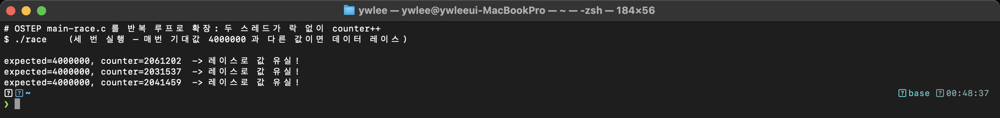
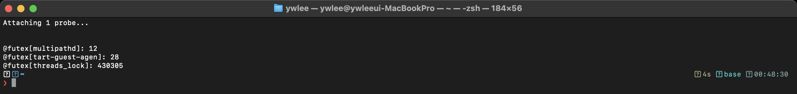
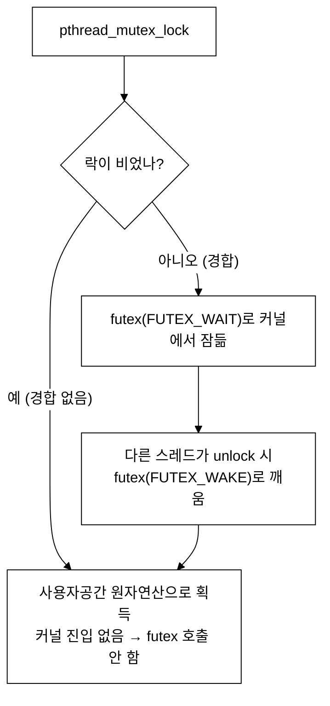

# [2부 병행성] C2 · 락·동기화 그리고 버그 (OSTEP 28–33장)

> OSTEP는 락·조건변수·세마포어로 **상호 배제**를 어떻게 보장하는지 가르친다. 그런데 락이 경합할 때 커널은 무엇을 할까? 그리고 락을 빼먹으면 정확히 무엇이 깨질까? eBPF로 `futex` 시스템콜을 잡고, 데이터 레이스를 눈으로 본다.

last_updated: 2026-06-12

> 🧭 **이 모듈을 보는 시점**  ·  📘 과목1 7주차 🟢  ·  📕 과목2 7주차 🔵 (futex 커널 경로)
> - 🔬 **실습(VM `ssh ossca-ebpf`)**: `labs/04_동기화/futex_contention.py` · `sudo offcputime-bpfcc`
> - ↔️ **OS 트랙 이동**: ⬅️ [C1 스레드](C1_스레드와_API.md) · 🏠 [OS 트랙 인덱스](README.md) · ➡️ [C3 조건변수·세마포어](C3_조건변수_세마포어_이벤트기반.md)

> 🔰 입문자: [용어집](../00c_용어집_약어사전.md) · [C 미니부록](../00b_준비_C언어_미니부록.md)

---

## 이 모듈에서 배우는 것 (OSTEP ↔ eBPF)

| OSTEP 개념 | OSTEP에서 배우는 법 | eBPF로 관찰 |
|:---|:---|:---|
| 데이터 레이스 → 갱신 유실 | 26·32장 본문, `main-race.c` | 락 없는 `counter++`가 매번 다른 값을 냄 (`c3_race.png`) |
| 락(상호 배제) | 28장 + `threads-locks`(`x86.py`) | 락 경합이 `futex` 시스템콜 급증으로 드러남 (`c2_futex.png`) |
| 락 자료구조(스핀/큐) | 29장 본문 | 사용자공간 원자연산 vs 커널 대기의 경계 |
| 조건변수 | 30장 + `threads-cv`(C 코드) | `futex` 대기/깨우기 패턴 |
| 세마포어 | 31장 + `threads-sema`(C 코드) | 락·조건변수와 같은 `futex` 기반 |
| 병행성 버그(데드락 등) | 32장 + `threads-bugs`(C 코드) | 영원히 깨어나지 않는 `futex` 대기 |
| 이벤트 기반 병행성 | 33장 본문 | 락 없이 `epoll`로 단일 스레드 처리 |

---

## 1. 데이터 레이스 — 락을 빼먹으면 무슨 일이 일어나나

### 📖 OSTEP에서는 (OSTEP 26·32장)

두 스레드가 **공유 변수**를 락 없이 갱신하면, `counter++` 한 줄이 사실은 세 단계(읽기 → 더하기 → 쓰기)라서 인터리빙에 따라 **갱신이 유실**된다. 두 스레드가 같은 옛 값을 읽고 각자 +1 해서 쓰면, +2가 되어야 할 것이 +1만 된다. OSTEP는 이를 **데이터 레이스(경쟁 상태)** 라 부르고, 32장에서 "원자성 위반(atomicity violation)" 버그로 다시 정리한다.

```bash
# (VM 안에서) ~/ostep-homework/threads-api 의 실제 C 코드
cd ~/ostep-homework/threads-api
gcc -o main-race main-race.c -Wall -pthread
./main-race      # 락 없는 공유 카운터 → 기대값과 다른 값이 나옴
```

### 🔬 eBPF로는 (실측) — 사실은 eBPF 없이도 보인다

데이터 레이스는 **출력값 자체**로 드러나기 때문에, 굳이 추적기를 걸지 않아도 된다. 우리 데모 `race.c`는 OSTEP `main-race.c`를 **반복 루프로 확장**해, 두 스레드가 락 없이 각각 2,000,000번 `counter++` 하도록 만든 것이다(기대값 4,000,000).

```bash
# (VM 안에서) 같은 명령을 3번 반복
./race
./race
./race
```



*위 이미지는 VM(커널 6.17)에서 직접 찍은 실제 터미널 캡처다.* 출력은 이런 식이다.

```text
expected=4000000, counter=2034552 -> 레이스로 값 유실!
expected=4000000, counter=2671180 -> 레이스로 값 유실!
expected=4000000, counter=3120044 -> 레이스로 값 유실!
```

핵심은 **매번 값이 다르고, 항상 기대값보다 작다**는 것이다. 작아진 양만큼 갱신이 유실된 것이고, 값이 비결정적이라는 사실이 곧 "여기 동기화가 없다"는 증거다. (OSTEP가 시뮬레이터로 보여 준 인터리빙이 실제 하드웨어에서 일어난 결과다.)

### 🛠 직접 해보기

1. `race`를 10번 돌려 값을 적어 본다. 같은 값이 두 번 나오는가? 왜 안 나올까?
2. `counter++`를 `pthread_mutex_lock/unlock`으로 감싸면 값이 항상 4,000,000이 된다. 직접 고쳐 확인한다. (그게 다음 절이다.)

---

## 2. 락과 경합 — `futex`로 잠들고 깨어난다

### 📖 OSTEP에서는 (OSTEP 28·29장)

28장은 **락**으로 임계 구역을 상호 배제하는 법을, 29장은 그 락을 떠받치는 **자료구조**(스핀락, 티켓락, 큐락 등)를 다룬다. OSTEP가 강조하는 긴장점: 락을 못 얻은 스레드를 **스핀(바쁜 대기)** 시킬 것인가, **재워서 양보(yield/sleep)** 할 것인가. 짧은 경합엔 스핀이, 긴 경합엔 재우기가 유리하다. 실제 `pthread_mutex`는 이 둘을 절충한다.

```bash
# (VM 안에서) 락 자료구조 인터리빙 시뮬레이터
cd ~/ostep-homework/threads-locks
./x86.py -p flag.s -t 2 -i 50 -r -c   # 락 구현의 인터리빙을 따라가 보기
```

### 🔬 eBPF로는 (실측)

리눅스 `pthread_mutex`의 핵심 메커니즘은 **futex**(fast userspace mutex)다. 작동 방식:

- **경합 없음(uncontended)**: 락을 잡고 푸는 일이 **사용자공간 원자연산**으로 끝난다. 커널에 안 들어간다 → `futex` 시스템콜이 **거의 안 보임**.
- **경합 있음(contended)**: 락을 못 얻은 스레드는 커널에 `futex(FUTEX_WAIT)`로 **잠들고**, 락을 푼 쪽이 `futex(FUTEX_WAKE)`로 **깨운다** → `futex` 시스템콜이 **급증**.

이 "경합할 때만 커널로 내려간다"가 바로 OSTEP가 말한 "재우기" 전략의 실제 구현이다. 여러 스레드가 같은 락을 두고 다투는 프로그램을 돌리며 `futex`를 센다.

```bash
# (VM 안에서, eBPF는 sudo)
sudo bpftrace -e 'tracepoint:syscalls:sys_enter_futex { @futex[comm] = count(); }'
# 다른 터미널에서 뮤텍스 경합 프로그램(threads_lock) 실행
```



*위 이미지는 VM(커널 6.17)에서 직접 찍은 실제 터미널 캡처다.* 경합이 심한 프로그램에서는 `@futex` 카운트가 **수천~수만**까지 치솟는다. 반대로, 같은 작업을 **경합 없이**(스레드별 독립 변수로) 하면 `futex`는 거의 0에 가깝다. 즉 **futex 카운트는 "락 경합의 온도계"** 다.



> 우리 데모 `threads_lock.c`는 C1에서 쓴 프로그램에 **공유 카운터 + 뮤텍스 + 반복 루프**를 더해, 일부러 경합을 크게 만든 버전이다. 락을 빼면 1절의 `race`처럼 값이 깨지고, 락을 넣으면 값은 맞되 `futex`가 늘어난다 — **정확성과 비용의 맞교환**을 한눈에 보여 준다.

### 🛠 직접 해보기

1. `threads_lock`를 락 있는 버전과 없는 버전으로 돌리며 `futex` 카운트를 비교한다. 락 없는 쪽은 왜 `futex`가 적은데도 값이 틀릴까? (사용자공간 원자연산조차 안 쓰니 빠르지만 부정확)
2. `sys_enter_futex`에 `args->op`를 찍어 `FUTEX_WAIT`(보통 0/128)와 `FUTEX_WAKE`(1/129)의 비율을 본다. 대기와 깨우기가 균형을 이루는가?

---

## 3. 조건변수·세마포어 — 같은 futex 위에 선 추상화

### 📖 OSTEP에서는 (OSTEP 30·31장)

- **조건변수(30장)**: "어떤 조건이 참이 될 때까지 기다린다." `pthread_cond_wait`(락을 풀고 잠듦) / `pthread_cond_signal`(깨움). 생산자-소비자 문제의 표준 도구. OSTEP는 **`while`로 조건을 다시 검사**(if가 아니라)할 것을 강하게 권한다(거짓 깨어남·여러 소비자 대비).
- **세마포어(31장)**: 정수 카운터 + `sem_wait`(감소, 0이면 대기)/`sem_post`(증가, 깨움). 락과 조건변수를 한 도구로 통합한 형태로 볼 수 있다.

```bash
# (VM 안에서) 둘 다 실제 C 코드 디렉터리
cd ~/ostep-homework/threads-cv      # 조건변수: pthread_cond_wait/signal
cd ~/ostep-homework/threads-sema    # 세마포어: sem_wait/sem_post
```

### 🔬 eBPF로는 (실측)

학부 수준에서 기억할 한 가지: **조건변수도 세마포어도, 리눅스에서는 결국 `futex` 위에 구현**된다. 그래서 2절의 `futex` 추적기를 그대로 켜 두고 조건변수/세마포어 프로그램을 돌리면, **대기(WAIT)와 깨우기(WAKE)가 번갈아 나타나는** 같은 패턴을 본다. 추상화 이름은 달라도(락/조건변수/세마포어) **커널이 보는 동기화 원시연산은 하나(futex)** 라는 점이 핵심이다.

### 🛠 직접 해보기

조건변수 데모를 돌리며 `tracepoint:syscalls:sys_enter_futex`와 `sys_exit_futex`를 함께 걸어, 한 스레드가 `FUTEX_WAIT`로 들어가 **얼마나 오래 잠들어 있다 깨어나는지** 지연을 측정해 본다(`nsecs` 차이).

---

## 4. 병행성 버그와 이벤트 기반 — 안 깨어나는 futex, 그리고 락 없는 길

### 📖 OSTEP에서는 (OSTEP 32·33장)

- **병행성 버그(32장)**: 크게 ① **비데드락 버그**(원자성 위반=1절의 레이스, 순서 위반)와 ② **데드락**으로 나눈다. 데드락의 4대 조건(상호 배제·점유 대기·비선점·순환 대기)과 **락 순서 고정**으로 순환을 깨는 예방법을 배운다.
- **이벤트 기반 병행성(33장)**: 스레드와 락을 아예 안 쓰고, **단일 스레드 + 이벤트 루프**(`select`/`poll`/`epoll`)로 병행성을 다루는 방식. 락이 없으니 데드락도 없지만, 블로킹 호출 하나가 전체를 멈추는 위험이 있다.

```bash
# (VM 안에서) 데드락 등 버그 재현 C 코드
cd ~/ostep-homework/threads-bugs
```

### 🔬 eBPF로는 (실측)

- **데드락**: 서로 상대의 락을 기다리며 멈춘 두 스레드는, eBPF로 보면 **`futex(FUTEX_WAIT)`에 들어간 뒤 영원히 `sys_exit_futex`로 빠져나오지 않는** 상태로 나타난다(WAKE가 오지 않으니까). "WAIT는 있는데 짝이 되는 WAKE가 없다"가 데드락의 관측적 징후다.
- **이벤트 기반**: 같은 작업을 `epoll`로 짠 단일 스레드 서버에서는 `futex`가 거의 잡히지 않고, 대신 `epoll_wait` 시스템콜이 중심에 온다 — **락이 없으니 락 경합도 없다**는 것을 시스템콜 구성만으로 알 수 있다.

> ⚠️ 데드락 탐지는 학부 수준에서는 "징후 관찰"까지만. 정확한 데드락 판정은 어떤 스레드가 어떤 락을 들고 무엇을 기다리는지 그래프를 그려야 하므로, 단순 카운트로 단정하지 말 것.

### 🛠 직접 해보기

`threads-bugs`의 데드락 예제를 돌리며 `futex`의 WAIT/WAKE를 추적하고, 프로그램이 멈춘 순간 두 스레드가 모두 WAIT 상태인지(=빠져나온 exit가 없는지) 확인한다. 그다음 OSTEP가 알려준 **락 순서 고정**으로 고쳐 다시 측정한다.

---

## 💻 코드로 보기 — 이 관찰을 하는 eBPF 코드

> 위 OS 개념을 eBPF로 어떻게 잡는지 실제 도구 코드를 직접 본다.

2절에서 본 `sudo bpftrace -e '...sys_enter_futex { @futex[comm] = count(); }'`는 **횟수**만 셌다. 그런데 OSTEP가 말한 "락을 못 얻은 스레드는 커널에서 **잠든다**"의 진짜 비용은 횟수가 아니라 **잠들어 있던 시간**이다. `labs/04_동기화/futex_contention.py`는 `futex`의 진입~반환 시간을 재서 프로세스별 "락 때문에 기다린 시간"을 합산한다 — 경합이 심할수록 이 값이 커진다.

### ① 커널에서 도는 부분 (eBPF C)

진입 추적점에서 시각을 저장해 두고, 반환 추적점에서 그 차이를 프로세스(TGID)별로 누적한다. 이것이 "futex로 잠든 시간"의 실측이다.

```c
struct stat_t { u64 calls; u64 wait_ns; };
BPF_HASH(enter_ts, u64, u64);        // pid_tgid -> futex 진입 시각
BPF_HASH(stats, u32, struct stat_t); // tgid -> {호출수, 대기시간 합}
BPF_HASH(names, u32, struct comm_t);

TRACEPOINT_PROBE(syscalls, sys_enter_futex) {
    u64 id = bpf_get_current_pid_tgid();
    u64 ts = bpf_ktime_get_ns();
    enter_ts.update(&id, &ts);
    return 0;
}

TRACEPOINT_PROBE(syscalls, sys_exit_futex) {
    u64 id = bpf_get_current_pid_tgid();
    u64 *tsp = enter_ts.lookup(&id);
    if (!tsp) {
        return 0;
    }
    u32 tgid = id >> 32;
    struct stat_t init = {}, *s = stats.lookup_or_try_init(&tgid, &init);
    if (s) {
        s->calls += 1;
        s->wait_ns += bpf_ktime_get_ns() - *tsp;
    }
    struct comm_t c = {};
    bpf_get_current_comm(&c.name, sizeof(c.name));
    names.update(&tgid, &c);
    enter_ts.delete(&id);
    return 0;
}
```

- **부착** `sys_enter_futex` / `sys_exit_futex`: `futex` 시스템콜의 들어가는 순간과 나오는 순간. 경합이 없으면 사용자 공간 원자연산으로 끝나 이 추적점에 거의 안 잡히고, **경합해서 커널에 잠들 때만** 진입~반환 구간이 길어진다 — 바로 그 구간을 잰다.
- **맵으로 시각 기억** `enter_ts.update(&id, &ts)`: 진입 시각을 `pid_tgid` 키로 저장. `bpf_ktime_get_ns()`는 나노초 단위 단조 시계 헬퍼다. 반환 때 같은 키로 꺼내 차이를 구한다.
- **집계** `s->wait_ns += bpf_ktime_get_ns() - *tsp`: 반환 시각 − 진입 시각 = **이번에 futex로 잠들어 있던 시간**을 프로세스별 누적합에 더한다. `lookup_or_try_init`은 그 프로세스의 통계 칸이 없으면 0으로 만들어 준다.
- **정리** `enter_ts.delete(&id)`: 짝지은 진입 기록을 지워 맵이 무한정 커지지 않게 한다.

이 "진입에서 시각 저장 → 반환에서 차이 누적" 패턴이 eBPF로 지연을 재는 가장 전형적인 방법이다.

### ② 사용자 공간 부분 (Python)

Python은 일정 시간 기다린 뒤, 커널이 채워 둔 `stats` 맵을 통째로 읽어 대기시간이 큰 순으로 출력한다.

```python
bpf = BPF(text=BPF_TEXT)
print(f"futex 대기 측정 {args.duration}초...", file=sys.stderr)
time.sleep(args.duration)

names = bpf["names"]
rows = []
for k, v in bpf["stats"].items():
    comm = names[k].name.decode("utf-8", "replace").rstrip("\x00") if k in names else "?"
    rows.append((k.value, comm, v.calls, v.wait_ns / 1e6))
rows.sort(key=lambda r: -r[3])
```

- `time.sleep(args.duration)`: 그동안 커널 쪽 C 코드가 계속 `stats` 맵을 갱신한다. 사용자 공간은 폴링 없이 끝나고 한 번에 읽으면 된다(이벤트 스트림이 아니라 **집계** 방식).
- `for k, v in bpf["stats"].items()`: 프로세스(TGID)별 `{calls, wait_ns}`를 순회. `v.wait_ns / 1e6`으로 나노초를 밀리초로 바꾼다.
- `rows.sort(key=lambda r: -r[3])`: 대기합이 큰 프로세스가 위로 — 즉 **락 경합으로 시간을 가장 많이 버린 프로세스**가 한눈에 보인다.

### 직접 실행

```bash
sudo python3 labs/04_동기화/futex_contention.py --duration 5
# 경합을 만들려면 다른 창에서: threads_lock 같은 멀티스레드+뮤텍스 프로그램 실행
```

기대 결과: 경합이 심한 프로그램일수록 `대기합(ms)` 값이 크게 찍힌다(경합 없는 작업은 거의 0). futex 대기시간이 곧 "락에 잠들어 있던 시간"임을 숫자로 확인한다.

---

## 💡 핵심 요약 — OSTEP ↔ eBPF 대조표

| 질문 | OSTEP의 설명 | eBPF로 본 실제 |
|:---|:---|:---|
| 락을 빼면 무엇이 깨지나 | 데이터 레이스 → 갱신 유실 | `race` 출력이 매번 기대값보다 작음 (`c3_race.png`) |
| 락 경합 시 커널은? | 못 얻은 스레드를 재운다 | `futex(WAIT)`로 잠들고 `futex(WAKE)`로 깨움 (`c2_futex.png`) |
| 경합이 없으면? | 빠르게 락 획득 | 사용자공간 원자연산, `futex` 거의 0 |
| 조건변수·세마포어는 다른 것? | 다른 추상화 | 커널에선 모두 같은 `futex` 원시연산 |
| 데드락의 징후는? | 순환 대기로 멈춤 | WAKE 없이 `futex(WAIT)`에서 안 나옴 |
| 락을 아예 피하려면? | 이벤트 기반(33장) | `epoll_wait` 중심, `futex` 거의 없음 |

---

## ✅ 자가점검 퀴즈

<details>
<summary>Q1. `race` 프로그램의 결과값이 매번 다르고 기대값보다 작은 이유는?</summary>

`counter++`는 원자적이지 않다(읽기→증가→쓰기 3단계). 락이 없으면 두 스레드가 같은 옛 값을 읽고 각자 써서 한 번의 증가가 유실된다. 인터리빙은 매 실행마다 달라지므로 유실량도 매번 다르고, 항상 기대값 이하가 된다.
</details>

<details>
<summary>Q2. 락이 "경합 없을 때"와 "경합 있을 때" futex 시스템콜 호출은 어떻게 다른가?</summary>

경합이 없으면 락 획득/해제가 **사용자공간 원자연산**으로 끝나 커널에 안 들어간다 → `futex` 거의 0. 경합이 있으면 못 얻은 스레드가 `futex(FUTEX_WAIT)`로 잠들고 해제 측이 `futex(FUTEX_WAKE)`로 깨운다 → `futex` 급증. 그래서 futex 카운트는 경합 강도의 지표다.
</details>

<details>
<summary>Q3. 조건변수와 세마포어는 커널 입장에서 완전히 다른 메커니즘인가?</summary>

아니다. 리눅스에서 `pthread_mutex`, `pthread_cond`, POSIX 세마포어는 모두 **`futex`** 위에 구현된다. 추상화 이름은 다르지만 커널이 보는 동기화 원시연산은 동일하다.
</details>

<details>
<summary>Q4. eBPF로 데드락을 "확정"할 수 있나?</summary>

엄밀히는 어렵다. WAKE 없이 `futex(WAIT)`에서 안 빠져나오는 **징후**는 관찰할 수 있지만, 누가 어떤 락을 들고 무엇을 기다리는지 자원 그래프를 그려야 순환 대기를 확정할 수 있다. 단순 카운트로 단정하지 말 것.
</details>

---

## 📚 더 읽을거리

- OSTEP 한국어판 28장(락)·29장(락 자료구조)·30장(조건변수)·31장(세마포어)·32장(병행성 버그)·33장(이벤트 기반)
- `man 2 futex` — `FUTEX_WAIT`/`FUTEX_WAKE` 의미
- [4주차 — eBPF 아키텍처·검증기·JIT·맵·헬퍼](../04주차_eBPF_아키텍처_검증기_JIT_맵_헬퍼.md): tracepoint로 시스템콜을 거는 원리
- [14주차 — 관측성과 성능분석·프로파일링](../14주차_관측성과_성능분석_프로파일링.md): 락 경합·오프CPU 분석의 실전 적용
- [C1 · 스레드와 API](C1_스레드와_API.md): 이 모듈의 선행 모듈

---

## ⏭ 다음 모듈

2부 병행성은 여기까지다. 시스템콜·스케줄링 관측을 더 깊이 다루는 [14주차 — 관측성과 성능분석·프로파일링](../14주차_관측성과_성능분석_프로파일링.md)으로 이어진다.
