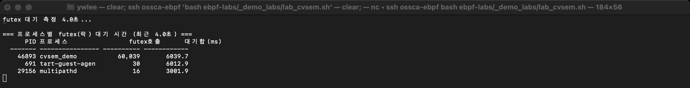
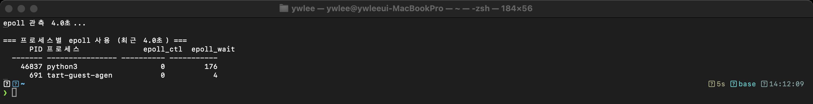

# [2부 병행성] C3 · 조건변수·세마포어·이벤트 기반 동시성 (OSTEP 30·31·33장)

> 락(C2)만으로는 "조건을 기다리는" 협력이 어렵다. 조건변수·세마포어로 **순서/협력**을 만들고,
> 스레드 대신 **이벤트 루프(epoll)** 로 동시성을 다루는 길도 본다 — 그리고 그 모든 게 커널에서 어떻게 도는지 eBPF로 관찰한다.
>
> 락·데이터 레이스로 **공유 데이터를 보호**하는 이야기는 [C2](C2_락_동기화_그리고_버그.md)에서 다룬다. 이 모듈은 그 위에서 스레드끼리 **협력(대기/통지)** 을 만드는 조건변수·세마포어, 그리고 스레드를 줄이는 **이벤트 모델**을 다룬다.

last_updated: 2026-06-12

> 🧭 **이 모듈을 보는 시점**  ·  📘 과목1 7주차 🟢  ·  📕 과목2 7주차 🔵
> - 🔬 **실습(VM `ssh ossca-ebpf`)**: `labs/04_동기화/epoll_trace.py` · `labs/04_동기화/cvsem_demo.c`
> - ↔️ **OS 트랙 이동**: ⬅️ [C2 락·동기화·버그](C2_락_동기화_그리고_버그.md) · 🏠 [OS 트랙 인덱스](README.md) · ➡️ [P1 디스크 I/O](P1_IO장치와_디스크.md)

> 🔰 입문자: 모르는 용어는 [용어집](../00c_용어집_약어사전.md), C코드는 [C 미니부록](../00b_준비_C언어_미니부록.md).
> 선행: [C2 락·동기화·버그](C2_락_동기화_그리고_버그.md)(futex 기초).

## 이 모듈에서 배우는 것 (OSTEP ↔ eBPF)

| OSTEP 개념 | OSTEP에서 배우는 법 | eBPF로 관찰 |
|:--|:--|:--|
| 조건변수 (30장) | `pthread_cond_wait/signal`, 대기/통지 | `pthread_cond_wait` → **futex(FUTEX_WAIT)** 관측 (`futex_contention.py`) |
| 세마포어 (31장) | `sem_wait/sem_post`, 카운팅 | `sem_wait` → **futex** 관측 |
| 이벤트 기반 (33장) | 단일 스레드 이벤트 루프, `epoll` | `epoll_ctl`/`do_epoll_wait` 관측 (`epoll_trace.py`) |

---

## 1. 조건변수 — "조건이 될 때까지 잠들기"

### 📖 OSTEP에서는 (30장)
락만으로는 "버퍼가 빌 때까지 기다려"를 표현하기 어렵다. **조건변수(condition variable)** 는
`pthread_cond_wait(&cv, &m)` 로 **락을 놓고 잠들었다가**, 다른 스레드의 `pthread_cond_signal` 로 깨어난다.

**핵심은 3연산이다.**

| 연산 | 의미 |
|:--|:--|
| `wait(cv, m)` | 락 `m` 을 **원자적으로 풀고** 잠든다. 깨어나면 다시 `m` 을 잡고 돌아온다. |
| `signal(cv)` | 대기 중인 스레드 **하나**를 깨운다. |
| `broadcast(cv)` | 대기 중인 스레드 **전부**를 깨운다. |

조건변수는 **항상 락과 함께** 쓴다. "조건을 검사하고(예: 버퍼가 비었나) 잠드는" 두 동작 사이에 다른 스레드가 끼어들어 조건을 바꾸면, 검사 결과는 옛것이 되고 통지를 놓칠 수 있다. `wait` 가 락을 푸는 일과 잠드는 일을 한 번에(원자적으로) 처리해 이 경쟁을 막는다.

**대표 예: 생산자-소비자(bounded buffer).** 고정 크기 버퍼를 공유한다.
- 버퍼가 **가득 차면** 생산자가 조건변수에서 대기한다.
- 버퍼가 **비면** 소비자가 조건변수에서 대기한다.
- 한쪽이 항목을 넣거나 빼면 반대쪽을 `signal` 로 깨운다.

**대기는 반드시 `if` 가 아니라 `while` 로 조건을 재검사한다.**
```c
while (count == BUF_SIZE)        // ← if 가 아니라 while
    pthread_cond_wait(&empty, &m);
```
`wait` 에서 깨어났다고 조건이 보장되지는 않는다. ① 깨어난 뒤 락을 잡기 전에 **다른 대기자**가 먼저 항목을 가져가 조건이 다시 깨졌을 수 있고, ② 아무도 `signal` 하지 않았는데 깨어나는 **거짓 깨어남(spurious wakeup)** 도 있다. 그래서 깨어난 뒤 조건을 **다시 검사**하고, 아니면 다시 잠든다. 이 while-재검사가 30장의 핵심 교훈이다.

### ⚙️ 리눅스 커널은
glibc 의 `pthread_cond_wait` 는 사용자 공간에서 조건을 확인하다가, 잠들어야 하면 **`futex(FUTEX_WAIT)`** 시스템콜로
커널에 "이 주소 값이 바뀔 때까지 재워줘"라고 요청한다. `pthread_cond_signal` 은 **`futex(FUTEX_WAKE)`** 로, `pthread_cond_broadcast` 는 대기자를 전부 깨우는 형태로 들어간다.
즉 조건변수의 "잠듦/깨어남"은 결국 [C2](C2_락_동기화_그리고_버그.md)에서 본 것과 **같은 커널 futex 원시연산** 위에서 돈다.

### 🔬 eBPF로 관찰 (실측)
조건변수 대기는 [C2](C2_락_동기화_그리고_버그.md)에서 쓴 **`futex_contention.py`** 로 그대로 보인다.

```bash
cc -O2 -o /tmp/cvsem_demo ~/ebpf-labs/labs/04_동기화/cvsem_demo.c -lpthread
/tmp/cvsem_demo &                     # 조건변수+세마포어 생산자-소비자
cd ~/ebpf-labs/labs && sudo python3 04_동기화/futex_contention.py --duration 5
# → cvsem_demo 가 futex 수만 회 호출(조건 대기/통지)로 잡힌다
```
> 실측 예: `cvsem_demo  futex호출 51,599  대기합 2632ms` — 조건변수·세마포어 대기가 전부 futex 로 드러난다.

### 🛠 직접 해보기
- 🟢 `cvsem_demo` 의 생산자-소비자 부분을 빌드해 돌리고, `futex_contention.py` 로 대기/통지가 futex 로 잡히는지 본다.
  ```bash
  cc -O2 -o /tmp/cvsem_demo ~/ebpf-labs/labs/04_동기화/cvsem_demo.c -lpthread
  /tmp/cvsem_demo &
  cd ~/ebpf-labs/labs && sudo python3 04_동기화/futex_contention.py --duration 5
  ```
- 🔵 `cvsem_demo.c` 에서 대기의 `while` 을 `if` 로 바꿔 빌드한 뒤, 버퍼 카운트가 음수가 되거나 빈 버퍼에서 꺼내는 오작동이 나는지 VM에서 관찰한다(거짓 깨어남·경쟁의 영향).

---

## 2. 세마포어 — "개수를 세는 동기화"

### 📖 OSTEP에서는 (31장)
**세마포어**는 정수 카운터다. 두 연산뿐이다.

| 연산 | 다른 이름 | 의미 |
|:--|:--|:--|
| `sem_wait` | P / down | 값을 1 줄인다. 값이 0보다 작아지면 잠든다. |
| `sem_post` | V / up | 값을 1 늘린다. 대기자가 있으면 하나 깨운다. |

- **이진 세마포어**(0/1): 락(뮤텍스)처럼 쓴다 — 한 번에 하나만 임계구역에 들어간다.
- **카운팅 세마포어**(초깃값 N): "자원 N개"를 센다 — N개까지 동시에 통과하고, 다 차면 다음 스레드가 대기한다. 생산자-소비자의 빈칸 수·찬칸 수를 세는 데 그대로 쓴다.

**조건변수와의 차이**: 세마포어는 **값(개수)을 기억**한다. 대기자가 없을 때 `sem_post` 하면 값이 +1 되어 다음 `sem_wait` 가 그냥 통과한다. 반면 조건변수의 `signal` 은 **신호를 기억하지 않는다** — 그때 대기자가 없으면 신호는 그냥 사라진다(그래서 조건변수는 항상 상태 변수 + while 재검사와 함께 쓴다).

### ⚙️ 리눅스 커널은
POSIX 세마포어(`sem_wait`/`sem_post`)도 경합이 없으면 사용자 공간 원자연산으로 끝나지만,
대기/깨움이 필요하면 **futex** 로 커널에 들어간다 — 조건변수·뮤텍스와 같은 원시연산이다. (SysV 세마포어는 별도로 `semop` 시스템콜을 쓴다.)

### 🔬 eBPF로 관찰 (실측)
위 `cvsem_demo` 의 `sem_wait`/`sem_post` 도 같은 `futex_contention.py` 에 함께 집계된다 —
조건변수와 세마포어가 **동일한 커널 메커니즘(futex)** 위에 서 있음을 한 화면에서 확인한다.

### 🛠 직접 해보기
- 🟢 `cvsem_demo` 를 돌린 상태에서 `futex_contention.py` 출력의 호출 수가 조건변수만 쓸 때와 어떻게 다른지 비교한다(세마포어 P/V도 같은 futex 로 합산됨).
- 🔵 `cvsem_demo.c` 에서 세마포어 초깃값(N)을 바꿔 빌드한 뒤, 동시에 임계구역을 통과하는 스레드 수가 N으로 제한되는지 VM에서 확인한다.

---

## 3. 이벤트 기반 동시성 — "스레드 대신 이벤트 루프"

### 📖 OSTEP에서는 (33장)
스레드+락은 경쟁·데드락이 어렵다. 대안은 **이벤트 기반 동시성**: **단일 스레드**가 `epoll` 로
여러 fd(소켓 등)를 **비차단(non-blocking)** 으로 한꺼번에 감시하다가, **준비된 fd 만** 처리한다. nginx·Node.js·Redis 의 핵심 모델이다.

**무엇을 피하는가.** 연결마다 스레드를 띄우는 **thread-per-connection** 방식은 연결이 1만 개면 스레드 1만 개다 — 스레드마다 스택 메모리가 들고, 스케줄러가 끊임없이 **컨텍스트 전환**을 해야 한다. 이벤트 루프는 스레드 하나로 수많은 fd를 다뤄 이 메모리·전환 부담을 피한다.

**트레이드오프.** 공짜는 아니다.
- 흐름이 **콜백 구조**로 쪼개져 코드가 복잡해진다(콜백 지옥).
- 한 핸들러가 **블로킹**되면(디스크 읽기·긴 계산 등) 단일 스레드 전체가 멈춰 다른 모든 fd 처리가 정지한다. 그래서 이벤트 루프 안에서는 절대 블로킹 호출을 하지 않는 규율이 필요하다.

### ⚙️ 리눅스 커널은
- `epoll_create`(`epoll_create1`) → 관심 목록을 담는 커널 객체 **`struct eventpoll`** 생성. fd 하나로 이 객체를 가리킨다.
- `epoll_ctl` → 감시할 fd를 `EPOLL_CTL_ADD/MOD/DEL` 로 등록/수정/삭제. 각 항목은 `struct epitem` 으로 `eventpoll` 의 레드-블랙 트리에 들어간다.
- `epoll_wait`(arm64는 `epoll_pwait`) → 준비된 이벤트가 생길 때까지 대기. 내부적으로 커널 함수 **`do_epoll_wait`** 로 들어간다. fd가 준비되면 커널이 콜백으로 그 항목을 **준비 리스트(ready list)** 에 옮겨 두고, `epoll_wait` 는 **준비된 fd만** 골라 돌려준다(모든 fd를 매번 훑는 `select`/`poll` 과 다른 점).

### 🔬 eBPF로 관찰 (실측)
`epoll_trace.py` 로 "어떤 프로세스가 이벤트 루프로 도는가"를 본다.

```bash
cd ~/ebpf-labs/labs && sudo python3 04_동기화/epoll_trace.py --duration 5
# 다른 창에서 epoll 쓰는 프로그램(예: 파이썬 selectors, nginx) 실행
```
> 실측 예: `python3  epoll_wait 128` — 이벤트 루프가 초당 수십 번 epoll 로 대기·재개한다.

### 🛠 직접 해보기
- 🟢 `epoll_trace.py` 를 띄운 채 다른 창에서 `epoll` 을 쓰는 프로그램(파이썬 `selectors`, nginx 등)을 돌려, 어떤 PID가 `epoll_ctl`/`epoll_wait` 로 이벤트 루프를 도는지 본다.
  ```bash
  cd ~/ebpf-labs/labs && sudo python3 04_동기화/epoll_trace.py --duration 5
  ```
- 🔵 같은 프로그램에 감시 fd 수를 늘려가며 `epoll_ctl`(등록)과 `epoll_wait`(대기) 횟수의 비를 관찰한다 — fd가 많아도 대기는 한 번이고 준비된 것만 깨어남을 확인한다.

---

## 💻 코드로 보기 — epoll 관측기 (eBPF C + Python)

`epoll_pwait` 트레이스포인트는 인자에 `sigset_t` 가 있어 BCC 컴파일이 막힌다.
그래서 **등록은 tracepoint, 대기는 커널 함수 kprobe** 로 우회한 점에 주목하라(실전 흔한 트릭).

```c
struct ev_t { u64 ctl; u64 wait; };
BPF_HASH(stats, u32, struct ev_t);

TRACEPOINT_PROBE(syscalls, sys_enter_epoll_ctl) { rec(0); return 0; }  // fd 등록
int kprobe__do_epoll_wait(struct pt_regs *ctx)  { rec(1); return 0; }  // 대기(우회)
```
```python
bpf = BPF(text=BPF_TEXT)                 # 두 부착 자동 등록
time.sleep(duration)                     # 커널이 stats 맵에 누적
for k, v in bpf["stats"].items(): ...    # 종료 후 PID별 epoll_ctl/wait 출력
```
> 전체 코드·실행: `labs/04_동기화/epoll_trace.py`

---

## 📸 실제 실행 화면 (실제 터미널 캡처)

> 이 강의 VM(커널 6.17)에서 실제로 실행한 화면을 그대로 캡처한 것이다.



> 조건변수·세마포어 생산자-소비자(`cvsem_demo`)의 대기/통지가 **futex 수만 회**로 드러난다.



> 이벤트 기반 프로세스(python3)가 `epoll_wait` 를 초당 수십 번 호출하며 이벤트 루프로 돈다.

---

## 💡 핵심 요약 — OSTEP ↔ 커널 ↔ eBPF

| OSTEP | 커널 메커니즘 | eBPF 관측 |
|:--|:--|:--|
| 조건변수(30) | `pthread_cond_wait` → futex WAIT/WAKE | `futex_contention.py` |
| 세마포어(31) | `sem_wait/post` → futex | `futex_contention.py` |
| 이벤트 기반(33) | `epoll_ctl`/`do_epoll_wait` | `epoll_trace.py` |

- **락·조건변수·세마포어는 모두 결국 커널 `futex` 한 메커니즘** 위에 서 있다.
- 이벤트 기반은 스레드를 줄이는 정반대 접근이고, 그 심장은 `epoll` 이다.

## ✅ 자가점검 퀴즈

1. `pthread_cond_wait` 가 잠들 때 커널에서 부르는 시스템콜은?
   <details><summary>정답</summary>`futex`(FUTEX_WAIT). 깨울 땐 FUTEX_WAKE.</details>
2. 조건변수와 세마포어가 eBPF로 보면 같은 시스템콜로 드러나는 이유는?
   <details><summary>정답</summary>둘 다 대기/깨움을 커널 futex 로 구현하기 때문. 그래서 `futex_contention.py` 한 도구로 둘 다 관측된다.</details>
3. 이벤트 기반 서버가 스레드 기반보다 락 문제에서 자유로운 이유는?
   <details><summary>정답</summary>단일 스레드가 epoll 로 순차 처리하므로 공유 데이터 경쟁(레이스·데드락)이 근본적으로 줄어든다. 대신 콜백 흐름이 복잡해진다.</details>

## 📚 더 읽을거리
- OSTEP 30·31·33장 · [KAIST 슬라이드](OSTEP_슬라이드_eBPF_동행가이드.md)
- [C1 스레드](C1_스레드와_API.md) · [C2 락·버그](C2_락_동기화_그리고_버그.md)
- 도구: `labs/04_동기화/futex_contention.py` · `epoll_trace.py`

## ⏭ 다음 모듈
3부 영속성 [P1 I/O·디스크](P1_IO장치와_디스크.md) 로 — 동시성을 지나 데이터를 디스크에 안전히 남기는 이야기로.
