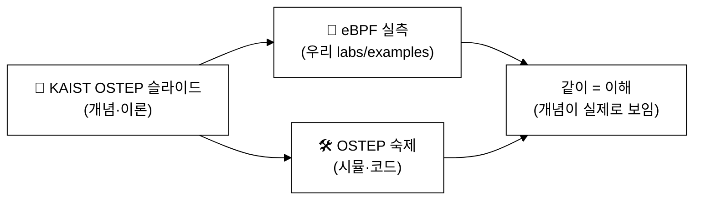

# OSTEP 슬라이드로 "운영체제 + eBPF" 같이 공부하기 — KAIST 슬라이드 동행 가이드

> [KAIST OS Lab의 OSTEP 강의 슬라이드](https://oslab.kaist.ac.kr/ostepslides/)(한국어, 35개 장)를 **개념 교재**로 삼고,
> 각 장의 개념을 우리 **eBPF 실습**으로 *그 자리에서 관찰*한다.
> 학습 흐름: **📖 KAIST 슬라이드로 개념 → 🔬 eBPF로 실측 → 🛠 OSTEP 숙제·우리 도구로 손으로**.

last_updated: 2026-06-12

> 슬라이드 출처: <https://oslab.kaist.ac.kr/ostepslides/> (파일명으로 찾으세요). eBPF 실습은 VM `ssh ossca-ebpf`(sudo).
> 모든 eBPF 화면은 실제 캡처([OS 트랙](README.md) 참고). 깊은 개념은 [V/C/P 모듈](README.md)에 정리돼 있다.

---

## 어떻게 쓰나 (한 장 = 3단계)

```
📖 슬라이드 1장 보기   →   🔬 eBPF로 같은 것 관찰   →   🛠 OSTEP 숙제 + 우리 도구로 직접
(KAIST .pptx)            (sudo python3 labs/...)        (~/ostep-homework, examples)
```

> 표의 "🔬 eBPF로 같이"가 **— (개념)** 인 장은 하드웨어/시뮬레이션 위주라 리눅스에서 직접 관찰 대상이 아니다.
> 그 경우 OSTEP 시뮬레이션 숙제로 익히고, 가장 가까운 실측을 함께 적어 둔다.

---

## 1부. 가상화 — CPU (4~10장)

| 장 | KAIST 슬라이드 | 핵심 개념 | 🔬 eBPF로 같이 공부 | 우리 자료 |
|:--:|:---|:---|:---|:---|
| 4 | `04_Processes.pptx` | 프로세스, 상태, PCB | `labs/01_프로세스/proc_lifetime.py` (생성→종료 수명) | [V1](V1_프로세스와_CPU_API.md) |
| 5 | `05_ProcessAPI.pptx` | fork/exec/wait | `labs/01_프로세스/proc_audit.py` · `examples/.../execsnoop.bt` | [V1](V1_프로세스와_CPU_API.md) |
| 6 | `06_DirectExecution.pptx` | 제한적 직접 실행, 모드 전환, 시스템콜·트랩 | `labs/02_스케줄러/syscall_latency.py` · `syscount-bpfcc` | [V2](V2_제한적직접실행과_시스템콜.md) |
| 7 | `07_CPUScheduling.pptx` | FIFO/SJF/STCF/RR, 응답·반환시간 | `labs/02_스케줄러/runq_latency.py` (런큐 대기) | [V3](V3_CPU_스케줄링.md) |
| 8 | `08_MultiLevelFeedback.pptx` | MLFQ, 우선순위 큐 | `runqlat-bpfcc` · `cpudist-bpfcc` | [V3](V3_CPU_스케줄링.md) |
| 9 | `09_LotteryScheduling.pptx` | 추첨·비례배분 | — (개념/시뮬) · 가까운 실측: `oncpu_time.py` 로 점유 비율 | [V3](V3_CPU_스케줄링.md) |
| 10 | `10_MultiCPUScheduling.pptx` | 멀티코어, 캐시 친화, 부하균형 | `labs/02_스케줄러/oncpu_time.py` · `cpudist-bpfcc` (CPU별) | [V3](V3_CPU_스케줄링.md) |

**같이 해보기 (예: 7장 스케줄링)**
```bash
# 📖 슬라이드 07_CPUScheduling 으로 RR/응답시간 개념을 잡고
# 🛠 OSTEP 시뮬로 라운드로빈 체험
python3 ~/ostep-homework/cpu-sched/scheduler.py -p RR -q 1 -l 5,5,5 -c
# 🔬 진짜 리눅스 런큐 대기시간을 eBPF로 (다른 창서 yes>/dev/null 로 부하)
cd ~/ebpf-labs/labs && sudo python3 02_스케줄러/runq_latency.py --duration 5
```

---

## 1부. 가상화 — 메모리 (13~22장)

| 장 | KAIST 슬라이드 | 핵심 개념 | 🔬 eBPF로 같이 공부 | 우리 자료 |
|:--:|:---|:---|:---|:---|
| 13 | `13_AddressSpaces.pptx` | 주소공간, 가상화 | `labs/03_메모리/mmap_size.py` (주소공간 확장) | [V4](V4_가상메모리_주소공간_페이징.md) |
| 14 | `14_MemoryAPI.pptx` | malloc/free/brk/mmap | `labs/03_메모리/mmap_size.py` · `bpftrace sys_enter_brk` | [V4](V4_가상메모리_주소공간_페이징.md) |
| 15 | `15_BaseAndBound.pptx` | 베이스·바운드 재배치 | — (하드웨어 개념) · 숙제: `vm-mechanism/relocation.py` | [V4](V4_가상메모리_주소공간_페이징.md) |
| 16 | `16_Segmentation.pptx` | 세그멘테이션 | — (개념/시뮬) · 숙제: `vm-segmentation/segmentation.py` | — |
| 17 | `17._FreeSpace_Management.pptx` | 자유공간 관리, 단편화 | — (할당기 개념) · 가까운 실측: `mmap_size.py` 호출패턴 | [V4](V4_가상메모리_주소공간_페이징.md) |
| 18 | `18._Paging_Introduction.pptx` | 페이징, 페이지 폴트 | `labs/03_메모리/page_faults.py` (페이지 폴트 실측) | [V4](V4_가상메모리_주소공간_페이징.md) |
| 19 | `19._Translation_Lookaside_Buffer.pptx` | TLB | — (HW 카운터, **가상 CPU라 이 VM에선 제한**) · 베어메탈에선 `perf stat -e dTLB-load-misses` | [V4](V4_가상메모리_주소공간_페이징.md) |
| 20 | `20._Advanced_Page_Tables.pptx` | 다단계 페이지 테이블 | — (개념) · 숙제: `vm-smalltables/...` | — |
| 21 | `21._Swapping_Mechanisms.pptx` | 스와핑, major fault | `page_faults.py` + `bpftrace mm 폴트`(major/minor 구분) | [V4](V4_가상메모리_주소공간_페이징.md) |
| 22 | `22._Swapping_Policies.pptx` | 교체 정책(LRU 등) | `cachestat-bpfcc` (캐시 적중률) | [V4](V4_가상메모리_주소공간_페이징.md) |

**같이 해보기 (예: 18장 페이징)**
```bash
# 📖 18_Paging 으로 페이지·폴트 개념 → 🛠 메모리 만지는 프로그램 → 🔬 eBPF로 폴트 실측
( timeout 3 /tmp/mem 200 >/dev/null ) &   # OSTEP vm-beyondphys/mem.c
cd ~/ebpf-labs/labs && sudo python3 03_메모리/page_faults.py --duration 4
```

---

## 2부. 병행성 (26~33장)

| 장 | KAIST 슬라이드 | 핵심 개념 | 🔬 eBPF로 같이 공부 | 우리 자료 |
|:--:|:---|:---|:---|:---|
| 26 | `26._Concurrency_An_Introduction.pptx` | 스레드, 공유, 데이터 레이스 | `examples/.../`(clone 추적) · 데모 `race.c` | [C1](C1_스레드와_API.md)·[C2](C2_락_동기화_그리고_버그.md) |
| 27 | `27._Interlude_Thread_API.pptx` | pthread_create/join | `bpftrace sys_enter_clone` (스레드=clone) | [C1](C1_스레드와_API.md) |
| 28 | `28._Locks_v2.pptx` | 락, 원자연산, futex | `labs/04_동기화/futex_contention.py` | [C2](C2_락_동기화_그리고_버그.md) |
| 29 | `29._Lockbased_Concurrent_Data_Structures.pptx` | 락 자료구조, 경합 | `futex_contention.py` (경합 시 futex 폭증) | [C2](C2_락_동기화_그리고_버그.md) |
| 30 | `30._Condition_Variables.pptx` | 조건변수(대기/통지) | `futex_contention.py` · `bpftrace futex(FUTEX_WAIT)` | [C2](C2_락_동기화_그리고_버그.md) |
| 31 | `31._Semaphore.pptx` | 세마포어 | `futex_contention.py` | [C2](C2_락_동기화_그리고_버그.md) |
| 32 | `32._Common_Concurrency_Problems.pptx` | 데이터 레이스·데드락 | 데모 `race.c`(갱신 유실) · `offcputime-bpfcc`(블로킹) | [C2](C2_락_동기화_그리고_버그.md) |
| 33 | `33_Event-basedConcurrencyAdvanced.pptx` | 이벤트 기반, epoll | `bpftrace sys_enter_epoll_wait` (가까운 실측) | — |

**같이 해보기 (예: 28·32장 락/레이스)**
```bash
# 📖 28_Locks·32_Common 으로 락·데이터레이스 개념
# 🛠 OSTEP main-race 를 확장한 데모 (락 없이 counter++ → 값 유실)
/tmp/race            # expected=4000000 인데 더 작게 나옴 = 레이스
# 🔬 락 경합을 futex 로 실측 (다른 창서 /tmp/threads_lock 실행)
cd ~/ebpf-labs/labs && sudo python3 04_동기화/futex_contention.py --duration 5
```

---

## 3부. 영속성 (36~44장)

| 장 | KAIST 슬라이드 | 핵심 개념 | 🔬 eBPF로 같이 공부 | 우리 자료 |
|:--:|:---|:---|:---|:---|
| 36 | `36._IO_Devices.pptx` | I/O 장치, 인터럽트/폴링 | `biolatency-bpfcc` · `hardirqs-bpfcc` | [P1](P1_IO장치와_디스크.md) |
| 37 | `37._Hard_Disk_Drives.pptx` | 디스크 기하·접근시간 | `biolatency-bpfcc` · `biosnoop-bpfcc` (실 디스크 지연) | [P1](P1_IO장치와_디스크.md) |
| 38 | `38._RAID.pptx` | RAID 레벨 | — (개념/시뮬) · 숙제: `file-raid/raid.py` | — |
| 39 | `39._File_and_Directories.pptx` | 파일·디렉터리·inode·fd | `labs/05_파일IO/open_audit.py` · `statsnoop-bpfcc` | [P2](P2_파일시스템과_VFS.md) |
| 40 | `40._Filesystem_Implementation.pptx` | inode/데이터 블록, VFS | `labs/05_파일IO/vfs_rw.py` · `vfsstat-bpfcc` | [P2](P2_파일시스템과_VFS.md) |
| 41 | `41._Locality_and_The_Fast_File_System.pptx` | FFS, 지역성 | `filetop-bpfcc` · `ext4slower-bpfcc` | [P2](P2_파일시스템과_VFS.md)·[P3](P3_크래시일관성_저널링_캐시.md) |
| 42 | `42._Crash_Consistency_FSCK_and_Journaling.pptx` | 크래시 일관성, 저널링, fsync | `labs/05_파일IO/fsync_trace.py` · `ext4slower-bpfcc` | [P3](P3_크래시일관성_저널링_캐시.md) |
| 43 | `43._Logstructured_File_Systems.pptx` | LFS | — (개념/시뮬) · 숙제: `file-lfs/lfs.py` | [P3](P3_크래시일관성_저널링_캐시.md) |
| 44 | `44._Flashbased_SSDs.pptx` | 플래시 SSD | — (개념/시뮬) · 숙제: `file-ssd/ssd.py` | — |

**같이 해보기 (예: 42장 저널링)**
```bash
# 📖 42_Crash_Consistency 로 저널링·fsync 개념
# 🛠🔬 디스크에 쓰고 동기화하며 eBPF로 fsync 비용 실측 (다른 창서)
#     for i in 1 2 3; do dd if=/dev/zero of=/tmp/x bs=1M count=16; sync; done
cd ~/ebpf-labs/labs && sudo python3 05_파일IO/fsync_trace.py --duration 8
```

---

## "직접 관찰 대상 아님" 장 — 어떻게 공부하나

세그멘테이션(16)·다단계 페이지테이블(20)·RAID(38)·LFS(43)·SSD(44)·로터리(9) 등은
하드웨어 메커니즘이나 자료구조 설계라 리눅스에서 eBPF로 "그 자체"를 보기는 어렵다.
이런 장은 **KAIST 슬라이드 + OSTEP 시뮬레이션 숙제**로 익히되, 표의 "가까운 실측"으로 *느낌*을 잡는다.

```bash
# 예: 16장 세그멘테이션 — 시뮬레이션으로
python3 ~/ostep-homework/vm-segmentation/segmentation.py -A 0,0 -c
# 예: 38장 RAID — 시뮬레이션으로
python3 ~/ostep-homework/file-raid/raid.py -c
```

---

## 한 학기 동행표 (요약)



> 권장: 정규 [강의 주차](../README.md)를 따라가며, 각 OS 주제에서 이 표의 해당 장 슬라이드를 같이 본다.
> 더 깊은 커널 연결(task_struct·futex·ext4)은 [V/C/P 모듈](README.md) 참고.
