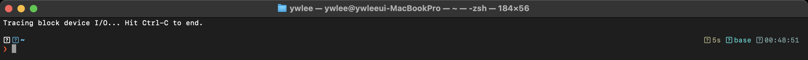

# [3부 영속성] P1 · I/O 장치와 디스크 (OSTEP 36–38장)
> OSTEP은 디스크의 동작을 시뮬레이터로 가르치고, eBPF는 그 동작이 실제 커널에서 어떤 지연으로 나타나는지 보여준다.
last_updated: 2026-06-12
> 🔰 입문자: [용어집](../00c_용어집_약어사전.md) · [C 미니부록](../00b_준비_C언어_미니부록.md)

OSTEP 3부(영속성)는 "데이터를 어떻게 사라지지 않게 저장하는가"를 다룬다. 그 출발점이 36–38장이다. CPU·메모리는 빠르지만 **저장장치는 느리고**, 그 느림을 다루는 방식이 운영체제 설계를 좌우한다. OSTEP은 디스크 구조를 `disk.py`/`ssd.py`/`raid.py`로 시뮬레이션하며 직관을 길러 주지만, 그 직관이 **실제 리눅스 커널에서 어떤 숫자로 나타나는지**는 보여주지 못한다. 그 빈칸을 eBPF로 메운다.

---

## 이 모듈에서 배우는 것 (OSTEP ↔ eBPF)

| OSTEP 개념 | OSTEP에서 배우는 법 | eBPF로 관찰 |
|---|---|---|
| I/O 장치·인터럽트·DMA (36장) | 폴링/인터럽트/DMA의 비용을 글로 설명 | 블록 I/O가 큐에 들어가고 완료되는 순간을 추적 (`biolatency`) |
| 디스크 접근시간 = 탐색+회전+전송 (37장) | `disk.py`로 헤드 이동·회전 지연 시뮬레이션 | **실제 디스크 I/O 지연 분포**를 히스토그램으로 (`biolatency`) |
| RAID (38장) | `raid.py`로 RAID-0/1/4/5 매핑·성능 계산 | 블록 디바이스 단위 I/O를 디바이스별로 분해 (`biosnoop`/`biotop`) |

---

## 1. I/O 장치는 어떻게 동작하나 (OSTEP 36장)

### 📖 OSTEP에서는

OSTEP 36장은 장치와 CPU가 대화하는 방법을 설명한다. 장치에는 **상태(status)·명령(command)·데이터(data)** 레지스터가 있고, OS는 이 레지스터를 읽고 쓰며 장치를 제어한다. 핵심 질문은 "느린 장치가 작업을 끝낼 때까지 CPU가 어떻게 기다리느냐"다.

- **폴링(polling):** CPU가 상태 레지스터를 반복해서 들여다본다. 간단하지만 CPU를 낭비한다.
- **인터럽트(interrupt):** 장치가 끝나면 CPU에 신호를 보낸다. CPU는 그동안 다른 일을 한다. 다만 매우 빠른 장치라면 인터럽트 처리 비용이 오히려 더 클 수도 있다.
- **DMA(Direct Memory Access):** CPU가 바이트를 일일이 옮기지 않고, 전용 엔진이 메모리↔장치 데이터 전송을 대신한다.

> 숙제 안내: 이 장은 별도 시뮬레이터 숙제가 없다. 대신 36장의 그림(인터럽트 타임라인)을 손으로 따라 그리며, "폴링 vs 인터럽트"에서 CPU 점유 구간을 색칠해 보자.

### 🔬 eBPF로는

리눅스에서 디스크 요청은 **블록 I/O 계층**을 거친다. 요청이 큐에 들어가고(`block_rq_issue`), 장치가 처리한 뒤 완료(`block_rq_complete`)된다. 이 "큐에 들어간 순간 → 완료된 순간"의 시간차가 바로 36장에서 말한 **장치가 일하는 동안 걸린 시간**이다. eBPF는 두 추적점에 붙어 시간차를 잰다.

이 측정은 다음 절의 `biolatency`로 한 번에 보므로, 여기서는 "어디를 잰다"만 짚는다.

### 🛠 직접 해보기

```bash
ssh ossca-ebpf
# 블록 I/O 관련 추적점이 커널에 있는지 확인
sudo cat /sys/kernel/debug/tracing/available_events | grep '^block:'
```

`block:block_rq_issue`, `block:block_rq_complete` 등이 보이면, eBPF 도구가 어디에 붙는지 눈으로 확인한 것이다.

---

## 2. 디스크 접근시간: 탐색 + 회전 + 전송 (OSTEP 37장)

### 📖 OSTEP에서는

37장은 하드디스크의 물리 구조(플래터·트랙·섹터·헤드)와 **접근시간 공식**을 가르친다.

```text
I/O 시간 = 탐색시간(seek) + 회전지연(rotation) + 전송시간(transfer)
```

- **탐색(seek):** 헤드를 목표 트랙으로 옮기는 시간 — 보통 가장 비싸다.
- **회전(rotation):** 목표 섹터가 헤드 밑으로 돌아올 때까지 기다리는 시간(RPM에 좌우).
- **전송(transfer):** 실제 데이터를 읽고 쓰는 시간.

OSTEP은 `disk.py` 시뮬레이터로 이를 체험하게 한다. 헤드 위치, 회전 각도, 요청 순서를 바꿔 가며 총 시간을 계산하고, **스케줄링(SSTF, SCAN/엘리베이터)** 이 왜 평균 시간을 줄이는지 직관으로 익힌다.

> 숙제 안내 (`~/ostep-homework/file-disks/`):
> ```bash
> cd ~/ostep-homework/file-disks
> python3 disk.py -a 7,30,8 -c        # 요청 순서대로 처리할 때 탐색/회전 비용
> python3 disk.py -a 7,30,8 -p SSTF -c # 최단 탐색 우선으로 바꿔 비교
> python3 disk.py -a 7,30,8 -p SATF -c # 회전까지 고려한 스케줄
> ```
> `disk.py`는 **물리 디스크를 흉내 낸 모델**이다. 실제 디스크가 정확히 이렇게 돈다는 뜻은 아니고, 비용 구조를 이해하기 위한 도구다.

### 🔬 eBPF로는 (실측)

시뮬레이터는 "탐색이 비싸다"를 가르치지만, 우리 VM에서 디스크 요청이 **실제로 얼마나 걸리는지**는 `biolatency`가 보여준다. 이 도구는 앞에서 본 두 블록 추적점 사이의 시간을 재서 **2의 거듭제곱 구간별 히스토그램**으로 집계한다.

먼저 디스크 쓰기를 일부러 유발한다.

```bash
# 터미널 1: 측정 시작
sudo biolatency-bpfcc

# 터미널 2: 디스크 I/O 유발 (1MB 블록 200개 쓰기)
dd if=/dev/zero of=/tmp/testfile bs=1M count=200 oflag=direct
sync
# 끝나면 터미널 1에서 Ctrl-C → 히스토그램 출력
```


*그림 P1-1. 실제 터미널 캡처. `sudo biolatency-bpfcc`로 잰 블록 I/O 지연 분포. `usecs` 구간마다 막대(`#`)와 건수가 찍힌다. OSTEP 37장의 "접근시간"이 추상이 아니라 실제 분포라는 점을 보여준다.*

**해석 포인트:**
- 가로축은 지연(보통 마이크로초 `usecs`), 막대는 그 구간에 속한 I/O 건수다. 분포가 한 봉우리면 I/O가 균질하고, 두 봉우리면 "캐시 적중 vs 실제 디스크"처럼 성격이 다른 I/O가 섞인 것이다.
- ⚠️ **이 VM은 가상 디스크다.** 물리 플래터를 돌리는 HDD가 아니라 호스트의 빠른 저장장치 위에 얹힌 가상 블록 장치라, 지연이 **마이크로초 단위로 매우 짧게** 나온다. 즉 37장의 밀리초급 탐색·회전 지연이 거의 보이지 않는다. 이것은 버그가 아니라, **하드웨어가 바뀌면 같은 공식이 전혀 다른 숫자를 낸다**는 사실을 그대로 보여주는 것이다. 실제 HDD에서 같은 명령을 돌리면 막대가 오른쪽(밀리초 구간)으로 크게 옮겨간다.

### 🛠 직접 해보기

```bash
# 읽기/쓰기를 나눠서 보기 (-F: flag별 분리), 1초마다 출력
sudo biolatency-bpfcc -F 1

# 큐 대기 시간까지 포함해 보기
sudo biolatency-bpfcc -Q
```

`disk.py`에서 `-p SSTF`로 줄였던 평균 시간이, 실제 커널의 I/O 스케줄러(`/sys/block/<dev>/queue/scheduler`) 선택에 따라 어떻게 달라지는지 생각해 보자.

---

## 3. 여러 디스크 묶기: RAID와 SSD (OSTEP 38장)

### 📖 OSTEP에서는

38장은 디스크 여러 개를 하나처럼 쓰는 **RAID**를 다룬다.

- **RAID-0(스트라이핑):** 용량·성능↑, 중복 없음(하나 고장 나면 끝).
- **RAID-1(미러링):** 같은 데이터를 두 곳에 — 안전하지만 용량 절반.
- **RAID-4/5(패리티):** 패리티로 한 디스크 고장을 견딤. RAID-5는 패리티를 분산해 병목을 푼다.

핵심은 **매핑 공식**(논리 블록 → 어느 디스크의 어느 블록)과 작은 쓰기(small write) 문제다. SSD(번외)는 플래시의 "지우기 후 쓰기"·웨어 레벨링·FTL 때문에 HDD와 비용 구조가 다르다.

> 숙제 안내:
> ```bash
> cd ~/ostep-homework/file-raid
> python3 raid.py -L 0 -n 5 -c   # RAID-0에서 논리블록→물리 매핑 맞히기
> python3 raid.py -L 5 -n 5 -c   # RAID-5 매핑
>
> cd ~/ostep-homework/file-ssd
> python3 ssd.py -h              # SSD의 지우기/쓰기/FTL 동작 실험
> ```

### 🔬 eBPF로는

RAID 매핑은 보통 커널 내부(`md`, dm-raid)에서 일어나므로 단일 장치만 보면 가려진다. 하지만 `biosnoop`/`biotop`은 **I/O 한 건마다 어느 디바이스(`DISK`)로 갔는지**를 보여줘서, 여러 백엔드 장치로 요청이 흩어지는 모습을 관찰할 수 있다.

```bash
# I/O 한 건씩: 시각·프로세스·디바이스·섹터·바이트·지연
sudo biosnoop-bpfcc

# 디바이스/프로세스별 상위 I/O (top 형태)
sudo biotop-bpfcc 1
```

> 우리 VM은 단일 가상 디스크라 RAID 분산을 직접 보기는 어렵다. 대신 `biosnoop`의 `DISK` 열을 보며 "I/O가 결국 블록 디바이스 단위로 발행된다"는 점을 확인하자. 멀티 디스크 RAID 환경이라면 같은 도구가 디바이스별로 I/O를 갈라 보여준다.

### 🛠 직접 해보기

```bash
# dd를 돌리면서 biosnoop으로 그 프로세스의 I/O를 추적
sudo biosnoop-bpfcc &
dd if=/dev/zero of=/tmp/raidtest bs=1M count=50 oflag=direct; sync
```

`COMM`/`PID` 열에서 방금 돌린 `dd`를 찾아, 한 건의 I/O가 몇 바이트·몇 마이크로초였는지 읽어 보자.

---

## 💻 코드로 보기 — 이 관찰을 하는 eBPF 코드

> 위 OS 개념을 eBPF로 어떻게 잡는지 실제 도구 코드를 직접 본다.

앞에서 쓴 `biolatency`는 편리한 완성품이지만, 그 안에서 무슨 일이 일어나는지는 가려져 있다. 사실 그 핵심은 **블록 추적점 두 개 사이의 시간을 재는 것**(34절에서 짚은 `block_rq_issue` → `block_rq_complete`)뿐이다. 그 알맹이를 짧은 `bpftrace` 한 토막으로 직접 써 본다. (아래는 개념을 보여주는 **예시** 스니펫이다 — `biolatency`의 축약판이라고 보면 된다.)

### ① 커널에서 도는 부분 (bpftrace = eBPF C 축약)

```c
// blkio_lat.bt — 블록 I/O 지연을 히스토그램으로 (예시)
tracepoint:block:block_rq_issue
{
    @start[args->dev, args->sector] = nsecs;   // 요청 발행 시각 저장
}

tracepoint:block:block_rq_complete
/@start[args->dev, args->sector]/
{
    @usecs = hist((nsecs - @start[args->dev, args->sector]) / 1000);  // 지연 집계
    delete(@start[args->dev, args->sector]);
}
```

- **부착(발행)** `tracepoint:block:block_rq_issue`: 블록 요청이 장치로 **발행되는 순간**. 36장의 "장치가 일을 시작"하는 지점이다. `@start` 맵에 `(장치, 섹터)`를 키로 발행 시각(`nsecs`)을 저장한다 — C2의 futex 측정과 똑같은 "진입 시각 기억" 패턴이다.
- **부착(완료)** `tracepoint:block:block_rq_complete`: 같은 요청이 **완료되는 순간**. 필터 `/@start[...]/`로 발행을 본 요청만 처리한다(짝 없는 완료는 무시).
- **집계(헬퍼)** `hist((nsecs - @start[...]) / 1000)`: 완료−발행 = 그 I/O가 실제로 걸린 시간(ns), 1000으로 나눠 마이크로초로 만든 뒤 `hist()`로 **2의 거듭제곱 구간별 히스토그램**에 넣는다. 이것이 `biolatency`가 그리는 분포 막대의 정체다.
- **정리** `delete(@start[...])`: 짝지은 발행 기록을 지워 맵이 새지 않게 한다.

`(args->dev, args->sector)`를 키로 쓰는 이유는, 여러 I/O가 동시에 떠 있어도 **발행과 완료를 정확히 짝지어야** 지연이 맞기 때문이다.

### ② 사용자 공간 부분 (bpftrace 실행·출력)

bcc/Python과 달리 `bpftrace`는 사용자 공간 코드를 따로 쓰지 않는다. 실행하고 Ctrl-C로 멈추면 런타임이 `@usecs` 히스토그램을 알아서 ASCII 막대로 출력한다.

```bash
sudo bpftrace blkio_lat.bt
# (또는 한 줄로)
sudo bpftrace -e 'tracepoint:block:block_rq_issue { @start[args->dev,args->sector]=nsecs; }
  tracepoint:block:block_rq_complete /@start[args->dev,args->sector]/
  { @usecs=hist((nsecs-@start[args->dev,args->sector])/1000); delete(@start[args->dev,args->sector]); }'
```

출력의 `@usecs:` 아래 각 줄은 `[구간) 건수 |막대|` 형태로, 위 `biolatency` 히스토그램과 같은 그림을 직접 만든 것이다.

### 직접 실행

```bash
# 터미널 1: 위 스니펫 실행
sudo bpftrace blkio_lat.bt

# 터미널 2: 디스크 I/O 유발 후 Ctrl-C
dd if=/dev/zero of=/tmp/testfile bs=1M count=200 oflag=direct; sync
```

기대 결과: 멈추면 `@usecs` 히스토그램이 찍힌다. 가상 디스크라 막대가 마이크로초 구간(왼쪽)에 몰리고, 실제 HDD라면 밀리초 구간(오른쪽)으로 이동한다 — 37장 접근시간 공식이 하드웨어에 따라 다른 숫자를 낸다는 점을 직접 만든 도구로 확인한다.

---

## 💡 핵심 요약 — OSTEP ↔ eBPF 대조표

| 질문 | OSTEP의 답(이론·시뮬) | eBPF의 답(실측) |
|---|---|---|
| 디스크 I/O는 왜 느린가? | 탐색+회전+전송 (37장, `disk.py`) | `biolatency` 지연 히스토그램 — 단, 가상디스크라 매우 짧음 |
| CPU는 장치를 어떻게 기다리나? | 폴링/인터럽트/DMA (36장) | 블록 추적점(`block_rq_issue`→`complete`) 시간차 |
| I/O 한 건은 어디로 가나? | RAID 매핑 공식 (38장, `raid.py`) | `biosnoop`/`biotop`의 디바이스·섹터 정보 |
| 스케줄링은 효과가 있나? | SSTF/SCAN 평균 비용 (`disk.py -p`) | 실제 I/O 스케줄러 + 지연 분포 변화 |

한 줄로: **OSTEP은 "왜 느린가"의 모델을, eBPF는 "지금 우리 시스템에서 실제로 얼마나 느린가"의 숫자를 준다.**

---

## ✅ 자가점검 퀴즈

<details>
<summary>1. HDD의 I/O 시간을 구성하는 세 요소는?</summary>

탐색시간(seek), 회전지연(rotation), 전송시간(transfer). 보통 탐색이 가장 비싸다.
</details>

<details>
<summary>2. 우리 VM에서 `biolatency` 지연이 마이크로초로 매우 짧게 나온 이유는?</summary>

물리 HDD가 아니라 **가상 블록 장치**이기 때문이다. 호스트의 빠른 저장장치 위에 얹혀 있어 탐색·회전 같은 물리 지연이 없다. 실제 HDD라면 밀리초 구간으로 막대가 이동한다.
</details>

<details>
<summary>3. `biolatency`는 어느 두 시점 사이의 시간을 재는가?</summary>

블록 요청이 발행되는 시점(`block_rq_issue`)과 완료되는 시점(`block_rq_complete`) 사이. `-Q`를 주면 큐 대기 시간까지 포함한다.
</details>

<details>
<summary>4. RAID-5가 RAID-4보다 좋은 점 한 가지는?</summary>

패리티를 한 디스크에 몰지 않고 **모든 디스크에 분산**해, RAID-4의 패리티 디스크 병목(작은 쓰기 시)을 완화한다.
</details>

---

## 📚 더 읽을거리
- OSTEP 한국어판 36·37·38장
- BCC 도구 매뉴얼: `man biolatency-bpfcc`, `man biosnoop-bpfcc`
- [14주차 — 관측성과 성능 분석: 프로파일링](../14주차_관측성과_성능분석_프로파일링.md) (지연 히스토그램이 BPF 맵으로 만들어지는 원리)
- [9주차 — 실습1: 시스템콜 추적기](../09주차_실습1_시스템콜_추적기.md) (추적점에 붙어 시간을 재는 패턴)

## ⏭ 다음 모듈
[P2 · 파일시스템과 VFS](./P2_파일시스템과_VFS.md) — 블록 위에 올라가는 파일/디렉터리 추상과, 모든 파일 연산이 거치는 VFS 계층을 `vfsstat`·`statsnoop`으로 관찰한다.
