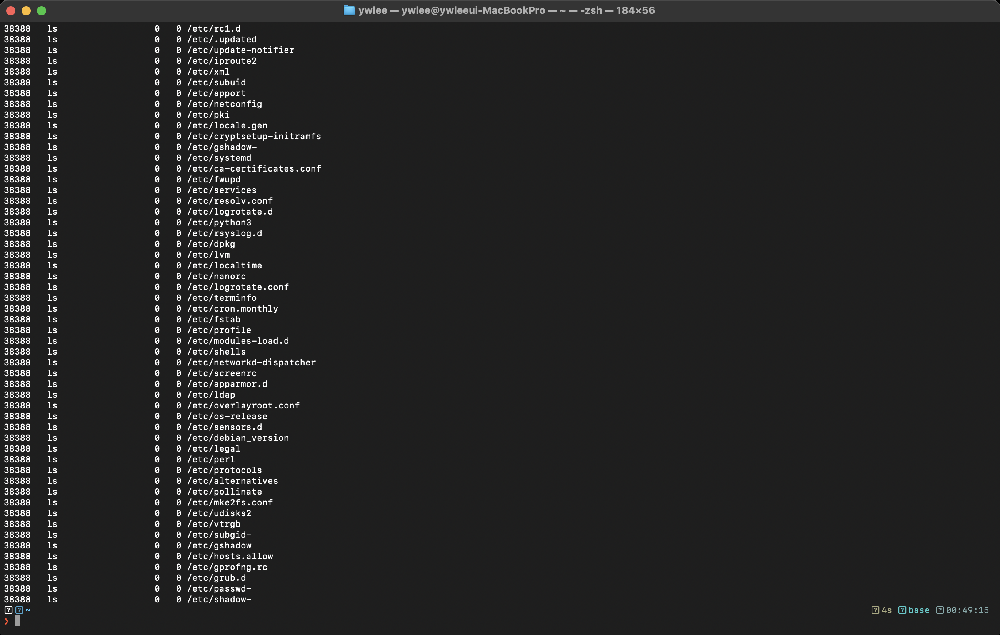
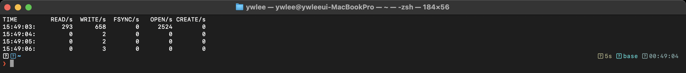
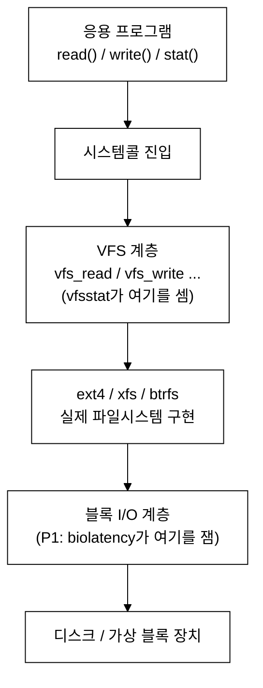

# [3부 영속성] P2 · 파일시스템과 VFS (OSTEP 39–41장)
> OSTEP은 inode·데이터 블록으로 파일시스템을 "종이 위에" 설계하게 하고, eBPF는 그 자료구조에 닿는 시스템콜을 실시간으로 보여준다.
last_updated: 2026-06-12
> 🔰 입문자: [용어집](../00c_용어집_약어사전.md) · [C 미니부록](../00b_준비_C언어_미니부록.md)

블록 장치(P1)는 그냥 번호 붙은 블록의 배열일 뿐이다. 그 위에 **파일과 디렉터리**라는 사람이 쓰기 좋은 추상을 얹는 것이 파일시스템이다. OSTEP 39–41장은 이 추상을 inode·비트맵·데이터 블록 같은 자료구조로 직접 그려 보게 한다. 리눅스는 여기에 한 겹을 더 얹는데, 바로 **VFS(가상 파일시스템)** 다. eBPF는 이 VFS 길목과 메타데이터 시스템콜에 붙어, 종이 위 설계가 실제로 호출되는 장면을 보여준다.

---

## 이 모듈에서 배우는 것 (OSTEP ↔ eBPF)

| OSTEP 개념 | OSTEP에서 배우는 법 | eBPF로 관찰 |
|---|---|---|
| 파일·디렉터리·inode (39장) | `open`/`read`/`stat` 등 인터페이스와 inode 개념 | `stat()` 한 건씩 추적 (`statsnoop`) |
| 파일시스템 구현: vsfs (40장) | `vsfs.py`로 inode·비트맵·데이터블록 배치 추론 | 모든 파일 연산이 거치는 VFS 통계 (`vfsstat`/`vfscount`) |
| FFS: 지역성·실린더 그룹 (41장) | `ffs.py`로 inode/데이터 배치와 지역성 | (P3와 연결) 실제 fs 연산 지연 — `ext4slower` |

---

## 1. 파일·디렉터리·inode — 인터페이스 (OSTEP 39장)

### 📖 OSTEP에서는

39장은 파일시스템의 **인터페이스**를 가르친다. 파일은 "이름이 붙은 바이트 배열"이고, 커널 내부에서는 **inode**라는 자료구조가 그 파일의 메타데이터(크기·소유자·권한·데이터 블록 포인터)를 담는다. 이름→inode 매핑은 디렉터리가 한다.

핵심 시스템콜:
- `open()` → 파일을 열고 **파일 디스크립터(fd)** 를 받는다.
- `read()`/`write()` → fd로 데이터 입출력, 오프셋이 따라 움직인다.
- `stat()`/`fstat()` → **데이터를 건드리지 않고 inode 메타데이터만** 조회.
- `link`/`unlink`/`rename` → 이름과 inode의 관계를 조작.

> 숙제 안내: 39장은 작은 C 프로그램 작성 위주다. `open→write→close` 후 `stat`으로 크기를 확인하는 코드를 직접 짜 보면, 다음 절 `statsnoop`이 무엇을 잡는지가 선명해진다. (C 기초는 [C 미니부록](../00b_준비_C언어_미니부록.md))

### 🔬 eBPF로는 (실측)

`stat()`는 inode 메타데이터를 읽는 대표 시스템콜이다. `ls -la`처럼 "각 파일의 크기·시간·권한"을 보여주는 명령은 내부적으로 파일마다 `stat()`을 부른다. `statsnoop`은 그 호출을 한 건씩 추적한다.

```bash
# 터미널 1: stat() 추적 시작
sudo statsnoop-bpfcc

# 터미널 2: 메타데이터를 잔뜩 읽는 명령
ls -la /etc
```


*그림 P2-1. 실제 터미널 캡처. `sudo statsnoop-bpfcc` 실행 중 `ls -la`가 부른 `stat()` 호출들. 각 줄은 호출한 프로세스(`COMM`/`PID`), 반환값(`FD/ERR`), 그리고 조회 대상 경로(`PATH`)다.*

**해석 포인트:**
- 한 줄 = `stat()` 한 번 = **inode 하나에 대한 메타데이터 조회**. `ls -la`가 디렉터리 안 파일 수만큼 `stat`을 부르는 것이 그대로 보인다.
- `ERR`이 0이 아니면(예: 2 = `ENOENT`) "없는 파일을 stat했다"는 뜻이다. 프로그램이 라이브러리/설정 파일을 여기저기 찾는 모습이 종종 잡힌다.
- 데이터는 안 읽고 메타데이터만 본다는 39장의 설명이, "PATH는 있는데 데이터 read는 없다"로 확인된다.

### 🛠 직접 해보기

```bash
# 특정 프로세스만: -p PID  /  특정 이름 패턴: -t(타임스탬프)
sudo statsnoop-bpfcc -t

# 없는 파일 stat이 어떻게 잡히는지
stat /tmp/없는파일 2>/dev/null   # statsnoop에 ENOENT로 나타난다
```

---

## 2. VFS — 모든 파일 연산의 공통 길목 (OSTEP 40장)

### 📖 OSTEP에서는

40장은 파일시스템을 **실제로 구현**한다. 디스크를 블록 배열로 보고, **슈퍼블록 / inode 비트맵 / 데이터 비트맵 / inode 테이블 / 데이터 블록** 영역으로 나눈다. 이 단순 파일시스템이 vsfs(Very Simple File System)다. 파일을 읽으려면 inode를 찾고 → 블록 포인터를 따라가 → 데이터 블록을 읽는 일련의 과정을 손으로 따라간다.

리눅스는 ext4·xfs·btrfs 등 여러 파일시스템을 **하나의 인터페이스로** 다루기 위해 그 위에 **VFS(Virtual File System)** 추상층을 둔다. `read()` 한 번은 `vfs_read()`를 거쳐 실제 파일시스템 구현으로 내려간다. 그래서 VFS는 **모든 파일 연산이 반드시 지나는 길목**이다.

> 숙제 안내 (`~/ostep-homework/file-implementation/`):
> ```bash
> cd ~/ostep-homework/file-implementation
> python3 vsfs.py -n 6           # 연산 시퀀스를 주고 비트맵/inode 상태 추론
> python3 vsfs.py -n 6 -c        # 정답(자료구조 변화) 확인
> ```
> `vsfs.py`는 "파일을 만들면 inode 비트맵·데이터 비트맵·디렉터리 엔트리가 어떻게 바뀌는가"를 한 단계씩 보여준다.

### 🔬 eBPF로는 (실측)

`vfsstat`은 VFS 함수 호출(`vfs_read`/`vfs_write`/`vfs_open`/`vfs_create`/`vfs_fsync` 등)을 세어 **초당 횟수**로 보여준다. vsfs 시뮬레이터가 "한 연산이 어떤 자료구조를 건드리나"를 가르친다면, `vfsstat`은 "지금 시스템 전체에서 어떤 종류 연산이 초당 몇 번 일어나나"를 보여준다.

```bash
# 터미널 1: VFS 연산을 1초 간격으로 집계
sudo vfsstat-bpfcc 1

# 터미널 2: 파일 연산을 잔뜩 유발
for i in $(seq 1 2000); do echo hi > /tmp/v$i; cat /tmp/v$i >/dev/null; done
```


*그림 P2-2. 실제 터미널 캡처. `sudo vfsstat-bpfcc 1` 출력. 매 초 `READ/s WRITE/s CREATE/s OPEN/s FSYNC/s` 열로 VFS 연산 빈도가 찍힌다. 위 루프를 돌리면 CREATE/WRITE/OPEN이 함께 치솟는다.*

**해석 포인트:**
- 각 열은 VFS 추상층 함수 호출 횟수다. `cat`은 READ를, `echo >`는 OPEN+CREATE+WRITE를 유발한다 — 루프 중 어느 열이 같이 오르는지 보면 명령이 내부적으로 무슨 연산을 하는지 역추적할 수 있다.
- 이 숫자들은 **파일시스템 종류와 무관하게** VFS 한 층에서 집계된다. ext4든 xfs든 같은 도구로 본다 — 그게 바로 40장이 말하는 VFS 추상화의 힘이다.
- 종류별로 더 잘게 보고 싶으면 `vfscount`를 쓴다(아래).

### 🛠 직접 해보기

```bash
# 어떤 VFS 함수가 얼마나 불렸는지 종류별 카운트 (Ctrl-C로 결과)
sudo vfscount-bpfcc

# 파일 열기만 따로 추적하고 싶다면
sudo opensnoop-bpfcc
```

`vfscount`로 본 함수 이름(`vfs_read`, `vfs_write`, …)이 곧 VFS가 제공하는 공통 인터페이스다.

### VFS가 어디 끼는지 그림으로



P1에서 잰 블록 I/O는 이 그림의 **맨 아래**, P2의 VFS는 **위쪽 공통 길목**이다. 같은 `read()` 한 번이 위에서 아래로 이 계층들을 차례로 통과한다.

---

## 3. FFS: 지역성을 챙기는 배치 (OSTEP 41장)

### 📖 OSTEP에서는

41장 FFS(Fast File System)는 vsfs의 성능 문제를 고친다. 핵심 아이디어는 **지역성(locality)**: 관련된 inode와 데이터 블록을 디스크에서 가깝게 두면(실린더 그룹), P1에서 본 비싼 탐색을 줄일 수 있다. 디렉터리와 그 안의 파일들을 같은 그룹에 모으는 것이 대표적이다.

> 숙제 안내 (`~/ostep-homework/file-ffs/`):
> ```bash
> cd ~/ostep-homework/file-ffs
> python3 ffs.py -n 10 -c     # 파일/디렉터리 생성 시 inode·블록이 어느 그룹에 배치되는지
> ```

### 🔬 eBPF로는

FFS의 배치 전략 자체는 디스크 레이아웃이라 직접 추적하기 어렵다. 하지만 그 목적("느린 fs 연산을 줄인다")은 **실제 파일시스템 연산 지연**으로 검증할 수 있다. 우리 VM 루트는 ext4이고, ext4의 느린 연산은 `ext4slower`로 잡는다 — 이는 **P3에서 본격적으로 다룬다.** 여기서는 "배치/지역성의 효과는 결국 연산 지연으로 나타난다"는 연결고리만 기억하자.

### 🛠 직접 해보기

```bash
# 같은 디렉터리에 파일을 많이 만들고, P3의 ext4slower로 지연을 관찰할 준비
mkdir -p /tmp/ffs && cd /tmp/ffs
for i in $(seq 1 1000); do echo data > f$i; done
```

---

## 💻 코드로 보기 — 이 관찰을 하는 eBPF 코드

> 위 OS 개념을 eBPF로 어떻게 잡는지 실제 도구 코드를 직접 본다.

2절에서 `vfsstat`은 VFS 호출을 "초당 몇 번"으로 셌다. 여기서는 그 길목에 직접 붙어 **프로세스별로 읽고 쓴 바이트**를 합산하는 도구 `labs/05_파일IO/vfs_rw.py`를 본다. 모든 `read()`/`write()`가 결국 커널의 `vfs_read()`/`vfs_write()`로 모인다(40장 VFS 추상)는 사실이, 이 코드가 단 두 함수에만 붙어 시스템 전체 파일 I/O를 잡아내는 근거다.

### ① 커널에서 도는 부분 (eBPF C)

`vfs_read`/`vfs_write` 커널 함수에 kprobe로 붙어, 세 번째 인자(`count`=요청 바이트 수)를 프로세스별로 누적한다.

```c
struct io_t { u64 rbytes; u64 wbytes; };
BPF_HASH(io, u32, struct io_t);
BPF_HASH(names, u32, struct comm_t);

static inline void record(u32 pid, int is_write, u64 n) {
    struct io_t init = {}, *p = io.lookup_or_try_init(&pid, &init);
    if (p) {
        if (is_write) { p->wbytes += n; } else { p->rbytes += n; }
    }
    struct comm_t c = {};
    bpf_get_current_comm(&c.name, sizeof(c.name));
    names.update(&pid, &c);
}

// vfs_read(struct file*, char __user*, size_t count, loff_t*)  → 3번째 인자 = count
int kprobe__vfs_read(struct pt_regs *ctx, void *file, void *buf, size_t count) {
    record(bpf_get_current_pid_tgid() >> 32, 0, count);
    return 0;
}
int kprobe__vfs_write(struct pt_regs *ctx, void *file, void *buf, size_t count) {
    record(bpf_get_current_pid_tgid() >> 32, 1, count);
    return 0;
}
```

- **부착(kprobe)** `kprobe__vfs_read` / `kprobe__vfs_write`: bcc에서 `kprobe__함수이름` 형태는 그 커널 함수 진입에 자동 부착된다. 추적점이 아니라 **커널 함수 자체**에 붙는 kprobe라, 함수 시그니처대로 인자를 그대로 받는다.
- **인자에서 바이트 추출** 세 번째 인자 `size_t count`: `vfs_read/write`의 요청 바이트 수. 주석이 시그니처를 명시해 "왜 3번째 인자인가"를 보여준다.
- **집계(맵)** `record(...)`: `io` 맵에 `pid`를 키로 읽기/쓰기 바이트를 누적한다. `is_write`로 같은 헬퍼를 읽기·쓰기 둘 다에 재사용한다. `names` 맵에는 PID→프로세스 이름을 같이 저장해 나중에 사람이 읽게 한다.

> 보조 도구로 `labs/05_파일IO/open_audit.py`도 있다. 이쪽은 `sys_enter_openat`/`sys_exit_openat` 추적점에서 **경로·플래그·결과 fd**를 짝지어, 1절 `statsnoop`처럼 "누가 무슨 파일을 어떤 의도로 열어 성공했나"를 한 줄씩 보여준다. `vfs_rw.py`가 "얼마나(바이트)"라면 `open_audit.py`는 "무엇을(경로)"에 답한다.

### ② 사용자 공간 부분 (Python)

일정 시간 기다린 뒤 `io` 맵을 읽어, 총 I/O가 큰 프로세스 순으로 사람이 읽기 좋은 단위(B/KB/MB)로 출력한다.

```python
bpf = BPF(text=BPF_TEXT)
time.sleep(args.duration)

names = bpf["names"]
rows = []
for k, v in bpf["io"].items():
    comm = names[k].name.decode("utf-8", "replace").rstrip("\x00") if k in names else "?"
    rows.append((k.value, comm, v.rbytes, v.wbytes))
rows.sort(key=lambda r: -(r[2] + r[3]))
```

- `time.sleep(args.duration)`: 그동안 커널 C가 `io` 맵을 갱신한다(집계 방식 — 폴링 불필요).
- `for k, v in bpf["io"].items()`: PID별 `{rbytes, wbytes}`를 순회하고, `names`에서 이름을 붙인다.
- `rows.sort(key=lambda r: -(r[2] + r[3]))`: 읽기+쓰기 합이 큰 순으로 정렬 → **파일 I/O를 가장 많이 한 프로세스**가 위로. `human()` 함수가 바이트를 KB/MB로 바꿔 출력한다.

### 직접 실행

```bash
sudo python3 labs/05_파일IO/vfs_rw.py --duration 5
# 보조: 누가 무슨 파일을 여는지 한 줄씩
sudo python3 labs/05_파일IO/open_audit.py --comm cat
```

기대 결과: 추적 5초 동안 파일을 많이 읽고 쓴 프로세스들이 `읽기`/`쓰기` 바이트와 함께 상위에 표시된다 — `read()`/`write()`가 모두 VFS 한 길목으로 모인다는 40장 추상이 숫자로 확인된다.

---

## 💡 핵심 요약 — OSTEP ↔ eBPF 대조표

| 질문 | OSTEP의 답(이론·시뮬) | eBPF의 답(실측) |
|---|---|---|
| 파일 메타데이터는 어디 있나? | inode (39·40장) | `statsnoop` — `stat()` 호출과 대상 경로 |
| 파일 연산은 내부적으로 무엇을 부르나? | open/read/write 인터페이스 (39장) | `vfsstat`/`vfscount` — 종류별 VFS 호출 빈도 |
| 여러 파일시스템을 어떻게 한 번에 다루나? | (VFS 개념, 40장) | `vfsstat`이 fs 종류와 무관하게 한 층에서 집계 |
| 배치/지역성은 왜 챙기나? | FFS 실린더 그룹 (41장, `ffs.py`) | (P3) `ext4slower`로 연산 지연 확인 |

한 줄로: **OSTEP은 inode·블록을 종이에 그리게 하고, eBPF는 그 자료구조를 건드리는 시스템콜과 VFS 호출을 실시간으로 보여준다.**

---

## ✅ 자가점검 퀴즈

<details>
<summary>1. inode에 들어 있는 것과 들어 있지 않은 것은?</summary>

들어 있다: 크기·소유자·권한·시간·데이터 블록 포인터 같은 **메타데이터**. 들어 있지 않다: **파일 이름**(이름→inode 매핑은 디렉터리가 한다).
</details>

<details>
<summary>2. `ls -la`가 `statsnoop`에 stat 호출을 잔뜩 남기는 이유는?</summary>

`-l`로 각 파일의 크기·시간·권한을 출력하려면 파일마다 `stat()`로 inode 메타데이터를 읽어야 하기 때문이다.
</details>

<details>
<summary>3. ext4와 xfs를 같은 `vfsstat`로 관찰할 수 있는 이유는?</summary>

두 파일시스템 모두 **VFS 공통 인터페이스**(`vfs_read` 등)를 통해 호출되고, `vfsstat`은 그 VFS 층을 세기 때문이다. 이것이 40장 VFS 추상화의 핵심 이점이다.
</details>

<details>
<summary>4. FFS가 vsfs보다 빠른 근본 이유 한 가지는?</summary>

관련 inode·데이터 블록을 가까이(실린더 그룹) 배치해 **탐색시간(seek)** 을 줄이는 지역성 덕분이다(P1 37장과 연결).
</details>

---

## 📚 더 읽을거리
- OSTEP 한국어판 39·40·41장
- BCC 도구: `man vfsstat-bpfcc`, `man statsnoop-bpfcc`, `man opensnoop-bpfcc`
- [9주차 — 실습1: 시스템콜 추적기](../09주차_실습1_시스템콜_추적기.md) (`open`/`stat` 같은 시스템콜에 붙는 법)
- [14주차 — 관측성과 성능 분석](../14주차_관측성과_성능분석_프로파일링.md)

## ⏭ 다음 모듈
[P3 · 크래시 일관성·저널링·캐시](./P3_크래시일관성_저널링_캐시.md) — 쓰기 도중 전원이 나가도 파일시스템이 깨지지 않게 하는 저널링을, 그리고 읽기를 빠르게 하는 페이지 캐시를 `ext4slower`·`cachestat`으로 관찰한다.
