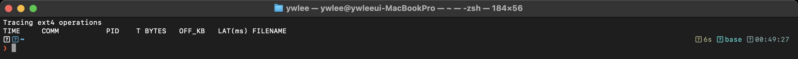

# [3부 영속성] P3 · 크래시 일관성·저널링·캐시 (OSTEP 42–43장)
> OSTEP은 "쓰기 도중 전원이 나가면?"을 fsck와 저널링으로 풀고, eBPF는 그 fsync·저널 쓰기와 페이지 캐시 적중을 실측으로 보여준다.
last_updated: 2026-06-12
> 🔰 입문자: [용어집](../00c_용어집_약어사전.md) · [C 미니부록](../00b_준비_C언어_미니부록.md)

파일시스템(P2)은 inode·비트맵·데이터 블록 여러 개를 함께 갱신한다. 그런데 그 도중에 **전원이 나가면** 일부만 쓰여 자료구조가 깨질 수 있다 — 이것이 **크래시 일관성(crash consistency)** 문제다. OSTEP 42장은 이를 `fsck`와 **저널링(journaling)** 으로 푼다. 43장은 로그 구조 파일시스템(LFS)과, 읽기를 빠르게 하는 **페이지 캐시**를 다룬다. eBPF는 이 모든 것을 실제 ext4 동작과 캐시 적중률로 보여준다.

---

## 이 모듈에서 배우는 것 (OSTEP ↔ eBPF)

| OSTEP 개념 | OSTEP에서 배우는 법 | eBPF로 관찰 |
|---|---|---|
| 크래시 일관성·fsck (42장) | `fsck.py`로 깨진 fs를 점검·복구 | (이론) 왜 저널이 필요한지의 동기 |
| 저널링 (42장) | 저널 쓰기→체크포인트 순서 학습 | `ext4slower`로 ext4 쓰기/fsync 지연 |
| LFS: 순차 쓰기 (43장) | `lfs.py`로 로그 구조 배치 | `biosnoop`로 순차 vs 임의 I/O 패턴 |
| 페이지 캐시 (43장 주변) | 캐시·버퍼 개념 | `cachestat`로 페이지 캐시 적중률 |

---

## 1. 크래시 일관성과 fsck (OSTEP 42장)

### 📖 OSTEP에서는

파일 하나를 새 블록에 쓰는 단순한 작업도 디스크에는 **여러 번의 쓰기**(데이터 블록 + inode + 데이터 비트맵)가 필요하다. 이 셋을 한 번에 원자적으로 쓸 방법이 없으니, 중간에 크래시가 나면 모순이 생긴다(예: 비트맵은 "사용 중"인데 inode는 그 블록을 안 가리킴).

초기 해법은 부팅 시 **fsck**로 전체를 훑어 모순을 고치는 것이다. 정확하지만 **디스크 전체를 검사**하므로 느리다.

> 숙제 안내 (`~/ostep-homework/file-journaling/`):
> ```bash
> cd ~/ostep-homework/file-journaling
> python3 fsck.py -D       # 일부러 망가뜨린 fs 메타데이터를 보고
> python3 fsck.py -D -c    # 어떤 불일치가 있고 어떻게 고치는지 확인
> ```

### 🔬 eBPF로는

fsck 자체는 부팅 시 동작이라 평소엔 보기 어렵지만, "왜 저널이 필요한가"의 동기는 다음 절에서 ext4 저널 쓰기 지연으로 직접 만나게 된다.

---

## 2. 저널링: 쓰기 전에 먼저 적어두기 (OSTEP 42장)

### 📖 OSTEP에서는

fsck가 느린 이유는 "어디가 깨졌는지 모르니 전부 검사"하기 때문이다. **저널링(write-ahead logging)** 은 발상을 바꾼다.

1. 실제 위치에 쓰기 **전에**, "이런 갱신을 할 것이다"를 **저널(로그) 영역에 먼저 기록**한다.
2. 저널 기록이 끝났다는 표시(commit)를 남긴다.
3. 그 다음에야 실제 위치에 반영한다(체크포인트).

크래시가 나도, 부팅 시 **저널만 다시 재생(replay)** 하면 되니 전체 검사가 필요 없다. ext3/ext4가 이 방식을 쓴다(ext4는 보통 메타데이터만 저널링하는 ordered 모드). 여기서 **순서(ordering)** 와 `fsync`가 중요해진다 — 응용이 "지금까지 쓴 걸 디스크에 확실히 박아라"라고 요구하는 지점이다.

> 숙제 안내: 위 `fsck.py`와 함께 42장의 저널 타임라인(저널 쓰기 → commit → 체크포인트)을 손으로 그려, "어느 단계에서 크래시가 나면 안전/위험한가"를 표시해 보자.

### 🔬 eBPF로는 (실측)

`ext4slower`는 **느린 ext4 연산**(읽기·쓰기·열기·fsync)을 한 건씩 보여준다. 인자로 임계값(ms)을 주는데, `0`을 주면 **모든** 연산을 보여줘서 저널·fsync가 어떤 지연을 갖는지 관찰하기 좋다.

```bash
# 터미널 1: ext4 연산 추적 (0ms = 모두 표시)
sudo ext4slower-bpfcc 0

# 터미널 2: 쓰기 + 강제 동기화를 반복 (저널 commit/fsync 유발)
for i in $(seq 1 20); do
  dd if=/dev/zero of=/tmp/j$i bs=1M count=5 2>/dev/null
  sync
done
```


*그림 P3-1. 실제 터미널 캡처. `sudo ext4slower-bpfcc 0` 출력. 각 줄은 시각·프로세스·연산종류(`T` 열: R/W/O/S)·오프셋·바이트·지연(`LAT(ms)`)·파일명이다. `dd`+`sync` 반복 중 `W`(write)와 `S`(sync/fsync) 연산이 잡힌다.*

**해석 포인트:**
- `T` 열의 `S`가 `fsync`/sync 계열이다. 응용이 "디스크에 확실히 박아라"라고 한 순간이고, 저널 commit이 일어나는 지점과 맞물린다. `W`(write)는 데이터 쓰기다.
- `LAT(ms)` 열이 그 연산이 실제로 걸린 시간이다. 가상 디스크라 보통 짧지만, `sync` 직후 연산은 상대적으로 더 걸리는 경향을 볼 수 있다 — **순서를 강제하는 비용**이 그것이다.
- 저널이 없다면 fsck로 전체를 훑어야 한다는 42장의 동기가, "쓰기마다 작은 동기화 비용을 내고 대신 크래시에 강하다"로 실측에서 드러난다.

### 🛠 직접 해보기

```bash
# 10ms 넘는 ext4 연산만 (운영에서 느린 I/O만 골라볼 때)
sudo ext4slower-bpfcc 10

# I/O 한 건씩(디바이스·섹터)로 저널 영역 쓰기까지 보고 싶다면
sudo biosnoop-bpfcc
```

---

## 3. LFS: 모든 쓰기를 순차로 (OSTEP 43장)

### 📖 OSTEP에서는

43장 LFS(Log-structured File System)는 한발 더 나간다. 디스크는 **순차 쓰기**가 임의 쓰기보다 훨씬 빠르다(P1 37장: 탐색이 비쌈). LFS는 **모든 갱신을 로그처럼 디스크 끝에 순차로 덧붙여** 쓴다. 대신 inode 위치가 계속 바뀌므로 **inode 맵**과, 오래된 데이터를 정리하는 **세그먼트 클리닝(garbage collection)** 이 필요하다.

> 숙제 안내 (`~/ostep-homework/file-lfs/`):
> ```bash
> cd ~/ostep-homework/file-lfs
> python3 lfs.py -n 4 -c   # 연산이 로그에 순차로 쌓이며 inode 맵이 갱신되는 모습
> ```

### 🔬 eBPF로는

`biosnoop`의 **SECTOR(섹터 번호)** 열을 보면, 임의 쓰기는 섹터가 들쭉날쭉하고 순차 쓰기는 섹터가 거의 단조 증가한다. LFS의 "순차로 모은다"는 아이디어가 실제 I/O 패턴으로 어떻게 보이는지 감을 잡을 수 있다(우리 ext4 VM에서는 LFS 그대로는 아니지만, 순차 vs 임의 패턴의 차이는 관찰 가능).

```bash
sudo biosnoop-bpfcc &
# 순차 쓰기
dd if=/dev/zero of=/tmp/seq bs=1M count=50 oflag=direct; sync
```

`SECTOR` 열이 꾸준히 증가하는지 보자 — 순차 I/O의 흔적이다.

---

## 4. 페이지 캐시: 한 번 읽은 건 메모리에 (OSTEP 43장 주변)

### 📖 OSTEP에서는

디스크는 느리니, 커널은 한 번 읽은 파일 데이터를 **페이지 캐시(page cache)** 에 메모리로 들고 있는다. 다음에 같은 데이터를 읽으면 디스크에 안 가고 메모리에서 바로 준다(**캐시 적중, hit**). 쓰기도 일단 캐시에 모았다가(write-back) 나중에 디스크로 내린다 — 그래서 `fsync`가 필요했던 것이다(2절과 연결).

### 🔬 eBPF로는 (실측)

`cachestat`은 페이지 캐시의 **적중/미스 횟수와 적중률**을 초당 보여준다. 같은 파일을 두 번 읽어 보면, 첫 읽기는 미스(디스크에서 채움), 둘째 읽기는 거의 다 적중하는 것을 볼 수 있다.

```bash
# 터미널 1: 페이지 캐시 통계 1초 간격
sudo cachestat-bpfcc 1

# 터미널 2: 같은 파일을 두 번 읽기
dd if=/dev/zero of=/tmp/big bs=1M count=200; sync
echo 1 | sudo tee /proc/sys/vm/drop_caches   # 캐시 비우고
cat /tmp/big > /dev/null    # 1차: 디스크에서 → MISSES 증가
cat /tmp/big > /dev/null    # 2차: 캐시에서 → HITS 증가, HITRATIO↑
```


*그림 P3-2. 실제 터미널 캡처(5주차에서 재사용). `sudo cachestat-bpfcc 1` 출력. `HITS MISSES ... HITRATIO` 열로 페이지 캐시 적중 상황이 매 초 찍힌다. 같은 파일 2차 읽기에서 `HITRATIO`가 크게 오른다.*

**해석 포인트:**
- `HITS`는 디스크에 안 가고 메모리에서 해결한 횟수, `MISSES`는 디스크에서 채운 횟수다. `HITRATIO`가 높을수록 디스크 I/O를 아낀 것이다.
- `drop_caches`로 캐시를 비운 직후 1차 읽기는 MISSES가 솟고, 2차 읽기는 HITS가 솟는다 — **"한 번 읽은 건 빨라진다"** 가 숫자로 보인다.
- 이 캐시 덕분에 P1의 `biolatency`에서 **두 개의 봉우리**(캐시 적중 = 매우 빠름, 디스크 접근 = 상대적으로 느림)가 생기곤 한다. 세 모듈이 여기서 한 그림으로 만난다.

### 🛠 직접 해보기

```bash
# 캐시에 무슨 파일이 얼마나 올라와 있는지 (있으면)
sudo cachetop-bpfcc

# 쓰기 후 fsync가 페이지 캐시를 디스크로 내리는 비용을 ext4slower로 같이 보기
sudo ext4slower-bpfcc 0
```

---

## 💡 핵심 요약 — OSTEP ↔ eBPF 대조표

| 질문 | OSTEP의 답(이론·시뮬) | eBPF의 답(실측) |
|---|---|---|
| 쓰기 도중 크래시 나면? | fsck or 저널링 (42장, `fsck.py`) | `ext4slower`의 `S`(fsync/sync) 연산과 지연 |
| 저널은 왜 빠른 복구를 주나? | 저널만 재생하면 됨 (42장) | `fsync` 시점의 동기화 비용 관찰 |
| 순차 쓰기가 왜 유리한가? | LFS 로그 구조 (43장, `lfs.py`) | `biosnoop` SECTOR 열의 순차 증가 |
| 두 번째 읽기는 왜 빠른가? | 페이지 캐시 (43장) | `cachestat` HITS/HITRATIO 상승 |

한 줄로: **OSTEP은 "전원이 나가도 안 깨지게, 그리고 빠르게"를 저널·LFS·캐시로 설계하고, eBPF는 그 fsync·순차 I/O·캐시 적중을 실제 숫자로 확인시켜 준다.**

---

## ✅ 자가점검 퀴즈

<details>
<summary>1. 저널링이 fsck보다 복구가 빠른 이유는?</summary>

fsck는 디스크 전체를 훑어 모순을 찾지만, 저널링은 **저널(로그)에 기록된 갱신만 재생**하면 되므로 검사 범위가 작다.
</details>

<details>
<summary>2. `ext4slower`에서 `T` 열의 `S`는 무엇을 뜻하나?</summary>

sync/fsync 계열 연산이다. 응용이 "지금까지 쓴 데이터를 디스크에 확실히 반영하라"고 요구한 지점으로, 저널 commit과 맞물린다.
</details>

<details>
<summary>3. `cachestat`에서 같은 파일 두 번째 읽기의 HITRATIO가 높은 이유는?</summary>

첫 읽기에서 데이터가 **페이지 캐시(메모리)** 에 올라왔고, 둘째 읽기는 디스크 대신 메모리에서 해결되기 때문이다.
</details>

<details>
<summary>4. 쓰기 후 `fsync`가 필요한 까닭은 무엇과 관련되나?</summary>

페이지 캐시의 **write-back** 때문이다. 쓰기는 일단 캐시에 모였다가 나중에 디스크로 내려가므로, 즉시 영속화하려면 `fsync`로 강제로 내려야 한다.
</details>

---

## 📚 더 읽을거리
- OSTEP 한국어판 42·43장
- BCC 도구: `man ext4slower-bpfcc`, `man cachestat-bpfcc`, `man biosnoop-bpfcc`
- [14주차 — 관측성과 성능 분석](../14주차_관측성과_성능분석_프로파일링.md)
- [9주차 — 실습1: 시스템콜 추적기](../09주차_실습1_시스템콜_추적기.md)

## ⏭ 다음 / 마무리
P1–P3로 OSTEP 3부(영속성)의 디스크→파일시스템→크래시 일관성·캐시를 한 바퀴 돌았다. 같은 `read()` 한 번이 **VFS(P2) → ext4 저널(P3) → 블록 I/O(P1) → 페이지 캐시(P3)** 를 어떻게 통과하는지, 이제 시뮬레이터의 직관과 eBPF의 실측 양쪽으로 설명할 수 있다.
- 되돌아보기: [P1 · I/O 장치와 디스크](./P1_IO장치와_디스크.md) · [P2 · 파일시스템과 VFS](./P2_파일시스템과_VFS.md)
