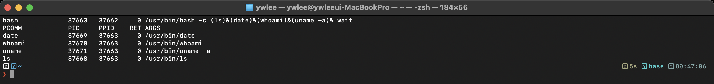
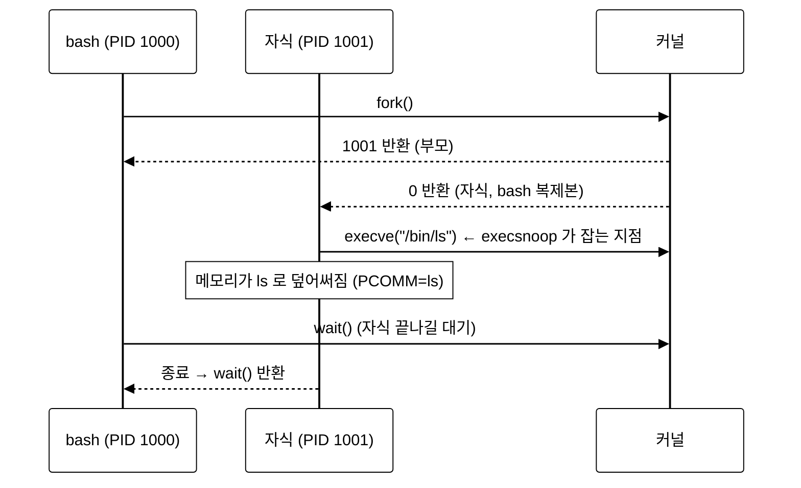

# [1부 가상화] V1 · 프로세스와 CPU API (OSTEP 4–5장)

> OSTEP가 칠판에서 그리는 "프로세스"와 `fork/exec/wait`를, eBPF로 실제 리눅스에서 새 프로세스가 태어나는 순간을 잡아 눈으로 확인합니다.

last_updated: 2026-06-12

---

> 🔰 입문자: 모르는 용어는 [용어집](../00c_용어집_약어사전.md), C코드는 [C 미니부록](../00b_준비_C언어_미니부록.md)을 참고하세요.

## 이 모듈에서 배우는 것 (OSTEP ↔ eBPF)

| OSTEP 개념 | OSTEP에서 배우는 법 | eBPF로 관찰 |
|:---|:---|:---|
| 프로세스 = 실행 중인 프로그램, 상태(running/ready/blocked) | 4장, `cpu-intro/process-run.py` 로 상태 전이 시뮬레이션 | `execsnoop-bpfcc` 로 실제 프로그램이 메모리에 올라가는 순간 |
| `fork()` — 부모를 복제한 자식 생성 | 5장, `cpu-api/fork.py` 로 프로세스 트리 추적 | `execsnoop` 의 PPID/PID 열로 부모-자식 관계 |
| `exec()` — 현재 프로세스를 새 프로그램으로 덮어쓰기 | 5장 본문, 셸이 명령을 실행하는 원리 | `execsnoop` 가 잡는 것은 바로 `execve` 시스템콜 |
| `wait()` — 부모가 자식 종료를 기다림 | 5장, 셸의 동작 흐름 | (V2에서 시스템콜 추적으로 이어짐) |

---

## 1. 프로세스란 무엇인가

### 📖 OSTEP에서는

OSTEP 4장은 운영체제의 가장 근본적인 추상화인 **프로세스(process)** 를 소개합니다. 프로세스는 한마디로 **"실행 중인 프로그램"** 입니다. 디스크 위의 프로그램(명령어와 데이터의 죽은 덩어리)이 메모리에 올라와 CPU에서 돌기 시작하면 그것이 프로세스입니다.

OS는 단 몇 개의 물리 CPU만 가지고도 수십~수백 개의 프로세스가 "동시에" 도는 것처럼 보이게 만듭니다. 이것이 **CPU 가상화**이고, 그 비결은 **시분할(time sharing)** — 하나의 CPU를 잠깐씩 번갈아 쓰게 하는 것입니다.

프로세스는 한 시점에 세 가지 상태 중 하나입니다.

- **Running**: 지금 CPU에서 실행 중
- **Ready**: 실행할 수 있지만 OS가 아직 CPU를 주지 않음
- **Blocked**: I/O 등 어떤 사건을 기다리는 중 (CPU를 줘도 못 씀)

OSTEP 숙제로 상태 전이를 시뮬레이션해 봅니다.

```bash
# ~/ostep-homework/cpu-intro 에서
python3 process-run.py -l 5:100,5:100      # CPU만 쓰는 두 프로세스
python3 process-run.py -l 3:0 -L 5         # I/O 위주 프로세스 (3개 명령 전부 I/O)
python3 process-run.py -l 5:100,5:100 -c   # -c 로 정답(상태 전이) 확인
```

`-l A:B` 는 "명령 A개, 각 명령이 CPU일 확률 B%" 라는 뜻입니다. `-c` 를 붙이면 매 시각(time tick) 각 프로세스의 상태가 RUN/READY/BLOCKED/DONE 중 무엇인지 표로 보여 줍니다.

### 🔬 eBPF로는 (실측)

OSTEP가 시뮬레이터로 "프로세스가 태어나고 상태가 바뀐다"를 그린다면, eBPF는 **진짜 리눅스 커널에서 프로세스가 태어나는 순간**을 실시간으로 잡습니다. `execsnoop-bpfcc` 는 `execve` 시스템콜에 eBPF 프로그램을 부착해, 새 프로그램이 실행될 때마다 한 줄씩 찍습니다.



위는 `sudo execsnoop-bpfcc` 를 켜 둔 채 셸에서 여러 명령을 실행했을 때의 **실제 터미널 캡처**입니다. 읽는 법:

- **PCOMM** = 실행된 프로그램 이름, **PID** = 새 프로세스의 번호, **PPID** = 그 부모의 번호.
- 한 줄 한 줄이 곧 `execve()` 한 번입니다. 즉 "디스크의 프로그램이 메모리에 올라와 프로세스가 되는" 바로 그 순간이 한 행으로 기록됩니다.
- **ARGS** 열의 명령줄 인자까지 그대로 보입니다 — OSTEP 본문의 "프로그램 + 인자 → 프로세스" 그림이 현실에서 이렇게 찍힙니다.

### 🛠 직접 해보기

```bash
# 터미널 1 (VM): 새 프로세스를 실시간 감시
sudo execsnoop-bpfcc

# 터미널 2 (VM): 아무 명령이나 실행해 보면 터미널 1에 즉시 뜸
ls -la /etc
date
python3 -c "print(1+1)"
```

---

## 2. fork() / exec() / wait() — CPU API 3총사

### 📖 OSTEP에서는

OSTEP 5장은 프로세스를 만드는 유닉스의 세 시스템콜을 다룹니다. 핵심은 `fork` 와 `exec` 가 **분리**되어 있다는 점입니다.

- **`fork()`**: 자신을 거의 그대로 복제해 **자식 프로세스**를 만듭니다. 한 번 호출했는데 부모와 자식 양쪽에서 각각 반환됩니다. 부모에게는 자식의 PID가, 자식에게는 0이 돌아옵니다.
- **`exec()`**: 현재 프로세스의 메모리를 **새 프로그램으로 덮어씌웁니다**. 성공하면 돌아오지 않습니다(이미 다른 프로그램이 됨).
- **`wait()`**: 부모가 자식이 끝날 때까지 기다립니다.

왜 둘로 나눴을까요? 그 **사이의 틈** 때문입니다. `fork` 후 `exec` 전에, 셸은 자식의 표준 출력을 파일로 바꾸는(리다이렉션) 등의 설정을 할 수 있습니다. 이 분리가 유닉스 셸과 파이프의 우아함을 만듭니다.

```bash
# ~/ostep-homework/cpu-api 에서 — 프로세스 트리 그리기 퀴즈
python3 fork.py -s 0          # 시드 0으로 fork 시퀀스 문제 생성
python3 fork.py -s 0 -c       # -c 로 정답 프로세스 트리 확인
python3 fork.py -A a+b,b+c     # 직접 fork 시나리오를 줘 보기
```

### 🔬 eBPF로는 (실측)

`execsnoop` 의 출력으로 돌아가 봅시다. **PPID → PID** 관계가 바로 `fork` 의 흔적이고, **PCOMM 이 바뀌는 것**이 `exec` 의 흔적입니다. 셸(`bash`)이 `ls` 를 실행하는 과정은 실제로 이렇습니다.



`execsnoop` 가 잡는 것은 정확히 위 그림의 `execve` 화살표입니다. 그래서 출력에서 자식 PID는 부모(셸)의 PID를 PPID로 가집니다 — OSTEP가 `fork.py` 로 손으로 그리던 프로세스 트리가, 실제 시스템에서는 PPID 열을 따라가면 그대로 복원됩니다.

### 🛠 직접 해보기

```bash
# execsnoop 를 켜 둔 채 부모-자식 관계를 눈으로 확인
sudo execsnoop-bpfcc          # 터미널 1

# 터미널 2: 셸이 fork+exec 하는 모습 — sh -c 안에서 명령 실행
sh -c 'sleep 1; echo done'    # sh 의 PID 가 sleep/echo 의 PPID 로 보임

# (참고) clone/fork 자체를 세고 싶으면 bpftrace 로:
sudo bpftrace -e 'tracepoint:syscalls:sys_enter_clone { @[comm] = count(); }'
```

---

## 💡 핵심 요약 — OSTEP ↔ eBPF 대조표

| 주제 | OSTEP(이론·시뮬레이션) | eBPF(실측) |
|:---|:---|:---|
| 프로세스 생성 | `process-run.py` 로 상태 전이 흉내 | `execsnoop-bpfcc` 가 `execve` 실시간 포착 |
| 부모-자식 관계 | `fork.py` 로 프로세스 트리 문제 | 출력의 **PPID → PID** 열 |
| fork/exec 분리 | 셸·리다이렉션 설명 | PCOMM 이 바뀌는 시점 = exec |
| 상태(run/ready/blocked) | 시뮬레이터 표 | (대기 시간은 V3 `runqlat` 에서) |

---

## ✅ 자가점검 퀴즈

<details><summary>Q1. `fork()` 는 왜 "한 번 호출, 두 번 반환"이라고 말하나?</summary>
호출은 부모가 한 번 하지만, 복제된 자식과 부모 양쪽에서 각각 반환되기 때문입니다. 부모는 자식의 PID(>0)를, 자식은 0을 받습니다. 이 반환값으로 코드가 자기가 부모인지 자식인지 구분합니다.
</details>

<details><summary>Q2. `execsnoop-bpfcc` 출력의 한 행은 어떤 시스템콜에 대응하는가?</summary>
`execve()`(exec 계열) 입니다. execsnoop 는 exec 트레이스포인트에 eBPF를 부착해, 새 프로그램이 현재 프로세스를 덮어쓰는 순간마다 한 행을 찍습니다.
</details>

<details><summary>Q3. fork 와 exec 를 굳이 분리해서 좋은 점은?</summary>
fork 직후 exec 직전의 "틈"에서 자식의 환경(파일 디스크립터 리다이렉션, 환경변수 등)을 조정할 수 있습니다. 셸의 출력 리다이렉션과 파이프가 이 분리 덕분에 가능합니다.
</details>

<details><summary>Q4. execsnoop 출력에서 어떤 두 열을 보면 프로세스 트리를 복원할 수 있나?</summary>
PID 와 PPID 입니다. 각 프로세스의 PPID 를 부모로 연결하면 OSTEP `fork.py` 가 그리던 트리가 됩니다.
</details>

---

## 📚 더 읽을거리

- OSTEP 4장(프로세스), 5장(프로세스 API) 한국어판.
- [2주차 · 리눅스 커널과 사용자공간, 시스템콜](../02주차_리눅스_커널과_사용자공간_시스템콜.md) — execve 가 사용자/커널 경계를 어떻게 넘는지.
- [7주차 · bpftrace 입문](../07주차_bpftrace_입문.md) — clone/fork 를 직접 세 보는 원라이너.

## ⏭ 다음 모듈

[V2 · 제한적 직접 실행과 시스템콜](V2_제한적직접실행과_시스템콜.md) — fork/exec 같은 호출이 어떻게 안전하게 커널로 들어갔다 나오는지(트랩·모드 전환)를 봅니다.
