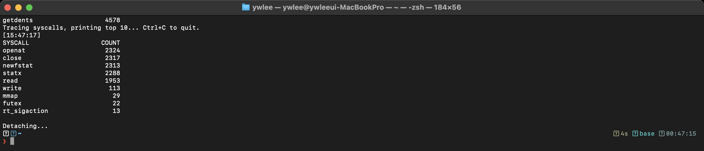
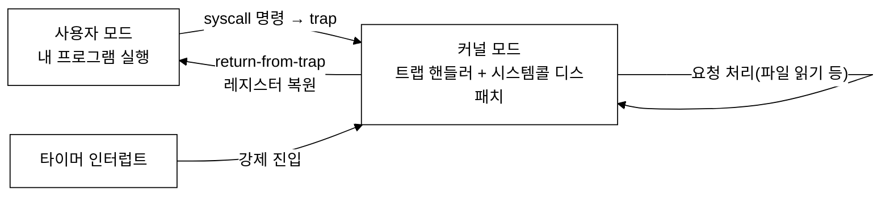

# [1부 가상화] V2 · 제한적 직접 실행과 시스템콜 (OSTEP 6장)

> OSTEP가 설명하는 "사용자 모드 ↔ 커널 모드 전환, 트랩, 시스템콜"의 실체를, eBPF로 시스템 전체의 시스템콜을 세어 보며 확인한다.

last_updated: 2026-06-12

> 🧭 **이 모듈을 보는 시점**  ·  📘 과목1 2주차 🟢  ·  📕 과목2 해당 없음
> - 🔬 **실습(VM `ssh ossca-ebpf`)**: `sudo syscount-bpfcc` · `examples/02_시스템콜/syscall_top.bt`
> - ↔️ **OS 트랙 이동**: ⬅️ [V1 프로세스·CPU API](V1_프로세스와_CPU_API.md) · 🏠 [OS 트랙 인덱스](README.md) · ➡️ [V3 CPU 스케줄링](V3_CPU_스케줄링.md)

---

> 🔰 입문자: 모르는 용어는 [용어집](../00c_용어집_약어사전.md), C코드는 [C 미니부록](../00b_준비_C언어_미니부록.md)을 참고한다.

## 이 모듈에서 배우는 것 (OSTEP ↔ eBPF)

| OSTEP 개념 | OSTEP에서 배우는 법 | eBPF로 관찰 |
|:---|:---|:---|
| 직접 실행의 문제 — 통제권을 어떻게 되찾나 | 6장 본문, 제한적 직접 실행(LDE) | 시스템콜이라는 "허락된 진입점"의 존재 |
| 사용자 모드 / 커널 모드 | 6장, 특권 명령 보호 | `syscount-bpfcc` 가 세는 것이 곧 커널 진입 |
| 트랩(trap)과 시스템콜 | 6장, trap table / 시스템콜 번호 | `syscount` 로 어떤 시스템콜이 많이 불리는지 순위 |
| 타이머 인터럽트로 제어권 회복 | 6장, 협력적 vs 비협력적 방식 | (스케줄링 전환은 V3로 연결) |

---

## 1. 왜 "제한적" 직접 실행인가

### 📖 OSTEP에서는

OSTEP 6장의 주제는 **제한적 직접 실행(Limited Direct Execution, LDE)** 이다. CPU 가상화를 빠르게 하려면 프로그램을 그냥 CPU에서 **직접** 돌리는 게 최선이다(직접 실행). 그런데 그냥 직접 돌리기만 하면 두 가지 문제가 생긴다.

1. **제한(restricted) 문제**: 프로그램이 디스크에 직접 접근하거나 다른 프로세스 메모리를 건드리는 등 **위험한 일**을 막을 방법이 없다.
2. **전환(switch) 문제**: 프로그램이 CPU를 독차지하면 OS가 **제어권을 되찾을** 방법이 없다.

OSTEP의 해법이 바로 "**제한적**" 직접 실행이다. 빠르게 직접 돌리되, 위험한 순간과 전환의 순간에만 OS가 개입할 수 있도록 하드웨어가 도와준다.

핵심 장치가 **두 가지 실행 모드**다.

- **사용자 모드(user mode)**: 특권 명령(I/O, 인터럽트 설정 등)을 못 씀.
- **커널 모드(kernel mode)**: 무엇이든 할 수 있음. OS만 이 모드로 돈다.

사용자 프로그램이 디스크 읽기처럼 특권이 필요한 일을 하려면, 직접 하지 못하고 **시스템콜(system call)** 로 OS에 "대신 해 달라"고 부탁해야 한다.

### ⚙️ 리눅스 커널은

사용자가 `svc #0`(arm64) / `syscall`(x86-64)을 실행하면 CPU가 트랩을 걸어 커널 진입점으로 점프한다. arm64 경로는 예외벡터 → `el0_svc`(`arch/arm64/kernel/entry-common.c`) → `el0_svc_common()` → `invoke_syscall()` → `sys_call_table[nr]`이며, nr은 레지스터 `x8`에서 읽는다. x86-64 경로는 `entry_SYSCALL_64`(어셈블리) → `do_syscall_64()` → `sys_call_table[nr]`이며, nr은 `rax`에서 읽는다.

```c
// arch/arm64/kernel/syscall.c — 시스템콜 번호로 핸들러를 호출하는 공통 지점
static void invoke_syscall(struct pt_regs *regs, unsigned int scno,
                           unsigned int sc_nr, const syscall_fn_t syscall_table[])
{
    syscall_fn_t syscall_fn;
    syscall_fn = syscall_table[array_index_nospec(scno, sc_nr)];
    ret = __invoke_syscall(regs, syscall_fn);   // sys_call_table[nr] 호출
}
```

각 핸들러는 `SYSCALL_DEFINE3(openat, ...)` 같은 매크로로 정의되어 `sys_call_table`에 등록된다. 이 표가 "번호 → 함수" 사전이다. eBPF의 `tracepoint:raw_syscalls:sys_enter`는 바로 이 디스패치 직전의 공통 지점에 붙으며, 그래서 모든 시스템콜을 한 번에 잡는다(다음 🔬 절·9주차로 연결된다).

### 🔬 eBPF로는 (실측)

시스템콜은 추상적인 개념이 아니라, 시스템에서 **초당 수만 번** 일어나는 구체적인 사건이다. `syscount-bpfcc` 는 모든 시스템콜에 eBPF를 부착해 **종류별로 몇 번 불렸는지** 센다.



위는 `sudo syscount-bpfcc` 의 **실제 터미널 캡처**다. 읽는 법:

- **SYSCALL** 열 = 시스템콜 이름(`read`, `write`, `futex`, `openat`, `ioctl` 등), **COUNT** 열 = 호출 횟수.
- 가장 위에 뜨는 시스템콜들이 곧 "사용자 모드에서 커널 모드로 넘어가는 가장 흔한 통로"다.
- OSTEP가 말하는 "사용자 프로그램은 위험한 일을 직접 못 하고 시스템콜로 부탁한다"가, 이 순위표의 모든 카운트로 증명된다. 한 행의 COUNT 1 증가 = 모드 전환 한 번.

### 🛠 직접 해보기

```bash
# 시스템 전체 시스템콜을 종류별로 카운트 (Ctrl+C 로 종료 시 합계 출력)
sudo syscount-bpfcc

# -P 로 프로세스(PID)별 합계, -i 1 로 1초마다 출력
sudo syscount-bpfcc -P
sudo syscount-bpfcc -i 1
```

---

## 2. 트랩·시스템콜·모드 전환의 흐름

### 📖 OSTEP에서는

특권이 필요할 때 사용자 프로그램은 특수한 명령(예: x86의 `syscall`)으로 **트랩(trap)** 을 일으킨다. 트랩이 발생하면 하드웨어가:

1. 현재 레지스터를 커널 스택에 저장하고,
2. **커널 모드**로 전환한 뒤,
3. 부팅 시 OS가 등록해 둔 **트랩 핸들러(trap table)** 로 점프한다.

OS는 시스템콜 **번호**를 보고 어떤 서비스인지 정하고(임의 주소로 점프 못 하게 번호로 통제), 일을 마치면 `return-from-trap` 으로 레지스터를 복원하고 **사용자 모드**로 되돌아간다.

그리고 전환 문제는 **타이머 인터럽트**로 해결한다. OS는 부팅 때 일정 주기로 인터럽트가 걸리게 설정해 두고, 인터럽트가 걸리면 강제로 커널로 들어와 **문맥 교환(context switch)** 으로 다른 프로세스에 CPU를 넘길 수 있다(비협력적 방식).



### 🔬 eBPF로는 (실측)

`syscount` 의 각 행은 위 그림에서 `U → trap → H` 화살표가 그 횟수만큼 일어났다는 기록이다. 특히 흥미로운 두 가지를 출력에서 확인할 수 있다.

- **`read`/`write`/`openat`**: 전형적인 I/O 시스템콜 — 사용자 프로그램이 디스크·네트워크에 직접 못 가고 커널에 부탁한 흔적.
- **`futex`**: 스레드 동기화(잠금 대기)용 — 블록되었다가 깨어나는 동안 커널을 거치는 흔적. V3의 스케줄링과 연결된다.

eBPF 자체도 이 메커니즘 위에서 동작한다. eBPF 프로그램은 시스템콜 진입/이탈 **트레이스포인트**에 붙어 카운트를 올리므로, 우리가 보는 숫자는 곧 커널이 실제로 통과한 진입점 수다. (자세한 추적기 제작은 [9주차](../09주차_실습1_시스템콜_추적기.md))

### 🛠 직접 해보기

```bash
# 특정 명령이 어떤 시스템콜을 쓰는지: bpftrace 로 진입 트레이스포인트 카운트
sudo bpftrace -e 'tracepoint:raw_syscalls:sys_enter { @[comm] = count(); }'

# OSTEP LDE 감각 — 단순한 프로그램도 시스템콜 없이는 출력조차 못 함을 확인
strace -c -- ls > /dev/null      # write/openat/mmap 등이 줄줄이 보임
```

---

## 💻 코드로 보기 — 이 관찰을 하는 eBPF 코드

> 위에서 본 OS 개념을 eBPF로 어떻게 잡는지, 실제 도구 코드(`labs/02_스케줄러/syscall_latency.py`)를 직접 본다. `syscount` 가 "몇 번"을 세었다면, 이 도구는 한 발 더 나아가 시스템콜이 **진입~반환까지 얼마나 걸렸는지(모드 전환 비용)** 를 분포로 잰다.

### ① 커널에서 도는 부분 (eBPF C)

`syscall_latency.py` 의 `BPF_TEXT` 안 C 코드다.

```c
BPF_HASH(start, u64, u64);     // pid_tgid -> 진입 시각
BPF_HISTOGRAM(dist);           // 소요시간(us) 로그2 분포
BPF_ARRAY(target, u32, 1);     // 0=전체, 그 외=해당 PID

TRACEPOINT_PROBE(raw_syscalls, sys_enter) {
    u64 id = bpf_get_current_pid_tgid();
    int zero = 0; u32 *t = target.lookup(&zero);
    if (t && *t != 0 && *t != (id >> 32)) { return 0; }
    u64 ts = bpf_ktime_get_ns();
    start.update(&id, &ts);
    return 0;
}
TRACEPOINT_PROBE(raw_syscalls, sys_exit) {
    u64 id = bpf_get_current_pid_tgid();
    u64 *tsp = start.lookup(&id);
    if (tsp) {
        dist.increment(bpf_log2l((bpf_ktime_get_ns() - *tsp) / 1000));
        start.delete(&id);
    }
    return 0;
}
```

- `BPF_HASH(start, u64, u64);` — 이 줄은 **(스레드 → 진입 시각)** 을 임시 저장하는 해시 맵이다. 진입 시점과 반환 시점을 짝지으려면 둘 사이에 시각을 보관해야 한다.
- `BPF_HISTOGRAM(dist);` — 이 줄은 소요시간을 **2의 거듭제곱 버킷으로 집계**하는 히스토그램 맵이다. 본문 syscount 가 단순 카운트였다면, 여기서는 "느린 꼬리"를 보기 위해 분포로 모은다.
- `TRACEPOINT_PROBE(raw_syscalls, sys_enter)` — 이 줄이 **모든 시스템콜의 진입** 트레이스포인트다. 본문 다이어그램의 `U → trap → H` 화살표가 일어나는 바로 그 순간. 어느 시스템콜이든 커널로 들어올 때 여기를 통과한다.
- `u64 ts = bpf_ktime_get_ns(); start.update(&id, &ts);` — 이 두 줄은 **진입 시각을 나노초 단위로 찍어** 해당 스레드 키로 저장한다. `bpf_ktime_get_ns()` 는 단조 증가 커널 시계다.
- `TRACEPOINT_PROBE(raw_syscalls, sys_exit)` — 이 줄이 **시스템콜 반환**(=`return-from-trap`, 커널 모드 → 사용자 모드) 트레이스포인트다.
- `dist.increment(bpf_log2l((bpf_ktime_get_ns() - *tsp) / 1000));` — 이 줄이 핵심 집계다. (반환 시각 − 진입 시각)을 마이크로초로 바꾸고, `bpf_log2l` 로 로그2 버킷에 넣어 히스토그램을 한 칸 올린다. **모드 전환 한 왕복에 걸린 시간**이 여기 기록된다.

### ② 사용자 공간 부분 (Python)

같은 파일 `main()` 부분이다.

```python
bpf = BPF(text=BPF_TEXT)
import ctypes
bpf["target"][ctypes.c_int(0)] = ctypes.c_uint(args.pid)
scope = f"PID={args.pid}" if args.pid else "전체"
print(f"시스템콜 지연 측정 {args.duration}초 ({scope})...", file=sys.stderr)
try:
    time.sleep(args.duration)
except KeyboardInterrupt:
    pass
print("\n=== 시스템콜 소요시간 분포 (단위: 마이크로초) ===")
bpf["dist"].print_log2_hist("usecs")
```

- `bpf = BPF(text=BPF_TEXT)` — 위 C 코드를 컴파일·로드하고 두 트레이스포인트에 부착한다.
- `bpf["target"][ctypes.c_int(0)] = ctypes.c_uint(args.pid)` — 사용자 공간에서 `target` 맵에 PID 필터 값을 써 넣는다. 커널 코드의 `target.lookup` 이 이 값을 읽어 특정 PID만 측정한다(0이면 전체).
- `time.sleep(args.duration)` — 측정하는 동안 파이썬은 그냥 잔다. **집계는 전부 커널 안 히스토그램 맵에서** 일어나므로 사용자 공간은 개입할 필요가 없다(저오버헤드의 비결).
- `bpf["dist"].print_log2_hist("usecs")` — 끝나면 커널이 모아 둔 `dist` 히스토그램을 읽어 막대그래프로 출력한다.

### 직접 실행

```bash
sudo python3 labs/02_스케줄러/syscall_latency.py --duration 5
```

기대 결과: 5초간 시스템콜 소요시간 분포가 마이크로초 단위 로그2 히스토그램으로 출력된다. 대부분은 작은 값(수 µs = 빠른 모드 전환)에 몰리고, 블로킹 콜의 "느린 꼬리"가 오른쪽에 보인다.

---

## 💡 핵심 요약 — OSTEP ↔ eBPF 대조표

| 주제 | OSTEP(이론) | eBPF(실측) |
|:---|:---|:---|
| 위험한 일 통제 | 사용자/커널 모드 분리 | `syscount` 카운트 = 커널 진입 횟수 |
| 진입 방법 | trap → 트랩 핸들러 → 시스템콜 번호 | `raw_syscalls:sys_enter` 트레이스포인트 |
| 가장 흔한 통로 | read/write 등 I/O | `syscount` 순위표 상위 항목 |
| 제어권 회복 | 타이머 인터럽트 → 문맥 교환 | (런큐 지연은 V3 `runqlat`) |

---

## ✅ 자가점검 퀴즈

<details><summary>Q1. "제한적" 직접 실행에서 "제한적"이 가리키는 두 문제는?</summary>
(1) 제한 문제: 사용자 프로그램이 위험한(특권) 동작을 못 하게 막기. (2) 전환 문제: 프로그램이 CPU를 독점하지 못하게 OS가 제어권을 되찾기. 모드 분리와 타이머 인터럽트로 각각 해결한다.
</details>

<details><summary>Q2. 사용자 프로그램이 파일을 읽으려면 왜 시스템콜을 써야 하나?</summary>
파일·디스크 접근은 특권 명령이라 사용자 모드에서 직접 못 한다. 트랩을 일으켜 커널 모드로 들어가 OS에 대신 해 달라고 부탁해야 한다. `syscount` 의 `read`/`openat` 카운트가 그 부탁의 횟수다.
</details>

<details><summary>Q3. 시스템콜에서 임의 주소로 점프하지 못하게 막는 장치는?</summary>
시스템콜 번호다. 사용자 프로그램은 번호만 지정하고, OS가 미리 등록한 트랩 테이블에서 그 번호에 해당하는 정해진 핸들러로만 진입한다. 임의 커널 주소로 뛰어들 수 없다.
</details>

<details><summary>Q4. CPU를 독점하는 무한 루프 프로그램에서 OS는 어떻게 제어권을 되찾나?</summary>
타이머 인터럽트다. OS가 부팅 시 주기적 인터럽트를 설정해 두면, 시간이 되면 강제로 커널로 진입해 문맥 교환으로 다른 프로세스에 CPU를 넘긴다(비협력적 방식).
</details>

---

## 📚 더 읽을거리

- OSTEP 6장(제한적 직접 실행) 한국어판.
- [2주차 · 리눅스 커널과 사용자공간, 시스템콜](../02주차_리눅스_커널과_사용자공간_시스템콜.md) — 모드 전환의 리눅스 구현.
- [9주차 · 실습1 시스템콜 추적기](../09주차_실습1_시스템콜_추적기.md) — syscount 같은 도구를 직접 만들어 보기.

## ⏭ 다음 모듈

[V3 · CPU 스케줄링](V3_CPU_스케줄링.md) — 타이머 인터럽트로 되찾은 CPU를 "누구에게, 얼마나" 줄지 정하는 정책을 본다.
