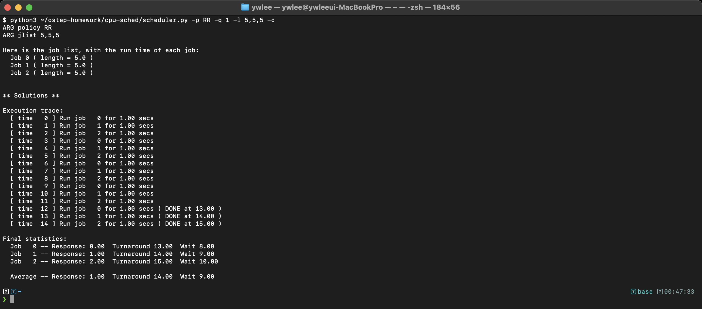
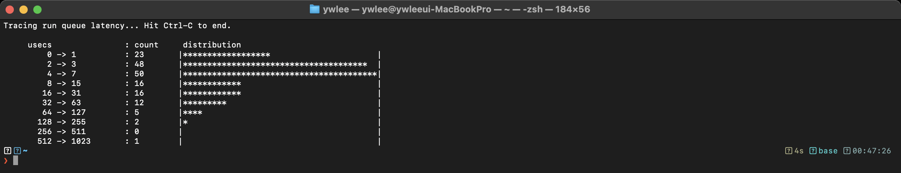
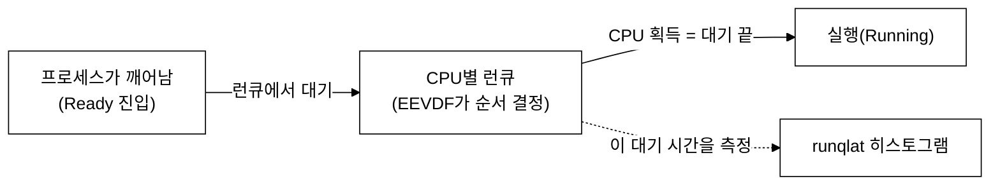

# [1부 가상화] V3 · CPU 스케줄링 (OSTEP 7–10장)

> OSTEP의 스케줄링 정책(FIFO·SJF·RR·MLFQ·추첨·멀티프로세서)을 시뮬레이터로 배우고, eBPF의 `runqlat` 로 실제 리눅스 스케줄러가 만든 "런큐 대기 시간"을 측정합니다.

last_updated: 2026-06-12

> 🧭 **이 모듈을 보는 시점**  ·  📘 과목1 5주차 🟢  ·  📕 과목2 5주차 🔵 (CFS·런큐 심화)
> - 🔬 **실습(VM `ssh ossca-ebpf`)**: `labs/02_스케줄러/runq_latency.py` · `sudo runqlat-bpfcc` · `sudo cpudist-bpfcc`
> - ↔️ **OS 트랙 이동**: ⬅️ [V2 시스템콜](V2_제한적직접실행과_시스템콜.md) · 🏠 [OS 트랙 인덱스](README.md) · ➡️ [V4 가상메모리](V4_가상메모리_주소공간_페이징.md)

---

> 🔰 입문자: 모르는 용어는 [용어집](../00c_용어집_약어사전.md), C코드는 [C 미니부록](../00b_준비_C언어_미니부록.md)을 참고하세요.

## 이 모듈에서 배우는 것 (OSTEP ↔ eBPF)

| OSTEP 개념 | OSTEP에서 배우는 법 | eBPF로 관찰 |
|:---|:---|:---|
| 스케줄링 지표(반환시간·응답시간) | 7장, `cpu-sched/scheduler.py` | `runqlat` 의 대기 시간 분포 |
| FIFO·SJF·STCF·RR | 7장, scheduler.py 정책 옵션 | RR의 응답시간↓ ↔ 짧은 대기 |
| MLFQ(다단계 피드백 큐) | 8장, `cpu-sched-mlfq/mlfq.py` | 리눅스 CFS/EEVDF 가 만든 실제 지연 |
| 추첨(lottery) 스케줄링 | 9장, `cpu-sched-lottery/lottery.py` | (비례 배분 개념) |
| 멀티프로세서 스케줄링 | 10장, `cpu-sched-multi/multi.py` | CPU별 런큐, 캐시 친화성 |

---

## 1. 스케줄링 기본 정책과 지표

### 📖 OSTEP에서는

OSTEP 7장은 **CPU 스케줄링 정책**을 다룹니다. 여러 프로세스가 Ready 상태로 줄 서 있을 때, OS는 누구에게 CPU를 줄지 정해야 합니다. 두 가지 핵심 지표로 정책을 평가합니다.

- **반환 시간(turnaround time)** = 완료 시각 − 도착 시각. (얼마나 빨리 끝나나)
- **응답 시간(response time)** = 처음 실행된 시각 − 도착 시각. (얼마나 빨리 반응하나)

대표 정책:

| 정책 | 특징 | 약점 |
|:---|:---|:---|
| **FIFO** | 도착 순서대로 | 긴 작업이 앞에 오면 호위 효과(convoy) |
| **SJF/STCF** | 짧은 작업 먼저(선점) | 작업 길이를 미리 알아야 함 |
| **RR(라운드로빈)** | 타임 슬라이스로 번갈아 | 반환 시간은 나쁨, 대신 응답 시간↓ |

OSTEP 시뮬레이터로 라운드로빈을 직접 돌려 봅니다.



위는 `cpu-sched/scheduler.py` 를 라운드로빈(`-p RR`), 타임 슬라이스 1(`-q 1`)로, 길이 5짜리 작업 3개(`-l 5,5,5`)에 대해 돌린 **실제 터미널 캡처**입니다. 읽는 법:

- `-c` 가 매 시각 어느 작업이 실행되는지와 각 작업의 반환/응답 시간을 계산해 줍니다.
- RR은 작업들을 1틱씩 번갈아 돌리므로 **응답 시간이 짧지만**, 모든 작업이 비슷한 시각에 끝나 **평균 반환 시간은 나빠집니다**. 같은 입력을 `-p FIFO` 로 바꿔 비교해 보면 trade-off 가 드러납니다.

```bash
# ~/ostep-homework/cpu-sched 에서
python3 scheduler.py -p RR -q 1 -l 5,5,5 -c     # 라운드로빈
python3 scheduler.py -p FIFO -l 5,5,5 -c        # FIFO 와 비교
python3 scheduler.py -p SJF -l 200,20,10 -c     # 짧은 작업 먼저의 효과
```

### 🔬 eBPF로는 (실측)

시뮬레이터의 "Ready 큐에서 기다린 시간"은 추상적인 숫자였습니다. 실제 리눅스에서 그 값이 바로 **런큐 지연(run queue latency)** — 프로세스가 깨어나 실행 가능해진 뒤 실제로 CPU를 받기까지 기다린 시간입니다. `runqlat-bpfcc` 가 이걸 히스토그램으로 보여 줍니다.



위는 `yes` 로 CPU 부하를 준 채 `sudo runqlat-bpfcc` 를 돌린 **실제 터미널 캡처**입니다. 읽는 법:

- 가로축(`usecs`)은 대기 시간 구간(2의 거듭제곱 버킷), `count` 는 그 구간에 들어간 횟수, `distribution` 은 막대그래프입니다.
- 대부분이 작은 값(수 마이크로초)에 몰려 있으면 CPU가 한가해 거의 즉시 실행됐다는 뜻이고, **부하가 커질수록 분포가 오른쪽(긴 대기)으로 번집니다** — 이것이 OSTEP가 말한 "Ready 큐에서 기다린 시간"의 실측값입니다.
- 즉 OSTEP scheduler.py 의 응답/대기 개념이, 리눅스에서는 이 히스토그램의 모양으로 나타납니다.

### 🛠 직접 해보기

```bash
# 터미널 1: 런큐 지연 측정 (Ctrl+C 시 히스토그램 출력)
sudo runqlat-bpfcc

# 터미널 2: CPU 경쟁을 일으켜 분포를 오른쪽으로 밀어 보기
yes > /dev/null & yes > /dev/null & yes > /dev/null &
# 끝나면: kill %1 %2 %3
```

---

## 2. MLFQ · 추첨 · 멀티프로세서

### 📖 OSTEP에서는

**MLFQ(8장)** — 작업 길이를 모를 때 쓰는 현실적 스케줄러입니다. 여러 우선순위 큐를 두고, **CPU를 오래 쓰면 우선순위를 낮추고**(연산 위주 작업), **금방 양보하면 높게 유지**(대화형 작업)합니다. 주기적으로 모두를 최상위로 끌어올려 굶주림(starvation)을 막습니다.

**추첨 스케줄링(9장)** — 각 프로세스에 **티켓**을 나눠 주고 매번 무작위 추첨으로 당첨자에게 CPU를 줍니다. 티켓 수에 **비례**해 CPU를 나눠 갖는 비례 배분(proportional share) 방식입니다.

**멀티프로세서(10장)** — CPU가 여러 개면, **캐시 친화성**(같은 작업을 같은 CPU에)과 **부하 균형**(놀고 있는 CPU로 작업 이동)을 동시에 신경 써야 합니다. 보통 CPU마다 별도 큐(per-CPU run queue)를 둡니다.

```bash
python3 ../cpu-sched-mlfq/mlfq.py -n 3 -j 3 -c          # MLFQ 3단계, 작업 3개
python3 ../cpu-sched-lottery/lottery.py -j 3 -s 0 -c    # 추첨, 시드 0
python3 ../cpu-sched-multi/multi.py -n 2 -L a:100:100 -c # CPU 2개 멀티프로세서
```

### 🔬 eBPF로는 (실측)

리눅스의 실제 스케줄러는 오랫동안 **CFS(Completely Fair Scheduler)** 였고 커널 6.6부터 **EEVDF** 로 바뀌었습니다. 둘 다 OSTEP의 MLFQ·추첨과 같은 목표(대화형 작업 우대 + 공정한 비례 배분)를 추구하지만, **가상 실행시간(vruntime)** 기반의 정교한 방식을 씁니다. 우리 VM(커널 6.17)은 EEVDF 를 씁니다.

`runqlat` 은 이 스케줄러가 만들어 내는 결과(런큐 지연)를 정책과 무관하게 측정합니다. 멀티프로세서이므로 리눅스는 **CPU별 런큐**를 운영하는데, `runqlat -C` 로 CPU별로 나눠 보면 OSTEP 10장의 "per-CPU run queue"가 실제로 존재함을 확인할 수 있습니다.



### 🛠 직접 해보기

```bash
# CPU별로 런큐 지연 나눠 보기 (멀티프로세서 큐 확인)
sudo runqlat-bpfcc -C

# 특정 PID 의 런큐 지연만
sudo runqlat-bpfcc -P

# 어떤 프로세스가 CPU를 얼마나 오래 점유하는지(스케줄러 관점 보강)
sudo bpftrace -e 'tracepoint:sched:sched_switch { @[args.prev_comm] = count(); }'
```

---

## 💻 코드로 보기 — 이 관찰을 하는 eBPF 코드

> 위에서 본 OS 개념을 eBPF로 어떻게 잡는지, 실제 도구 코드(`labs/02_스케줄러/runq_latency.py`)를 직접 본다. `runqlat` 가 측정하는 **런큐 지연**(깨어난 뒤 CPU를 받기까지 기다린 시간 = OSTEP scheduler.py 의 "Ready 큐 대기 시간")을 직접 구현한 축소판이다.

### ① 커널에서 도는 부분 (eBPF C)

`runq_latency.py` 의 `BPF_TEXT` 안 C 코드다.

```c
BPF_HASH(wake_ts, u32, u64);    // pid -> 깨어난 시각(ns)
BPF_HISTOGRAM(dist);            // 대기시간(us) 로그2 분포

static inline void mark_wakeup(u32 pid) {
    u64 ts = bpf_ktime_get_ns();
    wake_ts.update(&pid, &ts);
}

TRACEPOINT_PROBE(sched, sched_wakeup) {
    mark_wakeup(args->pid);
    return 0;
}
TRACEPOINT_PROBE(sched, sched_wakeup_new) {
    mark_wakeup(args->pid);
    return 0;
}

TRACEPOINT_PROBE(sched, sched_switch) {
    u32 next = args->next_pid;
    u64 *tsp = wake_ts.lookup(&next);
    if (tsp) {
        u64 delta_us = (bpf_ktime_get_ns() - *tsp) / 1000;
        dist.increment(bpf_log2l(delta_us));
        wake_ts.delete(&next);
    }
    return 0;
}
```

- `BPF_HASH(wake_ts, u32, u64);` — 이 줄은 **(PID → 깨어난 시각)** 을 보관하는 맵이다. "깨어난 순간"과 "CPU를 잡은 순간"을 짝지으려면 그 사이에 시각을 저장해야 한다.
- `BPF_HISTOGRAM(dist);` — 이 줄이 본문 캡처의 그 **런큐 지연 히스토그램**을 채울 맵이다.
- `TRACEPOINT_PROBE(sched, sched_wakeup)` / `sched_wakeup_new` — 이 두 줄이 태스크가 **Ready 상태로 진입(깨어남)** 하는 순간의 부착 지점이다. 본문 다이어그램의 `프로세스가 깨어남(Ready 진입)` 노드. `_new` 는 갓 생성된 태스크용이다.
- `mark_wakeup(args->pid)` 안의 `bpf_ktime_get_ns()` — 깨어난 시각을 나노초로 찍어 그 PID 키로 저장한다. **대기 시간 측정의 시작점**.
- `TRACEPOINT_PROBE(sched, sched_switch)` — 이 줄이 **문맥 교환**(다음 태스크가 실제 CPU를 잡는 순간)의 부착 지점이다. V2에서 본 "타이머 인터럽트 → 문맥 교환"이 실제로 일어나는 그곳.
- `u32 next = args->next_pid; ... wake_ts.lookup(&next);` — 이번에 **CPU를 받은 태스크**(`next_pid`)가 아까 깨어났던 적이 있는지 맵에서 찾는다.
- `u64 delta_us = (bpf_ktime_get_ns() - *tsp) / 1000; dist.increment(bpf_log2l(delta_us));` — 이 줄이 핵심이다. (CPU 잡은 시각 − 깨어난 시각) = **런큐에서 기다린 시간**을 계산해 히스토그램에 넣는다. 이 값이 곧 OSTEP의 응답/대기 시간이고, CPU 경쟁이 심할수록 커진다.

### ② 사용자 공간 부분 (Python)

같은 파일 `main()` 부분이다.

```python
bpf = BPF(text=BPF_TEXT)
print(f"스케줄러 대기시간 측정 {args.duration}초... (다른 창에서 'yes > /dev/null' 로 부하)",
      file=sys.stderr)
try:
    time.sleep(args.duration)
except KeyboardInterrupt:
    pass

print("\n=== CPU 실행 대기시간 분포 (단위: 마이크로초) ===")
bpf["dist"].print_log2_hist("usecs")
```

- `bpf = BPF(text=BPF_TEXT)` — 위 C 코드를 로드하고 세 개의 sched 트레이스포인트에 부착한다.
- `time.sleep(args.duration)` — 측정 동안 파이썬은 잠만 잔다. wakeup/switch 짝짓기와 집계는 **전부 커널 안에서** 일어난다.
- `bpf["dist"].print_log2_hist("usecs")` — 커널이 모은 런큐 지연 히스토그램을 읽어 본문 캡처와 같은 막대그래프로 찍는다.

### 직접 실행

```bash
sudo python3 labs/02_스케줄러/runq_latency.py --duration 5
# 부하를 주려면 다른 창에서:  yes > /dev/null
```

기대 결과: 5초간의 런큐 대기 시간 분포가 출력된다. 한가하면 대부분 수 µs(즉시 실행)에 몰리고, `yes` 로 CPU 경쟁을 주면 분포가 오른쪽(긴 대기)으로 번진다 — OSTEP의 "Ready 큐 대기 시간"이 커지는 모습.

---

## 💡 핵심 요약 — OSTEP ↔ eBPF 대조표

| 주제 | OSTEP(이론·시뮬레이션) | eBPF(실측) |
|:---|:---|:---|
| 응답/대기 시간 | scheduler.py 가 계산 | `runqlat` 히스토그램 |
| RR 의 trade-off | `-p RR -q 1` 로 확인 | 부하↑ → 분포 오른쪽 이동 |
| MLFQ/추첨 목표 | mlfq.py / lottery.py | 리눅스 CFS→EEVDF(vruntime) |
| per-CPU 런큐 | multi.py | `runqlat -C` 로 CPU별 분리 |

---

## ✅ 자가점검 퀴즈

<details><summary>Q1. 라운드로빈(RR)은 어떤 지표가 좋고 어떤 지표가 나쁜가?</summary>
응답 시간이 좋습니다(모든 작업이 금방 한 번씩 실행됨). 대신 평균 반환 시간은 나쁩니다(작업들이 비슷한 시각에 함께 끝남). scheduler.py 로 FIFO 와 비교하면 확인됩니다.
</details>

<details><summary>Q2. `runqlat` 이 측정하는 "런큐 지연"은 OSTEP의 무엇에 대응하나?</summary>
프로세스가 Ready 큐에서 CPU를 받기까지 기다린 시간입니다. OSTEP scheduler.py 의 대기·응답 시간 개념의 실제 리눅스 측정값입니다.
</details>

<details><summary>Q3. MLFQ는 작업 길이를 모르는데 어떻게 대화형 작업을 우대하나?</summary>
행동을 관찰합니다. CPU를 오래 쓰면 우선순위를 낮추고, 슬라이스를 다 쓰기 전에 양보(I/O 대기)하면 높은 우선순위를 유지합니다. 대화형 작업은 자주 양보하므로 자연히 우대됩니다.
</details>

<details><summary>Q4. 멀티프로세서에서 CPU별 런큐를 쓰는 이유 하나는?</summary>
캐시 친화성과 확장성입니다. 작업을 같은 CPU에 묶어 두면 캐시가 따뜻하게 유지되고, 하나의 전역 큐를 모든 CPU가 잠그며 경쟁하는 비용도 피합니다. `runqlat -C` 로 CPU별 분포를 볼 수 있습니다.
</details>

<details><summary>Q5. 우리 실습 VM(커널 6.17)의 기본 스케줄러는?</summary>
EEVDF 입니다(커널 6.6부터 CFS를 대체). 둘 다 vruntime 기반으로 공정한 비례 배분과 대화형 우대를 추구합니다.
</details>

---

## 📚 더 읽을거리

- OSTEP 7장(스케줄링 기본), 8장(MLFQ), 9장(추첨), 10장(멀티프로세서) 한국어판.
- [14주차 · 관측성과 성능분석, 프로파일링](../14주차_관측성과_성능분석_프로파일링.md) — runqlat·오프CPU 분석을 성능 관점으로.
- [7주차 · bpftrace 입문](../07주차_bpftrace_입문.md) — `sched:sched_switch` 트레이스포인트로 직접 측정.

## ⏭ 다음 모듈

[V4 · 가상 메모리: 주소 공간과 페이징](V4_가상메모리_주소공간_페이징.md) — CPU 가상화에서 메모리 가상화로 넘어가, 주소 공간·페이징·TLB·페이지 폴트를 봅니다.
