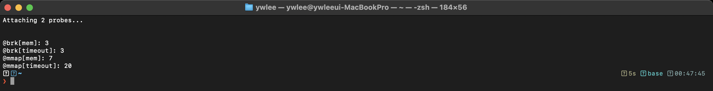
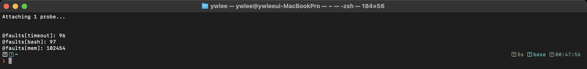
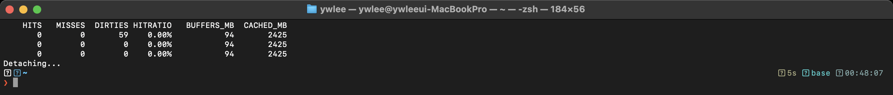

# [1부 가상화] V4 · 가상 메모리: 주소 공간과 페이징 (OSTEP 13–22장)

> OSTEP의 주소 공간·메모리 API·주소 변환·페이징·TLB·교체 정책을, eBPF로 실제 메모리 할당(mmap/brk), 페이지 폴트, 페이지 캐시 적중률을 측정하며 확인한다.

last_updated: 2026-06-12

> 🧭 **이 모듈을 보는 시점**  ·  📘 과목1 6주차 🟢  ·  📕 과목2 6주차 🔵 (페이지테이블·TLB 심화)
> - 🔬 **실습(VM `ssh ossca-ebpf`)**: `labs/03_메모리/page_faults.py` · `labs/03_메모리/mmap_size.py` · `sudo cachestat-bpfcc`
> - ↔️ **OS 트랙 이동**: ⬅️ [V3 CPU 스케줄링](V3_CPU_스케줄링.md) · 🏠 [OS 트랙 인덱스](README.md) · ➡️ [C1 스레드](C1_스레드와_API.md)

---

> 🔰 입문자: 모르는 용어는 [용어집](../00c_용어집_약어사전.md), C코드는 [C 미니부록](../00b_준비_C언어_미니부록.md)을 참고한다.

## 이 모듈에서 배우는 것 (OSTEP ↔ eBPF)

| OSTEP 개념 | OSTEP에서 배우는 법 | eBPF로 관찰 |
|:---|:---|:---|
| 주소 공간(code/heap/stack) | 13장 | (개념) |
| 메모리 API `malloc`/`free` | 14장, `malloc`→`brk`/`mmap` | `sys_enter_mmap`/`sys_enter_brk` 카운트 |
| 주소 변환(베이스+바운드) | 15장, `vm-mechanism/relocation.py` | (개념) |
| 페이징 | 18장, `vm-paging/paging-linear-translate.py` | 페이지 폴트로 페이지 단위 확인 |
| TLB | 19장 | (개념·캐시 친화성) |
| 다단계 페이지 테이블 | 21장, `vm-smalltables/paging-multilevel-translate.py` | (개념) |
| 물리 메모리 너머 / 교체 정책 | 22장, `vm-beyondphys-policy/paging-policy.py` | `page-faults`, `cachestat` 적중률 |

---

## 1. 주소 공간과 메모리 API — malloc 은 결국 시스템콜

### 📖 OSTEP에서는

**왜 페이징이 등장했나.** 프로그램마다 메모리가 필요한데 물리 메모리는 한정돼 있고, 여러 프로세스가 서로 침범 없이 같이 떠야 한다. 그래서 각 프로세스에 "자기만의 연속된 가상 주소공간"이라는 환상을 준다. 이전 방식인 베이스+바운드는 한 연속 영역만 줄 수 있어 유연하지 않았고, 세그먼테이션(가변 크기 영역)은 영역들이 들고 나며 빈 공간이 조각나는 **외부 단편화**(external fragmentation — 총 여유 메모리는 충분한데 연속된 큰 덩어리가 없어 할당 실패)를 일으켰다. 페이징은 메모리를 **고정 크기 페이지**로 잘라 물리 메모리 어디에나 흩어 담는다. 고정 크기라 외부 단편화가 사라진다. 가상→물리 변환은 프로세스마다의 **페이지테이블**이 한다. 대신 페이지테이블 자체가 메모리를 먹고(프로세스마다 큰 표), 매 메모리 접근마다 변환 비용이 든다. 이를 **TLB**(Translation Lookaside Buffer, 가상→물리 변환 결과를 캐시하는 CPU 내 빠른 표)로 완화하지만 TLB 미스 시 페이지테이블을 다시 걷는 비용이 있다. 또 페이지 끝 남는 공간은 **내부 단편화**가 된다.

OSTEP 13장은 **주소 공간(address space)** 을 소개한다. 각 프로세스는 0번지부터 시작하는 **자기만의 가상 주소 공간**을 가진 것처럼 보인다. 보통 위에는 **코드**, 그 아래로 **힙(heap, 위로 자람)** 과 **스택(stack, 아래로 자람)** 이 배치된다. 실제 물리 메모리 위치는 OS가 숨긴다 — 이것이 **메모리 가상화**다.

14장은 C의 메모리 API를 다룬다. `malloc()` 으로 힙에서 할당하고 `free()` 로 반납한다. 중요한 점: `malloc` 은 **라이브러리 함수**일 뿐, 실제로 OS에서 메모리를 받아오는 건 **시스템콜**이다.

- **`brk`/`sbrk`**: 힙의 끝(break)을 옮겨 작은 할당을 처리.
- **`mmap`**: 큰 덩어리를 익명 매핑으로 통째로 받아옴(대형 할당 시).

### 🔬 eBPF로는 (실측)

`malloc` 이 내부적으로 어떤 시스템콜을 부르는지 eBPF로 직접 셀 수 있다. `mmap` 과 `brk` 진입 트레이스포인트에 부착해 프로세스별로 카운트한다.



위는 메모리를 할당하는 프로그램을 돌리는 동안 아래 한 줄을 실행한 **실제 터미널 캡처**다.

```bash
sudo bpftrace -e 'tracepoint:syscalls:sys_enter_mmap { @mmap[comm] = count(); }
                  tracepoint:syscalls:sys_enter_brk  { @brk[comm]  = count(); }'
```

읽는 법:

- `@mmap[...]` 와 `@brk[...]` 가 프로세스 이름(comm)별로 각 시스템콜 호출 횟수를 보여 준다.
- 작은 할당이 많은 프로그램은 `brk` 가, 큰 버퍼를 한 번에 잡는 프로그램은 `mmap` 이 두드러진다.
- OSTEP가 "malloc 은 brk/mmap 으로 OS에 메모리를 요청한다"고 한 문장을, 이 카운트가 실측으로 보여 준다.

### 🛠 직접 해보기

```bash
sudo bpftrace -e 'tracepoint:syscalls:sys_enter_mmap { @mmap[comm] = count(); }
                  tracepoint:syscalls:sys_enter_brk  { @brk[comm]  = count(); }'
# 다른 터미널에서 메모리를 많이 쓰는 프로그램 실행 (예: python3 -c "x=[0]*10**7")
```

OSTEP 주소 변환 시뮬레이터도 함께 돌려 본다.

```bash
python3 ~/ostep-homework/vm-mechanism/relocation.py -s 0 -c        # 베이스+바운드 변환
python3 ~/ostep-homework/vm-paging/paging-linear-translate.py -c   # 선형 페이지 테이블 변환
```

---

## 2. 페이징과 페이지 폴트

### 📖 OSTEP에서는

OSTEP 18장의 **페이징(paging)** 은 주소 공간을 고정 크기 **페이지**(보통 4KB)로, 물리 메모리를 같은 크기 **프레임**으로 나눠 둘을 **페이지 테이블**로 매핑하는 기법이다. 19장의 **TLB(Translation Lookaside Buffer)** 는 최근 변환을 캐시해 매 접근마다 페이지 테이블을 읽는 비용을 줄인다. 21장은 거대한 페이지 테이블을 줄이는 **다단계 페이지 테이블**을 다룬다.

22장의 **물리 메모리 너머**: 물리 메모리가 부족하면 일부 페이지를 디스크(스왑)로 내보낸다(스왑(swap) = 물리 메모리가 부족하면 잘 안 쓰는 페이지를 디스크로 잠시 내보내는 것). 매핑은 있지만 페이지가 메모리에 없는 주소에 접근하면 **페이지 폴트(page fault)** 가 나고, OS가 그 페이지를 가져온다(필요 시 교체 정책으로 희생자 선택 — LRU 등).

```bash
python3 ~/ostep-homework/vm-smalltables/paging-multilevel-translate.py -c   # 다단계 변환
python3 ~/ostep-homework/vm-beyondphys-policy/paging-policy.py -p LRU -c     # 교체 정책 비교
# vm-beyondphys 에는 mem.c 실제 코드가 있어 직접 컴파일해 메모리 압박을 만들 수 있음
```

### ⚙️ 리눅스 커널은

프로세스의 주소공간은 `struct mm_struct`가 대표한다. 실습 VM(커널 6.17)의 BTF에서 확인한 실제 필드는 다음과 같다.

```c
struct mm_struct {              // (커널 6.17 BTF 발췌)
    struct maple_tree   mm_mt;      // VMA들을 담는 maple tree (최신 커널; 옛 rbtree mm_rb를 대체)
    long unsigned int   mmap_base;
    pgd_t              *pgd;        // 최상위 페이지테이블(주소 변환의 뿌리)
    long unsigned int   total_vm;
};
```

한 영역(코드/힙/스택/매핑)은 `struct vm_area_struct`(vm_start, vm_end, vm_flags, vm_file)다. 과거엔 연결 리스트와 rbtree로 관리했으나, 최신 커널은 maple tree(`mm_mt`)로 VMA를 조회한다. 가상→물리 변환은 다단계 페이지테이블을 건는다: **pgd → p4d → pud → pmd → pte**(최대 5단계). 변환 결과는 **TLB**에 캐시된다.

페이지폴트 처리 경로는 다음과 같다. 접근한 페이지가 없으면 CPU가 폴트 예외를 일으키고, `handle_mm_fault()`(`mm/memory.c`)가 어느 VMA인지 maple tree로 찾아 `do_anonymous_page()`/`do_fault()`로 페이지를 채우고 pte를 갱신한 뒤 그 명령을 재실행한다(demand paging). eBPF의 `software:page-faults`/`exceptions:page_fault_user`는 이 폴트 발생을 센다(→ 🔬 절).

### 🔬 eBPF로는 (실측)

페이지 폴트는 OSTEP에서 추상적이었지만, eBPF의 `software:page-faults` 프로브로 프로세스별 발생 횟수를 셀 수 있다.



위는 대용량 메모리에 접근하는 프로그램을 돌리며 아래를 실행한 **실제 터미널 캡처**다.

```bash
sudo bpftrace -e 'software:page-faults:1 { @faults[comm] = count(); }'
```

- `@faults[comm]` 이 프로세스별 페이지 폴트 횟수다.
- 새로 할당한 메모리에 **처음 쓸 때**마다 폴트가 나며 물리 프레임이 그때 비로소 붙는다(demand paging = 페이지를 미리 다 올리지 않고 실제 접근(페이지폴트) 시 그때 올리는 방식). 그래서 메모리를 크게 만지는 프로그램일수록 카운트가 크다 — OSTEP 18·22장의 "매핑은 접근 시점에 채워진다"가 그대로 보인다.

### 🛠 직접 해보기

```bash
sudo bpftrace -e 'software:page-faults:1 { @faults[comm] = count(); }'
# 다른 터미널: 큰 배열을 만지는 프로그램으로 폴트 유발
python3 -c "x=bytearray(200*1024*1024); x[::4096]=b'a'*(len(x)//4096)"
```

---

## 3. 페이지 캐시 — 디스크 접근도 메모리로 캐시된다

### 📖 OSTEP에서는

22장의 "물리 메모리 너머"는 메모리를 디스크의 캐시처럼 쓰는 발상을 보여 준다. 파일을 읽을 때 OS는 그 내용을 **페이지 캐시**(한 번 읽은 파일 데이터를 메모리에 캐싱해 다음 접근을 빠르게 하는 커널 캐시)에 보관해, 다음에 같은 데이터를 읽으면 디스크까지 가지 않고 메모리에서 바로 준다. 적중률(hit ratio)이 높을수록 느린 디스크 접근이 줄어든다 — 교체 정책(LRU 등)이 "무엇을 캐시에 남길지" 정한다.

### 🔬 eBPF로는 (실측)

`cachestat-bpfcc` 는 페이지 캐시의 적중/미스를 실시간으로 보여 준다.



위는 파일을 대량으로 읽는 동안 `sudo cachestat-bpfcc 1` 을 돌린 **실제 터미널 캡처**다. 읽는 법:

- **HITS** = 캐시에서 바로 찾은 횟수, **MISSES** = 캐시에 없어 디스크로 간 횟수, 그 비율이 적중률이다.
- 같은 파일을 **두 번째** 읽으면 HITS 가 치솟는다 — 첫 읽기로 페이지 캐시에 올라왔기 때문이다. OSTEP가 말한 "메모리를 디스크의 캐시로 쓴다"가 적중률 숫자로 증명된다.


### 🛠 직접 해보기

```bash
# 터미널 1: 1초마다 페이지 캐시 통계
sudo cachestat-bpfcc 1

# 터미널 2: 큰 파일을 두 번 읽어 적중률 변화 관찰
dd if=/dev/zero of=/tmp/big bs=1M count=500
cat /tmp/big > /dev/null    # 1회차: MISS 多
cat /tmp/big > /dev/null    # 2회차: HIT 多
```

---

## 💻 코드로 보기 — 이 관찰을 하는 eBPF 코드

> 위에서 본 OS 개념을 eBPF로 어떻게 잡는지, 실제 도구 코드(`labs/03_메모리/page_faults.py`)를 직접 본다. 위 2절의 `software:page-faults` bpftrace 원라이너를, BCC로 프로세스별 집계하도록 만든 도구다. demand paging이 일어날 때마다(=처음 쓸 때) 폴트를 프로세스별로 센다.

### ① 커널에서 도는 부분 (eBPF C)

`page_faults.py` 의 `BPF_TEXT` 안 C 코드다.

```c
struct comm_t { char name[16]; };
BPF_HASH(faults, u32, u64);          // pid -> 페이지 폴트 횟수
BPF_HASH(names, u32, struct comm_t); // pid -> comm

int on_page_fault(struct bpf_perf_event_data *ctx) {
    u32 pid = bpf_get_current_pid_tgid() >> 32;
    u64 init = 0, *cnt = faults.lookup_or_try_init(&pid, &init);
    if (cnt) {
        (*cnt)++;
    }
    struct comm_t c = {};
    bpf_get_current_comm(&c.name, sizeof(c.name));
    names.update(&pid, &c);
    return 0;
}
```

- `BPF_HASH(faults, u32, u64);` — 이 줄은 **(PID → 페이지 폴트 횟수)** 누적 맵이다. 본문에서 "메모리를 크게 만지는 프로그램일수록 카운트가 크다"는 그 카운트가 여기 쌓인다.
- `BPF_HASH(names, u32, struct comm_t);` — 이 줄은 출력에 이름을 보여 주려고 **(PID → 프로세스 이름)** 도 함께 기억한다.
- `int on_page_fault(struct bpf_perf_event_data *ctx)` — 이 함수가 **페이지 폴트 이벤트마다** 호출된다. 트레이스포인트가 아니라 perf 소프트웨어 이벤트(`page-faults`)에 붙는 형태라 인자 타입이 `bpf_perf_event_data` 다. demand paging으로 물리 프레임이 새로 붙는 매 순간이 여기로 들어온다.
- `u32 pid = bpf_get_current_pid_tgid() >> 32;` — 이 줄은 **폴트를 일으킨 프로세스의 PID**를 얻는다(상위 32비트).
- `u64 init = 0, *cnt = faults.lookup_or_try_init(&pid, &init);` — 이 줄은 그 PID의 카운터를 찾고, 없으면 0으로 **초기화하며 가져온다**. 첫 폴트도 안전하게 셀 수 있다.
- `(*cnt)++;` — 이 줄이 실제 **집계**다. 폴트 한 번 = 카운트 +1.
- `bpf_get_current_comm(&c.name, ...); names.update(&pid, &c);` — 이 줄들은 프로세스 이름을 가져와 PID에 매핑해 둔다.

### ② 사용자 공간 부분 (Python)

같은 파일 `main()` 의 부착·맵 읽기 부분이다.

```python
bpf = BPF(text=BPF_TEXT)
# 소프트웨어 페이지폴트 이벤트에 부착 (PERF_COUNT_SW_PAGE_FAULTS = 2)
bpf.attach_perf_event(ev_type=1, ev_config=2, fn_name="on_page_fault",
                      sample_period=1, sample_freq=0)
print(f"페이지 폴트 측정 {args.duration}초...", file=sys.stderr)
try:
    time.sleep(args.duration)
except KeyboardInterrupt:
    pass

names = bpf["names"]
rows = []
for k, v in bpf["faults"].items():
    comm = names[k].name.decode("utf-8", "replace").rstrip("\x00") if k in names else "?"
    rows.append((k.value, comm, v.value))
rows.sort(key=lambda r: -r[2])

for pid, comm, n in rows[: args.top]:
    print(f"  {pid:>7} {comm:<16} {n:>10,}")
```

- `bpf = BPF(text=BPF_TEXT)` — 위 C 코드를 컴파일·로드한다.
- `bpf.attach_perf_event(ev_type=1, ev_config=2, fn_name="on_page_fault", sample_period=1, ...)` — 이 줄이 **부착**이다. `ev_type=1`(소프트웨어 이벤트)·`ev_config=2`(`PERF_COUNT_SW_PAGE_FAULTS`)에 `on_page_fault` 를 걸고, `sample_period=1` 로 **폴트가 날 때마다 빠짐없이** 호출되게 한다.
- `for k, v in bpf["faults"].items():` — 측정이 끝난 뒤 커널이 모아 둔 `faults` 맵을 **순회**하며 (PID, 이름, 폴트수)를 모은다.
- `rows.sort(key=lambda r: -r[2])` + 출력 — 폴트수 내림차순으로 정렬해 **메모리를 가장 많이 만지는 프로세스 순위**를 찍는다.

### 직접 실행

```bash
sudo python3 labs/03_메모리/page_faults.py --duration 5
# 다른 창에서 폴트 유발:  python3 -c "x=bytearray(200*1024*1024); x[::4096]=b'a'*(len(x)//4096)"
```

기대 결과: 5초 동안의 프로세스별 페이지 폴트 횟수가 많은 순으로 표로 출력된다 — 큰 배열을 처음 만지는 프로그램이 demand paging 때문에 상위에 오른다.

---

## 💡 핵심 요약 — OSTEP ↔ eBPF 대조표

| 주제 | OSTEP(이론·시뮬레이션) | eBPF(실측) |
|:---|:---|:---|
| malloc 의 실체 | brk/mmap 설명, relocation.py | `sys_enter_mmap`/`sys_enter_brk` 카운트 |
| 페이징·demand paging | paging-linear-translate.py | `software:page-faults` 카운트 |
| 교체 정책(LRU 등) | paging-policy.py | (정책 결과는 캐시 적중률에 반영) |
| 메모리=디스크 캐시 | 22장 본문 | `cachestat-bpfcc` HITS/MISSES |

---

## ✅ 자가점검 퀴즈

<details><summary>Q1. `malloc()` 자체는 시스템콜이 아니다 — 그럼 무엇이 OS에서 메모리를 받아오나?</summary>
`brk`/`sbrk`(힙 끝 이동, 작은 할당)와 `mmap`(큰 익명 매핑, 대형 할당)이다. malloc 은 라이브러리 함수로서 내부적으로 이들을 호출한다. bpftrace 로 두 시스템콜 카운트를 직접 볼 수 있다.
</details>

<details><summary>Q2. 새로 malloc 한 큰 메모리에 처음 쓸 때 페이지 폴트가 나는 이유는?</summary>
demand paging 때문이다. 할당 시점엔 가상 매핑만 생기고 물리 프레임은 붙지 않는다. 처음 접근(쓰기)할 때 폴트가 발생해 OS가 그제서야 물리 프레임을 연결한다.
</details>

<details><summary>Q3. 같은 파일을 두 번 읽으면 `cachestat` 의 HITS 가 왜 늘어나나?</summary>
첫 읽기로 파일 내용이 페이지 캐시(메모리)에 올라오기 때문이다. 두 번째 읽기는 디스크까지 가지 않고 캐시에서 바로 가져오므로 HIT 으로 집계된다.
</details>

<details><summary>Q4. TLB가 하는 일을 한 문장으로?</summary>
최근 사용한 가상→물리 주소 변환을 캐시해, 매 메모리 접근마다 페이지 테이블을 읽는 비용을 줄인다. 캐시 친화성(같은 페이지 반복 접근)이 좋을수록 효과가 크다.
</details>

<details><summary>Q5. 다단계 페이지 테이블은 어떤 문제를 푸는가?</summary>
선형(단일) 페이지 테이블은 주소 공간이 커지면 테이블 자체가 너무 커진다. 다단계는 실제로 쓰지 않는 영역의 하위 테이블을 만들지 않아 페이지 테이블의 메모리 낭비를 줄인다.
</details>

---

## 📚 더 읽을거리

- OSTEP 13장(주소 공간), 14장(메모리 API), 15장(주소 변환), 18·19장(페이징·TLB), 21·22장(다단계·물리 메모리 너머) 한국어판.
- [2주차 · 리눅스 커널과 사용자공간, 시스템콜](../02주차_리눅스_커널과_사용자공간_시스템콜.md) — mmap/brk 가 거치는 경계.
- [14주차 · 관측성과 성능분석, 프로파일링](../14주차_관측성과_성능분석_프로파일링.md) — 페이지 폴트·캐시 적중률을 성능 분석 관점으로.

## ⏭ 다음 모듈

1부 가상화(CPU·메모리)를 마쳤다. 다음은 OSTEP 2부 **병행성(Concurrency)** — 스레드·락·조건 변수를, `futex` 추적과 오프CPU 분석으로 관찰한다.
