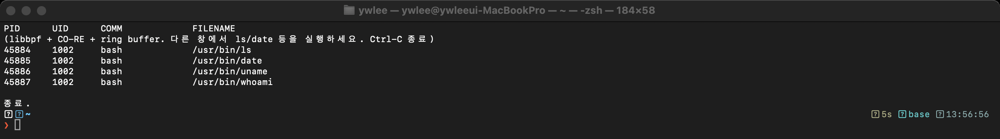
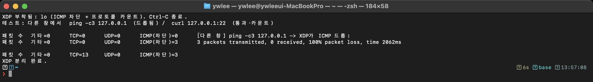
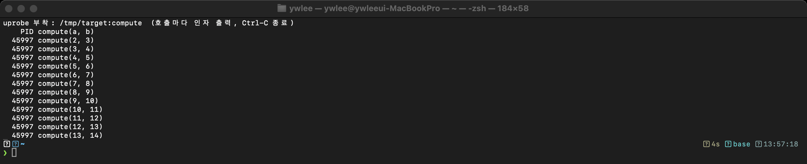

# 고급 실습 — eBPF 제작·네트워킹·강제 (관측을 넘어서)

> 앞의 [labs](../README.md) 14종은 BCC로 **관측**했다면, 여기는 eBPF의 **실전 제작·강제**를 다룬다.
> **libbpf/CO-RE C · XDP 패킷 드롭 · uprobe · USDT · ring buffer** — "eBPF로 할 수 있는 것"의 폭을 완성한다.
> 전부 VM(커널 6.17, aarch64)에서 **실제 빌드·실행 검증**됨. 화면은 실제 터미널 캡처.

last_updated: 2026-06-12

> 빌드 도구: `clang`/`llvm`/`libbpf-dev`/`make`(VM에 설치됨). C 예제는 `make` 로 빌드.

---

## 1. libbpf + CO-RE + ring buffer — `01_libbpf_execsnoop/`

**🔬 무엇**: BCC처럼 런타임 컴파일하지 않고, **미리 컴파일한 오브젝트를 배포**해 여러 커널에서 도는 방식(프로덕션 표준). exec를 ring buffer로 스트리밍한다.
**📖 OS/개념**: 11주차(libbpf·CO-RE), ring buffer(순서 보존, 커널 5.8+).

```bash
cd ~/ebpf-labs/labs/08_고급/01_libbpf_execsnoop
make                 # vmlinux.h → BPF오브젝트(clang) → 스켈레톤(bpftool) → 링크(libbpf)
sudo ./execsnoop     # 다른 창에서 ls/date 실행, Ctrl-C 종료
```


> 빌드 파이프라인: `execsnoop.bpf.c` →(clang -target bpf)→ `.bpf.o` →(bpftool gen skeleton)→ `.skel.h` →(cc+libbpf)→ 실행파일.

## 2. XDP 방화벽 — 패킷 드롭(강제) + 카운트 — `02_xdp_방화벽/`

**🔬 무엇**: 네트워크 스택보다 앞(드라이버 최전선)에서 패킷을 **카운트하고 ICMP를 드롭(XDP_DROP)**. eBPF의 **관측→강제(enforcement)** 를 보여준다(DDoS 방어·LB의 기초).
**📖 OS/개념**: 12주차(XDP/tc/Cilium). **안전**: loopback(lo)에만 붙여 SSH(외부 IF)엔 영향 없음.

```bash
cd ~/ebpf-labs/labs/08_고급/02_xdp_방화벽
make && sudo ./xdp_firewall lo
#  다른 창:  ping -c3 127.0.0.1   → 100% 손실(XDP가 드롭) /   curl 127.0.0.1:22 → TCP 카운트
```


> 위 화면: `ICMP(차단)=3` 으로 세고 **ping이 100% packet loss** = 커널에 닿기 전에 드롭. `TCP=13`은 통과·카운트.
> (BPF-LSM 강제는 이 VM 커널이 `lsm=` 에 bpf 미포함이라 불가 → XDP 드롭으로 "강제"를 실습한다.)

## 3. uprobe — 사용자 공간 함수 추적 — `03_uprobe_usdt/uprobe_func.py`

**🔬 무엇**: 커널이 아니라 **사용자 프로그램/라이브러리 함수**에 eBPF를 붙인다. 소스 수정 없이 앱 내부(인자까지)를 본다.
**📖 개념**: 5주차(부착 지점), uprobe.

```bash
cd ~/ebpf-labs/labs/08_고급/03_uprobe_usdt
cc -O2 -o /tmp/target target.c && /tmp/target &     # noinline 함수 compute 를 가진 데모
sudo python3 uprobe_func.py /tmp/target              # compute(a,b) 호출·인자 추적
```


## 4. USDT — 애플리케이션 정적 추적점 — `03_uprobe_usdt/usdt_trace.bt`

**🔬 무엇**: 프로그램/라이브러리에 미리 박힌 **정적 추적점(USDT)**. uprobe보다 안정적. glibc의 pthread USDT(`cond_broadcast`)를 잡는다.

```bash
cc -O2 -o /tmp/usdt_trigger usdt_trigger.c -lpthread && /tmp/usdt_trigger &
sudo bpftrace usdt_trace.bt          # @broadcasts[usdt_trigger] 가 증가
# 목록:  sudo bpftrace -l 'usdt:/usr/lib/aarch64-linux-gnu/libc.so.6:*'
```

## 5. ring buffer (BCC 버전) — `04_ringbuf_BCC/ringbuf_exec.py`

**🔬 무엇**: 같은 ring buffer를 **BCC API**로(`BPF_RINGBUF_OUTPUT`/`ringbuf_reserve`/`open_ring_buffer`). perf buffer와 대비해 순서 보존·효율을 체감.

```bash
sudo python3 04_ringbuf_BCC/ringbuf_exec.py    # 다른 창에서 ls/date
```

---

## perf buffer vs ring buffer (이 단원 핵심 대비)

| | perf buffer | ring buffer (5.8+) |
|:---|:---|:---|
| 구조 | CPU마다 별도 | 모든 CPU 공유 1개 |
| 순서 | 섞일 수 있음 | **보존** |
| 메모리 | 더 씀 | 효율적 |
| API | `perf_submit`/`open_perf_buffer` | `ringbuf_reserve/submit`/`open_ring_buffer` |
| 우리 예제 | labs 대부분 | 1·5번(libbpf·BCC) |

## 더 보기
- 관측 도구 14종 → [labs/](../README.md) · 정식 추적기 → [projects/](../../projects/)
- libbpf/XDP 개념 → [11주차](../../docs/lecture/11주차_libbpf와_CO-RE_프로덕션eBPF.md) · [12주차](../../docs/lecture/12주차_eBPF_네트워킹_XDP_tc_Cilium.md)
