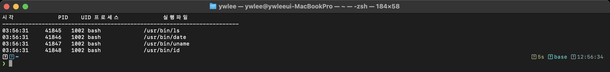
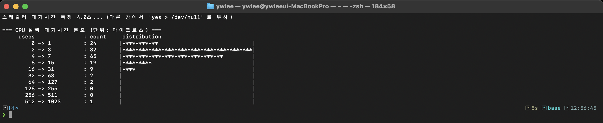
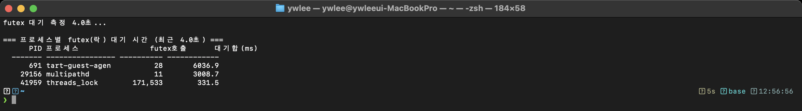
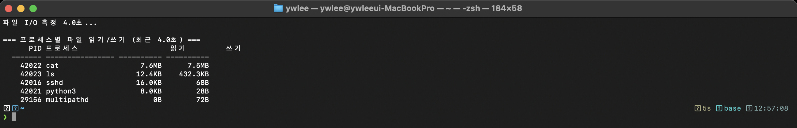
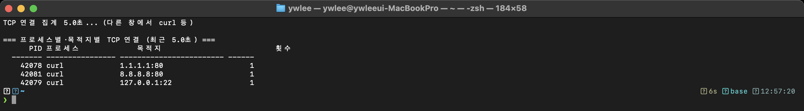
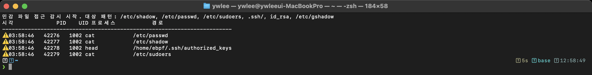

# eBPF 실습 도구 모음 (labs) — "eBPF로 할 수 있는 것 + 운영체제 지식"

> 이 강의의 컨셉 그대로다: **각 도구는 [🔬 eBPF로 무엇을 하는가] + [📖 배우는 운영체제 개념]** 짝으로 되어 있다.
> 도구를 돌려 보면 프로세스·스케줄링·메모리·동기화·파일·네트워크·보안이 *실제로 어떻게 도는지* 눈에 보인다.
> [examples/](../examples/)가 "한 줄 맛보기"라면, 여기는 **제대로 된 BCC 도구(Python+커널 C)** 14종이다.

last_updated: 2026-06-12

> 모든 출력 화면은 실습 VM(커널 6.17)에서 **실제로 실행해 캡처**한 것이다(생성 아님).

---

## 어떻게 실행하나

```bash
ssh ossca-ebpf                       # 실습 VM 접속 (처음이면 docs/lecture/00a 참고)
cd ~/ebpf-labs/labs
sudo python3 01_프로세스/proc_audit.py --duration 10
```
> eBPF 로드는 `sudo` 필요. 대부분 `--duration 초` 또는 `Ctrl-C` 로 멈춘다. 부하/트리거가 필요한 도구는 다른 창에서 `yes > /dev/null`, `curl`, `cat` 등을 실행한다.

> ✅ **합격(성공) 기준 공통**: ① `sudo`로 **에러 없이 로드**되고(검증기 거부·헤더 에러 없음), ② 트리거를 줬을 때 **그 활동이 출력에 반영**되면 성공이다. 각 도구의 구체 기준은 아래 절의 **✅ 성공 기준** 줄에 있다. 제출은 *실제 터미널 캡처 + 3줄 해석*(무엇을 트리거했고, 무엇이 찍혔고, OS 개념과 어떻게 연결되나).

## 전체 도구 (OS 주제별)

| 분류 | 도구 | 📖 배우는 OS 개념 (OSTEP) | 🔬 eBPF 부착 |
|:---|:---|:---|:---|
| 프로세스 | [proc_audit.py](01_프로세스/proc_audit.py) | exec, UID, 프로그램 실행 감사 (4–5장) | `tracepoint:sys_enter_execve` |
| 프로세스 | [proc_lifetime.py](01_프로세스/proc_lifetime.py) | 프로세스 수명·종료, 짧은 수명 발견 | `sched:sched_process_exec/exit` |
| 프로세스 | [signal_trace.py](01_프로세스/signal_trace.py) | 시그널·IPC, "누가 누구를 죽였나" | `tracepoint:signal:signal_generate` |
| 스케줄러 | [runq_latency.py](02_스케줄러/runq_latency.py) | 런큐·컨텍스트 스위치·대기시간 (7–10장) | `sched:sched_wakeup/switch` |
| 스케줄러 | [oncpu_time.py](02_스케줄러/oncpu_time.py) | CPU 점유 시간, 타임슬라이스 | `sched:sched_switch` |
| 스케줄러 | [syscall_latency.py](02_스케줄러/syscall_latency.py) | 시스템콜 비용·지연 분포(히스토그램) | `tracepoint:raw_syscalls:sys_enter/exit` |
| 메모리 | [page_faults.py](03_메모리/page_faults.py) | 페이지 폴트·가상메모리 (13–22장) | `software:page-faults` |
| 메모리 | [mmap_size.py](03_메모리/mmap_size.py) | mmap/brk·주소공간 확장 | `tracepoint:sys_enter_mmap` |
| 동기화 | [futex_contention.py](04_동기화/futex_contention.py) | 락·경합·블로킹 (28–33장) | `tracepoint:sys_enter/exit_futex` |
| 파일 I/O | [vfs_rw.py](05_파일IO/vfs_rw.py) | VFS·읽기/쓰기 경로 (39–40장) | `kprobe:vfs_read/vfs_write` |
| 파일 I/O | [open_audit.py](05_파일IO/open_audit.py) | 파일 디스크립터·open 플래그·inode | `tracepoint:sys_enter/exit_openat` |
| 파일 I/O | [fsync_trace.py](05_파일IO/fsync_trace.py) | 영속성·내구성·저널링(fsync 비용) (42장) | `tracepoint:sys_enter/exit_fsync` |
| 네트워크 | [conn_summary.py](06_네트워크/conn_summary.py) | TCP 연결·소켓·목적지 | `kprobe:tcp_v4_connect` |
| 보안 | [file_guard.py](07_보안/file_guard.py) | 접근 제어·런타임 위협 탐지 | `tracepoint:sys_enter_openat` |

---

## 1. 프로세스 — proc_audit

**📖 OS**: 프로세스는 exec() 로 새 프로그램 이미지를 입는다. 누가(UID) 무엇을 실행했나가 보안의 출발점.
**🔬 eBPF**: execve 진입을 잡아 시각·PID·UID·실행파일을 실시간으로 보여준다.

```bash
sudo python3 01_프로세스/proc_audit.py --duration 10   # 다른 창에서 ls, date 등
```
> ✅ **성공 기준**: 다른 창에서 `ls`·`date` 등을 실행하면, 그 **시각·PID·UID·실행파일명**이 한 줄씩 즉시 찍힌다. 아무 명령도 안 하면 조용하다(이벤트 기반이므로 정상).



## 2. 스케줄러 — runq_latency

**📖 OS**: 프로세스가 "실행 준비됐는데 CPU를 못 받고 런큐에서 기다린 시간"이 스케줄러 지연이다. 크면 CPU 경쟁이 심한 것.
**🔬 eBPF**: 깨어난 시각과 CPU를 잡은 시각의 차이를 히스토그램으로.

```bash
sudo python3 02_스케줄러/runq_latency.py --duration 5   # 다른 창에서 yes > /dev/null
```
> ✅ **성공 기준**: 종료 시 런큐 지연 **히스토그램**(2의 거듭제곱 버킷 `usecs`)이 출력된다. 다른 창에서 `yes > /dev/null`로 CPU 경쟁을 키우면 분포가 **오른쪽(더 긴 지연)으로** 이동하는 것이 보이면 제대로 측정한 것.



## 3. 동기화 — futex_contention

**📖 OS**: 사용자 공간 뮤텍스는 경합이 없으면 원자연산뿐이지만, 경합하면 커널 `futex` 로 잠들었다 깨어난다. futex 폭증 = 락 경합.
**🔬 eBPF**: futex 진입~반환 시간을 프로세스별로 합산.

```bash
sudo python3 04_동기화/futex_contention.py --duration 5
```
> ✅ **성공 기준**: 락 경합이 있는 프로세스의 **futex 누적 대기시간**이 프로세스별로 출력된다. 경합이 거의 없는 한가한 시스템이면 값이 작거나 비는데(정상), 다른 창에서 멀티스레드 부하를 주면 수치가 커진다.



## 4. 파일 I/O — vfs_rw

**📖 OS**: 모든 파일 입출력은 커널 VFS 의 `vfs_read`/`vfs_write` 로 모인다(공통 길목).
**🔬 eBPF**: 그 두 함수에 kprobe 를 걸어 프로세스별 읽기/쓰기 바이트를 합산.

```bash
sudo python3 05_파일IO/vfs_rw.py --duration 5
```
> ✅ **성공 기준**: 다른 창에서 `cat 큰파일` 또는 `dd`로 읽기/쓰기를 일으키면, 해당 **프로세스별 읽은/쓴 바이트 합계**가 출력에 잡힌다.



## 5. 네트워크 — conn_summary

**📖 OS**: 클라이언트가 서버로 나가는 TCP 연결은 커널 `tcp_v4_connect` 를 거친다. 목적지 IP:포트가 정보다.
**🔬 eBPF**: 프로세스별·목적지별 연결 횟수를 집계.

```bash
sudo python3 06_네트워크/conn_summary.py --duration 8   # 다른 창에서 curl 여러 번
```
> ✅ **성공 기준**: 다른 창에서 `curl http://example.com`을 여러 번 하면, **프로세스별·목적지(IP:포트)별 연결 횟수**가 집계되어 나온다. 횟수가 curl 실행 수와 대략 맞으면 정확히 잡은 것.



## 6. 보안 — file_guard

**📖 OS**: 접근 제어와 민감 자원(/etc/shadow, SSH 키). Falco/Tetragon 같은 런타임 보안 도구의 축소판.
**🔬 eBPF**: openat 으로 열리는 경로를 보고 민감 패턴에 걸리면 경보(시각·PID·UID·경로).

```bash
sudo python3 07_보안/file_guard.py            # 다른 창에서 cat /etc/shadow
```
> ✅ **성공 기준**: 다른 창에서 `cat /etc/shadow`(또는 SSH 키 경로)를 열면 **경보 한 줄**(시각·PID·UID·경로)이 뜬다. 평범한 파일을 열 때는 조용하면(=오탐 없음) 잘 동작하는 것.



---

## 🚀 고급 — 관측을 넘어 제작·강제로
관측 도구(위 14종)를 익혔다면 → **[08_고급/](08_고급/README.md)**: **libbpf/CO-RE C · XDP 패킷 드롭(강제) · uprobe · USDT · ring buffer**.
"eBPF로 할 수 있는 것"이 추적을 넘어 **프로덕션 제작·네트워크 강제**까지 확장된다(전부 VM 빌드·실행 검증).

## 더 보기
- 한 줄 예제 → [examples/](../examples/) · 자기검증 추적기 → [projects/](../projects/)
- 운영체제 개념 깊이 → [강의 OS 트랙](../docs/lecture/os/README.md)
- 모르는 코드·용어 → [C 미니부록](../docs/lecture/00b_준비_C언어_미니부록.md) · [용어집](../docs/lecture/00c_용어집_약어사전.md)
