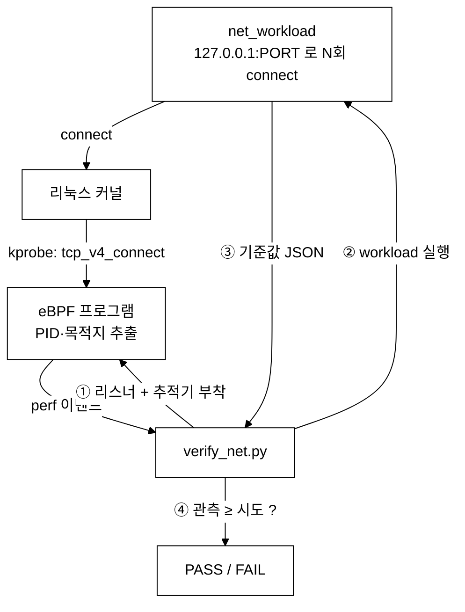

# netflow-tracer — 프로세스(PID)별 TCP 연결 추적기

last_updated: 2026-06-11

eBPF 를 커널 함수 `tcp_v4_connect()` 에 `kprobe` 로 붙여, **어떤 프로세스가 어디로
TCP 연결을 시도하는지**를 실시간으로 포착한다. 시스템콜 추적(프로젝트 1)과는 다른
부착 방식(kprobe + perf 이벤트)을 보여주는 보안·관측(observability) 성격의 예제다.

## 구성

| 파일 | 역할 |
|:---|:---|
| `bpf/tcpconnect.c` | eBPF 프로그램. `tcp_v4_connect` 진입 시 PID·목적지 IP·포트·프로세스명을 perf 버퍼로 전송 |
| `netflow.py` | 실시간 추적 CLI. `시각 / PID / 프로세스 / 목적지` 표 + PID별 집계 |
| `net_workload.c` | **검증용**. 지정 포트로 정해진 횟수만큼 TCP 연결하고 기준값(JSON) 출력 |
| `verify_net.py` | **검증 하네스**. 로컬 리스너 + 추적기 + workload → 관측 ≥ 시도 비교 → PASS/FAIL |

## 동작 원리



## 사용법

```bash
# 자기검증 (127.0.0.1 로 50회 연결 → 추적기가 다 잡는지 확인)
sudo python3 verify_net.py        # 또는: make verify
sudo python3 verify_net.py 200    # 횟수 키우기

# 실시간 추적 (다른 터미널에서 curl/ssh 등을 실행해 보면 잡힌다)
sudo python3 netflow.py --duration 10
```

## 왜 시스템콜 추적과 다른가

| | syscall-tracer | netflow-tracer |
|:---|:---|:---|
| 부착 지점 | tracepoint (`raw_syscalls:sys_enter`) | kprobe (`tcp_v4_connect`) |
| 데이터 전달 | BPF 해시맵(집계) | perf 이벤트(스트리밍) |
| 잡는 것 | 모든 시스템콜의 횟수 | 개별 TCP 연결의 목적지 |
| 쓰임새 | 프로세스 행동 프로파일링 | 네트워크 보안·관측(누가 어디로 접속?) |

> kprobe 는 커널 내부 함수에 직접 붙으므로, 시스템콜보다 더 깊은 지점의 정보(목적지 주소 등)를
> 얻을 수 있다. Cilium·Falco 같은 CNCF 보안 도구가 이런 방식을 쓴다.
