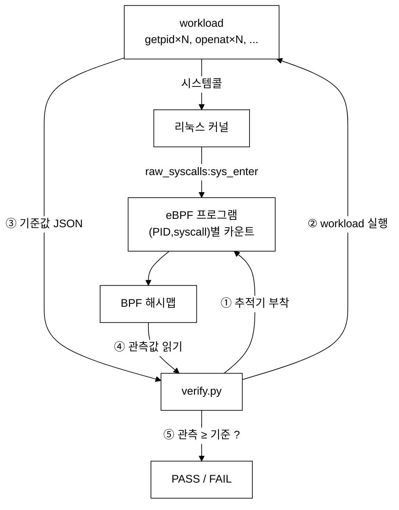

# syscall-tracer — 프로세스(PID)별 시스템콜 추적기

last_updated: 2026-06-11

eBPF 를 `tracepoint:raw_syscalls:sys_enter` 에 붙여, **어떤 프로세스가 어떤 시스템콜을
몇 번 호출했는지**를 커널 공간에서 집계한다. 그리고 **그 추적이 정확한지**를 스스로
증명하는 검증 하네스를 포함한다.

## 구성

| 파일 | 역할 |
|:---|:---|
| `bpf/syscall_count.c` | eBPF 프로그램. `(PID, 시스템콜번호) → 횟수` 해시맵을 커널에서 갱신 |
| `tracer.py` | 실시간 추적 CLI. PID/이름 필터, 기간 지정, PID별 요약 출력 |
| `workload.c` | **검증용**. 정해진 횟수만큼 `syscall(2)` 로 시스템콜을 직접 호출하고 기준값(JSON) 출력 |
| `verify.py` | **검증 하네스**. 추적기 부착 → workload 실행 → 관측값 ≥ 기준값 비교 → PASS/FAIL |

## 동작 원리



## 사용법

```bash
# 자기검증 (시스템콜당 3000회 호출 → 추적기가 다 잡는지 확인)
sudo python3 verify.py            # 또는: make verify
sudo python3 verify.py 10000      # 횟수 키우기

# 실시간 추적
sudo python3 tracer.py --duration 5            # 5초간 전체
sudo python3 tracer.py --pid 1234              # 특정 PID 만
sudo python3 tracer.py --comm nginx --top 10   # 이름 필터 + 상위 10개
```

## 검증 결과 해석

```
  시스템콜      기준값      관측값     차이    판정
  getppid      3,000      3,000      +0    ✅ PASS
  openat       3,001      3,003      +2    ✅ PASS
```

- **기준값**: workload 가 `syscall(2)` 로 명시적으로 호출한 횟수(= 거짓말 불가능한 정답).
- **관측값**: eBPF 추적기가 커널에서 센 횟수.
- **차이**: 보통 `+0 ~ +5`. 프로세스 시작 시 동적 링커/libc 가 부르는 소량의 시스템콜 때문이며,
  **호출 횟수 N 을 3천→1만으로 키워도 차이는 그대로**라서 비례 오차가 아닌 고정 오버헤드임이 드러난다.
- 판정 기준: `관측값 ≥ 기준값` (프로세스는 자신이 명시한 시스템콜보다 적게 호출할 수 없다).
